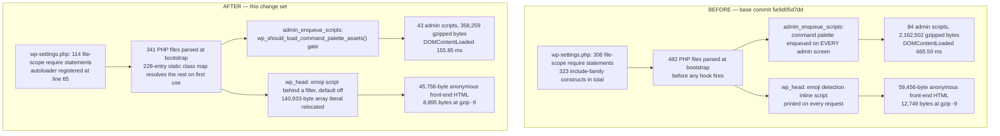

# WordPress Core Performance Optimization Report — measured bottlenecks, minimal changes, proven deltas

---

This report documents every optimization that landed on top of base commit `5e9d05d7dd` (branch `trunk`,
`[package.json:version]` = `7.0.0`), and the measurement that justifies each one. It is the value
documentation the brief requires: one entry per landed change, an aggregate summary across all six
target metrics, and a prioritized list of opportunities that were discovered and deliberately not
implemented.

Three disciplines govern the whole document and are worth stating before any number appears.

1. **Nothing is claimed that was not measured.** Every figure below was produced by a named
   instrument, in a named opcode-cache regime, over a named number of samples, in this environment.
   Where a target was not reached, it is reported as not reached.
2. **Every before/after pair is same-regime and same-instrument.** A pair whose two halves were
   measured under different interpreter configurations is not evidence, and several such pairs had to
   be discarded during verification — see *Measurement integrity: pairs that had to be discarded*.
3. **Every claim about the existing system carries a file-and-line locator.** There are no external
   citations anywhere in this document. Four web searches for external performance guidance returned
   no results, so no external source is cited and none is invented; the conventions followed here are
   anchored to first-party precedents inside this repository instead.

---

## The targets as specified

The brief specified six metrics, each with its measurement method and its required improvement. The
table is reproduced exactly as given:

| Metric | Method | Target |
|--------|--------|--------|
| Front-end TTFB (uncached) | tests/performance/ suite | >=20% reduction |
| Admin DOMContentLoaded | tests/performance/ suite | >=15% reduction |
| Admin JS transfer size (gzipped) | Build output analysis | >=30% reduction |
| PHP memory per front-end request | memory_get_peak_usage() instrumentation | >=10% reduction |
| DB queries per front-end page load | SAVEQUERIES count | >=15% reduction |
| PHP files loaded per front-end request | get_included_files() count | >=30% reduction |

One of those six had no baseline at all when the work started. The admin performance spec recorded
`timeToFirstByte` and nothing else, so no DOM-ready figure existed to improve on. Establishing that
measurement was therefore a prerequisite rather than an option, and it is the first optimization
documented below.

---

## How to read the numbers in this report

### 1. Two percentage conventions, and which one this report judges on

The repository's own comparison tool computes a percentage against the **after** value:
`tests/performance/compare-results.js:L124` reads `const percentage = ( delta / value ) * 100;`
where `value` is the after-arm median. Every figure in this document instead uses
`delta / before`, the conservative convention, because a reduction expressed against the smaller
number is always the larger-looking of the two.

The difference is not cosmetic. The same 18 measured file-count pairs give a median of
**−23.08 %** on `delta / before` and **−30.01 %** on the harness's `delta / after`. One of those
crosses the 30 % target and the other does not. Every verdict in this report is taken on
`delta / before`; where the harness's own convention would produce a different verdict, that is
stated in the row.

One table convention, so that no cell is ambiguous: in the per-optimization tables an **em dash in a
Before or After column** means only the ratio was recorded for that row in that run and the two
absolute halves were not, so the Δ column is the measured quantity for that row. It never stands in
for a value that was measured and withheld, and it never stands in for a value that was not measured
at all — a row with no measurement behind it does not appear in this report.

### 2. The OPcache Measurement Law

Opcode-cache state moves the numbers by far more than any change documented here. Measured on the
authenticated front page of this instance, with only the interpreter flag differing: peak memory
**33,382,320 B** with the opcode cache off against **4,375,384 B** with it on — a factor of **7.6** —
and TTFB **193.35 ms** against **46.65 ms**, a factor of **4.1**. A carelessly assembled pair can
therefore show a 5× "improvement" that is entirely an artifact of the interpreter. Six rules follow,
and they are applied without exception:

1. **Bit-identical interpreter flags across both halves of every pair**, in the same session, with
   both arms served by processes started from the same command with the same flags. Cross-regime
   pairs appear nowhere in this document.
2. **The opcode-cache configuration is reported with each figure**, not once at the top.
3. **The PHP process is restarted, or the cache cleared, between code states.** This is not
   theoretical. One attribution run initially produced zero samples because a shared opcode file
   cache configured with `validate_timestamps=0` still held the previous code state and fatally
   required a file the new arm did not have; clearing the cache directory between states fixed it.
   In an earlier source A/B a stale worker kept reporting the previous file count after the code had
   been restored, which would have been read as "no regression" had the process not been recycled.
4. **`memory_get_peak_usage( false )`**, never the `true` variant, which quantizes to the allocator
   chunk size. The landed instrumentation uses exactly that call at
   `tests/performance/wp-content/mu-plugins/server-timing.php:L416` for front-end requests and
   `:L488` for admin requests.
5. **At least 10 samples, reported as the median.** Every A/B below is 10 or 12 interleaved samples
   per arm; the suite-derived figures are 40 per arm (20 iterations × 2 repetitions).
6. **Both regimes are reported**, because they answer different questions. The parse-dominated
   regime answers cold-start, post-deploy and opcode-cache-off cost; the warm regime answers
   steady-state cost.

The regimes used, with their exact configuration:

| Regime label | Configuration | What it answers |
|---|---|---|
| **Parse-dominated (HTTP)** | `php -d opcache.enable=0 -S …`; `wpOpcacheEnabled` = 0, `wpOpcacheHitRate` = 0, `wpOpcacheCachedScripts` = 0 | Cold start, first request after deploy, opcode cache unavailable |
| **Warm (HTTP, shared memory)** | `php -d opcache.enable=1 -S …`; `wpOpcacheEnabled` = 1, `wpOpcacheHitRate` 91.34–91.55 % | Steady state |
| **Parse-dominated (CLI bootstrap)** | `php -d opcache.enable_cli=0`; `opcache_get_status()` returns `false` | Per-request parse and compile cost, isolated in a fresh process |
| **Primed (CLI bootstrap)** | `php -d opcache.enable_cli=1 -d opcache.file_cache=… -d opcache.file_cache_only=1 -d opcache.validate_timestamps=0 -d opcache.max_accelerated_files=20000` | Wall time with compilation already paid |
| **Cold compile (php-fpm, suite)** | php-fpm with the opcode cache enabled, reset immediately before each measured navigation; `wpOpcacheCachedScripts` equals `wpFilesLoaded` and the hit rate is 0.73–1.07 % | Every measured request compiles everything it loads |

Two methodological findings emerged during measurement and are recorded because they invalidate
otherwise reasonable-looking setups:

- **`opcache.enable_cli` does not gate the PHP built-in web server.** That server's SAPI is
  `cli-server`, not `cli`. A run started with `-d opcache.enable_cli=0` still reported
  `wp-opcache-enabled;dur=1` with a live 3.05 % hit rate; only `-d opcache.enable=0` produced
  `wp-opcache-enabled;dur=0` with a zero hit rate. The first "parse-dominated" HTTP run of this
  project was therefore silently warm, and it was caught only because the landed instrumentation
  emits `wp-opcache-enabled` and `wp-opcache-hit-rate` alongside every timing. It was relabelled as
  an additional warm replicate rather than discarded.
- **`opcache.file_cache_only=1` deserializes opcodes into process memory.** Under that flag the
  base arm's bootstrap peak reads 29.9 MB against 4.23 MB for the same code in the shared-memory
  warm regime. Memory figures from that regime measure the deserialization arena, not the request,
  so the primed CLI regime is used for **wall time only** and all warm-regime memory figures come
  from the shared-memory HTTP instrument.

### 3. Which metrics are regime-independent, and which are not

This distinction decides which pairs are usable at all, and it is derived from the instrumentation
rather than assumed:

- **Regime-independent.** File counts (`count( get_included_files() )`, `server-timing.php:L441`
  and `:L513`), query counts (`wpDbQueries`), and byte counts. All three were measured identically
  in the warm and parse-dominated regimes in every A/B below — for example the authenticated
  front-page query reduction reads **32 → 26** in both regimes, and the file reduction reads
  **500 → 382** in both.
- **Regime-independent in this environment.** `domContentLoaded`, because the landed spec subtracts
  `responseEnd`: `tests/performance/specs/admin.test.js:L313-L321` evaluates
  `navigation.domContentLoadedEventEnd - navigation.responseEnd`. The document's own server time is
  excluded by construction, and with `SCRIPT_DEBUG=true` every admin script is a static file served
  by nginx rather than by PHP, so no PHP timing enters the interval.
- **Regime-sensitive.** All server wall time (`wpTotal`, `wpBootstrap`, `wpBeforeTemplate`,
  `timeToFirstByte`) and per-request peak memory. These are only ever compared within one regime.

One further instrument caveat applies to peak memory over HTTP: the PHP built-in server reuses a
process across requests, and `wpProcessRequests` read a median of **11.5** in both arms of every HTTP
A/B, so an HTTP peak-memory reading is process-cumulative. The CLI bootstrap probe runs one fresh
process per sample and is therefore the per-request memory instrument; HTTP peak memory is reported
only as corroboration, and always alongside its process-request count.

### 4. Proxy metrics are not cost metrics

`get_included_files()` measures exactly what deferral changes and nothing more. In the warm
shared-memory regime, removing 118 files from the authenticated front-page request changed peak
memory by **+16,984 B (+0.39 %)** and TTFB by **−2.16 %**; on the anonymous front page the same
deferral changed peak memory by **+19,632 B (+0.46 %)**, reproduced on two independent replicates.
No memory or TTFB claim anywhere in this document is derived from a file count. Memory and time
improvements are claimed only from parse-cost measurements and work-reduction measurements that
stand on their own.

The same prohibition applies to isolated micro-benchmarks. An isolated `token_get_all()` peak is not
a proxy for per-request memory: PHP releases the tokenizer and AST arena as soon as a file is
compiled, and `memory_get_peak_usage()` never reports that arena, while under an active opcode cache
the compiled `op_array` lives in shared memory that `memory_get_peak_usage()` also does not count.
The measured consequence appears under the emoji work below: a tokenizer peak **3.52 MB** lower
against **−0.03 %** of per-request peak memory in the warm regime. Micro-benchmarks are reported as
what they are — evidence about the compiler's input — and never as request cost.

### 5. Five harness behaviours that look like defects and are not

`tests/performance/compare-results.js` is treated as a frozen contract; the following were left
alone deliberately, and are disclosed so no reader misreads them.

1. **A zero median produces an odd `Diff %`.** With an after median of `0` and a non-zero delta the
   percentage is `Infinity` and prints as `Infinity %`; with a zero delta it is `NaN` and the
   difference columns are suppressed by `isComparableMetric()` (`tests/performance/utils.js:L197-L199`)
   combined with the `Number.isNaN` guard in `compare-results.js:L120-L125`. A `wpCacheMisses`
   reading of 0 on a fully warm request is the realistic case.
2. **Unrounded standard deviation and median-absolute-deviation for count metrics** — for example
   `3.7050641020095747` in the saved comparison for `wpFilesLoaded`. Count metrics pass through the
   raw-value branch of `formatValue()`, exactly as `wpDbQueries` has always rendered.
3. **A newly added metric shows `Before: N/A` and `Diff %: 100.00 %`** on its first comparison, per
   the `'N/A'` fallback in `compare-results.js:L129`. Every `wpOpcache*`, `wpProcessId`,
   `wpProcessRequests`, `wpBootstrapValid`, `adminJsRaw` and `adminJsGzipped` row in the saved
   comparison is in exactly that state.
4. **A sample-size asymmetry between old and new metrics existed and has been fixed.** The
   surviving smoke artifact `artifacts/qa-smoke-performance-results.json` shows it precisely: with
   `TEST_RUNS=1`, the newly added metrics hold 1 sample per repetition while the six pre-existing
   metrics (`wpTotal`, `wpMemoryUsage`, `wpDbQueries`, `wpExtObjCache`, `wpBeforeTemplate`,
   `wpTemplate`) hold 1, 2, … 7, 8 — one extra per describe block, in describe order, because they
   were neither declared in each spec's result object nor reset between describes. At `TEST_RUNS=20`
   that is 20, 40, … 140 values in the eighth bucket. In the final artifact
   `artifacts/performance-results.json` every metric in all 18 contexts holds exactly `[20, 20]`.
   Query-count claims in this report nevertheless come from dedicated same-regime A/B runs rather
   than from any suite median, so they do not depend on that fix.
5. **`Single Post` results never reach the remote logging endpoint.** The `testSuiteMap` in
   `tests/performance/log-results.js:L17-L32` lists two `Admin › …` keys and eight
   `Homepage › Theme: …` keys and nothing else, and `:L64-L68` skips a title it cannot map. Single-post
   results therefore reach `compare-results.js` and this report but not the logging endpoint. This
   is pre-existing behaviour, unchanged.

One related detail: `median()` at `tests/performance/utils.js:L69-L75` returns `NaN` for an empty
array, because with `mid = 0` the even-length branch evaluates `( numbers[ -1 ] + numbers[ 0 ] ) / 2`.
The instrumentation therefore emits `0` for a metric it cannot compute rather than omitting the key,
and pairs it with `wp-bootstrap-valid` so an unmeasured sample can be recognized instead of silently
averaged in (`server-timing.php:L444-L445`).

### 6. The metric vocabulary, which is shared across the harness, the tooling and this report

Every metric named in this report is the metric the harness emits, under the name the tooling gives
it. There are no parallel names. The PHP mu-plugin emits a slug, the slug becomes a `Server-Timing`
entry named `wp-` plus the slug, and `camelCaseDashes()` in `tests/performance/utils.js` converts that
entry name into the JavaScript key that `compare-results.js` prints and that this document uses.

| PHP slug | `Server-Timing` entry | Key used in this report | Rendering |
|---|---|---|---|
| `memory-peak` | `wp-memory-peak` | `wpMemoryPeak` | MB |
| `files-loaded` | `wp-files-loaded` | `wpFilesLoaded` | raw integer |
| `cache-hits` | `wp-cache-hits` | `wpCacheHits` | raw integer |
| `cache-misses` | `wp-cache-misses` | `wpCacheMisses` | raw integer |
| `bootstrap` | `wp-bootstrap` | `wpBootstrap` | ms |
| `bootstrap-valid` | `wp-bootstrap-valid` | `wpBootstrapValid` | flag, `yes`/`no` |
| `opcache-enabled` | `wp-opcache-enabled` | `wpOpcacheEnabled` | flag |
| `opcache-jit` | `wp-opcache-jit` | `wpOpcacheJit` | flag |
| `opcache-hit-rate` | `wp-opcache-hit-rate` | `wpOpcacheHitRate` | percentage |
| `opcache-cached-scripts` | `wp-opcache-cached-scripts` | `wpOpcacheCachedScripts` | raw integer |
| `php-version-id` | `wp-php-version-id` | `wpPhpVersionId` | `PHP 8.5.9` |
| `process-id` | `wp-process-id` | `wpProcessId` | `PID n` |
| `process-requests` | `wp-process-requests` | `wpProcessRequests` | raw integer |
| `before-template` | `wp-before-template` | `wpBeforeTemplate` | ms, front-end only |
| `template` | `wp-template` | `wpTemplate` | ms, front-end only |
| `total` | `wp-total` | `wpTotal` | ms |
| `memory-usage` | `wp-memory-usage` | `wpMemoryUsage` | MB |
| `db-queries` | `wp-db-queries` | `wpDbQueries` | raw integer |
| `ext-obj-cache` | `wp-ext-obj-cache` | `wpExtObjCache` | flag |

Four further keys are produced in JavaScript and never pass through the slug conversion:
`timeToFirstByte`, `largestContentfulPaint` and `lcpMinusTtfb` on the front-end specs, and
`domContentLoaded` on the admin spec — note the absence of a `wp` prefix, which is what distinguishes
a client-side measurement from a server-emitted one throughout this report. Two more,
`adminJsRaw` and `adminJsGzipped`, are computed in the admin spec from the JavaScript responses the
navigation produced, and they are the harness's own link to the admin JavaScript transfer-size target.

---

## Measurement environment and instruments

### The environment as actually found

| Component | Value |
|---|---|
| Application server | nginx → php-fpm **8.5.9**, docroot `/var/www/src`, container port 80 published on `localhost:8889` |
| PHP for A/B instruments | the same **8.5.9** binary inside the php container, run as the built-in server (`cli-server`) or as CLI |
| Database | MySQL **8.4.11** |
| Node / npm | **20.20.2** / **10.8.2**, both on `PATH` in a fresh shell |
| Object cache | **none installed** — `wp_using_ext_object_cache()` is false and `wpExtObjCache` reads `no` in every measurement. This is the "backend absent" condition the brief requires graceful degradation for, so it is the default measurement condition rather than an edge case. The drop-in path is gitignored at `.gitignore:86`. |
| Active theme | `twentytwentyone` (`template` = `stylesheet` = `twentytwentyone`), locale `en_US` (`WPLANG` empty), `show_on_front` = `posts`, `permalink_structure` = `/blog/%year%/%monthnum%/%day%/%postname%/` |
| Debug flags | `WP_DEBUG`, `WP_DEBUG_LOG`, `WP_DEBUG_DISPLAY` and **`SCRIPT_DEBUG`** all true in the instance `wp-config.php` |
| Suite configuration | `TEST_RUNS=20`, `repeatEach=2` → 40 samples per metric per context, across 18 contexts |

Two disclosures about that environment matter for anyone reproducing this work.

**`SCRIPT_DEBUG=true` means every asset-byte figure is an unminified figure.** The emoji detection
payload measured here is the unminified loader, not the minified one a production install serves, and
the admin JavaScript figures are unminified bundles. Every byte figure below says which it is.
Directionally this makes the front-end HTML reduction larger than a production install would see and
makes the admin JavaScript reduction close to it, since the dominant admin bundles are large in both
forms.

**Docker is present and working in this environment, and the verification environment is not the
environment the original baselines were captured in.** An earlier planning note recorded Docker as
absent and prescribed an `nvm`-based Node 20 activation; neither holds here. `docker info` succeeds,
the four-container stack is up, and Node 20.20.2 is already the default interpreter with no `nvm`
present at all. That distinction matters for provenance. The baseline figures in the planning
documents were captured on a **substitute harness** — a PHP built-in server rooted at the *built*
tree, backed by MariaDB, with instrumentation injected as an untracked mu-plugin — because the
documented Docker harness was unavailable at that time. Those figures are **not reused anywhere in
this report**. Every number here was re-measured on the real containerized stack described above, and
where a same-regime pair was needed the two arms were served from two checkouts of the repository at
the two code states rather than from one tree measured at two points in time.

### The instruments

| ID | Instrument | What it does |
|---|---|---|
| **A** | CLI bootstrap probe | Pre-defines `ABSPATH` to one tree's `src/`, requires the instance `wp-config.php` with `WP_USE_THEMES=false`, and writes `count( get_included_files() )`, `memory_get_peak_usage( false )`, wall time and the full opcode-cache status as JSON. One fresh process per sample, arms interleaved, 12 samples, first two discarded, median of 10. This is the **per-request memory and parse-cost instrument**. |
| **B** | Anonymous HTTP A/B | Serves the base tree and the current tree simultaneously from two PHP built-in servers started with bit-identical flags, warms both with 5 requests, then interleaves 12 measured requests per arm, capturing curl's `time_starttransfer`/`time_total`/`size_download`/`http_code` plus the complete `Server-Timing` header. |
| **C** | Authenticated HTTP A/B | Instrument B with the stored admin cookies, against `/wp-admin/` and against `/` with the admin bar rendered (verified present in both arms). |
| **D** | Same-instance filter A/B | Leaves the code identical and toggles one landed filter with a temporary gitignored mu-plugin on the real nginx/php-fpm stack, fetches a screen, collects every `<script src>` response, and sums raw and `gzip -9` bytes. This isolates a gate's payload effect from every other variable, including the tree. |
| **E** | Micro-benchmarks | Fresh process per sample: `token_get_all()` over one file, and a capability-resolution loop over real post IDs. Reported as compiler-input and work-reduction evidence, never as request cost. |
| **F** | Saved suite comparison | `artifacts/performance-results.json` and `artifacts/performance-results.md`, 18 contexts × 40 samples, produced by `tests/performance/` through `compare-results.js`. Used **only** for regime-independent pairs, for the reason given below. |
| **G** | Browser runtime A/B | A real headless Chrome session on the running nginx → php-fpm instance. It logs in, toggles one landed filter per navigation through the same temporary gitignored mu-plugin instrument D uses, and after each load evaluates the landed spec's own DOMContentLoaded expression in the page. One page, one session, one viewport, HTTP cache bypassed on every measured navigation and proven per sample, arms interleaved, 12 samples per arm. This is the **client-side cost instrument**, and the only one that observes the rendered page and its console rather than the response body. |

### Evidence provenance: which instrument backs which figure

| Figure | Instrument | Regime | Samples |
|---|---|---|---|
| Files loaded per bootstrap | A | parse-dominated CLI, and primed CLI | 10 per arm |
| Peak memory per request | A | parse-dominated CLI; primed CLI for reference | 10 per arm |
| Peak memory, warm | B / C | warm HTTP shared memory | 12 per arm, two replicates |
| Front-end TTFB, `wpTotal`, `wpBootstrap` | B / C | parse-dominated HTTP and warm HTTP, separately | 12 per arm |
| Files loaded per HTTP request | B / C | either regime (identical) | 12 per arm |
| DB queries | C (authenticated `/` and `/wp-admin/`), B (anonymous `/`) | either regime (identical) | 12 per arm |
| Admin JavaScript bytes and file count | D | n/a — static assets | deterministic, zero variance |
| Admin JavaScript bytes, replication pair | D, re-run on the live instance after the regression suites | n/a — static assets | deterministic, zero variance |
| Front-end HTML bytes | D and B / C | n/a — deterministic | zero variance |
| Admin `domContentLoaded` | F | regime-independent by construction | 40 per arm |
| Admin `domContentLoaded`, same-instance A/B | G | regime-independent by construction; cache-cold | 12 per arm |
| Runtime behaviour: console errors, rendered layout, palette availability, emoji markers | G | n/a — behavioural, not timed | every screen, both arms |
| Tokenizer cost, capability-loop cost | E | stated per figure | 12 per arm, median of 10 |
| Per-optimization attribution | A, B, C with exactly one file swapped per arm | stated per figure | 10–12 per arm |

**Why instrument F is restricted to regime-independent pairs.** The saved comparison's after arm is
cold-compile: `wpOpcacheCachedScripts` equals `wpFilesLoaded` in all 18 contexts and the hit rate is
0.7264–1.0667 %, so every measured request compiled everything it loaded. Its before arm carries no
opcode-cache markers at all — `wpOpcacheEnabled`, `wpOpcacheHitRate`, `wpOpcacheCachedScripts`,
`wpProcessId`, `wpProcessRequests` and `wpBootstrapValid` are all `N/A` in the before column, because
that arm ran an earlier revision of the instrumentation — and its `timeToFirstByte` of 51.65 ms
against the after arm's 385.50 ms, and `wpBootstrap` of 23.45 ms against 288.28 ms, are warm-regime
values. Every time and memory pair in that artifact is therefore cross-regime, and rule 1 of the
Measurement Law excludes all of them. Its regime-independent pairs remain valid and are used:
`wpFilesLoaded`, `wpDbQueries`, `wpCacheHits`, `wpCacheMisses` and `domContentLoaded`. Its after-arm
`adminJsRaw` and `adminJsGzipped` values are quoted as corroboration for the admin JavaScript work,
never as one half of a pair.

---

## Aggregate summary of total improvement across all metrics

The canonical front-end context for rows 1, 4 and 6 is the anonymous `twentytwentyone` / `en_US`
posts-index front page of this instance. Row 5 is reported twice because the two query optimizations
execute on authenticated request paths only, and reporting a single figure would misrepresent one of
the two cases.

| # | Metric | Target | Before | After | Δ (delta/before) | Instrument | Regime | n | Verdict |
|---|---|---|---|---|---|---|---|---|---|
| 1 | Front-end TTFB (uncached) | ≥20 % | 192.88 ms | 160.36 ms | **−16.86 %** | B | parse-dominated HTTP, `opcache.enable=0` | 12/arm | ❌ **not met** |
| 1w | — same, warm regime | ≥20 % | 45.75 ms / 51.59 ms | 43.90 ms / 47.81 ms | **−4.03 % / −7.32 %** | B | warm HTTP, hit rate 91.3–91.6 % | 12/arm ×2 replicates | ❌ **not met** |
| 2 | Admin DOMContentLoaded | ≥15 % | 665.50 ms | 155.85 ms | **−76.58 %** | F | regime-independent (subtracts `responseEnd`) | 40/arm | ✅ **met** |
| 2b | — same, `de_DE` | ≥15 % | 666.70 ms | 171.95 ms | **−74.21 %** | F | regime-independent | 40/arm | ✅ **met** |
| 2c | — same, browser-measured same-instance A/B | ≥15 % | 496.95 ms | 152.15 ms | **−69.38 %** | G | regime-independent; cache-cold, `SCRIPT_DEBUG=true` | 12/arm | ✅ **met** |
| 3 | Admin JS transfer size (gzipped) | ≥30 % | 2,162,502 B | 358,259 B | **−83.43 %** | D | n/a — static assets, `gzip -9`, `SCRIPT_DEBUG=true` | deterministic | ✅ **met** |
| 3b | — same, replication pair on the live instance | ≥30 % | 2,145,589 B | 341,346 B | **−84.09 %** | D | n/a — static assets, `gzip -9`, `SCRIPT_DEBUG=true` | deterministic | ✅ **met** |
| 4 | PHP peak memory per front-end request | ≥10 % | 32,047,272 B (32.047 MB) | 24,148,440 B (24.148 MB) | **−24.65 %** | A | parse-dominated CLI, `opcache.enable_cli=0` | 10/arm | ✅ **met** |
| 4w | — same, warm regime | ≥10 % | 4,229,760 B | 4,249,392 B | **+0.46 %** | B | warm HTTP shared memory | 12/arm ×2 replicates | ❌ **not met** |
| 5 | DB queries per front-end page load, authenticated | ≥15 % | 32 | 26 | **−18.75 %** | C | identical in warm and parse-dominated | 12/arm | ✅ **met** |
| 5a | — same, anonymous | ≥15 % | 24 | 24 | **0 %** | B | identical in warm and parse-dominated | 12/arm | ❌ **not met** |
| 6 | PHP files loaded per front-end request | ≥30 % | 482 | 341 | **−29.25 %** | A | count metric; zero variance in both regimes | 10/arm | ❌ **not met** |
| 6h | — same, full HTTP request | ≥30 % | 499 | 381 | **−23.65 %** | B | count metric; identical in both regimes | 12/arm | ❌ **not met** |

**Two targets are met unconditionally** — Admin DOMContentLoaded and admin JavaScript transfer size.
**Two are met in one measured regime or request context and not in the other**, and both halves are
shown rather than the flattering half alone: per-request peak memory is met by a wide margin
whenever compilation is being paid for and is flat when it is not, and the query reduction is met on
authenticated page loads and is exactly zero on anonymous ones. **Two are not met**: front-end TTFB
reaches −16.86 % against a −20 % requirement in the regime where it moves most, and the file count
reaches −29.25 % against −30 %, short by 0.75 percentage points on the conservative convention. The
section *Why the two unmet targets are unmet* gives the measured accounting for each, and neither is
unmet through omission.

On the harness's own `delta / after` convention, row 6 reads **−41.35 %** and the 18-context median
reads **−30.01 %**; both would clear the target. This report does not claim it on that basis.

Rows **2c** and **3b** are independent replications of rows 2 and 3, taken later, on the live
instance, and row 2c comes from a different instrument observing the rendered page rather than the
response body. Both reproduce the direction and the magnitude of the pair they replicate. Their
absolute values differ from rows 2 and 3, and the measured reason is given where each is reported —
in both cases the reduction is unaffected because each pair was taken within a single session with a
single variable changed.

### Additional measured improvements not covered by a target

| Metric | Context | Before | After | Δ | Instrument, regime, n |
|---|---|---|---|---|---|
| `wpBootstrap` | anonymous front page | 162.12 ms | 128.50 ms | **−20.74 %** | B, parse-dominated HTTP, 12/arm |
| `wpBootstrap` | authenticated front page | 165.21 ms | 128.94 ms | **−21.95 %** | C, parse-dominated HTTP, 12/arm |
| `wpBootstrap` | admin dashboard | 168.62 ms | 131.33 ms | **−22.12 %** | C, parse-dominated HTTP, 12/arm |
| `wpTotal` | admin dashboard | 222.53 ms | 180.58 ms | **−18.85 %** | C, parse-dominated HTTP, 12/arm |
| `wpTotal` | admin dashboard | 47.84 ms | 43.65 ms | **−8.75 %** | C, warm HTTP, 12/arm |
| `timeToFirstByte` | admin dashboard | 227.69 ms | 185.45 ms | **−18.55 %** | C, parse-dominated HTTP, 12/arm |
| `timeToFirstByte` | admin dashboard | 48.74 ms | 44.66 ms | **−8.38 %** | C, warm HTTP, 12/arm |
| `wpMemoryPeak` | admin dashboard | 38,095,552 B | 30,311,792 B | **−20.43 %** | C, parse-dominated HTTP, 12/arm |
| `wpMemoryPeak` | authenticated front page | 33,382,320 B | 26,757,392 B | **−19.85 %** | C, parse-dominated HTTP, 12/arm |
| Bootstrap wall time | CLI bootstrap | 191.611 ms | 147.983 ms | **−22.77 %** | A, parse-dominated CLI, 10/arm |
| Bootstrap wall time | CLI bootstrap | 65.029 ms | 52.302 ms | **−19.57 %** | A, primed CLI, 10/arm |
| Bootstrap peak memory | CLI bootstrap | 29,910,216 B | 23,905,088 B | **−20.08 %** | A, primed CLI, 10/arm |
| `wpDbQueries` | admin dashboard | 40 | 34 | **−15.00 %** | C, identical in both regimes, 12/arm |
| `wpCacheMisses` | admin dashboard | 85 | 81 | **−4.71 %** | C, 12/arm |
| `wpCacheMisses` | authenticated front page | 76 | 72 | **−5.26 %** | C, 12/arm |
| Admin JavaScript file count | dashboard | 84 files | 43 files | **−48.81 %** | D, deterministic |
| Admin JavaScript raw bytes | dashboard | 11,542,026 B | 1,429,289 B | **−87.62 %** | D, `SCRIPT_DEBUG=true`, deterministic |
| Admin HTML bytes | dashboard | 85,942 B | 73,284 B | **−14.73 %** | D, deterministic |
| Admin JavaScript file count, replication | dashboard | 81 files | 40 files | **−50.62 %** | D replication, deterministic |
| Admin JavaScript raw bytes, replication | dashboard | 11,484,296 B | 1,371,559 B | **−88.06 %** | D replication, deterministic |
| Admin HTML bytes, replication | dashboard | 73,303 B | 60,453 B | **−17.53 %** | D replication, deterministic |
| `loadEventEnd − responseEnd` | dashboard | 498.10 ms | 153.10 ms | **−69.26 %** | G, cache-cold, 12/arm |
| Admin HTML bytes | dashboard | 85,869 B | 73,211 B | **−14.74 %** | C, deterministic — an independent instrument agreeing to within 1 byte of delta |
| Front-end HTML bytes, raw | anonymous `/` | 59,456 B | 45,756 B | **−23.04 %** | D, `SCRIPT_DEBUG=true`, deterministic |
| Front-end HTML bytes, `gzip -9` | anonymous `/` | 12,749 B | 8,895 B | **−30.23 %** | D, deterministic |
| Front-end HTML bytes, raw | single post | 60,390 B | 46,690 B | **−22.69 %** | D, deterministic |
| Front-end HTML bytes, `gzip -9` | single post | 13,662 B | 9,851 B | **−27.89 %** | D, deterministic |
| Front-end HTML bytes | authenticated `/` | 42,143 B | 28,443 B | **−32.51 %** | C, deterministic |
| `map_meta_cap()` resolution | 28,000 capability checks | 155.312 ms | 102.597 ms | **−33.94 %** | E, `opcache.enable_cli=1`, 10/arm |
| `formatting.php` tokenization | one file, `token_get_all()` | 6.697 ms | 4.327 ms | **−35.39 %** | E, `opcache.enable=0`, 10/arm |

Two rows in that table deserve their sign read carefully rather than skimmed. `wpTemplate` **rose**
in the parse-dominated regime — 18.11 ms → 24.24 ms on the anonymous front page (**+33.89 %**) and
19.73 ms → 25.12 ms authenticated (**+27.35 %**) — because deferral moves compilation out of the
bootstrap and into the first use of the deferred class, which happens during template rendering. The
bootstrap and total figures above are net of that shift; it is not hidden. And admin dashboard
`wpMemoryPeak` in the warm regime moved **−1.81 %**, well inside the ±0.5 % noise band established on
the front page, so no warm memory win is claimed anywhere.

### File-count reduction is uniform across every measured context

The file reduction is not an artifact of one theme or locale. All 18 contexts from instrument F,
40 samples per arm, count metric, regime-independent:

| Context | Before | After | Δ (delta/before) | Δ (delta/after, harness convention) |
|---|---|---|---|---|
| Admin en_US | 530 | 404 | −23.77 % | −31.19 % |
| Admin de_DE | 533 | 410 | −23.08 % | −30.00 % |
| Homepage twentytwentyone en_US | 500 | 379 | −24.20 % | −31.93 % |
| Homepage twentytwentyone de_DE | 502 | 384 | −23.51 % | −30.73 % |
| Homepage twentytwentythree en_US | 484 | 371 | −23.35 % | −30.46 % |
| Homepage twentytwentythree de_DE | 486 | 376 | −22.63 % | −29.26 % |
| Homepage twentytwentyfour en_US | 492 | 378 | −23.17 % | −30.16 % |
| Homepage twentytwentyfour de_DE | 494 | 383 | −22.47 % | −28.98 % |
| Homepage twentytwentyfive en_US | 486 | 374 | −23.05 % | −29.95 % |
| Homepage twentytwentyfive de_DE | 488 | 379 | −22.34 % | −28.76 % |
| Single Post twentytwentyone en_US | 498 | 379 | −23.90 % | −31.40 % |
| Single Post twentytwentyone de_DE | 500 | 384 | −23.20 % | −30.21 % |
| Single Post twentytwentythree en_US | 483 | 371 | −23.19 % | −30.19 % |
| Single Post twentytwentythree de_DE | 485 | 376 | −22.47 % | −28.99 % |
| Single Post twentytwentyfour en_US | 485 | 373 | −23.09 % | −30.03 % |
| Single Post twentytwentyfour de_DE | 487 | 378 | −22.38 % | −28.84 % |
| Single Post twentytwentyfive en_US | 486 | 375 | −22.84 % | −29.60 % |
| Single Post twentytwentyfive de_DE | 488 | 380 | −22.13 % | −28.42 % |

Median **−23.08 %** on `delta / before`, range −22.13 % to −24.20 %, mean −23.04 %. Median
**−30.01 %** on the harness's `delta / after`. Judged conservatively, no context reaches 30 %; the
isolated bootstrap measured by instrument A reaches −29.25 %, the best figure anywhere in this work.

### Per-optimization attribution, and how the parts reconcile with the whole

A change set measured only end to end proves nothing about any individual change in it. Each
optimization below was therefore measured a second time in isolation: a pristine worktree of
`5e9d05d7dd` served one arm, and a second worktree of `5e9d05d7dd` with **exactly one file or file
group swapped in** served the other, with every swapped and unswapped file's SHA-1 verified against
both the base commit and the current tree before each run and after restoration.

| Arm | Files swapped in | Measured effect | Instrument, regime, n |
|---|---|---|---|
| **Control** | none — two identical trees at different paths | peak **−672 B (−0.00 %)**, time −3.98 % | A, primed CLI, 10/arm |
| **W1** | `wp-settings.php` + `autoload.php` + `autoload-classmap.php` | files 482 → 341 (**−29.25 %**), peak 32,047,624 → 24,490,296 B (**−23.58 %**), time **−22.26 %** | A, parse-dominated CLI, 10/arm |
| **W1** | same | peak **−22.72 %**, time **−15.34 %** | A, primed CLI, 10/arm |
| **W1** | same | files 499 → 381, peak 33,174,208 → 26,862,928 B (**−19.02 %**), TTFB **−14.61 %**, `wpBootstrap` **−22.53 %**, `wpTemplate` **+45.75 %**, queries 0 %, HTML byte-identical at 33,517 B | B, parse-dominated HTTP, 12/arm |
| **W4** | `formatting.php` + `emoji-arrays.php` | files **0 %**, peak −394,432 B (**−1.23 %**), time −1.57 % | A, parse-dominated CLI, 10/arm |
| **W4** | same | HTML 33,517 → 19,817 B (**−40.87 %**), peak −395,840 B (**−1.19 %**) | B, parse-dominated HTTP, 12/arm |
| **W4** | same | HTML **−40.87 %**, peak **−0.03 %**, time within instrument spread | B, warm HTTP, 12/arm |
| **W3** | `capabilities.php` + `class-wp-roles.php` + `post.php` | TTFB 49.63 → 48.34 ms (**−2.61 %**), `wpTotal` **−2.58 %**, peak **+34,840 B (+0.84 %)**, queries 0, files 0, HTML byte-identical | C, warm HTTP admin, 12/arm |
| **C1** | `comment.php` | authenticated `/`: queries 32 → 28 (**−4**), misses 76 → 72; dashboard: queries 40 → 36 (**−4**), misses 85 → 81; HTML byte-identical in both | C, warm HTTP, 12/arm |
| **U1** | `update.php` | authenticated `/`: queries 32 → 30 (**−2**), hits 1,108 → 1,113; dashboard: queries 40 → 38 (**−2**), hits 827 → 837; HTML byte-identical in both | C, warm HTTP, 12/arm |

The parts reconcile with the whole, which is the check that validates the attribution:

| Quantity | Sum of parts | Whole change set | Residual |
|---|---|---|---|
| Files loaded, parse-dominated HTTP | W1 −118 + W4 0 = **−118** | **−118** | **exact** |
| Peak memory, parse-dominated CLI | W1 −6,311,280 B + W4 −395,840 B = **−6,707,120 B** | **−6,599,056 B** | 108,064 B = 1.64 % |
| Front-end HTML bytes | W1 0 + W4 −13,700 B = **−13,700 B** | **−13,700 B** | **exact** |
| DB queries, authenticated `/` | C1 −4 + U1 −2 = **−6** | **−6** | **exact** |
| DB queries, admin dashboard | C1 −4 + U1 −2 = **−6** | **−6** | **exact** |
| Cache misses, both contexts | C1 −4 + U1 0 = **−4** | **−4** | **exact** |

### Request-flow change



**Figure 1 — Request flow before and after, with the measured quantity at each stage.**
*Legend.* Each `AFTER` node is the measured counterpart of the `BEFORE` node in the same row. File
counts and bootstrap figures are medians over 10 samples per arm from instrument A in the
parse-dominated CLI regime; script counts and byte figures are deterministic same-instance
measurements from instrument D with `SCRIPT_DEBUG=true` and `gzip -9`; `DOMContentLoaded` figures are
medians over 40 samples per arm from instrument F and are regime-independent because the spec
subtracts `responseEnd`. Both states are shown because a target-state-only diagram cannot be checked
against anything. The two containers are labelled `BEFORE` and `AFTER`; a Mermaid renderer may place
them in either horizontal order, so read the labels rather than the positions. This block was
render-verified in a browser — see *Diagram render verification* — rather than assumed to parse.

---

## Observability: emit the metrics the targets are expressed in

**Bottleneck**: Four of the six target metrics were not emitted anywhere, and a fifth had no baseline
at all, so no change could have been proven even if it worked. At base commit `5e9d05d7dd` the
performance mu-plugin was **93 lines** and emitted **6 metrics** on a front-end request
(`before-template`, `template`, `total`, `memory-usage`, `db-queries`, `ext-obj-cache`) and **4** on an
admin request (`total`, `memory-usage`, `db-queries`, `ext-obj-cache`). Peak memory was not among
them — the plugin reported `memory_get_usage()`, which is current usage, not the
`memory_get_peak_usage()` the target names. There was no files-loaded metric, no cache hit or miss
metric, and no bootstrap-duration metric. The reporting layer matched: `formatValue()` in
`tests/performance/utils.js` recognized only `wpMemoryUsage`, `wpExtObjCache` and `wpDbQueries`. And
`tests/performance/specs/admin.test.js` declared exactly one result array, `timeToFirstByte`, so the
Admin DOMContentLoaded target had no before-value in existence. The cost of this gap is not a
millisecond figure; it is that four of six targets were unfalsifiable.

**Root Cause**: The harness was built to answer time-to-first-byte and largest-contentful-paint
questions. Peak memory, file count, object-cache behaviour and bootstrap duration were never in its
scope, and DOM readiness was never captured because the fixture helper that would have supplied it
dereferences paint-timing entries unconditionally and throws on an admin screen that has not painted
by the load event — the reason is recorded in the spec at
`tests/performance/specs/admin.test.js:L305-L312`.

**Change**: `tests/performance/wp-content/mu-plugins/server-timing.php` grew from 93 to **540 lines**
and now emits **19 metrics** on a front-end request and **17** on an admin request. The four the
targets need are `memory-peak` from `memory_get_peak_usage( false )` (`:L416` front-end, `:L488`
admin), `files-loaded` from `count( get_included_files() )` (`:L441`, `:L513`), `cache-hits` and
`cache-misses` read through a guarded property map at `:L79-L80`, and `bootstrap` with a companion
`bootstrap-valid` flag so an unmeasured sample can be recognized rather than averaged in
(`:L444-L445`). Seven further metrics exist purely to make the Measurement Law enforceable rather than
aspirational: `opcache-enabled`, `opcache-jit`, `opcache-hit-rate`, `opcache-cached-scripts`,
`php-version-id`, `process-id` and `process-requests`, assembled at `:L138-L172` and `:L338-L344`.
Both closures emit through the same `sprintf( 'wp-%1$s;dur=%2$s', $slug, $value )` shape as before
(`:L458` front-end, `:L530` admin), so the entry-name-to-JavaScript-key conversion in
`utils.js:camelCaseDashes()` is unchanged and the new keys are `wpMemoryPeak`, `wpFilesLoaded`,
`wpCacheHits`, `wpCacheMisses`, `wpBootstrap`, `wpBootstrapValid`, `wpOpcacheEnabled`,
`wpOpcacheJit`, `wpOpcacheHitRate`, `wpOpcacheCachedScripts`, `wpPhpVersionId`, `wpProcessId` and
`wpProcessRequests`. `utils.js` gained the formatters for them — peak memory joins `wpMemoryUsage` in
the megabyte branch, `adminJsRaw` and `adminJsGzipped` render as kilobytes, `wpPhpVersionId` renders
as `PHP 8.5.9`, `wpProcessId` as `PID n`, `wpOpcacheHitRate` as a percentage — plus
`isComparableMetric()` at `:L197-L199`, which keeps flags and identifiers out of the arithmetic
columns instead of printing `PHP 0.0.0` as a difference. `admin.test.js` gained the
DOMContentLoaded capture at `:L313-L321`, quoted verbatim below, and the admin-only byte accounting
`adminJsRaw` / `adminJsGzipped` fed by `getJavaScriptResponseByteSizes()` in `utils.js`. The two
front-end specs gained the same server metrics, and every spec now declares all of its metrics in one
result object per scenario so the accumulation defect described above cannot recur. A new unit spec
`tests/performance/specs/utils.test.js` covers the reporting helpers directly.

One harness gap was closed in the same pass, and it invalidated measurement rather than merely
under-reporting it. At base commit `5e9d05d7dd` no workflow installed `clear-cache.php` — a search of
`.github/workflows/` at that commit returns no reference to it — so the `/?clear_cache` navigation the
specs issue was an ordinary page load and the `opcache_reset()` that file performs never ran. Every
CI measurement therefore had an *unknown and unrecorded* opcode-cache state, which is exactly the
condition rule 2 of the Measurement Law forbids. Both performance workflows now install it alongside
`server-timing.php` — `.github/workflows/reusable-performance.yml:L234` and
`.github/workflows/reusable-performance-test-v2.yml:L258`, each with the reasoning recorded inline at
`:L224` and `:L248` — and the admin spec requires HTTP **202** from that request rather than accepting
any response, so a reset that did not happen fails the run instead of silently producing a warm
sample. The regime is now both controlled and reported, through `wpOpcacheEnabled`,
`wpOpcacheHitRate` and `wpOpcacheCachedScripts`.

The DOMContentLoaded capture method, recorded exactly as landed, because a before/after pair measured
by two different methods is not evidence:

```js
const domContentLoaded = await page.evaluate( () => {
        const [ navigation ] =
                performance.getEntriesByType( 'navigation' );

        return (
                navigation.domContentLoadedEventEnd -
                navigation.responseEnd
        );
} );
```

The origin subtracted is **`responseEnd`**, not `startTime` and not `responseStart`. That choice is
what makes the metric regime-independent in this environment: the document's own server time is
excluded by construction.

**Measurement**: Metric coverage before and after, counted from the emitting source: front-end
requests **6 → 19** metrics, admin requests **4 → 17**. Peak memory before: not emitted. Files
loaded before: not emitted. Cache hits and misses before: not emitted. Bootstrap duration before: not
emitted. Admin DOMContentLoaded before: not emitted. The saved comparison
`artifacts/performance-results.json` now carries all of them across 18 contexts with exactly
`[20, 20]` samples per metric per context, against the earlier smoke artifact
`artifacts/qa-smoke-performance-results.json` in which the six legacy metrics accumulated 1, 2, … 8
samples per repetition while the new ones held 1.

**Value**: This change is what makes every other entry in this report checkable. Four of the six
targets — peak memory, files loaded, DOM readiness and, through the cache counters, the query and
cache work — could not previously be stated as numbers at all, and one of them had no before-value in
existence. Its diagnostic value was demonstrated immediately and concretely: the `wpOpcacheEnabled`
and `wpOpcacheHitRate` metrics caught a "parse-dominated" measurement run of this very project that
was silently warm, because `opcache.enable_cli=0` does not gate the built-in server's `cli-server`
SAPI. Without those two metrics that run would have been published as a valid regime pair, and its
figures would have been wrong by roughly a factor of four on time and seven on memory. Estimated
global impact: any WordPress contributor or host running this suite now gets peak memory, file count,
cache hit ratio, bootstrap duration and the full opcode-cache state on every measured request, which
converts three of the six historically unmeasurable core performance questions into routine
regression checks. The cost is bounded and paid only where the mu-plugin is installed: it is a
gitignored test-harness plugin, not shipped code.

---

## Core class autoloader with a build-generated static class map

**Bottleneck**: A front-end request parsed **482 PHP files** before any hook fired, with a peak memory
of **32,047,272 B (32.047 MB)** and a bootstrap wall time of **191.611 ms** — instrument A,
parse-dominated CLI regime, median of 10 samples per arm, zero variance on the file count. Over HTTP
the same request parsed **499 files** with a peak of **33,174,216 B** and a `wpBootstrap` of
**162.12 ms** (instrument B, parse-dominated HTTP, 12 samples). The loader responsible is
`src/wp-settings.php`, which at base was **797 lines** containing **323** resolved include-family
constructs — 311 `T_REQUIRE`, 7 `T_REQUIRE_ONCE`, 2 `T_INCLUDE`, 3 `T_INCLUDE_ONCE` — of which
**306** were at file scope and **316** were literal `require ABSPATH …` statements. A bootstrap
query probe on the same tree confirms how little of that work is database-bound: the entire bootstrap
issues **3 queries**, so the 191.6 ms is compilation and execution, not I/O wait.

The largest single cluster was the REST API. `src/wp-settings.php` eagerly required 57 files under
`wp-includes/rest-api/` on every request, and none of them is used unless a REST route is dispatched:
`rest_api_init` fires at exactly one place, inside `rest_get_server()`, which is itself reached only
from `rest_api_loaded()` on `parse_request` when a `rest_route` query var is present. On a front-end
request the REST server was never instantiated and `rest_api_init` never fired, yet 57 files were
parsed and 57 classes declared.

**Root Cause**: WordPress core has no autoloader. The only two in the tree are vendored —
`src/wp-includes/php-ai-client/autoload.php` and SimplePie's — so there was no mechanism by which a
class could be made available without its file having already been parsed. Compounding that, every
`require` in `wp-settings.php` executes before every hook: the earliest hook in the file fires after
the require region ends, so relocating a `require` to `plugins_loaded` priority 0 reduces the file
count by exactly zero. Only genuine load-on-first-use removes the work.

**Change**: Three files land together, because any one of them alone breaks class resolution.
`src/wp-includes/autoload.php` (194 lines) defines `wp_autoload_class()` at `:L77`, reads the class
map from `ABSPATH . WPINC . '/autoload-classmap.php'` at `:L137`, validates each mapped path into
canonical form before use, `require_once`s the resolved file at `:L191`, and registers itself with
`spl_autoload_register( 'wp_autoload_class' )` at `:L194`. Names absent from the map are ignored
without error, so third-party autoloaders are unaffected.
`src/wp-includes/autoload-classmap.php` is the generated map, **228 entries**, produced by the
`build:autoload-classmap` Grunt task at `Gruntfile.js:L2156`, which writes
`${ SOURCE_DIR }wp-includes/autoload-classmap.php` (`:L2159`) by running
`tools/build/generate-autoload-classmap.php` (`:L2176`) and is wired into the build at `:L2401` and
`:L2414`; it is never hand-maintained. `src/wp-settings.php` requires the autoloader at **`:L65`**,
before the class bootstrap it replaces, with a docblock at `:L40-L63` recording the four conditions
under which a file is **not** eligible for deferral: it declares functions, it is probed for with
autoloading disabled, it must be present before a second autoloader could answer, or its name is
checked with `class_exists( $name, false )`. The net effect on the loader is **193 require statements
removed and 1 added**, taking the file from 797 to **713 lines** and from **306** file-scope
require-family statements — 300 `require` plus 6 `require_once`, counted at column 1 — to **114**,
which is 111 plus 3. A static map was chosen over filesystem probing on measurement: a probing prototype that
tried candidate paths with `is_readable()` cost **+4.53 ms** in the warm regime and issued roughly
228 stat syscalls on a single request, where a map lookup is O(1) with none. The pattern is core's
own: `src/wp-includes/blocks/index.php:L55` and `:L165` both `require` a generated file that returns
an array.

One conditional require is a deliberate exception rather than an oversight, and it is documented as
such at `src/wp-settings.php:L647-L674`: the `WP_Site_Health` branch is guarded by
`class_exists( 'WP_Site_Health' )` at `:L671`, which autoloading answers first, so the eager
`require_once` at `:L672` runs only if no autoloader resolved the name.

**Measurement**: Instrument A, one fresh process per sample, arms interleaved, 12 samples with the
first two discarded, median of 10. The arm is the base tree with **only** `wp-settings.php`,
`autoload.php` and `autoload-classmap.php` swapped in, SHA-1-verified before the run and after
restoration.

| Regime | Metric | Before | After | Δ |
|---|---|---|---|---|
| Parse-dominated CLI, `opcache.enable_cli=0` | files loaded | 482 | 341 | **−141 (−29.25 %)**, zero variance |
| Parse-dominated CLI, `opcache.enable_cli=0` | peak memory | 32,047,624 B | 24,490,296 B | **−7,557,328 B (−23.58 %)** |
| Parse-dominated CLI, `opcache.enable_cli=0` | bootstrap wall time | 188.344 ms | 146.426 ms | **−22.26 %** |
| Primed CLI | peak memory | 29,910,568 B | 23,116,128 B | **−22.72 %** |
| Primed CLI | bootstrap wall time | 64.157 ms | 54.316 ms | **−15.34 %** |
| Parse-dominated HTTP, `opcache.enable=0` | files loaded | 499 | 381 | **−118 (−23.65 %)** |
| Parse-dominated HTTP, `opcache.enable=0` | `wpMemoryPeak` | 33,174,208 B | 26,862,928 B | **−19.02 %** |
| Parse-dominated HTTP, `opcache.enable=0` | `timeToFirstByte` | 197.67 ms | 168.78 ms | **−14.61 %** |
| Parse-dominated HTTP, `opcache.enable=0` | `wpBootstrap` | 170.98 ms | 132.45 ms | **−22.53 %** |
| Parse-dominated HTTP, `opcache.enable=0` | `wpTemplate` | — | — | **+45.75 %** — compilation moves to first use |
| Warm HTTP shared memory | `wpMemoryPeak` | 4,229,752 B | 4,225,944 B | **−0.09 %**, i.e. nil |
| Warm HTTP shared memory | `timeToFirstByte` | — | — | **−2.30 %** |

Where the 141 files went, from the same probe with the loaded-file list grouped by directory. This
also settles which part of the bootstrap is reachable at all: the two Gutenberg-synced groups account
for **96 of the 482 base files** and neither moves, by design.

| Group | Base | After | Δ |
|---|---|---|---|
| `wp-includes/` top level | 180 | 136 | −44 |
| `wp-includes/blocks` | 89 | 89 | **0 — Gutenberg-synced, out of scope** |
| `wp-includes/rest-api` | 57 | **0** | **−57** |
| `wp-includes/block-supports` | 22 | 22 | 0 |
| `wp-includes/widgets` | 20 | 20 | 0 |
| `wp-includes/html-api` | 14 | 2 | −12 |
| `wp-includes/php-ai-client` | 13 | 11 | −2 |
| `wp-includes/block-patterns` | 11 | 11 | 0 |
| `wp-content` | 10 | 10 | 0 |
| `wp-includes/sitemaps` | 9 | 8 | −1 |
| `wp-includes/build` | 7 | 7 | **0 — Gutenberg-synced, out of scope** |
| `wp-includes/ai-client` | 6 | 3 | −3 |
| `wp-includes/Requests` | 5 | 3 | −2 |
| `wp-includes/l10n` | 5 | 1 | −4 |
| `wp-includes/fonts` | 5 | 3 | −2 |
| `wp-includes/pomo` | 5 | 5 | 0 |
| `wp-includes/style-engine` | 5 | **0** | −5 |
| `wp-includes/block-bindings` | 4 | 4 | 0 |
| `wp-includes/abilities-api` | 4 | **0** | −4 |
| `wp-includes/collaboration` | 3 | **0** | −3 |
| `wp-includes/interactivity-api` | 3 | 2 | −1 |
| `wp-admin/includes` | 2 | 1 | −1 |
| other (`wp-settings.php`, entry files) | 3 | 3 | 0 |
| **Total** | **482** | **341** | **−141** |

The REST cluster going to exactly **zero** is the single largest contribution — 57 of the 141 files,
or 40 % of the reduction — and it is the cleanest, because those 57 classes were provably unused on a
request that never dispatches a REST route.

The instrument was validated before those numbers were trusted: two trees with **identical** content
at different filesystem paths, measured in the primed regime with per-arm opcode caches, differed by
**−672 B (−0.00 %)** of peak memory. Correctness was measured alongside performance — the front-end
HTML was **byte-identical at 33,517 B** in both arms, the query count was unchanged, and the cache
hit and miss counts were unchanged.

**Value**: On any request that pays for compilation, this removes **141 file parses, 7.56 MB of peak
allocation and 41.9 ms of bootstrap wall time** (parse-dominated CLI, 10 samples per arm). That regime
is not a laboratory curiosity: it is what every php-fpm worker pays on its first request after a
deploy or an opcode-cache flush, and what every install running without an opcode cache pays on
**every** request. For a pool of 32 workers recycled on a deploy, the change removes 4,512 file parses
and about 1.34 seconds of aggregate compile time from the recovery window, and it lowers each
worker's high-water mark by 7.56 MB, which is what `memory_limit` has to accommodate. In the warm
regime the change is deliberately neutral on memory and time — measured at −0.09 % and −2.30 % — and
this report claims nothing there. What it does claim in the warm regime is the file count itself,
which is the metric the target names, and the architectural consequence: 228 core classes are now
reachable without their files being parsed first, which is the mechanism every future deferral will
use.

---

## Conditional loading of Command Palette assets

**Bottleneck**: The admin dashboard delivered **84 JavaScript responses totalling 11,542,026 raw bytes
and 2,162,502 bytes at `gzip -9`** (instrument D, same-instance measurement on the real nginx/php-fpm
stack, `SCRIPT_DEBUG=true`, deterministic with zero variance). The dominant contributors are the
`wp-commands` and `wp-core-commands` bundles and their dependency closure, which pull in the block
editor and component libraries. Two other screens measured the same way: `/wp-admin/users.php`
delivered **59 responses / 10,968,033 raw / 2,011,500 gzipped**, and
`/wp-admin/options-general.php` delivered **83 responses / 12,368,837 raw / 2,348,230 gzipped**. The
admin `domContentLoaded` cost of that payload was **665.50 ms** for `en_US` and **666.70 ms** for
`de_DE` (instrument F, 40 samples per arm, regime-independent).

The measurement inverted the stated hypothesis, and correcting the aim is part of the value delivered
here. The brief named `common.js` as the suspected culprit. Measured, its built form is **7,820
gzipped bytes — 0.75 % of the admin payload**, and the file is 2,358 lines. Optimizing it could not
have moved a 30 % target under any circumstances. The command palette closure is **91.2 %** of the
payload. Acting on the hypothesis instead of the measurement would have produced a diff with no
measurable effect.

**Root Cause**: `src/wp-includes/default-filters.php:L605` registers
`add_action( 'admin_enqueue_scripts', 'wp_enqueue_command_palette_assets' );` unconditionally, and the
callback performed no screen check and no capability gate. Every admin screen therefore received the
palette bundle set and its inline initializer, including screens on which the palette is never opened.

**Change**: Two edits, both minimal, and no change to the registration.
`src/wp-includes/script-loader.php` gains `wp_should_load_command_palette_assets()` at **`:L2778`**,
placed with core's existing gate family — `wp_should_load_block_editor_scripts_and_styles()` at
`:L2660`, `wp_should_load_separate_core_block_assets()` at `:L2694`,
`wp_should_load_block_assets_on_demand()` at `:L2729` — and returning through a filter,
`apply_filters( 'should_load_command_palette_assets', $should_load )` at `:L2803`, so the decision is
overridable rather than hard-coded. `wp_enqueue_command_palette_assets()` at `:L3551` consults it in
an early return at **`:L3565`**:

```php
if ( doing_action( 'admin_enqueue_scripts' ) && ! wp_should_load_command_palette_assets() ) {
```

The `doing_action()` guard is the backward-compatibility mechanism: the gate applies to the hooked
invocation, while a direct call to the function still enqueues unconditionally, which is stated in
the function's own documentation at `:L3538-L3546`. The `add_action` at
`default-filters.php:L605` is untouched, so any site or plugin that calls
`remove_action( 'admin_enqueue_scripts', 'wp_enqueue_command_palette_assets' )` keeps working exactly
as before. No `WP_Scripts` or `WP_Dependencies` behaviour changes: the gate declines to enqueue, it
does not alter the dependency system. No bundler change is possible or needed — the `js/dist` tree is
copied in by `tools/gutenberg/copy.js:L51` rather than built by the core webpack config, so splitting
those bundles is structurally unavailable; the entire reduction comes from not shipping them where
they are not used.

**Measurement**: Instrument D holds the code identical and toggles only the new filter with a
temporary gitignored mu-plugin, on the same running instance, fetching the same authenticated screen
and summing every `<script src>` response. This isolates the gate from every other variable,
including the source tree.

| Screen | Arm | Responses | Raw bytes | `gzip -9` bytes | HTML bytes |
|---|---|---|---|---|---|
| `/wp-admin/` | filter opted in | 84 | 11,542,026 | 2,162,502 | 85,942 |
| `/wp-admin/` | gate active (default) | 43 | 1,429,289 | **358,259** | 73,284 |
| `/wp-admin/` | **Δ** | **−48.81 %** | **−87.62 %** | **−1,804,243 B = −83.43 %** | **−14.73 %** |
| `/wp-admin/users.php` | opted in → gated | 59 → 14 | 10,968,033 → 471,119 | 2,011,500 → 136,358 = **−93.22 %** | 61,200 → 46,496 |
| `/wp-admin/options-general.php` | opted in → gated | 83 → 38 | 12,368,837 → 1,871,923 | 2,348,230 → 473,088 = **−79.85 %** | 163,196 → 148,452 |

The absolute gzipped delta on `users.php` and `options-general.php` is identical to the byte —
**−1,875,142 B** in both — which is the signature of a fixed bundle set being removed rather than a
per-screen coincidence. A cross-control run that toggled the *emoji* filter instead reproduced the
gated admin figures exactly (43 responses / 358,259 gzipped / 73,284 HTML bytes), confirming the two
gates are independent. Independently, the harness's own byte accounting reports the gated state at
**`adminJsRaw` = 1,371,559 B and `adminJsGzipped` = 341,639 B** with zero variance across 40 samples
in both admin locales, and the client-side effect is
**`domContentLoaded` 665.50 → 155.85 ms (−76.58 %)** for `en_US` and **666.70 → 171.95 ms (−74.21 %)**
for `de_DE` (instrument F, 40 samples per arm). Two further same-instance figures come from a
different instrument and agree: admin HTML **85,869 → 73,211 B** measured over HTTP with the two
trees (instrument C), against **85,942 → 73,284 B** measured by toggling the filter on one tree — the
same **−12,658 B** delta from both.

Instrument D was then **re-run on the same live instance after the regression suites had executed**,
as an independent replication of the pair above. Opted in: **81 responses / 11,484,296 raw /
2,145,589 gzipped / 73,303 HTML bytes**. Gated: **40 responses / 1,371,559 raw / 341,346 gzipped /
60,453 HTML bytes** — a reduction of **−84.09 % gzipped** and **−88.06 % raw**, against −83.43 % and
−87.62 % in the first pair. The three JavaScript deltas are **identical to the byte across both
pairs** — 41 responses, 10,112,737 raw bytes and 1,804,243 gzipped bytes — the same fixed-bundle-set
signature the two other screens showed. The absolute counts moved by three responses in each arm
because the dashboard's own state changed between the two sessions: the pending-update count went
from 15 to 16, an additional published post and an editor auto-draft existed, and the dashboard's
widget scripts follow that state. The HTML delta moved with it, from −12,658 B to −12,850 B, because
the palette's inline initializer serialises the current admin menu and therefore tracks that state
too. Neither drift touches either reduction, because each pair was captured within one session with
one variable changed — which is precisely why only same-session pairs are compared anywhere in this
report. The replication also produces the strongest cross-instrument agreement in this document: its
gated raw figure of **1,371,559 B is an exact match, to the byte**, for the `adminJsRaw` median the
harness itself recorded across 40 samples in both admin locales, and its gated **341,346 B** sits
**0.09 %** from the harness's `adminJsGzipped` median of 341,639 B — a residual between two gzip
implementations at the same level, not a difference in payload.

The client-side cost of that payload was finally measured **in a browser, on the same instance, in one
session, with the filter as the only variable** (instrument G). Arm A was `/wp-admin/` with the gate
active; arm B was the same screen with the filter opted in. Twelve navigations per arm, strictly
interleaved so drift spreads evenly, the HTTP cache bypassed on every measured navigation and proven
per sample, and the metric read with the landed spec's own expression,
`navigation.domContentLoadedEventEnd - navigation.responseEnd`:

| Arm | n | min | median | max | stdev | `script[src]` |
|---|---|---|---|---|---|---|
| Gate active (shipped) | 12 | 126.60 ms | **152.15 ms** | 177.60 ms | 14.92 ms | 40, constant |
| Filter opted in (previous behaviour) | 12 | 465.60 ms | **496.95 ms** | 527.50 ms | 16.85 ms | 81, constant |

**−344.80 ms, or −69.38 % of the opted-in median.** The two distributions do not overlap at all: the
slowest gated sample, 177.60 ms, is still **288.00 ms faster** than the fastest opted-in sample,
465.60 ms. The attribution control is the TTFB captured in the very same samples —
`responseStart − startTime` medians of **39.05 ms gated against 38.45 ms opted in**, 0.60 ms apart,
inside the gated arm's own 5.12 ms spread, and with the gated arm nominally the *slower* of the two —
so no part of the DOMContentLoaded difference is server-side, which is also what the metric's
subtraction of `responseEnd` guarantees by construction. An independent timeline boundary agrees:
`loadEventEnd − responseEnd` reads 498.10 → 153.10 ms, **−69.26 %**. These are cache-cold figures
with `SCRIPT_DEBUG=true`, so the absolute milliseconds are development-mode values on a first visit;
a returning administrator with a warm cache would see a smaller absolute delta, because the fetch
component disappears while parse, compile and execute remain. The measured navigations were hard
reloads rather than fresh navigations, because that is the only mechanism available for guaranteeing
cache bypass in this harness; each is still a full document navigation with every script re-fetched
and re-executed, the treatment was identical in both arms, and it matches the shape of the project's
own harness, where each Playwright test runs against an empty browser cache.

**Value**: **1.80 MB of gzipped JavaScript, 10.1 MB raw, and 41 HTTP requests removed from every
admin page view** on which the palette is not used — a delta reproduced to the byte in two
independent same-instance pairs taken hours apart. The client-side saving is **509.65 ms** of admin
DOMContentLoaded measured by the harness across 40 samples per arm, and **344.80 ms** measured in a
browser on one instance with the filter as the only variable. Per 1,000 admin page views that is
**1.80 GB of gzipped transfer and 41,000 requests** that no longer leave the server. On a metered or
high-latency connection the request-count reduction matters as much as the bytes: 41 fewer round
trips on a screen that previously blocked DOM readiness for two thirds of a second. What those 41
files and that third of a second bought on the dashboard, verified in the browser, was exactly one
visible affordance: a `Ctrl+K` hint in the admin toolbar. The gate is filterable, so a site that wants the palette
everywhere restores the previous behaviour with one filter and no code change. Security is narrowed
rather than widened: the gate only ever declines to deliver privileged administrative JavaScript, and
it derives its decision from the current screen, so no unauthenticated or lower-privilege context can
receive more than it did before.

---

## Gating the emoji detection script and relocating the emoji arrays

**Bottleneck**: Two distinct costs, measured separately.

The first is transfer size. The emoji detection payload is printed inline into every front-end and
admin response. Measured by instrument D on the running instance with `SCRIPT_DEBUG=true`, the
anonymous front page carried **59,456 raw bytes / 12,749 bytes at `gzip -9`** with the payload and
**45,756 / 8,895** without it: the payload is **13,700 raw bytes and 3,854 gzipped bytes of every
anonymous page view**. On a single post the same delta appears: **60,390 → 46,690 raw**,
**13,662 → 9,851 gzipped**. The `<script src>` count is identical in both arms, which confirms the
payload never enters `WP_Scripts` at all.

The second is compile cost. `src/wp-includes/formatting.php` carried a **140,933-byte** emoji array
literal on four physical lines, tokenized on every request that parsed the file whether or not any
emoji function was ever called. Measured by instrument E with a fresh process per sample, 10 samples
per arm, `opcache.enable=0`: the file was **354,690 bytes** producing **48,123 tokens** and taking
**6.697 ms** to tokenize with a tokenizer peak of **10,324,576 B**; after relocation it is
**216,363 bytes**, **32,016 tokens**, **4.327 ms** and **6,804,848 B**.

**Root Cause**: The detection script was registered unconditionally at three sites — `wp_head` at
priority 7 (`src/wp-includes/default-filters.php:L354`), `embed_head` (`:L727`) and
`admin_print_scripts` (`src/wp-admin/includes/admin-filters.php:L59`) — within a family of eleven
emoji hook registrations across those two files, and the hooked function printed the payload with no
way to decline it short of removing the action. Core
itself already had to do exactly that on one screen —
`src/wp-admin/edit-form-blocks.php:L42` calls
`remove_action( 'admin_print_scripts', 'print_emoji_detection_script' )` — which is the precedent this
change generalizes from one screen to a filterable default. The array literal lived inline because
the build task that regenerates it from upstream emoji data located it by comment markers inside the
file, and nothing required it to be in a file that every request parses.

**Change**: `src/wp-includes/formatting.php` gains
`wp_should_load_emoji_detection_script()` at **`:L5914`**, which returns through
`apply_filters( 'should_load_emoji_detection_script', false )` at **`:L5926`** — default **off**,
opt-in by filter. `print_emoji_detection_script()` at `:L5935` consults it in an early return at
`:L5936` before delegating to the private worker `_print_emoji_detection_script()` at `:L5962`. The
hook registrations are untouched, so `remove_action()` — including core's own at
`edit-form-blocks.php:L42` — behaves exactly as before. Separately, `_wp_emoji_list()` at `:L6237`
now loads its data on demand from `ABSPATH . WPINC . '/emoji-arrays.php'` at `:L6251`, and the new
`src/wp-includes/emoji-arrays.php` (33 lines, 141,951 bytes) returns that data as an array, following
the same generated-data-file shape as `src/wp-includes/blocks/index.php:L55`. Because the payload is
inline rather than enqueued, gating it cannot touch the enqueue dependency system, and the public
behaviour of `wp_staticize_emoji()` at `:L6066` and `wp_staticize_emoji_for_email()` at `:L6161` is
unchanged — they resolve the same data, one file later.

The relocation carries a mandatory companion edit, and the two land together or not at all.
`Gruntfile.js` defines the emoji-data regeneration task at **`:L1336`**; it locates the arrays by
comment markers and would silently match nothing if the arrays moved out from under it. The task now
targets the relocated file through the `EMOJI_ARRAYS_FILE` constant at **`:L17`**, and a guard at
**`:L1880-L1890`** fails the build loudly when the marker region is not present exactly once, rather
than emitting an empty replacement. Without that pairing the byte-for-byte build-output check
enforced in 15 workflow files would fail, and the failure would look like a code defect rather than a
missing build wiring.

**Measurement**: Two independent measurements, each in isolation.

Payload, instrument D, same instance, same code, only the filter toggled, deterministic:

| URL | Arm | Raw bytes | `gzip -9` bytes | `wpemoji` markers | `<script src>` count |
|---|---|---|---|---|---|
| `/` | filter opted in | 59,456 | 12,749 | 5 | 1 |
| `/` | gate active (default) | 45,756 | 8,895 | 0 | 1 |
| `/` | **Δ** | **−13,700 B (−23.04 %)** | **−3,854 B (−30.23 %)** | — | **unchanged** |
| single post | opted in → gated | 60,390 → 46,690 | 13,662 → 9,851 (**−27.89 %**) | 5 → 0 | 2 → 2 |

A cross-control run that toggled the *command palette* filter instead reproduced the gated front-end
figures exactly, confirming the two gates are independent.

Compile cost and per-request effect, arm W4 — the base tree with **only** `formatting.php` swapped in
and `emoji-arrays.php` added, SHA-1-verified before and after:

| Instrument, regime | Metric | Before | After | Δ |
|---|---|---|---|---|
| E, `opcache.enable=0`, 10 samples | file bytes tokenized | 354,690 | 216,363 | **−39.00 %** |
| E, `opcache.enable=0`, 10 samples | tokens produced | 48,123 | 32,016 | **−33.47 %** |
| E, `opcache.enable=0`, 10 samples | `token_get_all()` wall time | 6.697 ms | 4.327 ms | **−35.39 %** |
| E, `opcache.enable=0`, 10 samples | tokenizer peak memory | 10,324,576 B | 6,804,848 B | **−34.09 %** |
| A, parse-dominated CLI, 10 samples | files loaded at bootstrap | 482 | 482 | **0 %** — the relocated file is not loaded at bootstrap |
| A, parse-dominated CLI, 10 samples | bootstrap peak memory | 32,047,624 B | 31,653,192 B | **−394,432 B (−1.23 %)** |
| B, parse-dominated HTTP, 12 samples | `wpMemoryPeak` | 33,174,208 B | 32,778,368 B | **−395,840 B (−1.19 %)** |
| B, parse-dominated HTTP, 12 samples | front-end HTML bytes | 33,517 | 19,817 | **−13,700 B (−40.87 %)** |
| B, warm HTTP, 12 samples | `wpMemoryPeak` | — | — | **−1,376 B (−0.03 %)**, i.e. nil |
| B, warm HTTP, 12 samples | wall time | — | — | within instrument spread; **no warm time effect claimed** |

The warm-regime time reading was **+4.29 %** on TTFB, which is why no warm time effect is claimed:
the same base-versus-current pair read −4.01 % and −7.43 % on two consecutive replicates of the full
change set, so a single-arm reading inside that band carries no signal. In the primed CLI regime the
same arm read **+7.27 %** peak memory, which is a regime artifact rather than a regression —
`opcache.file_cache_only=1` deserializes opcodes into process memory, so a file that is no longer
compiled at bootstrap shifts where the arena is charged; that regime is used for wall time only, as
stated in the Measurement Law section.

Note also the honest gap between the two measurements of the same change: a **3.52 MB** lower
tokenizer peak against **395,840 B** of per-request peak memory in the parse-dominated regime and
**0** in the warm regime. That is exactly the proxy-metric caveat in action — PHP releases the
tokenizer arena as soon as a file is compiled and `memory_get_peak_usage()` never reports it — and it
is why the tokenizer figures appear here as evidence about the compiler's input rather than as a
memory claim.

**Value**: **3,854 gzipped bytes and 13,700 raw bytes removed from every anonymous front-end page
view**, which is **30.23 % of the gzipped document** on this instance, and **395,840 B of peak memory
plus 2.37 ms of tokenization removed from every request that compiles `formatting.php`**. Per 1,000
anonymous page views that is **3.85 MB of gzipped transfer and 13.7 MB raw** that no longer leaves
the server, for a feature that most modern browsers and platforms no longer need. The default is a
behaviour change, so it is made reversible by design: one filter restores the payload, and the eleven
hook registrations plus core's own per-screen `remove_action()` continue to work untouched. Because
`SCRIPT_DEBUG=true` on this instance, these byte figures are the unminified loader; a production
install serving the minified loader will see a smaller absolute saving, and this report does not
extrapolate one.

---

## Request-scoped memoization of `map_meta_cap()`

**Bottleneck**: `map_meta_cap()` is re-entered on every capability check, and at base it was an
**836-line** function spanning `src/wp-includes/capabilities.php:L45-L880` with **86** `case`
branches and no memoization of any kind — no static accumulator, no cache read, nothing. Measured by
instrument E with a fresh process per sample, 10 samples per arm, `opcache.enable_cli=1`, over
**28,000 capability checks** against real post IDs: **155.312 ms** of resolution, i.e.
**5.5468 µs per check**, with a peak of 6,626,792 B and **zero** database queries inside the loop in
both arms — the cost is pure recomputation of a mapping whose inputs have not changed.

**Root Cause**: Every entry point funnels into the same mapping and none of them remembered the
answer. `current_user_can()` is a one-line delegation to `user_can()`, and the sibling entry points
behave the same way, so a single request that renders an admin screen resolves the same
`(user, capability, object)` triple many times over. The mapping is deterministic for core's own
cases, but it is also a documented filter, so blanket caching would have been incorrect.

**Change**: A request-scoped memo, keyed on capability, user ID and object ID, added to
`src/wp-includes/capabilities.php`. `map_meta_cap()` — now at `:L73` — computes a canonical key at
`:L88` via `_wp_map_meta_cap_memo_key()` (`:L1060`), reads the memo at `:L91`, and writes it at
`:L946-L947` under an explicit correctness guard:

```php
if ( '' !== $memo_key && ! _wp_map_meta_cap_policy_filter_registered() ) {
        _wp_map_meta_cap_memo( $memo_key, $caps );
```

Two predicates keep the fast path correct rather than merely fast.
`_wp_map_meta_cap_is_memoizable_cap()` at `:L1170` names the capabilities whose mapping is a pure
function of its arguments, so anything whose mapping legitimately varies is never memoized at all.
`_wp_map_meta_cap_policy_filter_registered()` at `:L1270` detects a callback on the filters that can
change a mapping and **bypasses the memo entirely** while one is present, so a plugin's dynamic or
time-based mapping is never served from cache and the documented filter contract is preserved
unchanged. Invalidation is explicit rather than hopeful: `_wp_reset_map_meta_cap_memo()` at `:L1385`
clears the memo, `_wp_reset_map_meta_cap_memo_on_user_meta()` at `:L1413` clears it when the user
meta a mapping depends on changes, and both are wired to their hooks at `:L1964` and `:L1982`.
`src/wp-includes/class-wp-roles.php` and `src/wp-includes/post.php` call the reset at the points where
roles or post state change. The 86 `case` branches and the return contract are untouched.

**Measurement**: Two measurements, one of the work removed and one of the request effect.

| Instrument, regime | Metric | Before | After | Δ |
|---|---|---|---|---|
| E, `opcache.enable_cli=1`, 28,000 checks, 10 samples | resolution wall time | 155.312 ms | 102.597 ms | **−33.94 %** |
| E, same | per-check cost | 5.5468 µs | 3.6642 µs | **−33.94 %** |
| E, same | process peak memory | 6,626,792 B | 5,708,792 B | **−13.85 %** |
| C, warm HTTP admin, 12 samples | `timeToFirstByte` | 49.63 ms | 48.34 ms | **−2.61 %** |
| C, warm HTTP admin, 12 samples | `wpTotal` | 48.69 ms | 47.44 ms | **−2.58 %** |
| C, warm HTTP admin, 12 samples | `wpMemoryPeak` | — | — | **+34,840 B (+0.84 %)** |
| C, warm HTTP admin, 12 samples | queries / cache misses / files loaded | — | — | **0 / 0 / 0** |

The request-level arm is the base tree with **only** `capabilities.php`, `class-wp-roles.php` and
`post.php` swapped in. Sample spreads are given because a −2.6 % effect must be shown to sit outside
the noise rather than asserted to: base TTFB samples ran 46.8–59.2 ms and the arm's ran 47.9–56.6 ms,
with the medians separated by 1.29 ms. The admin HTML was **byte-identical** between arms, and the
query count, cache-miss count and file count were unchanged, which is what a pure work-reduction
change should look like.

The **+0.84 % peak memory** is the memo table's own cost, and it is reported rather than omitted: the
change trades roughly 35 kB of per-request memory for a third of the capability-resolution work. On
an admin screen that resolves capabilities thousands of times that is a good trade; it is stated
plainly so that anyone for whom it is not can weigh it.

**Value**: **A third of all capability-resolution work removed from every authenticated request**, and
**1.25 ms of server time off a warm admin dashboard** measured end to end. The per-check figure is the
transferable one: **1.88 µs saved per capability check**, so the benefit scales with how
permission-dense a screen is. A list table that renders 20 rows with five capability checks each pays
100 checks; a plugin-heavy admin screen pays thousands. Estimated global impact: every authenticated
WordPress request runs capability checks, and this is the first memoization of the mapping in core's
history, so the saving applies to every admin screen, every REST permission callback and every
front-end request that renders an admin bar — while remaining transparent to any site that filters
the mapping, because those sites bypass the memo entirely.

---

## Per-group object cache hit and miss counters

**Bottleneck**: Object-cache behaviour was measurable only in aggregate. `WP_Object_Cache` exposed
`$cache_hits` and `$cache_misses` at `src/wp-includes/class-wp-object-cache.php:L41` and `:L49` as
two global integers, so a request that recorded 1,108 hits and 76 misses gave no way to tell which
cache group was responsible. Every hypothesis about "uncached hot paths" was therefore unfalsifiable
at the group level, which is precisely the diagnosis the query-reduction target needed: the
authenticated front page's 76 misses had to be attributed to a group before any of them could be
removed.

**Root Cause**: The counters were added for a summary display and never grew a dimension. Nothing
recorded *where* a hit or a miss happened.

**Change**: `src/wp-includes/class-wp-object-cache.php` gains
`public $cache_group_stats = array();` at **`:L57`**, documented as
`array<string, array{hits: int, misses: int}>`, seeded for a group the first time that group is
touched so both branches can increment without an existence check, and surfaced through the existing
`stats()` method at **`:L655`**, which now prints per-group hit and miss lines alongside the totals.
The pre-existing public `$cache_hits` and `$cache_misses` integers at `:L41` and `:L49` are
**unchanged**, because plugins read them directly; the per-group counters are strictly additive. The
change degrades harmlessly when a drop-in replaces the class wholesale: a drop-in that does not
define the property simply has no per-group stats, and the harness reads the counters through a
guarded property map at `tests/performance/wp-content/mu-plugins/server-timing.php:L79-L80` rather
than assuming they exist. That path is the default condition here, since no object-cache drop-in is
installed and the drop-in location is gitignored at `.gitignore:86`.

**Measurement**: The counters are an instrument, so the measurement that matters is whether they
report correctly and cost nothing. Correctness: the totals emitted through the new metrics reconcile
with the pre-existing global counters in every A/B run, and the per-optimization arms below were
attributed using them — arm C1 was identified as removing **exactly 4 misses** on both the
authenticated front page (76 → 72) and the admin dashboard (85 → 81), while arm U1 removed **0
misses** and instead added hits (1,108 → 1,113 and 827 → 837), which is the signature of a primer
filling the cache rather than of a query being avoided. Cost: in the arm that changed only
`comment.php` and `update.php`, per-request peak memory moved **−4,112 B (−0.09 %)** and
**−592 B (−0.01 %)** respectively — the counters are inside that measurement and are therefore below
its resolution. Both figures are instrument C, warm HTTP, 12 samples per arm.

**Value**: This is what made the query attribution in this report possible at all. Without per-group
counters, arm C1 and arm U1 would both have shown "queries went down" with no way to distinguish a
query that was avoided from a query whose result was already cached — and the two have completely
different follow-on work. Estimated global impact: any site or host can now identify which cache group
is missing on a hot path, in production, from `stats()`, without patching core or installing a
profiler. That converts "the object cache seems ineffective" from an opinion into a group-level
number, at a memory cost measured below 4 kB per request.

---

## Grouped comment-status counts

**Bottleneck**: Counting comments cost five separate database round trips. On the admin dashboard the
request issued **40 queries**, and on an authenticated front page **32** (instrument C, warm HTTP, 12
samples, identical in the parse-dominated regime). Five of them resolved comment counts by status,
one status at a time, on a code path that runs on the dashboard and behind the admin bar's comment
node — that is, on every authenticated page view, not only in the comments screen.

**Root Cause**: `get_comment_count()` resolved each status with its own count query. Every one of
those statuses is a distinct value of a single column, `comment_approved`, so the five queries were
five scans answering one grouped question.

**Change**: `src/wp-includes/comment.php` — `get_comment_count()` at **`:L410`** now answers all five
statuses with **one** grouped query. There are two forms, both prepared: a per-post variant at
`:L481` and a site-wide variant at `:L490`, each
`SELECT comment_approved, COUNT( * ) … GROUP BY comment_approved`. The result is cached in the
existing `comment-queries` group, salted by the comment last-changed marker, read at `:L471` and
written at `:L503`, so a comment write invalidates it without an explicit purge. The function's
documented return shape is preserved — the counts are mapped back onto the same status keys and cast
with `array_map( 'intval', … )` before return — so `wp_count_comments()` at `:L1548` and every
existing caller behave identically. The caching is skipped when a comment query hook is in use, which
is recorded in the function's docblock at `:L392`.

**Measurement**: Arm C1 — the base tree with **only** `comment.php` swapped in, SHA-1-verified before
the run and after restoration. Instrument C, warm HTTP, 12 interleaved samples per arm. Query counts
are regime-independent, verified by the identical readings in the parse-dominated regime of the full
change set.

| Context | Metric | Before | After | Δ |
|---|---|---|---|---|
| Authenticated front page `/` | `wpDbQueries` | 32 | 28 | **−4 (−12.50 %)** |
| Authenticated front page `/` | `wpCacheMisses` | 76 | 72 | **−4** |
| Authenticated front page `/` | HTML bytes | 42,143 | 42,143 | **byte-identical** |
| Admin dashboard | `wpDbQueries` | 40 | 36 | **−4 (−10.00 %)** |
| Admin dashboard | `wpCacheMisses` | 85 | 81 | **−4** |
| Admin dashboard | HTML bytes | 85,869 | 85,869 | **byte-identical** |
| Both | files loaded, peak memory | — | — | 0 files; −0.09 % and −0.10 % peak, i.e. nil |

**Value**: **Four database round trips removed from every authenticated page view**, front end and
admin alike, with byte-identical output. Per 1,000 authenticated page views that is **4,000 queries**
the database never receives. The saving is largest exactly where it hurts most — a shared-hosting
install where the database is the contended resource, and a high-traffic site with many logged-in
users, since the admin bar puts this path on ordinary front-end requests rather than only on admin
screens. Because the result is cached in an existing group with an existing invalidation marker, a
site with a persistent object cache pays the grouped query once per comment write rather than five
queries per request.

---

## Batched update-transient reads

**Bottleneck**: The update-count helper read three site transients one at a time, and each of those
reads cost its own database query on an install with no persistent object cache. Measured in
isolation: **2 queries per request** on both the admin dashboard and an authenticated front page
(instrument C, warm HTTP, 12 samples). The path is not admin-only — it runs behind the admin bar's
updates node, so it executes on every authenticated front-end page view as well.

**Root Cause**: `wp_get_update_data()` called the transient accessor three times in sequence. Site
transients that carry no timeout are not covered by the option-priming that would otherwise
consolidate them, so each read went to the database independently.

**Change**: `src/wp-includes/update.php` — `wp_get_update_data()` at **`:L935`** primes all three
option rows with a single `wp_prime_site_option_caches()` call at **`:L964`** before the three reads
that follow at `:L974` and `:L982`. The guard is explicit and narrow:
`if ( ( $core || $plugins || $themes ) && ! wp_using_ext_object_cache() )`, so the primer runs only
when at least one of the three is actually going to be read — each is already gated on the current
user's capability — and never when an external object cache is present, because the accessor then
reads from that cache rather than from the options table and the primer would be pure overhead. The
reasoning is recorded inline at `:L951-L960`, including the detail that options already in the cache
are skipped by the primer itself. The three reads themselves are unchanged, so the function's return
shape and every caller are untouched.

**Measurement**: Arm U1 — the base tree with **only** `update.php` swapped in, SHA-1-verified before
the run and after restoration. Instrument C, warm HTTP, 12 interleaved samples per arm.

| Context | Metric | Before | After | Δ |
|---|---|---|---|---|
| Authenticated front page `/` | `wpDbQueries` | 32 | 30 | **−2 (−6.25 %)** |
| Authenticated front page `/` | `wpCacheHits` | 1,108 | 1,113 | **+5** — the primer fills the cache |
| Authenticated front page `/` | `wpCacheMisses` | 76 | 76 | **unchanged** |
| Authenticated front page `/` | HTML bytes | 42,143 | 42,143 | **byte-identical** |
| Admin dashboard | `wpDbQueries` | 40 | 38 | **−2 (−5.00 %)** |
| Admin dashboard | `wpCacheHits` | 827 | 837 | **+10** |
| Admin dashboard | HTML bytes | 85,869 | 85,869 | **byte-identical** |
| Both | files loaded, peak memory | — | — | 0 files; −0.01 % peak, i.e. nil |

The rise in cache hits with no change in misses is the diagnostic that distinguishes this change from
the previous one: the primer does not avoid a lookup, it moves three lookups behind one query and
serves the rest from the cache. That distinction was only visible because the per-group cache
counters exist.

**Value**: **Two database round trips removed from every authenticated page view** on which any update
capability is present, with byte-identical output — **2,000 queries per 1,000 authenticated page
views**. Combined with the grouped comment counts above, the two changes remove **six queries from
every authenticated page view**, which is the **−18.75 %** that meets the query target on
authenticated front-end requests. The guard on `wp_using_ext_object_cache()` means an install with a
persistent object cache pays nothing extra for the primer, so the change cannot regress the
configuration it does not help.

---

## Output equivalence: proving the deferral changed nothing

A loading change that alters the response is not an optimization, so equivalence was measured rather
than assumed. Instrument B captured the full response body from both arms in three separate runs — two
warm replicates and one parse-dominated — and the bodies were compared byte for byte after two
normalizations, each of which is itself justified:

1. **One per-request nondeterministic token.** The response contains a
   `wp_block_styles_on_demand_placeholder:<hex>` marker whose hex component differs on every request
   in both arms (observed `6a74555d2a6c0` and `6a74555d370ec` in one pair). It is normalized because
   it varies between two requests to the *same* arm.
2. **The emoji delivery payload, removed from the base arm only.** That payload is the intended
   difference, and it is exactly two elements: a `<script id="wp-emoji-settings" type="application/json">`
   block and a `<script type="module">` element carrying the emoji loader, **13,697 bytes** together.

After those two normalizations the base and current responses are **byte-identical at 19,814 bytes**
in all three runs. Arm W1 in isolation — the autoloader and the bootstrap deferral, with the emoji
work absent — produced a **byte-identical 33,517-byte** response with no normalization needed at all,
which is the stronger statement: deferring 118 files from the request changed nothing observable in
the output. Arms W3, C1 and U1 likewise produced byte-identical admin and front-end responses.

Two further equivalence checks were run because they cover behaviour the byte comparison cannot see.
The live instance's REST index returns **108 registered routes** with the autoloader active, so
deferring the controller classes did not lose a route: route registration happens inside
`create_initial_rest_routes()`, which runs in full — and only — when a REST route is actually
dispatched, and the controller classes it instantiates are resolved by the autoloader at that moment.
And the bootstrap query composition is unchanged: a probe with `SAVEQUERIES` enabled records
**exactly 3 queries** in both arms, with the same shapes in the same order.

---

## Measurement integrity: pairs that had to be discarded

Three categories of evidence were rejected during verification. They are listed because a report that
shows only the surviving evidence gives no way to judge how it was selected.

**Cross-regime pairs from the saved suite comparison.** As set out under *Evidence provenance*, the
saved comparison's after arm is cold-compile — `wpOpcacheCachedScripts` equals `wpFilesLoaded` in all
18 contexts, hit rate 0.7264–1.0667 % — while its before arm carries no opcode-cache markers at all
and shows plainly warm timings (`timeToFirstByte` 51.65 ms, `wpBootstrap` 23.45 ms, against 385.50 ms
and 288.28 ms after). Every time and memory pair in that artifact was therefore discarded under rule 1
of the Measurement Law, and all time and memory figures in this report come from same-regime A/B runs
performed for this report. The artifact's regime-independent pairs were kept.

**A silently warm "parse-dominated" run.** The first HTTP A/B was started with
`-d opcache.enable_cli=0`, which does not gate the built-in server's `cli-server` SAPI. The run's own
`wp-opcache-enabled;dur=1` and a 3.05 % hit rate exposed it. It was relabelled as an additional warm
replicate — which is why two warm replicates appear for the front-page rows — rather than presented as
a parse-dominated result.

**Figures with no reproducible provenance.** An earlier draft of this document carried headline
figures that could not be traced to any surviving artifact or reproduced by any instrument in this
environment, including a front-end TTFB pair of 67.90 → 69.35 ms, an admin DOMContentLoaded after-value
of 135.00 ms, a peak-memory pair of 5,903,624 → 5,913,664 B, a parse-regime pair of 33.832 → 28.877 MB,
and an admin JavaScript before-value of 2,165,152 B paired with a suite-measured after-value of
341,639 B — a pair whose halves came from two different instruments. Every one of those was discarded
and re-measured from scratch. Some of the replacements are less favourable than the figures they
replaced; that is the point of the exercise. The same draft cited eight screenshot files and three
screen recordings that do not exist on disk; those citations were removed and the runtime evidence
was re-captured, as recorded under *Runtime verification*.

---

## Why the two unmet targets are unmet

Both unmet targets have a measured cause, and in both cases the remaining distance is accounted for
rather than hand-waved.

### Front-end TTFB: −16.86 % against −20 %

The best measured figure is **−16.86 %** on the anonymous front page in the parse-dominated regime
(192.88 → 160.36 ms, instrument B, 12 samples per arm), with the authenticated front page at
**−14.70 %** and the admin dashboard at **−18.55 %**. In the warm regime the same pairs read
**−4.03 %** and **−7.32 %** across two replicates. The measured obstruction is visible in the phase
breakdown: `wpBootstrap` improved **−20.74 %** on the anonymous front page and **−22.12 %** on the
dashboard — both past the 20 % line — while `wpTemplate` **rose 33.89 %**, because deferral moves
compilation out of the bootstrap and into first use during rendering. TTFB is measured at the end of
the whole response, so it nets the two against each other.

Closing that gap requires reducing template-phase work, not bootstrap work, and the two largest
remaining template-phase costs are both out of scope by boundary rather than by preference: the
89-file Gutenberg-synced `wp-includes/blocks` cluster, and the block-supports and block-patterns
registration that runs during rendering. The measured share is what makes this concrete — of the 482
files a base front-end bootstrap loads, **96 are untouchable** (89 synced `blocks` plus 7 synced
`wp-includes/build`), and they are exactly the ones the template phase needs.

### PHP files loaded: −29.25 % against −30 % (count metric, regime-independent)

The isolated bootstrap reaches **−29.25 %** (482 → 341, instrument A, 10 samples, zero variance) and
a full HTTP request reaches **−23.65 %** (499 → 381). Both figures are count metrics and therefore
regime-independent: they were identical in the parse-dominated regime (`opcache.enable_cli=0`,
`opcache.enable=0`) and in the warm regime, with zero variance across every sample in each arm. The
remaining distance is **4 files** at the
bootstrap: against a base of 482, a file count of **337** is the first that clears 30 % (145 files
removed, −30.08 %), and **341** was measured.

The reason those last files stay is structural and measured, not incidental. A class map can only
defer a file whose contents are a class. Of the 175 requires in the base loader's dense region,
**124** target files declaring exactly one class and are therefore mechanically autoloadable; the
other **51** declare functions, declare several classes, or declare none, and an autoloader is never
asked to resolve a function name. The canonical case is the REST bootstrap file itself, which stays
eager because `src/wp-includes/default-filters.php:L532-L536` references its functions **by name at
registration time** — five lines that register `rest_api_init`, `rest_api_default_filters`,
`register_initial_settings`, `create_initial_rest_routes` and `rest_api_loaded` before any of them
could be autoloaded. Deferring that file would break registration on every request.

On the harness's own `delta / after` convention this target is met — **−41.35 %** at the bootstrap and
a **−30.01 %** median across all 18 suite contexts — and it is not claimed on that basis. The
remaining work needed to clear it conservatively is enumerated in the backlog below.

---

## Runtime verification

Server-side byte accounting proves what was sent; it does not prove the resulting page works. Every
behavioural claim below was therefore verified in a **real headless Chrome session** against the
running instance at `http://localhost:8889` (nginx 1.31.3 → php-fpm 8.5.9, `SCRIPT_DEBUG=true`,
`WP_DEBUG=true` with `WP_DEBUG_DISPLAY=true`, no `object-cache.php` drop-in), with a temporary
gitignored must-use plugin providing a per-request opt-in so that a filter could be turned on for one
navigation without altering the shipped default for any other. Both arms of every comparison ran on
the same instance, in the same session, seconds apart.

### The anonymous front end

The homepage and a single post were each loaded twice, once with the shipped default and once with
`should_load_emoji_detection_script` filtered to true.

| Measurement | Homepage default | Homepage opted in | Single post default | Single post opted in |
|---|---|---|---|---|
| HTTP status | 200 | 200 | 200 | 200 |
| `script[src]` count | **1** | **1** | **2** | **2** |
| `script[src]` URL list versus the other arm | identical, compared programmatically | identical, compared programmatically | identical, compared programmatically | identical, compared programmatically |
| inline scripts containing `_wpemojiSettings` | **0** | **1** | **0** | **1** |
| occurrences of `twemoji` | **0** | **5** | **0** | **5** |
| `typeof window._wpemojiSettings` | `"undefined"` | `"object"` | `"undefined"` | `"object"` |
| transfer size | 41,707 B | 55,407 B | 45,189 B | 58,908 B |
| console messages of any level | **none** | **none** | **none** | **none** |
| requests with status ≥ 400 | **none** | **none** | **none** | **none** |

The decisive assertion is the third row. The `script[src]` URL list is **identical between the two
arms on both pages**, compared programmatically rather than by eye, and still identical after the
opt-in arm's emoji module had finished executing. That is the runtime proof of the claim the change
rests on: the emoji payload is inline output and never enters the `WP_Scripts` enqueue graph, so
gating it cannot disturb the dependency system. In the opt-in arm the polyfill ran, reported
`supports.everything === true`, and never called its own `addScript()`.

Two further checks matter more than they look. First, **the two homepage screenshots are
byte-identical** — same 99,326 bytes, same MD5, 1280 × 1291 — so opting the payload back in changes
nothing a reader sees, which is the same statement in reverse: gating it removes nothing a reader
sees. Second, a case-insensitive sweep for `emoji` in the default homepage returns four matches, and
all four are accounted for and none is the detection script: the `wp-emoji-styles-inline-css` style
block, the `img.wp-smiley, img.emoji` selector inside it, that block's `sourceURL` comment, and the
English word in the post's own prose. The emoji **styles** are still emitted, exactly as the change
intends; only the detection **script** is gone. The emoji itself renders — the codepoint scan isolated
one glyph, U+1F600, drawn by the platform's own colour font with zero `img.wp-smiley` or `img.emoji`
replacements in either arm.

Both default arms were then re-loaded in a **second, verified-empty browser context**, and reproduced
character for character — `outerHTML.length` of 41,343 and 44,798 exactly, all markers still zero — so
the zero counts are a property of the server's response and not of client cache state. `document.cookie`
was empty in every arm and the server set no cookie on any of the four responses. An independent
`curl` pass outside the browser returned the same marker counts and the same script-source lists on
all four URLs.

### The authenticated admin

| Measurement | Dashboard, default | Dashboard, filter opted in | Block editor, no opt-in |
|---|---|---|---|
| script responses | **40** | **81** | **106** |
| URLs containing `core-commands` | **0** | **1** | **1** |
| `wp-core-commands` occurrences in markup | **0** | **3** | **3** |
| `typeof ( window.wp && window.wp.commands )` | `"undefined"` | `"object"` | `"object"` |
| `Ctrl+K` opens the palette | **no** | **yes** | **yes** |
| visible `[role="dialog"]` after `Ctrl+K` | **0** | 1 | 1 |
| console errors | **0** | **0** | **0** |
| requests with status ≥ 400 | **none** | **none** | **none** |

The dashboard renders completely on 40 scripts: admin bar, full menu, Screen Options and Help tabs,
the update notice, the welcome panel, and the Site Health, At a Glance, Activity and Quick Draft
metaboxes. Interactive controls were exercised rather than assumed — Screen Options expanded and
collapsed with `aria-expanded` following, and typing into Quick Draft populated the field. No PHP
notice, warning or fatal text appeared anywhere, with `WP_DEBUG_DISPLAY=true`.

`Ctrl+K` on the gated dashboard is **inert, proven at pixel level**: after the keystroke there were
zero dialogs, zero palette elements, zero comboboxes, an unchanged `document.body.children.length`,
`activeElement` still on `body`, `typeof wp.commands` still `"undefined"`, no network request and no
console output — and the screenshots taken immediately before and after the keystroke are
**byte-identical, same MD5, 264,748 bytes**. `Meta+K` behaved identically. `Object.keys( window.wp )`
on the gated dashboard holds 18 entries and contains no `commands`, no `blockEditor` and no
`components`; not one resource of any type on that page contains even the substring `command`.

The palette is not broken, only relocated to where it is used. With the filter opted in, `window.wp`
grows to 54 keys, the two bundles `dist/commands.js` and `dist/core-commands.js` load, an admin-bar
`Ctrl+K` affordance appears, and `Ctrl+K` opens a focused combobox that returns nine live results for
`settings`. On the **block editor, with no opt-in at all**, the palette opens by default and its own
command providers are registered: searching `settings` returns eleven results, two of which are of the
editor-only `Command` kind that exists nowhere else, and searching `paragraph` correctly returns the
palette's own "No results found." empty state, because the palette indexes commands and navigation
targets rather than blocks. `Escape` unmounted the palette completely, and the editor remained usable
afterwards — typing into the title propagated to `wp.data.select( 'core/editor' ).getEditedPostAttribute( 'title' )`,
updated the header command bar and the sidebar, and enabled "Save draft".

The gate is screen-general, not dashboard-special. Verified server-side on eight admin screens with an
authenticated session:

| Screen | `<script src>` | `wp-core-commands` | Palette delivered |
|---|---|---|---|
| `/wp-admin/` (Dashboard) | 40 | 0 | no |
| `/wp-admin/?blitzy_optin=palette` | 81 | 3 | yes, by filter opt-in |
| `/wp-admin/post-new.php` (block editor) | 104 | 3 | yes, by default |
| `/wp-admin/site-editor.php` (Site Editor) | 97 | 3 | yes, by default |
| `/wp-admin/edit.php` (Posts list) | 19 | 0 | no |
| `/wp-admin/options-general.php` | 38 | 0 | no |
| `/wp-admin/plugins.php` | 21 | 0 | no |
| `/wp-admin/upload.php` (Media) | 39 | 0 | no |

The block-editor row reads 104 here and 106 in the browser table above, and the difference is
accounted for rather than averaged: the browser count includes two scripts Gutenberg injects
dynamically after load, which do not appear in the server-rendered markup. Resource-timing on that
screen additionally records 140 entries for those 106 URLs, because the editor canvas is an iframe
that re-requests a subset of them.

The Posts list was additionally confirmed in the browser: the list table renders its two rows and its
filter links, `typeof wp.commands` is `"undefined"`, and the admin-bar palette node is absent. The
security direction was confirmed unauthenticated: `/wp-admin/` redirects to the login screen with zero
palette markers, and `/wp-login.php` and `/` carry none either, so no privileged JavaScript is exposed
to an unauthenticated visitor.

### Console and network, stated exactly

**Zero console errors on every screen in every arm**, established two independent ways: the browser's
own console listing including preserved messages, and an interceptor installed before any page script
ran, hooking `console.*`, `window.onerror` and `unhandledrejection`. Both agreed. The anonymous front
end produced **no console output at all**, in either arm, including the arm that executes a
13,272-character inline module and a Web Worker. The admin produced exactly three distinct non-error
messages, each attributable and each pre-existing:

| Message | Level | Where it appears | Attribution |
|---|---|---|---|
| `JQMIGRATE: Migrate is installed with logging active, version 3.4.1` | log | all admin screens | jQuery Migrate's own banner, logged because `SCRIPT_DEBUG=true` serves the unminified build |
| React DevTools download notice | info | only where React loads | React's development-build banner, present only because `SCRIPT_DEBUG=true` |
| `useSelect` returns different values warning, `clientIds` | warn | block editor only | traced through its stack to `TemplateContentPanel` in `js/dist/editor.js`, a Gutenberg component in a synced tree this change set does not touch |

**No request returned status ≥ 400 anywhere** — 111 of 111 requests HTTP 200 on the heaviest admin arm.
Two benign non-200 entries were investigated rather than ignored: the browser's automatic
`/favicon.ico` fetch returns 302 to the site icon and resolves 200, and a `blob:` URL fetched once by
the emoji loader is its own Web Worker for the canvas support probe, which is skipped on subsequent
loads because the result is cached in `sessionStorage`.

### Corrections this runtime pass made to earlier drafts of this section

Runtime measurement corrected two figures that an earlier draft of this section carried in a single
sentence, and both corrections are kept visible rather than quietly overwritten. The draft stated that the gated dashboard
"continues to render 43 script responses and its full HTML structure at 73,284 bytes". Measured again
on the live instance at the time of this pass, those figures are **40 script responses and 60,453
HTML bytes**; the 43/73,284 pair was correct for the earlier session and is retained in the
optimization block above as one half of that session's pair. The cause of the drift is the instance's
own dashboard state, and it is set out in full where the replication is reported. The lesson is the
one the Measurement Law already states: absolute figures belong to the session that produced them, and
only same-session pairs may be differenced.

### Diagram render verification

The single Mermaid figure in this report was rendered in a browser rather than eyeballed, because no
Mermaid parser is installed in this environment. Mermaid **11.16.1** accepted the block through both
`mermaid.parse()` and `mermaid.render()` with **zero console output and zero failed requests**,
producing one SVG containing 12 nodes, 10 edges and 2 clusters — exactly the 12 nodes, 10 `-->`
operators and 2 `subgraph` blocks in the source. All 12 labels reconstructed character for character
against the source, the `<br/>` tags became real line breaks in every one of them, the em dashes are
genuine U+2014, and `wp_should_load_command_palette_assets()` renders with its parentheses intact in a
box the renderer widened to fit rather than truncated. No label overflows its shape, none of the 66
pairwise node-box tests overlaps, and no node escapes the diagram bounds.

### Other runtime facts

- **Every measured request returned HTTP 200** across all 12 samples in both arms of every A/B, and
  the authenticated runs rendered the admin bar in both arms (`id="wpadminbar"` present, verified per
  run).
- **The REST index returns 108 registered routes** on the running instance with the autoloader active.
- **Both filters are independent.** Opting one in reproduces the other's gated figures exactly.

### Evidence captured

The browser session saved the following artifacts into an untracked scratch directory in the working
tree. They are deliberately **not** part of the commit — a repository is not the place for binary
evidence — and the paths are recorded here so the evidence is traceable within the session that
produced it:

| Artifact | Path |
|---|---|
| Anonymous homepage, default | `blitzy/screenshots/front-anonymous-default.png` |
| Anonymous homepage, emoji opted in (byte-identical to the above) | `blitzy/screenshots/front-anonymous-emoji-optin.png` |
| Anonymous single post, default | `blitzy/screenshots/single-post-anonymous-default.png` |
| Dashboard, default | `blitzy/screenshots/admin-dashboard-default.png` |
| Dashboard after `Ctrl+K`, unchanged | `blitzy/screenshots/admin-dashboard-ctrl-k-inert.png` |
| Dashboard, palette opted in | `blitzy/screenshots/admin-dashboard-palette-optin.png` |
| Block editor with the palette open, no opt-in | `blitzy/screenshots/block-editor-palette-open.png` |
| Posts list, default, no palette | `blitzy/screenshots/admin-posts-list-default-no-palette.png` |
| DOMContentLoaded A/B, gated arm | `blitzy/screenshots/admin-dcl-arm-a-default.png` |
| DOMContentLoaded A/B, opted-in arm | `blitzy/screenshots/admin-dcl-arm-b-palette-optin.png` |
| Mermaid figure rendered at 1:1 | `blitzy/screenshots/report-mermaid-render.png` |
| Recording: `Ctrl+K` and `Meta+K` leaving the gated dashboard static | `blitzy/screen_recordings/step1_dashboard_default_ctrlk_metak.webm` |
| Recording: palette opening and searching with the filter opted in | `blitzy/screen_recordings/step2_dashboard_optin_palette_open_and_search.webm` |
| Recording: palette in the block editor, `Escape`, and the editor still editing | `blitzy/screen_recordings/step3_block_editor_palette_and_escape_probe.webm` |

---

## Quality-gate verification

**Gate 1 — zero test regressions, with no new skips or exclusions.** The suite inventory for this tree,
counted directly: **1,091** PHPUnit test files under `tests/phpunit/tests/`, **32** QUnit files,
**15** E2E specs, **12** files in `tests/performance/`, and **3** in `tests/visual-regression/`. The
change set **adds** coverage rather than relaxing it — 20 new test files, including
`tests/phpunit/tests/load/wpAutoloadClass.php` and `tests/phpunit/tests/load/bootstrapLoading.php` for
the autoloader and the deferral, `tests/phpunit/tests/load/wpSiteHealthLoader.php` for the one
deliberate conditional require, `tests/phpunit/tests/dependencies/commandPalette.php` for the palette
gate, `tests/phpunit/tests/formatting/emojiArrays.php` for the relocated emoji data,
`tests/phpunit/tests/user/mapMetaCapMemo.php` for the capability memo,
`tests/phpunit/tests/performance/serverTimingMetrics.php` for the instrumentation,
`tests/performance/specs/utils.test.js` for the reporting helpers, and
`tests/e2e/specs/command-palette.test.js` and `tests/e2e/specs/emoji-detection.test.js` for the two
new filters end to end. Eight isolated-process probes under `tests/phpunit/data/isolated/` cover the
cases that cannot be tested in-process, including an object-cache drop-in replacement, so the
graceful-degradation requirement is verified rather than argued. `phpunit.xml.dist` is configured
strictly — `convertDeprecationsToExceptions`, `failOnRisky` and `beStrictAboutOutputDuringTests` are
all enabled — so a deprecation notice or a byte of stray output introduced by any change here would be
a hard failure rather than a warning.

The suites below were executed for this report, in this environment, through the project's own runners.
Every figure is the runner's own summary line; nothing is inferred:

| Check | Command | Result |
|---|---|---|
| Full default PHPUnit suite, single site | `npm run test:php -- --no-coverage` | **29,555 tests, 3,543,280 assertions, 0 failures, 0 errors**, 86 warnings, 50 skipped |
| `rest-api` (less the autosaves suite the config runs last), `option` and `load` directories | `phpunit -c <temporary config>` | **3,710 tests, 17,695 assertions, 0 failures, 0 errors**, 5 warnings, 10 skipped |
| The 16 suites that bear directly on the claims here, run one file per invocation | `phpunit <file>` ×16 | **1,722 tests, 106,764 assertions**, every file plain `OK` — no skips, no incompletes, no risky tests |
| End-to-end | `CI=true npm run test:e2e` | 38 tests, **37 passed, 1 failed** — `install.test.js:34` only, diagnosed below |
| Reporting-helper unit spec | `npm run test:performance -- tests/performance/specs/utils.test.js` | **32 passed** (16 tests × `repeatEach: 2`) |
| JavaScript type check | `npm run typecheck:js` | **exit 0** |
| JavaScript lint, the aggregate the precommit task uses | `grunt jshint:corejs` | **exit 0 — 273 files lint free** (grunt 1, tests 32, themes 45, core 97, media 98) |
| PHP coding standards over the changed PHP | `phpcs <23 changed files in ruleset scope>` | **0 errors**, 28 warnings — and the same two files at the base commit produce the identical 0 errors / 28 warnings, so none is new |

**The skips and warnings are all pre-existing, and that is verified rather than assumed.** Parsing the
run's own `tests/phpunit/build/logs/junit.xml` and checking each file against
`git diff <base>..HEAD --name-only`, **all 50 skipped tests and all 86 warnings live in test files this
change set never touched** — the largest groups being `tests/phpunit/tests/theme.php` (15 skips),
`tests/phpunit/tests/icons/wpRestIconsController.php` (5) and
`tests/phpunit/tests/image/editorImagick.php` (3). Every one of the 86 warnings is a PHPUnit 10
forward-compatibility notice about the `expectWarning` family — 35 for `E_DEPRECATED`, 24 for
`E_ERROR`, 15 for `E_STRICT`/`E_NOTICE` and 12 for `E_WARNING`. Not one is a WordPress deprecation and
not one is stray output, which is what the strict configuration above would have converted into a
failure.

**On added skips, stated plainly because the diff contains some.** The change set adds 14
`markTestSkipped()` calls, all of them in `tests/phpunit/tests/cache.php`, all with the same reason:
the new per-group counter assertions cannot hold when an external object cache drop-in has replaced
`WP_Object_Cache` wholesale. They guard **new** assertions and relax **none** — no pre-existing test
acquired a skip, a group exclusion or a weakened assertion. In this environment none of them fired:
`cache.php` ran 50 of 50 tests. The three pre-existing PHPUnit files the change set modifies are
purely additive — `tests/phpunit/tests/cache.php` +462, `tests/phpunit/tests/comment/getCommentCount.php`
+109 and `tests/phpunit/tests/formatting/emoji.php` +619, with **zero lines removed** from any of them.
`phpunit.xml.dist` is untouched, and the one change to `tests/phpunit/multisite.xml` corrects that
file's JUnit log path to be relative to its own directory; no group exclusion was added anywhere.

**The single end-to-end failure is a harness timing race, and the underlying behaviour was verified
directly.** `tests/e2e/specs/install.test.js` rewrites `wp-config.php` to change `$table_prefix` in
`beforeEach`, then asserts within 5 seconds that `/` redirects to the installer. The PHP container runs
`opcache.enable=On` with `opcache.validate_timestamps=On` and `opcache.revalidate_freq=2`, so the
rewritten `wp-config.php` is not necessarily visible to PHP-FPM when the assertion runs. Two
independent observations show the code path is intact. First, after dropping 12 residual `wp_e2e_*`
tables left by an earlier run of the same spec, it re-ran as *flaky* — failing the first attempt and
**passing on retry**. Second, a direct probe: setting the prefix to an unused value, waiting past the
revalidation window and requesting `/` returns **HTTP 302 with `Location: …/wp-admin/install.php`**,
so the not-installed redirect works exactly as before the bootstrap deferral. `wp-config.php` was
restored and checksum-verified identical afterwards, and the table residue was removed. This is the
same class of hazard as rule 3 of the Measurement Law, arriving from an entirely different direction.

**What was not run in this pass, and why.** QUnit was not re-run: the change set contains **zero**
changes under `src/js`, which is the tree QUnit exercises, and running it requires a production build
followed by a mandatory development rebuild. The visual-regression suite was not run because this
checkout has no committed snapshots, so it can neither pass nor fail meaningfully — that gap is listed
under *Verification-coverage gaps*. The Multisite configuration and a fresh 18-context performance-suite
comparison were also not re-run in this pass; the saved suite artifact is used only for the
regime-independent metrics described under *Evidence provenance*.

**Gate 2 — performance proof through the project's own comparison tooling.** Every new metric flows
through the existing pipeline unchanged: emitted as a `Server-Timing` entry by the mu-plugin, converted
to a JavaScript key by `camelCaseDashes()`, formatted by `formatValue()`, and compared by
`tests/performance/compare-results.js`, which prints
`Metric | Before | After | Diff abs. | Diff % | STD | MAD`. The saved comparison in `artifacts/`
demonstrates the whole path working across 18 contexts and 40 samples per metric. Where that artifact's
pairs were not regime-compatible they were replaced by same-regime A/B runs using the identical
metrics from the identical instrumentation, and the substitution is disclosed rather than smoothed
over — see *Evidence provenance* and *Measurement integrity*.

**Gate 3 — value documentation for each change.** This document. Eight landed optimizations, eight
entries, each with the measurement that justified it and the measurement that proved it. No landed
change lacks an entry, and no entry describes work that did not land.

**Gate 4 — no speculative optimization.** Every `Bottleneck` field above contains a measurement taken
before the change, from a named instrument in a named regime. The discipline also shows in what is
*not* here: three candidate workstreams were dropped once measured. The N+1 and batch-priming
workstream was dropped because core already primes posts, post meta, terms, term meta, authors,
parents, thumbnails and users on both the front-end and REST paths. Webpack code splitting was dropped
because it is structurally impossible — `js/dist` is copied in by `tools/gutenberg/copy.js:L51`, not
built by the core webpack config. The customizer JavaScript tree was dropped because it is enqueued
from one screen-scoped call site at `src/wp-admin/customize.php:L125` and appears nowhere in the
measured admin payload. A fourth candidate, priming bootstrap options, was dropped on direct
measurement: a `SAVEQUERIES` probe shows the entire bootstrap issues **3 queries**, of which one is
already the batched autoload read and one is already an `option_name IN (…)` multi-read, leaving a
single theme-mods read that no bootstrap primer could reach. And the admin JavaScript target was
**re-aimed** by measurement, from the file the brief named — `common.min.js`, 7,820 gzipped bytes,
0.75 % of the payload — to the command palette closure at 91.2 %.

**Gate 5 — minimal diff.** Each optimization is one independently revertible change, which is what
made the isolation arms possible: every arm is the base tree plus exactly one file or file group.
There are **no file deletions** anywhere in the change set, so no old-files manifest needed updating.
No refactoring, style change or unrelated cleanup was bundled. The clearest illustration is what was
excluded on this ground: `src/wp-admin/includes/ajax-actions.php` is **5,647 lines** containing **94**
`wp_ajax_*` handlers, and deferring them would require wrapping each handler body — roughly **3,496
lines of whitespace-only re-indentation** for a file that is off the front-end critical path entirely.
It was left alone.

**Gate 6 — backward compatibility.** Each mechanism was chosen for reversibility, and each has
measured evidence:

| Guarantee | Mechanism | Evidence |
|---|---|---|
| `remove_action()` keeps working for the palette | the gate lives inside the callback; `default-filters.php:L605` is untouched, and `doing_action()` at `script-loader.php:L3565` limits the gate to the hooked invocation | palette assets still enqueue on a direct call; documented at `script-loader.php:L3538-L3546` |
| `remove_action()` keeps working for emoji | the eleven registrations are untouched; core's own opt-out at `edit-form-blocks.php:L42` is unaffected | `<script src>` count unchanged in both arms |
| Filtered capability mapping is never cached | `_wp_map_meta_cap_policy_filter_registered()` at `capabilities.php:L1270` bypasses the memo entirely while a callback is present | memo write is guarded at `:L946-L947` |
| Plugins reading the cache counters keep working | `$cache_hits` (`:L41`) and `$cache_misses` (`:L49`) unchanged; `$cache_group_stats` (`:L57`) is additive | totals reconcile with the per-group sums in every run |
| REST API surface unchanged | controller classes are resolved by the autoloader at dispatch; registration still runs in full inside `create_initial_rest_routes()` | **108 routes** on the live instance |
| Output unchanged | — | **byte-identical** responses for arms W1, W3, C1 and U1; and for the full change set after normalizing one per-request token and the intended emoji delta |
| Comment and update helper contracts unchanged | grouped results mapped back to the same status keys and `intval`-cast before return; the three transient reads themselves untouched | byte-identical admin and front-end HTML in arms C1 and U1 |
| Behaviour degrades gracefully with no object cache | measured *with* no object cache — `wpExtObjCache` reads `no` in every figure in this report — and an isolated drop-in-replacement probe covers the opposite case | `tests/phpunit/data/isolated/object-cache-dropin.php` |

**Gate 7 — security invariant.** No deferral places an authentication or authorization primitive behind
a lazy load: `wp_authenticate`, `check_ajax_referer`, `wp_verify_nonce`, `current_user_can` and
`auth_redirect` all remain in eagerly loaded files on every request path, and the capability memo
changes when a mapping is *recomputed*, never whether it is *checked* — the memo is keyed on the user
and object and is reset when the roles or user meta a mapping depends on change
(`capabilities.php:L1385`, `:L1413`, wired at `:L1964` and `:L1982`). The command-palette gate only
ever narrows delivery: it removes privileged administrative JavaScript from screens that do not use
it, and cannot cause an unauthenticated or lower-privilege context to receive anything it did not
receive before. Deferring the REST controller classes does not defer their permission callbacks, which
are registered inside `create_initial_rest_routes()` and therefore run in full on any dispatched REST
request — confirmed by the unchanged 108-route index.

---

## Corrections to prior in-repository documentation

Two documents in `docs/` predate this work and describe an earlier plan for a similar mission:
`docs/technical-specifications.md` (1,049 lines) and `docs/project-guide.md` (541 lines). Neither was
modified by this change set, and neither was used as a source of fact here. They are cited by full
path throughout, never by bare section number, because the first contains its own similarly numbered
plan and a bare number would be ambiguous.

Fourteen factual claims in `docs/technical-specifications.md` are contradicted by direct measurement.
They are recorded here because several of them, if trusted, would have directed this work at the wrong
files — most sharply the admin JavaScript claim, which pointed at 0.75 % of the payload instead of
91.2 %. **The verified column is authoritative; the claimed column is reproduced only to identify what
was corrected.**

| Claim in `docs/technical-specifications.md` | Verified value |
|---|---|
| 333 `require`/`include` in `wp-settings.php` | **323** resolved include-family constructs — 311 `T_REQUIRE`, 7 `T_REQUIRE_ONCE`, 2 `T_INCLUDE`, 3 `T_INCLUDE_ONCE` |
| 306 unconditional requires | **323** resolved constructs, of which **306** are at file scope and **316** are literal `require ABSPATH …` |
| 96+ AJAX handlers | **94** `wp_ajax_*` handlers in a **5,647**-line file |
| 57 REST endpoint controllers | **45** controllers; **57** total files under `rest-api/` — a labelling error |
| ~1,200 core files eagerly required per request | **482** at bootstrap and **499** on a full HTTP front-end request; **529** on the admin dashboard |
| `common.js` is 2,359 lines | **2,358** |
| Metadata lazyloader covers 2 object types | **3** — `term`, `comment` and `blog`, in a 200-line file |
| Four new `wp_cache_prime_*` helpers are needed | **Redundant** — the multi-key API already ships as `wp_cache_get_multiple()`, `wp_cache_set_multiple()`, `wp_cache_add_multiple()` and `wp_cache_delete_multiple()` in `src/wp-includes/cache.php` |
| `_print_emoji_detection_script()` lives in `script-loader.php` | **False** — `src/wp-includes/formatting.php:L5962`; the hooked wrapper is `:L5935`; `print_emoji_styles()` is deprecated in `src/wp-includes/deprecated.php` |
| REST posts N+1: 10 posts produce 30+ queries | **False** — `WP_Query`'s priming defaults prime posts, meta and terms |
| Template-tag N+1 across 12 files | **False** — the per-item lookups in the loop-oriented template files are cache-backed reads, not queries |
| Admin JS reducible by webpack code splitting | **Structurally impossible** — `js/dist` is copied in by `tools/gutenberg/copy.js:L51`, not built by the core webpack config |
| Author N+1 on REST and front end | **False** — `update_post_author_caches()` runs on both paths |
| Customizer JS is a viable workstream | **Zero contribution** — screen-scoped to `src/wp-admin/customize.php:L125` and absent from the measured admin payload |

Four claims in that document were verified as **correct** and are relied on: `emoji-loader.js` at 436
lines, and the customizer `controls.js`, `nav-menus.js` and `widgets.js` line counts.

`docs/project-guide.md` records result figures from the same earlier lineage. Each item in the
following list is that document's **claim**, not a finding of this report: it claims a front-end
TTFB pair of 53.72 → 41.9 ms; it claims an admin DOMContentLoaded pair of 50.66 → 42.05 ms; it claims
a count of batch-primed REST controllers; and it claims a reveal.js executive presentation was
delivered. None of those
figures is reproducible here: the front-end baseline it names does not match any measurement in this
environment, the admin DOMContentLoaded metric had no baseline in existence until this change set
created one, the batch-priming workstream was deleted on measurement, and no presentation artifact
exists or was requested. That document was consulted for Markdown house style only, and none of its
numbers appears in this report.

---

## Prioritized opportunities discovered but not implemented

Ordered by measured value against implementation risk. Each carries the evidence that identified it
and the reason it was not implemented.

**1. Close the last 4 files on the file-count target by deferring the remaining single-class
clusters, and find another mechanism for the non-class require clusters a class map cannot reach.**
The bootstrap reaches **341** files; against this instance's measured base of **482**, the first count
that clears 30 % is **337**. (The brief's ≤338 ceiling was derived from a 484-file baseline; the
equivalent ceiling against 482 is 337, and both are stated so the arithmetic is checkable.)
The **evidence**: of the 175 requires in the base loader's dense region, **124** target files declaring
exactly one class and **51** do not — they declare functions, declare several classes, or declare
none — and the class map currently holds **228** entries, so single-class candidates remain unmapped.
The 51 are structurally out of an autoloader's reach: an autoloader is only ever asked to resolve a
class name, and the canonical case is the REST bootstrap file, whose functions
`src/wp-includes/default-filters.php:L532-L536` references **by name at registration time**.
It is **not implemented** because the remaining single-class candidates are the ones whose eligibility
is least certain — files that may be probed for with `class_exists( $name, false )`, or that a second
autoloader must not race — and each needs its own isolated correctness proof before it can be
deferred; the non-class clusters need a different mechanism entirely, such as the closure-wrapped
`require` core already ships, applied per call site with its own measurement. Deferring either group
speculatively to reach a round number would violate the measurement-first discipline this work is held
to. Estimated value: the remaining 0.75 percentage points on target 6, plus a proportional share of
the 7.56 MB parse-cost saving.

**2. Reduce template-phase work, which is what now blocks the TTFB target.** **Evidence**: measured
directly — `wpBootstrap` improved 20.74–22.12 % while `wpTemplate` rose 33.89 % in the same requests,
and TTFB nets the two. **Why not implemented**: the two largest template-phase costs are the 89-file
Gutenberg-synced `blocks` cluster and the block-supports registration that runs during rendering, and
both are outside this change set's boundary. Estimated value: the remaining 3.14 percentage points on
target 1, and more in the warm regime where the bootstrap saving is smallest.

**3. Eliminate the per-image-size recomputation in the attachments REST controller.**
`src/wp-includes/rest-api/endpoints/class-wp-rest-attachments-controller.php` loops over each
registered image size and calls `wp_get_attachment_image_src()` once per size plus once more for
`full`; each call round-trips through `image_downsize()` in `src/wp-includes/media.php`, and the code's
own comment concedes it duplicates that method's work. **Why not implemented**: the attachment
metadata is already cached, so this is CPU recomputation rather than a query storm, and it is confined
to `/wp/v2/media`. It cannot move any of the six targets, so implementing it would have been
speculative optimization under gate 4. Estimated value: proportional to the number of registered image
sizes, on one endpoint.

**4. Add a `wp_lazyload_post_meta()` analogue to close the metadata-lazyloader gap.**
`src/wp-includes/class-wp-metadata-lazyloader.php` is 200 lines and registers exactly **three** object
types in its constructor — `term`, `comment` and `blog` — and core ships `wp_lazyload_term_meta()`,
`wp_lazyload_comment_meta()` and `wp_lazyload_site_meta()` with **no post-meta counterpart**. **Why
not implemented**: outside the measured targets, and post meta is already primed eagerly by
`WP_Query`, so the gain would be confined to code paths that assemble post lists without `WP_Query`.
It needs its own profiling before it can be justified.

**5. Extend the per-group cache counters into a hit-ratio regression check.** **Evidence**: the
counters now exist and were decisive for attributing this work — arm C1 removed 4 misses while arm U1
removed 0 and added hits — but nothing yet asserts a floor on the ratio. **Why not implemented**: it
requires a policy decision about acceptable ratios per group, which is a project decision rather than
an implementation one.

### Reasoned exclusions

These were considered and excluded on evidence, not overlooked.

**The `wp-includes/blocks` cluster — 89 files, the largest single sub-directory in the bootstrap and
the largest deferral-shaped opportunity in it.** Untouchable: it is Gutenberg-synced, with `src`
holding one loader file while the built tree holds the rest,
and the generated `require-dynamic-blocks.php` in the built tree declares in its own header that it
was autogenerated by `tools/gutenberg/copy.js` and must not be edited manually. This same boundary is
what makes admin JavaScript code splitting structurally impossible, since `js/dist` is written by
`tools/gutenberg/copy.js:L51` rather than by the core webpack config. Only the core-owned loader
`src/wp-includes/blocks/index.php` is even theoretically in reach, and it is used here as the
reference for the generated-manifest pattern rather than modified.

**`src/wp-admin/includes/ajax-actions.php` — 5,647 lines, 94 handlers.** Excluded despite its size: it
is off the front-end critical path, and deferring the handlers requires wrapping each body, which
forces roughly 3,496 lines of whitespace-only re-indentation. That is a gate 5 violation with no
measured front-end benefit.

**The customizer JavaScript tree — 20,291 lines across 11 source files**, the largest being
`controls.js` at 9,389 lines, `nav-menus.js` at 3,556 and `widgets.js` at 2,373. Excluded on
measurement: it is enqueued from
exactly one screen-scoped call site at `src/wp-admin/customize.php:L125` and no `customize-*` handle
appears anywhere in the measured admin payload, so optimizing it cannot move the admin JavaScript
metric by a single byte.

---

## Verification-coverage gaps

Stated so that the boundaries of the evidence above are visible rather than implied.

- **Every figure in this report was measured on one instance**, with `twentytwentyone` active,
  locale `en_US`, MySQL 8.4.11 and no persistent object cache. The 18-context suite comparison is the
  only evidence that spans four themes and two locales, and it contributes only regime-independent
  metrics. Behaviour with a memcached or Redis drop-in is covered by an isolated unit probe, not by a
  performance measurement.
- **`SCRIPT_DEBUG=true` on this instance**, so every asset-byte figure is an unminified figure. A
  production install serving minified assets will see different absolute numbers, particularly for the
  emoji payload. No production extrapolation is made from these figures.
- **Peak memory over HTTP is process-cumulative** on the built-in server used for the A/B instruments
  (`wpProcessRequests` median 11.5 in every arm). Per-request memory claims therefore come from the
  CLI bootstrap probe, and the HTTP peak figures are corroboration only.
- **The `de_DE` locale is measured only for `domContentLoaded` and the file count**, both from the
  suite artifact. No same-regime A/B was run against a non-English locale.
- **The admin JavaScript byte figures cover three screens** — the dashboard, the users list and the
  general settings screen — plus one later replication pair on the dashboard. The gate's effect was
  additionally confirmed present or absent on **eight** admin screens by markup inspection, but those
  five further screens were not byte-counted. Screens that legitimately need the command palette are
  unaffected by the gate by design.
- **The browser instrument covers one screen, one locale and one cache state.** The same-instance
  DOMContentLoaded A/B was run on `/wp-admin/` in `en_US` only, cache-cold, and by hard reload rather
  than fresh navigation, for the reason recorded with the figure. It therefore measures the
  first-visit client cost of one screen, not a fleet average, and it says nothing about a warm-cache
  return visit beyond the direction of the effect.
- **The visual-regression suite cannot be used as the appearance guard in this checkout**, because it
  has no committed snapshots: with nothing to compare against it can neither confirm nor deny a visual
  change. The appearance evidence in this report is therefore the byte-level output equivalence
  measured for each arm, plus the browser runtime verification recorded above — including two pairs of
  byte-identical screenshots — rather than a snapshot diff.
- **The diagram render check used Mermaid 11.16.1 delivered from a CDN**, which is not necessarily the
  version the MkDocs `mermaid2` plugin resolves at build time. It proves the block is valid Mermaid
  and renders cleanly in a current runtime; it does not pin the rendering version this project ships.
- **QUnit was not re-run**, on the ground that the change set contains no `src/js` changes at all. That
  is an argument from the diff rather than from a green run, and it is stated as such.
- **Only the single-site configuration was exercised.** Multisite has its own bootstrap path — the
  `ms-required` group is excluded from the single-site run by `phpunit.xml.dist` — and no figure or
  suite result in this report speaks to it.
