# WordPress Core Performance Optimization Report

Measured against base commit `5e9d05d7dd` on the `trunk` line of `wordpress-develop` 7.0.0. The
measured tree is the one recorded by commit `77aecc34e9`, which carries the final state of all twelve
measured runtime files.

Every figure is bound to that tree by **content hash rather than by branch position**, so it stays
verifiable after `HEAD` advances: the per-file blob and SHA-256 identities for both arms are tabulated
in §*Evidence manifest*, and `git hash-object <path>` reproduces each one. Content hashing is used
deliberately in preference to file timestamps, which are not a sound provenance signal — a reversible
A/B swap rewrites a file's mtime even when it restores the file byte-for-byte.

Two limits of that binding are stated plainly, because both would otherwise be discovered as
surprises. First, **`HEAD` is no longer the measured tree.** An earlier draft asserted that
`git diff 77aecc34e9..HEAD --name-only` lists documentation only; that is not true of the delivered
tree, where **32 non-documentation files differ**, and every one of those differences is accounted for
in §*Reconciliation to the delivered tree*. Second, **the commit id `77aecc34e9` is not guaranteed to
resolve** in a published clone: it names an intermediate state that the delivered history need not
retain. The durable anchor is therefore the content-hash manifest, not the commit id — the manifest
reproduces from the working tree with `git hash-object` and needs no reachable commit. For the same
reason, the retained measurement logs cited throughout this document live under `artifacts/`, which is
gitignored (`.gitignore:47`) and so is local evidence rather than published evidence; every conclusion
that rests on one is restated in this document's own tables so that nothing load-bearing depends on a
file a reader cannot open.

An earlier draft of this document stated `5dd476efb5`. That commit was `HEAD` while the draft was being
written, but it is **not** the tree that was measured: eight of the twelve runtime files and nine
harness files changed between `5dd476efb5` and `77aecc34e9`. The most consequential difference is the
class map, which held **228 entries / 19,521 bytes** (`sha256 ca35cc38…`) at `5dd476efb5` against the
**145 entries / 13,372 bytes** (`sha256 2bf786ba…`) measured and described throughout this document.
The delivered map is smaller again — **143 entries / 13,195 bytes** (`sha256 8ba69d69…`) — for the
reason given in §*Reconciliation to the delivered tree*.
Any figure in circulation that cites `5dd476efb5` therefore describes a different tree from this one.

Every figure in this document was produced in this repository by the project's own performance
suite (`npm run test:performance` → `tests/performance/compare-results.js`) or by a directly
reproducible measurement described inline. Nothing is carried over from prior documentation. The
document contains four forward-looking estimates; each is labelled **Estimate** at the point of use
and is never mixed into a verdict.

**Headline result: two of the six targets are met and four are not.** The four misses are quantified
rather than glossed, and §*Why four targets are not met* accounts for each one with the measurement
that blocks it.

Measurement was taken on one tree and the code ships on another, because correctness review followed
measurement. Every difference between the two — including the **+2 files** that move the canonical
file-count figure from −21.29 % to −20.90 % — is accounted for in
§*Reconciliation to the delivered tree*, immediately below. No measured table in this document was
rewritten to match the delivered tree; the deltas are stated in one place instead.

---

## Reconciliation to the delivered tree

Every measurement in this report was taken on the tree recorded by commit `77aecc34e9`. The tree that
ships differs from it, because correctness review after measurement required changes that measurement
could not have anticipated. This section is the single authoritative account of that gap. It exists so
that no reader has to reconcile a figure themselves, and so that no measured number anywhere in this
document had to be quietly rewritten to match a tree it was not taken on. **Measured tables are left
exactly as measured; every delta the delivered tree introduces is stated here.**

The verdict does not move. **Two of six targets are met and four are not, before and after
reconciliation.** No target crosses its threshold in either direction.

### What changed, and why

**1. Two `require` statements were restored to prevent a fatal error.** Review found that five classes
loaded by the vendored library bootstrap could be reached by a drop-in — `object-cache.php` or
`advanced-cache.php` — or by any code running between the core autoloader's registration and those
libraries' own loaders. Reached that early, the class map would resolve them, their parent or interface
would not yet be declared, and the request would die. Three were already eager; the remaining two are
now eager too, sitting next to the loaders they depend on, and the generator excludes them from the map
by name:

| Restored require | Class | Only instantiation site |
|---|---|---|
| `wp-includes/class-wp-http-requests-hooks.php` | `WP_HTTP_Requests_Hooks` | `class-wp-http.php:345`, inside `WP_Http::request()` |
| `wp-includes/ai-client/adapters/class-wp-ai-client-http-client.php` | `WP_AI_Client_HTTP_Client` | `class-wp-ai-client-discovery-strategy.php:35` |

Both classes are **provably unreachable on an anonymous front-end page render**: the first is
constructed only when an outbound HTTP request is made, the second only when the AI client discovers a
provider. Neither happens while rendering a page. In the measured tree they were therefore mapped and
never loaded; in the delivered tree they are parsed on every request. The cost is exactly **+2 files**,
and it buys the elimination of a fatal-error class. That trade is not close.

**2. The class map shrank accordingly.** The generator omits any name the bootstrap requires
unconditionally, so restoring two requires removes two entries:

| | Measured tree `77aecc34e9` | Delivered tree |
|---|---|---|
| Class map entries | 145 | **143** |
| Class map bytes | 13,372 | **13,195** |
| Class map `sha256` | `2bf786ba…` | **`8ba69d69…`** |
| `wp-settings.php` include-family constructs | 214 | **216** |
| — of which `require` / `require_once` / `include` / `include_once` | 202 / 7 / 2 / 3 | **204 / 7 / 2 / 3** |
| Unique resolved require paths | 208 | **210** |
| Removable requires deliberately restored | 85 | **87** |
| Classes resolved lazily on first use | 110 | **108** |

The map was regenerated **only** through `grunt build:autoload-classmap`, never by hand. It reproduced
byte-identically on a second consecutive run and again inside a full `grunt build`, and
`git diff --exit-code` is clean, so the committed map is exactly what the generator emits from the
committed source.

**3. Two optimizations were withdrawn.** `src/wp-includes/comment.php` and `src/wp-includes/update.php`
ship **byte-identical to base**. Both removed queries only from authenticated/admin requests, while the
plan's target names the front-end page load, so under gate 4 neither addressed a named bottleneck. Their
sections record the measurement and the reasoning; the opportunity is carried in the backlog. The
consequence for the target table is **nil**: front-end DB queries were 0.00 % with those changes present
and are 0.00 % without them.

**4. Five harness metrics were withdrawn.** The mu-plugin now declares **8 helpers** and emits
**14 metrics**. `php-version-id`, `process-id`, `process-requests`, `opcache-cached-scripts` and
`opcache-hit-rate` are gone, and `serverTimingMetrics.php` asserts their absence. The OPcache regime is
now derived from **configuration alone**, which is the more reliable source and the one the comparator
gates on. The practical loss is that the regime-certification argument built from
`opcache-cached-scripts` / `opcache-hit-rate` is a retained record rather than a reproducible check;
those passages are marked as such where they appear.

**5. The `map_meta_cap()` memo is a smaller design than the one measured.** The delivered memo is a
plain `$GLOBALS['_wp_map_meta_cap_memo'][ $user_id ][ $cap ]` store, admitted under five conditions,
capped at 512 mappings per user, living entirely inside the `default:` arm. It has no composite key, no
invalidation machinery, no configuration constant and no observability helper, because — as
§*Request-scoped memoization of `map_meta_cap()`* now sets out — the value it stores is a pure function
of the capability name and cannot go stale. Its per-call cost is therefore **bounded above** by the
measured arm's, so the measured break-even shares are conservative.

### Adjusted headline figures

Only the file-count metric moves, by exactly the +2 files of item 1. Every figure below is arithmetic on
the measured before/after pair, not a new measurement:

| Scenario | Before | After (measured) | After (delivered) | Reduction (measured → delivered) |
|---|---:|---:|---:|---|
| **Homepage › twentytwentyfive › en_US** *(canonical, target row 6)* | 512 | 403 | **405** | −21.29 % → **−20.90 %** |
| Homepage › twentytwentythree › en_US *(best case)* | 484 | 375 | **377** | −22.52 % → **−22.11 %** |
| Admin, both locales | 530 | 424 | **426** | −20.00 % → **−19.62 %** |

The canonical row 6 verdict is **❌ not met** at −20.90 % exactly as it was at −21.29 %; the target is
≥30 %. *(The admin figure is the worst case: an admin request that performs an outbound HTTP call would
already have loaded `WP_HTTP_Requests_Hooks`, making it 425 and −19.81 %. The distinction changes
nothing and is noted only for completeness.)*

No other target metric is affected. Peak memory, TTFB, admin JS transfer size, admin DOMContentLoaded
and front-end DB queries are all unchanged by items 1–5: the two restored files are small class
declarations, and items 3–5 touch no code on a measured front-end path.

### What was re-verified on the delivered tree

The reconciliation was not assumed to be safe. On the delivered tree: the full single-site PHPUnit suite
reports **29,555 tests / 3,542,245 assertions / 0 failures / 0 errors**, QUnit reports **456 / 0 failed**,
the comparator/reporter contract spec reports **96 passed / 0 failed**, the two E2E specs this change set
adds report **13 passed / 0 failed**, `grunt verify:build-guards` reports **15/15**, PHPStan reports
**no errors**, PHPCS reports **0 errors**,
`npm run build` followed by `npm run build:dev` leaves **`git diff --exit-code` clean**, and all 14
in-scope PHP files are **sha256-identical between `src/` and `build/`**. Runtime behaviour was confirmed
in a real browser — front end 200 with no emoji detection script and `_wpemojiSettings` absent from both
DOM and raw response, Dashboard 200 with **0** command/block-editor/components requests and
`wp.commands` undefined, the block editor with **4** command requests and a working Ctrl+K palette
returning live results, and `site-health.php` 200 with all 20 tests producing results and all four
`wp-site-health/v1` REST endpoints returning 200 — the last being the strongest available evidence that
the class map resolves `WP_Site_Health` at both the admin-page and REST-controller layers. `/wp/v2`
registers **108** routes and `/wp-json` **133** across 6 namespaces.

---

## How to read the numbers in this report

Three conventions are stated up front because each of them, if left implicit, would materially
misrepresent a result.

### 1. Percentages are reported relative to the *before* value

`tests/performance/compare-results.js:416` computes `percentage = ( delta / prevValue ) * 100`, where
`prevValue` is the median of the **before** measurement. That is what "N% reduction" ordinarily
means, and it is the more conservative of the two available readings: dividing by the *after* value
instead inflates the magnitude of every reduction, and the gap decides target verdicts.

| Context | Before | After | Δ | `delta / before` (harness and this report) | `delta / after` (rejected) |
|---|---|---|---|---|---|
| Homepage › twentytwentyfive › en_US, `wpFilesLoaded` | 512 | 403 † | −109 † | **−21.29 %** † | −27.05 % |

† *Measured on the tree at `77aecc34e9`. The delivered tree parses **+2 files** more, for the fatal-error fix set out in §*Reconciliation to the delivered tree*: 405, −107, −20.90 %.*

Both columns describe the same data. The `delta / after` convention would still not have carried
this row past a ≥30% target, but it would have made the miss look half as large, which is precisely
why the harness was changed to divide by the before value. Every percentage in this document
therefore comes from the same denominator as the harness output in
`artifacts/performance-results.md`.

### 2. The OPcache Measurement Law

Opcode-cache state moves measured memory by roughly 6× and measured wall time by roughly 5× on this
codebase — an order of magnitude more than any optimization here. Consequently every pair below was
taken with bit-identical interpreter flags, using `memory_get_peak_usage( false )`, over at least
10 samples, reported as medians, and with the opcode-cache configuration named alongside the figure.
The original source A/B restarted php-fpm between code states because a stale worker demonstrably
kept reporting the previous file count. The final query-isolation A/B instead required a successful
`opcache_reset()` response before every measured request, so both arms were cold by construction.
Both regimes are reported, because they answer different questions: the parse-dominated regime
answers cold-start, post-deploy and OPcache-off cost; the warm regime answers steady-state cost.

Recorded configurations:

| Regime | Configuration |
|---|---|
| **Warm (php-fpm, HTTP)** | `opcache.enable=On`, `opcache.enable_cli=Off`, `validate_timestamps=On`, `revalidate_freq=2`, `jit=disable`, `memory_consumption=128`, PHP 8.5.9 |
| **Cold compile (php-fpm, HTTP)** | Same php-fpm configuration, but `clear-cache.php` calls `opcache_reset()` before every measured navigation |
| **Parse-dominated (CLI)** | `opcache.enable=On`, `opcache.enable_cli=0`, PHP 8.5.9 |
| **Warm CLI** | `opcache.enable=On`, `opcache.enable_cli=1`, PHP 8.5.9 |

**The canonical before/after pair used throughout this document was regenerated from scratch on
the measured tree, and both arms were produced by one identical harness.** Earlier drafts of this report
compared the final tree against a baseline artifact that had been captured by a *different* workflow
— one that installed only `server-timing.php`, so `/?clear_cache` returned an ordinary HTTP 200 page
and reset nothing, and one whose front-end specs omitted the newly added metrics from their reset
object, so `wpDbQueries` accumulated across theme and locale buckets (140 values per repetition
instead of 20). Every figure derived from that artifact has been discarded. It is described here only
so that no reader mistakes a superseded number for a retracted measurement.

The replacement pair was produced as follows, and this is the single source of every measured figure
below:

| Property | Value |
|---|---|
| Code states | **after** = the tree recorded by `77aecc34e9`; **before** = the twelve in-scope `src/` and `tests/` files reverted to base `5e9d05d7dd` by a hash-verified, reversible swap, with the three files absent from base parked aside |
| Swap integrity | SHA256 of all twelve files recorded before and after each swap; the tree was confirmed byte-identical to HEAD after restoration, and `git status` was unchanged |
| Interpreter | PHP 8.5.9 (php-fpm), `opcache.enable=1`, `opcache.enable_cli=0`, `opcache.jit=disable`, `jit_buffer_size=64M`, `memory_consumption=128`, `max_accelerated_files=10000`, `interned_strings_buffer=8`, `validate_timestamps=On`, `revalidate_freq=2`. **Xdebug absent on both SAPIs.** Identical in both arms, asserted per request by the comparator |
| Services | MySQL 8.4.11; no external object cache (`wpExtObjCache` = `no`) |
| Cold-compile discipline | Both arms required an HTTP 202 from `clear-cache.php` — which calls `opcache_reset()`, `apcu_clear_cache()`, `wp_cache_flush()` and `delete_expired_transients()` — before **every** measured navigation |
| Process generation | php-fpm restarted between code states, and the after arm was then **re-run on freshly restarted workers** so that both arms were measured on equally young worker generations. The fresh/fresh pair is canonical |
| Samples | `TEST_RUNS=20`, `repeatEach=2` → 40 samples per scenario per metric; medians reported |
| Scenarios | 18 (2 admin locales, 8 homepage theme×locale, 8 single-post theme×locale) |
| Result | **786 passed / 0 failed** on the measured tree, retained at `artifacts/qa-logs-remediation/R04-performance-final-head.log`. The suite *declares* 786 tests in 4 spec files at this tree — `npx playwright test --config tests/performance/playwright.config.js --list` → `Total: 786 tests in 4 files`, retained at `R17-perf-declared-count.log`. What each individual harness run attests is its own JSON: both canonical artifacts carry **18 result entries, 2 repetitions each, and every metric series exactly 20 samples** (788 series per artifact, verified at `R18-artifact-cardinality.log`) |

Two structural properties of this harness shape how its numbers must be read, and both were
established by measurement rather than assumed:

- **The homepage scenarios are parse-dominated, not warm.** Because `clear-cache.php` resets the
  opcode cache before every measured navigation, each homepage request is a full cold compile:
  `wpBootstrap` is roughly 90% of `wpTotal` (median 357.82 ms of 396 ms before the change), and the
  OPcache hit rate for the measured request is near zero with the cached-script count equal to the
  file count. This is the regime the OPcache Measurement Law asks to be reported for cold-start and
  post-deploy cost, and it is where a file-count reduction can pay at all.
- **The single-post scenarios measure a *warm* request, for a reason that predates this work.** The
  spec navigates to `/2018/11/03/block-image/`, but this install's permalink structure —
  `/%year%/%monthnum%/%postname%/`, set by `tools/local-env/scripts/install.js:49`, the same value CI
  uses — makes that URL answer **HTTP 301** to `/2018/11/block-image/`. The redirect pays the cold
  compile; the measured 200 that follows runs against a populated opcode cache. The spec's URL is
  unchanged from base (`git show 5e9d05d7dd:tests/performance/specs/single-post.test.js`), so the
  property is identical in both arms and biases neither. The split is visible directly in the data:
  on Single Post › `twentytwentyone` › `en_US` the browser-measured `timeToFirstByte` is 437.25 ms
  before, while `wpTotal` — read from the `Server-Timing` header of the final 200 response — is
  53.91 ms, with `wpBootstrap` only 25.57 ms. TTFB spans both legs and is dominated by the redirect's
  cold compile; the Server-Timing metrics describe the warm leg alone. That is the direct reason
  single-post peak memory moves by roughly 0% while the homepage moves by −5.44% to −9.50%, and it
  is a clean in-suite confirmation of the proxy-metric rule stated next. It is documented, not
  changed: changing it would alter the measured subject mid-comparison.

Because the absolute values this harness produces are regime-specific — four themes, two locales, a
content-loaded database, and an opcode-cache reset per iteration — they are **not** comparable to the
single-scenario baseline figures quoted in the Agent Action Plan (484 files, 5.55 MB, 25 queries,
39.75 ms). Only the percentage deltas within this pair are comparable to the targets, and only
percentage deltas are used for verdicts.

### 3. Proxy metrics are not cost metrics — neither file counts nor isolated micro-benchmarks

The canonical pair demonstrates this inside the suite itself. The four single-post scenarios are
warm requests (see the 301 note above), and there removing 106–107 files from the request moved peak
memory by **+0.78 %, −0.42 %, −0.76 % and −0.54 %** — one of them in the *wrong* direction, all four
indistinguishable from zero. The identical code change on the parse-dominated homepage moved peak
memory by −5.44 % to −9.50 %. The file count measures exactly what deferral changes and nothing more.
Memory and time improvements are therefore claimed *only* from parse-cost and work-reduction
measurements that stand on their own, never inferred from the file count.

The same prohibition applies to an isolated micro-benchmark, and it was established here by
measurement rather than assumed. An isolated `token_get_all()` peak is **not** a proxy for the
compiler's per-request memory cost, for two independent reasons. PHP releases the tokenizer and AST
arena for a file as soon as that file is compiled, and `memory_get_peak_usage()` never reports that
arena. And when the opcode cache is active the compiled `op_array` lives in OPcache **shared**
memory, which `memory_get_peak_usage()` does not count either. The measured consequence, taken from
the emoji-array relocation documented below: an isolated tokenizer peak **3.36 MiB** lower, against
**0 bytes** of per-request peak memory in three of four php-fpm cells and **−1.30 %** in the one
regime where the opcode cache is switched off altogether. A per-request memory or TTFB improvement is
therefore only ever claimed from a per-request measurement.

---

## Measurement environment

| Component | Value |
|---|---|
| Server | nginx 1.31.3 → php-fpm 8.5.9, docroot `/var/www/src` |
| Database | MySQL 8.4.11 |
| Object cache | None (`wp_using_ext_object_cache()` = false, `wpExtObjCache` = `no`) — the "backend absent" condition |
| Suite configuration | `TEST_RUNS=20`, `repeatEach=2` → 40 samples per scenario per metric |
| Contexts measured | 18 (2 admin locales, 8 homepage theme×locale, 8 single-post theme×locale) |
| Final integrated suite result | **786 passed / 0 failed** (retained: `R04-performance-final-head.log`); both canonical artifacts carry 18 result entries, 2 repetitions each, 20 samples per metric series (retained: `R18-artifact-cardinality.log`) |
| Content | The CI theme-unit-test data set, imported from `themeunittestdata.wordpress.xml` at the commit CI pins (`b9752e0533a5acbb876951a8cbb5bcc69a56474c`): 49 published posts, 22 pages, 29 comments |

The final integrated run on the measured tree completed in 9.6 minutes and reported **403 files and 73 queries**
for the logged-out `twentytwentyfive`/`en_US` homepage, and **424 files, 47.5 queries and 358,539
gzipped JavaScript bytes** for Admin/`en_US`. Those absolute values validate the final tree; only
regime-compatible pairs are used for target verdicts.

The 403-file homepage figure was independently corroborated outside the suite: a browser-driven
anonymous request to `http://localhost:8891/` on the measured tree returned `Server-Timing:
wp-files-loaded;dur=403`.

### Evidence manifest

Every measured figure below traces to one of these artifacts. All four live in the gitignored
`artifacts/` directory (`.gitignore:47`) that CI uploads wholesale, so they are reproducible by
re-running the commands below rather than committed as binaries. The first three are the canonical pair
and its comparator output; the fourth is the retained reproduction of the after arm.

| Artifact | Role | SHA256 |
|---|---|---|
| `artifacts/before-performance-results.json` | Base `5e9d05d7dd`, fresh php-fpm workers | `4a12e80a1f90bf2d1df862be5bea73e8259e5c5554d59ea7a89962da237e8799` |
| `artifacts/performance-results.json` (after, canonical) | Tree of `77aecc34e9`, fresh php-fpm workers | `ba69cc7fc31806c470316e632c05c325165f50a9fb0fe3b96f7621c01d79fa7b` |
| `artifacts/performance-results.md` | Comparator output over the canonical pair, `node ./tests/performance/compare-results.js`, exit 0 | `05f68e67383c91c3cfc6e800781f2beafb90d941560b271e870227a493baaaa2` |
| `artifacts/reproduction-final/performance-results.json` | Tree of `77aecc34e9`, older worker generation (median `wpProcessRequests` 150.0 against the canonical 77.0) — corroborating reproduction only, not used for any verdict | `8e0527c280d6c6b8f25d61e06213453765bcb13c1a711933ce6da1ab0e71ccca` |

The reproduction agreed with the canonical pair on every deterministic metric — files loaded to the
file, asset bytes to the byte, peak memory within 0.080 % — and showed *slightly smaller* TTFB gains on
the canonical scenario, so the canonical pair is not the flattering one of the two. *An earlier draft
listed a fourth artifact "kept outside the tree" with `sha256 05cbdc18…`. That file is not present in
this environment and its figures could not be re-derived, so it is replaced above by the reproduction
that is retained and hashable; the three timing figures that came from it are corrected in
§*Independent reproduction of the after arm*.* Reproduction commands:

```
WP_BASE_URL=http://localhost:8891 npm run test:performance   # per arm, php-fpm restarted between arms
node ./tests/performance/compare-results.js                   # writes artifacts/performance-results.md
```

#### Source identity of the measured code

The artifact hashes above identify the *measurements*. The table below identifies the *code* that
produced them, so that a reader can confirm which bytes were measured without trusting a branch name,
a filesystem timestamp or this document's prose. The delivered set is **eight runtime files plus
`Gruntfile.js`**; three of the runtime files do not exist at base, which is why the before arm parks
them aside rather than reverting them.

Four runtime files that an earlier draft of this table listed as modified — `class-wp-roles.php`,
`comment.php`, `post.php` and `update.php` — were reverted to base as out of the governing plan's
implementation scope, and are byte-identical in both arms. They are listed below as such, and the two
optimizations that depended on them are marked withdrawn where they are described. See
§*Reconciliation to the delivered tree*.

| Measured runtime file | after — blob (`77aecc34e9`) | after — SHA-256 | before — blob (`5e9d05d7dd`) | before — SHA-256 |
|---|---|---|---|---|
| `Gruntfile.js` | `d9353da16223` | `a445f6ce8ee474e4…` | `d196c5115265` | `bca8dbe6ad0d7717…` |
| `src/wp-includes/autoload-classmap.php` | `8e1ab4f79daa` | `8ba69d6920c1ad75…` | *(absent at base)* | — |
| `src/wp-includes/autoload.php` | `6863ef34829a` | `67c191b753198c4b…` | *(absent at base)* | — |
| `src/wp-includes/emoji-arrays.php` | `37f67378b827` | `70668fa8b13a29dc…` | *(absent at base)* | — |
| `src/wp-includes/capabilities.php` | `ad99d377865a` | `d708ce3dac0c89f3…` | `c5f4099127aa` | `12e26e9aede307a7…` |
| `src/wp-includes/class-wp-object-cache.php` | `57a637c2cd27` | `24d479938115242e…` | `cda63e66d49e` | `1857b774bd9cfbaf…` |
| `src/wp-includes/formatting.php` | `6296e832ecb6` | `417a7a3a8c1658b9…` | `2b32b5aafb05` | `922d8ce082d25d33…` |
| `src/wp-includes/script-loader.php` | `36ef405e0187` | `5fe32dc7beafd878…` | `733914d1d365` | `b3250aae89d2a833…` |
| `src/wp-settings.php` | `c219376ac336` | `37790ed63206beba…` | `dab1d8fd4c0d` | `138074387a09aa78…` |

Reverted to base, byte-identical in both arms (blob and SHA-256 are the base values in every column):

| Reverted runtime file | blob, both arms | SHA-256, both arms |
|---|---|---|
| `src/wp-includes/class-wp-roles.php` | `6f7a7fbc84ba` | `b116231e11cafb36…` |
| `src/wp-includes/comment.php` | `0f102d1ea80e` | `77f7874661ff4bf6…` |
| `src/wp-includes/post.php` | `896142603278` | `696ca430cd476f64…` |
| `src/wp-includes/update.php` | `b7bf5a03780e` | `a0f944cef4856535…` |

Aggregated so that the whole set can be checked with a single value, the SHA-256 of the sorted
`<sha256>  <path>` manifest over the nine delivered files is
`df8bb08b42b6be1dcdd09c7b3285bbb3ce90831dbd4c8f2f5c96f5e60f56eef2` for the after arm and
`d58b5becff545eea89f5aff455c8c7b28438b463ade8e8cd5ad0ce7340cefd26` for the before arm (the before-arm
aggregate covers the six of the nine that exist at base). The eleven harness files under `tests/performance/` are **identical in both arms** — that is what
makes the comparison a code comparison rather than a harness comparison — and their manifest digest is
`f0828a804f090193f0dd545656522d338d97f79a7dd1b12f52bd6dbf3cde3231`.

Verification, all four commands read-only:

```
git hash-object src/wp-settings.php                 # must equal the after-arm blob above
git rev-parse 77aecc34e9:src/wp-settings.php         # the same value, from the commit
git cat-file blob 5e9d05d7dd:src/wp-settings.php | sha256sum    # the before-arm SHA-256
git diff 77aecc34e9..HEAD --name-only                # must list documentation only
```

#### Index of retained evidence

Every figure in this document that is *not* read from the four artifacts above comes from one of the
runs below. Each was retained as a log under the gitignored `artifacts/` tree at the time it was run, so
a figure can be traced to the exact command and conditions that produced it rather than to this
document's word. Result values are deliberately **not** repeated in this index — each belongs to the
section that interprets it, and is stated once there.

**Citation shorthand.** Later sections cite these logs by their leading tag alone — `R06`, `P3-09`,
`P4-02` — which always means the single file in `artifacts/qa-logs-remediation/` whose name begins with
that tag. Every tag used anywhere in this document resolves to exactly one file; paths given in full
(`qa-logs/…`, `artifacts/…`) are relative to the repository root.

| What it establishes | Retained log | Command and conditions |
|---|---|---|
| Performance suite on the measured tree | `qa-logs-remediation/R04-performance-final-head.log` | `WP_BASE_URL=http://localhost:8891 npm run test:performance`, written to an isolated `WP_ARTIFACTS_PATH` so the canonical artifacts stay untouched |
| Comparator over the canonical pair | `qa-logs-remediation/R05-compare-results-canonical.log` | `node ./tests/performance/compare-results.js` |
| Reproduction agreement with the canonical pair | `qa-logs-remediation/R16-reproduction-vs-canonical-before.txt` | programmatic per-scenario diff of the two after-arm artifacts across all 18 scenarios |
| PHPUnit, single-site and Multisite, full | `qa-logs-remediation/R11-*`, `R12-*` (`.log` + JUnit XML) | both mu-plugins removed, `src/wp-content/uploads` cleared first |
| PHPUnit, targeted: `capabilities` group, `tests/load/`, the ten added or changed classes, `ajax` group | `qa-logs-remediation/R06-*`, `R07-*`, `R08-*`, `R09-*` | one invocation per target; the ten classes additionally logged to JUnit XML individually |
| E2E | `qa-logs-remediation/R13-*`, `R15-*` | `CI=true npm run test:e2e` with `WP_BASE_URL` set; `R15` is the run after residual `wp_e2e_*` tables were dropped |
| QUnit | `qa-logs/01-build-qunit.log` | `grunt qunit:compiled` and `qunit:index` with `PUPPETEER_EXECUTABLE_PATH` set |
| Isolated tokenizer A/B, both opcode-cache regimes | `qa-logs-remediation/P3-01-tokenizer-ab.raw.tsv` (+ `.summary.txt`) | 21 samples per arm per regime, one fresh PHP process per sample, per-sample values retained not just medians |
| Allocator-quantization control | `qa-logs-remediation/P3-02-tokenizer-true-variant.raw.tsv` | `memory_get_peak_usage( true )`, one and two simultaneous tokenizations |
| Autoload resolution cost and the `file_exists()` guard | `qa-logs-remediation/P3-03-*`, `P3-04-*` | 145 mapped names, 20 passes, every name pre-resolved so no sample pays a file parse; both regimes; `wp_autoload_class()` directly and via `spl_autoload_call()` |
| Emoji byte accounting and output equivalence | `qa-logs-remediation/P3-06-emoji-ab.log`, `P3-07-emoji-byte-accounting.log` | `formatting.php` base-blob swap, HTTP fetch of both pages per arm, byte-level prefix/suffix/region derivation, swap restored and hash-verified |
| Emoji A/B through the harness's own instrument | `qa-logs-remediation/P3-11-emoji-perf-ab.raw.tsv` (+ `.summary.txt`) | `server-timing.php` installed; 12 warm and 10 cold samples per page per arm; Server-Timing metrics parsed per response |
| `map_meta_cap()` per-call cost | `qa-logs-remediation/P3-09-mapmetacap-percall.log` | three arms (base blob / memo disabled / memo enabled) × two regimes × 21 passes × 2,000 calls, with the mapping output asserted identical in all three |
| `map_meta_cap()` per-path hit/miss behaviour | `qa-logs-remediation/P3-08-memo-per-path.jsonl` | an observability helper (present in the measured arm only) read at `shutdown` over five request paths, twice each, authenticated and anonymous |
| Bootstrap phase trace and object-cache reach | `qa-logs-remediation/P3-10-phase-trace-tt5.jsonl` (+ `.summary.txt`) | temporary gitignored mu-plugin hooked at eight bootstrap marks; 12 warm samples on the canonical homepage |
| Source identity and provenance | `qa-logs-remediation/P4-01-provenance-diff.log`, `P4-02-blob-identity.log` | `git rev-parse`, `git hash-object`, `git cat-file`, `git diff --name-status` |
| Performance suite's declared test count at this tree | `qa-logs-remediation/R17-perf-declared-count.log` | `npx playwright test --config tests/performance/playwright.config.js --list` |
| Result-set cardinality of both canonical artifacts, and the per-scenario query/worker comparison against the reproduction | `qa-logs-remediation/R18-artifact-cardinality.log` | programmatic walk of the two JSON artifacts: entry count, repetition count, per-metric sample lengths, and median `wpDbQueries` / `wpProcessRequests` / `wpFilesLoaded` per scenario |
| QUnit result still valid at this tree | `qa-logs-remediation/R19-qunit-validity.log` | `git diff dd815f6a25..HEAD --name-only` over `src/js`, `src/wp-includes/js`, `src/wp-admin/js`, `tests/qunit`, plus a `qunit` grep of the `Gruntfile.js` hunks in that range |
| Provenance of the two PHPUnit skips | `qa-logs-remediation/R20-skip-provenance.log`, `R21-ajax-skip.log` (+ `R21-ajax.junit.xml`) | `markTestSkipped` inventory, `@group ajax` membership of the ten changed classes, `git diff 5e9d05d7dd..HEAD` over the two files, and a JUnit-logged `--group ajax` re-run that names the skipped test |
| Basis for the E2E residual-table count | `qa-logs-remediation/R22-e2e-table-basis.log` | `information_schema.tables` listing for `wordpress_develop`, `wp_`/`wp_e2e_` counts, and the prefix rewrite at `tests/e2e/specs/install.test.js:26` |
| Provenance of the 86 PHPUnit warnings | `qa-logs-remediation/R23-warning-provenance.log` | both `There were 86 warnings:` listings parsed block-by-block (86 gap-free numbered blocks per log), tallied by message text and by test class, then each class located in `tests/phpunit/tests/` and checked for overlap with `git diff --name-only 5e9d05d7dd..HEAD` |
| Citation resolvability: every governing-plan reference remapped to a full path, and every cited locator's content verified | `qa-logs-remediation/P8-01-citation-resolvability.log` | residual-token scan of this document, then each of the 18 distinct `docs/technical-specifications.md` locators opened and matched against the text it is cited for, plus a heading check of all 10 in-document `§*Title*` self-references |
| TTFB range and admin `domContentLoaded` percentages recomputed per scenario | `qa-logs-remediation/P7-01-ttfb-dcl-recompute.log` | all 18 scenario percentages parsed from `artifacts/performance-results.md`, sorted, with the range endpoints named and four candidate DCL aggregations computed |
| Locator ledger over every `file:line` citation in this document | `qa-logs-remediation/P7-02-locator-ledger.log` (+ the script, `P7-02-locator-ledger.py`) | 117 citations resolved (89 explicit, 28 continuation `:NNN`); each checked for line existence *and* for the identifier the sentence names appearing within ±4 lines, in the tree the sentence designates — HEAD or `git show 5e9d05d7dd:<path>`. *An earlier draft of this row said 62 citations; that was the ledger's size before the governing-plan locators added below were brought under the same check.* |
| Percentage audit of this document | `qa-logs-remediation/P7-03-percentage-audit.log` (+ the script, `P7-03-percentage-audit.py`) | 49 before/after/percentage table rows recomputed as (after − before) ÷ before; every two-decimal percentage matched against the comparator's 200 scenario percentages; the six headline target values confirmed present in that set |
| Duplicate-figure audit of this document | `qa-logs-remediation/P9-01-duplicate-figure-audit.log` (+ the script, `P9-01-duplicate-figure-audit.py`) | The check finding 6 asks for, in five parts. (1–2) Every table row naming a canonical suite metric, grouped by (metric, before value), so a scenario restated in two sections must agree: 8 groups, **0 value conflicts, 0 drift from the comparator**. (3) 15 superseded figures counted, so corrected-draft history is stated once rather than in every section that touches it. (4) 6 inline `A → B = P %` commentary triples verified separately — the row scan reads only the *first* percentage in a row, because some rows deliberately carry a second as commentary (a rejected denominator, or a second locale) — all 6 arithmetically self-consistent and present in the comparator. (5) Four corrected isolated measurements checked as pairs: the superseded value appears only on lines marking it withdrawn or historical, and the corrected value appears. **0 problems** |
| Final resolution verification of every review finding against this document | `qa-logs-remediation/P10-01-finding-resolution.log` (+ the script, `P10-01-finding-resolution.py`) | Each of the 11 findings checked by asserting both that the defect named in the review is gone *and* that the corrective content is present — 59 assertions in total, **59/59 pass, 11/11 findings resolved**. The historical-context assertions are paragraph-scoped, because this document is hard-wrapped and a withdrawal's marker often sits on a different physical line from the figure it withdraws; the scoping was negative-control tested to confirm it still fails a figure asserted as current |
| Independent re-verification of the source-identity manifest above | `qa-logs-remediation/P9-02-manifest-hash-verification.log` (+ the script, `P9-02-manifest-hash-verification.py`) | Each manifest row re-checked column-aware, against the files themselves rather than against the text: after-arm SHA-256 vs the working tree **12/12**, after-arm blob SHA-1 vs `git hash-object` **12/12**, before-arm SHA-256 vs `git show 5e9d05d7dd:<path>` **9/9**, with the 3 rows marked absent at base correctly skipped. **0 mismatches** — so the manifest is reproducible from the repository by anyone, without trusting this document |
| Cross-check of every QA figure in this report against its retained artifact | `qa-logs-remediation/R24-qa-crosscheck.log` (+ the script, `R24-crosscheck.py`) | 67 assertions: each PHPUnit result line read from its log *and* matched in this document, the ten per-class JUnit rows and their sums, the QUnit result and its validity argument, the performance pass and declared counts, both E2E runs' declared/passed/flaky/failed/exit values, artifact cardinality, the warning tally, both named skips, the residual-table count, and the three artifact SHA-256 values |

Static-asset byte accounting is independent of PHP measurement: `adminJsRaw` and `adminJsGzipped`
are summed per response from the admin document's own `<script src>` set by
`tests/performance/specs/admin.test.js`, so they are a property of the delivered payload, not of the
interpreter.

#### Independent reproduction of the after arm

The suite was run once more on the measured
tree as a regression check on everything above, into an isolated `WP_ARTIFACTS_PATH` so that the
canonical artifacts were not touched. Its console log is
`artifacts/qa-logs-remediation/R04-performance-final-head.log` (**786 passed / 0 failed**, 11.0 m) and
its result set is `artifacts/reproduction-final/performance-results.json`
(`sha256 8e0527c280d6c6b8…`); the per-scenario diff against the canonical pair is
`R16-reproduction-vs-canonical-before.txt`. Every figure below is read from those files.

The deterministic metrics reproduced *exactly*: `wpFilesLoaded` was identical in **all 18 scenarios**
(403, 424, 383, 392, 375, 381, 379, 394, 377), giving the same 512 → 403 = **−21.29 %** on the canonical
context, and `adminJsRaw` / `adminJsGzipped` returned the same 1,429,289 and 358,539 bytes for
**−87.62 %** and **−83.47 %**. `wpMemoryPeak` landed within **0.080 %** of the canonical value in every
scenario (−5.46 % against the reported −5.44 %). The timing metrics moved within their own noise in the
same direction and magnitude (TTFB **−15.73 %**, DOMContentLoaded **−81.69 %**; the reproduction's
front-end TTFB range is −14.37 % … −17.46 %, against the canonical −14.34 % … −17.84 %). **Every one of
the six target verdicts is unchanged.** The fresh-worker canonical pair rather than this run is used for
the verdicts because this run's workers were older: median `wpProcessRequests` **150.0** against
**77.0** for the canonical pair.

One condition differed deliberately, and it is the reason this run is a corroboration rather than a
replacement: external HTTP and cron were suppressed the way CI suppresses them, by defining
`WP_HTTP_BLOCK_EXTERNAL` and `DISABLE_WP_CRON` in `wp-config.php`
(`.github/workflows/reusable-performance.yml:214-219`), instead of the canonical pair's gitignored
`pre_http_request` control. Both constants were removed afterwards
(`R01-config-set.log`, `R10-config-delete.log`), and `git status --porcelain` was empty on exit.

Query counts shifted in four of the eighteen scenarios and held in the other fourteen, and the cause is
environmental rather than in the code. The two admin scenarios read **51.5** and **52** instead of 47.5
and 48 because reproducing the content fixture requires installing the `wordpress-importer` plugin, and
its presence adds queries to the Dashboard's update and plugin paths. The two twentytwentyfive homepage
scenarios read **72** and **73** instead of 73 and 74 because re-importing shifts transient and
comment-count state by one row. The plugin is not an artifact of this measurement: CI does the same
thing, installing it with `--activate`, importing the identically pinned fixture
(`theme-test-data` at commit `b9752e05`), deleting the XML and then deactivating the plugin —
`.github/workflows/reusable-performance.yml:196-205` and
`.github/workflows/reusable-performance-test-v2.yml:220-229` — so installed-and-deactivated is the
state the suite is designed to run against. Neither shift touches a verdict: row 5 is reported as
failed at 0.00 % either way, and rows 3, 4 and 6 reproduced exactly.

### Citations to the governing plan

This work is governed by an agreed plan whose repository-tracked form is
`docs/technical-specifications.md` (1,049 lines). **Every reference to that plan in this document is
given as a full path with a line locator**, so a reader can open the cited lines directly; a bare
section number is never used, because section numbering is not stable across revisions of a plan while
line-anchored text is checkable against the file that is actually in the repository.

Two of the plan's constraints are stated only in the agreed plan and have no line-anchored equivalent in
the tracked document. Those are cited by name and marked *plan-only* below rather than being given a
locator that would not resolve. Naming them is not a weaker citation than a section number would have
been — a section number that resolves to nothing is worse — and each one's *effect* is verifiable in this
document from the measurements that discharge it.

| # | Constraint, by the name this document uses | What it requires | Repository locator |
|---|---|---|---|
| C1 | **Preservation Boundaries** | Public method signatures, hook names and argument counts, REST route registrations and schemas, the `wp.*` global surface, the enqueue dependency contract, bundled themes, Gutenberg-synced source and admin UI appearance must not change; all four test suites must keep passing with no new skips; `WP_DEBUG` must keep working; behaviour must degrade gracefully with no object-cache backend | `docs/technical-specifications.md:845-859`, restated as exclusions at `:319-335` |
| C2 | **Quality Gates** | Performance proof from `tests/performance/compare-results.js`; no speculative optimization; minimal diff; backward-compatibility verification by full E2E after each change; the security invariant on deferred loading and code splitting | `docs/technical-specifications.md:868-873`; zero-regression gate at `:856`; per-change value documentation at `:875-891` |
| C3 | **Minimal diff** (the individual gate cited most often here) | Each optimization must be the smallest change that achieves the measured improvement — no bundled refactoring, style changes or unrelated cleanup | `docs/technical-specifications.md:871` |
| C4 | **Scope Exclusion Rules** | No ES module migration or TypeScript conversion, no jQuery or Backbone removal, no server configuration changes, no CDN or edge caching, no database engine changes | `docs/technical-specifications.md:914-922` |
| C5 | **Gutenberg-synced trees are out of scope** | Anything written into the tree by the Gutenberg sync is not modified | `docs/technical-specifications.md:329`; verifiable in the tree at `tools/gutenberg/copy.js:51` and by the do-not-edit header of `build/wp-includes/blocks/require-dynamic-blocks.php` |
| C6 | **File-by-File Transformation Plan** | The per-file scope: which files are CREATED, UPDATED or REFERENCE-only, and what each change is for | `docs/technical-specifications.md:479-599` — `wp-settings.php` at `:487`, `formatting.php` at `:494`, `capabilities.php` at `:532`, `script-loader.php` at `:554` |
| C7 | **Performance Targets** | The six targets, their measurement methods and their thresholds | `docs/technical-specifications.md:905-912`, with the Server-Timing keys at `:470-475` |
| C8 | **Measure-First Rule** | Profile with the `tests/performance/` suite, `SAVEQUERIES`, `get_included_files()` and `memory_get_peak_usage()` before changing anything, and prove the change with the same method | `docs/technical-specifications.md:62`; the observability architecture it implies at `:433-465` |
| C9 | **Backward compatibility for early callers** | Plugin and theme backward compatibility for documented APIs — which is what forbids deferring a file whose functions third-party code probes with `function_exists()` at load time | `docs/technical-specifications.md:857`, with the AJAX-dispatch precedent at `:605` |
| C10 | **Admin UI appearance is preserved** | No user-facing visual or functional change in the admin | `docs/technical-specifications.md:853`, restated at `:330` |
| C11 | **Database query analysis** | The reading of the DB-query target that this document's row 5 discharges | `docs/technical-specifications.md:802-812` |
| C12 | **JavaScript payload analysis** | The reading of the admin-JS target that this document's row 3 discharges | `docs/technical-specifications.md:779-801` |
| C13 | **OPcache Measurement Law** | Identical interpreter flags across a before/after pair, the opcode-cache state reported with every figure, the process restarted between code states, `memory_get_peak_usage( false )`, ten or more samples with the median reported, both regimes reported | *Plan-only.* Its nearest tracked anchor is the Measure-First Rule at `docs/technical-specifications.md:62`; it is discharged throughout §*2. The OPcache Measurement Law* in this document |
| C14 | **Target-Coupling Caveat** | `get_included_files()` is a proxy metric, so memory and time improvements may never be inferred from a file-count reduction | *Plan-only.* The metric it constrains is defined at `docs/technical-specifications.md:912`, and `:832` records that it was previously not reported at all; it is discharged in §*3. Proxy metrics are not cost metrics — neither file counts nor isolated micro-benchmarks* |

---

## Aggregate summary of total improvement across all metrics

### The frozen target table, reproduced verbatim

This is the governing plan's performance-target table: its three columns, its wording, its row order,
with nothing added and nothing removed. It is the **definition** of the six targets, not a result.
Results follow in the next sub-section, in a separate table.

| Metric | Method | Target |
|--------|--------|--------|
| Front-end TTFB (uncached) | tests/performance/ suite | ≥20% reduction |
| Admin DOMContentLoaded | tests/performance/ suite | ≥15% reduction |
| Admin JS transfer size (gzipped) | Build output analysis | ≥30% reduction |
| PHP memory per front-end request | memory_get_peak_usage() instrumentation | ≥10% reduction |
| DB queries per front-end page load | SAVEQUERIES count | ≥15% reduction |
| PHP files loaded per front-end request | get_included_files() count | ≥30% reduction |

The one rendering choice made above is the `≥` glyph, which is the form the plan uses throughout its
prose and the form the repository's own prior plan uses in its copy of this table. That prior copy
carries the identical six rows and identical thresholds under the column labels
`Metric | Measurement Method | Target Improvement` at `docs/technical-specifications.md:905-912`, so
the table above is checkable against a file in this tree as well as against the governing plan.

### Aggregate results table

The table below is this report's **results** table. It is not the frozen table and does not stand in
for it. It restates each target's metric, method and threshold so a row can be read on its own, then
adds the measured before and after, the delta, the opcode-cache state the figure was taken under, and
the verdict — nine columns rather than three. Two method cells are deliberately more specific than the
frozen wording: row 4 abbreviates "instrumentation", and row 5 names the transport the `SAVEQUERIES`
count is read through. Where the two differ, **the frozen wording above governs**; the specificity here
exists only to say how the number was obtained.

Each row is judged on the canonical pair described above, using the metric and the request
type the target names — not a substituted one. The canonical anonymous front-end context is
Homepage › `twentytwentyfive` › `en_US`: the default experience of a current install, the heaviest
bundled theme on every dimension, and the context the governing plan itself adopts as authoritative. The admin
context is Admin › `en_US`. Where another scenario in the same run did better, its figure is given in
the table after this one so the best case is visible without being substituted for the verdict.

| # | Metric | Method | Target | Before | After | Δ (vs before) | OPcache | Verdict |
|---|---|---|---|---|---|---|---|---|
| 1 | Front-end TTFB (uncached) | `tests/performance/` suite | ≥20% reduction | 488.60 ms | 418.55 ms | **−14.34 %** | cold compile per iteration, `enable_cli=0` | ❌ **not met** |
| 2 | Admin DOMContentLoaded | `tests/performance/` suite | ≥15% reduction | 738.60 ms | 152.00 ms | **−79.42 %** | cold compile per iteration, `enable_cli=0` | ✅ **met** |
| 3 | Admin JS transfer size (gzipped) | Build output analysis | ≥30% reduction | 2,169,039 B | 358,539 B | **−83.47 %** | n/a (static assets) | ✅ **met** |
| 4 | PHP memory per front-end request | `memory_get_peak_usage()` | ≥10% reduction | 11,724,584 B | 11,086,544 B | **−5.44 %** | cold compile per iteration, `enable_cli=0` | ❌ **not met** |
| 5 | DB queries per front-end page load | `SAVEQUERIES` count via Server-Timing | ≥15% reduction | 73 | 73 | **0.00 %** | cold compile per iteration, `enable_cli=0` | ❌ **not met** |
| 6 | PHP files loaded per front-end request | `get_included_files()` count | ≥30% reduction | 512 | 403 † | **−21.29 %** † | count metric; OPcache-independent | ❌ **not met** |

† *Measured on the tree at `77aecc34e9`. The delivered tree parses **+2 files** more, for the fatal-error fix set out in §*Reconciliation to the delivered tree*: 405, i.e. **−20.90 %**. The verdict on this row is
❌ not met at either value, since the target is ≥30 %.*

**Two of the six targets are met and four are not.** No row is decided by a substituted scenario, a
substituted regime or a substituted metric, and none is left undecided.

Best case elsewhere in the same run, for the four unmet rows — every one still short of its target:

| # | Metric | Best scenario in the run | Before → After | Δ | Target | Still |
|---|---|---|---|---|---|---|
| 1 | Front-end TTFB | Single post › `twentytwentyone` › `en_US` | 437.25 → 359.25 ms | **−17.84 %** | ≥20% | ❌ short by 2.2 pts |
| 4 | Front-end peak memory | Homepage › `twentytwentyfour` › `en_US` | 7,365,408 → 6,665,936 B | **−9.50 %** | ≥10% | ❌ short by 0.5 pts |
| 5 | Front-end DB queries | *(none — all 16 front-end scenarios are exactly 0.00 %)* | — | **0.00 %** | ≥15% | ❌ no movement at all |
| 6 | Front-end files loaded | Homepage › `twentytwentythree` › `en_US` | 484 → 375 † | **−22.52 %** † | ≥30% | ❌ short by 7.5 pts |

† *Measured on the tree at `77aecc34e9`. The delivered tree parses **+2 files** more, for the fatal-error fix set out in §*Reconciliation to the delivered tree*: 377, **−22.11 %**, short by 7.9 pts.*

Three points of candour about these four misses, each expanded in §*Why four targets are not met*:

- **Row 5 has no front-end movement whatsoever** — 0.00 % in all sixteen theme×locale scenarios,
  logged out — and it is reported as failed. The earlier substituted scenario that made this row appear
  satisfied is withdrawn where the row is analysed, in §*Front-end DB queries: 0.00 % against ≥15 %*.
  The two query optimizations that produced a real 6-query *admin* reduction have since been
  **withdrawn from the change set entirely**, so no query reduction of any kind is claimed in either
  context; see §*Reconciliation to the delivered tree*.
- **Row 4 was previously claimed as met by quoting an isolated CLI tokenizer figure**, which is
  withdrawn where it was originally claimed, in §*Core class autoloader with a build-generated static
  class map*. Judged by `memory_get_peak_usage()` on the request the target names, the result is
  −5.44 % canonical and −9.50 % at best. Not met.
- **Row 1 improved substantially but not enough.** −14.34 % canonical, −17.84 % at best, against
  ≥20 %; every homepage and single-post scenario in the run moved between those two values, so the
  shortfall is consistent rather than noise. Both ends are scenario values rather than summary
  statistics, and the derivation is given once, in §*Front-end TTFB: −14.34 % against ≥20 %
  (canonical), −17.84 % at best*.

### Additional measured improvements not covered by a target

All rows are medians over the canonical pair unless the Notes column names another method.

| Metric | Context | Before | After | Δ | Notes |
|---|---|---|---|---|---|
| Admin `wpTotal` (server time) | Admin en_US | 436.85 ms | 366.98 ms | **−15.99 %** | de_DE: 438.66 → 369.35 ms = **−15.80 %** |
| Admin TTFB | Admin en_US | 449.45 ms | 378.80 ms | **−15.72 %** | de_DE: 451.30 → 381.25 ms = **−15.52 %** |
| Admin `wpBootstrap` | Admin en_US | 359.42 ms | 295.75 ms | **−17.71 %** | de_DE: 361.24 → 296.88 ms = −17.82 % |
| Admin peak memory | Admin, both locales | 7,268,192 B | 6,650,408 B | **−8.50 %** | Identical in both locales; below the ≥10 % bar, and the target is a front-end metric in any case |
| Admin current memory (`wpMemoryUsage`) | Admin, both locales | 6,710,344 B | 6,001,112 B | **−10.57 %** | Reported for completeness; the target names *peak* |
| Admin files loaded | Admin, both locales | 530 | 424 † | **−20.00 %** † | † Delivered tree: 426, **−19.62 %** — see §*Reconciliation to the delivered tree* |
| ~~Admin DB queries~~ | ~~Admin en_US~~ | ~~53.5~~ | ~~47.5~~ | ~~**−11.21 %**~~ | **WITHDRAWN.** Both contributing optimizations were reverted; `comment.php` and `update.php` ship byte-identical to base. See §*Reconciliation to the delivered tree* |
| Admin JS file count | Dashboard | 84 files | 43 files | **−48.81 %** | Isolated same-method A/B swapping **only** `src/wp-includes/script-loader.php`; all 41 removed scripts are `/js/dist/` bundles (49 → 8) |
| Admin JS raw bytes | Dashboard | 11,542,026 B | 1,429,289 B | **−87.62 %** | Same isolated A/B, summed by fetching every `<script src>`. **Byte-for-byte identical to the suite's `adminJsRaw` medians in both arms** |
| Admin JS `gzip -9` bytes | Dashboard | 2,162,612 B | 357,886 B | **−83.45 %** | Same isolated A/B. The suite's `adminJsGzipped` reports 2,169,039 → 358,539 (−83.47 %); the ~0.03 % spread is the difference between `gzip -9` and the harness's own compressor |
| Admin HTML document | `/wp-admin/` | 139,448 B | 127,505 B | **−8.56 %** | Same isolated A/B |
| Largest Contentful Paint | Homepage › twentytwentyone › en_US | 476.00 ms | 392.00 ms | **−17.65 %** | Best of the 16 front-end scenarios; **median of all 16 deltas −14.72 %**, worst −11.89 % |
| `lcpMinusTtfb` | Homepage › twentytwentythree › de_DE | 53.30 ms | 46.00 ms | **−13.70 %** | Best of 16; median of all 16 deltas **−4.47 %**, and one scenario regressed (+2.83 %) — post-TTFB rendering is largely unaffected, as expected for a server-side change |
| Front-end `wpBootstrap` | Homepage, all 8 scenarios | 356.42–360.68 ms | 288.04–290.86 ms | **−18.61 % to −20.13 %** | The bootstrap is where the file-count reduction actually pays |
| Object-cache reads | Admin en_US | 1,006.5 hits | 975.5 hits | **−3.08 %** | Fewer asset registrations to look up; misses 135.5 → 131.5 = −2.95 % |

### File-count reduction is uniform across every measured context

The file-count improvement is not an artifact of one theme or locale — and neither is the shortfall.
All 18 contexts, medians over 40 samples each. The count is an integer and was identical in every
one of the 40 samples per scenario, so these rows carry no measurement uncertainty at all:

| Context | Before | After | Δ files | Δ (vs before) |
|---|---|---|---|---|
| Admin en_US / de_DE | 530 / 530 | 424 / 424 | −106 | −20.00 % / −20.00 % |
| Homepage twentytwentyone en_US / de_DE | 500 / 500 | 392 / 392 | −108 | −21.60 % / −21.60 % |
| Homepage twentytwentythree en_US / de_DE | 484 / 484 | 375 / 375 | −109 | **−22.52 %** / **−22.52 %** |
| Homepage twentytwentyfour en_US / de_DE | 492 / 492 | 383 / 383 | −109 | −22.15 % / −22.15 % |
| Homepage twentytwentyfive en_US / de_DE *(canonical)* | 512 / 512 | 403 / 403 | −109 | **−21.29 %** / **−21.29 %** |
| Single Post twentytwentyone en_US / de_DE | 500 / 500 | 394 / 394 | −106 | −21.20 % / −21.20 % |
| Single Post twentytwentythree en_US / de_DE | 484 / 484 | 377 / 377 | −107 | −22.11 % / −22.11 % |
| Single Post twentytwentyfour en_US / de_DE | 486 / 486 | 379 / 379 | −107 | −22.02 % / −22.02 % |
| Single Post twentytwentyfive en_US / de_DE | 488 / 488 | 381 / 381 | −107 | −21.93 % / −21.93 % |

Range **−20.00 % to −22.52 %**, median −21.93 %, canonical context **−21.29 %**. **No context reaches
30 %, so the target is not met**, and the gap is 7.5 percentage points even in the best case. The
absolute reduction is a near-constant 106–109 files across every context, which is expected: the
deferral set is a property of the bootstrap, not of the theme, so the percentage varies only because
the denominators differ.

An independent out-of-suite confirmation of the after value: a browser-driven anonymous request to
`http://localhost:8891/` on the measured tree returned `Server-Timing: wp-files-loaded;dur=403`, matching
the canonical homepage median exactly.

### Request-flow change

```mermaid
graph TD
    subgraph BEFORE["BEFORE — base 5e9d05d7dd"]
        B1["wp-settings.php<br/>323 include-family constructs, all eager"] --> B2["512 PHP files parsed<br/>before any hook fires<br/>(canonical: homepage, twentytwentyfive, en_US)"]
        B2 --> B3["admin_enqueue_scripts<br/>command palette enqueued on EVERY admin screen"]
        B3 --> B4["84 admin scripts<br/>2,162,612 gzipped bytes<br/>DOMContentLoaded 738.60 ms"]
        B2 --> B5["wp_head<br/>emoji detection inline script always printed"]
        B5 --> B6["formatting.php carries a 140,933-byte<br/>emoji array literal on every request"]
    end
    subgraph AFTER["AFTER — this change set"]
        A1["wp-settings.php<br/>216 include-family constructs<br/>+ registered autoloader"] --> A2["405 PHP files parsed<br/>143-entry static class map resolves<br/>108 deferred classes on first use"]
        A2 --> A3["admin_enqueue_scripts<br/>wp_should_load_command_palette_assets() gate"]
        A3 --> A4["43 admin scripts<br/>357,886 gzipped bytes<br/>DOMContentLoaded 152.00 ms"]
        A2 --> A5["wp_head<br/>emoji detection script gated off by default"]
        A5 --> A6["array literal relocated to emoji-arrays.php<br/>required only by _wp_emoji_list()"]
    end
%% Legend: each AFTER node is the measured counterpart of the BEFORE node in the same row.
%% PHP file counts and DOMContentLoaded are medians over 40 samples from tests/performance/.
%% Admin script counts and gzipped bytes come from the isolated script-loader.php A/B.
```



---

## Observability: emit the metrics the targets are expressed in

**Bottleneck**: Four of the six targets could not be measured at all, so no change could be admitted
under a measurement-first rule. `tests/performance/wp-content/mu-plugins/server-timing.php` reported
`memory_get_usage()` — *current*, not peak — and emitted no files-loaded, no object-cache, and no
bootstrap metric. `tests/performance/utils.js` recognised only `wpMemoryUsage`, `wpExtObjCache` and
`wpDbQueries` in `formatValue()`. Worst of all, `tests/performance/specs/admin.test.js` recorded only
`timeToFirstByte`, so the "Admin DOMContentLoaded ≥15%" target had **no baseline whatsoever** — the
one target for which no before-value existed anywhere in the repository.

**Root Cause**: The harness was built to answer questions about wall time and query counts. Memory
*peak*, file counts, cache behaviour and DOM-ready timing were simply never in its vocabulary, at
either the producing end (PHP) or the reporting end (JavaScript).

**Change**: `tests/performance/wp-content/mu-plugins/server-timing.php` now emits `memory-peak`
(via `memory_get_peak_usage( false )`), `files-loaded`, `cache-hits`, `cache-misses`, `bootstrap` and
`bootstrap-valid`, plus a two-metric regime block — `opcache-enabled` and `opcache-jit`.
The delivered harness declares **8 helper functions** and emits **14 metrics** in total; five metric
names that an earlier arm of this work also emitted — `php-version-id`, `process-id`,
`process-requests`, `opcache-cached-scripts` and `opcache-hit-rate` — were withdrawn, and
`tests/phpunit/tests/performance/serverTimingMetrics.php` now asserts their **absence**. The reasoning
is in §*Reconciliation to the delivered tree*. `tests/performance/utils.js` learned
the matching keys in `formatValue()`. `tests/performance/specs/admin.test.js` gained a
DOMContentLoaded capture; `home.test.js` and `single-post.test.js` record the new front-end metrics
and assert that the three regime metrics are immutable within a measured scenario.
`tests/performance/compare-results.js` refuses to print a single figure unless the regime metrics
match across the pair, which is how the OPcache Measurement Law is enforced mechanically rather than
by discipline.

The cache counters are read through one validated snapshot that tolerates a replacement object
cache, so the metric degrades to core's own `$cache_hits` / `$cache_misses` integers when no drop-in
is present and never emits a notice. **These two metrics are the object cache's existing *global*
counters — they are not the new per-group counters described later in this report, which are opt-in
and are never read by the harness.**

**Measurement**: Before, the response carried `wp-before-template`, `wp-template`, `wp-total`,
`wp-memory-usage`, `wp-db-queries`, `wp-ext-obj-cache`. After, it additionally carries the
metrics below. Captured live on the measured tree from the canonical context — anonymous
`http://localhost:8891/`, `twentytwentyfive`, immediately after a successful `/?clear_cache`:

```
wp-before-template;dur=305.71, wp-template;dur=108.74, wp-total;dur=414.45,
wp-memory-usage;dur=8948080, wp-db-queries;dur=74, wp-ext-obj-cache;dur=0,
wp-memory-peak;dur=11119912, wp-files-loaded;dur=403, wp-cache-hits;dur=2531,
wp-cache-misses;dur=371, wp-bootstrap;dur=293.83, wp-bootstrap-valid;dur=1,
wp-opcache-enabled;dur=1, wp-opcache-jit;dur=0, wp-php-version-id;dur=80509,
wp-process-id;dur=18, wp-process-requests;dur=2,
wp-opcache-cached-scripts;dur=403, wp-opcache-hit-rate;dur=0.9828
```

*The last five metrics in that capture — `wp-php-version-id`, `wp-process-id`,
`wp-process-requests`, `wp-opcache-cached-scripts` and `wp-opcache-hit-rate` — were withdrawn from the
harness after this capture was taken. The capture is retained verbatim because the figures in this
section were measured through it; it is a historical record, not a description of what the delivered
harness emits. The delivered vocabulary is the 14 metrics shown in the live capture below.*

The same canonical context on the **delivered** tree, 10 samples, medians (anonymous
`http://localhost:8889/`, `twentytwentyone`, `?clear_cache` first — which returned **HTTP 202**,
exercising the folded reset responder):

```
wp-before-template;dur=26.705, wp-template;dur=12.490, wp-total;dur=38.565,
wp-memory-usage;dur=3885184, wp-memory-peak;dur=4034048, wp-db-queries;dur=14,
wp-ext-obj-cache;dur=0, wp-files-loaded;dur=396, wp-cache-hits;dur=623,
wp-cache-misses;dur=38, wp-bootstrap;dur=25.945, wp-bootstrap-valid;dur=1,
wp-opcache-enabled;dur=1, wp-opcache-jit;dur=0
```

*Exactly 14 metrics, no more. These absolute values are **not** comparable with the measured-arm
figures above — a different host, theme and OPcache regime — and no percentage in this report is
derived from them. They are shown only to evidence the delivered metric vocabulary and that the reset
responder answers.*

Two things in that historical header are worth reading closely, because together they certify the
regime every figure in this report was taken in: `wp-opcache-cached-scripts` equalled
`wp-files-loaded` exactly (403 = 403), and `wp-opcache-hit-rate` was **0.98 %**. The measured request
compiled essentially every file it loaded. This is the parse-dominated regime, demonstrated rather
than assumed. *Because those two diagnostics were subsequently withdrawn, this certification is a
retained record of the measured arm and cannot be re-derived from the delivered harness. What the
delivered harness gates on instead is the configuration-derived pair `opcache-enabled` /
`opcache-jit`, which is the stronger source for the purpose — it reports what the interpreter is
configured to do rather than what one request observed — and it is the pair the comparator refuses to
print across.*

The same two metrics, read across all eighteen scenarios in the canonical after-artifact, also settled
the regime question for each scenario individually — and they did it without any external reasoning,
because `wpOpcacheCachedScripts` equalled `wpFilesLoaded` exactly in every one of the eighteen. *This
table, too, is a record of the measured arm; the delivered harness no longer emits the two metrics it
is built from.*

| Scenario group | OPcache hit rate (median) | Regime |
|---|---|---|
| Homepage, twentytwentyfive | 0.98 % | cold compile — parse-dominated |
| Homepage, twentytwentyfour | 1.03 % | cold compile — parse-dominated |
| Homepage, twentytwentythree | 1.06 % | cold compile — parse-dominated |
| Homepage, twentytwentyone | 7.76 % | cold compile — parse-dominated |
| Admin | 0.70 % | cold compile — parse-dominated |
| Single Post, all four themes | **49.42 % – 50.07 %** | **two requests, second one warm** |

The single-post band sitting on 50 % is not noise and not a coincidence: it is the arithmetic
signature of exactly two requests per iteration where the first compiles cold and the second finds
everything already cached. That is the 301 redirect described in the verification-coverage gaps below,
visible directly in the instrument rather than inferred. It is the reason this report treats the four
single-post scenarios as a warm-regime control and draws its cold-regime conclusions from the ten
homepage and admin scenarios.

Admin DOMContentLoaded acquired its first baseline: **738.60 ms** (en_US) and **752.70 ms** (de_DE).

**Value**: This is what makes every other entry in this report checkable rather than asserted, and it
is what allows four of the six rows in the summary table to be reported as failures on evidence
instead of being quietly reframed. It also converted the single unmeasurable target into the largest
confirmed win in the change set: the `domContentLoaded` metric that did not exist before now reads
**−79.42 %** (en_US) and **−80.17 %** (de_DE). Instrumentation was not a by-product of the work; it
was the precondition for it.

**A defect this instrumentation had, and how it was fixed.** The first implementation derived
`opcache-enabled` from `opcache_get_status()['opcache_enabled']`. That field reports the *per-request
activation state* of the accelerator, not the interpreter's configuration. `opcache_reset()` — which
`clear-cache.php` calls before every measured navigation — sets `restart_pending` and leaves the
accelerator inactive until some later request can take the restart lock while no other worker is
running; under the concurrency a real browser generates, that moment does not arrive during the
measured request. The field therefore read `false` on a heavily loaded page while the cache still
held its scripts. The effect was quantified rather than guessed: the transient appeared in **0 of 40**
serial reset-then-request cycles, and in **56 of 60** of the same cycles run against six concurrent
front-page loads, with the interpreter configuration provably identical in all 100 samples. Since the
comparator treats a regime mismatch as fatal, this made the heaviest scenario unmeasurable.

The fix reads the regime from `opcache_get_configuration()['directives']` — falling back to
`ini_get()`, which `opcache.restrict_api` never refuses. The delivered harness derives the regime from
**configuration only**, through `wp_perf_opcache_directive()` and `wp_perf_opcache_flag()`; the
statistics-sourced `opcache-cached-scripts` and `opcache-hit-rate` diagnostics were withdrawn with the
other three metrics named above, so no emitted metric depends on the accelerator's per-request
activation state any more. The JIT flag additionally
requires a non-disabling `opcache.jit` mode *and* a non-zero `jit_buffer_size`, and on CLI/phpdbg the
enabled flag additionally requires `opcache.enable_cli`. Re-running the exact experiment that broke
it — six concurrent loaders, 60 reset-then-measure cycles — produced `wp-opcache-enabled;dur=1` in
**60 of 60** samples where 56 of 60 had previously reported `0`. Coverage lives in
`tests/phpunit/tests/performance/serverTimingMetrics.php`, which asserts that an inactive accelerator
changes nothing about the regime values, that a directive resolves from the snapshot before `ini_get()`,
and that all sixteen boolean spellings normalize correctly.

---

## Core class autoloader with a build-generated static class map

**Bottleneck**: A front-end request parsed **512 PHP files** before a single hook fired (canonical
context: homepage, `twentytwentyfive`, `en_US`). `src/wp-settings.php` contained **323 include-family
constructs** — 311 `require`, 7 `require_once`, 2 `include`, 3 `include_once` — and every one of them
executed before the earliest hook (`muplugins_loaded`), so no amount of hook-relocation could reduce
the count; only genuine lazy loading could. The most legible sub-case: 57 files under
`wp-includes/rest-api/` were parsed on every request, declaring 57 classes, on a request that
instantiates no REST server at all. An in-request probe over three identical front-end requests
confirmed `rest_files_included=57`, `wp_rest_classes_decl=57`, `server_instantiated=NO`,
`rest_api_init_fired=0`.

**Root Cause**: WordPress core has no autoloader. The only autoloaders in the tree are vendored
(`wp-includes/php-ai-client/autoload.php`, `wp-includes/SimplePie/autoloader.php`). With no
class-loading mechanism, the only way to guarantee a class is available is to `require` its file
during bootstrap, so the bootstrap grew to require everything that might be needed by anything.

**Change**: Added `src/wp-includes/autoload.php`, a single `spl_autoload_register()` handler, and
`src/wp-includes/autoload-classmap.php`, a build-generated class ⇒ file map, registered early in
`src/wp-settings.php`. `src/wp-settings.php` now holds **216 include-family constructs** (204
`require`, 7 `require_once`, 2 `include`, 3 `include_once`) — **107 fewer than base** — and the class
map holds **143 entries**, of which **108** correspond to a require that was removed. The remaining
**87** removable requires were deliberately **restored**, for a reason given below.

Four design decisions carry this optimization, each measured rather than assumed:

- **A generated static map, not filesystem probing.** A probing prototype trying up to four
  candidate paths per class with `is_readable()` measured **+4.53 ms** in the warm regime and issued
  roughly 228 stat syscalls on a single REST request. *That prototype was discarded rather than
  committed, so unlike every other figure in this document those two numbers cannot be re-run from
  this tree; they are recorded as the design-time observation that selected the static map, not as a
  reproducible result.* What **is** reproducible is the cost of the mechanism that was kept, priced
  below at ≈1.4 µs per resolution. The static map derives **no path from the
  requested name at all**, so the candidate probing disappears entirely: a resolution costs one
  case-fold, up to six `strncmp()` prefix tests, an `isset()`, one `preg_match()` shape check, and
  one `file_exists()` before the `require_once`. The claim is *no path derivation and no probing*,
  **not** "zero stat calls" — the mapped file is still checked once and the map itself is checked
  once per request. Core already ships this generated-manifest pattern in
  `wp-includes/blocks/index.php:55` and `:165`, which both `require` a generated file returning an
  array.
- **The map is generated, never hand-edited.** `tools/build/generate-autoload-classmap.php` derives
  it, wired into `Gruntfile.js` as `build:autoload-classmap` and run first in *both* branches of
  `grunt build`. It writes only when content differs, so it is idempotent, and it is deterministic:
  identical output from a bare CLI process and from a process that has already loaded
  `class-wp-customize-setting.php` and `class-IXR.php`. The generated file is **13,195 bytes** holding
  **143 entries**, sha256
  `8ba69d6920c1ad75ab319029fc8da50761aceae2fed34c72c249d6d47e5c5c98`, reproduced byte for byte on a
  second consecutive run and again by `grunt build`.
- **The map is coupled to the require set by construction.** The generator reads
  `src/wp-settings.php` and refuses to map any name whose file the bootstrap still reaches through
  its own top-level requires. This is not a stylistic preference: the bootstrap uses plain `require`,
  so a name that were both mapped and eagerly required could be autoloaded first and then fatally
  redeclared. The practical consequence is a maintenance rule — **the map must be regenerated
  whenever a require is added to or removed from `wp-settings.php`** — and it is recorded in
  `autoload.php`'s own header so it cannot be lost.
- **Lookup is normalised.** PHP class names are case-insensitive, so an exact-match `isset()` lookup
  would make `class_exists()` return `false` for a case variant of a deferred name. The handler
  strips exactly one leading namespace separator and folds ASCII case with `strtr()` rather than
  `strtolower()`, which only became locale-independent in PHP 8.2 and would fold `I` outside ASCII
  under `tr_TR` on the supported 7.4 floor.

**Why 87 removable requires were put back.** The first implementation deferred everything the safety
rules allowed, leaving 129 include constructs in `wp-settings.php`. Measurement then showed the
deferral had gone too far. An autoload resolution costs **≈1.4 µs**, measured in-request in the
php-fpm SAPI over 12 warm samples on the canonical homepage, with every mapped name resolved once
beforehand so that no sample pays a one-time file parse. The same measurement in a bare CLI process
gives **1.69 µs** (`opcache.enable_cli=0`) and **1.37 µs** (`=1`) for `wp_autoload_class()` called
directly, or **1.89 µs** and **1.54 µs** through `spl_autoload_call()` including PHP's own dispatch —
145 mapped names as the map then stood, 20 passes, medians. For any class that a canonical front-end request ends up loading
anyway, deferring its `require` therefore *adds* that ≈1.4 µs and removes nothing, because the file is
parsed either way. Restoring the 85 requires whose classes load on a canonical request removes
**≈162 µs** of resolution work from the hot path — 85 × the pessimistic ≈1.9 µs dispatch-inclusive
figure — while leaving the measured file count for that request **unchanged at 403**. The deferral set
kept is the one that actually pays: 108 classes that a canonical request never touches.

Two further requires were restored afterwards for a correctness reason rather than a cost one, taking
the restored total to **87**. Unlike the 85, those two classes are *not* loaded by a canonical
front-end request, so restoring them does add **+2 files** to that request — 403 → **405**. The reason
that price is worth paying is that the alternative is a fatal, and it is set out in
§*Reconciliation to the delivered tree*.

An earlier draft priced this at ≈5.4 µs per resolution and, on that basis, valued the restoration at
roughly 459 µs. That figure timed the resolution *together with the one-time execution of the file it
loads*, which eager loading pays regardless, so it overstated the avoidable cost by about 3.8×. The
re-measurement isolates the resolution path itself — which is the only part restoring a `require`
actually removes. **The decision is unchanged and its direction is unchanged; only its magnitude is
smaller.** Note also that `wp_autoload_class()` has no early `class_exists()` short-circuit, so the
full resolution path runs on every call and the figure above is not an artefact of an early return.

**Measurement**: canonical pair, medians over 40 samples, php-fpm restarted between code states, one
`opcache_reset()` per measured request. Every row below is read from the canonical artifact pair named
in §*Evidence manifest* — the same measurement the aggregate results table reports, restated here per
scenario as the deliverable template requires, not measured a second time.

| Metric | Context | Before | After | Δ |
|---|---|---|---|---|
| `wpFilesLoaded` | Homepage tt5 en_US *(canonical)* | 512 | 403 | **−21.29 %** (−109 files) |
| `wpFilesLoaded` | Admin en_US | 530 | 424 | **−20.00 %** (−106 files) |
| `wpBootstrap` | Homepage tt5 en_US | 357.82 ms | 289.35 ms | **−19.14 %** |
| `wpBootstrap` | Admin en_US | 359.42 ms | 295.75 ms | **−17.71 %** |
| `timeToFirstByte` | Homepage tt5 en_US | 488.60 ms | 418.55 ms | **−14.34 %** |
| `wpMemoryPeak` | Homepage tt5 en_US | 11,724,584 B | 11,086,544 B | **−5.44 %** |
| `wpMemoryPeak` | Homepage tt4 en_US (best) | 7,365,408 B | 6,665,936 B | **−9.50 %** |
| `wpMemoryPeak` | Single Post tt1 en_US (warm leg) | 4,390,912 B | 4,425,184 B | **+0.78 %** |
| `wpDbQueries` | every front-end scenario | unchanged | unchanged | **0.00 %** |
| Front-page HTML | canonical | byte-identical | byte-identical | **0 B** |

The reduction holds in every one of 13 bootstrap modes tested (front page, single post, REST index,
admin, admin-ajax, wp-cron, xmlrpc, wp-login, feed, sitemap, 404, SHORTINIT, WP-CLI). `/wp/v2`
continues to register **108 routes**, unchanged, verified again on the measured tree both by HTTP and by
parsing the JSON server-side.

**Value**: 109 fewer files opened, read and tokenized on every canonical front-end request, and 106
fewer in the admin — a reduction of a fixed 106–109 files across all 18 measured contexts. In the
parse-dominated regime this is worth **−19.14 % of bootstrap time** and **−14.34 % of TTFB** on the
canonical page, and it is the dominant contributor to both. It is worth restating what it is *not*
worth: **the ≥30 % file-count target is not met at −21.29 %**, and **the ≥10 % peak-memory target is
not met at −5.44 %** (best case −9.50 %). On the warm single-post leg the same change moves peak
memory by **+0.78 %** — the wrong way, and within noise. The honest claim is a substantial
cold-start and bootstrap-time improvement, a large reduction in filesystem and opcode-cache pressure,
byte-identical output, and two targets approached but missed.

An earlier draft of this report claimed the ≥10 % memory target as met, citing an isolated CLI
measurement of 33.832 MB → 28.877 MB (−14.65 %) taken with `opcache.enable_cli=0`. That figure is
withdrawn as evidence for the target: it was produced by a different method and a different SAPI than
the target names, and §*Proxy metrics are not cost metrics* explains why an isolated peak is not a
proxy for the per-request cost. It remains a true statement about that CLI scenario and nothing more.

### Safety contract: why the map holds 143 entries and not 290

A class map that merely lists single-class files is not safe, and this was established by
reproduction rather than by review. Autoloading each mapped class standalone in an isolated
subprocess found **16 entries that could not be loaded on their own**: seven
`WP_Customize_*_Control` leaves crashed php-fpm with **SIGSEGV** (HTTP 502, empty log), and nine
classes with vendored or bundled parents raised uncaught fatals.

The SIGSEGV mechanism is worth recording because it is non-obvious:
`src/wp-includes/class-wp-customize-control.php` carries a **file-tail block that `require_once`s 21
of its own subclasses**. Autoloading a leaf control makes PHP autoload its parent; parsing the parent's
file reaches that tail; the tail loads siblings that extend the class still being declared; the
recursion is unbounded and the process dies without writing a log line.

The generator therefore admits a file only when **all** of the following hold:

1. it declares exactly one class, interface, trait or enum;
2. it runs **nothing** at file scope — the top-level allow-list is only open/close tags, whitespace,
   comments, `declare`, `namespace`, `use`, attributes, modifiers, declarations and `;`. A
   `require`, a function call, a `return`, a variable assignment, or even an
   `if ( ! defined( 'ABSPATH' ) )` guard disqualifies the file;
3. every compile-time relative — parent, interfaces, enum backing type, traits — is itself a
   candidate, or is in the eager bootstrap closure, or lives under an already-autoloaded namespace
   prefix, or is PHP-internal. Pruning iterates to a **fixpoint**, so dropping a parent invalidates
   every child;
4. the name is not one a drop-in may declare instead of core. `WP_Object_Cache` is the case that
   matters: `wp-content/object-cache.php` is loaded before the autoloader could answer for it, so a
   map entry for that name is either never consulted or, if it ever were, would load core's class
   over a drop-in's;
5. its file is not still reachable through the bootstrap's own top-level requires. A file the
   bootstrap already parses on every request gains nothing from being mapped — and because
   `wp-settings.php` includes with plain `require` rather than `require_once`, an autoload that got
   there first would turn that require into a fatal `Cannot redeclare`. This is the largest exclusion
   rule by far. The bootstrap's transitive top-level closure is **214 files**, composed of 118 that
   declare no symbol at all, 1 that declares two or more, 2 with file-scope side effects, and
   **93 that declare exactly one clean symbol and are excluded on this rule alone** — among them
   `wp`, `wp_user`, `wp_error`, `wp_block`, `_wp_dependency`, `walker_nav_menu`,
   `wp_widget_factory`, `wp_block_parser_block`, `wp_block_parser_frame`,
   `wp_block_bindings_registry`, `wp_translation_controller` and `wp_url_pattern_prefixer`. A
   verification pass confirms the invariant holds with no exceptions: **no name is both present in
   the map and reachable in the bootstrap closure**. The two admin Site Health files are the one
   deliberate opt-in, admitted by name: only a conditional branch of the bootstrap reaches them, and
   every include of either one in the whole tree is a `require_once`.

The 87 requires that were restored (see above) are covered by exactly this rule: once
a require is put back, the generator stops mapping that name, and regenerating the map after the first
85 restorations moved it from 143 entries to **145** — 143 minus the names that became
bootstrap-reachable, plus the entries the restoration unblocked further down the inheritance chain —
after which the final two restorations took it to the delivered **143**.
The count moving *up* while requires were being *added* is the fixpoint at work, and it is why the map
is generated rather than maintained.

**A defect this rule caught, which review had not.** After the restoration, `tests/phpunit/tests/load`
failed: 24 mapped names could not be loaded standalone — four `Walker_*` subclasses whose parent
`Walker` had become eagerly required, and twenty `WP_Widget_*` subclasses whose parent `WP_Widget`
had likewise. A conflict audit isolated exactly two offending require lines, which were removed; the
regenerated map then passed the whole directory. On the measured tree that suite reads
`Tests: 270, Assertions: 2001, Skipped: 1` (`artifacts/qa-logs-remediation/R07-load-directory.log`);
on the delivered tree it reads `Tests: 293, Assertions: 2160, Skipped: 1`, the same single pre-existing
skip.
*An earlier draft quoted `OK (249 tests, 1981 assertions)` — the console line from the moment the
defect was fixed, on a tree that predates later test additions. It is withdrawn in favour of the
figure above, which is the one that reproduces.* The structural constraint this
exposed is worth recording, because it is not obvious: **for any parent → child pair where the child
is mapped, only two configurations are valid — both mapped, or both eager.** `WP_Widget` cannot be
made eager, because its twenty mapped children are required by `default-widgets.php` (loaded from
inside `wp_widgets_init()` on `init`), not by `wp-settings.php`, so making the parent eager would
mean adding requires that never existed at base.

**Twenty-one map entries are inert, and are not claimed as a saving.** The twenty default-widget
classes and `WP_Nav_Menu_Widget` are mapped, but `wp-includes/functions.php:5453` `require_once`s
`default-widgets.php` from inside `wp_widgets_init()`, which runs on `init` on every request. Those
files are therefore loaded on every request regardless of the map, their entries are never consulted
in practice, and they contribute nothing to the −109 file reduction. They are present because the
inheritance-chain rule requires a mapped child's parent to be mapped too, and removing them would
re-break the standalone-loadability contract.

The rule set removed all 16 unsafe entries plus every chain-blocked, side-effecting,
replacement-owned or bootstrap-reachable name, and added two (`wp_site_health`,
`wp_site_health_auto_updates`). Critically, **no removed entry corresponds to a deferred `require`**:
every one is still loaded exactly as it was at base, so shrinking the map cost nothing at runtime. A
per-entry standalone-autoloadability sweep runs over all **143** entries in isolated subprocesses, and
a hostile-name sweep of 28 inputs — path traversal, null bytes, `php://` and `data://` wrappers, SQL
and XSS payloads, doubled separators, case variants — produces zero crashes. A whole-tree scan
confirms the fifth rule holds in the other direction too: where the shipped tree still includes a
mapped file, it does so with `require_once`, except for three plain `require`s of
`class-wp-editor.php` guarded by `class_exists( '_WP_Editors', false )`, and `wp-admin/load-styles.php`,
an entry point that defines its own `ABSPATH`, never loads `wp-settings.php`, and therefore never has
the autoloader registered at all.

**One consequence of the prefix pre-filter, stated because it is easy to get wrong.** The handler
returns before reading the map for any name that does not begin with `wp`, `_wp`, `walker`, `pop3`,
`passwordhash` or `requests`. The bundled `WpOrg\Requests\*` namespace folds to `wporg\requests\…`,
which begins with `wp`, so **the map file is in fact parsed on a canonical front-end request** — the
pre-filter reduces the number of resolutions that reach the map, not the number of requests that read
it. Any claim that the map is never read on a front-end request would be false.

`tests/phpunit/tests/load/wpAutoloadClass.php` encodes this contract, including a
file-scope-side-effect check written as an **independent** tokenizer implementation rather than by
reusing the generator, so two implementations must agree for the suite to pass, and an assertion that
the generator's prefix list and the handler's prefix list cannot drift apart.

---

## Conditional loading of Command Palette assets

**Bottleneck**: The admin dashboard loaded **84 script files, 11,542,026 raw bytes, 2,162,612 bytes
at `gzip -9`** (the suite's own compressor reports 2,169,039 for the same payload). Byte accounting
over the built assets attributed **91.2 %** of the gzipped payload to `js/dist/*`, with
`block-editor.min.js` and `components.min.js` alone accounting for 56.7 %. Of the 84 scripts, **49
were `/js/dist/` bundles**.

This measurement inverted the stated hypothesis. `common.min.js`, the file named as the suspected
culprit, is **7,820 gzipped bytes — 0.75 % of the payload**. Optimizing it could not have moved the
metric.

**Root Cause**: `src/wp-includes/default-filters.php:605` registers
`add_action( 'admin_enqueue_scripts', 'wp_enqueue_command_palette_assets' )`, and the callback
performed **no screen check and no capability gate**. It enqueued `wp-commands`, the `wp-commands`
style and `wp-core-commands` on every admin screen. Those handles depend on `wp-components` and
`wp-block-editor`, so the default hook delivery dragged the entire editor dependency chain onto the
Users list, General Settings and the Dashboard even though those screens do not expose the palette.

**Change**: Added `wp_should_load_command_palette_assets()` to
`src/wp-includes/script-loader.php:2778` and consulted it *inside*
`wp_enqueue_command_palette_assets()` (`:3551`, early return at `:3565`). The predicate returns
`false` outside the admin, otherwise `$current_screen instanceof WP_Screen && $current_screen->is_block_editor()`,
then passes through a `should_load_command_palette_assets` filter so a screen can opt back in.

Two deliberate constraints: the decision lives **inside the callback**, not in the `add_action`, so
any existing `remove_action( 'admin_enqueue_scripts', 'wp_enqueue_command_palette_assets' )` keeps
working and no hook name or argument count changes; and the gate only ever *declines to enqueue*, so
it touches no part of the `WP_Scripts` dependency system. The screen test mirrors
`wp_should_load_block_editor_scripts_and_styles()`, which reads `global $current_screen` the same way.

The integrated implementation also distinguishes default hook delivery from an explicit direct
call. Some admin documents do not fire `admin_enqueue_scripts`; they call
`wp_enqueue_command_palette_assets()` from their own render path. The screen gate is therefore
applied only while `doing_action( 'admin_enqueue_scripts' )`; a direct call remains an explicit
request for the palette. A non-filterable `! is_admin()` guard still prevents any front-end
delivery. `tests/phpunit/tests/dependencies/commandPalette.php` proves all three contracts: the
Dashboard hook stays gated, a direct call on a non-block-editor admin screen enqueues the assets,
and a direct call outside the admin does nothing.

**Measurement**:

Two independent sources are reported. The **suite** rows are medians over 40 samples from the
canonical pair — the same values the aggregate results table carries, restated here rather than
re-measured. The **isolated A/B** rows are a second, independent measurement: they come from swapping *only*
`src/wp-includes/script-loader.php` between base and final, restarting php-fpm between states, and
summing every `<script src>` on the authenticated Dashboard by fetching each one — so they attribute
the byte reduction to this change alone and to no other.

| Metric | Source | Before | After | Δ |
|---|---|---|---|---|
| `adminJsGzipped`, en_US and de_DE | suite | 2,169,039 B | 358,539 B | **−83.47 %** |
| `adminJsRaw`, en_US and de_DE | suite | 11,542,026 B | 1,429,289 B | **−87.62 %** |
| Admin `domContentLoaded`, en_US | suite | 738.60 ms | 152.00 ms | **−79.42 %** |
| Admin `domContentLoaded`, de_DE | suite | 752.70 ms | 149.25 ms | **−80.17 %** |
| Admin object-cache reads, en_US | suite | 1,006.5 hits | 975.5 hits | −3.08 % |
| Admin JS, `gzip -9` bytes | isolated A/B | 2,162,612 B | 357,886 B | **−83.45 %** |
| Admin JS, raw bytes | isolated A/B | 11,542,026 B | 1,429,289 B | **−87.62 %** |
| Admin JS, file count | isolated A/B | 84 | 43 | **−48.81 %** |
| Admin JS, `/js/dist/` bundles | isolated A/B | 49 | 8 | **−83.67 %** |
| Admin HTML document | isolated A/B | 139,448 B | 127,505 B | −8.56 % |

The two sources agree to the byte on `adminJsRaw` in **both** arms — 11,542,026 and 1,429,289 — which
independently validates the suite's byte accounting. The 0.03-percentage-point spread on the gzipped
figure is the difference between `gzip -9` and the harness's own compressor, not a difference in what
was measured. All 41 removed scripts are `/js/dist/` bundles: the non-`js/dist` admin scripts are
untouched at 35 files in both arms.

Confirmed independently for the absence and for the presence, on the measured tree, in a real browser and in
raw authenticated server HTML — the latter proving the gate acts at enqueue time and not merely in the
browser. Dashboard, measured twice (live DOM and a fresh re-fetch of the served bytes, both agreeing
on every number): 43 `<script src>` tags, 8 of them `/js/dist/`, and **zero** matching any of
`commands`, `core-commands`, `block-editor`, `components`, `block-library`, `edit-post`, `rich-text`
or `data-controls`. In the whole 127,505-byte document the strings `wp-commands`, `core-commands`,
`wp-core-commands` and even the bare substring `commands` occur **0 times**, and `typeof
window.wp.commands` is `"undefined"`.

| Screen | `<script src>` tags | of those, `/js/dist/` | `wp-commands` occurrences | `core-commands` | `typeof wp.commands` |
|---|---|---|---|---|---|
| `/wp-admin/` (Dashboard) | 43 | 8 | 0 | 0 | `undefined` |
| `users.php` | 14 | — | 0 | 0 | `undefined` |
| `options-general.php` | 38 | — | 0 | 0 | `undefined` |
| `post.php?post=…&action=edit` | 105 | 62 | 2 | 4 | `object` |
| `post-new.php` | 103 | — | 2 | 4 | `object` |
| `site-editor.php` | 96 | — | 2 | 4 | `object` |

One methodological warning for anyone re-deriving this: **the literal string `wp.commands` occurs 0
times on *both* screens**, because the inline initializer calls
`wp.coreCommands.initializeCommandPalette(...)`. Counting that string alone cannot distinguish the two
states. The durable discriminators are the script URLs, the `wp-commands`/`core-commands` handle
strings, and the runtime `typeof window.wp.commands`.

**Backward-compatibility verification**: the palette still opens on the first `Ctrl+K` on
`post-new.php` (11 command suggestions for the query `settings`, plus live REST searches against
`/wp/v2/pages` and `/wp/v2/posts`, both 200) and on `site-editor.php` (9 suggestions), and closes
cleanly on Escape with no residual overlay or trapped focus. On screens where it is intentionally
absent, `Ctrl+K` is a **silent no-op with zero console output** — the bundles were never delivered, so
no listener exists to throw. Nothing is half-initialised.

**Value**: **1,810,500 gzipped bytes and 10,112,737 raw bytes removed from every non-editor admin page
load** (1,804,726 gzipped by the isolated `gzip -9` accounting), and admin DOM-ready time cut by
**586.60 ms** in en_US and **603.45 ms** in de_DE. This is one of the two targets that is met, and it
is met with a very large margin: −83.47 % against a ≥30 % requirement.

*Estimate — real-world impact.* On a 4 Mbps connection, 1.81 MB of avoided transfer is on the order of
3.6 seconds per uncached non-editor admin page. This figure is an arithmetic projection from the
measured byte delta, not a measurement: no network-throttled page load was timed, and real-world
savings depend on connection speed, HTTP caching, and how often a given admin visits non-editor
screens. It is offered as an order-of-magnitude illustration only. What *is* measured is the byte
delta and the −79.42 % DOM-ready improvement on this hardware.

The palette remains fully functional on block-editor screens and on the special admin documents that
explicitly request it — verified on the measured tree by opening `post.php?post=1789&action=edit`, pressing
`Ctrl+K`, and observing the dialog `components-modal__frame commands-command-menu` with
`aria-label="Command palette"` at rect (440, 154, 400 × 113), its `"Search commands and settings"`
combobox auto-focused, and a live command suggestion rendered.

### Accepted user-visible change: the admin-bar `Ctrl+K` trigger

This optimization has one user-visible consequence, and it is recorded here as an explicit decision
rather than left as an unexplained snapshot difference. **On the 21 admin screens that are not
block-editor screens, the admin-bar item showing the `Ctrl+K` / `⌘K` shortcut is no longer
rendered.** The decision is to **accept** it. The reasoning, the measured scope and the escape hatch
follow.

**Why it happens — and who designed the coupling.** The trigger is not removed by anything in this
change set. `wp_admin_bar_command_palette_menu()` returns early unless the palette bundle is
actually present:

```php
if ( ! is_admin() || ! wp_script_is( 'wp-core-commands', 'enqueued' ) ) {
	return;
}
```

That condition is **pre-existing upstream code**, authored in commit `019eeb8e3a` ("Toolbar: Show
command palette admin bar item on mobile.", Weston Ruter, 12 Mar 2026), which is an ancestor of this
branch's base `5e9d05d7dd`. Upstream core therefore already defines the trigger's visibility as a
function of whether `wp-core-commands` is enqueued — precisely so the admin bar can never advertise
a shortcut that has no code behind it. `src/wp-includes/admin-bar.php` is **unmodified** by this
branch (constraint C6 lists it REFERENCE-only, `docs/technical-specifications.md:479-599`), and the change set alters only *when the assets are
enqueued*, which is the whole point of the optimization. The trigger disappearing is upstream's own
designed response to that condition, not a defect and not an incidental side effect.

**Exactly what changes, measured two ways.** The QA visual comparison measured **exactly 484
differing pixels on each of 21 screens** (reported diff ratio 0.01) at the visual-regression
harness's 960×700 viewport, with the 22nd screen **pixel-identical** — a 22/22 correlation. An
independent browser measurement at 1280×900 localized the change precisely:

| Measurement | Harness | Viewport | Differing pixels | Bounding box |
|---|---|---|---|---|
| QA visual comparison | Playwright `toHaveScreenshot` | 960×700 | 484 per screen | not reported |
| Independent verification | headless Chrome + pixel diff | 1280×900 | 999 (0.0867 % of frame) | (251, 9)–(403, 25) |

The two counts describe the same change under different tolerances. Playwright's comparison applies
a per-pixel colour threshold that discards antialiasing-level differences; the independent diff
counted every non-zero difference. Applying an increasing colour tolerance to the independent diff
walks the count monotonically down straight through QA's figure:

| Max-channel delta > | 0 | 8 | 32 | 64 | 128 | **160** | **192** |
|---|---|---|---|---|---|---|---|
| Pixels | 999 | 980 | 882 | 777 | 650 | **570** | **414** |

484 falls between the 570 and 414 rows. Both measurements therefore report the same event, and both
confine it to a **16-pixel-tall band inside the admin toolbar** (y = 9…24). Every pixel outside that
band is identical.

**The change is the glyph plus a shift of its two neighbours, and nothing else.** Measured element
geometry, gated state versus opted-in state:

| Admin-bar item | `x` when opted in | `x` when gated | Shift |
|---|---|---|---|
| `wp-admin-bar-updates` | 188.72 | 188.72 | none |
| **`wp-admin-bar-command-palette`** (50.83 × 32 px) | **244.34** | *not rendered* | — |
| `wp-admin-bar-comments` | 295.17 | 244.34 | **−50.83** |
| `wp-admin-bar-new-content` | 343.48 | 292.66 | **−50.83** |
| `wp-admin-bar-new-content`, right edge | 410.42 | **359.59** *(measured)* | **−50.83** |

The items are exactly contiguous — `updates.right === palette.x`, `palette.right === comments.x` and
`comments.right === newContent.x` all hold exactly — and the palette `<li>` occupies **50.83 px ×
32 px**. Removing it therefore shifts *Comments* and *New* left by precisely its own width, which the
independently measured right edge confirms: 410.42 − 359.59 = 50.83. That is the entire visual delta.
No page content, heading, notice, metabox, admin menu, form control or layout box moves anywhere on
any screen; the diff bounding box proves it.

**Why the visual-regression guard registers this at all.** `tests/visual-regression/specs/visual-snapshots.test.js`
lists `#wp-admin-bar-root-default` in its `elementsToHide` mask array, which would appear to cover
the toolbar. It does not: that `<ul>` is float-collapsed and measures **1280 × 0** at runtime, so the
mask rectangle has zero area and paints nothing. The toolbar band is compared normally. This is a
pre-existing property of the spec, not a consequence of this change set, and it is routed to the
backlog below.

**What is *not* affected.** The 22nd screen, `/widgets.php`, is pixel-identical because it *is* a
block-editor screen — the block widgets editor — so `is_block_editor()` returns true, the gate
returns true, and the palette is delivered exactly as before. That single exception is what makes the
22/22 correlation mechanistic rather than coincidental. Probing all 22 visual-regression paths in
authenticated server HTML reproduces the split exactly:

| Visual-regression screens | Gate result | Admin-bar item | `core-commands` | `initializeCommandPalette` |
|---|---|---|---|---|
| 21 screens (`edit.php`, `edit-tags.php` ×2, `upload.php`, `media-new.php`, `edit.php?post_type=page`, `edit-comments.php`, `nav-menus.php`, `plugins.php`, `users.php`, `user-new.php`, `profile.php`, `tools.php`, `import.php`, `export.php`, `export-personal-data.php`, `erase-personal-data.php`, `options-reading.php`, `options-discussion.php`, `options-media.php`, `options-privacy.php`) | `false` | 0 | 0 | 0 |
| 1 screen (`widgets.php`) | `true` | 1 | 3 | 1 |

On the gated screens the shortcut is not merely hidden — it is genuinely inert and genuinely clean.
`Ctrl+K` and `⌘K` on the Dashboard leave `body.innerHTML` byte-identical (**80,118 characters** before
and after, with the first differing character index reported as −1), the element count unchanged at
**1,002**, `document.body.childElementCount` unchanged at 8, focus still on `BODY`, and a
`MutationObserver` on `document.documentElement` recording **zero** added nodes of any type. All four
keydown events reach the window **uncancelled** — `defaultPrevented` read asynchronously after
propagation completed, and `cancelable` was `true` on every one, so they *were* preventable and simply
had no listener to prevent them. The before/after screenshots are byte-identical (**0 of 1,152,000
pixels differ**, identical SHA-256). Console output for the whole session is a single unrelated jQuery
Migrate notice: **zero errors, zero warnings**. Every figure here reproduced on a second independent
page load. Nothing is half-initialised and nothing advertises a capability it lacks.

**The decision, and the requirement it satisfies.** Accept the change. The governing plan states the
boundary — constraint C10 (`docs/technical-specifications.md:853`) — and its one concession
explicitly, in a passage that is plan-only: the only user-visible surface this plan touches is "the
command palette's *availability on screens where it is not used*", with
`tests/visual-regression/specs/visual-snapshots.test.js` as the guard proving nothing else moved.
That is an explicit exception to the general "admin UI visual appearance" boundary, constraint C10 (`docs/technical-specifications.md:853`), and
an explicit exception takes precedence over the general rule. The plan's JavaScript payload analysis, constraint C12 (`docs/technical-specifications.md:779-801`), additionally makes this gate
the **sole** mechanism available for the ≥30 % admin-JS target, since `js/dist` is copied in by
`tools/gutenberg/copy.js` and cannot be code-split. The gate delivers −84.22 %. Weakening or
reverting it forfeits the target outright, and the evidence above shows the cost of keeping it is
50.83 px of toolbar on screens where the feature is not available.

**Escape hatch, verified end to end.** The predicate is filtered, so any site, plugin or screen can
opt back in with one line:

```php
add_filter( 'should_load_command_palette_assets', '__return_true' );
```

With that filter active, the Dashboard was verified to restore the complete feature: the admin-bar
item returns at the identical rect (x 244.34, 50.83 × 32 px), `core-commands.js` and `commands.js`
load (200, **29,401 B** and **155,380 B** encoded, alongside the `wp-commands` stylesheet at
`css/dist/commands/style.css`, 200, **6,357 B** — 191,138 bytes for the three), the
`initializeCommandPalette` payload carries **44 menu commands** in a 4,251-byte inline script,
`Ctrl+K` opens a working palette (`aria-label="Command palette"`, focus in the
`"Search commands and settings"` combobox), the query `settings` returns **9** live results with the
matched term wrapped in `<mark>` on every row, and Escape tears the palette down completely —
restoring the page **byte-identically**, with **zero console errors and zero warnings** and **every
request returning HTTP 200**. The non-filterable `! is_admin()` guard is unaffected, verified with the
filter live: the front end stays clean either way.

Three of those figures need their method stated, because two of them are not portable and one was
previously wrong.

- **The 44 commands are counted, not estimated**: the argument to `initializeCommandPalette` is JSON,
  and `JSON.parse` of it yields `{ is_network_admin: false, menu_commands: [ … ] }` with
  `menu_commands.length === 44`, running `Dashboard` … `Settings > Privacy`. *An earlier draft said 49.*
  The count is a property of the current admin menu, so it moves with the menu — which is precisely why
  it is reported with the parse that produces it rather than as a constant.
- **"Byte-identically" is the claim; a hash is not.** The landing and post-Escape `body.innerHTML` were
  compared as full strings and matched, at 92,640 characters, and the two full-page screenshots are
  byte-identical PNGs (0 of 1,152,000 pixels differ, identical SHA-256). *An earlier draft quoted a
  specific md5 as if it were durable. It is not: the digest changes with post count, active theme and
  per-request nonces, so it identified one instance at one moment rather than the behaviour.* The
  equality is the finding; the digest was never the finding.
- **The request count is window-dependent, so only the status invariant is stated.** The Dashboard
  navigation issued 123 requests with **zero non-200**, and a second independent session issued 205,
  again with zero non-200 — the count climbs for as long as the page stays open, because Heartbeat and
  the polling described below keep adding to it. *An earlier draft stated a fixed "320 requests", which
  is not a reproducible quantity.* Five opaque cross-origin avatar requests report `responseStatus: 0`
  through the Resource Timing API for want of `Timing-Allow-Origin`; DevTools reports all five as 200,
  and they are counted as such here.

**Alternatives considered and rejected on measurement.**

| Alternative | Why rejected |
|---|---|
| Revert the gate | Forfeits the ≥30 % admin-JS target entirely, and with it the admin `domContentLoaded` improvement of **−79.42 %** (en_US) and **−80.17 %** (de_DE). |
| Enqueue only `wp-commands` to keep the trigger visible | **Costs more than the entire post-gate payload.** The `wp-commands` closure is 24 files / **374,729 gzipped bytes** per non-editor admin page, against a total post-gate admin payload of **341,639**. It would also produce a trigger with **no commands registered**, because the `initializeCommandPalette` inline payload attaches to `wp-core-commands` — a shortcut that opens an empty palette is worse than no shortcut. Rejected on measurement *and* on functionality. |
| Lazy-load the bundle on first `Ctrl+K` | No precedent anywhere in core; requires inventing a new client-side loading mechanism, violating the minimal-diff gate, constraint C3 (`docs/technical-specifications.md:871`). |
| Change `wp_admin_bar_command_palette_menu()` to render regardless | `src/wp-includes/admin-bar.php` is REFERENCE-only under constraint C6 (`docs/technical-specifications.md:479-599`), and the guard is deliberate upstream design (`019eeb8e3a`). Rendering a shortcut with no code behind it is the exact failure mode that guard exists to prevent. |

A further measured cost of opting non-editor screens back in, beyond transfer size: delivering the
`js/dist` chain to the Dashboard also starts a **continuous `POST /wp-json/wp-sync/v1/updates` poll** —
**57 requests in a strictly-timed 60-second idle window**, every one HTTP 200, 604 bytes each, at a mean
interval of 1,046.6 ms (median 1,044; min 1,039; max 1,121), i.e. **≈0.956 Hz, on the order of 3,400
requests per hour per open tab**. Instrumentation was triple-redundant — a `PerformanceObserver` on
`resource`, a `fetch` hook and `XMLHttpRequest` hooks, all installed before the window opened — so the
count is not subject to Chrome's 250-entry Resource Timing buffer.

Two details matter more than the count, and both correct an earlier draft that attributed the polling to
script load and reported a single window-dependent total:

- **It starts when the palette is first opened, not when the scripts finish loading.** The first poll
  lands in the same second as the palette's own bootstrap REST calls, roughly 633 s into one session and
  23.9 s into another — in both cases the moment `Ctrl+K` was pressed.
- **It survives closing the palette.** The DOM teardown is hash-clean, yet polling continued unbroken
  through both post-Escape idle windows. The DOM is torn down; the sync client is not.

The mechanism is a dependency chain rather than anything the palette does directly: `core-commands.js`
declares `wp-core-data` among its dependencies, `core-data` depends on `wp-sync`, and
`src/wp-includes/js/dist/sync.js` self-schedules on `POLLING_INTERVAL_IN_MS = 1e3` — which is exactly
the 1,000 ms the measured 1,046.6 ms mean reflects once round-trip time is added. Server-side the routes
exist only because `get_option( 'wp_enable_real_time_collaboration' )` is truthy, which registers
`WP_HTTP_Polling_Sync_Server::REST_NAMESPACE = 'wp-sync/v1'`
(`src/wp-includes/collaboration/class-wp-http-polling-sync-server.php:21`, registered at
`src/wp-includes/rest-api.php:435`).

So the gate removes continuous background polling from non-editor screens as well as bytes — and it
removes it from screens that had nothing to collaborate on in the first place. On a gated screen the
`wp-sync/v1` request count is **zero**, confirmed in the same session that counted 123 requests with no
match for `sync/v1` among them.

**Evidence.** Browser screenshots and recordings were taken during verification but are deliberately
**not** committed: they are transient runtime artifacts, not deliverables under constraint C6 (`docs/technical-specifications.md:479-599`), and adding
~10 MB of binaries to core would violate the minimal-diff principle. Every claim above is instead
recorded as a numeric finding that can be re-derived on demand, and the two committed sources of
truth are `artifacts/performance-results.md` (regenerable) and the assertions in
`tests/phpunit/tests/dependencies/commandPalette.php`.

The admin-bar geometry above was re-verified independently on the measured tree in a real browser at
1280×900, and it reproduces: `#wpadminbar` occupies exactly (0, 0, 1280 × 32); `#wp-admin-bar-root-default`
contains **6** `<li>` items — `menu-toggle` (width 0, the responsive hamburger), `wp-logo` (x 0,
w 35), `site-name` (x 35, w 154), `updates` (x 189, w 56), `comments` (x 244, w 48), `new-content`
(x 293, w 67) — and `#wp-admin-bar-top-secondary` contains **1**, `my-account` (x 1160, w 120).
Neither `#wp-admin-bar-command-palette` nor `#wp-admin-bar-wp-commands` exists, and **none of the 301
id-bearing elements in the document contains the substring `command`** — nor does the substring appear
anywhere in the 82,379 bytes of markup the server actually sent, confirmed by an out-of-browser `curl`
that returned the identical byte count and the same zero. Two figures
from the geometry table above fall out of this directly: `comments.x` is **244** when gated, exactly
where the opted-in measurement puts the palette item's own left edge (244.34), and `new-content`'s
right edge is **293 + 67 = 360**, matching the independently measured gated value of 359.59. The
50.83 px shift is confirmed from a second, later measurement session.

The strongest single piece of evidence that the gated shortcut is inert rather than merely invisible is
not a screenshot at all: with a capture-phase `keydown` recorder installed, `Ctrl+K` and `Meta+K` on
the Dashboard both reach `document` with **`defaultPrevented: false`**. A mounted palette registers a
handler that consumes those keystrokes; nothing consumed them, because no palette code was delivered.
The surrounding evidence — unchanged element count, unchanged body children, zero mutations, focus
still on `BODY` — is the inertness paragraph above, reproduced on two independent fresh Dashboard loads
and not restated here. A further root-cause check makes the reason unambiguous: `window.wp.data` is
absent, `window.wp.commands` is absent, and `wp.data.select( 'core/commands' )` resolves to nothing —
the `@wordpress/data` runtime and the `core/commands` store are not present on the page at all, so
there is no palette to open rather than a palette that declines to open.

One caveat for anyone writing an assertion against this: **`div[role="dialog"]` has a baseline count of
1 on every admin screen**, before any keypress. That match is core's always-present hidden
`#wp-link-wrap` modal (`display: none`, rect 0 × 0, `aria-labelledby="link-modal-title"`). An
assertion that counts `[role=dialog]` elements will read a false positive; it must count *visible*
dialogs, which are **0** on the Dashboard in all three states and **1** in the editor after `Ctrl+K`.

---

## Gating the emoji detection script and relocating the emoji arrays

**Bottleneck**: Two distinct costs from one feature. First, an inline emoji-detection script was
printed into **every** front-end response: 3,233 bytes of HTML and 1,268 gzipped bytes, 9.7 % of the
gzipped document, on the baseline install profiled at the start of this work, the install whose
emoji-on-every-page behaviour the governing plan records at `docs/technical-specifications.md:283` — and **exactly 13,700 raw bytes /
3,878 gzipped bytes per page** when re-measured on the measured tree on this instance at `SCRIPT_DEBUG=true`,
which is **10.26 %** of the gzipped home page and **17.94 %** of the gzipped single post. At
`SCRIPT_DEBUG=false` the payload references the minified loader and is roughly 4× smaller, on the order
of 3,300 raw / 1,300 gzipped. Second, `src/wp-includes/formatting.php` carried
**140,933 bytes of emoji array literal on four physical lines**, tokenized on every request whether
`wp_staticize_emoji()` was ever called or not.

**Root Cause**: The detection script is registered from twelve hook sites and had no gate. The array
data lived inline in a file that every request loads, so its parse cost was unconditional while its
*use* was rare.

**Change**: The function hooked as `print_emoji_detection_script` — `formatting.php:5901` in the base
file, `formatting.php:5935` after the change — now consults a filterable predicate,
`wp_should_load_emoji_detection_script()` at `formatting.php:5914`, before delegating to its private
worker at `:5962`. The array region moved out to a new `src/wp-includes/emoji-arrays.php`, which
`_wp_emoji_list()` (declared at `formatting.php:6239`, `:6194` in the base file) requires on demand and
memoizes in a `static`.

This change ships with a mandatory companion edit. `replace:emoji-regex`
(`Gruntfile.js:1336`; the governing plan's anchor for it is `Gruntfile.js:1319-1388` in the base file) locates the arrays it
regenerates by the literal `// START: emoji arrays` / `// END: emoji arrays` markers and re-emits them
after fetching Twemoji data. It now reads and writes `EMOJI_ARRAYS_FILE` (`Gruntfile.js:17`) rather
than `formatting.php`, matches through the shared `emojiArraysRegionRegExp()` helper
(`Gruntfile.js:157`), and runs with `pedantic: true` so an unmatched marker pair fails the build
instead of warning. A `verify:emoji-markers` guard — registered at `Gruntfile.js:1866`, with its fatal
uniqueness check at `Gruntfile.js:1886-1892` — asserts exactly one region exists before the rewrite runs. Relocating the arrays without retargeting that task would leave a
Grunt task matching nothing, and `git diff --exit-code` is enforced in **15** workflow files, so the
two edits are atomic with each other.

Gating an *inline* script cannot violate the "must not change the enqueue dependency system"
boundary, because the payload never enters `WP_Scripts` at all. Core already opts a single screen out
of this same script at `src/wp-admin/edit-form-blocks.php:42`, which this change generalises.

**Measurement**: every pair below swaps **only** `formatting.php` between its base state (354,690 B,
sha256 `922d8ce082d25d33…`) and its current state (216,491 B, sha256 `417a7a3a8c1658b9…`), with
bit-identical interpreter flags on each side of the pair, medians over the stated sample count, and
php-fpm restarted between code states. Byte figures name their `SCRIPT_DEBUG` state, because that flag
changes the size of the inline payload by roughly 4× and is therefore as load-bearing here as the
opcode-cache state.

The HTTP rows were **re-measured on the same instance as every other figure in this report** —
`http://localhost:8891`, nginx → php-fpm 8.5.9, MySQL 8.4.11, no object-cache drop-in,
`SCRIPT_DEBUG=true`, active theme **`twentytwentyfive`**, one `opcache_reset()` before every measured
request, and only `formatting.php` swapped between arms (base `sha256 922d8ce0…` against
`sha256 417a7a3a…`, restored byte-identically afterwards with `git status` confirmed clean). The theme
is named because it sets the absolute page sizes: the same pages measure 124,030 bytes under
`twentytwentyfour`, 91,826 under `twentytwentythree` and 78,939 under `twentytwentyone`, so an absolute
size quoted without its theme means nothing.

Earlier drafts quoted these rows from a different clone on a different port with a near-empty database;
those absolute page sizes were not comparable to anything else here and have been replaced. **The byte
delta is the portable figure, and it is a constant 13,700 bytes on every page that carried the
payload** — identical on the home page and on a single post, which is what makes it a property of the
payload rather than of the page, and it is the one figure in this table that has reproduced unchanged
across every instance, theme and regime it has been measured on.

| Metric | Regime / conditions | Before | After | Δ |
|---|---|---|---|---|
| `formatting.php` file size | static | 354,690 B | 216,491 B | **−138,199 B (−38.96 %)** |
| Tokens in `formatting.php` | static, `token_get_all()` | 48,123 | 32,016 | **−16,107 (−33.47 %)** |
| Isolated tokenizer peak | `enable_cli=0`, `memory_get_peak_usage( false )`, one tokenization per fresh process, 21 samples | 10,337,048 B | 6,817,512 B | **−3,519,536 B = −3.3565 MiB (−34.05 %)** |
| Isolated tokenizer peak | `enable_cli=1`, otherwise identical, 21 samples | 10,294,088 B | 6,774,552 B | **−3,519,536 B = −3.3565 MiB (−34.19 %)** |
| Isolated tokenizer wall time | `enable_cli=0`, 21 samples | 6.4881 ms (σ 0.48) | 4.1471 ms (σ 0.13) | **−36.08 %** |
| Isolated tokenizer wall time | `enable_cli=1`, 21 samples | 6.3131 ms (σ 0.26) | 4.2579 ms (σ 0.19) | **−32.55 %** |
| Home page HTML, raw | `SCRIPT_DEBUG=true`, `twentytwentyfive`, port 8891 | 256,329 B | 242,629 B | **−13,700 B (−5.34 %)** |
| Home page HTML, `gzip -9` | as above | 37,652 B | 33,779 B | **−3,873 B (−10.29 %)** |
| Single post HTML, raw | as above | 114,685 B | 100,985 B | **−13,700 B (−11.95 %)** |
| Single post HTML, `gzip -9` | as above | 21,313 B | 17,468 B | **−3,845 B (−18.04 %)** |
| Inline detection payload | the removed region itself, both pages | 13,700 B | 0 B | **−13,700 B (−100 %)** |
| Per-request peak memory, `/` | warm php-fpm, 12 samples | 7,450,272 B | 7,450,272 B | **0 B — identical to the byte** |
| Per-request peak memory, single post | warm php-fpm, 12 samples | 6,086,032 B | 6,023,792 B | −62,240 B (**−1.02 %**) |
| Per-request peak memory, `/` | cold compile, HTTP 202 from `clear-cache.php` before every request, 10 samples | 11,076,992 B | 11,076,992 B | **0 B — identical to the byte** |
| Per-request peak memory, single post | cold compile, 10 samples | 7,696,152 B | 7,633,912 B | −62,240 B (**−0.81 %**) |
| TTFB, `/` | warm php-fpm, 12 samples | 128.996 ms (σ 5.33) | 126.247 ms (σ 4.95) | −2.13 %, **inside noise** |
| TTFB, single post | warm php-fpm, 12 samples | 76.102 ms (σ 2.95) | 76.138 ms (σ 3.92) | **+0.05 %**, inside noise |
| TTFB, `/` | cold compile, 10 samples | 436.560 ms (σ 9.89) | 441.950 ms (σ 12.56) | **+1.23 %**, inside noise |
| TTFB, single post | cold compile, 10 samples | 357.054 ms (σ 7.20) | 362.910 ms (σ 7.09) | **+1.64 %**, inside noise |
| `wp-total`, `/` | warm / cold php-fpm | 127.055 / 425.820 ms | 124.380 / 430.945 ms | −2.11 % / **+1.20 %**, inside noise |
| `wp-total`, single post | warm / cold php-fpm | 74.355 / 346.045 ms | 74.365 / 351.885 ms | **+0.01 % / +1.69 %**, inside noise |
| `wp-files-loaded`, `/` and single post | both regimes | 403 / 381 | 403 / 381 | **0** |
| `wp-db-queries`, `/` and single post | both regimes | 72 / 42 | 72 / 42 | **0** |
| `wp-cache-hits`, `/` and single post | both regimes | 2,527 / 1,112 | 2,524 / 1,109 | −3 each (**−0.12 % / −0.27 %**) |
| `wp-cache-misses`, `/` and single post | both regimes | 369 / 120 | 369 / 120 | **0** |
| `lcpMinusTtfb`, best of 16 contexts | canonical pair (all changes together) | 53.30 ms | 46.00 ms | **−13.70 %** |
| `lcpMinusTtfb`, median of 16 contexts | canonical pair (all changes together) | — | — | **−4.47 %** |
| `lcpMinusTtfb`, worst of 16 contexts | canonical pair (all changes together) | 45.90 ms | 47.20 ms | **+2.83 %** |

The three `lcpMinusTtfb` rows are from the canonical pair, so they reflect **all** the changes
together, not this one in isolation; they are included here because post-TTFB rendering is where an
inline-payload reduction would show up if it showed up anywhere. One of the sixteen contexts moved the
wrong way, and the median is −4.47 %, so the honest reading is a small effect at best, not a
demonstrated rendering win.

Peak memory was byte-stable across every sample of every cell above (minimum equal to maximum), which
is why a 0-byte delta can be stated as an equality rather than as "within noise". The two non-zero
cells are both the single post, and they are the same reduction measured twice: **−62,240 B, identical
in the warm and the cold regime**, which makes it a stable property of that request rather than
sampling noise. It is nevertheless **not claimed as a saving**, for a reason visible in the table
itself: the home page's document shrinks by exactly the same 13,700 bytes and its peak moves **0 B** in
both regimes. A reduction that appears on one page and not on another, for an identical byte reduction,
is an allocation-boundary accident rather than an effect that scales — so the **Value** field below
still claims 0 bytes of per-request peak for this change. *An earlier draft reported the opposite
distribution — −7,592 B on `/` and 0 B on the post — from an instance with different content; those two
cells are withdrawn in favour of the values above.*

The TTFB deltas are a cleaner case of nothing: each is smaller than, or comparable to, its own sample
standard deviation, and **the sign flips between the warm and cold regimes on both pages** (−2.13 % and
+0.05 % warm against +1.23 % and +1.64 % cold), which is the signature of noise rather than of a small
effect. `wp-total` moves in the same pattern and to the same scale, from the same requests.

**Two figures the governing plan claims for this change do not survive its own Measurement Law, and are
corrected here.** In a passage that is plan-only — neither figure appears anywhere in
`docs/technical-specifications.md` — the plan states that the relocation measured "a 30.5% faster parse
and a 6.00 MB lower tokenizer peak", and constraint C14 lists that 6.00 MB among the sources from which the
per-request memory target may be claimed.

- **The parse-time claim reproduces and is exceeded**: **−36.08 %** (`enable_cli=0`) and **−32.55 %**
  (`enable_cli=1`), medians of 21 fresh processes per arm.
- **The 6.00 MB tokenizer-peak claim does not reproduce.** Measured under the method constraint C13
  mandates — `memory_get_peak_usage( false )`, a single tokenization, a fresh process per sample — the
  reduction is **3,519,536 B = 3.3565 MiB**, identical to the byte in both opcode-cache regimes, so the
  stated figure is high by a factor of **1.79**. The 6.00 MB value is an allocator-quantization
  artifact and it is reproducible as such: with `memory_get_peak_usage( true )` and **two**
  simultaneous tokenizations of the same file held alive together, the delta is 20,971,520 →
  14,680,064 B = **exactly 6,291,456 B = 6.00 MiB**; with one tokenization the same `true` variant
  gives exactly 4,194,304 B = 4.00 MiB. Both are multiples of the allocator chunk size, which is
  precisely why rule 4 of the Measurement Law excludes the `true` variant.
- **Neither figure may be carried into a per-request claim** — see §*Proxy metrics are not cost
  metrics*, and the **Value** field below, which states what this change does and does not contribute.

A floor control isolates the tokenizer from the file read: reading the file without tokenizing it peaks
at **844,672 B** (base) against **705,408 B** (current) at `enable_cli=0`, and 801,712 B against
662,448 B at `enable_cli=1` — a difference of **139,264 B in both regimes**, which is simply the source
string plus its bookkeeping. That the floor difference is regime-invariant while the absolute floors are
not is itself a check on the method: the opcode cache shifts the baseline, not the delta.
Floor-corrected, the tokenizer's own peak falls **9,492,376 → 6,112,104 B, −35.61 %**.

`emoji-arrays.php` (142,440 B) is confirmed **not loaded** on a front-page request. Re-verified on
the measured tree:

```
curl -s http://localhost:8891/ | grep -c "wpemoji\|_wpemojiSettings"   # -> 0
```

An independent browser pass over both the home page and a single post measured all five detection
markers as exactly **0** on each page — `#wp-emoji-settings` elements, `_wpemojiSettings` occurrences,
`wpemoji` occurrences, `twemoji` occurrences, and network requests matching `wp-emoji` or `twemoji` —
taken from the live DOM, from a fresh re-fetch of the served bytes, and from an out-of-browser `curl`
grep, with a matcher control proving the zero results were true negatives.

One nuance worth recording so the zero is not over-read: the case-insensitive substring `emoji` still
appears **3 times** per page, all inside `<style id="wp-emoji-styles-inline-css">`, which carries
`img.wp-smiley, img.emoji { display: inline !important; … }`. That is `wp_enqueue_emoji_styles()` — a
different feature, deliberately untouched, and one that keeps inline-image sizing correct for any emoji
image a plugin or `wp_staticize_emoji()` still produces. It contributes 0 to the `wpemoji` count
because its id is hyphenated.

**Output equivalence proven exactly, re-derived on the measured tree.** A byte-level comparison of the base
and final home page — same instance, same content, same theme, only `formatting.php` swapped — finds the
two documents share a **242,614-byte common prefix** and a **15-byte common suffix**. Between them lies
**one contiguous removed region of exactly 13,700 bytes and zero inserted bytes**. The region begins
with `<script id="wp-emoji-settings" type="application/json">` and ends at the close of the following
module script that references `wp-emoji-loader.js`. Reconstructing the before document minus that one
region yields **242,629 bytes that are byte-identical to the after document** — asserted
programmatically, not by inspection.

The same derivation on the single post gives a **100,970-byte common prefix**, the same **15-byte
suffix**, the same **single 13,700-byte removed region with zero inserted bytes**, and a reconstruction
of **100,985 bytes, again byte-identical**. Two pages of different length yielding an identical region
size and an identical suffix is what establishes that the region is the payload and nothing else
travelled with it. Emoji markers go from `wpemoji=5, _wpemojiSettings=1, twemoji=5, wp-emoji-loader=2,
id="wp-emoji-settings"=1` to **`0` in every one**, while `wp-emoji-styles-inline-css` stays at **2** on
both arms — the styles feature is untouched — and the case-insensitive substring `emoji` falls from
**103 to 3**.

That single-region result is a strong statement about the whole change set, not just this entry: with
`formatting.php` as the only difference, **the only change to front-end HTML anywhere in this work is
the intended emoji gating.** The autoloader, the palette gate, the capability memoization and the
object-cache counters produce no output difference at all. The autoloader entry above records the same
conclusion from the other direction: with only `wp-settings.php` and the autoloader files swapped, the
front-page HTML is byte-identical.

**Value**: stated only for what this change is directly measured to do, in the regime each figure
names.

- **Transfer size, every front-end page view.** Measured at `SCRIPT_DEBUG=true`, the saving is
  **13,700 raw bytes and 3,839–3,878 gzipped bytes** per page. In a production configuration
  (`SCRIPT_DEBUG=false`) the inline payload references the minified loader and is roughly 4× smaller.
  *Estimate — production configuration.* The production saving is on the order of **3,300 raw and
  1,300 gzipped bytes** per page; that pair was measured on an earlier instance under
  `SCRIPT_DEBUG=false` and is quoted here as an order of magnitude, not as a figure from this run,
  which ran at `SCRIPT_DEBUG=true` (`wp-config.php:96`). The reduction is the same absolute size on every page that
  carried the payload — confirmed by the home page and the single post both showing exactly −13,700
  raw bytes — so it scales with page views rather than with page weight. Every visitor stops paying to
  download and parse a client-side polyfill for a capability that current browsers and operating
  systems ship natively.

  *Estimate — aggregate egress.* At the production setting, a site serving a million front-end views a
  month would avoid on the order of **1.2 GB** of egress. This is arithmetic on the measured per-page
  gzipped delta, not a measurement of any site's traffic, and it assumes every view is uncached and
  would have carried the payload. It is an illustration of scale, not a result.
- **Isolated parse cost of the containing file.** 138,199 fewer source bytes and 16,107 fewer tokens
  reach `token_get_all()`, costing **−36.08 %** of tokenizer time and **−3.3565 MiB** of tokenizer peak
  in the parse-dominated regime. The figures are not restated here; they are the *Isolated tokenizer*
  rows of the measurement table above, measured once and reported once. The relocated data is still
  loaded, in full, the first time `_wp_emoji_list()` is called — so what was removed is the cost of
  compiling it on requests that never staticize an emoji, which is nearly all of them.
- **What this change does *not* contribute, stated explicitly.** **0 bytes** of per-request peak
  memory in every regime where the opcode cache is active — identical to the byte on the emoji post
  warm, and on both contexts cold — and **−1.30 %** (393,584 B) only with the opcode cache switched
  off entirely, where the compiled literal is request-local rather than in shared memory. **No
  measurable TTFB effect** in either regime: every delta is inside its own sample standard deviation
  and the sign flips between contexts. `wpFilesLoaded` and `wpDbQueries` are unchanged in every cell.
  This change therefore contributes to the transfer-size and cold-compile parse-cost story only, and
  **nothing of it is claimed against the ≥10 % per-request memory target or the ≥20 % TTFB target**.

`wp_staticize_emoji()` and `wp_staticize_emoji_for_email()` behave identically, as does the deprecated
wrapper.

---

## Request-scoped memoization of `map_meta_cap()`

**Bottleneck**: `map_meta_cap()` in `src/wp-includes/capabilities.php` is an **836-line function with
86 `case` branches and no memoization of any kind** at base — no static accumulator, no cache read. It
is re-entered on every capability check, and `current_user_can()` is a one-line delegation into the
same path, as are four further public entry points. (After this change the function spans 901 lines;
the 86 branches are untouched.)

**Root Cause**: The function was written as a pure mapping and grew branch by branch. Nothing ever
remembered that the same `( user, capability, object )` triple had already been mapped microseconds
earlier in the same request.

**Change**: A request-scoped, bounded memo keyed on user ID, capability and object ID, checked at
entry and populated on return. Constraint C6 mandates this optimization — "Memoize
`map_meta_cap()` results for repeated capability checks on same user/post"
(`docs/technical-specifications.md:532`) — so it is implemented rather than dropped. The honest
accounting below shows it does far less than the plan predicted, and
where it does nothing it is reported as doing nothing.

The correctness conditions are the substance of this change, not a footnote — and the delivered
implementation achieves them by **narrowing what is eligible** rather than by tracking invalidations.
The memo lives entirely inside the `default:` arm of the `switch`, the arm reached only by capabilities
that **no case above claims**. That single placement decision does most of the correctness work, and it
is worth spelling out why.

What the `default:` arm actually computes is a rename of the eight `*_blocks` capabilities to their
`*_posts` equivalents followed by `$caps[] = $cap`. That result is **a pure function of the capability
name**. It reads no option, no role, no filter, no super-admin status and no post-type registry — so
there is nothing for a role change, an option write or a `switch_to_blog()` to invalidate. The memo is
admitted only when all five of these hold:

```php
! $args && is_int( $user_id ) && is_string( $cap )
    && ! isset( $GLOBALS['wp_filter']['map_meta_cap'] )
    && ! isset( $GLOBALS['wp_filter']['all'] )
```

and it is stored as `$GLOBALS['_wp_map_meta_cap_memo'][ $user_id ][ $cap ]`, read at
`capabilities.php:883` and written at `:921`. Three consequences follow directly, each of which an
earlier and much larger design had to buy with bookkeeping:

- **A mapping that reported a misuse is never stored — by construction.** Several branches call
  `_doing_it_wrong()`, and that notice is part of the documented behaviour of calling the function
  incorrectly: it must fire on **every** such call, not only the first. All **12** `_doing_it_wrong()`
  call sites in the function sit at lines 93, 126, 200, 229, 299, 328, 356, 388, 409, 454, 560 and 716
  — every one inside a `case` branch, and all of them strictly before the `default:` arm at line 840.
  A branch that reports a misuse therefore **cannot reach** the memo read at 883 or the write at 921.
  No `did_action( 'doing_it_wrong_run' )` counter is needed, and there is no window in which one could
  be wrong. `Tests_User_MapMetaCapMemo::test_a_mapping_that_reports_a_misuse_reports_it_every_time`
  pins this at its most dangerous point, using core's own ticket-44591 pattern — an argument-less
  `map_meta_cap( $cap, $user_id )` call, which is exactly the shape the memo *does* admit.
- **A registration change is honoured at once — by ordering.** Custom post-type meta capabilities are
  resolved by the `$post_type_meta_caps` lookup at lines 842-844, which **returns before** the memo is
  ever consulted. A post type registered after a mapping was memoized is therefore picked up on the
  very next call.
- **The memo is bounded.** Once it holds **512** mappings for a single user the whole memo is emptied,
  so a request checking a large number of distinct capability names cannot grow it without limit. No
  configuration constant gates it, and there is no observability helper: the delivered code adds two
  reads, one count and one write, and nothing else.

**Measurement**: Behaviour-preserving by construction, and verified as such on the delivered tree:
`tests/phpunit/tests/user/mapMetaCapMemo.php` passes **144 tests / 375 assertions** (24 methods over 3
data providers), and the full `--group capabilities` suite — which includes the pre-existing
`capabilities.php` and `mapMetaCap.php` — reports `OK (933 tests, 3378 assertions)`.

The per-call cost was then measured in isolation, three arms, same method throughout: 2,000 calls per
pass, 21 passes per arm, 50 warm-up calls discarded, `capabilities.php` swapped to its base blob for the
base arm and restored byte-identically afterwards. **All three arms returned the identical mapping**
(`["edit_others_posts","edit_published_posts"]`), which is what makes this a cost comparison rather than
a behaviour comparison. Because the opcode-cache state moves these numbers materially, both regimes are
reported rather than one:

| Arm | Median per call, `enable_cli=1` | Median per call, `enable_cli=0` |
|---|---|---|
| Base (no memo code at all) | **2.618 µs** | **2.650 µs** |
| Memo present but disabled | **4.419 µs** (+1.800) | **4.800 µs** (+2.150) |
| Memo present and enabled, repeated key | **1.117 µs** (−1.501) | **1.314 µs** (−1.336) |

*These three arms were measured against a heavier memo implementation than the one delivered — the arm
labelled "disabled" was disabled through a configuration constant that the delivered code does not
have, and its guard work included building a composite key from the blog ID, three registry counts and
the `$super_admins` list. The delivered guard is the five-condition test quoted above and the delivered
hit path is one nested `isset()` plus a return. The figures are therefore **bounds, not point
estimates**, and both bounds point the same way: the delivered miss costs **at most** the +1.800 µs
shown, and the delivered hit saves **at least** the 1.501 µs shown, so the real break-even share is
**better** than the figures below. They are retained rather than deleted because the direction and
order of magnitude are what the conclusions rest on, and both survive.*

So a **hit saves 1.501 µs** and a **miss costs 1.800 µs** in the warm regime, putting break-even at
**≈45.5 % distinct keys**; in the parse-dominated regime a hit saves 1.336 µs and a miss costs 2.150 µs,
putting break-even at **≈38.3 %**. Below that share the memo pays, above it the memo costs. The regime
dependence is the reason a single break-even figure is not quoted: *an earlier draft gave one number,
42.7 %, without naming a regime, and the true value straddles it.* Note also that the "disabled" arm is
*slower* than base in both regimes — the guard work itself is not free, which is why that arm exists in
this table at all.

Per-path counters were then instrumented on real requests, and the result is not what the plan's rationale for this
change anticipated:

| Request path | Memoizable calls | Hits | Misses | Net effect |
|---|---|---|---|---|
| Front end, logged **out** | **0** | 0 | 0 | **no effect whatsoever** |
| Front end, logged **in** | **0** | 0 | 0 | **no effect whatsoever** |
| `/wp-admin/` (Dashboard) | 29 | 6 | 23 | **≈ −32 µs (a net loss)** |
| `/wp-admin/edit.php` (post list) | 181 | 140 | 41 | **≈ +136 µs** |
| `/wp-admin/post.php?action=edit` | 32 | 25–26 | 6–7 | **≈ +26 µs** |

The counts were read from an observability helper at `shutdown`, and each path was requested
twice: every path returned identical counters on both requests except post-edit, which moved by one
between hit and miss. The net effects apply the warm-regime constants above (a hit saving 1.501 µs, a
miss costing 1.800 µs), so `/wp-admin/` is 6 × 1.501 − 23 × 1.800 ≈ −32 µs and the post list is
140 × 1.501 − 41 × 1.800 ≈ +136 µs.

*Two notes on how this table survives reconciliation. First, the helper that produced the counts is not
part of the delivered code, so these are recorded counts from the measured arm rather than something a
reader can re-derive; what they measure, however, is the **call pattern of each screen**, which is a
property of WordPress and not of the memo's internals, so the shape of the finding stands. Second, the
measured arm also reported a `flushed` counter sitting at 74 per request, attributed to invalidation as
options and roles settled during bootstrap. **The delivered memo has no invalidation machinery at all**
— for the reason given above, the mapping it stores cannot go stale — so that number describes work
the delivered code never does. It is withdrawn rather than restated, and its removal only improves the
per-path arithmetic.*

**Value**: stated for exactly what it is.

- **On the post list and the post edit screen it pays**: those screens render list tables and row
  actions that ask the same capability question about the same object repeatedly, and there the memo
  is worth roughly **+136 µs** and **+26 µs** respectively.
- **On the Dashboard it is a small net loss** of about **32 µs**, because that screen's capability checks
  are mostly distinct keys (23 misses against 6 hits) and so pay the miss cost without earning the hit
  saving.
- **On the front end it does nothing at all.** Zero memoizable calls were recorded on a front-end
  request whether logged in or logged out. **This directly refutes the plan's stated rationale for this
  change** — a plan-only passage that justifies it as a front-end TTFB and per-request memory
  improvement, beyond the tracked one-line mandate at `docs/technical-specifications.md:532`. It is neither.
  No part of the front-end TTFB or memory result reported anywhere in this document is attributable to
  this change, and the canonical front-end figures would be the same without it.
- **The documented filter contract is preserved exactly**: any site filtering `map_meta_cap` bypasses
  the fast path entirely and observes unchanged behaviour, and a mapping that reports a misuse keeps
  reporting it on every call.

Given that accounting, the defensible reason to keep this change is that constraint C6 mandates it
(`docs/technical-specifications.md:532`) and it is
a measured win on the two admin screens where capability checks actually repeat — not that it moves any
of the six targets. It moves none of them.

---

## Per-group object cache hit/miss counters

**Bottleneck**: Cache effectiveness could be measured only in aggregate.
`src/wp-includes/class-wp-object-cache.php` exposed `$cache_hits` and `$cache_misses` as public
integers — **global counters with no per-group breakdown** — so "which cache group is missing" was
unanswerable, and the query-count target depends on exactly that question.

**Root Cause**: The counters predate the group-aware cache API and were never extended when groups
arrived.

**Change**: Added per-group hit/miss accumulators alongside the existing globals and surfaced them
through `stats()`. The public `$cache_hits` and `$cache_misses` integers are untouched, because plugins
read them directly.

Review found the first implementation added unconditional work to the hottest method in the object
cache, and it was corrected. Collection is now **opt-in and bounded**:

- `$track_group_stats` defaults to **`false`**. Nothing is collected on a normal request; `get()` pays
  a single boolean test. A diagnostic session opts in explicitly with
  `wp_cache_get_object()->track_group_stats = true;`.
- `$max_tracked_groups` caps the number of distinct groups at **250**, and a bounded register records
  the *names* of groups that arrived after the cap so the omission is visible rather than silent. A
  request that touches an unbounded number of dynamic group names therefore cannot grow the arrays
  without limit — the failure mode the cap exists to prevent.
- `stats()` reports the per-group breakdown only when tracking was enabled, and says so plainly when it
  was not, so an empty breakdown can never be misread as "no cache activity".

**A distinction the earlier draft of this report got wrong, corrected here.** The harness metrics
`wpCacheHits` and `wpCacheMisses` are the object cache's **pre-existing global** `$cache_hits` /
`$cache_misses` integers, read by `server-timing.php`. They are **not** the per-group counters
described in this entry, and the harness never reads the per-group counters at all — it could not,
since tracking is off by default. The two are independent: the observability entry above adds the
*global* counters to the Server-Timing header; this entry adds an *opt-in per-group* breakdown to
`stats()` for diagnosis.

**Measurement**: `tests/phpunit/tests/cache.php` passes **54 tests / 166 assertions**, covering the
opt-in default, the cap, the omission register, and that `$cache_hits` / `$cache_misses` are unchanged.
Because tracking is off by default there is no per-request cost to measure on a normal request: the
change adds one boolean test per `get()`, on a method reached roughly **2,900 times** on the canonical
front-end request and **1,110 times** on an admin request.

Those two call counts are derived rather than sampled, and the derivation is exact. `get()` increments
`$cache_hits` on a hit (`class-wp-object-cache.php:446`) and `$cache_misses` otherwise (`:460`), on
every path except an invalid key — `is_valid_key()` (`:209`) rejects only a non-integer, non-string or
empty-string key — and `get_multiple()` is a loop over `get()`, so it contributes one increment per key.
**`$cache_hits + $cache_misses` is therefore the exact number of `get()` calls.** Summed from the
canonical after-arm artifact that gives **2,898** for Homepage tt5 en_US and **1,109** for Admin en_US;
an independent in-request probe on the same context read **2,894**. *An earlier draft of this report
stated 589 and 731. Those values match no artifact in the manifest and are withdrawn; they understated
the reach of the method by roughly 5× and 1.5× respectively.* The conclusion is unaffected — a single
`false` boolean test at even 2,900 calls is unmeasurable against a request of this size — but the
premise is now auditable from the artifacts rather than asserted.

The global counters, which *are* in the harness, moved as follows on the canonical pair — and the
movement belongs to the palette gate, not to this change: Admin en_US **1,006.5 → 975.5 hits
(−3.08 %)** and **135.5 → 131.5 misses (−2.95 %)**; front-end scenarios **−0.12 % to −0.34 % hits** and
**0.00 % misses** in every one of the sixteen.

Graceful degradation verified in the condition that matters: with the drop-in absent — the default
here, since `src/wp-content/object-cache.php` is gitignored and provisioned only by CI — the reporter
falls back to core's own integers and emits **zero** notices.

**Value**: Turns cache behaviour from an aggregate number into a per-group diagnosis *when a developer
asks for it*, at no cost to a request that does not. It is how the palette gate's secondary effect — 31
fewer cache lookups per admin page, from no longer registering dozens of script and style handles —
became attributable. It is a diagnostic capability, and it is claimed as nothing more: it moves none of
the six targets, and the governing plan scopes it as cache-layer visibility rather than as an
optimization (`docs/technical-specifications.md:19`).

---

## Grouped comment-status counts — WITHDRAWN

> **This optimization is not in the delivered change set.** `src/wp-includes/comment.php` ships
> **byte-identical to base** (`git rev-parse HEAD:src/wp-includes/comment.php` equals the base blob), and
> `tests/phpunit/tests/comment/getCommentCount.php` is likewise back to pristine core coverage. It was
> withdrawn under gate 4 of the governing plan — no speculative optimization — because the query
> reduction it delivers is an **admin-path** reduction, and the plan's target is expressly
> *"DB queries per front-end page load"*. On an anonymous front-end request `get_comment_count()` is
> never reached, so the change moved the targeted metric by exactly **0.00 %** while modifying a
> hook-sensitive query path used by every comment screen. The section is retained below, struck through
> in effect rather than deleted, because the measurement is sound and the analysis is the reason a
> future attempt should be scoped to the admin target instead. **Nothing in the summary table depends
> on it.**

**Bottleneck**: `get_comment_count()` requested five status counts separately. On an authenticated
front-end request or Dashboard request that renders the admin bar, that meant five
`WP_Comment_Query` count queries over the same comment rows: approved, moderation, spam, trash and
post-trash.

**Root Cause**: Each status was historically expressed as an independent `get_comments()` call even
though every row belongs to exactly one `comment_approved` value and SQL can return all five totals
with one `GROUP BY`.

**Change**: `src/wp-includes/comment.php` now performs one grouped query and maps its result back to
the unchanged public return shape. The result uses the existing `comment-queries` cache group and
the normal comment last-changed salt. The old per-status path remains intact whenever
`parse_comment_query`, `pre_get_comments`, `comments_pre_query` or `comments_clauses` has a callback,
because those hooks are the documented way to change the counted population.

**Measurement**: With both tracked measurement mu-plugins installed and a successful HTTP 202 cache
reset before each sample, ten authenticated front-end requests measured **25 → 21 queries** when
only the pre-change `comment.php` was substituted: exactly four queries removed. Dashboard requests
measured **31 → 27**, also exactly four removed. The isolated PHPUnit coverage in
`tests/phpunit/tests/comment/getCommentCount.php` verifies the grouped result, cache invalidation and
the hook-sensitive fallback; the full single-site and Multisite suites both pass.

**Value**: Four fewer database round trips on every request that asks for the comment totals — which
is every admin page and every authenticated request that renders the admin bar — without bypassing any
query hook. On an anonymous front-end request the function is not reached, so the saving there is
**zero**; see the target-table note on row 5.

---

## Batched update-transient reads — WITHDRAWN

> **This optimization is not in the delivered change set.** `src/wp-includes/update.php` ships
> **byte-identical to base**. It was withdrawn for the same reason as the section above: the two
> queries it removes are removed from *authenticated* requests that render the update count, and the
> plan's target names the front-end page load, where `wp_get_update_data()` is not reached. The
> measurement is retained for the same reason — it correctly scopes a future admin-targeted attempt.

**Bottleneck**: `wp_get_update_data()` reads the core, plugin and theme update site transients while
building the admin-bar update count. Those three special transients have no timeout row, so
`get_site_transient()` does not run its usual timeout/value priming and each value was fetched
separately when no persistent object cache was present.

**Root Cause**: The capability checks were interleaved with three independent transient reads, even
though the function already knew up front whether any update type was visible to the current user.

**Change**: `src/wp-includes/update.php` computes the three capability booleans first and primes
`_site_transient_update_core`, `_site_transient_update_plugins` and
`_site_transient_update_themes` together with `wp_prime_site_option_caches()`. The primer is skipped
when an external object cache is active, where the site-transient cache group already avoids option
queries and priming the database would add work.

**Measurement**: In the same ten-sample cold-compile A/B, substituting only the pre-change
`update.php` moved authenticated front-end requests **23 → 21 queries** and Dashboard requests
**29 → 27**: two database round trips removed in each context. The complete single-site, Multisite
and targeted integration suites pass with the change.

**Value**: Two fewer option-table queries on every authenticated request that renders the update count.

**The combined query result, and why both halves were withdrawn.** As measured, grouped comment counts
removed exactly 4 queries and batched transient reads removed exactly 2, so the two together removed
**exactly 6 queries** from any request that renders the admin bar's comment and update counts — Admin
en_US **53.5 → 47.5** and Admin de_DE **54 → 48**, i.e. **−11.21 %** and **−11.11 %** on this
content-loaded install.

But the governing plan's target is **"DB queries per front-end page load ≥15 % reduction"**
(`docs/technical-specifications.md:911`), and on the front end the
measured reduction is **0.00 % in all sixteen theme×locale scenarios, logged out**. Neither of these
functions is reached on an anonymous front-end request. An earlier draft of this report satisfied the
target row by measuring an *authenticated* front-end request instead (27 → 21, −22.22 %). That was a
substituted scenario and the substitution is withdrawn: **row 5 of the target table is reported as
failed.**

That failure is the reason both changes were then withdrawn from the change set rather than merely
re-labelled. Under gate 4 an optimization has to address the bottleneck the plan names; under gate 5 it
has to be the minimum change that does so. Neither of these moved the named metric at all, and each
modified a hook-sensitive query path — `comment.php`'s five-status count and `update.php`'s transient
priming — whose behaviour every comment screen and every update check depends on. Carrying that risk
for 0.00 % against the target is not a trade the gates permit, so **both files ship byte-identical to
base** and **no query reduction is claimed anywhere in this report**. The 6-query admin reduction is
real and remains available; it is recorded in the backlog as a properly-scoped admin-path opportunity
rather than as a delivered result.

---

## Bootstrap option-priming candidate rejected on measurement

**Bottleneck hypothesis**: A bootstrap call to `wp_prime_option_caches()` attempted to batch
`wp_enable_real_time_collaboration` and `site_logo` before their possible reads.

**Root Cause**: The hypothesis assumed both names would otherwise cause independent uncached
lookups. On a normal installed database the collaboration option is autoloaded, while `site_logo`
is context-dependent and is not read on most admin requests.

**Change**: The candidate priming block was removed from `src/wp-settings.php` after final
same-regime validation. This is an evidence-driven rejection, not an omitted optimization.

**Measurement**: With the block present, the authenticated front end stayed at **21 queries** and
Admin used **28**. Without it, the same ten-sample medians were **21** and **27**. It delivered no
front-end saving and added one query to Admin.

**Value**: Removing the speculative primer restores one admin query and keeps the production tree
aligned with the measurement-first rule. It also prevents the valid reductions above from being
partly hidden by an unrelated bootstrap regression.

---

## Correctness work required by the deferral

Three defects were found by testing the deferral rather than by reading it, and each is recorded here
because each one is a hazard that any similar change would meet.

**`WP_Site_Health` had to remain resolvable on every request path.** The class was constructed only
under `if ( is_admin() || wp_doing_cron() )`. That predicate is unavailable at bootstrap time on the
paths that matter: `wp-cron.php` defines `DOING_CRON` *after* `wp-settings.php` has finished;
`ALTERNATE_WP_CRON` runs due events inside an ordinary front-end request; and WP-CLI dispatches from a
bootstrap that is neither admin nor cron. The consequence was measured, not theorised — the weekly
`wp_site_health_scheduled_check` fired with **zero** handlers instead of one, silently retiring the
check. Construction is now unconditional, costing exactly **+1 file per request**, and a
bootstrap-mode matrix confirms `has_action()` returns 1 in all five modes where it previously returned
0 in three of them. The "defer it and keep the handler" goal proved impossible without changing
documented behaviour, and that impossibility is documented in the source itself.

**`wp-admin/includes/plugin.php` must stay eagerly required.** Commit `b67c76ebc6` (\[59488\],
#62244) made it a direct `require` *precisely because* "other functions from that file are often used
by plugins without necessarily checking whether they are available, easily causing fatal errors."
Deferring it reintroduces exactly the fatals that ticket fixed. It also holds procedural functions,
not classes, so a class map cannot reach it in any case. Retained, with the rationale recorded in
source. See the backlog for the standing reconciliation note.

**Case-insensitive lookup.** Covered under the autoloader entry above; the failure mode was that
`class_exists()` returned `false` for a case variant of a deferred class name.

---

## Measurement integrity: defects that had to be removed before comparison

The first baseline run reported **740 passed / 2 failed**, both in `admin.test.js` for the `de_DE`
locale. The cause was environmental, not a regression: this container cannot complete outbound TLS to
`api.wordpress.org` inside WordPress's 3-second budget, so `wp_version_check()` calls
`wp_trigger_error()` (`src/wp-includes/update.php:249`; likewise `:475` and `:761`), which becomes a
`trigger_error()` that `WP_DEBUG_DISPLAY` prints into the response body. The harness's
`admin.visitAdminPage()` treats any error text in page content as a hard failure, and the second
assertion failure (`expected 20 received 0` samples) was downstream of the same throw.

Left in place, this would have made every admin comparison non-deterministic. It was neutralised with
a gitignored control that short-circuits `pre_http_request` for `api.wordpress.org` only, returning a
well-formed "nothing to report" payload shaped per endpoint — reproducing locally the condition CI
already has, where `.org` is reachable and these checks emit nothing. It was applied **identically to
both code states**, so it cannot bias the delta; it removes a shared source of variance and a shared
failure mode. The original controlled source A/B then ran **742 passed / 0 failed** in both states.

This is recorded because a two-test flake in a 742-test suite is exactly the kind of noise that gets
waved away, and waving it away here would have meant reporting admin numbers drawn from runs where
one of the twenty iterations threw.

Reconciliation then found six further instrument defects. Each one, left in place, would have let a
misleading number be reported as a result — which is why they are listed individually rather than
summarised.

1. **The saved baseline workflow did not install `clear-cache.php`**, so its `/?clear_cache` navigation
   returned 200 and left OPcache warm. Both arms of the canonical pair now install both tracked
   mu-plugins, and all three specs require HTTP 202 before every measured request.
2. **The front-end result objects did not declare the new Server-Timing metrics**, so values such as
   `wpDbQueries` accumulated across theme and locale buckets — the `twentytwentyfive`/`en_US` baseline
   contains 140 query samples per repetition rather than 20. The specs now reset every declared metric
   and assert each array has exactly `TEST_RUNS` samples before the reporter attaches it.
3. **The comparator divided by the wrong value.** `percentage` was computed as `delta / after`, which
   inflates every reduction. It now divides by the before value (`compare-results.js:416`), and the
   change moves the canonical file-count figure from −27.05 % to **−21.29 %** — the difference between
   a number that flatters the work and one that reports it.
4. **The comparator printed figures it had no right to print.** A missing baseline, a scenario present
   in one artifact and not the other, a metric key mismatch, a sample-count or cardinality mismatch,
   and — most importantly — an **interpreter-regime mismatch** are now all fatal. A pair taken across
   two regimes reports the regime rather than the change, so the comparator refuses to report it at
   all. A deliberately missing baseline requires the explicit `PERFORMANCE_ALLOW_MISSING_BASELINE`
   opt-in, which is set only in the two CI pipelines whose baseline build is conditional.
5. **The reporter emitted results for runs that had failed.** It now writes nothing unless
   `'passed' === result.status`, so an incomplete run cannot be mistaken for a measurement, and it
   stores repository-relative spec paths rather than absolute ones. The specs also had their `afterAll`
   hooks reordered to validate (immutability and cardinality) → attach → reset in a `finally`, so a
   validation failure can no longer publish a partial payload or leak state into the next scenario.
6. **The `opcache-enabled` metric reported activation state rather than configuration**, which made the
   heaviest scenario unmeasurable under defect 4's own regime check. Diagnosed, quantified (0 of 40
   serial cycles versus 56 of 60 concurrent ones) and fixed; see the observability entry above.

An authenticated storage state was also being written into the published artifacts directory. It was
relocated to `.cache/performance-storage-states/`, a `global-teardown.js` now deletes it after every
run, the retained copy was removed, and all admin sessions on the instance were destroyed.

The repaired suite passes **786 tests / 0 failed** on the measured tree
(`R04-performance-final-head.log`), and both canonical artifacts show the shape it is supposed to
produce: 18 result entries, two repetitions each, every metric series exactly 20 samples — 788 series per
artifact, counted directly from the JSON (`R18-artifact-cardinality.log`).
`tests/performance/compare-results.js` exits 0 and produces all 18 comparison tables, with the
interpreter regime asserted identical across the pair before a single figure is printed
(`R05-compare-results-canonical.log`). *An earlier draft said the 786-pass result was "reproduced in
all three canonical runs"; only one full-suite run has a retained console log, so the pass count is
claimed from that run and the per-arm claim is made from the artifacts instead, which is what the
artifacts can actually attest.*

---

## Why four targets are not met

Each unmet target is accounted for below by measurement, with the governing constraint named for
every blocked pool. Nothing here is a judgement that a target was unreasonable; it is a statement of
what the remaining distance consists of, and in two cases an admission that the governing plan's own premise for
the target did not survive measurement.

### Files loaded: −21.29 % against ≥30 % (canonical), −22.52 % at best

The reduction was attributed directly rather than argued. A probe dumping `get_included_files()`
grouped by directory was run on the canonical anonymous request in both code states, swapping **only**
`src/wp-settings.php`, with php-fpm restarted between them. Base **511** files, final **402**, delta
**−109** — reproducing the harness's 512 → 403 exactly, offset by the harness's own two mu-plugins.

| Bucket | Base | Final | Δ |
|---|---|---|---|
| `wp-includes/rest-api/` | 57 | **0** | **−57** |
| `wp-includes/*.php` (root) | 186 | 161 | −25 |
| other `wp-includes` subdirectories | 38 | 31 | −7 |
| `wp-includes/html-api/` | 14 | 7 | −7 |
| AI client (`ai-client/` + `php-ai-client/`) | 19 | 14 | −5 |
| `wp-includes/l10n/` | 5 | 1 | −4 |
| `wp-includes/Requests/` | 5 | 3 | −2 |
| `wp-includes/sitemaps/` | 9 | 8 | −1 |
| `wp-admin/` | 2 | 1 | −1 |
| `wp-includes/blocks/` | 89 | **89** | **0** |
| `wp-includes/block-supports/` | 22 | **22** | **0** |
| `wp-includes/widgets/` | 20 | **20** | **0** |
| `wp-includes/block-patterns/` | 11 | **11** | **0** |
| `wp-includes/build/` | 7 | **7** | **0** |
| `wp-content/` (bundled theme) | 6 | **6** | **0** |
| entry points / `wp-config.php` | 6 | **6** | **0** |
| `wp-includes/style-engine/` | 5 | **5** | **0** |
| `wp-includes/fonts/` | 5 | **5** | **0** |
| `wp-includes/pomo/` | 5 | **5** | **0** |
| **Total** | **511** | **402** | **−109** |

The REST cluster went to **exactly zero** on a front-end request — the single largest contribution, and
a clean confirmation of the deferral's premise. Everything the change set could reach, it reached.

Why the ten zero-delta buckets stay:

| Bucket | Files | Why it cannot be deferred | Governing constraint |
|---|---|---|---|
| `wp-includes/blocks/` | **89** | Gutenberg-synced: 1 tracked `.php` against 87 on disk. `require-dynamic-blocks.php` is untracked, headed "autogenerated by `tools/gutenberg/copy.js`, do not change manually", and `blocks/index.php:22-23` requires it **at file scope**, pulling the dynamic-block render files into every request. | **C5** (`docs/technical-specifications.md:329`) |
| `wp-includes/build/` | **7** | Gutenberg-synced; 0 tracked files; headed "Auto-generated by build process." | **C5** (`docs/technical-specifications.md:329`) |
| `wp-includes/block-supports/` | **22** | Declare functions *and* register at file scope; an autoloader is never asked to resolve a function. | **C9** (`docs/technical-specifications.md:857`) |
| `wp-includes/widgets/` | **20** | `wp_widgets_init()` instantiates every widget at `init` on every request, and `functions.php:5453` `require_once`s `default-widgets.php` from inside it. Measured saving from deferring: **0 files** — which is why the 20 mapped widget entries are reported as inert above. | **Gate 6** |
| `wp-includes/block-patterns/` | **11** | Each file `return`s an array; the lazy `filePath` API needs files that *output* markup — a rewrite of all 11. | **Gate 5** |
| `wp-includes/pomo/`, `style-engine/`, `fonts/` | **15** | File-scope requires and function holders, reached on every request. | **C9** (`docs/technical-specifications.md:857`) |
| `wp-content/` | **6** | Bundled-theme boundary. | **C1** (`docs/technical-specifications.md:845-859`) |
| Entry points, `wp-config.php` | **6** | Not deferrable by definition. | — |

**The single blocking fact**: `blocks/` + `build/` is **96 files, 23.9 %** of the final result, and it
is the only pool large enough to close the remaining gap. Reaching 30 % from 511 requires 154 files;
109 were removed, leaving **45 short**. Both pools are written by `tools/gutenberg/copy.js`, both carry
do-not-edit-manually headers, and **constraint C5 excludes them by name** (`docs/technical-specifications.md:329`). Were the dynamic-block pool
reachable, the result would be comfortably past the target. Every other bucket was measured and yields
either zero files or a constraint violation.

**A claim from an earlier draft of this report is withdrawn.** It asserted that `src/wp-settings.php`
was "provably exhausted" as a lever, on the strength of an inspector run that found only 2 remaining
single-clean-symbol requires. Re-running the generator's inspector over the final file finds **207
resolvable literal require targets**: **87 declare exactly one clean symbol**, 119 have file-scope side
effects, and 1 declares two or more symbols. The bootstrap is therefore *not* exhausted in the
mechanical sense — 87 more requires could be deferred. They are eagerly required **by measured
choice**, not by ineligibility: 85 of those 87 are the requires deliberately restored because their
classes load on a canonical request anyway, where deferral adds ≈1.4 µs per class and removes nothing.
The remaining two are `class-wp-error.php` (the `wpdb::$error` contract depends on it, and
`wpdb::bail()` probes it with an autoload-blind `class_exists( …, false )`) and
`class-wp-site-health.php` (the map-less fallback for the correctness fix above). "Exhausted" was the
wrong word; "measured to the point of diminishing returns" is the accurate one, and it does not close
the 45-file gap either way.

### Front-end peak memory: −5.44 % against ≥10 % (canonical), −9.50 % at best

This is the closest of the four misses, and the accounting is straightforward. The reduction comes from
compiling 109 fewer files, so it is bounded by the share of peak memory that parse cost represents. On
the canonical `twentytwentyfive` homepage, peak memory is 11.72 MB before, of which the 109 deferred
files account for 638,040 bytes — **5.44 %**. On the lighter `twentytwentyfour` homepage the same 109
files are a larger share of a smaller peak, and the figure rises to **−9.50 %**, 0.5 percentage points
short.

The remainder of peak memory is dominated by runtime registries and hydrated data, not by parse cost:
block patterns registry 344 KB, block type registry 299 KB, `wp_styles` 189 KB, object cache 136 KB,
`wp_scripts` 94 KB. Deferring files cannot move a figure made of hydrated registries, and the pools
that would move it are the same Gutenberg-synced ones excluded above.

The warm-regime result is more pointed still: on the four single-post scenarios — warm requests, see
the 301 note — removing 106–107 files moves peak memory by **+0.78 %, −0.42 %, −0.76 % and −0.54 %**.
When the opcode cache already holds the compiled files, there is no parse cost to remove, so there is
no memory to save. Any claim of a ≥10 % per-request memory reduction in a warm regime would be false,
and none is made.

### Front-end DB queries: 0.00 % against ≥15 %

There is nothing to apportion: **the measured reduction on the front end is exactly zero in all sixteen
theme×locale scenarios, logged out.** `wpDbQueries` is identical before and after in every one — 32,
30, 29, 73 on the homepages and 32, 26, 28, 42 on the single posts.

The reason is that the only two query optimizations this work found are on paths an anonymous front-end
request never takes. `get_comment_count()` is called by the admin bar; `wp_get_update_data()` is called
by the admin bar. Each removed exactly the queries it was measured to remove — 4 and 2 respectively,
confirmed to the query by the canonical admin pair's 53.5 → 47.5 — but neither is a front-end saving,
and **both were therefore withdrawn from the change set**: `comment.php` and `update.php` ship
byte-identical to base. Their sections above record the measurement and the withdrawal reasoning, and
the opportunity is carried in the backlog scoped to the admin target it actually serves. The
consequence for this row is unchanged either way — it was 0.00 % with those changes in place and it is
0.00 % without them.

The plan's own reading of this target — constraint C11 (`docs/technical-specifications.md:802-812`) —
is the reason it went unmet, and that reading was correct: the
requirements hypothesised N+1 patterns in template tags and REST serialization, and measurement
disproved the hypothesis. Core already batch-primes posts, post meta, terms, term meta, authors,
parents, thumbnails, users and comments on both the front-end and REST paths — `WP_Query` at
`class-wp-query.php:1973-1992`, `:3295`, `:3429`, `:3640`, `:3643`, `:3659`, `:3777`, `:3780`, and
`class-wp-rest-posts-controller.php:461-466`. The 22 per-item lookup sites across the loop-oriented
template files were each traced and are cache-backed reads, not queries. With the hypothesised pool
absent, no in-scope front-end query reduction was available, and inventing one would violate gate 4.
The one genuine residual found anywhere is CPU-bound rather than query-bound and is routed to the
backlog.

### Front-end TTFB: −14.34 % against ≥20 % (canonical), −17.84 % at best

TTFB improved substantially and consistently — every one of the sixteen front-end scenarios moved
between **−14.34 %** and **−17.84 %** — but no scenario reached 20 %, so the shortfall is a systematic
2 to 6 percentage points rather than measurement noise. *An earlier draft gave the lower bound as
−14.21 %; that value occurs in no scenario. The least improvement in the run is the canonical
Homepage tt5 en_US scenario at −14.34 % (488.60 ms → 418.55 ms), and the greatest is Single Post tt1
en_US at −17.84 % (437.25 ms → 359.25 ms); all 18 scenario percentages are listed in
`P7-01-ttfb-dcl-recompute.log`, recomputed from `artifacts/performance-results.md`.*

Phase-level profiling attributes a **warm** front-end request as follows. Conditions, stated because an
absolute phase figure means nothing without them: anonymous homepage, active theme
**`twentytwentyfive`**, SAPI **`fpm-fcgi`**, `opcache.enable=1`, warm regime, **12 samples with the
median reported per column**, collected by a temporary gitignored mu-plugin hooked at eight bootstrap
marks (raw per-sample data retained at `artifacts/qa-logs-remediation/P3-10-phase-trace-tt5.jsonl`). The
final row is the harness's own collection point: `server-timing.php` hooks `shutdown` at priority
`PHP_INT_MIN`, so it measures the **start of shutdown**, before any other `shutdown` callback, object
destructor, `wp_ob_end_flush_all()` output flush or persistent-cache write. Work that runs later is
genuinely not counted, and the row is labelled accordingly rather than as a total.

| Phase mark | Elapsed | Δ | Files | Peak | Queries |
|---|---|---|---|---|---|
| bootstrap → mu-plugin | 16.69 ms | 16.69 | 326 | 1.65 MB | 1 |
| → `plugins_loaded` | 17.72 ms | 1.03 | 352 | 1.93 MB | 2 |
| → `init` | 18.30 ms | 0.58 | 353 | 2.00 MB | 2 |
| `init` → `init:END` | 27.43 ms | 9.13 | 369 | 3.01 MB | 3 |
| → `wp_loaded` | 27.44 ms | 0.02 | 369 | 3.01 MB | 3 |
| → `template_redirect` | 31.11 ms | 3.67 | 370 | 3.23 MB | 14 |
| **`template_redirect` → `wp_head`** | **117.85 ms** | **86.74** | 403 | **7.09 MB** | 72 |
| → `shutdown` (start of, `PHP_INT_MIN`) | 118.62 ms | 0.77 | 403 | 7.09 MB | 72 |

**`template_redirect` → `wp_head` is 86.74 ms and +3.86 MB — the dominant cost by a wide margin** — and
it is owned by Gutenberg-synced block rendering and theme JSON resolution, outside the in-scope file
list. It is also where 58 of the request's 72 queries are issued. Bootstrap, the part this work can
reach, is **16.69 ms of a 118.62 ms warm request — 14.07 %** — so even eliminating it entirely could not
reach a 20 % reduction of the whole in that regime. *An earlier draft of this table reported a six-mark
trace (16.17 / 18.24 / 28.15 / 30.76 / 66.06 / 72.08 ms, 252→376 files, 5.68 MB) without naming the
theme, SAPI, regime or sample count. Those figures are withdrawn: they are not reproducible from this
tree, and the theme alone moves the `wp_head` phase by tens of milliseconds. The re-measured trace above
makes the same argument more strongly — the unreachable phase is a larger share of the request than the
withdrawn figures implied, not a smaller one.*

In the cold-compile regime the harness actually measures, the balance is different and more favourable:
`wpBootstrap` is roughly 90 % of `wpTotal` on the homepage, and this work cuts it by **−19.14 %** to
**−20.13 %**. That is the mechanism behind the −14.34 % TTFB. The reason bootstrap's −19 % does not
become the whole request's −20 % is that TTFB also carries the template phase, which this change set does
not touch by design, and — on the single-post scenarios — the 301 redirect leg described earlier.

Two candidate micro-optimizations were measured and **rejected on the evidence**. The autoloader's
`file_exists()` guard costs **0.765 µs per call** with the realpath cache warm (measured over the 145
mapped paths, 20 passes, medians; 0.7646 µs at `opcache.enable_cli=0` and 0.7662 µs at `=1` — the guard
is a syscall, so the opcode cache is correctly irrelevant to it). A canonical front-end request performs
**22** resolutions, so the guard costs **≈0.017 ms**, about **0.014 %** of that request; the admin
request performs 27, or ≈0.021 ms. Removing it would be speculative at that scale and would reintroduce
the failure mode where a missing or tampered classmap path is no longer safe. *An earlier draft put this
at 0.085–0.11 ms and 0.12 % — roughly 6× too high, because it multiplied the per-call cost by the whole
143-entry map rather than by the 22 resolutions a request actually performs. The rejection stands on
firmer ground than before, not weaker: the guard is even cheaper than it was credited with being.* Deferring the AI-client bootstrap config measured −9 files but
leaves `AiClient::defaultRegistry()` — called unconditionally on `init` — with no configured HTTP client,
cache or event dispatcher.

The admin path improves at the same rate: TTFB **−15.72 %** (en_US) and **−15.52 %** (de_DE), and
`wpTotal` **−15.99 %** / **−15.80 %**. The admin target, DOMContentLoaded, is met at −79.42 %; the
admin TTFB figure is reported for completeness and is not a target row.

---

## Final browser and runtime verification

A headless-Chrome pass on the measured tree exercised the integrated source tree rather than a generated
fixture. Every figure below was measured in that pass.

**Anonymous front end.** `/` returned 200. All five emoji-detection markers were exactly **0** on both
the home page and a single post — `#wp-emoji-settings` elements, `_wpemojiSettings` occurrences,
`wpemoji` occurrences, `twemoji` occurrences, and network requests matching `wp-emoji` or `twemoji` —
measured from the live DOM, from a fresh re-fetch of the served bytes, and from an out-of-browser
`curl` grep. The single post rendered fully: first heading `<h1>` "Block: Image", 21 paragraphs,
4,349 characters of content, all WordPress-served assets 200. An earlier pass additionally verified the
opt-in direction: a query-gated mu-plugin opted the detector back in, `#wp-emoji-settings` appeared
exactly once, `supports.flag`, `supports.emoji` and `supports.everything` were all `false`, and both
`twemoji.js` and `wp-emoji.js` loaded with HTTP 200 and executed.

**Dashboard.** 43 `<script src>` tags, 8 of them `/js/dist/`, and **zero** matching any palette or
editor bundle. `wp-commands`, `core-commands`, `wp-core-commands` and the bare substring `commands`
occur **0 times** in the 127,505-byte document; `typeof window.wp.commands` is `undefined`; no
admin-bar node and **none of 301 id-bearing elements** contains "command". `Ctrl+K` and `Meta+K` each
left the element count at **1,002**, body children at 8, `activeElement` at `BODY`, zero
MutationObserver additions and zero console output — with all four keydowns reaching `document`
**uncancelled**, proving no listener exists. Reproduced on two independent loads.

**Block editor** (`post.php?post=1789&action=edit`). 105 `<script src>` tags, 62 `/js/dist/`, including
`commands.js` and `core-commands.js`; `typeof window.wp.commands` is `object` with the expected six
keys. `Ctrl+K` opened a dialog `components-modal__frame commands-command-menu`, `aria-label="Command
palette"`, at rect (440, 154, 400 × 113), its `"Search commands and settings"` combobox auto-focused,
with a live suggestion rendered. An earlier pass exercised the REST path the deferral depends on:
searching `sample` returned "Sample Page" and the backing
`/wp-json/wp/v2/pages?…search=sample` and `/wp-json/wp/v2/posts?…search=sample` requests both returned
200 — directly exercising deferred REST controller resolution.

**REST index.** `/?rest_route=/wp/v2` returned 200 with **108** keys in `routes`, agreeing exactly
between the browser and a server-side JSON parse, and **108 of 108** routes carry both `methods` and
`endpoints` with complete argument schemas. The root index exposes **133** routes across **6**
namespaces, including the eight `/wp-site-health/v1` routes. Site Health rendered both tabs, completed
its async checks, every Site Health REST/XHR request returned 200, and the scheduled-check hook has one
registered handler.

**Console.** Zero JavaScript exceptions, zero warnings on the front end, zero warnings and zero errors
on the Dashboard across three separate loads, zero PHP fatals and zero class-not-found errors anywhere.
The only front-end console output was `Failed to load resource: … 404` — 11 occurrences on the home page
and 5 on the single post, every one a media binary under `/wp-content/uploads/`, which contains **0
files** in this worktree because the theme-test-data import creates attachment posts without copying
their binaries. Verified with `find`, spot-checked on five paths, and re-confirmed with `curl`; every
WordPress-served asset returned 200. This is a pre-existing environment fixture gap, present identically
in both code states. The only editor console output was the known upstream Gutenberg `useSelect`
unstable-reference warning plus the same five media 404s.

One behaviour worth flagging for anyone writing tests against this build, discovered during the pass and
unrelated to this work: merely **opening** the block editor auto-issues
`POST /wp-json/wp/v2/posts/1789` with `X-HTTP-Method-Override: PUT`. Post content was verified
byte-stable (9,285 bytes, 32 blocks, checksum `-407635720`, measured identically from two page contexts)
and the published-post total unchanged at 49, but `post_modified` advances and a revision is created.

The E2E suite was then re-run in full against the same instance on the measured tree, with
`CI=true npm run test:e2e` and `WP_BASE_URL` set. It was run **twice**, and the two runs are reported
distinctly because their exit codes differ and only the second is a clean result:

| Run | Retained log | Declared | Passed | Flaky (retry-recovered) | Failed | Exit |
|---|---|---:|---:|---:|---:|---:|
| First — residual `wp_e2e_*` tables from an earlier session still present | `R13-e2e-final-head.log` | 38 | 37 | 0 | **1** | **1** |
| Second — after those 12 tables were dropped (`R14-drop-e2e-residue.log`) | `R15-e2e-final-head-clean.log` | 38 | 36 | **2** | **0** | **0** |

The first run's single failure was `install.test.js:34`, which exhausted both retries: it asserts
`toHaveURL( /wp-admin\/install\.php$/ )` at `install.test.js:40` and received
`http://localhost:8891/` instead. The cause is environmental and specific to that residue. The spec
rewrites `$table_prefix` in `wp-config.php` in `beforeEach` so that the site appears uninstalled; with
the alternate prefix's tables *already present* from a previous session, the site was installed under
that prefix too, so no retry could ever see the installation screen. Dropping the residual tables
removed the condition. The count is 12 because that is one complete single-site table set — the spec
rewrites the prefix at `install.test.js:26` (`$table_prefix = 'wp_'` → `'wp_e2e_'`) and lets WordPress
install a full set under it, and this database holds exactly 12 `wp_` tables
(`R22-e2e-table-basis.log`, which also confirms `wp_e2e_*` is back to **0**).

The second run is the clean result: **38 declared, 36 passed, 2 retry-recovered flakes, 0 failed,
exit 0.** The two flakes are both pre-existing and both unrelated to every file this change set touches:

- `install.test.js:34` — the same assertion as above, but now recovering on retry. With
  `opcache.validate_timestamps=1` and `revalidate_freq=2`, the rewritten `wp-config.php` is not visible
  to php-fpm for up to two seconds, so the first attempt reads the pre-rewrite prefix and the retry
  succeeds. The setup notes for this environment already document this spec as retry-dependent.
- `media-upload.test.js:11` — fails `Error: Not logged in` inside
  `admin.visitAdminPage( '/media-new.php' )` at `media-upload.test.js:14`, then passes on retry. A
  pre-existing session race, also present in the retained pre-existing logs `86-e2e-src-cleandb.log`
  and `88-e2e-build-CI.log`.

Both runs include all 13 tests this work added (11 in `command-palette.test.js`, 2 in
`emoji-detection.test.js`), and in both runs all 13 pass. No integration-scoped E2E behaviour failed in
either run.

*An earlier draft reported a single E2E run as "38 declared, 37 passed, 0 failed, exit 0, with one
retry-recovered flake". That conflates the two runs above: the 37-passed figure belongs to the run that
exited **1** with a hard failure, and the run that exited 0 passed **36** with **two** flakes. Both runs
are now reported separately with their own exit codes.*

One methodological caution for anyone reproducing this: the base URL is resolved as
`process.env.WP_BASE_URL || 'http://localhost:8889'` at
`node_modules/@wordpress/scripts/config/playwright.config.js:13`, the shared base config that
`tests/e2e/playwright.config.js:10` requires — not in the repository's own config file, whose line 13
sets `STORAGE_STATE_PATH`. Playwright does **not** read `.env` — only Docker Compose does. Every Playwright invocation must therefore carry `WP_BASE_URL`
explicitly, or it will silently exercise whatever happens to be listening on port 8889 rather than the
instance under test.

---

## Verification summary

Every count below was re-measured against the tree recorded by `77aecc34e9` — the same tree the
§*Source identity of the measured code* table pins by content hash — with both performance mu-plugins
removed and `src/wp-content/uploads` cleared beforehand, as the two conditions that otherwise perturb
the suite (`ob_start()` in `server-timing.php` makes the ajax group risky, and upload residue breaks
`test_sideload_scaled_unique_filename`).

| Gate | Result |
|---|---|
| Zero test regressions | Every figure in this row is the exact result line of a retained log, named beside it. Single-site PHPUnit `Tests: 29481, Assertions: 3542452, Warnings: 86, Skipped: 50`, rc=0 (`R11-phpunit-single-full.log` + `R11-single-full.junit.xml`). Multisite `Tests: 30274, Assertions: 3544489, Warnings: 86, Skipped: 52`, rc=0 (`R12-phpunit-multisite-full.log` + JUnit XML). `--group capabilities` → `OK (888 tests, 3842 assertions)`, rc=0 (`R06`). `tests/phpunit/tests/load/` → `Tests: 270, Assertions: 2001, Skipped: 1`, rc=0 (`R07`). `--group ajax` → `Tests: 180, Assertions: 1132, Skipped: 1`, rc=0 (`R09`). The ten added or changed PHPUnit classes, run one per invocation, sum to **557 tests / 102,120 assertions**, 0 failures, 0 errors (`R08-ten-classes.log` + ten `R08-junit-*.xml`). QUnit **456 tests, 0 failed, 0 skipped, 0 todo** across both `compiled.html` and `index.html` (`qa-logs/01-build-qunit.log:433-437`); that log predates the measured tree, and its result still holds because `git diff dd815f6a25..HEAD` touches **no** file under `src/js`, `src/wp-includes/js`, `src/wp-admin/js` or `tests/qunit`, and the one `Gruntfile.js` hunk in that range contains no `qunit` reference (`R19-qunit-validity.log`). E2E was run twice: the first exited **1** with one hard failure caused by residual `wp_e2e_*` tables (`R13`), and after those tables were dropped (`R14`) the second exited **0** with **38 declared, 36 passed, 2 retry-recovered flakes, 0 failed** (`R15`) — both flakes pre-existing and unrelated to any changed file; all 13 tests this change set adds pass in both runs. Performance suite **786 passed / 0 failed** (`R04`); the suite declares 786 tests in 4 files at this tree (`R17`). No new skip, incomplete marker, requirement or suite exclusion was added anywhere, and both skips are named and accounted for: the load-directory skip is `wpDebugMode.php:37` (needs `WP_DEBUG_*` constants set in `wp-tests-config.php`), and the ajax skip is `Tests_Ajax_wpAjaxResponse::test_response_charset_in_header` at `tests/phpunit/tests/ajax/wpAjaxResponse.php:78`, skipped by its own `@requires function xdebug_get_headers` because Xdebug is absent on both SAPIs here. Neither file has changed since base `5e9d05d7dd` (`R20-skip-provenance.log`, `R21-ajax-skip.log`). *An earlier draft claimed "every suite exited 0" and reported a single E2E run as 37 passed / 0 failed; the first E2E run exited 1. The separate claim that the performance suite passed "three separate times" is withdrawn once, where the suite's pass count is established, in §*Measurement integrity: defects that had to be removed before comparison*.* **Re-verified on the delivered tree** (the figures above are the retained logs of the measured tree; these are fresh runs of the code that ships): single-site PHPUnit `Tests: 29555, Assertions: 3542245, Failures: 0, Errors: 0, Warnings: 86, Skipped: 50`; QUnit **456 tests, 0 failed, 0 skipped** across both `compiled.html` and `index.html`; `--group capabilities` → `OK (933 tests, 3378 assertions)`; every class in `tests/phpunit/tests/load/` → `Tests: 293, Assertions: 2160, Skipped: 1`; the ten added or changed classes sum to **627 tests / 101,904 assertions**, 0 failures; `tests/performance/specs/utils.test.js` **96 passed / 0 failed**; the two E2E specs this change set adds **13 passed / 0 failed** (11 + 2), exit 0 under `CI=true`; `grunt verify:build-guards` **15/15**; PHPStan **no errors**; PHPCS **0 errors** over the changed tracked files. The delivered suite is **+74 tests** against the measured tree's 29,481 and the warning and skip counts are unchanged, so no suite was made to pass by adding a skip or an exclusion. The 86 warnings remain the framework's own PHPUnit-9→10 forward-compatibility notices in untouched classes, and the 50 skips remain the pre-existing set. |
| Warnings accounted for | All 86 PHPUnit warnings are the framework's own PHPUnit-9→10 forward-compatibility notices, in exactly four texts — "Expecting E_DEPRECATED and E_USER_DEPRECATED is deprecated…" ×35, "Expecting E_ERROR and E_USER_ERROR…" ×24, "Expecting E_STRICT, E_NOTICE, and E_USER_NOTICE…" ×15, "Expecting E_WARNING and E_USER_WARNING…" ×12 — raised by **22** distinct test classes, **none of which is a file this change set touches**. The tally was derived by parsing the `There were 86 warnings:` listings of both retained logs (`R11`, `R12`), whose 86 numbered blocks are complete and gap-free in each; the four texts, their four counts and the 22-class breakdown are **identical between the single-site and multisite runs**. Each of the 22 classes was then located in `tests/phpunit/tests/` and checked against `git diff --name-only 5e9d05d7dd..HEAD` — overlap is empty, so every warning is pre-existing framework noise rather than anything this work introduced. Parse, per-class tally and attribution check: `R23`. *An earlier draft of this row said 23 classes; the corrected count is 22, and the class-by-class tally is recorded in `R23`.* |
| Performance proof | The canonical before/after pair was produced by swapping only the 12 in-scope `src/` files between the measured tree and base `5e9d05d7dd`, with SHA256 verification in both directions and `git status` confirmed unchanged afterwards, then running the identical harness in each state, and re-running the after arm on freshly restarted php-fpm workers so that both arms were measured on equally young worker generations — the worker-generation symmetry the OPcache Measurement Law requires. What each arm attests is its own result set, and both are complete: **18 result entries × 2 repetitions × 20 samples per metric series**, verified directly from the two JSON artifacts (`R18-artifact-cardinality.log`). `tests/performance/compare-results.js` exits **0** over that pair across all 18 scenarios (`R05-compare-results-canonical.log`, which also confirms it rewrites `artifacts/performance-results.md` byte-identically). A retained full-suite run on the measured tree reports **786 passed / 0 failed** (`R04`), and its result set agrees with the canonical after arm on every deterministic metric (`R16`). The four failed targets are reported as failures from that same data rather than being substituted with a more favourable measurement; the two isolated single-file A/B runs quoted above are corroboration, not the primary proof. |
| Value documentation | This document. |
| No speculative optimization | N+1 priming, customizer JS and webpack splitting were rejected during discovery; the admin-JS target was re-aimed from `common.js` (0.75 % of payload) to the Command Palette (91.2 %); the final bootstrap option-primer was removed after measuring 0 saved front-end queries and +1 admin query. |
| Minimal diff | No file deletions. Gates added inside callbacks, never by removing a registration. `ajax-actions.php` left alone because deferring its 94 handlers forces ~3,496 lines of whitespace-only diff. |
| Backward compatibility | `/wp/v2` still registers **108** routes, and 108 of 108 carry their `methods` and `endpoints` schemas; the root index still exposes 133 routes across 6 namespaces. Front-end HTML differs from base by exactly **one contiguous 13,700-byte removal and zero inserted bytes**, verified by reconstructing the after-document byte-for-byte from the before-document minus that region. Public signatures, hook names and argument counts are unchanged; the `map_meta_cap` memo is bypassed for any branch that emits `_doing_it_wrong()` and for any non-core filter callback; `$cache_hits` and `$cache_misses` remain the same public integers. Chrome validation on the measured tree confirmed default and opt-in emoji behaviour, Dashboard palette absence down to four uncancelled keydowns, editor palette delivery and its REST search path, and Site Health rendering. The 13 E2E tests added by this change set all pass. |
| Security invariant | `wp_authenticate`, `check_ajax_referer`, `wp_verify_nonce`, `current_user_can` and `auth_redirect` remain eagerly available on every request path. The palette gate only ever *reduces* what a context receives. REST permission callbacks are registered inside `create_initial_rest_routes()`, which runs in full whenever a REST route is dispatched. |

### Coverage added or extended by this change set

Ten PHPUnit classes were added or extended to pin the new behaviour. Their exact counts come from **ten
separate runs, one per class** — PHPUnit 9 takes a single path argument, so ten invocations are required
rather than one. The **total** row is the sum of those ten, not a figure any single run printed. *An
earlier draft described this as "a single JUnit-logged run of all ten" reporting
`OK (557 tests, 102120 assertions)`; no such single run is possible, and the wording is corrected here.*
Every figure below was re-measured on the **delivered** tree by running the class's own file, so the
table describes the code that ships rather than a superseded arm. Two rows moved for reasons worth
naming: `Tests_User_MapMetaCapMemo` covers a different memo design than the one an earlier draft
described (§*Request-scoped memoization of `map_meta_cap()`*), and `Tests_Comment_GetCommentCount` is
back to pristine core coverage because the optimization it guarded is withdrawn.

| Test class | Tests | Assertions | What it pins |
|---|---:|---:|---|
| `Tests_Load_wpAutoloadClass` | 208 | 1,922 | every one of the 143 class-map entries resolves to a readable file; the generator reads a PHP 7.4-alike token stream; an unusable or malformed map is a silent miss rather than a fatal; the generator's temporary file is unguessable and created exclusively |
| `Tests_User_MapMetaCapMemo` | 144 | 375 | 24 methods over 3 data providers: memo admission (no arguments, integer user, string capability), suppression while a `map_meta_cap` or `all` callback is attached, per-user separation, the 512-entries-per-user cap, role and capability mutations taking effect at once, post types registered after a memo was stored, `switch_to_blog()`, containment to `capabilities.php`, and the `_doing_it_wrong()` guarantee |
| `Tests_Performance_ServerTimingMetrics` | 78 | 668 | the new harness metrics are always integers, produce no output and raise no diagnostic; the withdrawn metric names are absent |
| `Tests_Cache` | 58 | 183 | per-group counters stay off by default, stay bounded by `$max_tracked_groups` in both the tracked and the untracked-group direction, and leave `$cache_hits` / `$cache_misses` exact |
| `Tests_Formatting_Emoji` | 41 | 292 | the gated detection script prints exactly once when asked for, and `_wp_emoji_list()` always returns arrays |
| `Tests_Dependencies_CommandPalette` | 38 | 123 | the gate's screen-based default, that the filter receives it, and that delivery follows the filtered value |
| `Tests_Load_BootstrapLoading` | 36 | 166 | the autoloader is registered in every context; Site Health and the plugin API stay reachable; the bootstrap loads only the mapped files it documents |
| `Tests_Comment_GetCommentCount` | 9 | 47 | *(pristine core coverage — the optimization it guarded is withdrawn; see §*Reconciliation to the delivered tree*)* |
| `Tests_Load_wpSiteHealthLoader` | 8 | 31 | the deferred Site Health class loads on the paths that need it |
| `Tests_Formatting_EmojiArrays` | 7 | 98,097 | every entry of the relocated arrays matches the generator's contract |
| **total** | **627** | **101,904** | |

Two wider groups were also run to confirm nothing around the changed code shifted: `--group
capabilities` → `OK (933 tests, 3378 assertions)`, and every class in
`tests/phpunit/tests/load/` → `Tests: 293, Assertions: 2160, Skipped: 1`, both exit 0. The single skip in the load directory is pre-existing: it is
the only `markTestSkipped()` in that directory, at `tests/phpunit/tests/load/wpDebugMode.php:37`
("Test requires setting `WP_DEBUG_*` constants in `wp-tests-config.php`…"), in a file this change set
does not touch. *An earlier draft cited no artifact for the capabilities group; it is cited above. The
load directory's superseded 249/1,981 figure is withdrawn once, where that console line was originally
quoted, in §*Safety contract: why the map holds 143 entries and not 290*. The per-class and group
figures in this section were re-measured on the delivered tree; the earlier 557/102,120 and
888/3,842 and 270/2,001 figures belong to the superseded arm and are withdrawn.* On the JavaScript side, `tests/performance/specs/utils.test.js` was
added to cover the comparator/reporter contract, and two E2E specs were added
(`command-palette.test.js`, 11 tests; `emoji-detection.test.js`, 2 tests).


---

## Prioritized opportunities discovered but not implemented

Ordered by measured value. Each entry states what blocks it today.

1. **Lazy dynamic-block registration — 83 files; the only remaining opportunity large enough to pass
   the file-count target.** `wp-includes/blocks/index.php:22-23` requires the generated
   `require-dynamic-blocks.php` at file scope, and that file issues **81** unconditional
   `require_once` statements, one per dynamic-block render file; two further partials
   (`blocks/navigation-link/shared/render-submenu-icon.php` and `…/item-should-render.php`) come in
   behind them, for **89** measured includes under `wp-includes/blocks/` — a count the probe recorded
   as **identical in both code states**, 89 before and 89 after. Needs `tools/gutenberg/copy.js` to
   emit a callback or class map instead of a file-scope require chain, with render callbacks
   registered lazily. **Estimate**, arithmetic only, not measured: deferring the 81 render files and
   their 2 partials while retaining the six loader/manifest files would take the canonical count from
   405 to **322**, i.e. **−37.11 %** against the 512 baseline, clearing ≥30 % with roughly 7.1 points
   of margin. Whether the real saving lands there depends on how many render files a given page
   actually touches, which is why the figure is labelled an estimate rather than a result.
   **Blocked by constraint C5** (`docs/technical-specifications.md:329`) — the Gutenberg-synced tree.
   By a wide margin the highest-value single
   remaining opportunity in the codebase, and the reason target 6 is reported as failed rather than as
   exhausted.
2. **A caching layer for `get_block_templates()` — up to 4 front-page queries.** Q12/Q13 come from
   `resolve_block_template()` running twice, once via `get_front_page_template()` and once via
   `get_home_template()`, each issuing its own `WP_Query`; Q14/Q25 come from template-part rendering.
   The function has only a short-circuit filter and a trailing filter around a bare query, so a
   request-scoped memo would be a small, well-contained change. **Blocked because
   `block-template-utils.php` is outside the in-scope file list and template-part rendering is in the
   Gutenberg-synced tree.** This remains the strongest opportunity for anonymous block-theme
   requests, and it is the only kind of change that could move row 5 at all. The two **withdrawn**
   query changes — grouped comment counts and batched transient reads — removed 6 queries from requests
   that render the admin bar's comment and update counts, but they removed **0** from an anonymous
   front-end request and therefore did **not** satisfy the front-end DB-query target, which stands at
   **0.00 % and failed**. There is no separate authenticated target for them to satisfy: the plan
   states exactly one DB target, "per front-end page load" — which is why they were withdrawn rather
   than kept, and why they now appear as item 3 below.
3. **Re-land the two withdrawn query optimizations against an admin-path target — 6 queries, already
   measured.** The grouped comment-status count in `get_comment_count()` and the batched site-transient
   priming in `wp_get_update_data()` were implemented and measured before being withdrawn: together
   they remove **exactly 6 queries** from any request rendering the admin bar's comment and update
   counts, worth **−11.21 %** (en_US) and **−11.11 %** (de_DE) on the canonical admin pair. Both files
   ship byte-identical to base today. **Blocked by scope, not by measurement or by an external
   constraint** — the plan states exactly one DB target and it names the front-end page load, so under
   Gate 4 these addressed no named bottleneck. Given an admin-path query budget they become admissible
   on evidence already in hand, which makes this the cheapest large win in the list. Close
   verification-coverage gap 4 first.
4. **Block-supports lazy registration — 22 files.** Needs a registration manifest so the 22
   function-holding files load only when a support is actually applied. **Blocked by constraint C9** (`docs/technical-specifications.md:857`)
   (function-holding files ineligible for deferral).
5. **Block-pattern `filePath` conversion — 11 files.** Mechanical, but converting each
   `return array( title, content )` file into one that outputs markup touches all 11. **Blocked by
   Gate 5** (no bundled refactoring).
6. **AI-client discovery deferral — 9 files (measured).** Requires `connectors.php` to stop calling
   `AiClient::defaultRegistry()` unconditionally on `init` (priorities 15 and 20). Deferring only the
   bootstrap configuration saves 0 files and breaks HTTP-client discovery. **Blocked by Gate 6.**
7. **`build/routes.php` + `build/pages.php` gating — 7 files.** Function declarations would disappear
   from the front end, breaking `function_exists()` probes. **Blocked by constraint C9 (`docs/technical-specifications.md:857`) and constraint C5 (`docs/technical-specifications.md:329`).**
8. **`ABSPATH`-guard recognition in the classmap generator.** Teaching the generator that a bare
   `if ( ! defined( 'ABSPATH' ) ) die;` is not a real side effect would admit more files in
   principle. Measured reach: only 7 relevant class files carry that guard, and the two linchpins
   (`class-wp-customize-control.php`, `class-wp-customize-section.php`) *also* carry file-tail
   `require_once` chains, so recognition would unlock only `WP_Customize_Panel` / `WP_Customize_Setting`
   and their subclasses — a tree that loads on **zero** measured request paths. **Rejected under
   Gate 4 and Gate 5**; recorded so the analysis is not repeated.
9. **Per-image-size recomputation in the attachments REST controller.**
   `class-wp-rest-attachments-controller.php:1088-1104` loops over
   `$data['media_details']['sizes']` calling `wp_get_attachment_image_src()` per size plus once more
   for `full`, each round-tripping into `image_downsize()`; the code's own comment concedes it
   duplicates that method's work. Metadata is already cached, so this is CPU recomputation rather
   than a query storm, and it is confined to `/wp/v2/media`, so it cannot move any of the six
   targets.
10. **A `wp_lazyload_post_meta()` analogue.** `class-wp-metadata-lazyloader.php` registers three
    object types — `term`, `comment`, `blog` — and core ships `wp_lazyload_term_meta()`,
    `wp_lazyload_comment_meta()` and `wp_lazyload_site_meta()` but no post-meta counterpart. Filling
    the gap would be a consistency win; no measured front-page bottleneck attributes to it.
11. **Reconcile the `plugin.php` deferral line-item.** The governing plan's per-file scope, constraint C6 (`docs/technical-specifications.md:479-599`), names
    `wp-admin/includes/plugin.php` as a deferral target, but constraint C9 (`docs/technical-specifications.md:857`) forbids deferring
    function-holding files, and \[59488\] / #62244 made it a direct require precisely because plugins
    call its functions without an existence check. The binding constraint governs and the file is
    retained; the plan line-item should be corrected rather than the code.
12. **Non-class require clusters generally.** A class map cannot reach a file that declares only
    functions. Any further large file-count reduction outside `blocks/` needs a *function*-level
    lazy-loading mechanism, which core does not have and which is a substantially larger design
    question than an autoloader.

### Verification-coverage gaps

These are not performance opportunities. They are gaps in the machinery that *proves* the changes
above are safe, each discovered while verifying this change set and none of them fixed by it. They
are recorded so the limits of the evidence in this report are explicit.

1. **The visual-regression suite cannot fail.** The plan names it as the guard for the
   "no admin UI visual change" boundary, constraint C10 (`docs/technical-specifications.md:853`), and
   lists the suite directory at `docs/technical-specifications.md:202`, but `tests/visual-regression/specs/__snapshots__/` is empty
   *and* gitignored (`.gitignore:119`), so no baseline can ever be committed — a first run writes new
   baselines and passes rather than comparing against a known-good reference. No workflow under
   `.github/workflows/` references `test:visual` or `visual-regression` either, so it is not a CI
   gate. The 22 admin snapshot comparisons cited in this report were therefore produced by an
   external comparison run, not by a suite that would catch a future regression. Committing baselines
   and adding a workflow job would make the boundary self-enforcing. Highest-value gap of the four.
2. **The `#wp-admin-bar-root-default` mask covers zero pixels.** `visual-snapshots.test.js` lists it
   in `elementsToHide` on all 22 specs to suppress admin-bar volatility, but the element is a
   float-collapsed `<ul>` measuring **1280 × 0** at runtime, so Playwright's mask rectangle has no
   area and the toolbar is compared normally. Masking `#wpadminbar` instead would give the intent
   effect. Worth fixing together with item 1, since the two interact.
3. **The performance reporter has no end-to-end output test.** `isComparableMetric()` is now unit
   covered and `compare-results.js` is structurally asserted to use it (both in
   `tests/performance/specs/utils.test.js`), which closes the specific defect that let
   `wpPhpVersionId` render as `'PHP 0.0.0'`. *That metric no longer exists in the delivered harness at
   all — it is one of the five withdrawn names — so the defect is now closed by removal as well as by
   coverage, and the comparator's environment-metric list holds exactly `wpOpcacheEnabled` and
   `wpOpcacheJit`.* What is still uncovered is the reporter *as a program*:
   no test feeds it a fixture before/after artifact pair and asserts the rendered console table or
   `performance-results.md`. A small fixture-driven test would cover value formatting, scenario
   pairing and cardinality suppression in one place. *A related redundancy is worth recording: the
   per-iteration sample-count invariant is enforced **twice**, once in `validateResults()` and once in
   `compare-results.js`. `validateResults()` runs first, so the comparator's own guard is unreachable
   from the CLI and only protects a caller that assembles stats without validating. That is defensible
   defence in depth, but it means the comparator's copy has no reachable coverage; consolidating the two
   or exercising the second directly would remove the ambiguity.*
4. **Neither `get_comment_count()` nor `wp_get_update_data()` has query-count coverage.** Both were the
   subject of query-count optimizations that were implemented, measured and then withdrawn (see
   §*Reconciliation to the delivered tree*), and both ship at base. No test pins the number of queries
   either function issues, at the base commit or here, so nothing regressed — but the withdrawn work is
   carried in the opportunity list above, and re-landing it would be unguarded until this gap is
   closed. Closing it first is the cheap ordering.
5. **Cross-suite fixture leakage.** Suites do not fully restore global state between runs — the
   performance suite's `global-setup.js` activates `twentytwentyone` and leaves it active, draft
   posts accumulate, and `wp_e2e_`-prefixed tables persist. Every measurement in this report was
   taken with the theme and dataset pinned deliberately, so no figure here is affected, but the
   leakage makes suite ordering significant when it should not be.
6. **`single-post.test.js` measures a redirected request, so four of the eighteen scenarios never
   observe a cold compile.** The spec navigates to `/?p=<id>`-style permalinks that the installed
   structure — `/%year%/%monthnum%/%postname%/`, set by `tools/local-env/scripts/install.js:49` and
   identical in CI — answers with a **301**. Playwright follows the redirect, so `timeToFirstByte` and
   `largestContentfulPaint` are timed from the *first* request while the `wp-*` Server-Timing values
   arrive from the *second*, already-warm one. The effect is unmistakable in the data: the single-post
   scenarios report `wpTotal` of 53.91 → 53.80 ms against a `timeToFirstByte` of 437.25 → 359.25 ms,
   and their peak memory moves by **+0.78 %, −0.42 %, −0.76 %, −0.54 %** — i.e. essentially not at all
   — while the parse-dominated home scenarios move −5.44 % to −9.50 % on the same change. Nothing here
   is wrong, and the behaviour is unchanged from the base commit, but it means the single-post
   scenarios are a warm-regime control rather than a second cold-regime sample, and the report treats
   them that way. The instrumentation added by this change set is what makes the diagnosis certain
   rather than inferred: `wpOpcacheHitRate` reads **0.70 %–7.76 %** on the ten direct-200 scenarios and
   **49.42 %–50.07 %** on all four single-post scenarios — the arithmetic signature of two requests per
   iteration, one cold and one warm. Pointing the spec at a canonical permalink would give four more
   cold samples.
7. **No test or benchmark pins the cost of an autoload resolution.** The restore decision in this
   change set rests on a measured **≈1.4 µs** per resolved class (in-request, php-fpm, 12 warm samples;
   1.37–1.89 µs across both CLI opcode-cache regimes with and without `spl_autoload_call()` dispatch),
   and the resolution path is deliberately short — one `strtr()` case fold, at most six `strncmp()`
   prefix tests, one `isset()`, one `preg_match()` canonical-path check and one `file_exists()`.
   `wpAutoloadClass.php` asserts that resolution is *correct*; nothing asserts that it stays *cheap*.
   A future change that added, say, a filter call or a second stat to that path would silently invert
   the restore arithmetic with no failing test — and the margin is thinner than the earlier ≈5.4 µs
   estimate implied, which makes the guard more valuable rather than less. A micro-benchmark assertion
   with a generous ceiling would close this.
8. **Nothing guards against the `map_meta_cap()` memo being a net loss on a given screen.** The
   per-path instrumentation in this report shows the memo is worth **+136 µs** on the post list and
   **+26 µs** on post edit, is worth **nothing at all** on any anonymous front-end request (zero
   memoizable calls), and is a **≈−32 µs net loss** on the Dashboard, where 23 misses outnumber
   6 hits. The delivered code exposes **no** hit/miss counters and offers no switch to disable the
   memo — both belonged to a superseded implementation — so this backlog item is now larger than it
   was: a hit-rate guard would first have to add the observability it needs, and no test asserts a
   hit-rate floor on any screen today. A test that fails when a hot admin screen falls below the measured
   break-even — **≈45.5 % distinct keys** in the warm regime, **≈38.3 %** in the parse-dominated
   regime — would turn today's manual finding into a standing guarantee. Because the break-even is
   regime-dependent, such a test must pin the regime it asserts against.
