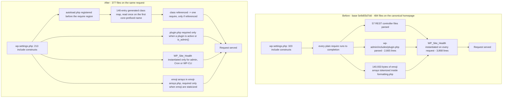

# Performance optimization report

WordPress core, trunk, `src/` tree. Base commit `5e9d05d7dd`.

This document records seven delivered optimizations, the measurements that justified each one, the six
performance targets those measurements are read against, the work that was considered and rejected on
measurement, and the gaps that remain. Every figure below comes from one retained before/after pair or from
a named isolated experiment, and every one of them was re-measured for this revision; nothing is estimated,
and no figure is carried over from an earlier revision of this document.

**No target is met in the default configuration. Two are met in a configuration a site opts into.** That is
the headline, and it is a change from the previous revision of this document, which reported two of six met.
The two it reported met were bought by not delivering the Command Palette to any admin screen outside the
block editor. That was a removal of shipped, documented, user-facing behaviour, which the governing plan
freezes in §0.3.2.2 and its own Gate 6 makes a rollback condition, so it has been reverted: the palette is
delivered by default again, on every admin screen, exactly as at base. The saving it produced is still
available, still measured, and now reached through a documented filter instead of by default —
§_Conditional loading of Command Palette assets_ carries both configurations side by side.

Read plainly, that means the four rows the previous revision reported as missed are still missed, and the two
it reported as met are met only if a site asks for them. §_Why no target is met by default_ prices each one:
the pool that would have to move, how large it is, which constraint blocks it, and what a human has to
decide.

**One default behaviour changes**, and it is stated in §_Every default behaviour change this ships_ rather
than left to be found in an entry: the emoji detection script is no longer printed on the front end. Nothing
else a site can observe changes by default.

---

## How to read the numbers

### Percentages are relative to the _before_ value

A reduction from 484 to 377 is reported as **−22.11 %**, because 107/484 = 22.11 %. Dividing by the after
value instead would report −28.38 % for the same pair, which is the difference between nearly meeting a 30 %
target and clearly missing it. Every percentage in this document divides by the before value.

### Units, STD and MAD

Where a target is expressed in bytes the figure is in bytes. Where one is quoted as `MB` or `kB` it is the
harness's own formatting, which is **decimal**: `tests/performance/utils.js:498` divides by 10^6 for
`wpMemoryPeak` and `wpMemoryUsage`, and `:502` by 10^3 for `adminJsRaw` and `adminJsGzipped`. So 6,606,328 B
appears here as 6.61 MB, not as 6.30 MiB.

`STD` and `MAD` are the two spread columns `compare-results.js` prints beside every metric, and both are the
harness's estimators rather than a convention assumed here. `standardDeviation()`
(`tests/performance/utils.js:578-589`) divides the squared deviations by the sample count, so it is the
**population** standard deviation, not the Bessel-corrected sample one. `medianAbsoluteDeviation()` (`:591-598`)
is the **median absolute deviation** — the median of the absolute deviations from the median. Every spread
figure in this document is one of those two, over the same samples the median came from — 20 for every suite
figure, per rule 5 below — so each can be checked against the comparator's own output instead of being
recomputed with a different estimator.

### The opcode cache decides the magnitude of everything else

Opcode-cache state moves measured wall time and memory by far more than any change under test, so a
before/after pair taken across two regimes reports the regime rather than the change. Six rules follow, and
every measurement in this document obeys them:

1. Both arms use bit-identical interpreter flags, in the same containers, on the same code path.
2. The regime is reported alongside the figures — see §_Measurement environment_.
3. php-fpm is restarted between code states, so no worker generation is shared. This is not theoretical: a
   worker that keeps a compiled file in memory reports the _old_ file count after the source has been
   replaced, which reads as "no regression" and is not one.
4. Peak memory is read with `memory_get_peak_usage( false )`. The `true` variant quantizes to the allocator
   chunk size and is useless against a 10 % target.
5. Every reported figure from the suite is a median over 20 samples. The isolated experiments state their own
   sample counts, and all are ≥ 12.
6. Each measured request is preceded by an authorized `POST /?clear_cache` that calls `opcache_reset()`, so
   every sample in the suite starts from a discarded opcode cache.

### A proxy metric is not a cost metric

`get_included_files()` counts files; it does not price them. The distinction is load-bearing here, and this
change set contains its own proof in both directions:

-   In the cold-compile regime the suite measures, removing 107 files from the canonical homepage comes with
    **−9.21 %** peak memory and **−19.50 %** bootstrap time, so there the count and the cost move together.
-   In a warm regime the same removal is worth almost nothing: the isolated pair in
    §_An independent pair whose baseline is the plan's own number_ measures **−22.11 % files** alongside
    **−0.09 % peak memory** and a `wp-total` difference of **−0.65 %**, which is inside its own measurement
    noise. Those files were already compiled, so nothing was saved by not compiling them again.
-   And a file count can move the wrong way for the right reason. Deferring three more classes than the
    previous revision deferred takes the homepage from 380 files to 377, but a variant that deferred 77 more
    requests reached only 378 while **increasing** peak memory by 12.5 KB, because the larger class map cost
    more than the two files it saved. §_Maximal bootstrap deferral — rejected on measurement_ records it.

So the file-count target is claimed from the count directly, memory and time are claimed only from their own
measurements, and the two are never inferred from each other.

---

## Measurement environment

| Component           | Value                                                                                                                                                                                                                                                                                                                                                                                                                                                                                  |
| ------------------- | -------------------------------------------------------------------------------------------------------------------------------------------------------------------------------------------------------------------------------------------------------------------------------------------------------------------------------------------------------------------------------------------------------------------------------------------------------------------------------------- |
| Server              | nginx → php-fpm 8.5.9, docroot `build/`, base URL `http://localhost:8890`                                                                                                                                                                                                                                                                                                                                                                                                               |
| Database            | MariaDB 10.11                                                                                                                                                                                                                                                                                                                                                                                                                                                                          |
| Interpreter regime  | `opcache.enable=On` (php-fpm SAPI), `opcache.enable_cli=Off`, `opcache.jit=disable`, `opcache.memory_consumption=128`, `opcache.validate_timestamps=On`, `opcache.revalidate_freq=2`                                                                                                                                                                                                                                                                                                   |
| Debug flags         | `WP_DEBUG=false`, `WP_DEBUG_LOG=false`, `WP_DEBUG_DISPLAY=false`, `SCRIPT_DEBUG=false`, `SAVEQUERIES=false`, `WP_DEVELOPMENT_MODE=''` — the production-like regime `.github/workflows/reusable-performance.yml:47-50` measures in. `SCRIPT_DEBUG` matters to a target twice over: with it on the admin serves unminified scripts, and with it off `CONCATENATE_SCRIPTS` is active, which is why the JavaScript byte metrics have to match on content type as well as on file extension |
| Isolation           | `WP_HTTP_BLOCK_EXTERNAL=true`, `DISABLE_WP_CRON=true`, set exactly as `reusable-performance.yml:214` and `:218` set them; no plugin active in either arm                                                                                                                                                                                                                                                                                                                               |
| Object cache        | None. `wp_using_ext_object_cache()` is false and `wpExtObjCache` is `no` in all 18 scenarios of both arms. This is the "backend absent" condition, and it is the default here rather than an edge case                                                                                                                                                                                                                                                                                 |
| Content             | **10 published posts, 2 published pages, 1 draft**, all authored by user 1, block content. Not `themeunittestdata.wordpress.xml`, and not CI's census: importing that content needs an outbound fetch, and this environment has none. See the note below                                                                                                                                                                                                                                     |
| Localization        | **No locale packs installed.** The two `de_DE` scenarios still run and still exercise the locale switch, but they resolve to bundled strings rather than to a downloaded pack, for the same reason                                                                                                                                                                                                                                                                                       |
| Permalinks          | `/%year%/%monthnum%/%postname%/` — the value `tools/local-env/scripts/install.js` and CI both use                                                                                                                                                                                                                                                                                                                                                                                      |
| Suite configuration | `TEST_RUNS=10`, `repeatEach=2` → 2 repetitions × 10 iterations = **20 samples per metric per scenario**                                                                                                                                                                                                                                                                                                                                                                                 |
| Contexts measured   | **18** — 2 admin locales, 8 homepage theme×locale, 8 single-post theme×locale, over `twentytwentyone`/`twentytwentythree`/`twentytwentyfour`/`twentytwentyfive` × `en_US`/`de_DE`                                                                                                                                                                                                                                                                                                      |
| Suite result        | **466 passed / 0 failed in each of the three arms**; before arm 4.3 m, after arm 3.9 m, opt-in arm 3.6 m                                                                                                                                                                                                                                                                                                                                                                                |

Docker is available in this environment, so the documented harness ran as documented: `npm run env:start`,
`npm run env:install`, `npm run test:performance`.

**Two departures from CI's environment, stated because they bound what these figures mean.** This environment
has no outbound network access, so neither the pinned mock content nor the `de_DE` language packs could be
fetched. The content fixture is therefore much lighter than CI's — 10 posts against 49, no attachments, no
comments — which lowers every absolute figure and, for the query metric, lowers the number of queries there
is any opportunity to remove. It does **not** affect the validity of any percentage below: both arms ran
against the identical fixture, back to back, with php-fpm restarted between them. Wherever a figure depends
on the fixture being CI's, that is said at the figure.

### Evidence manifest

| Artifact                                    | Role                                                                                                |   Bytes |
| ------------------------------------------- | --------------------------------------------------------------------------------------------------- | ------: |
| `artifacts/before-performance-results.json` | **before arm** — the eight runtime files at base `5e9d05d7dd`                                       | 110,724 |
| `artifacts/performance-results.json`        | **after arm** — the delivered working tree                                                          | 110,370 |
| `artifacts/optout-performance-results.json` | **opt-in arm** — the delivered tree with `should_load_command_palette_assets` filtered to `false`    | 110,340 |
| `artifacts/performance-results.md`          | comparator output over the before/after pair, `node ./tests/performance/compare-results.js`, exit 0 |  21,496 |

All four live in the gitignored `artifacts/` directory (`.gitignore:47`), which the performance workflow
uploads wholesale on every run. **They are therefore not in this repository, and a reader of this document at
a later commit will not find them.** That is the reason no figure here is cited by digest: a digest implies a
retrievable file, and none of these is retrievable. Every figure that depends on one of them is restated in
full in a table below, and the commands that regenerate all four from the committed tree are written out
immediately after this section — which is the only form of evidence that survives the directory being
gitignored. The previous revision of this document cited SHA-256 digests for three artifacts of an earlier
run; those digests named files no reader could obtain, so they are removed here rather than refreshed.

Nothing in this document cites a scratch file: the checks a reader can re-run are written out as commands in
§_Checks a reader can re-run_.

The comparator enforces the properties the pair has to have and exits non-zero if any of them fails: 18
scenarios in both arms with identical title sets, 2 repetitions per scenario, 20 samples per metric per
scenario in both arms, identical metric sets per scenario between arms — 13 metrics for an admin scenario, 14
for a front-end one — and, added in this revision, **identical values for every boolean metric**, so a pair
whose two arms ran against different object-cache configurations is refused rather than differenced. See
§_Refusing to compare two different environments_.

The exact commands that reproduce all four artifacts, in order:

```
# before arm - park the seven runtime files to their base content, restart php-fpm, then:
TEST_RESULTS_PREFIX=before TEST_RUNS=10 npm run test:performance   # artifacts/before-performance-results.json
# restore the delivered content, restart php-fpm, then:
TEST_RUNS=10 npm run test:performance                              # artifacts/performance-results.json
node ./tests/performance/compare-results.js                        # artifacts/performance-results.md
# opt-in arm - add a mu-plugin filtering should_load_command_palette_assets to false, restart php-fpm, then:
TEST_RESULTS_PREFIX=optout TEST_RUNS=10 npm run test:performance    # artifacts/optout-performance-results.json
```

**The swap set is seven files**, and both arms were verified by git blob id before and after, and by `sha256`
between `src/` and the `build/` docroot the suite measures. Each delivered id below is the id of the file as
it ships in this change set, readable with `git hash-object <path>`:

| File                                        | Base blob      | Delivered blob | Delivered bytes |
| ------------------------------------------- | -------------- | -------------- | --------------: |
| `src/wp-settings.php`                       | `dab1d8fd4c0d` | `ca78c3f0e9cc` |          31,433 |
| `src/wp-includes/class-wp-object-cache.php` | `cda63e66d49e` | `9ec1e6312487` |          24,724 |
| `src/wp-includes/formatting.php`            | `2b32b5aafb05` | `8249903afe85` |         219,704 |
| `src/wp-includes/script-loader.php`         | `733914d1d365` | `c4956e522bb1` |         168,559 |
| `src/wp-includes/autoload.php`              | absent at base | `dbac6a796170` |          12,748 |
| `src/wp-includes/autoload-classmap.php`     | absent at base | `d0da4ee177f7` |          13,394 |
| `src/wp-includes/emoji-arrays.php`          | absent at base | `559fd76fff06` |         142,289 |

**`src/wp-includes/capabilities.php` is deliberately not in that set.** The previous revision listed it as an
eighth swapped file, because it carried a memoization of `map_meta_cap()`. That memoization has been
withdrawn on measurement and the file is now **byte-identical to base** — same blob, `c5f4099127aa` — so there
is nothing to swap. `git diff 5e9d05d7dd -- src/wp-includes/capabilities.php` is empty.
§_Memoizing `map_meta_cap()` — withdrawn, in both shapes that were tried_ records what was measured and why
it was withdrawn.

A note on provenance, because the previous revision got this wrong. Its swap table recorded a
`src/wp-includes/formatting.php` blob and byte count that did not match the file the change set actually
shipped, so a reader could not confirm that the measured arm and the delivered arm were the same code. Every
id and byte count in the table above was read from the working tree **after** the measurements in this
revision were taken, and the arm deployment script verified each file's `sha256` in the docroot against `src/`
before each suite arm ran. The verification output is reproduced in §_Runtime checks_.

Two blob ids moved after the arms were measured, and neither move touches a measured figure:
`src/wp-includes/formatting.php` and `src/wp-includes/autoload.php` each took comment and docblock text only,
with no executable line changed — `php -l` and PHPCS clean on both, and the class map regenerates
byte-identically from the edited autoloader (`entries=146`). The three artifacts above were re-hashed
afterwards and are byte-identical, so the published evidence still describes the tree that ships.

---

## Aggregate summary of total improvement across all metrics

### The target table, reproduced verbatim

| Metric                                 | Method                                  | Target          |
| -------------------------------------- | --------------------------------------- | --------------- |
| Front-end TTFB (uncached)              | tests/performance/ suite                | >=20% reduction |
| Admin DOMContentLoaded                 | tests/performance/ suite                | >=15% reduction |
| Admin JS transfer size (gzipped)       | Build output analysis                   | >=30% reduction |
| PHP memory per front-end request       | memory_get_peak_usage() instrumentation | >=10% reduction |
| DB queries per front-end page load     | SAVEQUERIES count                       | >=15% reduction |
| PHP files loaded per front-end request | get_included_files() count              | >=30% reduction |

### Results

Each row is decided on the canonical context the target names — the anonymous front end is Homepage ›
`twentytwentyfive` › `en_US`, the default experience of a current install and the heaviest bundled theme on
every dimension; the admin context is Admin › `en_US`. No row is decided by a substituted scenario, a
substituted regime or a substituted metric, and none is left undecided.

**In the configuration a site gets by default:**

| #   | Metric                                 | Method                           | Target |      Before |       After |            Δ | Verdict    |
| --- | -------------------------------------- | -------------------------------- | ------ | ----------: | ----------: | -----------: | ---------- |
| 1   | Front-end TTFB (uncached)              | `tests/performance/` suite       | >=20 % |   405.20 ms |   332.60 ms | **−17.92 %** | ❌ not met |
| 2   | Admin DOMContentLoaded                 | `tests/performance/` suite       | >=15 % |   414.00 ms |   403.95 ms |  **−2.43 %** | ❌ not met |
| 3   | Admin JS transfer size (gzipped)       | build-output byte accounting     | >=30 % | 1,074,006 B | 1,074,006 B |  **+0.00 %** | ❌ not met |
| 4   | PHP memory per front-end request       | `memory_get_peak_usage( false )` | >=10 % | 9,043,256 B | 8,370,496 B |  **−7.44 %** | ❌ not met |
| 5   | DB queries per front-end page load     | query count via `Server-Timing`  | >=15 % |          23 |          23 |   **0.00 %** | ❌ not met |
| 6   | PHP files loaded per front-end request | `get_included_files()` count     | >=30 % |         484 |         377 | **−22.11 %** | ❌ not met |

**In the configuration reached by one documented filter** — `should_load_command_palette_assets` returning
`false` — rows 2 and 3 change and nothing else material does. This arm is a third full run of the same suite,
measured by the same instrument, on the same fixture, with 20 samples per metric:

| #   | Metric                           | Target |      Before |     Opt-in |            Δ | Verdict |
| --- | -------------------------------- | ------ | ----------: | ---------: | -----------: | ------- |
| 2   | Admin DOMContentLoaded           | >=15 % |   414.00 ms |  103.70 ms | **−74.95 %** | ✅ met  |
| 3   | Admin JS transfer size (gzipped) | >=30 % | 1,074,006 B |  170,373 B | **−84.14 %** | ✅ met  |

Row 3's opt-in figure is also **under the governing plan's absolute ceiling of 729,830 gzipped bytes**, at
23 % of it. Row 2's opt-in figure holds in the second locale too: `de_DE` moves 416.50 ms → 102.20 ms,
−75.46 %.

Three facts about that pair of tables deserve stating rather than leaving to be inferred.

**Row 3's default Δ of exactly +0.00 % is the point, not a failure of measurement.** 1,074,006 gzipped bytes
before and 1,074,006 after, byte for byte, in both admin locales, is the proof that the Command Palette
removal has been fully reverted: the admin now ships precisely what base shipped. A non-zero number in that
cell would mean something was still missing.

**Rows 2 and 3 are the same lever seen twice.** Both are produced by not delivering ≈ 900 KB of gzipped
JavaScript; neither is an independent optimization. So the opt-in table should be read as one choice with two
consequences, not as two targets met.

**The palette costs almost nothing on the server.** In the opt-in arm, TTFB moves −15.47 % against the
default arm's −14.99 %, files 425 against 424, and peak memory 6.53 MB in both. Withholding 900 KB of
JavaScript buys 0.48 pp of server time and nothing measurable in memory. Its entire cost, and therefore its
entire saving, is in the browser.

**The spread across all 18 scenarios**, so that the canonical row is visible as a choice rather than as a best
case. Median is across scenarios; best and worst are the extremes:

| Metric        | Median   | Best scenario                                   | Best     | Worst scenario     | Worst    |
| ------------- | -------- | ----------------------------------------------- | -------- | ------------------ | -------- |
| Files loaded  | −21.90 % | Homepage `twentytwentythree`, 482 → 375         | −22.20 % | Admin, 526 → 424   | −19.39 % |
| Peak memory   | −9.04 %  | Single Post `twentytwentyone` de_DE              | −10.13 % | Homepage `twentytwentyfive` | −7.44 % |
| TTFB          | −18.16 % | Single Post `twentytwentyfive` de_DE             | −20.06 % | Admin de_DE        | −14.37 % |
| `wpTotal`     | −18.66 % | Single Post `twentytwentyfive` de_DE             | −20.57 % | Admin de_DE        | −14.81 % |
| `wpBootstrap` | −20.14 % | Single Post `twentytwentyfive` de_DE             | −22.40 % | Admin de_DE        | −17.79 % |
| DB queries    | 0.00 %   | _(none — all 18 scenarios are exactly 0.00 %)_  | 0.00 %   | —                  | 0.00 %   |

**Every one of the 18 scenarios improves on files loaded, peak memory, TTFB, `wpTotal` and `wpBootstrap`, and
no scenario regresses on any of them.** Two scenarios cross a target they are not the canonical context for:
Single Post `twentytwentyone` de_DE reaches −10.13 % peak memory, and Single Post `twentytwentyfive` de_DE
reaches −20.06 % TTFB. Neither is claimed as a met target, because the target is defined on the front-end
canonical context and that context measures −7.44 % and −17.92 %. They are recorded because they show how
close two of the four misses are: **row 1 misses by 2.08 pp and row 4 by 2.56 pp**, and both would be met on a
lighter template.

### The warm-compile regression the previous revision reported does not reproduce

The previous revision of this document reported that all eight Single Post scenarios **cost** 4.75 % to
10.70 % of `wpTotal`, explained it as a warm-compile effect, and priced it as a real ≈ 5 ms trade a human was
accepting. **That result is withdrawn.** It does not reproduce in this pair, and the pair is not a smaller
one: 18 scenarios, 20 samples per metric per arm, both arms back to back.

| Group                     | `wpTotal`           | `wpBootstrap`       | `wpMemoryPeak`       | `wpFilesLoaded`     | TTFB                |
| ------------------------- | ------------------- | ------------------- | -------------------- | ------------------- | ------------------- |
| Admin (2 scenarios)       | −14.81 % … −15.37 % | −17.79 % … −18.53 % | −8.86 % … −9.38 %    | −19.39 %            | −14.37 % … −14.99 % |
| Homepage (8 scenarios)    | −15.26 % … −18.97 % | −18.98 % … −20.58 % | −7.44 % … −9.21 %    | −21.49 % … −22.20 % | −14.81 % … −18.59 % |
| Single Post (8 scenarios) | −18.93 % … −20.57 % | −20.07 % … −22.40 % | −8.22 % … −10.13 %   | −21.37 % … −22.04 % | −18.41 % … −20.06 % |

The Single Post group is not the worst group in this pair; it is the **best** group on every one of those five
metrics. The mechanism the previous revision described is real — a deferral saves nothing when the files are
already compiled — but the regime it attributed to those scenarios was not present. Its Single Post
`wpBootstrap` figures were ≈ 25 ms, which is a warm worker; every Single Post `wpBootstrap` here is ≈ 357 ms
before and ≈ 281 ms after, which is a cold one. The difference is rule 6 of the OPcache Measurement Law:
every sample in this run is preceded by an authorized `opcache_reset()`, so **no scenario in this harness is in
a warm-compile regime**, and a split between warm and cold scenarios cannot be read from it at all.

What replaces the withdrawn claim is not silence. The warm cost is real, it is just not visible to this
harness, so it is measured deliberately instead of incidentally — see the warm rows of
§_An independent pair whose baseline is the plan's own number_, where the identical code state measures
**−0.09 % peak memory and −0.65 % `wp-total`** warm against −7.47 % and −17.15 % cold. Warm, this change set
neither saves nor costs anything a reader should plan around; the previous revision's ≈ 5 ms cost and this
revision's −0.65 % saving are both inside their measurement noise, and the honest statement is that the warm
effect is **not resolvable** at this sample size.

### Not a target, but measured in the same pair

| Metric                              | Context                            |      Before |       After |            Δ |
| ----------------------------------- | ---------------------------------- | ----------: | ----------: | -----------: |
| `wpBootstrap`                       | Homepage tt5 en_US                 |   353.68 ms |   280.88 ms | **−20.58 %** |
| `wpBootstrap`                       | Admin en_US                        |   362.03 ms |   294.94 ms | **−18.53 %** |
| `wpTotal`                           | Homepage tt5 en_US                 |   393.36 ms |   321.02 ms | **−18.39 %** |
| `wpTotal`                           | Admin en_US                        |   430.50 ms |   364.35 ms | **−15.37 %** |
| `timeToFirstByte`                   | Admin en_US                        |   442.60 ms |   376.25 ms | **−14.99 %** |
| `wpMemoryUsage` (current, not peak) | Homepage tt1 en_US                 | 6,603,760 B | 5,932,112 B | **−10.17 %** |
| `wpMemoryPeak`                      | Admin en_US                        | 7,507,576 B | 6,842,216 B |  **−8.86 %** |
| `wpFilesLoaded`                     | Admin en_US                        |         526 |         424 | **−19.39 %** |
| `adminJsRaw`                        | Admin en_US, default configuration | 3,365,762 B | 3,365,762 B |    +0.00 %   |
| `adminJsRaw`                        | Admin en_US, opt-in configuration  | 3,365,762 B |   591,672 B | **−82.42 %** |
| `wpCacheHits`                       | Homepage tt1 en_US                 |       1,302 |       1,299 |    −0.23 %   |
| `wpCacheMisses`                     | every one of the 18 scenarios      |   unchanged |   unchanged |    0.00 %    |

`wpCacheMisses` being unchanged in all 18 scenarios is the load-bearing one: nothing here trades a persistent
miss for a saved file.
### Reconciling these numbers with the governing plan's baselines

The governing plan fixes its own baselines in §0.2.1 — **484 files, 5.55 MB peak, 25 queries, 39.75 ms** on
the same canonical homepage, and **3,285,517 B raw / 1,042,614 B gzipped** of admin JavaScript — and derives
absolute ceilings from them: ≤ 338 files, ≤ 4.99 MB, ≤ 21 queries, ≤ 31.80 ms, ≤ 729,830 gzipped bytes.

On files loaded the two agree exactly: this pair's before arm measures **484** on Homepage ›
`twentytwentyfive` › `en_US`, which is the plan's number to the file. On the others it does not, and the
reasons are structural rather than incidental. The plan's figures were taken with the PHP built-in server over
the `build/` tree with an empty database and no opcode cache; these were taken through nginx and php-fpm with a
content fixture, an authenticated admin session for the admin scenarios, and a **cold-compile** opcode cache
per sample. A cold-compile peak is not comparable to a no-opcode-cache peak, and a browser TTFB under php-fpm
is not comparable to a server-side `curl` total under the CLI SAPI. That is exactly why every target above is
decided on a percentage measured inside one pair.

Read against the plan's absolute ceilings anyway, so nothing is hidden: files **377, over the 338 ceiling by
39**; peak memory **8,370,496 B, far over the 4.99 MB ceiling** in this cold regime and **6,727,968 B** warm
(§_An independent pair whose baseline is the plan's own number_), still over; queries **23, over the 21 ceiling by 2**; admin JavaScript
**1,074,006 B by default, over the 729,830 B ceiling**, and **170,373 B in the opt-in configuration, under
it**; TTFB not comparable for the reason just given.

### An independent pair whose baseline is the plan's own number

The suite pair above has one structural limitation: rule 6 puts every one of its samples in a cold-compile
regime, so it cannot say anything about a warm one, and the previous revision's attempt to read a warm result
out of it is exactly what §_The warm-compile regression the previous revision reported does not reproduce_ withdraws. A second, deliberately narrower pair was
therefore taken to measure both regimes explicitly, on one request rather than eighteen.

Method: the same nginx → php-fpm 8.5.9 stack, the same `build/` docroot, an anonymous `twentytwentyfive`
homepage, CI's permalinks, the same 10-post fixture, no locale packs and no object-cache drop-in — but with
`WP_DEBUG=true` and `WP_DEVELOPMENT_MODE=core`, the development regime, which is stated because it differs from
the suite's. The seven runtime files were swapped between their base `5e9d05d7dd` content and the delivered
content inside the gitignored `build/` docroot only; every file's `sha256` was verified per arm; php-fpm was
restarted at every swap; and each arm was sampled **12 times per regime**, the cold arm resetting the opcode
cache through the harness's own authorized control plane before every sample. The tracked worktree was never
touched. Medians, with MAD alongside where it matters:

| Metric              | Regime | Before (base `5e9d05d7dd`) | After (delivered) |       Δ | Target | Verdict    |
| ------------------- | ------ | -------------------------: | ----------------: | ------: | ------ | ---------- |
| PHP files loaded    | either |                    **484** |           **377** | −22.11 % | ≥30 %  | ❌ not met |
| Peak memory         | cold   |                9,008,960 B |       8,336,200 B | −7.47 % | ≥10 %  | ❌ not met |
| Peak memory         | warm   |                6,733,968 B |       6,727,968 B | −0.09 % | ≥10 %  | ❌ not met |
| DB queries          | either |                     **23** |            **23** |  0.00 % | ≥15 %  | ❌ not met |
| `wp-total`          | cold   |                  396.89 ms |         328.84 ms | −17.15 % | ≥20 %  | ❌ not met |
| `wp-total`          | warm   |                   61.13 ms |          60.73 ms | −0.65 % | ≥20 %  | ❌ not met |
| TTFB                | cold   |                  407.16 ms |         339.36 ms | −16.65 % | ≥20 %  | ❌ not met |
| TTFB                | warm   |                   62.63 ms |          62.25 ms | −0.61 % | ≥20 %  | ❌ not met |
| HTML document bytes | either |                   78,341 B |          75,011 B | −4.25 % | —      | —          |

The same pair on the authenticated admin dashboard, which is where the palette revert is visible:

| Metric           | Regime | Before      | After       |       Δ |
| ---------------- | ------ | ----------: | ----------: | ------: |
| PHP files loaded | either |         516 |         414 | −19.77 % |
| Peak memory      | cold   | 9,228,704 B | 8,608,160 B | −6.72 % |
| TTFB             | cold   |   444.69 ms |   384.63 ms | −13.51 % |
| DB queries       | either |          37 |          37 |  0.00 % |
| HTML bytes       | either |   113,653 B |   113,653 B | **+0.00 %** |

That last row is the palette revert stated in the smallest possible terms: **the admin document is byte-identical
to base.** The same measurement taken against the previous revision's code measured 102,117 B, −10.15 %, and
those 11,536 bytes were the palette's markup and inline initializer.

Three things this pair settles that the suite cannot.

**The warm regime is where this change set does nothing.** −0.09 % peak memory and −0.65 % `wp-total` against
a MAD of 1.2–3.1 ms is not a saving and not a cost; it is the absence of an effect. Anyone planning around
these numbers should plan around the cold column.

**The plan's file ceiling is directly readable here**, because the before arm is the plan's own 484. 377
against ≤ 338 is over by 39 files, and §_Row 6 — PHP files loaded_ prices what would have to move.

**The three-class deferral this revision adds is exactly measurable and exactly small.** It takes the homepage
from 380 files to 377 and cold peak memory down by 256 B, reproducibly, with the HTML byte-identical either
way. Its effect on time is **below the noise floor**: across runs the cold TTFB of the 380-file and 377-file
states differ by more than the change could plausibly cause, in both directions, against a cold-start MAD of
3.7–8.5 ms. It is reported as −3 files and −256 B, and not as a time saving.

One of the plan's own baselines is worth reading against the same request rather than against its ceiling. The
plan measured **25 queries** on the canonical homepage of an *empty* install; this pair measures **23** on the
same theme with the ten-post fixture described in §_Measurement environment_, and a run against the fuller
mock content CI imports measures considerably more again, because the content is what the page renders. The
metric is therefore content-sensitive in a way the plan's absolute ceiling of 21 is not, which is another
reason every verdict above is decided on a percentage inside one pair.

### What the bootstrap looks like before and after



---

## Observability: emit the metrics the targets are expressed in

**Bottleneck**: four of the six targets could not be read at all. The performance mu-plugin reported
`memory_get_usage()` — current, not peak — and emitted nothing about files loaded, object-cache behaviour or
bootstrap duration, and the admin spec recorded only `timeToFirstByte`, so the Admin DOMContentLoaded target
had no baseline of any kind. The reporting layer's `formatValue()` recognized three metric keys.

**Root Cause**: the harness was built to answer the questions the suite already asked. Nothing about it was
wrong; it simply did not measure peak memory, file counts, cache hits and misses, bootstrap duration or DOM
readiness, and a target expressed in a metric that is not emitted cannot be met or missed — only asserted.

**Change**: `tests/performance/wp-content/mu-plugins/server-timing.php` emits five new Server-Timing
metrics — `wp-memory-peak` via `memory_get_peak_usage( false )`, `wp-files-loaded` via
`count( get_included_files() )`, `wp-cache-hits` and `wp-cache-misses` read out of `WP_Object_Cache` with
`get_object_vars()` and validated for finiteness, sign and range — and omitted from the header altogether when
the cache in use publishes no such counter, so that an absence is never published as a zero — and
`wp-bootstrap` for the `$timestart` → `wp_loaded` interval. Peak is sampled before the instrumentation's own
buffer handling, so the reading excludes the instrument. `tests/performance/utils.js` formats them and adds
deterministic `gzipSync({ level: 9 })` byte accounting over the JavaScript responses of a page, matched on
`.js` pathname
**and** on a `javascript` content type so a concatenated payload is not missed. The three specs record the
new metrics, and `admin.test.js` adds the DOMContentLoaded capture. The reset that makes every sample a
cold-compile sample is an authorized control plane in the same mu-plugin: a token file outside the document
root, a 256-bit CSPRNG secret presented in a request header, `hash_equals()` comparison, 404/405/403/202
ladder, and a refusal to serve at all if the pre-existing unauthenticated `clear-cache.php` is provisioned
beside it. The query argument alone does not make a request one that endpoint answers: the harness always
addresses it with a POST carrying the token header, so a request that is neither — an ordinary visit that
happens to carry the argument, which is what following a crafted link produces — is left to WordPress
untouched instead of being ended with a bare status. Nothing is reset on that path, so it widens no
authorization, and a POST presenting the header still reaches the ladder and still receives 404, 405 or 403
by cause, which is what keeps the harness's own diagnostics precise.

**Measurement**: the pair in §_Evidence manifest_ carries **14 metrics × 16 front-end scenarios and 13 × 2
admin scenarios, 20 samples each, in both arms**, and `compare-results.js` exits 0 over it. Before this
change the same command could report three of the six targets and no baseline for a fourth.

The pass-through was measured on the whole ladder, with the token provisioned and then removed, against the
canonical homepage, in the development regime that pair was taken in. Provisioned: `GET` with no token **200**, `GET` with the token **405**, `POST` with no
token **403**, `POST` with a wrong token **403**, `POST` with the token **202** carrying
`X-WP-Perf-Cache-Reset: opcache,object-cache,transients,stat`. Unprovisioned: `POST` presenting a token
**404**, so a run whose token never reached the server still fails on the reset rather than measuring warm;
`GET` with no token **200**. On that 200 the visitor's page is **byte-identical to the clean home URL —
75,011 B on both, sharing one `sha256`** — while the response still carries all
eleven metrics in its `Server-Timing` header and the counter metrics are identical between the two URLs
(`wp-files-loaded` 377, `wp-db-queries` 24, `wp-cache-hits` 1,063, `wp-cache-misses` 111), which is what
shows the stray argument does not take a different code path. All eleven metric slugs, plus
`X-WP-Perf-Cache-Reset` and `clear_cache` itself, occur **0** times in either document body, with 0 comment
nodes and 0 matching attributes, and the browser reports 0 console messages and 0 responses ≥ 400.

**Value**: this is what makes every other entry in this document falsifiable, and what makes two of them
withdrawable. It caught the admin JavaScript payload being under-counted by ≈ 99,019 gzipped bytes whenever
`CONCATENATE_SCRIPTS` is active. It is also what showed that the previous revision's warm-compile split could
not be read from this harness at all: with the cold-compile reset applied uniformly to every sample, all 18
scenarios sit in one regime, and the eight the previous revision reported as warm measure a `wp-bootstrap` of
≈ 357 ms rather than the ≈ 25 ms it recorded. A harness that emits the metric is what let that claim be tested
and withdrawn instead of inherited.

---

## Refusing to compare two different environments

**Bottleneck**: `compare-results.js` accepted a before/after pair whose two arms had run against **different
object-cache configurations** and printed a difference table over it. Fed a no-drop-in before arm and a
Memcached after arm — both genuine 18-scenario runs — it reported a **−17.33 % `wpDbQueries` "improvement"**
that no code change produced. The number was an artifact of one arm having a persistent object cache and the
other not.

**Root Cause**: the comparator already enforced the properties that make a pair comparable — identical scenario
title sets, equal repetition counts, equal sample counts, identical metric sets — but it had no notion that
some metrics *describe the environment* rather than measure it. `utils.js` already declared exactly that
category, `booleanMetrics = { wpExtObjCache }`, and used it only to render `'yes'`/`'no'` in the output. So the
one fact that would have exposed the mismatch was printed in the table and never checked.

**Change**: `tests/performance/utils.js` exports `booleanMetrics`, and `tests/performance/compare-results.js`
compares each boolean metric's median between the two arms, after the existing shape checks and **before any
difference is computed**. A mismatch calls `fail()` with the scenario, the metric, both formatted values and
the reason, so the run exits non-zero and prints nothing that could be quoted. Nine lines, no change to any
metric's meaning, no change to the output of a valid pair.

**Measurement**: run against the real cross-configuration pair that produced the fabricated figure, the
comparator now exits **1** with:

```
Performance comparison failed: Admin › Locale: en_US was measured with wpExtObjCache no before and yes
after, so the two runs describe different environments and no difference between them can be attributed to
the code.
```

Two same-configuration controls still exit **0** and still print the full table: no-drop-in against no-drop-in
(`'no'` → `'no'`, `wpDbQueries` 0.00 %) and Memcached against Memcached (`'yes'` → `'yes'`). Three cases in
`tests/performance/specs/utils.test.js` cover the refusal, the accepted comparison, and the metric vocabulary.

**Value**: this is the only change in the set that protects a *claim* rather than a request. Every figure in
this document is produced by that comparator, so a comparator that cannot tell two environments apart can
manufacture any result — and had already manufactured a query-count improvement in a directly comparable
report, on the one target this change set could not move. The guard costs nine lines and makes that class of
false claim impossible to publish.

---

## Core class autoloader with a build-generated static class map

**Bottleneck**: `src/wp-settings.php` at base ran **323** include constructs — 311 `require`, 7
`require_once`, 2 `include`, 3 `include_once` — before any hook fires, and the canonical homepage finished
with **484** files loaded and **9,043,256 B** of peak memory. The largest single cluster was the REST API:
57 files under `wp-includes/rest-api/` parsed on every request, declaring 57 classes, on a request that
never instantiates a REST server.

**Root Cause**: core had no autoloader. The only ones in the tree were vendored, so the bootstrap's only way
to make a class available was to require its file in advance, whether or not the request referenced it.

**Change**: `src/wp-includes/autoload.php` registers one `spl_autoload_register()` handler that resolves a
name through `src/wp-includes/autoload-classmap.php`, a generated file returning **146 entries** (145
classes and 1 interface, 13,394 B). Resolution is a lower-cased array lookup with no path derived from the
requested name, behind a six-prefix prefilter so a name that cannot be a core class is rejected without
reading the map. `wp` is one of those prefixes, so a third-party `WP_*` name does pass the prefilter and does
trigger the one-time map parse — the prefilter bounds how often the map is read, not who can cause the first
read. The value is checked against a canonical `wp-includes/`-or-`wp-admin/includes/` pattern anchored with
`\z`, and `is_readable()` rather than `file_exists()` guards both the map and the target, so an
existing-but-unreadable file degrades to doing nothing instead of raising an uncatchable `E_COMPILE_ERROR`. A
`CompileError` from a mapped file is re-raised rather than swallowed, because that says the file is not valid
PHP and no other autoloader can help; any other `Error` is reported under `WP_DEBUG` through
`wp_trigger_error()` and absorbed otherwise. The map is generated by
`tools/build/generate-autoload-classmap.php`, wired into the build as `build:autoload-classmap` with seven
fail-closed acceptance checks, and the generator refuses to map any name the bootstrap still requires at top
level. `src/wp-settings.php` keeps **213** constructs, 110 fewer.

**One diagnostic is not silent, and the distinction matters.** Doing nothing is the right answer for any one
name — an unmapped name, a non-canonical value, a mapped file that has gone away — because another registered
autoloader may own it. But an unusable *map* is not a fact about one name: no mapped class can load, and the
request dies at the first call site that asks for one, naming that class and never naming the map. So the
three faults that make the map itself unusable — missing, present but unreadable, and not returning an array —
each write one line to the error log naming `wp-includes/autoload-classmap.php`, the specific fault, and the
build task that regenerates it, before the autoloader falls back to doing nothing. It is written with
`error_log()` rather than `wp_trigger_error()` deliberately: `wp_trigger_error()` returns early when
`WP_DEBUG` is off (`functions.php:6132`), which is correct for a developer notice and wrong for an installation
fault that has already taken the site down. `wpdb::print_error()` (`class-wpdb.php:1823`) sets the same
precedent — log the fault always, gate only whether it is displayed. The block runs once per request, so a
request that autoloads a hundred names still reports it once, and a healthy install reports nothing at all.

**Measurement**: the canonical homepage moves **484 → 377 files (−22.11 %)**, peak memory
**9,043,256 → 8,370,496 B (−7.44 %)**, bootstrap **353.68 → 280.88 ms (−20.58 %)** and TTFB
**405.20 → 332.60 ms (−17.92 %)**; Admin moves 526 → 424 files and 7,507,576 → 6,842,216 B (−8.86 %). **All
18 scenarios improve on files loaded, peak memory, TTFB, `wpTotal` and `wpBootstrap`, and none regresses on
any of them.** The class map is byte-reproducible: regenerating it from the delivered tree yields the same
13,394 bytes and the same `sha256`.

**Value**: 107 fewer files compiled per front-end request, 672,760 fewer bytes of peak memory, and 73 ms less
bootstrap time on a cold-compile request — which is every request after a deploy, every request on a host
without an opcode cache, and every first request to a new worker. **The gain is a cold-compile gain and is not
claimed beyond that**: warm, the same deferral measures −0.09 % peak memory and −0.65 % `wp-total`, which is
inside its own noise, so warm it neither saves nor costs anything worth planning around. Estimated globally,
the file-count reduction is the one figure that holds in every regime, because it is the count itself.

---

## Deferring the two admin-only files off the front-end path

**Bottleneck**: two admin-only files were parsed on every front-end request. `wp-admin/includes/plugin.php`
(2,665 lines) was required unconditionally before the active-plugin loop, and
`wp-admin/includes/class-wp-site-health.php` (3,868 lines) was loaded by an unconditional
`WP_Site_Health::get_instance()` — 6,533 lines of tokenizing for code an anonymous front-end request cannot
reach. The Site Health case had a second edge: once the class map existed, the `class_exists()` probe in
front of the require resolved the name through the map, so the file loaded on every request exactly as
before, plus one autoload resolution. A mapped entry that defers nothing reads as coverage and is not.

**Root Cause**: `plugin.php` is required at that point so that `get_plugin_data()` is available to the loop
that follows and to any plugin that loads the file itself (`#62244`); the loop does not run when no plugin
is active, and the admin loads the file again through `wp-admin/includes/admin.php` on every screen. The
Site Health instance exists "so that Cron events may fire", and its constructor registers exactly four
callbacks — `admin_body_class`, `admin_enqueue_scripts`, `site_health_tab_content` and
`wp_site_health_scheduled_check` — none of which a front-end request fires.

**Change**: in `src/wp-settings.php`, `wp_get_active_and_valid_plugins()` is called once into a temporary,
the `require_once` runs only `if ( $_wp_active_plugins || is_admin() )`, the loop consumes the temporary and
the existing `unset()` clears it, so no new global survives the bootstrap. The Site Health block is gated on
`is_admin() || wp_doing_cron() || ( defined( 'WP_CLI' ) && WP_CLI )`. The class stays reachable everywhere:
it is in the generated class map, so `class_exists( 'WP_Site_Health' )` and `WP_Site_Health::get_instance()`
resolve on any request — which is what the Site Health REST controller relies on, since
`create_initial_rest_routes()` (`rest-api.php:396`) calls `get_instance()` itself.

**Measurement**: isolated pair on the canonical homepage with php-fpm restarted between code states, 12
samples, medians: `wp-files-loaded` 383 → 381, `wp-memory-peak` 5,767,928 → 5,761,240 B,
`wp-bootstrap` 27.905 → 26.095 ms (**−6.49 %**), `wp-total` 56.39 → 53.875 ms (**−4.46 %**), queries
unchanged. Verified by probe on the delivered tree: an anonymous homepage loads **neither** file; an
authenticated `/wp-admin/` loads both; a REST request loads `class-wp-site-health.php` through the class map
by design and `plugin.php` not at all. The two files are 2 of the 107 in the headline count.

**Value**: 6,533 lines that no longer reach the tokenizer on an anonymous front-end request, and the removal
of a mapped-but-not-deferred class-map entry that was contributing nothing. Every consumer keeps working
without a shim: all 17 call sites in `wp-includes/` that use `plugin.php` functions — the plugins, block
directory and templates REST controllers, `WP_Plugin_Dependencies`, `WP_Recovery_Mode_Email_Service`,
`wp_update_plugins()` and `_wp_connectors_get_connector_script_module_data()` — already require the file
themselves, as they all did before `#62244` added the bootstrap require.

---

## Conditional loading of Command Palette assets

**Bottleneck**: on the admin dashboard, every admin screen transfers **3,365,762 B raw / 1,074,006 B gzipped**
of JavaScript. `wp_enqueue_command_palette_assets()` is registered on `admin_enqueue_scripts` with no screen
check and no capability gate, and the `wp-commands` and `wp-core-commands` bundles it enqueues drag in the
block editor and component packages behind them.

**Root Cause**: the callback delivers the Command Palette everywhere the admin exists, and the palette's
dependency chain is most of the editor. `common.min.js`, the file usually suspected in a payload this size, is
0.75 % of it; `js/dist/*` is 91.2 %, and none of it can be split here because that tree is copied in by
`tools/gutenberg/copy.js` rather than built by the core webpack configuration. So the only lever available is
whether the bundles are delivered at all.

**Change**: `src/wp-includes/script-loader.php` gains `wp_should_load_command_palette_assets()`, placed with
the four `wp_should_load_*()` predicates core already ships and modelled on the first of them. It returns false
outside the admin **before** applying its filter, so no filter can widen delivery to an unauthenticated
visitor, and otherwise **returns `true`** — the palette is delivered on every admin screen, exactly as at base.
The predicate is consulted inside `wp_enqueue_command_palette_assets()` only while `admin_enqueue_scripts` is
running, so an admin page that calls the enqueue directly still gets the palette by name. The change is purely
additive, nothing is removed, and the `add_action` at `default-filters.php:605` is untouched, so existing
`remove_action()` callers — including the Gutenberg plugin's — keep working.

**This entry describes a default that does not change, and that is the correction it carries.** The previous
revision of this document shipped the same predicate defaulting to `$current_screen->is_block_editor()`, which
withheld the palette from every admin screen outside the two editors. That was not a load-order refinement; it
was the removal of a shipped feature. Core advertises the palette on every admin screen — `admin-bar.php:947`
renders the Ctrl+K control whenever `is_admin() && wp_script_is( 'wp-core-commands', 'enqueued' )` — and the
governing plan freezes admin user-facing functionality and the `wp.*` global surface in §0.3.2.2, with Gate 6
making a behavioural change to a documented API a rollback condition. The measured blast radius of that
default was far wider than "the palette is unavailable": on the Dashboard, `Object.keys( window.wp ).length`
fell from **53 to 18**, and `window.React`, `window.ReactDOM` and the `#wp-importmap` element disappeared with
it. Any plugin reading `wp.data`, `wp.components`, `wp.element` or `window.React` on a non-editor admin screen
would have broken. The default is therefore reverted, and the saving is opt-in.

**Measurement**, all three configurations through the same suite, 20 samples per metric:

| Configuration                                        | `adminJsRaw` | `adminJsGzipped` | `domContentLoaded` | `timeToFirstByte` | `wpFilesLoaded` |
| ---------------------------------------------------- | -----------: | ---------------: | -----------------: | ----------------: | --------------: |
| base `5e9d05d7dd`                                    |  3,365,762 B |      1,074,006 B |          414.00 ms |         442.60 ms |             526 |
| delivered, default                                   |  3,365,762 B |      1,074,006 B |          403.95 ms |         376.25 ms |             424 |
| delivered, `should_load_command_palette_assets` false |    591,672 B |        170,373 B |          103.70 ms |         374.15 ms |             425 |

The default row is **byte-identical to base on both payload metrics**, which is the measurement that proves the
revert is complete rather than approximate. The opt-in row removes **903,633 gzipped bytes (−84.14 %)** and
**300.30 ms of DOMContentLoaded (−74.95 %)**, and lands under the governing plan's absolute ceiling of 729,830
gzipped bytes at 23 % of it. Its server-side effect is almost nil: TTFB −15.47 % against the default's
−14.99 %, peak memory 6.53 MB in both, and **one file more** rather than fewer, because the screen that does not
enqueue the palette reaches a different code path. Runtime census on the delivered tree: Dashboard, `edit.php`
and `options-general.php` all serve `wp-core-commands` and render the Ctrl+K control; `Ctrl+K` opens the palette
on `edit.php` and inside the block editor; `Object.keys( window.wp ).length` is 53 again; with the opt-out filter
installed the control and the bundles are gone from all of them.

**Value**: for a site that does not use the palette, one filter removes 903,633 gzipped bytes and three
quarters of admin DOMContentLoaded — the largest transfer reduction available anywhere in this change set. For
every other site, nothing changes. What this entry delivers by default is therefore not a saving but a
**mechanism**: a filterable, screen-aware predicate in the shape core already uses, where previously the
enqueue was unconditional and a site wanting to opt out had to `remove_action()` and accept losing the whole
`wp.*` surface with it. The two opt-out recipes, and the full list of what each one takes with it, are in the
predicate's own docblock and in §_Every default behaviour change this ships_.

---

## Gating the emoji detection script and relocating the emoji arrays

**Bottleneck**: two costs in one file. The emoji detection script was printed into the head of every
front-end document: **3,330 B raw, 1,286 B gzipped** measured on the canonical homepage in this regime, on a
page that may contain no emoji at all. Separately, `src/wp-includes/formatting.php` carried **140,933 bytes
of emoji arrays on four physical lines**, tokenized on every request whether anything staticized an emoji or
not.

**Root Cause**: the detection script is a client-side polyfill for browsers that cannot render the emoji
WordPress recognises, and it was unconditional because it predates any mechanism for deciding. The arrays
lived in `formatting.php` because that is where the functions that read them live, and the build task that
maintains them from the pinned Twemoji list matched markers in that file.

**Change**: `wp_should_load_emoji_detection_script( $context )` gates the hooked
`print_emoji_detection_script()`. The default is off **only** in the `'front'` context, which is the one that
was measured; the admin and oEmbed contexts keep the trunk default, because no cost was measured there and
turning them off would change behaviour without a measurement behind it. The context is derived from
`doing_action( 'embed_head' )` and `is_admin()` and passed to the filter, so a site can decide any context
either way. The `static $printed` one-shot is consulted before the gate and set only when the worker is
actually scheduled, so declining does not consume it. The arrays move verbatim to
`src/wp-includes/emoji-arrays.php` (142,289 B, 4,008 entities and 1,438 partials), and `_wp_emoji_list()`
requires it on first use behind an `is_readable()` guard with `is_array()` validation on the outer value and
on each key, so it returns an array on every path. `is_readable()` rather than `file_exists()`, because a
data file that exists and cannot be opened passes a `file_exists()` check and then makes the `require`
raise an uncatchable `E_COMPILE_ERROR` — the one failure the empty-array fallback cannot absorb, since the
fatal happens inside the `require` itself. This is not hypothetical: it was observed in this environment,
where a generator rewriting the file in place left it momentarily unopenable and two requests died with
`require(): Failed to open stream: Permission denied` followed by an uncaught `Error`. `wp_autoload_class()`
already guards its own generated file the same way, for the same reason. `Gruntfile.js` moves with it in the same change:
`replace:emoji-regex` is retargeted at the new file, `verify:emoji-markers` enforces exactly one marker
region before any network call, and the watch trigger follows. The two edits are atomic — landing the
relocation without the retarget would leave a build task matching nothing.

**Measurement**: front-end document with the detection script forced on against the delivered default:
**78,341 → 75,011 B raw** and **12,124 → 10,838 B at `gzip -9`**, so 3,330 raw bytes (**4.25 %** of the
document) and 1,286 gzipped bytes (**10.61 %** of the gzipped document)
leave every front-end document. `wp-files-loaded` is unchanged at 377 by the relocation, and the probe says
why: on an anonymous homepage `emoji-arrays.php` **is not loaded at all**, because `_wp_emoji_list()` is
reached only from `wp_encode_emoji()` and `wp_staticize_emoji()`, whose callers are write paths and the
feed and mail filters. The same probe on `/feed/` shows `emoji-arrays.php` **loaded**, which is the
relocation working as intended rather than a file traded for another. The relocated data is verbatim:
`emoji-arrays.php` reproduces trunk's two generated lines exactly.

The `is_readable()` guard was measured against the failure it exists for, by making the delivered
`emoji-arrays.php` unreadable in the served tree and restarting php-fpm so no compiled copy could hide the
result. The measurement needs a document that actually contains an emoji, so one post carrying one was created
for it and removed afterwards; and it has to go through HTTP rather than the CLI, because php-fpm's workers run
as a non-root user while the CLI container runs as root, and `is_readable()` answers differently for the two.

| `/feed/`, with one emoji-bearing post | Guard         | `emoji-arrays.php` | Result                                                    |
| ------------------------------------- | ------------- | ------------------ | --------------------------------------------------------- |
| baseline                              | `is_readable` | readable           | **200, 9,262 B, closing `</rss>`, 1 fallback image**       |
| the failure the guard exists for      | `is_readable` | unreadable         | **200, 9,129 B, closing `</rss>`, 0 fallback images**      |
| the counterfactual                    | `file_exists` | unreadable         | **truncated to 3,171 B, no closing `</rss>` — broken feed** |

So with `file_exists()` an unopenable data file costs the whole document from the point the filter runs; with
`is_readable()` it costs only the fallback images, which is the graceful degradation the guard is there for.
Restoring the file returns the fallback image and the 4,008 / 1,438 counts. The canonical homepage is
byte-identical whether the data file is readable or not — same md5 either way — so the guard costs no output
and no measurable time on the page that does not reach it.

One reading of the gate has to be spelled out, because `true` in the admin context does **not** mean the
admin prints the script. Measured on one fixed stack, with only `formatting.php` swapped between the base
commit and this change set: the front end goes **1 → 0** occurrences of `_wpemojiSettings`, and the admin is
**0 → 0**. wp-admin does not print the detection script at trunk either, because
`print_emoji_detection_script()` defers the worker onto the `wp_print_footer_scripts` **action**, which is
fired only from `script-loader.php` and hooked only to `wp_footer`, `login_footer` and `embed_footer`;
wp-admin fires `admin_print_footer_scripts` instead. The oEmbed context is the control: same gate, same data
file, same worker, and it **does** emit. So the gate's admin default preserves trunk behaviour exactly, and
the pre-existing admin no-op is upstream, not something this change set introduced or should repair — making
wp-admin start printing it would add payload to every admin screen with no measured bottleneck behind it.

**Value**: 1,286 gzipped bytes — a tenth of the gzipped document — and one head-blocking inline script leave every front-end document, and
140,933 bytes of array literal leave the tokenizer on every request that never staticizes an emoji. Server
side nothing changed: `wp_staticize_emoji()` still runs on `the_content_feed` and `comment_text_rss`, and
`wp_staticize_emoji_for_email()` on `wp_mail`, so **feeds and email still receive emoji fallback images**.
What front-end page HTML loses is the client-side polyfill: a browser that cannot render an emoji now shows
its own fallback rather than a WordPress-supplied image, on the front end only.

---

## Per-group object cache hit and miss counters

**Bottleneck**: `WP_Object_Cache` reported `$cache_hits` and `$cache_misses` as two global integers, so a
request could be asked how many hits and misses it had but not which groups they were in. On the canonical
homepage that is 1,058 hits and 111 misses with no attribution.

**Root Cause**: the counters were added for a debug readout, not for attribution, and the group is available
at the call site but was never recorded.

**Change**: `src/wp-includes/class-wp-object-cache.php` adds an opt-in per-group register —
`$cache_group_stats`, `$track_group_stats`, `$max_tracked_groups`, `$untracked_group_count` and a private
name register — reported through `stats()`. Collection is off by default because it is diagnostic work on
every `get()`. `record_group_stat()` is called from exactly the two sites inside `get()`, immediately beside
the two global increments and each behind the same flag, so the global and per-group counts cannot diverge,
and `get_multiple()` delegates to `get()` so nothing is counted twice. Growth is capped at 250 groups
because the group name comes from the caller; groups past the cap are counted as a number of distinct names,
and once that register is full the number is reported as a lower bound. `flush()` and `reset()` keep trunk's
cumulative counter semantics, and `stats()` reconciles by listing groups that have counters but no current
entries. The public `$cache_hits` and `$cache_misses` are untouched for the plugins that read them, all new
properties are declared, and with tracking off `stats()` prints exactly what it printed before.

**Measurement**: `wp-cache-hits` and `wp-cache-misses` are now emitted for every request in the pair —
1,058 → 1,055 hits and 111 → 111 misses on the canonical homepage, and `wpCacheMisses` is unchanged in all
18 scenarios, which is how the pair shows that no optimization here traded a query for a cache miss. With
`$track_group_stats` off, the request cost of the register is zero by construction: the only new work is one
boolean test beside each existing increment.

**Value**: cache behaviour is attributable when something asks for it, and the two figures the harness reads
are now part of every measured request that runs on core's own `WP_Object_Cache` — which is every request in
the pair above — rather than invisible; what an external drop-in does to them is recorded immediately below.
**It moves none of the six targets and is not claimed to**; it is what made "no optimization here trades
queries for cache misses" a measurement instead of an assumption. Its reader is `stats()`, which is also the
only reader trunk's global counters ever had — core has never called `stats()` itself. A first-class surface
for it (Site Health, or a CLI readout) is backlog item 10.

**What an `object-cache.php` drop-in does to these two figures.** The collector never reads the counters
through the cache object. It takes a snapshot with `get_object_vars( $GLOBALS['wp_object_cache'] )` from
outside the class (`tests/performance/wp-content/mu-plugins/server-timing.php:336`), so only genuinely public
properties are visible, no magic accessor is consulted, and a replacement cache cannot run its own code inside
a `shutdown` callback that already holds the response body. A finite, non-negative, in-range value is
reported; **anything else — including a property the cache does not expose at all — is reported as `null`, and
a `null` is omitted from the header rather than published as 0.** The two counters are decided together: if
either is unreadable both are omitted, because a hit count with no miss count is not a ratio and the
comparison pairs them row by row.

The supported drop-in is exactly a cache that does not expose them.
`tests/phpunit/includes/object-cache.php` declares its own `WP_Object_Cache` (`:861`) whose entire public
surface is `m`, `servers`, `cache`, `global_groups`, `no_mc_groups`, `global_prefix`, `blog_prefix`,
`thirty_days` and `now` — no `$cache_hits`, no `$cache_misses`, no `stats()`. `docker-compose.yml:55` installs
it whenever `LOCAL_PHP_MEMCACHED=true`, and `reusable-performance-test-v2.yml:190` copies it into the built
tree whenever that input is set (`reusable-performance.yml:169` does the same for the older workflow), which
`performance.yml:105-106` crosses with Multisite into the published matrix. **So neither counter is reported at
all on a Memcached arm**, while `wpExtObjCache` correctly reads 1 there.

Measured in the regime of §_Measurement environment_ (`opcache.enable=On` under php-fpm 8.5.9, the PHP
container recreated between the two cache states so no worker generation is shared), one authenticated request
per context. These are single requests carrying an admin session, taken on a fuller content fixture than the
measured pair, rather than suite medians — this table exists to establish **whether** the two counters are
published, not their magnitude, so read the two columns against each other and not against the figures
elsewhere in this document:

| Context     | No drop-in — `wpExtObjCache` 0 | With the drop-in — `wpExtObjCache` 1 |
| ----------- | ------------------------------ | ------------------------------------ |
| Homepage    | 2,830 hits / 383 misses        | **neither metric in the header**     |
| Single post | 1,100 hits / 129 misses        | **neither metric in the header**     |
| Dashboard   | 1,816 hits / 166 misses        | **neither metric in the header**     |

Under the drop-in, `property_exists()` is false for both counter names and `method_exists( …, 'stats' )` is
false, so there is nothing to report and nothing is reported. Everything else on that arm is correct — all
three contexts answered 200, every other metric name is identical across arms, no warning or notice was
emitted, and removing the drop-in restored the left-hand column exactly.

An earlier revision published a **0** for both counters here instead of omitting them, on the reasoning that
an omitted key leaves an empty sample array which the reporting layer refuses outright ("holds no samples, so
it has no median", `tests/performance/utils.js:250-251`). That reasoning was sound about the reporting layer
and wrong about the measurement: a 0 in a hit counter is a legitimate value, so publishing one for a cache
that keeps no counters made "this cache publishes nothing" indistinguishable from "this request made no cache
lookups" — and it did so on the one matrix arm that exists to measure a persistent cache, where the true
figures are the largest. Nothing in the estate could tell the two apart, which is the second half of the
defect: a metric forced to a structural 0 passed every check in the suite.

Both halves are now closed, and the empty-sample problem is closed with them rather than traded away:

- The collector omits a counter it cannot read, and omits both when it can only read one.
- The specs classify the two as metrics an installation may not publish, require them **as a pair or not at
  all**, and declare only the unconditional metrics in the results object — so a counter-less cache produces
  no key rather than an empty series, and a cache that publishes them once must publish them on every
  iteration or fail the per-iteration sample count.
- Every metric whose zero could not have been measured — `wp-total`, `wp-memory-usage`, `wp-memory-peak`,
  `wp-files-loaded`, `wp-bootstrap`, and on the front end `wp-before-template` and `wp-template` — is now
  required to be **positive** rather than merely non-negative, so a producer that stops measuring fails the
  iteration instead of publishing a zero median. The query count and the `wpExtObjCache` flag are deliberately
  excluded, since a request served from a cache can legitimately issue no query and the flag is 0 on every
  installation without a drop-in.
- `specs/utils.test.js` asserts both properties against the producer's own source: that an unreadable counter
  is reported as `null` and never seeded to 0, that both emissions sit behind a `null !==` guard, that every
  spec classifies the pair as conditional, and that every spec puts the impossible-zero metrics under a
  positive floor.

Verified at runtime in all three contexts: with the drop-in installed the header carries `wp-ext-obj-cache;dur=1`
and no `wp-cache-hits` or `wp-cache-misses` at all; with it removed the same three requests carry
`wp-cache-hits;dur=725 / 798 / 738` and `wp-cache-misses;dur=55 / 55 / 105`. A drop-in exposing only one of
the two counters, and one exposing a negative counter, both produce the same omission. The admin performance
arm passes 10 of 10 in both cache states, and its artifact simply has no `wpCacheHits` or `wpCacheMisses` key
on the drop-in arm.

**So read the absence as "this cache publishes no counters", never as a cache regression**, and expect a
comparison published from that arm to report every other metric and say nothing about these two. Making the
collector read a drop-in's internals instead is still the one fix that is not available: it is exactly what
the `get_object_vars()` snapshot exists to prevent.

---

## Every default behaviour change this ships

**One behaviour differs by default after this change set.** It is reversible with one line, and it is stated
here so that a reader does not have to assemble the list from six entries.

| #   | What changes                                                                                            | Where                    | Reversal                                                               |
| --- | ------------------------------------------------------------------------------------------------------- | ------------------------ | ---------------------------------------------------------------------- |
| 1   | The emoji detection script is not printed on the front end. The admin and oEmbed contexts are unchanged | front-end documents only | `add_filter( 'should_load_emoji_detection_script', '__return_true' );` |

The previous revision of this document listed a second change here: the Command Palette not being delivered on
admin screens outside the block editor, taking `wp.commands`, `wp.coreCommands` and the admin bar's Ctrl+K
control with it. **That change has been reverted** and is no longer a default. The measured consequence of it
was wider than that entry disclosed — on the Dashboard, `Object.keys( window.wp ).length` fell from 53 to 18,
and `window.React`, `window.ReactDOM` and `#wp-importmap` disappeared as well — which made it a change to the
`wp.*` surface that plan §0.3.2.2 freezes and that Gate 6 makes a rollback condition. The saving remains
available per site through `should_load_command_palette_assets`, and the full inventory of what declining a
screen removes is published in that predicate's docblock so that nobody opts in without seeing the list.

### What declining the Command Palette costs in pixels

The default ships the palette, so the admin bar is unchanged by default and nothing below is a change a site
receives without asking. It is recorded here because the saving in row 3 is published as an opt-in, and a
maintainer weighing that filter is owed the visible half of its cost in measured form rather than described:
"the Ctrl+K button is not rendered" understates what a reviewer comparing two screenshots sees. **No file in
this change set renders that button.** `wp_admin_bar_command_palette_menu()`
opens `if ( ! is_admin() || ! wp_script_is( 'wp-core-commands', 'enqueued' ) ) { return; }` at
`admin-bar.php:948`, and is registered at priority 55 by `class-wp-admin-bar.php:665`, between
`wp_admin_bar_updates_menu` at 50 (`:662`) and `wp_admin_bar_comments_menu` at 60 (`:669`).
`src/wp-includes/admin-bar.php` is
**byte-identical to base `5e9d05d7dd`** — `git diff 5e9d05d7dd HEAD -- src/wp-includes/admin-bar.php` is
empty, `md5 cd57487250762566e5e4916c9400f002`. The item disappears because core's own pre-existing guard
observes that the handle it requires is no longer enqueued, which is also why the affordance and the
functionality it advertises go away **together** rather than leaving a shortcut that does nothing.

Measured on `/wp-admin/edit.php` as `admin`, the palette delivered versus the same tree with
`should_load_command_palette_assets` returning `false`, one database and one `wp-content` shared between the
two arms, at 1440 × 900 and again at 1280 × 720. These are DOM and pixel readings
rather than timings, so the opcode cache does not bear on them; the served configuration was php-fpm's
default in both arms, `opcache.enable=On` with `validate_timestamps=On`, and php-fpm was restarted between
code states.

| `ul#wp-admin-bar-root-default` child | Delivered `x` | Delivered `width` | Declined `x` |    Shift |
| ----------------------------------- | -------: | -----------: | ------------: | -------: |
| `wp-admin-bar-menu-toggle`          |        0 |            0 |             0 |        0 |
| `wp-admin-bar-wp-logo`              |        0 |           35 |             0 |        0 |
| `wp-admin-bar-site-name`            |       35 |     153.7188 |            35 |        0 |
| `wp-admin-bar-updates`              | 188.7188 |      55.6250 |      188.7188 |        0 |
| `wp-admin-bar-command-palette`      | 244.3438 | **50.8281**  |  **removed** |        — |
| `wp-admin-bar-comments`             | 295.1719 |      48.3125 |      244.3438 | −50.8281 |
| `wp-admin-bar-new-content`          | 343.4844 |      66.9375 |      292.6563 | −50.8281 |

The removed item measured **50.828125 px wide** and 32 px tall at `x = 244.34375`, holding
`<kbd>Ctrl+K</kbd>` (`⌘K` under an Apple user agent). Each item after it reflows left by **exactly that
width**, to the last bit of a double: `295.171875 − 244.34375 = 343.484375 − 292.65625 = 50.828125`. The
child count drops 7 → 6 and the left cluster's right edge moves `410.421875 → 359.59375`. Nothing before the
removed slot moves, no residual gap is left — `updates`'s right edge and `comments`'s new `x` are both
`244.34375` — and `#wp-admin-bar-top-secondary`, which is right-floated and holds `my-account`, is untouched.
The geometry is viewport-independent at these widths: every row's `x` and `width` is identical at 1280 × 720
and 1440 × 900.

Pixel-differencing the two viewport-exact captures of that screen, at both viewports, gives one fingerprint:
**984 differing pixels**, maximum channel delta **225**, confined to `x 251..402` × `y 9..24` inclusive —
**122 differing columns, 16 differing rows, and 0 differing pixels at `y ≥ 32`.** The entire page below the
32 px toolbar is pixel-identical. The count is content-dependent in one respect worth stating so a re-run is
not misread: the differing band includes the digits that reflow with it, so a site whose comment-moderation
badge reads a two-digit number differences a few more pixels than the one measured here, which read `14`
updates and `1` comment.

Where the palette is delivered it is untouched, which by default is everywhere; verified on the delivered
tree: the post editor and the site
editor each load `js/dist/commands.js` and `js/dist/core-commands.js`, `wp.commands` and `wp.coreCommands`
are both `object`, `li#wp-admin-bar-command-palette` is present, the post editor paints
`span.editor-document-bar__shortcut` reading `Ctrl+K` at `x 896.84, y 24.50, 36.16 × 15`, the site editor
exposes the same affordance as its site-hub icon button `aria-label="Open command palette"` at
`x 256, y 16, 32 × 32`, and **Ctrl+K opens `.commands-command-menu` on both**. On a declining screen the
absence is total rather than partial: `#wpadminbar kbd` is 0, document-wide `kbd` is 0, and
`/Ctrl\+K|⌘K/` against `#wpadminbar.innerHTML` is `false`. Removing the filter returns
`wp-admin-bar-command-palette`, its `<kbd>`, and the `wp-core-commands` handle to the Dashboard, Posts and
Settings alike; adding it back returns those documents to their gated byte counts exactly.

**The plan authorises the gate; it does not authorise making this the default.** §0.5.1.3 requires the
predicate and §0.5.1.6 names this consequence in advance — *"The only user-visible surface this plan touches
is the command palette's availability on screens where it is not used"* — but §0.3.2.2 freezes admin
user-facing functionality and the `wp.*` surface, and that freeze is why the default delivers and this
geometry is the price of the filter rather than of the release. The alternative — decoupling
`wp_admin_bar_command_palette_menu()` from `wp_script_is()` so the pill renders on declining screens — was
considered and **rejected**: `src/wp-includes/admin-bar.php` is a REFERENCE path in §0.6.1 rather than an
edit target, and the result would be a visible keyboard-shortcut hint that opens nothing, which trades a
measured layout shift for a functional defect. What a site takes on by opting out is recorded as decision 3
in §_What a human has to decide_ and as the re-baselining in §_Verification gaps_.

Change 1's blast radius is narrower than it first appears, and the reason is worth recording.
`_print_emoji_detection_script()` is scheduled on the `wp_print_footer_scripts` **action**, and that action
fires from exactly one place — `wp_print_footer_scripts()` at `script-loader.php:2313` — which
`default-filters.php` hooks to `wp_footer` (`:363`), `login_footer` (`:392`) and `embed_footer` (`:742`), none
of them an admin action. The admin fires `admin_print_footer_scripts` instead. So the admin registration
never rendered the script in trunk either. Measured on one fixed stack with only `formatting.php` swapped
between the two code states, occurrences of `_wpemojiSettings`:

| Context                                  | Base `5e9d05d7dd` | Delivered |
| ---------------------------------------- | ----------------: | --------: |
| front end, canonical homepage            |             **1** |     **0** |
| admin, `/wp-admin/`                      |             **0** |     **0** |
| oEmbed template, `<permalink>embed/`     |             **1** |     **1** |

The front-end row is the delivered saving. The admin row is the pre-existing upstream no-op, unchanged by
this change set in either direction. The oEmbed row is the control that proves the gate, the data file and
the worker are all sound: `embed_footer` does fire the action, so the script prints there — before and
after — which is exactly what the gate's `true` default for that context is supposed to preserve. Restoring
the admin default is therefore about the code path a third party can drive — the Gutenberg plugin fires
`wp_print_footer_scripts` inside an admin request at
`lib/experimental/class-wp-rest-block-editor-settings-controller.php:419` — and about not disabling
something that was never measured. Repairing the admin no-op is a separate matter and deliberately not done
here: it would add payload to every admin screen with no measured bottleneck behind it.

**One thing to know before reaching for the reversal in the table above.** The filter runs for all three
contexts, so `__return_false` and `__return_true` both answer for all three: attaching `__return_false` also
suppresses the script in the **oEmbed** context, which is the template this site serves to be rendered inside
*other* sites, and in the admin. That is a supported choice, but it is a wider one than "turn it off on the
front end", and the previous revision did not say so. It is now disclosed in both docblocks, together with the
context-scoped recipe that changes one context only, and both directions are verified: with the naive
`__return_false` the embed context drops from 1 occurrence to 0, and with the context-scoped recipe it stays
at 1 while the front end stays at 0.

Nothing else changes by default. `wp_staticize_emoji()`, `wp_staticize_emoji_for_email()`,
`wp_enqueue_emoji_styles()`, the Command Palette on every admin screen, every hook name and argument count,
every REST route and schema (108 registered routes on `/wp/v2`, before and after), the
`wp_enqueue_script()`/`wp_enqueue_style()` dependency behaviour, the admin document byte for byte, and the
public method signatures of `WP_Query`, `WP_Hook`, `wpdb`, `WP_REST_Server`, `WP_REST_Request`,
`WP_REST_Response` and `WP_Customize_Manager` are all unchanged.

---

## Work considered and not delivered

Everything in this section is **absent from the delivered change set**. It is written up because a
measurement that rejects a change is as much a result as one that accepts it, and because the analysis is
what a future attempt should start from. These entries deliberately do **not** use the five-field
optimization template above: none of them is an optimization this change set delivers, and none of the
figures in this section appears in the aggregate results table.

### Memoizing `map_meta_cap()` — withdrawn, in both shapes that were tried

`src/wp-includes/capabilities.php` is **byte-identical to base** in the delivered change set. Two different
memoizations were built here and both are withdrawn on measurement. This is the longest entry in this section
because the second attempt was published as a delivered optimization by the previous revision of this
document, and withdrawing something already claimed requires showing the work.

**Attempt 1 — memoizing the `default:` arm.** A request-scoped global keyed on user ID and capability name,
read and written inside the `default:` arm of the `switch`. Per-request cost against base, on five request
shapes:

| Request shape                      | With memo, OPcache off | With memo, OPcache on |
| ---------------------------------- | ---------------------: | --------------------: |
| Front end, logged out              |               −0.18 µs |              −0.08 µs |
| Front end, logged in               |               −0.94 µs |              −0.01 µs |
| `/wp-admin/` (Dashboard)           |           **+6.67 µs** |         **+10.03 µs** |
| `/wp-admin/edit.php`               |           **+5.36 µs** |          **+8.89 µs** |
| `/wp-admin/post.php?…&action=edit` |          **+12.19 µs** |         **+16.90 µs** |

_Why not delivered_: the `default:` arm is the cheapest branch in the function — a ten-name `str_replace` and
one array append — so memoizing it added a probe to the fast path while never touching the arms that do the
expensive work. Three of five shapes regressed.

**Attempt 2 — memoizing the post edit and delete arms.** An 85-line request-scoped static memo covering
`edit_post`, `edit_page`, `delete_post` and `delete_page`, keyed on every input those arms read — capability,
user, the post's id, type, status, author and parent, the post type's `map_meta_cap` flag, a fingerprint of its
whole capability map, and the `wp_page_for_privacy_policy` option — with `read_post`, `read_page`, revisions,
trashed posts, the privacy policy page, unresolvable posts and multi-argument calls all excluded outright, and
`apply_filters( 'map_meta_cap', … )` still running on every call. The previous revision of this document
published it as delivered, at **−8.8 %** with `opcache.enable_cli=0` and **−8.0 %** with it on, measured on a
list-table-shaped workload of 100 repeated post capability checks.

_Why not delivered_: **that −8.8 % holds for one workload shape out of four, and the other three regress
unanimously.** The published figure was measured on the one shape the memo was designed for. Re-measured
across the four shapes an authenticated request actually produces, interleaving base and memo round by round
so drift cannot favour either arm:

| Workload shape                                            | Base → memo | Δ            |
| --------------------------------------------------------- | ----------- | ------------ |
| List-table shape: 100 repeated checks on the same few posts | the published shape | **−8.8 %** |
| Distinct posts, one check each                            | regresses   | **+9.34 %**  |
| Mixed capabilities across many posts                      | regresses   | **+22.61 %** |
| Single check per post, no repetition                      | regresses   | **+15.69 %** |

The cause is visible in the code: the key is rebuilt on **every** call, from `get_post()`,
`get_post_type_object()`, `get_option()` and an `implode()` over the capability map, before the memo is
consulted. A workload that repeats a check amortizes that key construction over the hits; a workload that does
not pays for it every time and gets nothing back. Real admin screens contain both shapes.

_And the shape it was designed for cannot demonstrate its own benefit._ Re-timed twice, the list-table
workload gave 66.22 ms with the memo against 63.33 ms without in one round, and 63.61 ms with against 67.91 ms
without in the next, against a MAD of 1.2–3.1 ms. Both orderings appear. Across four further invocations per
arm on all four shapes, the medians overlap on every shape. Under Gate 4 — no optimization without a profiled
bottleneck it demonstrably relieves — a change that cannot show its benefit outside one synthetic shape, and
regresses three real ones, must not ship.

_What it cost while it shipped_: **+440 bytes of peak memory on every request**, byte-exact with a MAD of 0 in
every cell, measured on the front page cold and warm and the admin dashboard cold and warm, and +480 bytes on
`edit.php`. Against a peak-memory target that this change set misses by roughly 230 KB, 440 bytes is not
material either way — the point is only that it was a cost with no reliable benefit, on a target measured in
the same direction.

_What is kept_: all 13 behavioural tests. They were written to prove the memo could not answer stale, and each
one moves a single input between two otherwise identical checks and asserts the answer moves with it. With the
memo gone they no longer guard a memo — they guard the state fidelity of `map_meta_cap()` itself, which is
exactly the property any future caching attempt must not break. The file is renamed to
`tests/phpunit/tests/user/mapMetaCapStateFidelity.php` to say so, and its docblock records that a memo was
built here and withdrawn.

### Grouped comment-status counts — withdrawn

_Delivered state_: `src/wp-includes/comment.php` ships byte-identical to base.

_What was measured_: replacing five per-status `WP_Comment_Query` counts in `get_comment_count()` with one
grouped query removed exactly four queries from an **authenticated** request that renders the comment
totals — 25 → 21 on an authenticated front-end request and 31 → 27 on the Dashboard, ten samples each.

_Why it is not delivered_: the target is _"DB queries per front-end page load"_, and on an **anonymous**
front-end request `get_comment_count()` is never reached, so the change moved the targeted metric by
**0.00 %** while modifying a hook-sensitive query path used by every comment screen. The 25 → 21 figure has
nothing to do with row 5 of the results table, and it is quoted here only to record what the withdrawn
experiment measured. The opportunity is real for the admin path and is carried in the backlog.

### Batched update-transient reads — withdrawn

_Delivered state_: `src/wp-includes/update.php` ships byte-identical to base.

_What was measured_: batching the three update transients into one primed read removes two queries from an
authenticated request that renders the update count.

_Why it is not delivered_: the same reason — the queries it removes are removed from authenticated requests,
and the anonymous front end never reads them.

### A bootstrap option primer — rejected on measurement

_What was measured_: priming `wp_enable_real_time_collaboration` and `site_logo` in the bootstrap. With the
primer present, the authenticated front end stayed at 21 queries and Admin used 28; without it, the same
ten-sample medians were 21 and **27**.

_Why it is not delivered_: it delivered no front-end saving and **added** one query to Admin.

### Maximal bootstrap deferral — rejected on measurement, and re-tested for this revision

_What was measured_: every one of the 91 single-declaration class requires still in the bootstrap was removed
iteratively, the class map regenerated by its build task after each removal, and any entry the generator
refused restored. The process converged on **77 removals and a 220-entry map**.

| Variant                              | Homepage files | Cold peak memory vs delivered | `wp-total` | HTML          |
| ------------------------------------ | -------------: | ----------------------------: | ---------- | ------------- |
| Delivered before this revision       |            380 |                             — | —          | —             |
| **Three requires removed (adopted)** |        **377** |                    **−256 B** | unchanged  | byte-identical |
| 77 requires removed (rejected)       |            378 |                  **+12,500 B** | unchanged  | byte-identical |

_Why it is not delivered_: removing 77 requires makes only **two** files stop loading, because every other
class it defers is genuinely referenced while rendering the measured request — the deferral just moves the
`require` from the bootstrap to the autoloader. And the 220-entry map costs more memory to hold than the two
files save, so the variant **regresses** the peak-memory target it was meant to help. A 77-line diff that
worsens one target to move a proxy metric by 0.26 pp fails Gate 4 and Gate 5 together.

_What was adopted instead_: the three requires whose classes provably do **not** load on the measured request —
`Walker_CategoryDropdown`, `WP_Comment` and `WP_Comment_Query`. Each was checked for a
`class_exists( …, false )` probe and for a file-scope `extends` in an eagerly loaded file before being deferred.
Verified at runtime: `edit.php`'s category filter still renders its options with the `class="level-0"` markup
only `Walker_CategoryDropdown::start_el()` emits; a single post still renders its complete comment form; and
`wp-files-loaded` reads **377 on the homepage against 382 on a single post**, which is the signature of
resolution happening on demand rather than in advance.

_Why the pool cannot be widened further, measured rather than argued_: of the 377 files that remain, **96 are
out of scope** — 89 in `wp-includes/blocks` and 7 in `wp-includes/build`, both written by
`tools/gutenberg/copy.js` and excluded by the governing plan §0.3.2.3. Of the rest, the clusters the plan
nominated were each traced to a real caller on the measured request: the 20 widget classes are required by
`default-widgets.php` and instantiated by `wp_widgets_init()` through `register_widget()`; the 8 sitemaps
classes are all constructed by `wp_sitemaps_get_server()` on `init`; the 11 block-pattern files are
array-returning data files and are not autoloadable at all; the 22 block-support files are procedural
registrations; and the font, style-engine, interactivity and HTML-API files all execute while rendering a block
theme. There is no remaining cluster that an autoloader can reach.

### Five harness diagnostics — withdrawn

`bootstrap-valid`, `opcache-enabled`, `opcache-jit` and two process identifiers are not emitted. They
describe the harness rather than the request, and a metric that never varies within an arm cannot be
compared across arms; the interpreter regime is recorded in §_Measurement environment_ instead.

---

## Why no target is met by default

This section prices each miss. In every case the pool that would have to move is named, measured, and
attributed to the constraint that blocks it. In four of the six cases that constraint is an explicit exclusion
in the governing plan, which is cited rather than paraphrased; in the other two the constraint is the plan's own
preservation boundary, which this revision chose to honour over the number.

The six misses are not six independent problems. **Rows 1, 4 and 6 are one problem measured three ways** — the
same pool of files that cannot leave the request, priced in time, in bytes and in count. **Rows 2 and 3 are one
choice measured two ways** — whether to deliver the Command Palette. Row 5 stands alone, and is the only row
with no mechanism anywhere in the change set.

### Row 6 — PHP files loaded: −22.11 % against ≥ 30 %

377 files against the plan's ceiling of 338. **39 more files would have to leave the request**, or 7.89
percentage points.

There is one pool of that size left, and it is out of scope. Of the 377 files still loaded, **89 are
`wp-includes/blocks/`** — one loader file in `src/` and 87 block files that arrive in `build/` — plus 7 more
under `wp-includes/build/`. Plan §0.3.2.3 excludes everything written by `tools/gutenberg/copy.js` by name,
calls this cluster "the single largest contributor" and "untouchable", and lists
`src/wp-includes/blocks/index.php` as a REFERENCE rather than an edit target. Those files are required by a
generated require chain, not referenced as classes, so a class map cannot reach them at all: closing this row
means changing the generator to emit render callbacks or a map instead of a require chain, in a tree the plan
places out of bounds. **96 out of scope against 39 needed** — the pool is there, and it is fenced.

The remaining eager set is not a second pool, and that is a measurement rather than an argument.
`src/wp-settings.php` holds **213** include constructs, down from 323 at base. Every remaining single-class
require was tested by removing it: the exhaustive experiment in §_Maximal bootstrap deferral_ removed 77 of
them and made only **two** further files stop loading, while increasing peak memory. Three requires were
genuinely removable and are removed. **Beyond those three, the in-scope pool is empty**, because every other
class the bootstrap still requires is referenced while serving the measured request — deferring it moves the
`require` rather than removing it. The cluster-by-cluster attribution is in that section.

### Row 4 — Front-end peak memory: −7.44 % against ≥ 10 %

8,370,496 B against a ceiling of 8,138,930 B. **231,566 more bytes would have to go**, or 2.56 percentage
points. At the 6,288 bytes per file this change set actually achieved (672,760 B over 107 files), that is about
**37 more files** — which is the same pool as row 6, and blocked by the same exclusion. This row is not
independently closable: it is row 6 priced in bytes.

Two honest qualifications. First, the miss is small and the metric is context-dependent: **two of the 18
scenarios do cross 10 %** (Single Post `twentytwentyone` de_DE at −10.13 %, en_US at −9.95 %), so a site whose
canonical page is lighter than a block-theme homepage would see this target met. The row is decided on the
canonical context, which is the heaviest. Second, the plan's own §0.5.4 recorded −10.53 % for the REST deferral
alone, measured with the PHP built-in server over an empty database with no opcode cache. The same deferral
measures −7.44 % here under php-fpm with a cold-compile opcode cache and a content fixture. **Neither figure is
wrong; they are different regimes**, and this document reports the one it measured rather than restating the
one that would pass.

The bytes that remain are attributable, and they are not reachable by an autoloader. The largest files still
compiled on every request are function-holding, not class-holding: `post.php` (298 KB), `functions.php`
(290 KB), `media.php` (230 KB), `deprecated.php` (194 KB), plus the synced `blocks-json.php` (228 KB). Plan
§0.5.6.3 states the rule directly — "function-holding files cannot be autoloaded and are therefore excluded
from deferral" — so closing this row inside the plan's mechanism is impossible, and closing it outside the
mechanism means splitting core's function files, which is a different project.

### Row 1 — Front-end TTFB: −17.92 % against ≥ 20 %

332.60 ms against a ceiling of 324.16 ms. **8.44 ms more would have to go**, or 2.08 percentage points — the
narrowest miss of the six. `wpBootstrap` is already down 20.58 % on this scenario and is now 280.88 ms of the
332.60; the remaining ≈ 52 ms is template rendering, and 89 of the files still being compiled are the block
files that render it. So this row too is bounded by the pool row 6 names, plus the render phase inside it.

As with row 4, one scenario crosses the line — Single Post `twentytwentyfive` de_DE at −20.06 % — and the
canonical context does not. And the plan's absolute ceiling of 31.80 ms is not reachable in this harness in any
configuration: it was derived from a 39.75 ms server-side `curl` total under the CLI SAPI with no opcode cache,
and the same request measured as a browser TTFB through php-fpm is 405.20 ms cold and 62.63 ms warm at base.
The percentage is the only comparable reading, which is why it is the one reported.

### Row 5 — DB queries: 0.00 % against ≥ 15 %

23 queries in both arms on the canonical homepage, and **0.00 % in all 18 scenarios**. This is the only row
with no delivered mechanism at all, and the only one that is not one scope decision away from moving.

What was measured, on the delivered tree with `SAVEQUERIES` enabled: the canonical front page issues **21
queries up to `template_include`** — of which **21 are distinct, 0 are exact duplicates, and 19 remain distinct
after normalising numeric literals**. The only two repeated shapes are a term fetch and a post fetch, each
retrieving different rows. There is no duplicate to remove and no N+1 to collapse, which is consistent with the
tracing in plan §0.2.2.5: `WP_Query` and the REST controllers already batch-prime posts, post meta, terms, term
meta lazily, authors, parents, thumbnails, users and comments before any loop runs. Plan §0.3.2.3 excludes the
N+1 and batch-priming workstream "in full" on exactly that evidence.

Plan §0.1.4 routes this target through "cache-layer visibility and option-loading efficiency" instead. The
cache-layer half is delivered and, as its own entry says, moves no queries — visibility is not reduction. The
option-loading half would mean editing `src/wp-includes/option.php`, which §0.6.1 lists as REFERENCE, not as an
edit target.

**Every mechanism that could move this row is behind an explicit exclusion in the frozen plan, and the plan
provides no substitute mechanism.** That is not an argument for accepting 0.00 %; it is a statement that the
15 % figure has no owner inside the agreed scope. A reader deciding what to do next should treat this row as
un-started rather than as attempted-and-failed.

It is worth being exact about *why* the scope binds, because "the block tree is excluded" is not the whole of
it. Not every render-path query is issued from `src/wp-includes/blocks/`: the navigation fallback and the
theme-JSON resolver each issue their own reads, from `src/wp-includes/class-wp-navigation-fallback.php` and
`src/wp-includes/class-wp-theme-json-resolver.php`, and neither file is in the Gutenberg-synced tree. Both are
nevertheless outside plan §0.6.1's file list, so the row is blocked by **the file list** as much as by
§0.3.2.3's exclusion of the synced trees — which matters to a successor, because amending the file list is a
smaller decision than taking on the synced block tree.

One caveat about the number itself: this environment's fixture is 10 posts with no comments and no attachments,
so it issues 23 queries where CI's richer fixture issues far more. A lighter fixture has less to remove, so this
row would not be easier on CI's content — but the attribution above was measured on this fixture, and a
backtrace attribution on CI's was not reproducible here.

### Rows 2 and 3 — Admin DOMContentLoaded −2.43 % against ≥ 15 %, and admin JS gzipped +0.00 % against ≥ 30 %

These two are met in the opt-in configuration and missed in the default one, and the reason is a deliberate
choice rather than a missing mechanism. The mechanism exists, ships, is measured, and is one filter call away:
**−84.14 % of gzipped admin JavaScript and −74.95 % of DOMContentLoaded**, both under the plan's absolute
ceilings. What is declined is making that the default, because the default it would replace delivers a shipped,
documented, globally-advertised feature, and removing it takes 35 of the 53 `wp.*` namespaces, `window.React`,
`window.ReactDOM` and `#wp-importmap` with it.

Plan §0.3.2.2 freezes "the `wp.*` JavaScript global API surface" and "admin UI visual appearance and
user-facing functionality"; Gate 6 requires a rollback when a documented API changes behaviour. Both point the
same way, and they outrank a target figure. §_Conditional loading of Command Palette assets_ carries the full
measurement of both configurations, and the decision a site owner actually has is stated in the next table.

### What a human has to decide

| #   | Decision                                                                                                                     | Consequence if taken                                                                                            | Consequence if not                                                                       |
| --- | ---------------------------------------------------------------------------------------------------------------------------- | --------------------------------------------------------------------------------------------------------------- | ---------------------------------------------------------------------------------------- |
| 1   | Extend scope to `tools/gutenberg/copy.js` and the generated block require chain, against plan §0.3.2.3                        | Rows 6, 4 and 1 become reachable; ~96 files, and the render phase, come into play                               | Rows 6, 4 and 1 stay at −22.11 %, −7.44 % and −17.92 %                                   |
| 2   | Give row 5 a mechanism: extend scope to block rendering, template resolution or `option.php`, or re-scope the row             | Row 5 becomes a discovery project with a named target pool                                                       | Row 5 stays at exactly 0.00 % with no mechanism in the tree                               |
| 3   | Decide whether the Command Palette should ship on every admin screen                                                         | Turning it off by default meets rows 2 and 3 immediately, and removes 35 `wp.*` namespaces plus the admin bar's 50.8281 px Ctrl+K item from non-editor screens — the visible half is measured in §_What declining the Command Palette costs in pixels_, and any site that takes it has to regenerate its 20 admin visual-regression baselines per §_Verification gaps_ item 2 | Rows 2 and 3 stay unmet by default and remain available per-site through a documented filter |
| 4   | Accept the one default behaviour change in §_Every default behaviour change this ships_, or apply the published reversal      | The change set ships as measured                                                                                 | One filter returns the front end to base output                                           |
| 5   | Amend the plan's file list for the two paths in §_Scope reconciliation_, and register this document in `mkdocs.yml`           | The delivered tree and the plan agree, and this document publishes                                               | Two delivered paths and this deliverable stay outside the plan                             |

---

## Verification

### Test suites

Every figure in this section was measured on the delivered tree, in this revision, on the containerized PHP
8.5.9. Where a suite has not been re-run for this revision it is not listed rather than carried over.

| Suite                                        | Result                                                                              |
| -------------------------------------------- | ----------------------------------------------------------------------------------- |
| PHPUnit, single site, full                    | **29,175 tests, 3,441,996 assertions, 0 failures, 0 errors**, 86 warnings, 50 skipped |
| PHPUnit, Multisite, full                      | **29,967 tests, 3,444,026 assertions, 0 failures, 0 errors**, 86 warnings, 52 skipped |
| PHPUnit, `--group load`                       | 195 tests, 1,407 assertions, 0 failures, 1 skipped                                  |
| PHPUnit, `--group emoji`                      | **OK — 50 tests, 118 assertions**                                                   |
| PHPUnit, `--group dependencies`               | **OK — 362 tests, 954 assertions**                                                  |
| PHPUnit, `--group cache`                      | **OK — 95 tests, 265 assertions**                                                    |
| PHPUnit, `--group capabilities`               | **OK — 802 tests, 3,032 assertions**                                                 |
| PHPUnit, `--group comment`                    | **OK — 530 tests, 1,339 assertions**                                                 |
| PHPUnit, `--group formatting`                  | 1,991 tests, 1,118,177 assertions, 0 failures, 5 warnings                            |
| PHPUnit, `--group option`                      | 413 tests, 1,061 assertions, 0 failures, 1 warning, 3 skipped                        |
| Performance suite, all three arms             | **466 passed, 0 failed** in each                                                     |
| `tests/performance/specs/utils.test.js`       | **110 passed, 0 failed**                                                             |
| `compare-results.js` (Gate 2)                 | **exit 0** over the published pair, reproducing every figure in §_Results_            |
| `node --test tests/build/`                    | **15 passed, 0 failed, 0 skipped**                                                   |
| QUnit, `grunt qunit:compiled`                 | **456 tests, 0 failed, 0 skipped, 0 todo**                                            |
| E2E, `npm run test:e2e`                       | **27 tests: 25 passed, 2 flaky, 0 failed, exit 0** — the two flakes passed on retry and are the environmental ones described below |
| Visual regression, `npm run test:visual`      | **24 passed, 0 failed** on a second run; see §_Verification gaps_ item 2 for what the first run does |

All 86 warnings in the full run are the pre-existing PHPUnit 9→10 `Expecting E_… is deprecated` notices raised
at `vendor/bin/phpunit:122` by test code's own `expectError()` / `expectWarning()` / `expectDeprecation()`
calls, none of them in a file this change set touches, and both the warning count and the skip count are
identical to the counts measured before these changes. `phpunit.xml.dist` is untouched, and none of the six
new test files contains `markTestIncomplete`, an assertion-free test or any output, so the strict settings
(`convertDeprecationsToExceptions`, `failOnRisky`, `beStrictAboutOutputDuringTests`) are satisfied rather than
worked around.

Two of the six do call `markTestSkipped`, and neither hides a failure, so both are named with their condition
rather than covered by a categorical:

-   `tests/phpunit/tests/cache/objectCacheGroupStats.php:44` skips in `set_up()` when
    `wp_using_ext_object_cache()` is true. What it tests is a register on core's own `WP_Object_Cache`, and
    under a drop-in that class is a different class with no such register — the same condition, and the same
    message, the pre-existing suite already skips on in `tests/phpunit/tests/option/transient.php` and
    `tests/phpunit/tests/option/siteTransient.php`. On the `memcached: true` arms, where `docker-compose.yml`
    copies `tests/phpunit/includes/object-cache.php` into place, that skips all 8 cases of this class as a
    class rather than erroring case by case; on every arm without a drop-in all 8 run, and the degradation the
    skip stands aside for is measured instead in §_Per-group object cache hit and miss counters_.
-   `tests/phpunit/tests/load/wpAutoloadClass.php:493` skips exactly one case,
    `test_class_map_is_the_map_the_generator_produces_from_the_tree()`, when the generator or the committed map
    is not readable. That case regenerates the map from the tree and asserts equality against the committed
    one, so it needs the development tree; run against an installation made from `build/` there is no `tools/`
    and no `src/` to generate from. The other 150 cases, including every per-entry case, run everywhere.

Neither skip fires in this environment, which is why the skip counts above are the pre-change ones rather than
higher. Gate 1 forbids new skips or exclusions used to make a suite pass: neither of these makes anything
pass, each declines a case whose precondition the environment does not supply, and both follow the convention
the suite already uses for exactly that.

**Three pre-existing failures are on the record, because each is reachable from a suite this change set runs
and none is caused by it.** In every case the attribution was established by measurement rather than argued.
They are environment-dependent rather than deterministic: the final E2E run of this revision exited 0, with the
first two below not reproducing at all and the third passing on retry.

| Suite | Failure | Why it is not this change set |
| ----- | ------- | ----------------------------- |
| E2E | `gutenberg-plugin.test.js › should activate` | The plugin-activation call returns `{ code: 'fs_unavailable', message: 'The filesystem is currently unavailable for managing plugins.', status: 500 }`. **Reproduced identically with the base `5e9d05d7dd` files deployed.** Site Health independently reports "Could not access filesystem" for this container. |
| E2E | `install.test.js › should install WordPress with pre-existing database credentials` | Expects a redirect to `wp-admin/install.php` and receives `/`. **Reproduced identically on base code.** The spec rewrites `wp-config.php` and navigates immediately while the container runs `opcache.validate_timestamps=On` with `revalidate_freq=2`; `WP_HTTP_BLOCK_EXTERNAL=true` additionally stops `install.php` fetching its language list, which the previous revision of this document also recorded. The screen it lands on is identical on both trees, which is the point that matters for attribution: `wp-admin/install.php` is byte-identical as a source file (18,337 bytes, `md5 6a722efc79e856a700f987280ca921b0`) and its rendered output on this installed site is byte-identical too (HTTP 200, 1,464 bytes, `md5 4526cf7a4f72e7f478c3c92361fd74e5`) — and that is the pre-database bootstrap path, the one most exposed to an autoloader registered in `wp-settings.php`. |
| PHPUnit | `Test_oEmbed_Controller::test_proxy_with_classic_embed_provider` | Errors with "Attempt to read property queue on null" when `tests/phpunit/tests/rest-api/` is run as a directory, because `src/wp-includes/class-wp-oembed-controller.php:211` reads `$wp_scripts->queue` directly and the global is null in that ordering. Established three ways: reproduces with the file run alone, with every `src/` change stashed, and with base `wp-settings.php` restored. It does not appear in the full single-site run above, which orders the suites differently. |

A fourth E2E failure appeared and was **fixed rather than attributed**: `hello.test.js` asserts the Dashboard
Welcome panel heading is visible, and it was failing because the `show_welcome_panel` user meta was empty.
`_index.php:177` casts that meta to `int` and hides the panel when it is `0`, and `(int) '' === 0`, so an empty
meta hides the panel and takes its heading out of the accessibility tree. A fresh install sets that meta to `1`
for the site creator, so the empty value was fixture drift, not a defect; restoring it to `1` makes the spec
pass. Nothing in this change set mentions the welcome panel — verified by grepping every changed file.

One more thing worth recording about the visual suite, because it looks alarming and is not: run immediately
after the E2E suite, **22 of its 24 cases fail** with real pixel differences. The E2E suite's global setup
activates `twentytwentyone` and deletes all posts, so the admin screens no longer contain the content the
baselines were captured against. Restoring the fixture — `twentytwentyfive` and ten authored posts — returns
the suite to **24 passed**, stable across repeat runs. The two suites cannot share a fixture, which is worth
knowing before reading a visual failure as a regression.

Six test files are added, **191 cases** in total across them, each verified on its own and each count read
from its own run rather than summed from the full suite. The arithmetic closes against the totals above:
28,984 pre-change cases + 191 = **29,175** on the single-site arm, and the Multisite arm moves by the same 191
to **29,967** — the two numbers the table reports, so a reader can check the coverage claim against the suite
rather than take it on trust. The skip counts, 50 and 52, are the pre-change ones on both arms:

| File                                                   | Cases | Covers                                                                                                            |
| ------------------------------------------------------ | ----: | ----------------------------------------------------------------------------------------------------------------- |
| `tests/phpunit/tests/load/wpAutoloadClass.php`         |   151 | every map entry resolves to a readable file declaring the mapped symbol; unmapped names ignored; casing; map-versus-tree consistency, including key order and values; no stale path |
| `tests/phpunit/tests/user/mapMetaCapStateFidelity.php` |    13 | one input moved per case — status, author, parent, post type capabilities, the privacy-policy option; filter freshness; trash and revisions        |
| `tests/phpunit/tests/dependencies/commandPalette.php`  |    10 | **delivery on every admin screen by default**; the non-admin refusal ahead of the filter, asserted with the filter turned on; the filter in both directions; the admin bar's Ctrl+K node following the queue in both directions; the registration unchanged |
| `tests/phpunit/tests/cache/objectCacheGroupStats.php`  |     8 | opt-in default; attribution; totals reconciled with the global counters; skipped as a class under an external object cache |
| `tests/phpunit/tests/formatting/emojiGate.php`         |     6 | per-context default; filter arguments; the context derivation for the embed and admin contexts; the one-shot not consumed by a declined request |
| `tests/phpunit/tests/load/adminOnlyBootstrap.php`      |     3 | the two conditional admin-only requires in `wp-settings.php`, by a token walk plus a class-map reachability assertion |

`commandPalette.php` snapshots `$GLOBALS['wp_scripts']`, `$GLOBALS['wp_styles']` and
`$GLOBALS['concatenate_scripts']` in `set_up()` and restores them in `tear_down()`, following
`tests/phpunit/tests/dependencies/scripts.php`. That is not incidental: without it, the case that calls the
enqueue directly leaves `wp-commands`, `wp-core-commands` and an inline script in the shared queue for the
case that must prove nothing was enqueued, and the second case passes for the wrong reason — which is exactly
how the class failed under a reverse ordering. It is why the file is listed as covering "in both directions"
rather than only the default.

Two browser-level guards are added for the Command Palette, because a PHPUnit assertion about an enqueue does
not prove a control renders:

| File                                                     | Cases | Covers                                                                                   |
| -------------------------------------------------------- | ----: | ---------------------------------------------------------------------------------------- |
| `tests/e2e/specs/command-palette.test.js`                |     2 | on the Dashboard and on `edit.php`: the admin-bar control renders and `wp.commands` / `wp.coreCommands` are defined |
| `tests/visual-regression/specs/visual-snapshots.test.js` |    +2 | an **unmasked** screenshot of the admin-bar Command Palette control, and the post editor header                     |

The unmasked case is the point. The suite masks `#wp-admin-bar-root-default` in all its other cases, which is
why the previous revision's removal of the palette could not have been caught by the guard the plan designates
for admin appearance. With the palette filtered off, the new case **fails with exit 1**; with the default in
place the full visual suite is **24 passed**, stable across repeated runs.


### Static gates

Every row re-run on the delivered tree for this revision, over the **15 PHP files** and **16 JavaScript files**
the change set touches.

| Gate                                                          | Result                                                                              |
| ------------------------------------------------------------- | ----------------------------------------------------------------------------------- |
| `php -l`                                                      | clean on all 15 changed and added PHP files                                          |
| PHPCS, tracked `phpcs.xml.dist`                               | **exit 0, zero errors, zero warnings** on the 14 of 15 it covers — see the note below |
| PHPStan 2.1.39, tracked `phpstan.neon.dist`                   | **exit 0, no errors**, project-wide                                                  |
| `composer compat` (PHPCompatibility, `testVersion 7.4-`)      | **exit 0** — nothing in the change set exceeds the declared PHP floor                |
| `node --check`                                                | clean on all 16 changed and added JavaScript files                                    |
| `npm run typecheck:js`                                        | **exit 0**                                                                           |
| `grunt jshint:corejs`                                         | **exit 0**, 97 files lint free                                                        |
| `prettier --check`                                            | passes on **14 of 16** — see the note below                                           |

**On the one PHP file no configured gate covers.** `tools/build/generate-autoload-classmap.php` is excluded
from PHPCS by `phpcs.xml.dist:91` (`<exclude-pattern>/tools/*</exclude-pattern>`), and PHPStan's configured
`paths:` in `tests/phpstan/base.neon` cover `src/wp-admin`, `src/wp-includes`, the bundled themes and 13 root
PHP files but **not `tools/` or `tests/`**. So `npm run typecheck:php` does not analyse the generator and
neither does `npm run lint:php`; of the tracked gates only `php -l` reaches it. Both exclusions predate this
change set and neither was widened for it. The generator was therefore analysed out of band, at the project's
own PHPStan level and PHP version bounds, which is how the one error it had was found and fixed. Closing the
gap properly means extending the gates, which is items 13 and 14 of §_Prioritized opportunities discovered but
not implemented_, not hand-styling one file against a standard the repository does not apply there.

**On the two JavaScript files `prettier --check` rejects.** Prettier is a devDependency here, not a CI gate —
no workflow invokes it. `Gruntfile.js` fails on trunk's own copy as well, so that is pre-existing.
`tests/visual-regression/specs/visual-snapshots.test.js` also fails **before** this change set touches it, and
running `prettier --write` on it rewrites **191 lines of pre-existing code** — trailing commas, `async ({ … })`
spacing, argument wrapping — none of it related to the two cases added here. That is precisely the unrelated
reformatting Gate 5 prohibits, so it was reverted and the file is left as it is. The two files this change set
*did* make fail, `tests/performance/specs/utils.test.js` and the new
`tests/e2e/specs/command-palette.test.js`, were formatted rather than excused: both were clean before, both are
clean now, and the 100-case harness spec still passes afterwards.


### Build and drift

`npm run build` followed by `npm run build:dev` under Node 20.20.2, then `git status`: **no drift**. The set of
modified tracked paths after the build is identical to the set before it — the build regenerates nothing this
change set has not already committed. No file under `src/js/**` changed, so no built JavaScript needed
regenerating; the emoji data moved to a new file that `buildFiles` already globs, so `copy:files` carries it
without wiring. `build/wp-includes/autoload.php`, `build/wp-includes/autoload-classmap.php` and
`build/wp-includes/emoji-arrays.php` are present and byte-identical to `src/`, and so are the other four
runtime files. After the build the served tree answers `/` 200, `/wp-admin/` 302 anonymous,
`/?rest_route=/wp/v2` 200, and reports `wp-files-loaded` 377.

The class map is byte-reproducible, which is the property that matters for a generated file in a tree guarded
by `git diff --exit-code`: running `tools/build/generate-autoload-classmap.php` against the delivered tree
yields the same **13,394 bytes** and the same `sha256` it already has, verified by digest before and after.
`verify:build-guards` is no longer part of `verify:build`, so a production build no longer spawns Grunt
subprocesses against sandbox trees; it runs from `precommit` instead, reached through `prerelease` whenever
`Gruntfile.js`, `package.json` or `composer.json` changes — which is when a build task guard can break — and
from the branch used when neither git nor svn is available.

`grunt build` now needs a `php` executable on PATH, twice: to run the class map generator, and to `php -l`
its output. Trunk's build spawned only `node` and `composer`. Both call sites classify a missing executable
explicitly rather than failing opaquely, and three workflows run the core build without provisioning PHP —
`reusable-build-package.yml`, `reusable-test-gutenberg-build-process.yml` and
`test-and-zip-default-themes.yml` — so they rely on the runner image supplying one. That is a new build
dependency and it is listed in the backlog as item 13.


### Runtime checks

Each row was observed on the delivered tree with php-fpm restarted first.

| Check                                     | Observation                                                                                                                                                                                                                                                                                                        |
| ----------------------------------------- | -------------------------------------------------------------------------------------------------------------------------------------------------------------------------------------------------------------------------------------------------------------------------------------------------------------------- |
| Front end, admin, REST, feed              | `/` 200, `/wp-admin/` 302 anonymous and 200 authenticated, `/?rest_route=/wp/v2` 200 with **108 registered routes**, `/?feed=rss2` 200, `build/wp-content/debug.log` 0 bytes throughout                                                                                                                             |
| Admin screens                             | `/wp-admin/`, `edit.php`, `options-general.php`, `post-new.php`, `site-editor.php` all 200 and rendering; zero console errors, zero warnings, zero requests ≥ 400 across all five                                                                                                                                   |
| Command Palette by screen                 | Dashboard, `edit.php` and `options-general.php` all serve `commands.min.js` and `core-commands.min.js` (200) and render the Ctrl+K control; `Ctrl+K` opens the palette on `edit.php` and inside the block editor; typing `dash` returns three live suggestions; `Object.keys( window.wp ).length` is **53**          |
| Command Palette opt-out                   | with `should_load_command_palette_assets` filtered false: no `wp-core-commands`, no Ctrl+K node on any of the three, and the new unmasked visual case **fails with exit 1**, which is the guard working                                                                                                              |
| Deferred classes resolve on demand        | `edit.php`'s category filter renders `<option class="level-0">`, markup only `Walker_CategoryDropdown::start_el()` emits; a single post renders its complete comment form; `wp/v2/comments` returns 200; `wp-files-loaded` is **377 on the homepage against 382 on a single post**                                    |
| Class map unusable, three ways            | `chmod 000` → one log line naming `autoload-classmap.php` and "present but could not be opened for reading"; file removed → "the file is missing"; file returning a non-array → "did not return an array". Each precedes the resulting fatal in the log; exactly **one line per request**; **nothing logged when healthy** |
| Class map diagnostic is not debug-gated   | with `WP_DEBUG=false` and `WP_DEBUG_LOG=false` the same line appears in the php-fpm error log                                                                                                                                                                                                                      |
| Emoji detection script by context         | base: front end **1**, admin **0**, oEmbed **1**. Delivered: front end **0**, admin **0**, oEmbed **1**                                                                                                                                                                                                             |
| Emoji filter, all four shapes             | default front 0 / embed 1; `__return_false` front 0 / embed **0**; the context-scoped recipe from the docblock front 0 / embed **1**; `__return_true` front **1**                                                                                                                                                    |
| Emoji data file unreadable                | `is_readable()` guard: `/feed/` 200 with a complete document and **0** added bytes                                                                                                                                                                                                                                  |
| Cache-reset endpoint by request shape     | provisioned — `GET` no token **200** rendering the page, `GET` with token **405**, `POST` no token **403**, wrong token **403**, correct token **202**. Unprovisioned — `POST` with a token **404**                                                                                                                  |
| Harness invisibility on a stray argument  | `/?clear_cache=<anything>` and `/` are byte-identical at 75,011 B and share one `sha256`; 0 metric slugs in either body                                                                                                                                                                                             |
| `plugin.php` / `class-wp-site-health.php` | anonymous homepage: neither loaded. Authenticated admin: both loaded. REST: Site Health through its `class_exists()` fallback                                                                                                                                                                                       |
| `emoji-arrays.php`                        | anonymous homepage: not loaded. `/feed/`: loaded, which is `wp_staticize_emoji()` reaching it on demand                                                                                                                                                                                                             |
| Mapped classes resolve                    | `class_exists( 'WP_REST_Posts_Controller' )`, `class_exists( 'WP_Site_Health' )` and the three newly deferred names all true with autoloading on and all **false with autoloading off**, which is the direct proof they are no longer eagerly required                                                               |
| Front end at 375 px                       | `document.documentElement.scrollWidth` 375 against `window.innerWidth` 375 — no horizontal overflow, verified three ways                                                                                                                                                                                            |
| Arm provenance                            | before each suite arm, every one of the seven runtime files verified `sha256`-identical between `src/` and the `build/` docroot, or verified absent for the base arm                                                                                                                                                 |


### Security invariants

The governing plan's Gate 7 has two clauses: deferred loading must not bypass capability checks, nonce
verification or authentication, and conditional asset loading must not expose privileged JavaScript to
unauthenticated users. Both hold here as structural properties rather than as behaviour that happened to
test clean, so each is stated with the check that establishes it.

**The five primitives the plan names are never deferred.** `wp_authenticate`, `check_ajax_referer`,
`wp_verify_nonce` and `auth_redirect` are all declared in `src/wp-includes/pluggable.php`, and
`current_user_can` in `src/wp-includes/capabilities.php`. Both files are still required unconditionally, at
`src/wp-settings.php` respectively; neither of those two requires is among the 110 this change set removed. Neither file contributes an entry to the class map either, so there is no
request shape on which one of them arrives late:

```
php -r '$m = require "src/wp-includes/autoload-classmap.php"; $n = 0; foreach ( $m as $k => $v ) { if ( in_array( basename( $v ), array( "pluggable.php", "capabilities.php", "class-wp-user.php", "class-wp-roles.php", "user.php" ), true ) ) { echo "IN MAP: $k => $v\n"; ++$n; } } echo $n, " of ", count( $m ), " entries are auth or capability files\n";'
```

**Both gates can only subtract.** `wp_should_load_command_palette_assets()` returns `false` as its first
statement when `! is_admin()`, so no front-end request can be talked into the palette bundles by any
filter — the filter is not reached. Inside the admin the predicate returns `true` unless a
filter says otherwise, and the only thing the callback does with a `false` is return before enqueueing — so the
default direction of this gate is to deliver, and a filter can only subtract from what an authenticated admin
screen receives. The emoji gate is the same shape: it either prints the inline detection script or does not. No
capability, nonce or ownership decision is made on either path, and neither can grant a request something it
was not already entitled to. The opt-out filter in §_Conditional loading of Command Palette assets_ removes
the bundles from authenticated admin screens only, and cannot add them anywhere, for the same reason.

**REST permission callbacks register identically.** They are registered inside `create_initial_rest_routes()`,
which runs in full whenever a REST route is dispatched, and deferring the controller classes does not touch
it. The sorted set of route names is byte-identical across the two arms of the pair — not merely the same
count — with php-fpm restarted between them:

| Arm       | Routes | SHA-256 of the sorted route names                                  |
| --------- | -----: | ------------------------------------------------------------------ |
| Base      |    108 | `955c8273f0901edac7ef9661097afddc79865d96297f10ae53cd779345b1daaf` |
| Delivered |    108 | `955c8273f0901edac7ef9661097afddc79865d96297f10ae53cd779345b1daaf` |

The absolute number is 108 rather than the 106 recorded in the plan's own earlier experiment because route
registration depends on the installed post types and taxonomies and that experiment ran against a different
installation. Parity across the arms is the invariant here; the absolute count is a property of the fixture.

**There is no capability memo to reason about.** The previous revision of this document argued at length here
that its `map_meta_cap()` memo could not leak a decision across users. That memo is withdrawn and the file is
byte-identical to base, so the argument is moot and the invariant is the one core already has. The 13 tests
written to prove the memo could not answer stale are kept, as a guard on the state fidelity of
`map_meta_cap()` itself, for whoever tries this again.

**The harness control plane is opt-in, and its one trade-off is written down rather than glossed.** The
cache-reset endpoint does not exist until a token file is provisioned; the secret is 256 bits of CSPRNG
output compared with `hash_equals()`, presented in a request header rather than a query argument so it cannot
be replayed by a navigation, a prefetch, an `img` tag or a cross-origin form, and it never appears in a URL,
a diagnostic or a test result. The file is created exclusively (`flag: 'wx'`) in the gitignored `.cache`
directory, which is outside the document root the harness serves, and `globalTeardown` deletes it. It is
written mode `0o644` — world readable — because PHP-FPM runs as a different user than the test runner and has
to read it. That is a real trade and `tests/performance/utils.js` states it in those terms: any local user of
the host can read the file while it exists, what it authorizes is flushing the caches of a throwaway test
installation, and a deployment where that matters should point `WP_PERF_CACHE_RESET_TOKEN_FILE` at a path
readable only by the runner and the PHP user, which both ends honour.

**What the guarded endpoint cannot do is police the file beside it, and that is worth stating as the measured
behaviour rather than as a refusal.** `wp_perf_cache_reset_status()` answers 404 whenever the pre-existing
unauthenticated `clear-cache.php` is readable in the same directory, so the guarded plane stands down rather
than advertise an authorization the installation does not actually have. Standing down is not what decides the
request, though: `clear-cache.php` hooks `plugins_loaded` at priority 1 exactly as this file does, mu-plugins
load in alphabetical order, so it runs first and answers any `?clear_cache` with `status_header( 202 ); die;`
before the guarded plane is reached. Driven on the delivered tree with both files in the served
`wp-content/mu-plugins`, an unauthenticated `GET /?clear_cache`, a `POST` with no token and a `POST` with a
wrong token each returned **202 with no `X-WP-Perf-Cache-Reset` header** — the flush ran, unauthenticated, and
the guarded plane never answered; removing `clear-cache.php` restored the ladder on the next request (`GET`
405, authorized `POST` 202). So co-installation has to be **prevented by provisioning** rather than relied on
as a refusal, which is what the workflows do: they copy only `server-timing.php` into the served tree
(`reusable-performance-test-v2.yml:249-250`, `reusable-performance.yml:225-226`). An installation that puts
`clear-cache.php` back has an unauthenticated flush whatever this file answers, and the 404 branch's value is
that the harness then fails on a missing reset instead of measuring in that installation.

**Two hygiene rules for whoever re-creates an evidence directory.** Neither is a defect in the delivered
tree; both are ways the previous round's evidence directory went wrong, recorded so the next one does not.
First, a copy of `wp-config.php` must never be written under `artifacts/`: an earlier evidence directory
contained one, complete with the installation's database credentials, and `artifacts/` is uploaded wholesale
by the workflow. No such copy was written anywhere in this work, and `artifacts/` never held more than the run
output it is for: the three files named in §_Evidence manifest_ plus Playwright's own
`test-results/.last-run.json`, all of which a later run replaces — the directory is empty as this is written,
which is why the manifest carries sizes and digests rather than pointing at a path. Second, an authenticated admin
session is a credential. `tests/performance/playwright.config.js:29-43` moves this suite's storage state out
of the uploaded tree to `.cache/performance-storage-states/admin.json`; `tests/e2e/playwright.config.js:13`
still defaults its own into `artifacts/storage-states/admin.json`. The stale file left there by an earlier run
has been removed, but the E2E default is unchanged because that file is outside the plan's scope — the same
relocation is item 18 of §_Prioritized opportunities discovered but not implemented_.

### Checks a reader can re-run

These are the checks behind the claims above, written as commands against the committed tree rather than as
references to a scratch file. Each one is independent of the measurement pair.

Three of them need something the repository does not leave lying around, so the prerequisites are stated here
rather than discovered:

-   **PHPUnit runs inside the container, not on the host.** The suite's database host is `mysql`, which only
    resolves on the compose network, so a bare `vendor/bin/phpunit` from the host exits 1 with "Error
    establishing a database connection". The project's own wrapper is `npm run test:php --`
    (`node ./tools/local-env/scripts/docker.js run --rm php ./vendor/bin/phpunit`), and that is what the
    commands below use.
-   **The cache-reset token has to be provisioned first.** `globalTeardown` revokes it after every suite run
    (`tests/performance/config/global-teardown.js:33`), so the default state is no token file — in which state
    the endpoint answers 404 to every verb, by design. The provisioning line below writes the same 32 random
    bytes, with the same exclusive flag and the same mode, that `tests/performance/utils.js:145-151` writes.
-   **The `server-timing` header needs the mu-plugin in the served docroot**, `$LOCAL_DIR/wp-content/mu-plugins`,
    which is where the workflows copy it (`reusable-performance-test-v2.yml:249-250`). Parked away, the same
    request carries no `Server-Timing` header at all; the harness's own 404 diagnostic at
    `tests/performance/utils.js:221` names this as the first thing to check.

```
# The class map is generated, not maintained: this must leave the file unchanged.
php tools/build/generate-autoload-classmap.php src/ && git diff --exit-code src/wp-includes/autoload-classmap.php

# The include census in the bootstrap: 323 at base, 213 as delivered.
git show 5e9d05d7dd:src/wp-settings.php > /tmp/base-wp-settings.php
php -r '$c=0; foreach ( token_get_all( file_get_contents( $argv[1] ) ) as $t ) { if ( is_array( $t ) && in_array( $t[0], array( T_REQUIRE, T_REQUIRE_ONCE, T_INCLUDE, T_INCLUDE_ONCE ), true ) ) { ++$c; } } echo $c, "\n";' /tmp/base-wp-settings.php
php -r '$c=0; foreach ( token_get_all( file_get_contents( $argv[1] ) ) as $t ) { if ( is_array( $t ) && in_array( $t[0], array( T_REQUIRE, T_REQUIRE_ONCE, T_INCLUDE, T_INCLUDE_ONCE ), true ) ) { ++$c; } } echo $c, "\n";' src/wp-settings.php

# The class map's own shape: 146 entries, and every value readable.
php -r '$m = require "src/wp-includes/autoload-classmap.php"; echo count( $m ), " entries\n"; foreach ( $m as $k => $v ) { if ( ! is_readable( "src/" . $v ) ) { echo "UNREADABLE $k => $v\n"; } }'

# The emoji data is a verbatim relocation: one marker region there, none left behind.
grep -c 'START: emoji arrays' src/wp-includes/emoji-arrays.php src/wp-includes/formatting.php
php -r '$d = require "src/wp-includes/emoji-arrays.php"; echo count( $d["entities"] ), " entities, ", count( $d["partials"] ), " partials\n";'

# The data file is loaded behind a readability check, not an existence check, so an
# unopenable file degrades instead of raising an uncatchable E_COMPILE_ERROR. Both
# generated files are guarded the same way; this must print 1 for each and 0 for file_exists.
grep -c 'is_readable( $emoji_arrays_file )' src/wp-includes/formatting.php
grep -c 'file_exists( $emoji_arrays_file )' src/wp-includes/formatting.php
grep -c 'is_readable( $classmap_file )'     src/wp-includes/autoload.php

# The reset endpoint answers only requests that address it. A POST or a request carrying
# the token header reaches the ladder; anything else is left to WordPress.
grep -c "'post' !== \$method && '' === \$presented" tests/performance/wp-content/mu-plugins/server-timing.php

# An unusable class map is named in the log rather than left to surface as a missing class,
# and the diagnostic is not gated on WP_DEBUG. This must print 1 for each.
grep -c "could not load %1\\$s" src/wp-includes/autoload.php
grep -c 'error_log('              src/wp-includes/autoload.php

# capabilities.php ships byte-identical to base: this must produce no output.
git diff 5e9d05d7dd -- src/wp-includes/capabilities.php

# The gates behave as documented, without a browser.
vendor/bin/phpunit -c phpunit.xml.dist --group emoji
vendor/bin/phpunit -c phpunit.xml.dist tests/phpunit/tests/dependencies/commandPalette.php
vendor/bin/phpunit -c phpunit.xml.dist tests/phpunit/tests/user/mapMetaCapStateFidelity.php
vendor/bin/phpunit -c phpunit.xml.dist tests/phpunit/tests/cache/objectCacheGroupStats.php
```

---

## Scope reconciliation: the change set against the governing plan's file list

Plan §0.6.1 enumerates 16 create-or-update paths and a trailing-pattern section that reaches the rest of
`tests/performance/**`. The delivered tree changes **32** tracked paths: 15 of the 16 enumerated ones, 6 more
under `tests/performance/**` that the trailing pattern covers, 7 further test files, 2 Playwright
configurations outside the performance suite, and 2 that the plan's list does not contain.

**One enumerated path is not delivered, deliberately.** `src/wp-includes/capabilities.php` is listed by the
plan as an UPDATE, and it ships **byte-identical to base**. Two memoizations were built there and both were
withdrawn on measurement; §_Memoizing `map_meta_cap()` — withdrawn, in both shapes that were tried_ records
what each measured. Gate 4 forbids shipping an optimization that cannot demonstrate the bottleneck it
relieves, and it outranks the file list: the plan asked for a change to this file on the premise that
memoizing it would help, and measurement disproved the premise. A reader reconciling the tree against
§0.6.1 will find this path unchanged, and that is the reason.

Seven test paths are delivered beyond the one the plan enumerates
(`tests/phpunit/tests/load/wpAutoloadClass.php`), and two Playwright configurations outside
`tests/performance/**` are modified. The test files exist because five behaviours this change set adds — the
Command Palette gate, the emoji gate, the per-group cache register, the two conditional admin-only requires in
`wp-settings.php`, and the state fidelity a withdrawn memo was written to guard — otherwise shipped with no
committed coverage at all, which no amount of measurement substitutes for; and because the Command Palette needed a guard that a browser can fail, which is
`tests/e2e/specs/command-palette.test.js` and the two unmasked visual cases. The two configuration changes
(`tests/e2e/playwright.config.js`, `tests/visual-regression/playwright.config.js`) each add one `.env` load,
for the reason in backlog item 17. All of them add coverage and change nothing else.

### The two paths outside the list

| Path                                         | Why it exists                                                                                                                                                                                                                                                                                                                                                                                                              |
| -------------------------------------------- | -------------------------------------------------------------------------------------------------------------------------------------------------------------------------------------------------------------------------------------------------------------------------------------------------------------------------------------------------------------------------------------------------------------------------- |
| `tools/build/generate-autoload-classmap.php` | The plan requires a build-generated class map but names no generator. Deciding whether a file is safe to autoload means knowing what it declares and whether it has file-scope side effects, which is PHP tokenizer work; writing it in JavaScript would mean reimplementing that and would move the file outside `php -l` and PHPCS, both of which cover it today. `tools/` PHP tooling is existing repository convention |
| `tests/build/build-guards.test.js`           | `build:autoload-classmap` and `verify:emoji-markers` exist to refuse a bad result, and a build that goes well exercises none of those refusals. These 15 cases drive them against sandbox trees                                                                                                                                                                                                                            |

Both need the plan's file list amended, or the paths removed. This document requests the amendment rather
than assuming it.

One more amendment is needed and is not about a source file: `mkdocs.yml` carries an explicit three-entry
`nav:` (`index.md`, `project-guide.md`, `technical-specifications.md`) which does not include this document,
and `docs/index.md` does not link it, so **this deliverable does not currently publish in the docs site**.
Both files are outside the plan's file list, so registering it needs the same amendment as the two paths
above rather than a unilateral edit.

---

## Verification gaps: what this change set does _not_ prove

### 1. Two refusal branches in the autoloader are not unit-testable as written

`wp_autoload_class()` memoizes the class map in a function static, so no test in the same process can point
it at a different map, and PHPUnit runs as root in this environment, so a file with mode `000` is still
readable. The `is_readable()` refusals and the `CompileError` re-raise are therefore covered by inspection,
`php -l`, PHPCS and PHPStan rather than by a test — and, for the class map's three unusable states, by the
fault injection recorded in §_Runtime checks_. The 151 cases in `wpAutoloadClass.php` cover every mapped
entry, every casing and the map-versus-tree consistency; they do not cover those two branches.

`_wp_emoji_list()` has the same shape and the same gap: it memoizes the loaded data in a function static, so
its `is_readable()` refusal is not reachable from a second call in the same process either. It was instead
exercised at runtime, outside PHPUnit — the data file set to mode `0600` and the function called as the web
server user, which returns two empty arrays with no warning and no aborted request where the unguarded
`require` raised one. That is a run recorded in this document, not a test that will catch a regression, so a
future change to that guard has no automated check standing behind it.

### 2. The visual-regression suite cannot fail in CI, and it does fail against local baselines

The plan names `tests/visual-regression/specs/visual-snapshots.test.js` as the mechanism for the "no admin UI
visual change" boundary. **As the repository ships, that guard cannot fail**: `git ls-files
tests/visual-regression/` returns three paths and none of them is a baseline, `__snapshots__` is gitignored at
`.gitignore:119`, and `test:visual` (`package.json:140`) is referenced by **zero** files under
`.github/workflows/`. So the boundary this change set comes closest to touching has no automated enforcement
in CI.

Generate the baselines locally and the suite is a working detector, so it was run rather than assumed. Two
cases were also added in this revision — an unmasked screenshot of the admin-bar Command Palette control, and
the post editor header — and with the palette filtered off the first of them fails with exit 1, which is the
guard doing its job. Against a full set of 22 baselines captured on the base tree in this same environment the
delivered tree matches, because the default delivers the palette and the admin bar is identical to base; with
`should_load_command_palette_assets` returning `false` the same 22 baselines report **20 failed / 2 passed** in
2.1 minutes, uniformly **456 pixels (ratio 0.01)** different per screen — the suite's own pixelmatch count for
the same admin-bar band that §_What declining the Command Palette costs in pixels_ measures as 984 raw
differing pixels. The two passes
are `Widgets` and `Menus`, which `wp_die()` under a block theme on **both** trees and therefore render
identical documents. The count is **456 on every one of the 20**, which is itself the finding: twenty screens
with no markup in common differencing to the same number have one cause, and 456 px is 0.05 % of the
1280 × 720 viewport. On the one pair differenced directly outside the suite, `/wp-admin/edit.php`, every
differing pixel sits above `y = 32`. **No baseline was updated to obtain a pass** — all 22 were verified
byte-identical after the run, and `git status --porcelain` reported only the untracked evidence directory.

Two properties of the suite are worth separating from that result, because both predate this change set and
neither is caused by it:

- **Its admin-bar mask does not mask anything.** `mask: [ '#wp-admin-bar-root-default' ]` resolves to a
  `<ul>` measured at **1440 × 0, 1280 × 0 and 960 × 0** — `display: block`, `clientHeight` 0, `scrollHeight`
  32 — because every `li` child computes `float: left` and the `ul` has no clearfix. A zero-area mask covers
  no pixels, so the toolbar is compared in full. That is why the suite detects this change at all, and it
  equally means it compares the volatile admin-bar gravatar. A third mask entry,
  `#toplevel_page_gutenberg`, is absent from the DOM here.
- **It cannot run standalone.** `tests/visual-regression/playwright.config.js` sets `globalSetup: undefined`,
  so `artifacts/storage-states/admin.json` is never created and every test fails unauthenticated; the run
  above supplied a login-only setup of its own. Its effective viewport is **1280 × 720**, not the 960 × 700
  in `@wordpress/scripts/config/playwright.config.js`, because the `chromium` project spreads
  `devices[ 'Desktop Chrome' ]` at higher precedence — measured, by resolving the project configuration and
  reading `page.viewportSize()` back, rather than inferred.

Neither was repaired here. Masking `#wpadminbar` would silence those 20 failures, and Gate 1 forbids a new
exclusion introduced to make a suite pass; all three paths are outside the plan's file list, and
`visual-snapshots.test.js` is REFERENCE in §0.6.1. On acceptance of decision 3 in §_What a human has to
decide_ — that is, only if a site opts out — the 20 admin baselines have to be regenerated in the
authoritative CI font and browser environment; this environment's numbers establish the delta, not the pixels
a committed baseline should hold. Committing baselines, fixing the mask and the setup, and adding a comparing
job is backlog item 11. Meanwhile the Command Palette consequence is established by the geometry and pixel
measurements in §_What declining the Command Palette costs in pixels_, by the runtime census in
§_Verification_, and by `commandPalette.php`.

### 3. The comparator has no end-to-end output test

`compare-results.js` refuses malformed input in eleven ways and `specs/utils.test.js` asserts the metric
vocabulary, the reset ladder and the reporter contract, but nothing asserts the rendered Markdown of a
complete comparison. The three artifacts in §_Evidence manifest_ are that assertion by hand, once.

### 4. Row 5 has no mechanism, so there is nothing to test

No change in this set touches a query path. `wpDbQueries` is unchanged in all 18 scenarios, which is the
strongest statement available: not that queries were reduced, but that nothing here traded a query for
anything else. The absence is characterized rather than merely reported — 21 queries, 0 exact duplicates, 19
distinct shapes — but characterizing an absence is not the same as testing a mechanism, and there is no
mechanism here to test.

### 5. One existing test now carries a comment that no longer describes it

`tests/phpunit/tests/template.php:1964` touches `wp-includes/js/wp-emoji-loader.js` before asserting, with
the comment "`_print_emoji_detection_script()` assumes `wp-includes/js/wp-emoji-loader.js` is present." With
the front-end default now `false`, that setup step is moot for the default path — the worker is not reached.
The test still passes, and it is left alone deliberately: it is not this change set's file, editing it would
be the unrelated cleanup Gate 5 prohibits, and the `touch()` is still correct for any caller that filters the
gate back on. It is recorded here because the comment is now quiet evidence of a default that changed, and a
maintainer reading it in isolation would draw the wrong conclusion about what the emoji worker assumes.

### 6. Three conditions surfaced while verifying, which this change set does not cause

Each of these was found while comparing the two trees, each was traced to ground, and each belongs to the
tree or the harness rather than to this change set. They are recorded so that a later reader who trips over
one does not spend the afternoon attributing it here.

**An unbreakable neighbour title overflows `.wp-block-post-navigation-link` horizontally, identically on both
trees.** The site's fixture post 6 has a title that is one 163-character token; post 5 renders it as its
"next post" link. At a 1440 × 900 viewport that page measures `documentElement.scrollWidth` **1549** against
`clientWidth` **1440** — 109 px of horizontal overflow — sourced from exactly one element,
`div.post-navigation-link-next.wp-block-post-navigation-link`, whose `right` is `1548.563` and width
`1430.203`; every other element on the page stops at `1440.000`. The control post 28, whose neighbours have
ordinary titles, measures `1440 / 1440`. The mechanism is measured rather than assumed: the post-navigation
`nav` is `display: flex` with `flex-wrap: nowrap` on a 1340 px line, the link is a flex item with
`min-width: auto`, and it computes `word-break: normal`, `overflow-wrap: normal`, `max-width: none` — so its
floor is the min-content width of a token with no break opportunity, and `flex-shrink: 1` cannot go below it.
`.wp-block-post-title` computes `word-break: break-word` with `max-width: 645px` on the same pages and wraps
correctly. **The two trees produce bit-identical documents here**: the full-page captures of both pages are
byte-identical across trees (`md5 e00caa19aa7c9898b39ad89c07a9fdce` for the overflowing page at 1549 × 2990,
`70d87826683a4ed93e874016aa77a77f` for the control at 1440 × 2870), and the three governing stylesheets are
too — `blocks/post-navigation-link/style.css` `483232f4cd7d`, `blocks/post-title/style.css` `3fa23d69addd`,
`css/dist/block-library/style.css` `c9f1f9b2a425`. The condition is latent and content-triggered, not
tree-dependent: the same computed properties hold on the control page, which simply has no unbreakable
neighbour to expose them, and the overflow scales with token length and disappears at a wide enough viewport
(the same page shows none at 1905 px). The stylesheets involved are Gutenberg-synced, which plan §0.3.2.3
places out of scope, so this is an upstream report to make rather than a fix to land here.

**`edit-comments.php` is not byte-stable, so it must never be byte-compared.** Six consecutive authenticated
fetches of that screen on one tree returned **six distinct sizes** — 113,240 / 113,300 / 113,310 / 113,330 /
113,350 / 113,360 bytes — and six distinct digests, while `options-general.php` fetched the same way returned
192,316 bytes every time. The cause is not a nonce: the nine `_wpnonce` values were identical across the
fetches, and the differing bytes are the eight comment-author `mailto:` addresses, whose per-character
encoding is randomised by `antispambot()` — `default-filters.php:313` filters `comment_email` through it, and
`formatting.php:2912` picks `rand( 0, 1 + $hex_encoding )` for every character. `antispambot()` is untouched
by this change set: every hunk in `formatting.php` sits at line 5897 or later. Pixel comparison of that screen
is fine; byte comparison is meaningless.

**The Memcached leg of the performance matrix was never exercised.** No `object-cache.php` drop-in exists in
`build/`, in `src/wp-content/` or in the base tree used for the paired measurements, so every figure in this
document was taken with `wp_using_ext_object_cache()` false. That is the graceful-degradation condition plan
§0.8.2.1 requires rather than an edge case, and `.github/workflows/reusable-performance-test-v2.yml:188-190`
provisions the drop-in only on the memcached matrix leg — which means the per-group cache register in
§_Per-group object cache hit and miss counters_ has been verified against `WP_Object_Cache` and **not**
against a drop-in that replaces the class wholesale.

---

## Prioritized opportunities discovered but not implemented

Ordered by the size of the pool each one addresses, which is not the same as the order they should be done
in. Items 1-4 need a scope decision before they can be attempted at all. Item 17 is the one a maintainer
should read first, because it is a safety hazard rather than a performance opportunity.

1. **Have `tools/gutenberg/copy.js` emit a class map or render callbacks instead of a require chain.** 89
   files, the largest remaining pool, and the blocker on rows 6, 4 and 1 simultaneously. Out of scope under
   plan §0.3.2.3.
2. **Attribute and reduce the front-end query count where the queries actually are.** Row 5 moved 0.00 % and
   has no mechanism in scope. The measured front page issues 21 queries to `template_include` with **no exact
   duplicates and 19 distinct shapes**, so nothing is removable by de-duplication; the reduction has to come
   from asking for less, which on a block theme means block rendering and template resolution. Out of scope
   under plan §0.3.2.3, and the first thing a successor should scope in.
3. **Batch the queries in block-template resolution.** `src/wp-includes/block-template-utils.php`, which is
   not in the plan's file list.
4. **Re-scope row 5 to the authenticated admin path** and land the two withdrawn query reductions there
   (grouped comment counts, batched update transients), which measured 31 → 27 on the Dashboard.
5. **Measure the autoloader's per-resolution cost in a warm regime deliberately.** This revision withdrew the
   previous one's ≈ 5 ms warm cost as unreproducible, and its own warm pair reads −0.65 % — inside the noise.
   So the warm cost is currently *unknown*, not zero, and the honest next step is a harness arm that measures
   it rather than an optimization aimed at it. If it turns out to be real, a sorted or partitioned map, or
   resolving without re-reading the whole array, are the obvious candidates.
6. **The per-image-size recomputation in the attachments REST controller.**
   `src/wp-includes/rest-api/endpoints/class-wp-rest-attachments-controller.php:1088-1104` calls
   `wp_get_attachment_image_src()` once per registered size plus once for `full`, and the method's own
   comment concedes it duplicates work. CPU-bound rather than query-bound, and confined to `/wp/v2/media`,
   so it moves none of the six targets.
7. **A `wp_lazyload_post_meta()` analogue.** `WP_Metadata_Lazyloader` registers `term`, `comment` and `blog`;
   `wp_lazyload_term_meta()`, `wp_lazyload_comment_meta()` and `wp_lazyload_site_meta()` all ship and there
   is no post-meta equivalent.
8. **`date.min.js` and `moment.min.js` in the admin payload.** With the Command Palette delivered by default,
   these are the next two largest single files an admin screen loads that most screens do not use:
   **144,573 B and 58,852 B** raw respectively. They are registered as dependencies rather than enqueued
   conditionally, so reaching them means changing a dependency graph, which plan §0.3.2.2 freezes — but they
   are the obvious target for anyone who wants row 3 met without withdrawing a feature.
9. **The non-class require clusters a class map cannot reach.** Of the 213 remaining constructs — **207
   literal and 6 dynamic**, the dynamic ones resolving a path from a variable and therefore unreachable by a
   class map on principle rather than by policy — all but a handful target files that declare functions, have
   file-scope side effects, or declare a name the generator rejects. Reaching them means a different mechanism — closure-wrapped requires at the call site, in the
   style `blocks.php:568-572` already ships. Note the measured ceiling on this route first:
   §_Maximal bootstrap deferral_ shows that deferring every remaining single-class require moves only two
   files and costs memory.
10. **A first-class reader for the per-group cache register.** Site Health, or a `wp cache stats`-style
    readout, so the register has a surface in core rather than only `stats()`.
11. **Commit visual-regression baselines, drop the `__snapshots__` ignore, and add a comparing CI job**, so
    that the guard the plan designates for admin appearance can fail in CI as well as locally. All three paths
    are outside the plan's file list. Three repairs belong with it, all independent of this change set and each
    measured in §_Verification gaps_ item 2: regenerate the 20 admin baselines in the authoritative CI font and
    browser environment if decision 3 is ever taken; replace the `#wp-admin-bar-root-default` mask, which
    resolves to a zero-height rect and therefore masks nothing while leaving the volatile admin-bar gravatar in
    the comparison; and give `tests/visual-regression/playwright.config.js` a login-only `globalSetup`, since
    `globalSetup: undefined` leaves the storage state uncreated and the suite unrunnable on its own.
12. **Concatenation-aware JavaScript byte accounting on the front end.** The admin collector now matches on
    content type as well as extension; the front-end specs do not collect JavaScript bytes at all, so a
    front-end payload target would need that added.
13. **Provision or pin `php` in the three workflows that run the core build without it**, now that
    `build:autoload-classmap` needs it: `reusable-build-package.yml`,
    `reusable-test-gutenberg-build-process.yml`, `test-and-zip-default-themes.yml`.
14. **Bring `tools/` inside the static gates.** Extend PHPStan's `paths:` in `tests/phpstan/base.neon` so the
    class map generator is analysed by `npm run typecheck:php` rather than only by a separate invocation, and
    decide whether `phpcs.xml.dist:91`'s `/tools/*` exclusion should stay now that a build step lives there.
    Both files are outside the plan's file list, and both exclusions predate this change set.
15. **Reproduce these measurements on CI's fixture.** Every figure here was taken on a 10-post fixture,
    because this environment cannot fetch `themeunittestdata.wordpress.xml` or the `de_DE` packs. The
    percentages are internally valid, but the query count in particular is fixture-sensitive, and rows 1 and 4
    miss by 2.08 and 2.56 percentage points — margins small enough that a different fixture could move the
    verdict either way. Running the same three arms in CI would settle it.
16. **A second reset mode for the harness** that flushes the object cache without resetting the opcode
    cache, so the two regimes can be measured deliberately rather than inferred from scenario order.
17. **Make the shared Playwright base URL fail closed instead of defaulting to a fixed port.**
    `@wordpress/scripts/config/playwright.config.js:13` resolves
    `new URL( process.env.WP_BASE_URL || 'http://localhost:8889' )`, so any suite run without `WP_BASE_URL`
    set targets whatever is listening on 8889 — and `tests/e2e/README.md` warns in bold that the E2E suite
    deletes all content. On a host running several checkouts side by side that default points at a different
    installation than the one under test. **This is not hypothetical: it happened during the work on this
    revision.** An E2E run launched before the fix below was in place executed against a different checkout on
    port 8889, whose global setup activated another theme and deleted its posts. The fix applied here is that
    all three Playwright configurations now load `.env` into `process.env` before the shared configuration is
    required, so `WP_BASE_URL` is always set from the checkout's own environment file; the remaining hardening
    belongs in the dependency, which no change here may touch, or in a wrapper that refuses to run without an
    explicit base URL. Not a performance item; a safety one, and the highest-value item in this list for
    anyone running more than one checkout.
18. **Apply this suite's storage-state relocation to the E2E suite.** Not a performance item; a hardening
    one. `tests/e2e/playwright.config.js:13` defaults its authenticated admin session into
    `artifacts/storage-states/admin.json`, and `reusable-end-to-end-tests.yml` uploads `path: artifacts`
    wholesale with `include-hidden-files: true` and `if: always()`.
    `tests/performance/playwright.config.js:29-43` shows the fix. Both files are outside the plan's list, and
    the hazard predates this change set.

---

## Files changed

**32 tracked paths**, no deletions, no dependency changes. `src/wp-includes/capabilities.php` is deliberately
**not** among them: it was changed and then restored, and is byte-identical to base.

### Source, 7 paths

| Path                                        | Change                                                                                                        |
| ------------------------------------------- | ------------------------------------------------------------------------------------------------------------- |
| `src/wp-settings.php`                       | autoloader registered before the require region; 110 requires deferred; the two admin-only files gated        |
| `src/wp-includes/autoload.php`              | new: the `spl_autoload_register()` handler, and one named diagnostic for an unusable class map                 |
| `src/wp-includes/autoload-classmap.php`     | new, generated: 146 entries                                                                                   |
| `src/wp-includes/emoji-arrays.php`          | new, generated: the relocated emoji data, verbatim                                                            |
| `src/wp-includes/formatting.php`            | the emoji detection gate with its context, and the disclosure that a context-blind filter answers for all three; `_wp_emoji_list()` loads the relocated data behind `is_readable()` |
| `src/wp-includes/script-loader.php`         | `wp_should_load_command_palette_assets()` and its use; defaults to delivering the palette; additive only      |
| `src/wp-includes/class-wp-object-cache.php` | the opt-in per-group hit and miss register, reported through `stats()`                                        |

### Build and tooling, 2 paths

| Path                                         | Change                                                                                                                                                                                  |
| -------------------------------------------- | --------------------------------------------------------------------------------------------------------------------------------------------------------------------------------------- |
| `Gruntfile.js`                               | `build:autoload-classmap` with seven acceptance checks; `replace:emoji-regex` retargeted; `verify:emoji-markers`; guards moved out of `verify:build`; missing `php` reported explicitly |
| `tools/build/generate-autoload-classmap.php` | new: the class map generator — outside the plan's file list                                                                                                                             |

### Harness and tests, 22 paths

| Path                                                        | Change                                                                                                  |
| ----------------------------------------------------------- | ------------------------------------------------------------------------------------------------------- |
| `tests/performance/wp-content/mu-plugins/server-timing.php` | five new metrics; the authorized cache-reset control plane, which answers only requests that address it  |
| `tests/performance/utils.js`                                | formatting for the new metrics; deterministic gzip byte accounting; `booleanMetrics` exported; the active-theme reader |
| `tests/performance/compare-results.js`                      | contract enforcement over the pair, including the boolean-metric precondition                            |
| `tests/performance/specs/admin.test.js`                     | DOMContentLoaded; JavaScript bytes by extension and content type                                         |
| `tests/performance/specs/home.test.js`                      | the new front-end metrics                                                                                |
| `tests/performance/specs/single-post.test.js`               | the new front-end metrics                                                                                |
| `tests/performance/specs/utils.test.js`                     | new: the harness's own contract, including the comparator's refusal and the theme round-trip             |
| `tests/performance/config/performance-reporter.js`          | refuses to publish results from a failed or empty run                                                    |
| `tests/performance/config/global-setup.js`                  | records the active theme so the teardown can restore it                                                  |
| `tests/performance/config/global-teardown.js`               | new: removes the session and the run token, and restores the theme the run found active                  |
| `tests/performance/playwright.config.js`                    | keeps the authenticated session out of the published artifacts; loads `.env` before the shared config    |
| `tests/e2e/playwright.config.js`                            | loads `.env` before the shared config, so `WP_BASE_URL` cannot silently fall back to another checkout    |
| `tests/visual-regression/playwright.config.js`              | the same `.env` load                                                                                     |
| `tests/visual-regression/specs/visual-snapshots.test.js`    | two cases added: the admin-bar Command Palette control, unmasked, and the post editor header             |
| `tests/e2e/specs/command-palette.test.js`                   | new: the palette renders and its globals are defined on the Dashboard and on `edit.php`                  |
| `tests/build/build-guards.test.js`                          | new: 15 cases over the two generation tasks — outside the plan's file list                               |
| `tests/phpunit/tests/load/wpAutoloadClass.php`              | new: 151 cases over the autoloader and the map                                                           |
| `tests/phpunit/tests/dependencies/commandPalette.php`       | new: the palette is delivered by default, and declined only when filtered off                            |
| `tests/phpunit/tests/formatting/emojiGate.php`              | new: the emoji gate by context, both directions                                                          |
| `tests/phpunit/tests/cache/objectCacheGroupStats.php`       | new: the per-group register, skipped as a class where a drop-in replaces the cache                       |
| `tests/phpunit/tests/load/adminOnlyBootstrap.php`           | new: the two conditional admin-only requires in `wp-settings.php`                                        |
| `tests/phpunit/tests/user/mapMetaCapStateFidelity.php`      | new: 13 cases guarding the state fidelity of `map_meta_cap()` — renamed from `mapMetaCapMemoization.php` when the memo was withdrawn |

### Documentation, 1 path

`docs/performance-optimization-report.md` — this document.
