# WordPress Core Performance Optimization Report

Measured against base commit `5e9d05d7dd` on the `trunk` line of `wordpress-develop` 7.0.0. **The
measured tree is the delivered tree**: both arms of the canonical before/after pair were produced on
the working tree these changes ship as. This document therefore contains no reconciliation between a
tree that was measured and a different tree that ships, and no figure in it is arithmetic carried over
from a measurement taken somewhere else.

Every figure is bound to that tree by **content hash rather than by branch position**, so it stays
verifiable after `HEAD` advances: the per-file blob and SHA-256 identities for both arms are tabulated
in §*Evidence manifest*, and `git hash-object <path>` reproduces each one from the working tree without
requiring any commit to be reachable. Content hashing is used deliberately in preference to a commit id
or a file timestamp, because neither is a sound provenance signal here — a commit id can name an
intermediate state that the delivered history does not retain, and a reversible A/B swap rewrites a
file's mtime even when it restores the file byte-for-byte.

One limit of that binding is stated plainly, because it would otherwise be discovered as a surprise:
the retained result artifacts and measurement logs cited throughout this document live under
`artifacts/`, which is gitignored (`.gitignore:47`) and which CI uploads wholesale. They are therefore
**local, reproducible evidence rather than published evidence**. Two things follow, and both are
honoured deliberately. Every conclusion that rests on an artifact is restated in this document's own
tables, so nothing load-bearing depends on a file a reader cannot open; and §*Evidence manifest* gives
the exact commands that regenerate each artifact from scratch, together with its SHA-256, so a reader
who does re-run them can confirm they landed on the same evidence rather than merely on a similar
number.

Two provenance claims that circulated in earlier drafts of this document are retracted here rather
than quietly dropped, because a superseded number is more dangerous than an absent one. Earlier drafts
attributed the measurement to commits `5dd476efb5` and then `77aecc34e9`, and asserted that
`git diff 77aecc34e9..HEAD --name-only` lists documentation only. Neither commit is the delivered tree
— `77aecc34e9` is not an ancestor of it, 33 paths differ between them, and five of the nine runtime
files differ in content — so every figure that cited either commit described a tree other than the one
that ships. All of those figures have been discarded and re-measured on the delivered tree; none is
carried forward, adjusted, or reasoned about arithmetically. Where a superseded figure is mentioned
below it is always marked as superseded at the point of use.

Every figure in this document was produced in this repository by the project's own performance
suite (`npm run test:performance` → `tests/performance/compare-results.js`) or by a directly
reproducible measurement described inline. Nothing is carried over from prior documentation. The
document contains four forward-looking estimates; each is labelled **Estimate** at the point of use
and is never mixed into a verdict.

**Headline result: two of the six targets are met and four are not.** The four misses are quantified
rather than glossed, and §*Why four targets are not met* accounts for each one with the measurement
that blocks it — including a decisive experiment showing that the largest miss has **zero** remaining
headroom inside the scope the governing plan freezes.

---

## Design decisions recorded once

Three decisions shape the code a reader will meet below, and each is recorded here rather than repeated
in every section it touches. All three were taken during correctness review, before the canonical
measurement pair was produced, so the figures throughout this document already include their cost.

### 1. Two `require` statements are deliberately left eager to prevent a fatal error

Five classes loaded by the vendored library bootstraps can be reached by a drop-in —
`object-cache.php` or `advanced-cache.php` — or by any code running between the core autoloader's
registration and those libraries' own loaders. Reached that early, the class map would resolve them,
their parent or interface would not yet be declared, and the request would die. Three were already
eager; the remaining two are eager too, sitting next to the loaders they depend on, and the generator
excludes them from the map by name:

| Restored require | Class | Only instantiation site |
|---|---|---|
| `wp-includes/class-wp-http-requests-hooks.php` | `WP_HTTP_Requests_Hooks` | `class-wp-http.php:345`, inside `WP_Http::request()` |
| `wp-includes/ai-client/adapters/class-wp-ai-client-http-client.php` | `WP_AI_Client_HTTP_Client` | `class-wp-ai-client-discovery-strategy.php:35` |

Both classes are **provably unreachable on an anonymous front-end page render**: the first is
constructed only when an outbound HTTP request is made, the second only when the AI client discovers a
provider. Neither happens while rendering a page. They are nonetheless parsed on every request, at a
cost of exactly **2 files**, and that cost buys the elimination of a fatal-error class. The trade is
not close, and the two files are inside every measured figure in this document.

The class map reflects the decision, because the generator omits any name the bootstrap requires
unconditionally. Its delivered shape, measured directly:

| Property | Delivered value |
|---|---|
| Class map entries (names) | **143** |
| Distinct files mapped | **143** — exactly one class, interface or trait per file |
| Class map bytes | **13,195** |
| Class map `sha256` | `8ba69d6920c1ad75ab319029fc8da50761aceae2fed34c72c249d6d47e5c5c98` |
| `wp-settings.php` include-family constructs | **216** (`require` 204 / `require_once` 7 / `include` 2 / `include_once` 3) |
| `ABSPATH . WPINC` require paths in `wp-settings.php` — base `5e9d05d7dd` | **314** |
| — the same count on the delivered tree | **207**, plus the one added `wp-includes/autoload.php` |
| Bootstrap requires removed | **108**, every one of them resolvable through the map, contributing exactly **108** of its 143 names |
| Still-eager bootstrap requires that the map could resolve | **0** |

That last row is the load-bearing one and it is a measurement, not a claim of diligence: no
`ABSPATH . WPINC` require left in `wp-settings.php` names a file the class map can resolve, so the
bootstrap-deferral lever is **exhausted**. §*Files loaded* shows by experiment that the remaining
requires cannot be moved into the map without either breaking the request or saving nothing.

The map was regenerated **only** through `grunt build:autoload-classmap`, never by hand. It reproduces
byte-identically on a second consecutive run and again inside a full `grunt build`, and
`git diff --exit-code` is clean, so the committed map is exactly what the generator emits from the
committed source.

### 2. Two optimizations were withdrawn, and ship byte-identical to base

`src/wp-includes/comment.php` and `src/wp-includes/update.php` ship **byte-identical to base**. Both
removed queries only from authenticated and admin requests, while the target they were written against
names the front-end page load, so under gate 4 neither addressed a named bottleneck. Their sections
below retain the measurement and the reasoning rather than deleting them, and the opportunity is carried
in §*Prioritized opportunities discovered but not implemented*. The consequence for the target table is
**nil**: front-end DB queries measure 0.00 % with those changes present and 0.00 % without them.

### 3. Five harness metrics were withdrawn

The mu-plugin declares **8 helpers** and emits **14 metrics**. `php-version-id`, `process-id`,
`process-requests`, `opcache-cached-scripts` and `opcache-hit-rate` are gone, and
`tests/phpunit/tests/performance/serverTimingMetrics.php` asserts their absence. The OPcache regime is
derived from **configuration alone** — `wp-opcache-enabled` and `wp-opcache-jit` — which is the more
reliable source and the one the comparator gates on. The practical loss is that a regime-certification
argument cannot be built from a live hit rate; the configuration assertion replaces it, and
§*2. The OPcache Measurement Law* states what that does and does not establish.

---

## How to read the numbers in this report

Three conventions are stated up front because each of them, if left implicit, would materially
misrepresent a result.

### 1. Percentages are reported relative to the *before* value

`tests/performance/compare-results.js:421` computes `percentage = ( delta / prevValue ) * 100`, where
`prevValue` is the median of the **before** measurement. That is what "N% reduction" ordinarily
means, and it is the more conservative of the two available readings: dividing by the *after* value
instead inflates the magnitude of every reduction, and the gap decides target verdicts.

| Context | Before | After | Δ | `delta / before` (harness and this report) | `delta / after` (rejected) |
|---|---|---|---|---|---|
| Homepage › twentytwentyfive › en_US, `wpFilesLoaded` | 510 | 408 | −102 | **−20.00 %** | −25.00 % |

Both columns describe the same data. The `delta / after` convention would still not have carried
this row past a >=30 % target, but it would have made the miss look a quarter larger than it is, which
is precisely why the harness divides by the before value. Every percentage in this document therefore
comes from the same denominator as the harness output in `artifacts/performance-results.md`.

### 2. The OPcache Measurement Law

Opcode-cache state moves measured memory by roughly 6× and measured wall time by roughly 5× on this
codebase — an order of magnitude more than any optimization here. Consequently every pair below was
taken with bit-identical interpreter flags, using `memory_get_peak_usage( false )`, over at least
10 samples, reported as medians, and with the opcode-cache configuration named alongside the figure.
php-fpm is restarted between code states, because a stale worker demonstrably keeps reporting the
previous file count — an error that presents as "no regression" and would otherwise be reported as
success. Every measured navigation is additionally preceded by a successful `opcache_reset()`, so both
arms are cold by construction rather than by hope.

The interpreter configuration, read from the running php-fpm SAPI and **identical in both arms**:

| Setting | Value |
|---|---|
| PHP | **8.5.9** (php-fpm), Xdebug **absent** |
| `opcache.enable` / `opcache.enable_cli` | `1` / `0` |
| `opcache.jit` / `opcache.jit_buffer_size` | `disable` / `64M` |
| `opcache.memory_consumption` / `max_accelerated_files` / `interned_strings_buffer` | `128` / `10000` / `8` |
| `opcache.validate_timestamps` / `revalidate_freq` | `1` / `2` |

Two of these are asserted **per request** rather than trusted: the mu-plugin emits `wp-opcache-enabled`
and `wp-opcache-jit`, and every one of the 18 scenarios in both arms reports `wpOpcacheEnabled = 1` and
`wpOpcacheJit = 0` with exactly one distinct value across all 40 samples. A regime drift between the
arms would therefore be visible in the artifacts rather than invisible in the prose. What that assertion
establishes is the *configuration* the request ran under; it deliberately does not claim a live hit rate,
for the reason given in §*Design decisions recorded once*.

The cold-compile discipline is implemented **inside `tests/performance/wp-content/mu-plugins/server-timing.php`**,
not in a second mu-plugin, and that placement is deliberate: the performance workflows provision exactly
one file (`.github/workflows/reusable-performance.yml:226` and
`.github/workflows/reusable-performance-test-v2.yml:250` both copy `server-timing.php` alone), so any
reset that lived elsewhere would silently not run in CI. Requesting `/?clear_cache` calls
`opcache_reset()`, `apcu_clear_cache()`, `wp_cache_flush()` and `delete_expired_transients( true )`, then
answers **HTTP 202** — a distinct status precisely so that a spec can *require* the reset to have
happened instead of accepting the ordinary 200 that WordPress would return for an unrecognised query
argument. The pre-existing `clear-cache.php` mu-plugin remains in the tree byte-identical to base and is
not provisioned by these workflows.

**Both arms of the canonical pair were produced on the delivered tree by one identical harness**, and it
is the single source of every measured figure below:

| Property | Value |
|---|---|
| Code states | **after** = the delivered working tree; **before** = the five in-scope runtime files that exist at base reverted to `5e9d05d7dd`, and the three that do not exist at base moved aside. Nine runtime files in total, identified by content hash in §*Source identity of the measured code* |
| Swap integrity | Every park and every restore was verified by comparing `git hash-object <path>` against the expected blob, per file, and the log of both directions is retained. The swap used `git show 5e9d05d7dd:<path> > <path>` rather than `git checkout`, so the index was never touched and `git status` returned to its exact prior state |
| Harness | `tests/performance/**` is **identical in both arms** — 13 tracked files, manifest digest `340e9185cda03f11…`. That is what makes this a comparison of code rather than of instruments |
| Interpreter | PHP 8.5.9 (php-fpm), Xdebug absent; `opcache.enable=1`, `opcache.enable_cli=0`, `opcache.jit=disable`, `jit_buffer_size=64M`, `memory_consumption=128`, `max_accelerated_files=10000`, `interned_strings_buffer=8`, `validate_timestamps=1`, `revalidate_freq=2`. Identical in both arms and asserted per request as `wpOpcacheEnabled`/`wpOpcacheJit` |
| Services | MySQL 8.4.11; no external object cache — `wpExtObjCache = 0` in all 18 scenarios of both arms, which is the plan's "backend absent" condition |
| Cold-compile discipline | Both arms required an HTTP **202** from `/?clear_cache`, handled inside `server-timing.php`, before **every** measured navigation |
| Process generation | php-fpm restarted between code states, so neither arm was measured on a worker that had served the other arm's code |
| Samples | `TEST_RUNS=20`, `repeatEach=2` → 2 repetitions × 20 samples = **40 samples per scenario per metric**; medians reported |
| Scenarios | **18** — 2 admin locales, 8 homepage theme×locale, 8 single-post theme×locale |
| Suite result | **824 passed / 0 failed** in both arms: before arm 13.7 m (`qa-logs/A04-before-arm.log`), after arm 10.2 m (`qa-logs/A07-after-arm.log`). The suite *declares* the same number — `npx playwright test --config tests/performance/playwright.config.js --list` → `Total: 824 tests in 4 files` (`qa-logs/A22-perf-declared-count.log`) — so no test was filtered out of either arm |
| Artifact cardinality | Independently walked rather than assumed: both artifacts carry **18 result entries, 2 repetitions each, and every metric series exactly 20 samples long**, with identical scenario titles (`qa-logs/A14-artifact-cardinality.log`) |
| Comparator | `node ./tests/performance/compare-results.js` → **exit 0**, `artifacts/performance-results.md` (`qa-logs/A08-compare-results.log`) |

Two structural properties of this harness shape how its numbers must be read. Both were established by
measurement, and both are identical in the two arms, so neither biases the comparison:

- **The ten homepage and admin scenarios are parse-dominated, not warm.** Because the opcode cache is
  reset before every measured navigation, each of these requests is a full cold compile: `wpBootstrap`
  is **75 %–90 %** of `wpTotal` before the change (369.30 ms of 492.81 ms on the canonical homepage;
  362.60 ms of 402.35 ms on `twentytwentyone`; 367.98 ms of 445.84 ms on Admin). This is the regime the
  OPcache Measurement Law asks to be reported for cold-start and post-deploy cost, and it is the only
  regime in which a file-count reduction can pay at all.
- **The eight single-post scenarios measure a *warm* request, for a reason that predates this work.**
  The spec navigates to `/2018/11/03/block-image/`, but this install's permalink structure —
  `/%year%/%monthnum%/%postname%/`, set by `tools/local-env/scripts/install.js:49`, the same value CI
  uses — makes that URL answer **HTTP 301** to `/2018/11/block-image/`. The redirect pays the cold
  compile; the measured 200 that follows runs against a populated opcode cache. The spec's URL is
  unchanged from base (`git show 5e9d05d7dd:tests/performance/specs/single-post.test.js`), so the
  property is identical in both arms. The split is visible directly in the data: on
  Single Post › `twentytwentyone` › `en_US` the browser-measured `timeToFirstByte` is **442.20 ms**
  before, while `wpTotal` — read from the `Server-Timing` header of the final 200 response — is
  **56.86 ms**, with `wpBootstrap` only **27.15 ms**. TTFB spans both legs; the Server-Timing metrics
  describe the warm leg alone. **Consequence for reading this document: single-post `wpBootstrap`,
  `wpTotal`, `wpBeforeTemplate` and `wpMemoryPeak` deltas are warm-regime figures and are never pooled
  with the homepage figures for a verdict.** The property is documented, not changed: changing it would
  alter the measured subject mid-comparison.

Because the absolute values this harness produces are regime-specific — four themes, two locales, a
content-loaded database, and an opcode-cache reset per iteration — they are **not** comparable to the
single-scenario baseline figures quoted in the governing plan (484 files, 5.55 MB, 25 queries,
39.75 ms). Only the percentage deltas within this pair are comparable to the targets, and only
percentage deltas are used for verdicts.

### 3. Proxy metrics are not cost metrics — neither file counts nor isolated micro-benchmarks

The canonical pair demonstrates this inside the suite itself, and the demonstration is unusually clean
because the two regimes run the *same code change* over the *same number of files*:

| Regime (both arms, one code change) | Files removed from the request | `wpMemoryPeak` delta |
|---|---|---|
| 8 homepage scenarios — cold compile | 99–102 (−19.34 % … −21.12 %) | **−5.96 % … −8.95 %** |
| 8 single-post scenarios — warm leg | 99–100 (−19.16 % … −20.70 %) | **+0.02 % … +0.08 %** |

All eight warm scenarios moved in the *wrong* direction, by between 1,472 and 3,544 bytes — the
resident cost of the class-map array itself — and all eight are indistinguishable from zero against a
4.4–6.4 MB peak. The mechanism is not mysterious: when the opcode cache already holds a file, including
it costs almost no *process* memory, because the compiled `op_array` lives in OPcache **shared** memory,
which `memory_get_peak_usage()` does not count. The ~600 KB the homepage saves is therefore
**compile-time** process memory — tokenizer, AST and op-array construction — and it exists only in the
regime where compilation actually happens.

The file count measures exactly what deferral changes and nothing more. Memory and time improvements are
therefore claimed *only* from per-request measurements that stand on their own, never inferred from the
file count — and the same prohibition is applied to isolated micro-benchmarks. An isolated
`token_get_all()` peak is **not** a proxy for the compiler's per-request memory cost, for two independent
reasons: PHP releases the tokenizer and AST arena for a file as soon as that file is compiled, and
`memory_get_peak_usage()` never reports that arena; and when the opcode cache is active the compiled
`op_array` lives in shared memory, which it does not count either. A per-request memory or TTFB
improvement is only ever claimed here from a per-request measurement.

---

## Measurement environment

| Component | Value |
|---|---|
| Server | nginx 1.31.3 → php-fpm 8.5.9, docroot `/var/www/src`, base URL `http://localhost:8889` |
| Database | MySQL 8.4.11 |
| Object cache | None — `wp_using_ext_object_cache()` false, `wpExtObjCache = 0` in all 18 scenarios of both arms. This is the plan's "backend absent" condition, and it is the default here rather than an edge case |
| Debug flags | `WP_DEBUG = false`, `SCRIPT_DEBUG = false`, matching `.github/workflows/reusable-performance.yml:47-48`. `SCRIPT_DEBUG` matters to a target: with it on, the admin serves unminified scripts and the JS-byte baseline roughly doubles |
| Isolation | `WP_HTTP_BLOCK_EXTERNAL = true` and `DISABLE_WP_CRON = true`, matching `.github/workflows/reusable-performance.yml:214-219`; no plugins active in either arm |
| Suite configuration | `TEST_RUNS=20`, `repeatEach=2` → 40 samples per scenario per metric |
| Contexts measured | **18** — 2 admin locales, 8 homepage theme×locale, 8 single-post theme×locale, over `twentytwentyone`/`twentytwentythree`/`twentytwentyfour`/`twentytwentyfive` × `en_US`/`de_DE` |
| Suite result, both arms | **824 passed / 0 failed** — before arm 13.7 m, after arm 10.2 m; declared total `824 tests in 4 files` |
| Content | The CI theme-unit-test data set, imported from `themeunittestdata.wordpress.xml` at the commit CI pins (`b9752e0533a5acbb876951a8cbb5bcc69a56474c`, `md5 9555f7012da5a9ec0019b17a3a248bea`): **49 published posts, 23 published pages, 29 approved comments, 4 attachments**. The importer plugin was deactivated and removed from `active_plugins` before either arm ran. **This describes the database as it stood while the two arms ran, and it is no longer the state of the database today** — see the note immediately below, which proves the data set was present then and names what removed it afterwards |
| Permalinks | `/%year%/%monthnum%/%postname%/` — the value `tools/local-env/scripts/install.js:49` and CI both use |

Both headline front-end figures were corroborated outside the suite, by a plain HTTP request to the
running site immediately before each arm and retained at `qa-logs/A03-before-arm-sanity.log` and
`qa-logs/A06-after-arm-sanity.log`. The base tree answered
`Server-Timing: … wp-files-loaded;dur=510, wp-db-queries;dur=77 …`; the delivered tree answered
`wp-files-loaded;dur=408, wp-db-queries;dur=77`. The file counts reproduce the suite's canonical medians
**exactly** (510 → 408), and the query counts independently reproduce the suite's 0.00 % query delta
(77 → 77) through an instrument that has nothing to do with Playwright.

#### The content data set no longer exists, and that is worth stating plainly

Anyone who checks the running database today will find **0 published posts and 5 comments**, with
`twentytwentyone` active — not the 49 published posts, 29 approved comments and per-scenario themes the
table above describes. Rather than leave that looking like a contradiction, here is the cause and the
proof, because a reproduction attempt that starts from the current state will not reproduce these
numbers.

**What removed it** is `tests/e2e/config/global-setup.js:33-35`, which every E2E invocation runs before
its first spec:

```js
await Promise.all( [
    requestUtils.activateTheme( 'twentytwentyone' ),
    requestUtils.deleteAllPosts(),
    requestUtils.deleteAllBlocks(),
    requestUtils.resetPreferences(),
] );
```

That file is **byte-identical to base `5e9d05d7dd`** (blob `0c8063cf1a5a54a8d8fd69e0e0c1189a5fc1c60a`), so
this is upstream suite behaviour and not something this work introduced. Six further per-spec
`deleteAllPosts()` calls exist in `command-palette.test.js:130`, `:134`,
`cache-control-headers-directives.test.js:8`, `empty-trash-restore-trashed-posts.test.js:8`,
`dashboard.test.js:8` and `edit-posts.test.js:8`. The same two lines also explain the active theme: the
E2E and performance global setups both activate `twentytwentyone` (`tests/performance/config/global-setup.js:33`),
and the performance specs then switch theme per scenario, so whichever ran last is what remains.
Verification ran the E2E suite eight times — two full runs plus six isolated `install.test.js` runs
used to establish that its one failure is pre-existing (`qa-logs/B07-e2e.log`) — and each of those eight
ran that setup.

**Proof the data set was present while the arms ran**, measured rather than asserted: the homepage today,
with zero published posts, answers `wp-db-queries;dur=17` — reproduced identically on three consecutive
requests. Both arms recorded `wp-db-queries;dur=77` (`qa-logs/A03-before-arm-sanity.log`,
`qa-logs/A06-after-arm-sanity.log`). A homepage with nothing in the loop cannot issue 77 queries, so the
77 could only have come from a populated site. Two further figures corroborate it from the same probe:
the empty homepage loads **396** files against the after-arm's 408, the twelve-file difference being the
post-related loading an empty loop never reaches, and its peak memory is 4,028,624 B against the
canonical scenario's 9,123,176 B. Retained at `qa-logs/B15-content-state-provenance.log`.

**To reproduce**, restore the data set first — the `Content` row above names the exact XML and its `md5`
for that purpose — and then run the two arms. Everything the arms measured is a per-request property of
the code under test, so it does not depend on this particular content set beyond both arms sharing it;
what it does depend on is both arms sharing the *same* one, which they did.

### Evidence manifest

Every measured figure below traces to one of these three artifacts or to a retained log named at the
point of use. All of them live in the gitignored `artifacts/` directory (`.gitignore:47`) that CI uploads
wholesale, so they are **reproducible evidence rather than committed binaries** — which is why every
figure that depends on one is also restated in a table in this document.

| Artifact | Role | Bytes | SHA-256 |
|---|---|---:|---|
| `artifacts/before-performance-results.json` | **before arm** — the nine runtime files at base `5e9d05d7dd`, freshly restarted php-fpm workers | 231,655 | `f72b55cc34e1b613b4c4255cf56c071f1bb9d35133550ac78efbf06cc742dc8a` |
| `artifacts/performance-results.json` | **after arm** — the delivered working tree, freshly restarted php-fpm workers | 231,691 | `42539fdabd20f2db40c9484aa0aea7191ea7b8716b2d5d48411c44718fcfb759` |
| `artifacts/performance-results.md` | Comparator output over that pair, `node ./tests/performance/compare-results.js`, exit 0 | 24,197 | `f8d9bb7e946329c20e71f1f1a47286f610a922771e8f09cc178fdc55eb5f56a4` |

The two result artifacts differ in size by 36 bytes, which is the whole of the difference between them
as files: identical scenario titles, identical repetition counts, identical series lengths, and
identical metric-slug sets per scenario type. That is the shape a valid A/B pair has, and it was
verified programmatically rather than eyeballed (`qa-logs/A14-artifact-cardinality.log`).

The exact commands that reproduce all three, in order:

```
# before arm — park the nine runtime files to base, restart php-fpm, then:
TEST_RESULTS_PREFIX=before npm run test:performance     # writes artifacts/before-performance-results.json
# restore the delivered tree, restart php-fpm, then:
npm run test:performance                                # writes artifacts/performance-results.json
node ./tests/performance/compare-results.js             # writes artifacts/performance-results.md
```

`TEST_RESULTS_PREFIX` is the mechanism CI itself uses to name the baseline arm
(`.github/workflows/reusable-performance.yml`), and `tests/performance/specs/utils.test.js` pins the
naming contract in both directions so that a prefixed arm cannot silently write to the unprefixed path.

#### Source identity of the measured code

The artifact hashes above identify the *measurements*. The table below identifies the *code* that
produced them, so that a reader can confirm which bytes were measured **without trusting a branch name,
a commit id, a filesystem timestamp or this document's prose**. Every value in it is reproducible with
two read-only commands, given after the table.

The swapped set is **nine runtime files** — the files PHP actually loads while serving a request. Three
of them do not exist at base, which is why the before arm parks them aside rather than reverting them.
`Gruntfile.js` is listed separately and deliberately: it differs from base, but it is a build script that
is never loaded on a request, so swapping it would change nothing measurable and it was left at the
delivered blob in both arms. Stating that explicitly is the point — an unstated exception is
indistinguishable from an error.

| Measured runtime file | after — blob | after — SHA-256 | before — blob (`5e9d05d7dd`) | before — SHA-256 |
|---|---|---|---|---|
| `src/wp-includes/autoload-classmap.php` | `8e1ab4f79daa` | `8ba69d6920c1ad75…` | *(absent at base — parked aside)* | — |
| `src/wp-includes/autoload.php` | `6863ef34829a` | `67c191b753198c4b…` | *(absent at base — parked aside)* | — |
| `src/wp-includes/emoji-arrays.php` | `37f67378b827` | `70668fa8b13a29dc…` | *(absent at base — parked aside)* | — |
| `src/wp-includes/capabilities.php` | `ad99d377865a` (see note) | `d708ce3dac0c89f3…` | `c5f4099127aa` | `12e26e9aede307a7…` |
| `src/wp-includes/class-wp-object-cache.php` | `57a637c2cd27` | `24d479938115242e…` | `cda63e66d49e` | `1857b774bd9cfbaf…` |
| `src/wp-includes/formatting.php` | `6296e832ecb6` | `417a7a3a8c1658b9…` | `2b32b5aafb05` | `922d8ce082d25d33…` |
| `src/wp-includes/script-loader.php` | `36ef405e0187` | `5fe32dc7beafd878…` | `733914d1d365` | `b3250aae89d2a833…` |
| `src/wp-settings.php` | `c219376ac336` | `37790ed63206beba…` | `dab1d8fd4c0d` | `138074387a09aa78…` |

**One measured file changed after the arms were captured, and it is disclosed rather than hidden.**
`src/wp-includes/capabilities.php` was measured at blob `ad99d377865a`; the file that ships is blob
`119e73f3feffdc3ecf76f2e3a82cddd6800620a1`
(sha256 `0bc4aa651a158138891b61a7f0851570a9d3fce73348410841905ebc0602ee1b`). The delta is a **rationale
comment** above the memo, corrected because the retained measurement contradicted the illustrative counts
it quoted (§*Request-scoped memoization of `map_meta_cap()`*). It is checkable in one command:

```
git diff --no-index <(git cat-file blob ad99d377865a) src/wp-includes/capabilities.php
```

which reports **nine changed lines, every one of them a `*` comment-continuation line inside a single
block comment**. PHP discards comments during compilation, so the compiled opcodes — and therefore every
measured figure — are unaffected. This is the **only** post-measurement edit to any measured runtime
file; the other eight are byte-identical to the arms they were measured in, and the `git hash-object`
check below still returns the tabled blob for each of them.

Not swapped, and held at the delivered blob in both arms:

| File | blob, both arms | Why it is not swapped |
|---|---|---|
| `Gruntfile.js` | `d9353da16223` | Build script; never loaded by PHP while serving a request, so it cannot affect a measured figure. Base blob for reference: `d196c5115265` |

Four further runtime files that an earlier draft of this table listed as modified —
`class-wp-roles.php`, `comment.php`, `post.php` and `update.php` — were reverted to base as outside the
governing plan's implementation scope. They are **byte-identical to base in both arms**, verified by
`git hash-object` against `git rev-parse 5e9d05d7dd:<path>`, so they are not part of the swap at all:

| Reverted runtime file | blob, both arms and at base | SHA-256, both arms |
|---|---|---|
| `src/wp-includes/class-wp-roles.php` | `6f7a7fbc84ba` | `b116231e11cafb36…` |
| `src/wp-includes/comment.php` | `0f102d1ea80e` | `77f7874661ff4bf6…` |
| `src/wp-includes/post.php` | `896142603278` | `696ca430cd476f64…` |
| `src/wp-includes/update.php` | `b7bf5a03780e` | `a0f944cef4856535…` |

Aggregated so that a whole set can be checked with a single value, the SHA-256 of the sorted
`<sha256>  <path>` manifest is:

| Manifest | Digest |
|---|---|
| after arm **as measured** — the 8 swapped runtime files, `capabilities.php` at `ad99d377865a` | `ee1f542cfc7c63e1096ac0c00330e086b2bde9d429e0e5f23a6ec6d4bb5e2621` |
| after arm **as delivered** — the same 8 files in the working tree today | `f4ee770b2da1fef1ad4588133d2794fe69d1f33fc286f94f23d639ecf181ffc0` |
| before arm — the 5 of those 8 that exist at base, base content | `023ceed20aedac96137c2553e6e4939e986f97837d828225b0990a99d4dc8172` |
| harness — all **13** tracked files under `tests/performance/`, **identical in both arms** | `340e9185cda03f111efccfc24c4acb1e26f86be1d5a67535cd948cd298edc161` |

The first two digests differ in exactly one of the eight rows, for the comment-only reason recorded above,
and the measured value is reproducible from the working tree without checking anything out:

```
sha256sum src/wp-includes/autoload-classmap.php src/wp-includes/autoload.php \
  src/wp-includes/class-wp-object-cache.php src/wp-includes/emoji-arrays.php \
  src/wp-includes/formatting.php src/wp-includes/script-loader.php src/wp-settings.php \
  > /tmp/m; git cat-file blob ad99d377865a | sha256sum \
  | sed 's|-$|src/wp-includes/capabilities.php|' >> /tmp/m; LC_ALL=C sort /tmp/m | sha256sum
```

Verification. All five commands are read-only, and each is true exactly as written — the first two
against the working tree, the third and fourth against base, the fifth as a whole-set check:

```
git hash-object src/wp-settings.php                              # equals the after-arm blob above
sha256sum src/wp-settings.php                                    # equals the after-arm SHA-256
git rev-parse 5e9d05d7dd:src/wp-settings.php                     # equals the before-arm blob
git cat-file blob 5e9d05d7dd:src/wp-settings.php | sha256sum     # equals the before-arm SHA-256
sha256sum artifacts/before-performance-results.json artifacts/performance-results.json artifacts/performance-results.md
```

No command in this document asks a reader to resolve a commit other than base `5e9d05d7dd`, because the
after arm is identified by content and needs none.

#### Index of retained evidence

Every figure in this document that is *not* read from the three artifacts above comes from one of the
runs below. Each was retained as a log under the gitignored `artifacts/qa-logs/` tree at the time it was
run, so a figure can be traced to the exact command and conditions that produced it rather than to this
document's word. Result values are deliberately **not** repeated in this index — each belongs to the
section that interprets it, and is stated once there.

**Citation shorthand.** Later sections cite these logs by their leading tag alone — `A10`, `B07` — which
means the file in `artifacts/qa-logs/` whose name begins with that tag. Every tag used anywhere in this
document resolves, and every file in that directory is listed below. **A tag is not always one file.**
Where a run produced raw output worth keeping beside the written-up log, the companion carries the same tag
with a suffix — `A37-phase-trace-raw.json`, `B01-…console.log` and `B01-…junit.xml`,
`B07-…run1.log` / `…run2.log` / `…nginx.log`, and so on. In every such case the tag's summary log is the
`<tag>-<name>.log` file, and the companions are the unedited output it was written from.

The **A series** is the measurement evidence: the before/after arms, the isolated single-file A/B runs, and
the analyses derived from the two JSON artifacts. The **B series** is the verification evidence: the test,
lint, type-check and build runs that discharge the quality gates, every one of them executed on the
delivered tree.

| Tag | What it establishes | Command and conditions |
|---|---|---|
| `A01` | Identity of the delivered tree before anything was swapped | `git hash-object` and `sha256sum` over the nine runtime files, plus `git status --porcelain` |
| `A02` | The park to base was exact | per-file `git show 5e9d05d7dd:<path> > <path>` followed by a `git hash-object` comparison against the expected base blob; three files moved aside instead |
| `A03` | The base arm was serving base code, cold | `curl -I '/?clear_cache'` → 202, then `curl -I '/'` → 200 with the full `Server-Timing` header |
| `A04` | **Before arm** | `TEST_RESULTS_PREFIX=before npm run test:performance`, `TEST_RUNS=20`, 1 worker — 824 passed / 0 failed, 13.7 m |
| `A05` | The restore to the delivered tree was exact | `git hash-object` per file against the delivered blob; all nine MATCH; `git status` back to its prior state |
| `A06` | The after arm was serving delivered code, cold | same probe as `A03` |
| `A07` | **After arm** | `npm run test:performance` under identical conditions — 824 passed / 0 failed, 10.2 m |
| `A08` | Comparator over the pair | `node ./tests/performance/compare-results.js` → exit 0 |
| `A09` | The six target verdicts, derived mechanically from the two artifacts | per-target median extraction and percentage computation, canonical scenario named per target |
| `A10` | **Deferring more requires was attempted and it broke the bootstrap** — the empirical half of the exhaustiveness question; its *counts* and its conclusion are superseded by `A38`, which decided the question by classification instead of by attempt | the generator's own `wp_autoload_classmap_inspect_file()` applied to every remaining `ABSPATH . WPINC` require, then two full deferral iterations with map regeneration and live HTTP verification — iteration 1 returned HTTP 500 — then a hash-verified revert. Its 200-require / 88-candidate figures come from the generator's resolvability predicate; `A38`'s 207 / 65 come from a stricter declared-symbol partition, and `A38` is the basis this document cites |
| `A11` | Composition of the delivered front-end include set by directory | `get_included_files()` on a live anonymous request, grouped by directory, with the Gutenberg-synced share separated out |
| `A12` | Artifact hashes and sizes | `sha256sum` and `stat` over the three retained artifacts |
| `A13` | Source-identity manifest for both arms | `git hash-object`, `git rev-parse 5e9d05d7dd:<path>`, `git cat-file blob … \| sha256sum`, and the three aggregate manifest digests |
| `A14` | Artifact cardinality and regime equality | programmatic walk of both JSON artifacts: entry count, repetition count, per-metric series lengths, scenario-title equality, metric-slug sets, and the distinct values of `wpOpcacheEnabled`, `wpOpcacheJit` and `wpExtObjCache` |
| `A15` | First emoji A/B in isolation — one warm front-page cell only, **superseded by `A28`**, which widens the same swap to eight cells | only `formatting.php` + `emoji-arrays.php` swapped; HTTP fetch of the front page per arm; raw and `gzip -9` byte accounting; files-loaded and peak memory read from `Server-Timing`; swap restored and hash-verified. A trailing `wp eval` in this log raised a `TypeError` inside WP-CLI's `Eval_Command`; it is after the measurement and affects no figure quoted from it |
| `A16` | First `map_meta_cap()` memo instrumentation — two paths only, superseded by `A27` | temporary counter instrumentation plus a shutdown mu-plugin, anonymous front end and authenticated Dashboard, then `capabilities.php` restored and hash-verified |
| `A17` | Command Palette A/B in isolation on the delivered tree | only `script-loader.php` swapped; authenticated Dashboard fetched per arm; `<script src>` set extracted and every asset downloaded for raw and `gzip -9` byte accounting |
| `A18` | Post-measurement integrity | all nine delivered blobs re-verified; front end, admin and REST all 200; `/wp/v2` and `/wp-json` route inventories with per-namespace counts |
| `A19` | Every scenario × metric delta in one place | full cross-product of the two artifacts: 18 scenarios × 16–17 metrics, before/after/delta/percentage |
| `A20` | The admin and canonical-homepage figure sets quoted in this document | targeted extraction of the metrics each section cites, so a reader can check a table without re-deriving it |
| `A21` | The two-regime split inside the canonical pair | `wpBootstrap`/`wpTotal`/`timeToFirstByte` per scenario, showing the ten cold-compile contexts against the eight warm single-post contexts |
| `A22` | No test was filtered out of either arm | `npx playwright test --config tests/performance/playwright.config.js --list` → `Total: 824 tests in 4 files` |
| `A23` | Why every `de_DE` context defers 3 fewer files than its `en_US` counterpart | temporary gitignored probe mu-plugin reporting `get_locale()`, the declared `l10n/` class set and `count( get_included_files() )`, one request per locale, probe removed afterwards |
| `A24` | The delivered harness's full 14-metric header, and its agreement with the suite | 10 iterations of 202-from-`/?clear_cache` then `curl -D -` on the canonical context; median and distinct-value count per metric; base-harness metric inventory taken from `git show 5e9d05d7dd:…/server-timing.php` |
| `A25` | **The autoloader in isolation** — how much of the canonical result is the bootstrap change alone | only `wp-settings.php` swapped to base with `autoload.php` and `autoload-classmap.php` parked, the other six runtime files held at delivered content in **both** arms; php-fpm restarted between arms; 10 samples per arm; front-page bytes, `gzip -9` bytes and all 14 `Server-Timing` metrics per arm; blobs re-verified and the front page re-checked after restore |
| `A26` | Every class in `tests/phpunit/tests/load/` passes on the delivered tree | `npm run --silent test:php -- --no-coverage --filter '(Tests_Load_\|Test_WP_Debug_Mode\|Test_WP_Get_Development_Mode)'` — the filter is enumerated against the directory listing in the log, because a bare path argument returns `No tests executed!` through this wrapper |
| `A27` | `map_meta_cap()` call pattern per request path **on the delivered tree** | four temporary counters inside `map_meta_cap()` plus a gitignored `shutdown` probe mu-plugin; five paths × three rounds, byte-identical counters on every round; `capabilities.php` restored and blob-verified, probe deleted |
| `A28` | **Emoji A/B in isolation, widened to both `SCRIPT_DEBUG` states, both page types and both regimes** — supersedes `A15`, which measured one cell of this grid | only `formatting.php` swapped (base `2b32b5aafb05` against delivered `6296e832ecb6`), every other runtime file held at delivered content in both arms; php-fpm restarted between every code state *and* every `SCRIPT_DEBUG` state; 12 warm samples and 10 cold samples per cell, each cold sample preceded by a 202 from `/?clear_cache`; raw and `gzip -9` bytes, files loaded and TTFB per cell — `scripts/ab-emoji.py`, per-sample data `scripts/ab-emoji-raw.json` |
| `A29` | **Browser: the Command Palette assets are absent on non-editor admin screens**, and those screens still work | headless Chrome against the live instance, authenticated as `admin`, each row taken only after `readyState === 'complete'` *and* 1500 ms with no new `PerformanceResourceTiming` entry; `<script src>` inventory, `wp-commands` search, console capture and screenshots on Dashboard, `users.php` and `options-general.php` |
| `A30` | **Browser: the Command Palette assets are present, and the palette opens, on the editor screens** — the gate's positive arm, with Dashboard carried as the OFF side of the same gate | same harness against `post-new.php`, `post.php?post=1241` and `site-editor.php`, each measured after the canvas iframe was present and in-page network had quiesced; palette invoked and its DOM confirmed; screenshots and console captured |
| `A31` | **Browser: the emoji detection script is absent from the front end** while the emoji *styles* remain, and nothing breaks | same harness in a dedicated isolated browser context with `document.cookie` verified empty on every page, so the capture is provably logged out; home and single post rendered, inline-script inventory, console capture, screenshots |
| `A32` | **Per-file attribution of the admin script payload to the Command Palette gate**, measured on this tree | only `script-loader.php` swapped (delivered `36ef405e0187` against base `733914d1d365`); authenticated `GET /wp-admin/`; every `<script src>` fetched and its response body measured raw and at `gzip -9`; the four-implementation gzip disagreement disclosed in the log — per-sample data `scripts/ab-palette-raw.json`, closure arithmetic `scripts/palette-closure.txt` and `scripts/closure.php` |
| `A33` | **Isolated tokenizer cost of `formatting.php`**, base against delivered, both regimes | one `token_get_all()` per *fresh* PHP process so no prior allocation pollutes the peak; 21 samples per arm per regime; token count, `memory_get_peak_usage( false )` and wall time, median plus sample standard deviation — `scripts/tok_once.php`, driver `scripts/tok_ab.py`, per-sample data `scripts/tok-ab-raw.json` |
| `A34` | **Every scenario's TTFB and DOMContentLoaded delta, recomputed cell by cell** from the two retained artifacts | all samples pooled per metric per scenario and `statistics.median` taken — the harness's own median definition — with the same delta direction and denominator as `tests/performance/compare-results.js:421`; 40 samples per arm in every cell; artifact hashes and scenario-title equality re-verified inside the log — `scripts/ttfb_recompute.py` |
| `A35` | **Per-scenario-group bands for every metric, the full metric inventory of both artifacts, and the 301-redirect signature of the Single Post scenarios** | programmatic walk of both artifacts: the 20 metric keys enumerated and shown identical across arms; per-group medians and bands; `wpTotal ÷ timeToFirstByte` and `wpBootstrap` per scenario; the redirect confirmed live with `curl -D -` against the URL `tests/performance/specs/single-post.test.js:212` requests, and the permalink structure read back with `wp option get` — `scripts/group_stats.py` |
| `A36` | **File-count, byte and memory composition of the bootstrap deferral, in both regimes**, with the harness cross-check | a gitignored probe mu-plugin dumping `get_included_files()` bucketed by directory with `filesize()` per bucket, plus peak memory both variants, usage and query count; only `wp-settings.php` swapped; php-fpm restarted between code states; warm and cold drivers run separately; the probe removed and `git status` re-checked afterwards — probe `scripts/blitzy-file-probe.php`, drivers `scripts/file_ab.sh` and `scripts/file_ab_cold.sh`, renderer `scripts/render_a36.py` |
| `A37` | **Where the request window actually goes** — an 8-mark phase trace on the delivered tree | a gitignored probe mu-plugin hooked at eight bootstrap and render marks, taking elapsed time, files loaded, peak memory and query count at each; 12 warm samples, median per column, with the distinct-value count printed per cell so constants are visibly constants; probe removed afterwards — probe `scripts/blitzy-phase-probe.php`, driver `scripts/phase_trace.py`, per-sample data in the companion `A37-phase-trace-raw.json` |
| `A38` | **Whether the bootstrap-deferral lever is exhausted, decided by measurement rather than by assertion** — supersedes the hedged reading in `A10` | `token_get_all()` over the delivered `wp-settings.php` to count every include-family construct and every `ABSPATH . WPINC` target; every still-eager target classified by declared-symbol shape into an eight-way partition that sums to the total; then the decisive step — the canonical request's full `get_included_files()` list intersected against the shape-eligible candidates — `scripts/exhaustive.php` and `scripts/eligibility.php` |
| `A39` | **What it would take to close each unmet target**, from measured slopes | per-file memory and time slopes derived from the 102 files actually deferred, applied to the 83-file pool that the one blocking constraint puts out of reach, with the projection discipline and the thinnest margin stated explicitly — `scripts/closure_arith.py` |

The B series — verification runs, all on the delivered tree:

| Tag | What it establishes | Command and conditions |
|---|---|---|
| `B01` | **Full single-site PHPUnit**, run twice, plus a JUnit cross-check and the gate-1 skip provenance | `CI=true npm run --silent test:php -- --no-coverage --log-junit …` with `src/wp-content/uploads` emptied and `src/wp-content/mu-plugins/` verified empty; result line, exit code, per-class skip and warning inventories parsed from the JUnit XML, and the `cache.php` guard analysis taken from the diff against base |
| `B02` | **Full Multisite PHPUnit**, and its arm-to-arm comparison with `B01` | same command with `-c /var/www/tests/phpunit/multisite.xml`; test / assertion / warning / skip deltas against the single-site arm tabulated in the log |
| `B03` | **`--group capabilities`** — the suite that owns the memoized function, reported on its own rather than only inside the 29,555-test aggregate | `--group capabilities` on the delivered tree |
| `B04` | **`--group ajax`**, which the shipped config excludes from the default suite, with its one skip identified by name and mechanism | `--group ajax`, re-run with `--log-junit` to name the skip; the performance mu-plugin's absence noted explicitly because its `ob_start()` is what makes this group risky |
| `B05` | **The ten added or changed PHPUnit classes, one invocation each** | `--filter '/^<Class>::/'` per class, anchored so no sibling class is swept in; the ten are derived from `git diff --name-status -- tests/phpunit/tests/`, not chosen by hand |
| `B06` | **QUnit**, covering the compiled and uncompiled harnesses in one invocation | `PUPPETEER_EXECUTABLE_PATH=/usr/local/bin/chrome-no-sandbox npx grunt qunit`; `grunt qunit` rather than `qunit:compiled`, with the reason stated in the log |
| `B07` | **Full E2E, twice**, and the complete diagnosis of its one failure — including the base-runtime A/B that shows the failure is not ours | `CI=true npm run --silent test:e2e`; then `install.test.js` alone 3× on the delivered tree and 3× with the 8 runtime files parked to base; nginx access log captured live; a deliberate OPcache-window reproduction; pre- and post-run table and `wp-config.php` integrity checks |
| `B08` | **`grunt verify:build-guards`** — the guard this change set adds for its own generated artefacts | `npx grunt verify:build-guards`, full TAP output retained |
| `B09` | **phpcs over every PHP file in the change set**, with the excluded files accounted for rather than ignored | `./vendor/bin/phpcs --no-cache -p --report=summary` over a file list generated by `git diff --name-only`; `.cache` cleared first; the 31 → 19 arithmetic closed against the two shipped exclude patterns |
| `B10` | **PHPStan**, and the check that its baseline is empty so the clean result is genuine | `npm run --silent typecheck:php`; `tests/phpstan/baseline.php` read out in the log; the discrepancy with the environment's recorded 2 known errors reported rather than smoothed over |
| `B11` | **Declared test counts** for both Playwright suites — what makes any "N passed" figure meaningful | `npx playwright test --config … --list` for the performance and e2e configs; collection only, no execution |
| `B12` | **The comparator and reporter contract suite** — the guard that a missing baseline stays fatal and that the reporter refuses to write an incomplete run | `wp-scripts test-playwright --config tests/performance/playwright.config.js tests/performance/specs/utils.test.js --reporter=list`, with `WP_ARTIFACTS_PATH` deliberately redirected to a sandbox so the reporter could not overwrite the three retained artifacts; their byte-identity re-verified afterwards |
| `B13` | **The full build cycle and the CI drift guard** — that a production build followed by a development build reproduces the committed tree exactly, and that the generated classmap is genuinely generated | `npm run build` then `npm run build:dev`, then `git diff --exit-code` over the whole tree with the five intentional remediation paths excluded; classmap blob compared against `HEAD` |
| `B14` | **The static gates** — `php -l` over all 31 changed PHP files including the 12 the sniffer excludes, `node --check` over all 13 changed JS files, `typecheck:js`, `grunt jshint` per target, YAML parse and byte-identity of the three restored workflows | commands and per-target results in the log; the `jshint:plugins` failure isolated to the gitignored Gutenberg artifact using the target's own `--dir` filter |
| `B15` | **Content-state provenance** — why the database no longer holds the data set the measurement-environment table describes, and proof that it did while both arms ran | live `wp eval` census; `git hash-object` on `tests/e2e/config/global-setup.js` against base; three Server-Timing probes of the empty homepage compared against what `A03`/`A06` recorded |
| `B16` | **Headless-Chrome regression sweep after the rebuild** — that the rebuilt site still behaves, and an independent three-method reproduction of all four command-palette gating outcomes and the emoji gate | six screens driven with a `readyState==='complete'` + 1500 ms quiesce gate; console and network captured per screen; Performance-API status sweep over all 230 editor subresources; cache-bypassing `curl` over 13 regenerated assets; server-side `curl` grep of the delivered HTML; 7 screenshots and 2 recordings retained under `runtime-after-rebuild/` |
| `B17` | **Finding-resolution and zero-new-issues verification** — 50 mechanical assertions over the eight review findings, plus the regression check that no compilation error, lint violation, warning, test failure or placeholder was introduced | `scripts/vrf1.py` evaluated against the current document text and the current repository state; the log also records that the script's **first** run reported 5 of 8 unresolved across 12 assertions, that all 12 were defects in the assertions, and what each one taught |
| `B18` | **Environment restoration**, and the triage that shows the single `src/wp-content/debug.log` entry left by turning `WP_DEBUG` back on is the no-outbound-network condition rather than anything this work introduced | `wp-config.php` restored byte-identically to the handover original and re-verified by `sha256sum`; the warning reproduced on the **base** tree with the 8 runtime files parked and `src/wp-content/debug.log` truncated first; the log also records a `git checkout HEAD --` mistake that discarded an uncommitted edit, and how it was recovered and verified three ways |

**Reproduction scripts.** Where a run used a script rather than a single command, the log's own header or
`REPRODUCE` block names it, and a copy of every such script is retained inside the evidence tree at
`artifacts/qa-logs/scripts/` so it travels with the logs it produced. The index rows above cite those
copies by their `scripts/…` path. Two probe mu-plugins are the exception and are *not* retained —
`zz-l10n-probe.php` (`A23`) and `zz-mmc-probe.php` (`A27`) were deleted at the end of their runs, which is
what their logs record and what the working tree confirms; each log states the probe's exact path, what it
reported and the conditions it ran under. The retained copies are byte-identical to the scripts **as they
ran**, which means a few of them still carry the absolute scratch path they were invoked with at the time
(`scripts/tok_ab.py` invokes `/tmp/blitzy-scratch/tok_once.php`, and `scripts/closure.php` was run through
`wp eval-file` as `/var/www/blitzy/closure.php` — a path inside the Docker container, which by design does
not exist in the working tree, since `/var/www` is where the container mounts the repository). They are
preserved unedited rather than rewritten to
point at their new location, because editing evidence after the fact is the very thing this section exists
to make unnecessary — a re-run simply substitutes its own path for that one argument.

**Self-checking machinery.** Three more scripts are retained beside the logs, and they check this document
rather than the code: `scripts/validate_report.py`, `scripts/locators.py` and `scripts/vrf1.py`. The first runs nine checks —
table-column integrity, section cross-references, repository and artifact paths, bare-tag evidence
citations, cited SHA-256 values against both disk and the text, cited git blob ids the same way,
**prose locators** (a bare "the write at 921" attached to a file by sentence context, with no path and no
colon for a resolver to find), **evidence-index completeness** against the directory listing, and every
`path:NNN` citation resolving to a line that exists and is not blank. The second asserts the *content* of a
fixed list of cited locators, so a line that still exists but no longer says what is claimed is caught too.
They are retained because several of the corrections in this document were found by them and not by
reading: check 7 caught a locator pointing at a blank line that four earlier review passes had read past,
check 8 caught this very index asserting a completeness it did not have, and check 9's first run found
eleven more range citations whose end landed on a blank line. At the state this document was finalised in,
all nine checks report **0 problems** and the locator assertions report **46 OK / 0 MISS**.

`scripts/vrf1.py` is the third and answers a different question: not "is this document internally sound"
but "does each of the eight review findings that produced this revision actually no longer hold". It
carries **50 assertions**, evaluated against the current document text and the current repository state
rather than against a reading of them, and it marks a finding resolved only when every one of its own
assertions passes. It earned its place the same way the others did. Its **first** run reported 5 of 8
findings unresolved across 12 failing assertions; all 12 were defects in the assertions rather than in the
work, and diagnosing them produced two rules now encoded in the script — a withdrawn figure may survive
only inside a withdrawal passage, and a citation written as a *range* has to be checked as a range rather
than at its first line. The most instructive failure was an assertion that treated
`docs/technical-specifications.md` as the governing plan: it is not, it is a near-copy that renders the
thresholds with the `≥` glyph, and the distinction is exactly the one §*The frozen target table* draws.
Full output, including that first run and what each of the 12 taught, is at `qa-logs/B17-vrf1-vrf2.log`.

The static-analysis, unit-test, build and browser evidence cited in §*Verification summary* and
§*Final browser and runtime verification* is listed there rather than here, so that each result sits with
the claim it supports.

Static-asset byte accounting is independent of PHP measurement: `adminJsRaw` and `adminJsGzipped`
are summed per response from the admin document's own `<script src>` set by
`tests/performance/specs/admin.test.js`, so they are a property of the delivered payload, not of the
interpreter.

#### Independent corroboration outside the suite

Three of the six target metrics were re-measured on the delivered tree by instruments that share no code
with the Playwright harness, so that a harness defect could not manufacture a headline. Each swaps only
the one file its optimization touches, restores it, and re-verifies the blob afterwards.

| Metric | Suite figure | Independent figure | Instrument |
|---|---|---|---|
| Front-end files loaded | 510 → 408 (**−20.00 %**) | 510 → 408 | `curl -I '/'` reading `Server-Timing: wp-files-loaded` after a 202 from `/?clear_cache` (`A03`, `A06`) |
| Front-end DB queries | 70 → 70 (**0.00 %**) | 77 → 77 | the same two probes reading `wp-db-queries` |
| Admin JS, gzipped | 1,059,475 → 154,768 (**−85.39 %**) | 1,055,957 → 154,505 (**−85.37 %**) | authenticated fetch of `/wp-admin/`, `<script src>` set extracted, every asset downloaded and compressed with `gzip -9` (`A17`) |

The admin-JS figures differ by 0.02 pt because the two instruments use different compressors — the suite
compresses in-process, the corroboration shells out to `gzip -9`. The agreement to two decimal places on
the *percentage*, from independently collected bytes, is the point. The absolute query counts differ
between the two instruments (70 against 77) because the suite's canonical homepage is measured inside a
theme-and-locale rotation while the probe is a single request against whatever theme is active; what
matters for the verdict is that **both** instruments report the delta as exactly zero.

Three further isolated measurements are reported in the sections that own them: the emoji payload (`A15`,
front-page bytes and the unchanged file count), the bootstrap autoloader (`A25`, the only one of the four
that moves a headline metric on its own), and the `map_meta_cap()` memo (`A27`, per-path hit and miss
counts from temporary instrumentation, superseding the two-path `A16`). Every one of them restored its
file and re-verified the blob afterwards.

### Citations to the governing plan

This work is governed by an agreed plan whose repository-tracked form is
`docs/technical-specifications.md` (1,049 lines). **Every reference to that plan in this document is
given as a full path with a line locator**, so a reader can open the cited lines directly; a bare
section number is never used, because section numbering is not stable across revisions of a plan while
line-anchored text is checkable against the file that is actually in the repository.

Two of the plan's constraints are stated only in the agreed plan and have no line-anchored equivalent in
the tracked document. Those are cited by name and marked *plan-only* below rather than being given a
locator that would not resolve. Naming them is not a weaker citation than a section number would have
been — a section number that resolves to nothing is worse — and each one's *effect* is verifiable in this
document from the measurements that discharge it.

| # | Constraint, by the name this document uses | What it requires | Repository locator |
|---|---|---|---|
| C1 | **Preservation Boundaries** | Public method signatures, hook names and argument counts, REST route registrations and schemas, the `wp.*` global surface, the enqueue dependency contract, bundled themes, Gutenberg-synced source and admin UI appearance must not change; all four test suites must keep passing with no new skips; `WP_DEBUG` must keep working; behaviour must degrade gracefully with no object-cache backend | `docs/technical-specifications.md:845-859`, restated as exclusions at `:319-335` |
| C2 | **Quality Gates** | Performance proof from `tests/performance/compare-results.js`; no speculative optimization; minimal diff; backward-compatibility verification by full E2E after each change; the security invariant on deferred loading and code splitting | `docs/technical-specifications.md:868-873`; zero-regression gate at `:856`; per-change value documentation at `:875-891` |
| C3 | **Minimal diff** (the individual gate cited most often here) | Each optimization must be the smallest change that achieves the measured improvement — no bundled refactoring, style changes or unrelated cleanup | `docs/technical-specifications.md:871` |
| C4 | **Scope Exclusion Rules** | No ES module migration or TypeScript conversion, no jQuery or Backbone removal, no server configuration changes, no CDN or edge caching, no database engine changes | `docs/technical-specifications.md:914-921` |
| C5 | **Gutenberg-synced trees are out of scope** | Anything written into the tree by the Gutenberg sync is not modified | `docs/technical-specifications.md:329`; verifiable in the tree at `tools/gutenberg/copy.js:51` and by the do-not-edit header of `build/wp-includes/blocks/require-dynamic-blocks.php` |
| C6 | **File-by-File Transformation Plan** | The per-file scope: which files are CREATED, UPDATED or REFERENCE-only, and what each change is for | `docs/technical-specifications.md:479-598`, whose rows for `wp-settings.php`, `formatting.php`, `capabilities.php` and `script-loader.php` are at `docs/technical-specifications.md:487`, `:494`, `:532` and `:554` — every offset in this cell indexes the governing plan, not the file the row is about |
| C7 | **Performance Targets** | The six targets, their measurement methods and their thresholds | `docs/technical-specifications.md:905-912`, with the Server-Timing keys at `:470-475` |
| C8 | **Measure-First Rule** | Profile with the `tests/performance/` suite, `SAVEQUERIES`, `get_included_files()` and `memory_get_peak_usage()` before changing anything, and prove the change with the same method | `docs/technical-specifications.md:62`; the observability architecture it implies at `:433-465` |
| C9 | **Backward compatibility for early callers** | Plugin and theme backward compatibility for documented APIs — which is what forbids deferring a file whose functions third-party code probes with `function_exists()` at load time | `docs/technical-specifications.md:857`, with the AJAX-dispatch precedent at `:605` |
| C10 | **Admin UI appearance is preserved** | No user-facing visual or functional change in the admin | `docs/technical-specifications.md:853`, restated at `:330` |
| C11 | **Database query analysis** | The reading of the DB-query target that this document's row 5 discharges | `docs/technical-specifications.md:802-811` |
| C12 | **JavaScript payload analysis** | The reading of the admin-JS target that this document's row 3 discharges | `docs/technical-specifications.md:779-800` |
| C13 | **OPcache Measurement Law** | Identical interpreter flags across a before/after pair, the opcode-cache state reported with every figure, the process restarted between code states, `memory_get_peak_usage( false )`, ten or more samples with the median reported, both regimes reported | *Plan-only.* Its nearest tracked anchor is the Measure-First Rule at `docs/technical-specifications.md:62`; it is discharged throughout §*2. The OPcache Measurement Law* in this document |
| C14 | **Target-Coupling Caveat** | `get_included_files()` is a proxy metric, so memory and time improvements may never be inferred from a file-count reduction | *Plan-only.* The metric it constrains is defined at `docs/technical-specifications.md:912`, and `:832` records that it was previously not reported at all; it is discharged in §*3. Proxy metrics are not cost metrics — neither file counts nor isolated micro-benchmarks* |

---

## Aggregate summary of total improvement across all metrics

### The frozen target table, reproduced verbatim

This is the governing plan's performance-target table: its three columns, its wording, its row order,
with nothing added and nothing removed. It is the **definition** of the six targets, not a result.
Results follow in the next sub-section, in a separate table.

| Metric | Method | Target |
|--------|--------|--------|
| Front-end TTFB (uncached) | tests/performance/ suite | >=20% reduction |
| Admin DOMContentLoaded | tests/performance/ suite | >=15% reduction |
| Admin JS transfer size (gzipped) | Build output analysis | >=30% reduction |
| PHP memory per front-end request | memory_get_peak_usage() instrumentation | >=10% reduction |
| DB queries per front-end page load | SAVEQUERIES count | >=15% reduction |
| PHP files loaded per front-end request | get_included_files() count | >=30% reduction |

**No rendering choice was made above.** The threshold cells carry the two ASCII characters `>=` because
that is what the governing plan carries; the method cells are unquoted for the same reason. Earlier
drafts of this document substituted the typographic `≥` glyph and added backticks, which is a
transcription of the table rather than a reproduction of it, and the substitution is retracted here.

A near-copy of the same table exists in this repository at `docs/technical-specifications.md:905-912`. It
is **not** identical and is therefore not offered as a substitute: it labels its columns
`Metric | Measurement Method | Target Improvement`, it backticks the method names, and it uses the `≥`
glyph. Its six rows and six thresholds do agree with the table above, so it is useful corroboration of
the *content* — but the reproduction above is of the governing plan, character for character.

### Aggregate results table

The table below is this report's **results** table. It is not the frozen table and does not stand in
for it. It restates each target's metric, method and threshold so a row can be read on its own, then
adds the measured before and after, the delta, the opcode-cache state the figure was taken under, and
the verdict — nine columns rather than three. Two method cells are deliberately more specific than the
frozen wording: row 4 abbreviates "instrumentation", and row 5 names the transport the `SAVEQUERIES`
count is read through. Where the two differ, **the frozen wording above governs**; the specificity here
exists only to say how the number was obtained.

Each row is judged on the canonical pair described above, using the metric and the request
type the target names — not a substituted one. The canonical anonymous front-end context is
Homepage › `twentytwentyfive` › `en_US`: the default experience of a current install, the heaviest
bundled theme on every dimension, and the context the governing plan itself adopts as authoritative. The admin
context is Admin › `en_US`. Where another scenario in the same run did better, its figure is given in
the table after this one so the best case is visible without being substituted for the verdict.

| # | Metric | Method | Target | Before | After | Δ (vs before) | OPcache | Verdict |
|---|---|---|---|---|---|---|---|---|
| 1 | Front-end TTFB (uncached) | `tests/performance/` suite | >=20% reduction | 505.50 ms | 425.20 ms | **−15.89 %** | cold compile per iteration, `enable_cli=0` | ❌ **not met** |
| 2 | Admin DOMContentLoaded | `tests/performance/` suite | >=15% reduction | 455.10 ms | 130.65 ms | **−71.29 %** | cold compile per iteration, `enable_cli=0` | ✅ **met** |
| 3 | Admin JS transfer size (gzipped) | Build output analysis | >=30% reduction | 1,059,475 B | 154,768 B | **−85.39 %** | n/a (static assets) | ✅ **met** |
| 4 | PHP memory per front-end request | `memory_get_peak_usage()` | >=10% reduction | 9,723,064 B | 9,123,176 B | **−6.17 %** | cold compile per iteration, `enable_cli=0` | ❌ **not met** |
| 5 | DB queries per front-end page load | `SAVEQUERIES` count via Server-Timing | >=15% reduction | 70 | 70 | **0.00 %** | cold compile per iteration, `enable_cli=0` | ❌ **not met** |
| 6 | PHP files loaded per front-end request | `get_included_files()` count | >=30% reduction | 510 | 408 | **−20.00 %** | count metric; OPcache-independent | ❌ **not met** |

**Two of the six targets are met and four are not.** No row is decided by a substituted scenario, a
substituted regime or a substituted metric, and none is left undecided. Rows 1, 4, 5 and 6 are all read
from the same context — Homepage › `twentytwentyfive` › `en_US` — so the four misses are not four
different framings of the request; they are four properties of one request.

Best case elsewhere in the same run, for the four unmet rows — every one still short of its target:

| # | Metric | Best scenario in the run | Before → After | Δ | Target | Still |
|---|---|---|---|---|---|---|
| 1 | Front-end TTFB | Homepage › `twentytwentyfive` › `de_DE` | 517.95 → 428.05 ms | **−17.36 %** | >=20% | ❌ short by 2.6 pts |
| 4 | Front-end peak memory | Homepage › `twentytwentyone` › `en_US` | 6,713,248 → 6,112,656 B | **−8.95 %** | >=10% | ❌ short by 1.1 pts |
| 5 | Front-end DB queries | *(none — all 16 front-end scenarios are exactly 0.00 %)* | — | **0.00 %** | >=15% | ❌ no movement at all |
| 6 | Front-end files loaded | Homepage › `twentytwentythree` › `en_US` | 483 → 381 | **−21.12 %** | >=30% | ❌ short by 8.9 pts |

Row 4's best case is a homepage scenario deliberately. The single-post scenarios post *larger*-looking
memory numbers in absolute terms but move by +0.02 % to +0.08 % — the wrong direction — because they are
warm-leg requests; quoting one of them as a best case would be quoting the regime, not the change. The
reasoning is set out in §*3. Proxy metrics are not cost metrics — neither file counts nor isolated micro-benchmarks*.

Three points of candour about these four misses, each expanded in §*Why four targets are not met*:

- **Row 5 has no front-end movement whatsoever** — 0.00 % in all sixteen theme×locale scenarios, logged
  out, and 0.00 % in both admin scenarios as well — and it is reported as failed. It is also the one row
  where an independent instrument agrees exactly: a plain `curl` probe read 77 queries before and 77
  after (`A03`, `A06`). The two query optimizations that once produced a real 6-query *admin* reduction
  were **withdrawn from the change set entirely**, so no query reduction of any kind is claimed in either
  context; see §*Design decisions recorded once*.
- **Row 4 is claimed only from `memory_get_peak_usage()` on the request the target names.** Earlier
  drafts claimed this row as met by quoting an isolated CLI tokenizer figure; that claim is withdrawn
  where it was originally made, in §*Gating the emoji detection script and relocating the emoji arrays*.
  Judged by the instrument the target names, the result is −6.17 % canonical and −8.95 % at best. Not met.
- **Row 1 improved substantially but not enough.** −15.89 % canonical, −17.36 % at best, −12.80 % at
  worst, median of the 16 front-end scenarios −15.07 %. Every scenario in the run moved between −12.80 %
  and −17.36 %, so the shortfall is consistent rather than noise, and the derivation is given once in
  §*Front-end TTFB*.

### Additional measured improvements not covered by a target

All rows are medians over the canonical pair unless the Notes column names another method.

| Metric | Context | Before | After | Δ | Notes |
|---|---|---|---|---|---|
| Admin `wpTotal` (server time) | Admin en_US | 445.84 ms | 375.58 ms | **−15.76 %** | de_DE: 458.10 → 382.97 ms = **−16.40 %** |
| Admin TTFB | Admin en_US | 457.65 ms | 387.45 ms | **−15.34 %** | de_DE: 471.10 → 394.85 ms = **−16.19 %** |
| Admin `wpBootstrap` | Admin en_US | 367.98 ms | 301.69 ms | **−18.01 %** | de_DE: 375.50 → 308.31 ms = −17.89 % |
| Admin peak memory | Admin en_US | 7,275,336 B | 6,640,704 B | **−8.72 %** | de_DE: 7,781,536 → 7,141,480 B = −8.23 %. Below the >=10 % bar, and the target is a front-end metric in any case |
| Admin current memory (`wpMemoryUsage`) | Admin en_US | 6,727,632 B | 5,991,848 B | **−10.94 %** | de_DE: 7,332,464 → 6,525,720 B = −11.00 %. Reported for completeness; the target names *peak* |
| Admin files loaded | Admin en_US | 529 | 429 | **−18.90 %** | de_DE: 532 → 435 = −18.23 % |
| ~~Admin DB queries~~ | ~~Admin en_US~~ | ~~53.5~~ | ~~47.5~~ | ~~**−11.21 %**~~ | **WITHDRAWN.** Both contributing optimizations were reverted; `comment.php` and `update.php` ship byte-identical to base. The delivered tree measures **52.5 → 52.5 = 0.00 %** in en_US and 53 → 53 in de_DE |
| Admin JS file count | Dashboard | 78 files | 39 files | **−50.00 %** | Isolated same-method A/B swapping **only** `src/wp-includes/script-loader.php` (`A17`); all 39 removed scripts are `/js/dist/` bundles (45 → 6) |
| Admin JS raw bytes | Dashboard | 3,336,986 B | 561,528 B | **−83.17 %** | Same isolated A/B, summed by fetching every `<script src>`. **Byte-for-byte identical to the suite's `adminJsRaw` medians in both arms** |
| Admin JS `gzip -9` bytes | Dashboard | 1,055,957 B | 154,505 B | **−85.37 %** | Same isolated A/B. The suite's `adminJsGzipped` reports 1,059,475 → 154,768 (−85.39 %); the 0.02 pt spread is the difference between `gzip -9` and the harness's own compressor |
| Admin HTML document | `/wp-admin/` | 135,784 B | 124,227 B | **−8.51 %** | Same isolated A/B |
| Largest Contentful Paint | Homepage › `twentytwentythree` › `de_DE` | 488.00 ms | 408.00 ms | **−16.39 %** | Best of the 16 front-end scenarios; median of all 16 deltas **−13.33 %**, worst −9.85 % |
| `lcpMinusTtfb` | Single Post › `twentytwentyfive` › `de_DE` | 76.35 ms | 71.40 ms | **−6.48 %** | Best of 16; median of all 16 deltas **−0.62 %**, and five scenarios regressed (worst +2.76 %) — post-TTFB rendering is essentially unaffected, which is what a server-side change should look like, and it means the LCP gain above is the TTFB gain arriving earlier rather than faster painting |
| Front-end `wpBootstrap` | Homepage, all 8 scenarios | 359.54–376.33 ms | 294.53–300.67 ms | **−17.50 % to −20.24 %** | The bootstrap is where the file-count reduction actually pays. Single-post scenarios are excluded here because they measure the warm leg |
| Front-end `wpBeforeTemplate` | Homepage, all 8 scenarios | 366.97–389.88 ms | 298.63–312.00 ms | **−16.97 % to −19.98 %** | Everything up to `template_redirect`; tracks `wpBootstrap` closely, confirming the saving is bootstrap-side rather than template-side |
| Front-end `wpTemplate` | Homepage › `twentytwentyfive` › `en_US` | 110.08 ms | 103.88 ms | **−5.64 %** | de_DE: 112.16 → 104.30 ms = −7.01 %. The block-theme templates are where the emoji inline script was being printed; the four classic-theme scenarios move by −2.72 % to +1.53 % |
| Object-cache reads | Admin en_US | 1,000 hits | 975 hits | **−2.50 %** | de_DE 994 → 969 = −2.52 %. Fewer asset registrations to look up. **Misses are unchanged at 135 and 134** |
| Object-cache reads | Homepage, all 8 scenarios | 1,305–2,516 hits | 1,303–2,514 hits | **−0.08 % to −0.15 %** | Exactly **2 fewer hits** in every front-end scenario and **0 additional misses in all 18 scenarios** — the deferral does not push a single lookup off the cache |

### File-count reduction is uniform across every measured context

The file-count improvement is not an artifact of one theme or locale — and neither is the shortfall.
All 18 contexts, medians over 40 samples each. The count is an integer and was identical in every one of
the 40 samples per scenario, so these rows carry no measurement uncertainty at all:

| Context | Before | After | Δ files | Δ (vs before) |
|---|---:|---:|---:|---|
| Admin en_US | 529 | 429 | −100 | −18.90 % |
| Admin de_DE | 532 | 435 | −97 | −18.23 % |
| Homepage `twentytwentyone` en_US | 499 | 398 | −101 | −20.24 % |
| Homepage `twentytwentyone` de_DE | 501 | 403 | −98 | −19.56 % |
| Homepage `twentytwentythree` en_US | 483 | 381 | −102 | **−21.12 %** |
| Homepage `twentytwentythree` de_DE | 485 | 386 | −99 | −20.41 % |
| Homepage `twentytwentyfour` en_US | 491 | 389 | −102 | −20.77 % |
| Homepage `twentytwentyfour` de_DE | 493 | 394 | −99 | −20.08 % |
| Homepage `twentytwentyfive` en_US *(canonical)* | 510 | 408 | −102 | **−20.00 %** |
| Homepage `twentytwentyfive` de_DE | 512 | 413 | −99 | −19.34 % |
| Single Post `twentytwentyone` en_US | 499 | 400 | −99 | −19.84 % |
| Single Post `twentytwentyone` de_DE | 501 | 405 | −96 | −19.16 % |
| Single Post `twentytwentythree` en_US | 483 | 383 | −100 | −20.70 % |
| Single Post `twentytwentythree` de_DE | 485 | 388 | −97 | −20.00 % |
| Single Post `twentytwentyfour` en_US | 485 | 385 | −100 | −20.62 % |
| Single Post `twentytwentyfour` de_DE | 487 | 390 | −97 | −19.92 % |
| Single Post `twentytwentyfive` en_US | 487 | 387 | −100 | −20.53 % |
| Single Post `twentytwentyfive` de_DE | 489 | 392 | −97 | −19.92 % |

Range **−18.23 % to −21.12 %**, median −20.04 %, canonical context **−20.00 %**. **No context reaches
30 %, so the target is not met**, and the gap is 8.9 percentage points even in the best case.

The absolute reduction is a near-constant 96–102 files across every context, which is expected: the
deferral set is a property of the bootstrap, not of the theme, so the percentage varies only because the
denominators differ.

Every `de_DE` context defers exactly 3 fewer files than its `en_US` counterpart, and that is the
autoloader working rather than an inconsistency. It was measured directly (`A23`) with a temporary probe
that reports which classes a request has declared: a `de_DE` front-end request declares
`WP_Translations`, `WP_Translation_File` and `WP_Translation_File_PHP` — three of the four `l10n/`
entries in the class map — while an `en_US` request declares none of them, because it never reads a
translation file. `WP_Translation_File_MO` is declared in neither, since this install ships PHP
translation files. At base all four were eagerly required in *both* locales, so the locale difference was
only the +2 translation *data* files; on the delivered tree it is those same 2 data files plus the 3
now-lazily-loaded classes, for +5. That is precisely why the `de_DE` percentages are uniformly ~0.6 pt
smaller, and it is a reduction that correctly did not happen rather than one that failed to.

An independent out-of-suite confirmation of both ends: a plain `curl -I '/'` against the running site,
after a 202 from `/?clear_cache`, returned `wp-files-loaded;dur=510` on the base tree and
`wp-files-loaded;dur=408` on the delivered tree (`A03`, `A06`) — matching the canonical homepage medians
exactly, through an instrument with no Playwright in it.

### Request-flow change

```mermaid
graph TD
    subgraph BEFORE["BEFORE — base 5e9d05d7dd"]
        B1["wp-settings.php<br/>323 include-family constructs, all eager<br/>314 of them ABSPATH . WPINC"] --> B2["510 PHP files parsed<br/>before any hook fires<br/>(canonical: homepage, twentytwentyfive, en_US)"]
        B2 --> B3["admin_enqueue_scripts<br/>command palette enqueued on EVERY admin screen"]
        B3 --> B4["78 admin scripts, 45 of them js/dist<br/>1,059,475 gzipped bytes<br/>DOMContentLoaded 455.10 ms"]
        B2 --> B5["wp_head<br/>emoji detection inline script always printed"]
        B5 --> B6["formatting.php carries a 140,933-byte<br/>emoji array literal on every request"]
    end
    subgraph AFTER["AFTER — this change set"]
        A1["wp-settings.php<br/>216 include-family constructs<br/>207 ABSPATH . WPINC + registered autoloader"] --> A2["408 PHP files parsed<br/>143-entry static class map resolves<br/>108 deferred bootstrap classes on first use"]
        A2 --> A3["admin_enqueue_scripts<br/>wp_should_load_command_palette_assets() gate"]
        A3 --> A4["39 admin scripts, 6 of them js/dist<br/>154,768 gzipped bytes<br/>DOMContentLoaded 130.65 ms"]
        A2 --> A5["wp_head<br/>emoji detection script gated off by default"]
        A5 --> A6["array literal relocated to emoji-arrays.php<br/>required only by _wp_emoji_list()"]
    end
%% Legend: each AFTER node is the measured counterpart of the BEFORE node in the same row.
%% PHP file counts, DOMContentLoaded and gzipped bytes are medians over 40 samples from tests/performance/.
%% Admin script counts come from the isolated script-loader.php A/B (A17).
```



---

## Observability: emit the metrics the targets are expressed in

**Bottleneck**: Four of the six targets could not be measured at all, so no change could be admitted
under a measurement-first rule. `tests/performance/wp-content/mu-plugins/server-timing.php` reported
`memory_get_usage()` — *current*, not peak — and emitted no files-loaded, no object-cache, and no
bootstrap metric. `tests/performance/utils.js` recognised only `wpMemoryUsage`, `wpExtObjCache` and
`wpDbQueries` in `formatValue()`. Worst of all, `tests/performance/specs/admin.test.js` recorded only
`timeToFirstByte`, so the "Admin DOMContentLoaded >=15%" target had **no baseline whatsoever** — the
one target for which no before-value existed anywhere in the repository.

**Root Cause**: The harness was built to answer questions about wall time and query counts. Memory
*peak*, file counts, cache behaviour and DOM-ready timing were simply never in its vocabulary, at
either the producing end (PHP) or the reporting end (JavaScript).

**Change**: `tests/performance/wp-content/mu-plugins/server-timing.php` now emits `memory-peak`
(via `memory_get_peak_usage( false )`), `files-loaded`, `cache-hits`, `cache-misses`, `bootstrap` and
`bootstrap-valid`, plus a two-metric regime block — `opcache-enabled` and `opcache-jit`.
The delivered harness declares **8 helper functions** and emits **14 metrics** in total; five metric
names that an earlier arm of this work also emitted — `php-version-id`, `process-id`,
`process-requests`, `opcache-cached-scripts` and `opcache-hit-rate` — were withdrawn, and
`tests/phpunit/tests/performance/serverTimingMetrics.php` now asserts their **absence**. The reasoning
is in §*Design decisions recorded once*. `tests/performance/utils.js` learned
the matching keys in `formatValue()`. `tests/performance/specs/admin.test.js` gained a
DOMContentLoaded capture; `home.test.js` and `single-post.test.js` record the new front-end metrics
and assert that the **two** regime metrics — `wpOpcacheEnabled` and `wpOpcacheJit`, the exact pair
`immutableRuntimeMetrics` names at `tests/performance/specs/home.test.js:70` and
`tests/performance/specs/single-post.test.js:70` — are immutable within a measured scenario.
`tests/performance/compare-results.js` refuses to print a single figure unless the regime metrics
match across the pair, which is how the OPcache Measurement Law is enforced mechanically rather than
by discipline.

The cache counters are read through one validated snapshot that tolerates a replacement object
cache, so the metric degrades to core's own `$cache_hits` / `$cache_misses` integers when no drop-in
is present and never emits a notice. **These two metrics are the object cache's existing *global*
counters — they are not the new per-group counters described later in this report, which are opt-in
and are never read by the harness.**

**Measurement**: The *base* harness is 93 lines of closures with no named helper functions, and it
emits **6** metrics on the front end — `before-template`, `template`, `total`, `memory-usage`,
`db-queries`, `ext-obj-cache` — and only 4 in the admin path. Its memory reading is
`memory_get_usage()` at base lines 30 and 74: current usage, not peak. The delivered harness is
613 lines with **8** named helper functions and emits **14** metrics. Both arms of the canonical pair
ran the delivered harness, which is why the before arm carries the new metrics too — the comparison is
of code, not of instruments.

Captured live on the **delivered** tree from the canonical context — anonymous
`http://localhost:8889/`, active theme `twentytwentyfive`, each of 10 iterations preceded by a
successful **HTTP 202** from `/?clear_cache`, medians reported (`A24`):

```
wp-before-template;dur=305.04, wp-template;dur=102.875, wp-total;dur=412.865,
wp-memory-usage;dur=8342480, wp-memory-peak;dur=9099480, wp-db-queries;dur=71,
wp-ext-obj-cache;dur=0, wp-files-loaded;dur=408, wp-cache-hits;dur=2514,
wp-cache-misses;dur=405, wp-bootstrap;dur=293.375, wp-bootstrap-valid;dur=1,
wp-opcache-enabled;dur=1, wp-opcache-jit;dur=0
```

Exactly 14 metrics, no more. Four of them returned a **single distinct value across all 10 samples** —
`wp-files-loaded` (408), `wp-memory-peak` (9,099,480), `wp-ext-obj-cache` (0) and the two regime flags —
so those carry no measurement uncertainty in this window at all.

This capture is also an independent check on the suite, because it shares no code with Playwright:

| Metric | This capture (10 samples) | Suite median (40 samples) | Agreement |
|---|---:|---:|---|
| `files-loaded` | 408 | 408 | exact |
| `cache-misses` | 405 | 405 | exact |
| `ext-obj-cache` | 0 | 0 | exact |
| `total` | 412.865 ms | 413.63 ms | 0.18 % |
| `memory-peak` | 9,099,480 B | 9,123,176 B | 0.26 % |
| `cache-hits` | 2,514 | 2,506 | 0.32 % |
| `bootstrap` | 293.375 ms | 297.25 ms | 1.30 % |
| `db-queries` | 71 | 70 | +1 — comment-count transient state differs between a bare request and the suite's rotation |

**The regime is certified per scenario rather than argued.** `wp-opcache-enabled` and `wp-opcache-jit`
are emitted on every request, and across all 18 scenarios of **both** arms each of them reports exactly
one distinct value — `1` and `0` respectively — as does `wp-ext-obj-cache` at `0` (`A14`). A regime drift
between the arms would therefore be a visible defect in the artifacts rather than an invisible flaw in
this document's reasoning.

The same instrumentation also exposed the two-regime split described earlier, and it did so without any
external inference — `wp-bootstrap` as a share of `wp-total`, per scenario group, before the change:

| Scenario group | `wpBootstrap` / `wpTotal` (before) | Regime |
|---|---:|---|
| Homepage, `twentytwentyone` | 362.60 / 402.35 = **90.1 %** | cold compile — parse-dominated |
| Homepage, `twentytwentythree` | 359.54 / 408.78 = **87.9 %** | cold compile — parse-dominated |
| Homepage, `twentytwentyfour` | 363.93 / 440.73 = **82.6 %** | cold compile — parse-dominated |
| Homepage, `twentytwentyfive` | 369.30 / 492.81 = **74.9 %** | cold compile — parse-dominated |
| Admin | 367.98 / 445.84 = **82.5 %** | cold compile — parse-dominated |
| Single Post, all four themes | 27.15–29.52 / 56.86–82.22 = **36 %–48 %**, on absolute bootstrap times of 27–30 ms against the homepage's 360–369 | **two requests per iteration, the measured one warm** |

Nothing about the single-post band is noise. Its absolute `wpBootstrap` is an order of magnitude below
every other scenario's while its browser-measured TTFB is comparable, which is the arithmetic signature
of the 301 redirect paying the cold compile before the measured 200 runs. That is why this report draws
every cold-regime conclusion from the ten homepage and admin scenarios and treats the eight single-post
scenarios as a warm-regime control.

Admin DOMContentLoaded acquired its first baseline: **455.10 ms** (en_US) and **475.30 ms** (de_DE).

**Value**: This is what makes every other entry in this report checkable rather than asserted, and it is
what allows four of the six rows in the summary table to be reported as failures on evidence instead of
being quietly reframed. It also converted the single unmeasurable target into the largest confirmed win
in the change set: the `domContentLoaded` metric that did not exist before now reads **−71.29 %** (en_US)
and **−72.66 %** (de_DE). Instrumentation was not a by-product of the work; it was the precondition for
it — and it is the reason the four misses in this document are quantified misses rather than silences.


**A defect this instrumentation had, and how it was fixed.** The first implementation derived
`opcache-enabled` from `opcache_get_status()['opcache_enabled']`. That field reports the *per-request
activation state* of the accelerator, not the interpreter's configuration. `opcache_reset()` — which the
mu-plugin's own `/?clear_cache` responder calls before every measured navigation — sets
`restart_pending` and leaves the
accelerator inactive until some later request can take the restart lock while no other worker is
running; under the concurrency a real browser generates, that moment does not arrive during the
measured request. The field therefore read `false` on a heavily loaded page while the cache still
held its scripts. The effect was quantified rather than guessed: the transient appeared in **0 of 40**
serial reset-then-request cycles, and in **56 of 60** of the same cycles run against six concurrent
front-page loads, with the interpreter configuration provably identical in all 100 samples. Since the
comparator treats a regime mismatch as fatal, this made the heaviest scenario unmeasurable.

The fix reads the regime from `opcache_get_configuration()['directives']` — falling back to
`ini_get()`, which `opcache.restrict_api` never refuses. The delivered harness derives the regime from
**configuration only**, through `wp_perf_opcache_directive()` and `wp_perf_opcache_flag()`; the
statistics-sourced `opcache-cached-scripts` and `opcache-hit-rate` diagnostics were withdrawn with the
other three metrics named above, so **no emitted metric depends on the accelerator's per-request
activation state any more** — which is exactly why the 18-scenario regime agreement above is a
reproducible check rather than a lucky reading. The JIT flag additionally
requires a non-disabling `opcache.jit` mode *and* a non-zero `jit_buffer_size`, and on CLI/phpdbg the
enabled flag additionally requires `opcache.enable_cli`. Re-running the exact experiment that broke
it — six concurrent loaders, 60 reset-then-measure cycles — produced `wp-opcache-enabled;dur=1` in
**60 of 60** samples where 56 of 60 had previously reported `0`. Coverage lives in
`tests/phpunit/tests/performance/serverTimingMetrics.php`, which asserts that an inactive accelerator
changes nothing about the regime values, that a directive resolves from the snapshot before `ini_get()`,
and that all sixteen boolean spellings normalize correctly.

---

## Core class autoloader with a build-generated static class map

**Bottleneck**: A front-end request parsed **510 PHP files** before a single hook fired (canonical
context: homepage, `twentytwentyfive`, `en_US`; the de_DE variant of the same scenario is 512, and the
heaviest measured context, the admin in de_DE, is 532). `src/wp-settings.php` contained **323
include-family constructs** — 311 `require`, 7 `require_once`, 2 `include`, 3 `include_once`, counted
with `token_get_all()` over the base blob and matching the governing plan's own count exactly — and every
one of them
executed before the earliest hook (`muplugins_loaded`), so no amount of hook-relocation could reduce
the count; only genuine lazy loading could. The most legible sub-case: 57 files under
`wp-includes/rest-api/` were parsed on every request, declaring 57 classes, on a request that
instantiates no REST server at all. An in-request probe over three identical front-end requests
confirmed `rest_files_included=57`, `wp_rest_classes_decl=57`, `server_instantiated=NO`,
`rest_api_init_fired=0`.

**Root Cause**: WordPress core has no autoloader. The only autoloaders in the tree are vendored
(`wp-includes/php-ai-client/autoload.php`, `wp-includes/SimplePie/autoloader.php`). With no
class-loading mechanism, the only way to guarantee a class is available is to `require` its file
during bootstrap, so the bootstrap grew to require everything that might be needed by anything.

**Change**: Added `src/wp-includes/autoload.php`, a single `spl_autoload_register()` handler, and
`src/wp-includes/autoload-classmap.php`, a build-generated class ⇒ file map, registered early in
`src/wp-settings.php`. `src/wp-settings.php` now holds **216 include-family constructs** (204
`require`, 7 `require_once`, 2 `include`, 3 `include_once`) — **107 fewer than base** — and the class
map holds **143 entries**, of which **108** correspond to a require that was removed. The remaining
**87** removable requires were deliberately **restored**, for a reason given below.

Four design decisions carry this optimization, each measured rather than assumed:

- **A generated static map, not filesystem probing.** A probing prototype trying up to four
  candidate paths per class with `is_readable()` measured **+4.53 ms** in the warm regime and issued
  roughly 228 stat syscalls on a single REST request. *That prototype was discarded rather than
  committed, so unlike every other figure in this document those two numbers cannot be re-run from
  this tree; they are recorded as the design-time observation that selected the static map, not as a
  reproducible result.* What **is** reproducible is the cost of the mechanism that was kept, priced
  below at ≈1.4 µs per resolution. The static map derives **no path from the
  requested name at all**, so the candidate probing disappears entirely: a resolution costs one
  case-fold, up to six `strncmp()` prefix tests, an `isset()`, one `preg_match()` shape check, and
  one `file_exists()` before the `require_once`. The claim is *no path derivation and no probing*,
  **not** "zero stat calls" — the mapped file is still checked once and the map itself is checked
  once per request. Core already ships this generated-manifest pattern in
  `wp-includes/blocks/index.php:55` and `:165`, which both `require` a generated file returning an
  array.
- **The map is generated, never hand-edited.** `tools/build/generate-autoload-classmap.php` derives
  it, wired into `Gruntfile.js` as `build:autoload-classmap` and run first in *both* branches of
  `grunt build`. It writes only when content differs, so it is idempotent, and it is deterministic:
  identical output from a bare CLI process and from a process that has already loaded
  `class-wp-customize-setting.php` and `class-IXR.php`. The generated file is **13,195 bytes** holding
  **143 entries**, sha256
  `8ba69d6920c1ad75ab319029fc8da50761aceae2fed34c72c249d6d47e5c5c98`, reproduced byte for byte on a
  second consecutive run and again by `grunt build`.
- **The map is coupled to the require set by construction.** The generator reads
  `src/wp-settings.php` and refuses to map any name whose file the bootstrap still reaches through
  its own top-level requires. This is not a stylistic preference: the bootstrap uses plain `require`,
  so a name that were both mapped and eagerly required could be autoloaded first and then fatally
  redeclared. The practical consequence is a maintenance rule — **the map must be regenerated
  whenever a require is added to or removed from `wp-settings.php`** — and it is recorded in
  `autoload.php`'s own header so it cannot be lost.
- **Lookup is normalised.** PHP class names are case-insensitive, so an exact-match `isset()` lookup
  would make `class_exists()` return `false` for a case variant of a deferred name. The handler
  strips exactly one leading namespace separator and folds ASCII case with `strtr()` rather than
  `strtolower()`, which only became locale-independent in PHP 8.2 and would fold `I` outside ASCII
  under `tr_TR` on the supported 7.4 floor.

**Why 87 removable requires were put back.** The first implementation deferred everything the safety
rules allowed, leaving 129 include constructs in `wp-settings.php`. Measurement then showed the
deferral had gone too far. An autoload resolution costs **≈1.4 µs**, measured in-request in the
php-fpm SAPI over 12 warm samples on the canonical homepage, with every mapped name resolved once
beforehand so that no sample pays a one-time file parse. The same measurement in a bare CLI process
gives **1.69 µs** (`opcache.enable_cli=0`) and **1.37 µs** (`=1`) for `wp_autoload_class()` called
directly, or **1.89 µs** and **1.54 µs** through `spl_autoload_call()` including PHP's own dispatch —
145 mapped names as the map then stood, 20 passes, medians. For any class that a canonical front-end request ends up loading
anyway, deferring its `require` therefore *adds* that ≈1.4 µs and removes nothing, because the file is
parsed either way. Restoring the 85 requires whose classes load on a canonical request removes
**≈162 µs** of resolution work from the hot path — 85 × the pessimistic ≈1.9 µs dispatch-inclusive
figure — while leaving the measured file count for that request **unchanged**. The deferral set kept is
the one that actually pays: 108 classes that a canonical request never touches.

Two further requires were restored afterwards for a correctness reason rather than a cost one, taking
the restored total to **87**. Unlike the 85, those two classes are *not* loaded by a canonical front-end
request, so restoring them costs a real **+2 files** on it — and those two files are inside the delivered
408, not excluded from it. The reason that price is worth paying is that the alternative is a fatal, and
it is set out in §*Design decisions recorded once*.

An earlier draft priced this at ≈5.4 µs per resolution and, on that basis, valued the restoration at
roughly 459 µs. That figure timed the resolution *together with the one-time execution of the file it
loads*, which eager loading pays regardless, so it overstated the avoidable cost by about 3.8×. The
re-measurement isolates the resolution path itself — which is the only part restoring a `require`
actually removes. **The decision is unchanged and its direction is unchanged; only its magnitude is
smaller.** Note also that `wp_autoload_class()` has no early `class_exists()` short-circuit, so the
full resolution path runs on every call and the figure above is not an artefact of an early return.

**Measurement**: canonical pair, medians over 40 samples, php-fpm restarted between code states, one
`opcache_reset()` per measured request. Every row below is read from the canonical artifact pair named in
§*Evidence manifest* — the same measurement the aggregate results table reports, restated here per
scenario as the deliverable template requires, not measured a second time.

| Metric | Context | Before | After | Δ |
|---|---|---:|---:|---|
| `wpFilesLoaded` | Homepage tt5 en_US *(canonical)* | 510 | 408 | **−20.00 %** (−102 files) |
| `wpFilesLoaded` | Admin en_US | 529 | 429 | **−18.90 %** (−100 files) |
| `wpBootstrap` | Homepage tt5 en_US | 369.30 ms | 297.25 ms | **−19.51 %** |
| `wpBootstrap` | Admin en_US | 367.98 ms | 301.69 ms | **−18.01 %** |
| `wpBeforeTemplate` | Homepage tt5 en_US | 382.21 ms | 309.15 ms | **−19.11 %** |
| `timeToFirstByte` | Homepage tt5 en_US | 505.50 ms | 425.20 ms | **−15.89 %** |
| `wpMemoryPeak` | Homepage tt5 en_US | 9,723,064 B | 9,123,176 B | **−6.17 %** |
| `wpMemoryPeak` | Homepage tt1 en_US (best) | 6,713,248 B | 6,112,656 B | **−8.95 %** |
| `wpMemoryPeak` | Single Post tt1 en_US (warm leg) | 4,404,560 B | 4,408,104 B | **+0.08 %** |
| `wpDbQueries` | every one of the 18 scenarios | unchanged | unchanged | **0.00 %** |
| `wpCacheMisses` | every one of the 18 scenarios | unchanged | unchanged | **0.00 %** |

Because the canonical pair moves nine files at once, the deferral was also measured **on its own**, by
swapping only `wp-settings.php`, `autoload.php` and `autoload-classmap.php` and leaving the other six
runtime files at their delivered content in both arms — 10 samples per arm, a 202 from `/?clear_cache`
before every request, php-fpm restarted between arms, blobs re-verified afterwards (`A25`):

| Metric, autoloader in isolation | Before | After | Δ |
|---|---:|---:|---|
| Front-page HTML | 206,417 B | 206,417 B | **byte-identical**, and its `gzip -9` form too (30,857 B) |
| `wp-files-loaded` | 510 | 408 | **−20.00 %** — the suite's figure exactly |
| `wp-memory-peak` | 9,699,464 B | 9,099,480 B | **−6.19 %** (−599,984 B) |
| `wp-memory-usage` | 8,942,464 B | 8,342,480 B | −6.71 % |
| `wp-bootstrap` | 361.21 ms | 294.39 ms | **−18.50 %** |
| `wp-before-template` | 373.47 ms | 306.49 ms | −17.93 % |
| `wp-template` | 103.37 ms | 102.93 ms | −0.43 % — flat, as it must be |
| `wp-total` | 477.29 ms | 411.10 ms | −13.87 % |
| `wp-db-queries` | 71 | 71 | 0.00 % |
| `wp-cache-hits` / `wp-cache-misses` | 2,514 / 405 | 2,514 / 405 | **0.00 % / 0.00 %** |

Five things follow from that isolation, and each one is a claim this report would otherwise have had to
make on reasoning alone:

- **The deferral changes nothing the user receives.** The front page is byte-identical, compressed or
  not. It changes *when* a file loads, never *what* the page contains.
- **The autoloader accounts for essentially the entire canonical memory improvement** — −599,984 B here
  against the full change set's −599,888 B. Nothing else in the change set moves peak memory measurably.
- **Object-cache behaviour is untouched**: hits and misses are identical to the unit. The −2 hits the
  full suite reports on front-end scenarios therefore come from another change, not from deferral, and
  no deferred file was issuing a cache lookup that now misses.
- **The saving is entirely pre-template.** `wp-template` is flat at −0.43 %; `wp-before-template` carries
  the whole −17.93 %.
- **The unit economics are constant**: **5,882 bytes of peak memory and 0.655 ms of bootstrap time per
  deferred file.** Those two constants are what §*Files loaded* and §*Front-end peak memory* use to price
  the remaining gap, so the gap is arithmetic on a measurement rather than an estimate.

The reduction holds in every one of 13 bootstrap modes tested (front page, single post, REST index,
admin, admin-ajax, wp-cron, xmlrpc, wp-login, feed, sitemap, 404, SHORTINIT, WP-CLI). `/wp/v2`
continues to register **108 routes** on this host — 106 unconditional plus the 2 client-side-media routes
that register only in a secure context — and `/wp-json` **133** across 6 namespaces, verified again on
the delivered tree both over HTTP and by parsing the JSON server-side (`A18`).

**Value**: 102 fewer files opened, read and tokenized on every canonical front-end request, and 100 fewer
in the admin — a reduction of 96–102 files across all 18 measured contexts. In the parse-dominated regime
that is worth **−19.51 % of bootstrap time** and **−15.89 % of TTFB** on the canonical page, and it is the
dominant contributor to both. It is worth restating what it is *not* worth: **the >=30 % file-count target
is not met at −20.00 %** (best case −21.12 %), and **the >=10 % peak-memory target is not met at −6.17 %**
(best case −8.95 %). On the warm single-post leg the same change moves peak memory by **+0.08 %** — the
wrong way, and indistinguishable from zero. The honest claim is a substantial cold-start and
bootstrap-time improvement, a large reduction in filesystem and opcode-cache pressure, byte-identical
output, and two targets approached and missed.

An earlier draft of this report claimed the >=10 % memory target as met, citing an isolated CLI
measurement of 33.832 MB → 28.877 MB (−14.65 %) taken with `opcache.enable_cli=0`. That figure is
**withdrawn** as evidence for the target: it was produced by a different method and a different SAPI than
the target names, and §*3. Proxy metrics are not cost metrics — neither file counts nor isolated micro-benchmarks*
explains why an isolated peak is not a proxy for the per-request cost. It remains a true statement about
that CLI scenario and nothing more.

### Safety contract: why the map holds 143 entries and not 290

A class map that merely lists single-class files is not safe, and this was established by
reproduction rather than by review. Autoloading each mapped class standalone in an isolated
subprocess found **16 entries that could not be loaded on their own**: seven
`WP_Customize_*_Control` leaves crashed php-fpm with **SIGSEGV** (HTTP 502, empty log), and nine
classes with vendored or bundled parents raised uncaught fatals.

The SIGSEGV mechanism is worth recording because it is non-obvious:
`src/wp-includes/class-wp-customize-control.php` carries a **file-tail block that `require_once`s 21
of its own subclasses**. Autoloading a leaf control makes PHP autoload its parent; parsing the parent's
file reaches that tail; the tail loads siblings that extend the class still being declared; the
recursion is unbounded and the process dies without writing a log line.

The generator therefore admits a file only when **all** of the following hold:

1. it declares exactly one class, interface, trait or enum;
2. it runs **nothing** at file scope — the top-level allow-list is only open/close tags, whitespace,
   comments, `declare`, `namespace`, `use`, attributes, modifiers, declarations and `;`. A
   `require`, a function call, a `return`, a variable assignment, or even an
   `if ( ! defined( 'ABSPATH' ) )` guard disqualifies the file;
3. every compile-time relative — parent, interfaces, enum backing type, traits — is itself a
   candidate, or is in the eager bootstrap closure, or lives under an already-autoloaded namespace
   prefix, or is PHP-internal. Pruning iterates to a **fixpoint**, so dropping a parent invalidates
   every child;
4. the name is not one a drop-in may declare instead of core. `WP_Object_Cache` is the case that
   matters: `wp-content/object-cache.php` is loaded before the autoloader could answer for it, so a
   map entry for that name is either never consulted or, if it ever were, would load core's class
   over a drop-in's;
5. its file is not still reachable through the bootstrap's own top-level requires. A file the
   bootstrap already parses on every request gains nothing from being mapped — and because
   `wp-settings.php` includes with plain `require` rather than `require_once`, an autoload that got
   there first would turn that require into a fatal `Cannot redeclare`. This is the largest exclusion
   rule by far. The bootstrap's transitive top-level closure is **216 files**, composed of 118 that
   declare no symbol at all, 1 that declares two or more, 2 with file-scope side effects, and
   **95 that declare exactly one clean symbol and are excluded on this rule alone** — among them
   `wp`, `wp_user`, `wp_error`, `wp_block`, `_wp_dependency`, `walker_nav_menu`,
   `wp_widget_factory`, `wp_block_parser_block`, `wp_block_parser_frame`,
   `wp_block_bindings_registry`, `wp_translation_controller` and `wp_url_pattern_prefixer`. A
   verification pass confirms the invariant holds with no exceptions: **no name is both present in
   the map and reachable in the bootstrap closure**. The two admin Site Health files are the one
   deliberate opt-in, admitted by name: only a conditional branch of the bootstrap reaches them, and
   every include of either one in the whole tree is a `require_once`.

The 87 requires that were restored (see above) are covered by exactly this rule: once
a require is put back, the generator stops mapping that name, and regenerating the map after the first
85 restorations moved it from 143 entries to **145** — 143 minus the names that became
bootstrap-reachable, plus the entries the restoration unblocked further down the inheritance chain —
after which the final two restorations took it to the delivered **143**.
The count moving *up* while requires were being *added* is the fixpoint at work, and it is why the map
is generated rather than maintained.

**A defect this rule caught, which review had not.** After the restoration, `tests/phpunit/tests/load`
failed: 24 mapped names could not be loaded standalone — four `Walker_*` subclasses whose parent
`Walker` had become eagerly required, and twenty `WP_Widget_*` subclasses whose parent `WP_Widget`
had likewise. A conflict audit isolated exactly two offending require lines, which were removed; the
regenerated map then passed the whole directory. On the delivered tree, every class in that directory
reads `Tests: 293, Assertions: 2160, Skipped: 1`, exit 0 — all eight classes across all eight files,
with the same single pre-existing skip (`artifacts/qa-logs/A26-load-directory.log`). That log also
records the invocation constraint: a bare path argument returns `No tests executed!` through the
`npm run test:php` wrapper, so the directory is selected by a class-name filter that the log enumerates
against the directory listing.
*Two earlier drafts quoted `OK (249 tests, 1981 assertions)` and `Tests: 270, Assertions: 2001,
Skipped: 1` — console lines from trees that predate later test additions, the second of them cited to a
log path that does not exist in the retained set. Both are withdrawn in favour of the figure above,
which is the one that reproduces on the tree that ships.* The structural constraint this
exposed is worth recording, because it is not obvious: **for any parent → child pair where the child
is mapped, only two configurations are valid — both mapped, or both eager.** `WP_Widget` cannot be
made eager, because its twenty mapped children are required by `default-widgets.php` (loaded from
inside `wp_widgets_init()` on `init`), not by `wp-settings.php`, so making the parent eager would
mean adding requires that never existed at base.

**Twenty-one map entries are inert, and are not claimed as a saving.** The twenty default-widget
classes and `WP_Nav_Menu_Widget` are mapped, but `wp-includes/functions.php:5453` `require_once`s
`default-widgets.php` from inside `wp_widgets_init()`, which runs on `init` on every request. Those
files are therefore loaded on every request regardless of the map, their entries are never consulted
in practice, and they contribute nothing to the −102 file reduction. They are present because the
inheritance-chain rule requires a mapped child's parent to be mapped too, and removing them would
re-break the standalone-loadability contract.

The rule set removed all 16 unsafe entries plus every chain-blocked, side-effecting,
replacement-owned or bootstrap-reachable name, and added two (`wp_site_health`,
`wp_site_health_auto_updates`). Critically, **no removed entry corresponds to a deferred `require`**:
every one is still loaded exactly as it was at base, so shrinking the map cost nothing at runtime. A
per-entry standalone-autoloadability sweep runs over all **143** entries in isolated subprocesses, and
a hostile-name sweep of 28 inputs — path traversal, null bytes, `php://` and `data://` wrappers, SQL
and XSS payloads, doubled separators, case variants — produces zero crashes. A whole-tree scan
confirms the fifth rule holds in the other direction too: where the shipped tree still includes a
mapped file, it does so with `require_once`, except for three plain `require`s of
`class-wp-editor.php` guarded by `class_exists( '_WP_Editors', false )`, and `wp-admin/load-styles.php`,
an entry point that defines its own `ABSPATH`, never loads `wp-settings.php`, and therefore never has
the autoloader registered at all.

**One consequence of the prefix pre-filter, stated because it is easy to get wrong.** The handler
returns before reading the map for any name that does not begin with `wp`, `_wp`, `walker`, `pop3`,
`passwordhash` or `requests`. The bundled `WpOrg\Requests\*` namespace folds to `wporg\requests\…`,
which begins with `wp`, so **the map file is in fact parsed on a canonical front-end request** — the
pre-filter reduces the number of resolutions that reach the map, not the number of requests that read
it. Any claim that the map is never read on a front-end request would be false.

`tests/phpunit/tests/load/wpAutoloadClass.php` encodes this contract, including a
file-scope-side-effect check written as an **independent** tokenizer implementation rather than by
reusing the generator, so two implementations must agree for the suite to pass, and an assertion that
the generator's prefix list and the handler's prefix list cannot drift apart.

---

## Conditional loading of Command Palette assets

**Bottleneck**: The admin dashboard loaded **78 script files, 3,336,986 raw bytes, 1,055,805 bytes at
`gzip -9`** (the suite's own compressor reports 1,059,475 for the same payload — a 0.35 % difference in
the compressor, not in the payload; see the method note below). Of those 78 scripts, **45 were
`/js/dist/` bundles**, and per-file byte accounting over the fetched response bodies attributes the
payload as follows: `block-editor.min.js` at **327,606 gzipped bytes (31.03 %)**, `components.min.js` at
**263,960 (25.00 %)** and `blocks.min.js` at **56,334 (5.34 %)** — three files accounting for
**61.37 %** of the whole admin payload on a screen that renders no editor, and twelve files accounting
for 79.96 %.

This measurement inverted the stated hypothesis. `common.min.js`, the file named as the suspected
culprit, is **7,830 gzipped bytes — 0.74 % of the payload — and it is present in both arms**, entirely
untouched by the gate. Optimizing it could not have moved the metric. The two files the palette itself
introduces are also not where the weight is: `commands.min.js` is 20,182 gzipped bytes (1.91 %) and
`core-commands.min.js` is 4,253 (0.40 %) — **2.31 % between them**. **The cost is not the palette; it is
the editor dependency chain the palette's handles drag in behind them**, which is why the fix is a
delivery gate and not a smaller bundle.

Every per-file figure in this section is measured on **this** tree and is reproducible from one command:
each `<script src>` on the authenticated Dashboard is fetched over HTTP and its response body piped
through `gzip -9 -c` on **stdin**, so no filename or mtime enters the gzip header. The complete per-file
table, both arms, is retained at `artifacts/qa-logs/A32-command-palette-attribution.log`.

*Two withdrawals. First, an earlier draft of this paragraph reported 84 script files, 11,542,026 raw
bytes and 2,162,612 gzipped, and attributed "91.2 %" of the payload to `js/dist/*` with a 56.7 % share
for two files; those figures came from an install that predates the canonical measurement. Second — and
more consequentially — a later draft attributed **28.93 % of the payload to `block-library.min.js`** and
claimed a **"three files = 84.90 %"** concentration. `block-library.min.js` is **not present in the admin
dashboard payload in either arm**, verified directly by set membership over both fetched script lists
(`A32`), so that attribution was impossible. Its 305,505-byte figure, and the 327,302 / 263,725 /
20,119 / 4,223 / 7,820 per-bundle values alongside it, were carried over from the governing plan's own
discovery pass on a **different build** rather than measured here. All of them are withdrawn in favour of
the values above.*

**Root Cause**: `src/wp-includes/default-filters.php:605` registers
`add_action( 'admin_enqueue_scripts', 'wp_enqueue_command_palette_assets' )`, and the callback
performed **no screen check and no capability gate**. It enqueued `wp-commands`, the `wp-commands`
style and `wp-core-commands` on every admin screen. Those handles depend on `wp-components` and
`wp-block-editor`, so the default hook delivery dragged the entire editor dependency chain onto the
Users list, General Settings and the Dashboard even though those screens do not expose the palette.

**Change**: Added `wp_should_load_command_palette_assets()` to
`src/wp-includes/script-loader.php:2778` and consulted it *inside*
`wp_enqueue_command_palette_assets()` (`:3551`, early return at `:3565`). The predicate returns
`false` outside the admin, otherwise `$current_screen instanceof WP_Screen && $current_screen->is_block_editor()`,
then passes through a `should_load_command_palette_assets` filter so a screen can opt back in.

Two deliberate constraints: the decision lives **inside the callback**, not in the `add_action`, so
any existing `remove_action( 'admin_enqueue_scripts', 'wp_enqueue_command_palette_assets' )` keeps
working and no hook name or argument count changes; and the gate only ever *declines to enqueue*, so
it touches no part of the `WP_Scripts` dependency system. The screen test mirrors
`wp_should_load_block_editor_scripts_and_styles()`, which reads `global $current_screen` the same way.

The integrated implementation also distinguishes default hook delivery from an explicit direct
call. Some admin documents do not fire `admin_enqueue_scripts`; they call
`wp_enqueue_command_palette_assets()` from their own render path. The screen gate is therefore
applied only while `doing_action( 'admin_enqueue_scripts' )`; a direct call remains an explicit
request for the palette. A non-filterable `! is_admin()` guard still prevents any front-end
delivery. `tests/phpunit/tests/dependencies/commandPalette.php` proves all three contracts: the
Dashboard hook stays gated, a direct call on a non-block-editor admin screen enqueues the assets,
and a direct call outside the admin does nothing.

**Measurement**:

Two independent sources are reported. The **suite** rows are medians over 40 samples from the
canonical pair — the same values the aggregate results table carries, restated here rather than
re-measured. The **isolated A/B** rows are a second, independent measurement: they come from swapping *only*
`src/wp-includes/script-loader.php` between base and final, restarting php-fpm between states, and
summing every `<script src>` on the authenticated Dashboard by fetching each one — so they attribute
the byte reduction to this change alone and to no other.

| Metric | Source | Before | After | Δ |
|---|---|---|---|---|
| `adminJsGzipped`, en_US and de_DE | suite | 1,059,475 B | 154,768 B | **−904,707 B (−85.39 %)** |
| `adminJsRaw`, en_US and de_DE | suite | 3,336,986 B | 561,528 B | **−2,775,458 B (−83.17 %)** |
| Admin `domContentLoaded`, en_US | suite | 455.10 ms | 130.65 ms | **−324.45 ms (−71.29 %)** |
| Admin `domContentLoaded`, de_DE | suite | 475.30 ms | 129.95 ms | **−345.35 ms (−72.66 %)** |
| Admin `timeToFirstByte`, en_US / de_DE | suite | 457.65 / 471.10 ms | 387.45 / 394.85 ms | −15.34 % / −16.19 % |
| Admin object-cache hits, en_US / de_DE | suite | 1,000 / 994 | 975 / 969 | −25 each (−2.50 % / −2.52 %) |
| Admin object-cache misses, en_US / de_DE | suite | 135 / 134 | 135 / 134 | **0.00 %** |
| Admin JS, raw bytes | isolated A/B | 3,336,986 B | 561,528 B | **−2,775,458 B (−83.17 %)** |
| Admin JS, `gzip -9` bytes | isolated A/B | 1,055,805 B | 154,210 B | **−901,595 B (−85.39 %)** |
| Admin JS, file count | isolated A/B | 78 | 39 | **−39 (−50.00 %)** |
| Admin JS, `/js/dist/` bundles | isolated A/B | 45 | 6 | **−39 (−86.67 %)** |
| Admin JS, non-`/js/dist/` scripts | isolated A/B | 33 | 33 | **0 (0.00 %)** |
| Admin HTML document | isolated A/B | 135,784 B | 124,227 B | −11,557 B (−8.51 %) |

*An earlier draft of this table reported 2,169,039 → 358,539 gzipped, 11,542,026 → 1,429,289 raw,
738.60 → 152.00 ms DOM-ready and file counts of 84 → 43 / 49 → 8. Every one of those figures came from a
tree and an install that predate the canonical measurement and none of them appears in the retained
artifacts; they are withdrawn in favour of the values above, which are read directly from
`artifacts/before-performance-results.json` and `artifacts/performance-results.json` (suite rows) and from
`artifacts/qa-logs/A17-command-palette-isolated-ab.log` (isolated rows).*

The two sources agree **to the byte on `adminJsRaw` in both arms** — 3,336,986 and 561,528 — which
independently validates the suite's byte accounting, since the suite compresses and counts in-process
while the isolated pass fetches each asset over HTTP and shells out to `gzip -9`. The
0.02-percentage-point spread on the gzipped figure is the difference between the two compressors, not a
difference in what was measured. **All 39 removed scripts are `/js/dist/` bundles**: the count falls
78 → 39 while the `/js/dist/` count falls 45 → 6 by the same 39, so the non-`js/dist` admin scripts are
untouched at **33 files in both arms**. Two further set-algebra invariants hold over the two fetched
script lists and are worth stating because they are what "declines to enqueue, changes nothing else"
means concretely: **0 files were added** by the gate, and of the 38 files present in both arms, **0
differ in a single byte**.

The removed set can also be predicted from the registration graph alone, which is a third, independent
check. Walking `WP_Scripts->registered[…]->deps` transitively from `wp-core-commands` yields 47 handles
totalling 953,967 gzipped bytes; subtracting the 7 whose files are still delivered post-gate leaves a
marginal **40 files / 902,329 gzipped bytes**. The empirically removed set is **39 files / 901,595
gzipped bytes** — agreement to within one file and 734 bytes, which is the expected residue between a
static dependency closure and what one particular screen actually prints.

Confirmed independently for the absence and for the presence, on the delivered tree, in a real browser
*and* in raw authenticated server HTML — the latter proving the gate acts at enqueue time and not merely
in the browser. Every row below was measured only after `readyState === "complete"` **and** 1500 ms with
no new `PerformanceResourceTiming` entry, so nothing was counted mid-load; `users.php` and
`options-general.php` were re-measured on fresh loads and returned byte-identical values for every
column.

| Screen | `<script src>` tags | of those, `/js/dist/` | `wp-commands` | `core-commands` | `wp.commands` | `typeof wp.commands` | `outerHTML` chars |
|---|---|---|---|---|---|---|---|
| `/wp-admin/` (Dashboard) | 39 | 6 | 0 | 0 | 0 | `undefined` | 127,570 |
| `users.php` | 10 | 2 | 0 | 0 | 0 | `undefined` | 91,503 |
| `options-general.php` | 34 | 2 | 0 | 0 | 0 | `undefined` | 182,505 |
| `post-new.php` | 96 | 58 | 2 | 4 | 0 | `object` | 720,389 |
| `post.php?post=1241&action=edit` | 96 | 58 | 2 | 4 | 0 | `object` | 724,351 |
| `site-editor.php` | 88 | 58 | 3 | 4 | 0 | `object` | 764,150 |

The Dashboard row's 39 scripts and 6 `/js/dist/` bundles agree exactly with the server-side isolated A/B
above, which is the point of measuring both ways. Two further probes returned **0** on all three
non-editor screens: the **bare word** `commands`, and `typeof window.wp.coreCommands`. `Object.keys(window.wp)`
contains neither `commands` nor `coreCommands` on any of them. The six `/js/dist/` files that survive the
gate on the Dashboard are `i18n`, `a11y`, `url`, `vendor/moment`, `deprecated` and `date` — **not one is a
command bundle** — and `commands.min.js`, `core-commands.min.js`, `components.min.js`,
`block-editor.min.js`, `private-apis.min.js`, `data.min.js`, `element.min.js`, `compose.min.js`,
`primitives.min.js` and `keyboard-shortcuts.min.js` are absent from the DOM **and** from every network
log. On the editor screens the same two bundles are requested and return **HTTP 200** —
`commands.min.js` 64,656 B and `core-commands.min.js` 12,156 B, matching the on-disk sizes exactly.

`options-general.php` deserves a note, because 34 scripts on a settings page looks anomalous: 32 of them
are the **Site Icon** media stack (`media-models`, `moxie`, `plupload`, `wp-plupload`, `media-views`,
`media-editor`, `media-audiovideo`, `mce-view`, `image-edit`, `site-icon.js`, jQuery UI core/mouse/sortable,
`underscore`, `backbone`, `wp-backbone`, `wp-util`, `shortcode`, `api-request`, `clipboard`, mediaelement),
none of it palette code, and only 2 are `/js/dist/`.

*An earlier draft of this table reported 43 tags / 8 `/js/dist/` and a "127,505-byte document" for the
Dashboard, 14 for `users.php`, 38 for `options-general.php`, and 105 / 103 / 96 with 62 `/js/dist/` for the
three editor screens. Those came from an install that predates the delivered tree and are withdrawn.
Note also that the Dashboard's **127,570** above is a count of DOM-serialized `outerHTML` characters,
which is legitimately larger than the **124,227 served HTML bytes** in the isolated A/B: the parser
normalizes markup on the way in. The two are different quantities and are no longer stated as if they
were the same one.*

One methodological warning for anyone re-deriving this: **the literal string `wp.commands` occurs 0
times on *all six* screens**, including the three where the palette is fully enabled, because the inline
initializer calls `wp.coreCommands.initializeCommandPalette(...)`. Counting that string alone cannot
distinguish the two states. The durable discriminators are the script URLs, the
`wp-commands`/`core-commands` handle strings, and the runtime `typeof window.wp.commands`.

**Backward-compatibility verification**: the palette still opens on the first `Ctrl+K` on
`post-new.php` — a dialog with class `components-modal__frame commands-command-menu`, `role="dialog"` and
`aria-label="Command palette"` at rect (600, 164, 400 × 113), its combobox auto-focused with accessible
name "Search commands and settings" and `aria-expanded="true"`. Typing `settings` grew the dialog to
400 × 424 and rendered **11 suggestions** with live bold match-highlighting, led by "Go to: Settings",
and issued **five `/wp/v2/` requests, all HTTP 200**, including exactly the two the deferral depends on:
`/wp/v2/pages?context=edit&search=settings&…` and `/wp/v2/posts?context=edit&search=settings&…`. Escape
closed it with **no residual overlay of any kind** (`.components-modal__screen-overlay`,
`.components-modal__frame`, `.components-modal`, `[cmdk-root]` all 0, and `elementFromPoint(800,500)`
back to the editor canvas) and returned focus to the post-title field. `site-editor.php`, which has no
document bar in browse mode, instead exposes a button with `aria-label="Open command palette"`.

On screens where it is intentionally absent, `Ctrl+K` is a **silent no-op**: a single keypress on the
Dashboard left `.commands-command-menu` and `[aria-label="Command palette"]` both `null`, the DOM node
count unchanged at **981**, `body.children` at 8, `activeElement` at `BODY`, the script count at 39,
`typeof window.wp.commands` still `"undefined"` (so nothing lazily bootstrapped), and **zero console
messages at any level**. The before and after screenshots are **byte-identical** (md5
`68ac44c73068bdf5b7eaea12bdad31c3`, 0 of 3,910,965 pixels changed). The keystroke demonstrably reached
the page: a capture-phase listener recorded `{key:"k", code:"KeyK", ctrl:true, defaultPrevented:false}`,
and `defaultPrevented: false` is the decisive signal — an active palette calls `preventDefault()` on this
shortcut, so nothing was listening. The bundles were never delivered, so nothing can throw and nothing is
half-initialised.

**Value**: **904,707 gzipped bytes and 2,775,458 raw bytes removed from every non-editor admin page
load** (901,595 gzipped by the independent `gzip -9` accounting), and admin DOM-ready time cut by
**324.45 ms** in en_US and **345.35 ms** in de_DE. These are the two targets that are met, and both are
met with a very large margin: **−85.39 % against a >=30 % transfer-size requirement** and **−71.29 %
against a >=15 % DOM-ready requirement**.

*Estimate — real-world impact.* On a 4 Mbps connection, 905 KB of avoided transfer is on the order of
1.8 seconds per uncached non-editor admin page. This figure is an arithmetic projection from the
measured byte delta, not a measurement: no network-throttled page load was timed, and real-world
savings depend on connection speed, HTTP caching, and how often a given admin visits non-editor
screens. It is offered as an order-of-magnitude illustration only. What *is* measured is the byte
delta and the **−71.29 %** DOM-ready improvement on this hardware.

The palette remains fully functional on block-editor screens and on the special admin documents that
explicitly request it, as the backward-compatibility verification above records in full. Its runtime API
is live on all three editor screens — `typeof window.wp.commands` and `typeof window.wp.coreCommands` are
both `"object"`, exposing `CommandMenu`, `privateApis`, `store`, `useCommand`, `useCommandLoader`,
`useCommands` and `initializeCommandPalette` respectively.

### Accepted user-visible change: the admin-bar `Ctrl+K` trigger

This optimization has one user-visible consequence, and it is recorded here as an explicit decision
rather than left as an unexplained snapshot difference. **On the 21 admin screens that are not
block-editor screens, the admin-bar item showing the `Ctrl+K` / `⌘K` shortcut is no longer
rendered.** The decision is to **accept** it. The reasoning, the measured scope and the escape hatch
follow.

**Why it happens — and who designed the coupling.** The trigger is not removed by anything in this
change set. `wp_admin_bar_command_palette_menu()` returns early unless the palette bundle is
actually present:

```php
if ( ! is_admin() || ! wp_script_is( 'wp-core-commands', 'enqueued' ) ) {
	return;
}
```

That condition is **pre-existing upstream code**, authored in commit `019eeb8e3a` ("Toolbar: Show
command palette admin bar item on mobile.", Weston Ruter, 12 Mar 2026), which is an ancestor of this
branch's base `5e9d05d7dd`. Upstream core therefore already defines the trigger's visibility as a
function of whether `wp-core-commands` is enqueued — precisely so the admin bar can never advertise
a shortcut that has no code behind it. `src/wp-includes/admin-bar.php` is **unmodified** by this
branch (constraint C6 lists it REFERENCE-only, `docs/technical-specifications.md:479-598`), and the change set alters only *when the assets are
enqueued*, which is the whole point of the optimization. The trigger disappearing is upstream's own
designed response to that condition, not a defect and not an incidental side effect.

**Exactly what changes, measured two ways.** The QA visual comparison measured **exactly 484
differing pixels on each of 21 screens** (reported diff ratio 0.01) at the visual-regression
harness's 960×700 viewport, with the 22nd screen **pixel-identical** — a 22/22 correlation. An
independent browser measurement at 1280×900 localized the change precisely:

| Measurement | Harness | Viewport | Differing pixels | Bounding box |
|---|---|---|---|---|
| QA visual comparison | Playwright `toHaveScreenshot` | 960×700 | 484 per screen | not reported |
| Independent verification | headless Chrome + pixel diff | 1280×900 | 999 (0.0867 % of frame) | (251, 9)–(403, 25) |

The two counts describe the same change under different tolerances. Playwright's comparison applies
a per-pixel colour threshold that discards antialiasing-level differences; the independent diff
counted every non-zero difference. Applying an increasing colour tolerance to the independent diff
walks the count monotonically down straight through QA's figure:

| Max-channel delta > | 0 | 8 | 32 | 64 | 128 | **160** | **192** |
|---|---|---|---|---|---|---|---|
| Pixels | 999 | 980 | 882 | 777 | 650 | **570** | **414** |

484 falls between the 570 and 414 rows. Both measurements therefore report the same event, and both
confine it to a **16-pixel-tall band inside the admin toolbar** (y = 9…24). Every pixel outside that
band is identical.

**The change is the glyph plus a shift of its two neighbours, and nothing else.** Measured element
geometry, gated state versus opted-in state:

| Admin-bar item | `x` when opted in | `x` when gated | Shift |
|---|---|---|---|
| `wp-admin-bar-updates` | 188.72 | 188.72 | none |
| **`wp-admin-bar-command-palette`** (50.83 × 32 px) | **244.34** | *not rendered* | — |
| `wp-admin-bar-comments` | 295.17 | 244.34 | **−50.83** |
| `wp-admin-bar-new-content` | 343.48 | 292.66 | **−50.83** |
| `wp-admin-bar-new-content`, right edge | 410.42 | **359.59** *(measured)* | **−50.83** |

The items are exactly contiguous — `updates.right === palette.x`, `palette.right === comments.x` and
`comments.right === newContent.x` all hold exactly — and the palette `<li>` occupies **50.83 px ×
32 px**. Removing it therefore shifts *Comments* and *New* left by precisely its own width, which the
independently measured right edge confirms: 410.42 − 359.59 = 50.83. That is the entire visual delta.
No page content, heading, notice, metabox, admin menu, form control or layout box moves anywhere on
any screen; the diff bounding box proves it.

**Why the visual-regression guard registers this at all.** `tests/visual-regression/specs/visual-snapshots.test.js`
lists `#wp-admin-bar-root-default` in its `elementsToHide` mask array, which would appear to cover
the toolbar. It does not: that `<ul>` is float-collapsed and measures **1280 × 0** at runtime, so the
mask rectangle has zero area and paints nothing. The toolbar band is compared normally. This is a
pre-existing property of the spec, not a consequence of this change set, and it is routed to the
backlog below.

**What is *not* affected.** The 22nd screen, `/widgets.php`, is pixel-identical because it *is* a
block-editor screen — the block widgets editor — so `is_block_editor()` returns true, the gate
returns true, and the palette is delivered exactly as before. That single exception is what makes the
22/22 correlation mechanistic rather than coincidental. Probing all 22 visual-regression paths in
authenticated server HTML reproduces the split exactly:

| Visual-regression screens | Gate result | Admin-bar item | `core-commands` | `initializeCommandPalette` |
|---|---|---|---|---|
| 21 screens (`edit.php`, `edit-tags.php` ×2, `upload.php`, `media-new.php`, `edit.php?post_type=page`, `edit-comments.php`, `nav-menus.php`, `plugins.php`, `users.php`, `user-new.php`, `profile.php`, `tools.php`, `import.php`, `export.php`, `export-personal-data.php`, `erase-personal-data.php`, `options-reading.php`, `options-discussion.php`, `options-media.php`, `options-privacy.php`) | `false` | 0 | 0 | 0 |
| 1 screen (`widgets.php`) | `true` | 1 | 3 | 1 |

On the gated screens the shortcut is not merely hidden — it is genuinely inert and genuinely clean.
`Ctrl+K` and `⌘K` on the Dashboard leave `body.innerHTML` byte-identical (**80,118 characters** before
and after, with the first differing character index reported as −1), the element count unchanged at
**1,002**, `document.body.childElementCount` unchanged at 8, focus still on `BODY`, and a
`MutationObserver` on `document.documentElement` recording **zero** added nodes of any type. All four
keydown events reach the window **uncancelled** — `defaultPrevented` read asynchronously after
propagation completed, and `cancelable` was `true` on every one, so they *were* preventable and simply
had no listener to prevent them. The before/after screenshots are byte-identical (**0 of 1,152,000
pixels differ**, identical SHA-256). Console output for the whole session is a single unrelated jQuery
Migrate notice: **zero errors, zero warnings**. Every figure here reproduced on a second independent
page load. Nothing is half-initialised and nothing advertises a capability it lacks.

**The decision, and the requirement it satisfies.** Accept the change. The governing plan states the
boundary — constraint C10 (`docs/technical-specifications.md:853`) — and its one concession
explicitly, in a passage that is plan-only: the only user-visible surface this plan touches is "the
command palette's *availability on screens where it is not used*", with
`tests/visual-regression/specs/visual-snapshots.test.js` as the guard proving nothing else moved.
That is an explicit exception to the general "admin UI visual appearance" boundary, constraint C10 (`docs/technical-specifications.md:853`), and
an explicit exception takes precedence over the general rule. The plan's JavaScript payload analysis, constraint C12 (`docs/technical-specifications.md:779-800`), additionally makes this gate
the **sole** mechanism available for the >=30 % admin-JS target, since `js/dist` is copied in by
`tools/gutenberg/copy.js` and cannot be code-split. The gate delivers −84.22 %. Weakening or
reverting it forfeits the target outright, and the evidence above shows the cost of keeping it is
50.83 px of toolbar on screens where the feature is not available.

**Escape hatch, verified end to end.** The predicate is filtered, so any site, plugin or screen can
opt back in with one line:

```php
add_filter( 'should_load_command_palette_assets', '__return_true' );
```

With that filter active, the Dashboard was verified to restore the complete feature: the admin-bar
item returns at the identical rect (x 244.34, 50.83 × 32 px), `core-commands.js` and `commands.js`
load (200, **29,401 B** and **155,380 B** encoded, alongside the `wp-commands` stylesheet at
`css/dist/commands/style.css`, 200, **6,357 B** — 191,138 bytes for the three), the
`initializeCommandPalette` payload carries **44 menu commands** in a 4,251-byte inline script,
`Ctrl+K` opens a working palette (`aria-label="Command palette"`, focus in the
`"Search commands and settings"` combobox), the query `settings` returns **9** live results with the
matched term wrapped in `<mark>` on every row, and Escape tears the palette down completely —
restoring the page **byte-identically**, with **zero console errors and zero warnings** and **every
request returning HTTP 200**. The non-filterable `! is_admin()` guard is unaffected, verified with the
filter live: the front end stays clean either way.

Three of those figures need their method stated, because two of them are not portable and one was
previously wrong.

- **The 44 commands are counted, not estimated**: the argument to `initializeCommandPalette` is JSON,
  and `JSON.parse` of it yields `{ is_network_admin: false, menu_commands: [ … ] }` with
  `menu_commands.length === 44`, running `Dashboard` … `Settings > Privacy`. *An earlier draft said 49.*
  The count is a property of the current admin menu, so it moves with the menu — which is precisely why
  it is reported with the parse that produces it rather than as a constant.
- **"Byte-identically" is the claim; a hash is not.** The landing and post-Escape `body.innerHTML` were
  compared as full strings and matched, at 92,640 characters, and the two full-page screenshots are
  byte-identical PNGs (0 of 1,152,000 pixels differ, identical SHA-256). *An earlier draft quoted a
  specific md5 as if it were durable. It is not: the digest changes with post count, active theme and
  per-request nonces, so it identified one instance at one moment rather than the behaviour.* The
  equality is the finding; the digest was never the finding.
- **The request count is window-dependent, so only the status invariant is stated.** The Dashboard
  navigation issued 123 requests with **zero non-200**, and a second independent session issued 205,
  again with zero non-200 — the count climbs for as long as the page stays open, because Heartbeat and
  the polling described below keep adding to it. *An earlier draft stated a fixed "320 requests", which
  is not a reproducible quantity.* Five opaque cross-origin avatar requests report `responseStatus: 0`
  through the Resource Timing API for want of `Timing-Allow-Origin`; DevTools reports all five as 200,
  and they are counted as such here.

**Alternatives considered and rejected on measurement.**

| Alternative | Why rejected |
|---|---|
| Revert the gate | Forfeits the >=30 % admin-JS target entirely, and with it the admin `domContentLoaded` improvement of **−71.29 %** (en_US) and **−72.66 %** (de_DE). |
| Enqueue only `wp-commands` to keep the trigger visible | **Costs more than twice the entire post-gate payload.** The `wp-commands` dependency closure is 28 registered handles / 441,138 gzipped bytes, of which 5 files are already on the post-gate page, leaving a **marginal 23 files / 394,975 gzipped bytes** per non-editor admin page against a total post-gate admin payload of **154,210** — a factor of **2.56**. It would also produce a trigger with **no commands registered**, because the `initializeCommandPalette` inline payload attaches to `wp-core-commands` — a shortcut that opens an empty palette is worse than no shortcut. Rejected on measurement *and* on functionality. Closure figures re-derived in `artifacts/qa-logs/A32-command-palette-attribution.log`; *an earlier draft gave "24 files / 374,729 gzipped bytes … against a total post-gate admin payload of 341,639", which is withdrawn.* |
| Lazy-load the bundle on first `Ctrl+K` | No precedent anywhere in core; requires inventing a new client-side loading mechanism, violating the minimal-diff gate, constraint C3 (`docs/technical-specifications.md:871`). |
| Change `wp_admin_bar_command_palette_menu()` to render regardless | `src/wp-includes/admin-bar.php` is REFERENCE-only under constraint C6 (`docs/technical-specifications.md:479-598`), and the guard is deliberate upstream design (`019eeb8e3a`). Rendering a shortcut with no code behind it is the exact failure mode that guard exists to prevent. |

A further measured cost of opting non-editor screens back in, beyond transfer size: delivering the
`js/dist` chain to the Dashboard also starts a **continuous `POST /wp-json/wp-sync/v1/updates` poll** —
**57 requests in a strictly-timed 60-second idle window**, every one HTTP 200, 604 bytes each, at a mean
interval of 1,046.6 ms (median 1,044; min 1,039; max 1,121), i.e. **≈0.956 Hz, on the order of 3,400
requests per hour per open tab**. Instrumentation was triple-redundant — a `PerformanceObserver` on
`resource`, a `fetch` hook and `XMLHttpRequest` hooks, all installed before the window opened — so the
count is not subject to Chrome's 250-entry Resource Timing buffer.

Two details matter more than the count, and both correct an earlier draft that attributed the polling to
script load and reported a single window-dependent total:

- **It starts when the palette is first opened, not when the scripts finish loading.** The first poll
  lands in the same second as the palette's own bootstrap REST calls, roughly 633 s into one session and
  23.9 s into another — in both cases the moment `Ctrl+K` was pressed.
- **It survives closing the palette.** The DOM teardown is hash-clean, yet polling continued unbroken
  through both post-Escape idle windows. The DOM is torn down; the sync client is not.

The mechanism is a dependency chain rather than anything the palette does directly: `core-commands.js`
declares `wp-core-data` among its dependencies, `core-data` depends on `wp-sync`, and
`src/wp-includes/js/dist/sync.js` self-schedules on `POLLING_INTERVAL_IN_MS = 1e3` — which is exactly
the 1,000 ms the measured 1,046.6 ms mean reflects once round-trip time is added. Server-side the routes
exist only because `get_option( 'wp_enable_real_time_collaboration' )` is truthy, which registers
`WP_HTTP_Polling_Sync_Server::REST_NAMESPACE = 'wp-sync/v1'`
(`src/wp-includes/collaboration/class-wp-http-polling-sync-server.php:21`, registered at
`src/wp-includes/rest-api.php:435`).

So the gate removes continuous background polling from non-editor screens as well as bytes — and it
removes it from screens that had nothing to collaborate on in the first place. On a gated screen the
`wp-sync/v1` request count is **zero**, confirmed in the same session that counted 123 requests with no
match for `sync/v1` among them.

**Evidence.** Browser screenshots and recordings were taken during verification but are deliberately
**not** committed: they are transient runtime artifacts, not deliverables under constraint C6 (`docs/technical-specifications.md:479-598`), and adding
~10 MB of binaries to core would violate the minimal-diff principle. Every claim above is instead
recorded as a numeric finding that can be re-derived on demand, and the two committed sources of
truth are `artifacts/performance-results.md` (regenerable) and the assertions in
`tests/phpunit/tests/dependencies/commandPalette.php`.

The admin-bar geometry above was re-verified independently on the measured tree in a real browser at
1280×900, and it reproduces: `#wpadminbar` occupies exactly (0, 0, 1280 × 32); `#wp-admin-bar-root-default`
contains **6** `<li>` items — `menu-toggle` (width 0, the responsive hamburger), `wp-logo` (x 0,
w 35), `site-name` (x 35, w 154), `updates` (x 189, w 56), `comments` (x 244, w 48), `new-content`
(x 293, w 67) — and `#wp-admin-bar-top-secondary` contains **1**, `my-account` (x 1160, w 120).
Neither `#wp-admin-bar-command-palette` nor `#wp-admin-bar-wp-commands` exists, and **none of the 301
id-bearing elements in the document contains the substring `command`** — nor does the substring appear
anywhere in the 82,379 bytes of markup the server actually sent, confirmed by an out-of-browser `curl`
that returned the identical byte count and the same zero. Two figures
from the geometry table above fall out of this directly: `comments.x` is **244** when gated, exactly
where the opted-in measurement puts the palette item's own left edge (244.34), and `new-content`'s
right edge is **293 + 67 = 360**, matching the independently measured gated value of 359.59. The
50.83 px shift is confirmed from a second, later measurement session.

The strongest single piece of evidence that the gated shortcut is inert rather than merely invisible is
not a screenshot at all: with a capture-phase `keydown` recorder installed, `Ctrl+K` and `Meta+K` on
the Dashboard both reach `document` with **`defaultPrevented: false`**. A mounted palette registers a
handler that consumes those keystrokes; nothing consumed them, because no palette code was delivered.
The surrounding evidence — unchanged element count, unchanged body children, zero mutations, focus
still on `BODY` — is the inertness paragraph above, reproduced on two independent fresh Dashboard loads
and not restated here. A further root-cause check makes the reason unambiguous: `window.wp.data` is
absent, `window.wp.commands` is absent, and `wp.data.select( 'core/commands' )` resolves to nothing —
the `@wordpress/data` runtime and the `core/commands` store are not present on the page at all, so
there is no palette to open rather than a palette that declines to open.

One caveat for anyone writing an assertion against this: **`div[role="dialog"]` has a baseline count of
1 on every admin screen**, before any keypress. That match is core's always-present hidden
`#wp-link-wrap` modal (`display: none`, rect 0 × 0, `aria-labelledby="link-modal-title"`). An
assertion that counts `[role=dialog]` elements will read a false positive; it must count *visible*
dialogs, which are **0** on the Dashboard in all three states and **1** in the editor after `Ctrl+K`.

---

## Gating the emoji detection script and relocating the emoji arrays

**Bottleneck**: Two distinct costs from one feature. First, an inline emoji-detection script was
printed into **every** front-end response: 3,233 bytes of HTML and 1,268 gzipped bytes, 9.7 % of the
gzipped document, on the baseline install profiled at the start of this work, the install whose
emoji-on-every-page behaviour the governing plan records at `docs/technical-specifications.md:283` — and **exactly 13,700 raw bytes /
3,878 gzipped bytes per page** when re-measured on the measured tree on this instance at `SCRIPT_DEBUG=true`,
which is **10.26 %** of the gzipped home page and **17.94 %** of the gzipped single post. At
`SCRIPT_DEBUG=false` the payload references the minified loader and is roughly 4× smaller, on the order
of 3,300 raw / 1,300 gzipped. Second, `src/wp-includes/formatting.php` carried
**140,933 bytes of emoji array literal on four physical lines**, tokenized on every request whether
`wp_staticize_emoji()` was ever called or not.

**Root Cause**: The detection script is registered from twelve hook sites and had no gate. The array
data lived inline in a file that every request loads, so its parse cost was unconditional while its
*use* was rare.

**Change**: The function hooked as `print_emoji_detection_script` — `formatting.php:5901` in the base
file, `formatting.php:5935` after the change — now consults a filterable predicate,
`wp_should_load_emoji_detection_script()` at `formatting.php:5914`, before delegating to its private
worker at `:5962`. The array region moved out to a new `src/wp-includes/emoji-arrays.php`, which
`_wp_emoji_list()` (declared at `formatting.php:6239`, `:6194` in the base file) requires on demand and
memoizes in a `static`.

This change ships with a mandatory companion edit, and it is a **replacement** of the base task rather
than a retarget of it. At base, `emoji-regex` is a target of the `grunt-replace-lts` multitask —
`Gruntfile.js:1319-1388` in the base file, with its match expression at base `:1323` and the two
re-emission sites at base `:1385` and `:1388` — and it rewrites `formatting.php` in place. On the
delivered tree it is a **plain task registered under its historical colon-separated name**,
`grunt.registerTask( 'replace:emoji-regex', … )` at `Gruntfile.js:2197-2203`, whose whole body is
`publishEmojiArrays( renderEmojiArrays() )` at `:2201`. There is no longer an `emoji-regex` key inside the
`replace` multitask config at `Gruntfile.js:1883`. The reason is recorded in the comment at
`Gruntfile.js:2189-2196`: grunt-replace writes its destination in place, the destination here is a
tracked file, and Grunt resolves a full colon-separated task name before it looks for a multitask target
— so `precommit:emoji`, `precommit` and the watch task that queues them keep working unchanged, exactly
as they already do for `replace:workflow-references-local-to-remote`.

What the delivered publisher does, in the order it does it:

| Step | Locator | Behaviour on failure |
|---|---|---|
| Region text is rendered from the fetched Twemoji file list | `renderEmojiArrays()` at `Gruntfile.js:298`, assembling the region at `:503-506` from `EMOJI_ARRAYS_START` / `EMOJI_ARRAYS_END` (`:18`, `:19`) | `abandon()` (`:220`) if the assembled text holds anything but HTML entities, checked against `phpEntityList` at `:324` |
| The rendered region must be exactly one well-shaped region | `emojiArraysRegionShapeRegExp()`, asserted at `Gruntfile.js:587-591` | `abandon()` — refuses to publish |
| The target file must hold exactly one region | the target is named once, by the `EMOJI_ARRAYS_FILE` constant at `Gruntfile.js:17` (`SOURCE_DIR + 'wp-includes/emoji-arrays.php'`), and its region is matched through the shared `emojiArraysRegionRegExp()` helper at `Gruntfile.js:181-183`, checked at `:595-609` | `abandon()` naming the file and the region count found |
| No-op detection | `Gruntfile.js:615-622` | writes nothing and says so, so an up-to-date tree produces no diff |
| Written atomically beside the target, never over it | temp file named with `crypto.randomBytes( 16 )` at `Gruntfile.js:631`, up to 8 attempts (`attempts = 8` at `:572`), mode copied at `:678`, `fs.renameSync()` at `:679` | `abandon()` if no temporary file can be created |
| The assembled PHP must parse before it can replace a tracked file | `lintGeneratedPhp()` at `Gruntfile.js:523`, running `php -l` at `:524` under `PHP_LINT_TIMEOUT` (`:31`, 30 s) | throws, naming the file, on a syntax error, a failed spawn or a signal |
| Post-write read-back | `Gruntfile.js:702-706` | `abandon()` if the file on disk is not the text that was generated |

*An earlier draft of this paragraph said the task "runs with `pedantic: true` so an unmatched marker pair
fails the build instead of warning". There is **no `pedantic` option anywhere in `Gruntfile.js`** —
`grep -c pedantic Gruntfile.js` returns 0 — and there is no such option to set, because the delivered
task is not a grunt-replace target at all. The mechanism that actually turns an unmatched marker pair
into a failure is the `verify:emoji-markers` gate plus the two `abandon()` calls above.*

The gate is `verify:emoji-markers`, registered at `Gruntfile.js:2155-2186` (the `grunt.registerTask(`
call opens at `:2155`, the task name literal is on `:2156`) with its fatal
uniqueness check at `:2176-2182`, and it runs **before** the rewrite: `precommit:emoji` at
`Gruntfile.js:2205-2208` is exactly `[ 'verify:emoji-markers', 'replace:emoji-regex' ]`. Its own comment
at `:2168-2175` states why it exists — with no region the rewrite matches nothing and silently changes
nothing, and with two regions it rewrites both and re-fetches the Twemoji list once per region, neither
of which the rewrite can report about itself. Relocating the arrays without replacing that task would
leave a Grunt task matching nothing, and `git diff --exit-code` is enforced in **15** workflow files, so
the two edits are atomic with each other.

Gating an *inline* script cannot violate the "must not change the enqueue dependency system"
boundary, because the payload never enters `WP_Scripts` at all. Core already opts a single screen out
of this same script at `src/wp-admin/edit-form-blocks.php:42`, which this change generalises.

**Measurement**: every pair below swaps **only** `formatting.php` between its base state (354,690 B,
sha256 `922d8ce082d25d33…`) and its current state (216,491 B, sha256 `417a7a3a8c1658b9…`), with
bit-identical interpreter flags on each side of the pair, medians over the stated sample count, and
php-fpm restarted between code states. Byte figures name their `SCRIPT_DEBUG` state, because that flag
changes the size of the inline payload by roughly 4× and is therefore as load-bearing here as the
opcode-cache state.

The HTTP rows were **re-measured on the same instance, at the same port, as every other figure in this
report** — `http://localhost:8889`, nginx/1.31.3 → php-fpm 8.5.9, MySQL 8.4.11, no object-cache drop-in,
active theme **`twentytwentyfive`**, content 49 posts / 23 pages / 29 comments, and only `formatting.php`
swapped between arms (base blob `2b32b5aafb05` against delivered `6296e832ecb6`, restored byte-identically
afterwards and the blob re-verified). Warm cells are 12 samples; cold cells are 10 samples, each preceded
by an HTTP 202 from `/?clear_cache`. Every cell is a median. Full method, per-cell output and the
restoration check are retained at `artifacts/qa-logs/A28-emoji-isolated-ab-full.log`.

Two conditions are stated per row because both are load-bearing here. **`SCRIPT_DEBUG` changes the size
of the inline payload by 4.1×**, so a byte figure without it is meaningless; the table therefore reports
**both** states rather than picking the flattering one. And the theme sets the absolute page sizes, so an
absolute size quoted without its theme means nothing — which is why the delta, not the absolute, is the
portable figure.

*An earlier draft quoted these rows from a different clone on a different port (`localhost:8891`) with
different content, and reported only the `SCRIPT_DEBUG=true` state. The absolute page sizes in it were not
comparable to anything else in this document and are replaced below. The **deltas** in that draft did
reproduce: the removed payload is **exactly 13,700 bytes** at `SCRIPT_DEBUG=true` on both pages here too,
and the gzipped deltas land at −3,878 B and −3,845 B against that draft's −3,873 B and −3,845 B. The one
figure it got wrong beyond the port is the per-request peak memory delta, −62,240 B against the −62,400 B
measured here, and its file-count and query rows, which were taken before later bootstrap work.*

Static properties of the file, independent of every runtime flag:

| Metric | Conditions | Before | After | Δ |
|---|---|---|---|---|
| `formatting.php` file size | `stat` | 354,690 B | 216,491 B | **−138,199 B (−38.96 %)** |
| Tokens in `formatting.php` | `token_get_all()` | 48,123 | 32,016 | **−16,107 (−33.47 %)** |
| Isolated tokenizer peak | `enable_cli=0`, `memory_get_peak_usage( false )`, one tokenization per fresh process, 21 samples | 10,336,320 B | 6,816,800 B | **−3,519,520 B = −3.3565 MiB (−34.05 %)** |
| Isolated tokenizer peak | `enable_cli=1`, otherwise identical, 21 samples | 10,293,848 B | 6,774,328 B | **−3,519,520 B = −3.3565 MiB (−34.19 %)** |
| Isolated tokenizer wall time | `enable_cli=0`, 21 samples | 6.4888 ms (σ 0.4627) | 4.3211 ms (σ 0.3781) | **−33.41 %** |
| Isolated tokenizer wall time | `enable_cli=1`, 21 samples | 6.5620 ms (σ 0.5331) | 4.3540 ms (σ 0.5097) | **−33.65 %** |

The four tokenizer rows are retained at `artifacts/qa-logs/A33-formatting-tokenizer-ab.log`, which also
records that the token count and the peak were bit-stable across all 21 samples in three of the four
arm × regime cells. *An earlier draft quoted these four rows without a retained log, at peaks of
10,337,048 → 6,817,512 and 10,294,088 → 6,774,552 and wall times of 6.4881 → 4.1471 ms (−36.08 %) and
6.3131 → 4.2579 ms (−32.55 %). Re-measuring reproduced the **delta** to within 16 bytes (−3,519,520 vs
−3,519,536) and the token counts exactly; the 712–728-byte gap in the absolute peaks is the footprint of
the probe script rather than of the file, and the wall-time percentages land inside one σ of each other.
The rows above supersede those figures because they have a log behind them, not because the earlier ones
were contradicted.* This is a **proxy** measurement of one file in isolation: nothing in it is claimed
against the >=10 % memory or >=20 % TTFB targets, and the per-request peak-memory delta actually
attributable to this change is two orders of magnitude smaller — 0 B in seven of the eight measured
page × flag × regime cells and −62,400 B in the eighth.

Document bytes. The payload the gate removes is a **contiguous region**, which the byte-level comparison
proves rather than assumes: on each of the four page × flag combinations the two documents share a common
prefix and a common **15-byte** suffix, with **0 bytes added** between them:

| Page | `SCRIPT_DEBUG` | Before, raw | After, raw | Δ raw | Before, `gzip -9` | After, `gzip -9` | Δ gzip |
|---|---|---:|---:|---|---:|---:|---|
| Home | `false` | 209,741 B | 206,417 B | **−3,324 B (−1.58 %)** | 32,177 B | 30,879 B | **−1,298 B (−4.03 %)** |
| Single post | `false` | 98,384 B | 95,060 B | **−3,324 B (−3.38 %)** | 17,295 B | 15,995 B | **−1,300 B (−7.52 %)** |
| Home | `true` | 222,538 B | 208,838 B | **−13,700 B (−6.16 %)** | 34,790 B | 30,912 B | **−3,878 B (−11.15 %)** |
| Single post | `true` | 114,702 B | 101,002 B | **−13,700 B (−11.94 %)** | 21,281 B | 17,436 B | **−3,845 B (−18.07 %)** |

The raw delta is **identical on both pages within a flag state** — 3,324 B at `SCRIPT_DEBUG=false`,
13,700 B at `true` — which is what makes it a property of the payload rather than of the page. Every raw
byte count above was **byte-stable across all 12 (or 10) samples**, minimum equal to maximum, so these are
exact values and not medians of a spread.

Per-request runtime effect, from the same requests:

| Metric | Page | `SCRIPT_DEBUG` | Regime | Before | After | Δ |
|---|---|---|---|---:|---:|---|
| Peak memory | Home | `false` | warm / cold | 6,853,864 / 9,099,776 B | 6,853,864 / 9,099,776 B | **0 B — identical to the byte, both regimes** |
| Peak memory | Home | `true` | warm / cold | 6,850,752 / 9,096,664 B | 6,850,752 / 9,096,664 B | **0 B — identical to the byte, both regimes** |
| Peak memory | Single post | `false` | warm / cold | 6,003,256 / 7,613,928 B | 6,003,256 / 7,613,928 B | **0 B — identical to the byte, both regimes** |
| Peak memory | Single post | `true` | warm / cold | 6,064,472 / 7,675,240 B | 6,002,072 / 7,612,840 B | **−62,400 B in both regimes (−1.03 % / −0.81 %)** |
| TTFB | Home | `false` | warm / cold | 141.281 / 430.712 ms | 138.342 / 427.754 ms | −2.08 % / −0.69 % |
| TTFB | Home | `true` | warm / cold | 131.007 / 419.961 ms | 132.311 / 428.389 ms | **+1.00 % / +2.01 %** |
| TTFB | Single post | `false` | warm / cold | 75.192 / 349.567 ms | 78.388 / 360.088 ms | **+4.25 % / +3.01 %** |
| TTFB | Single post | `true` | warm / cold | 71.040 / 349.964 ms | 73.258 / 357.621 ms | **+3.12 % / +2.19 %** |
| `wp-total` | Home | `false` | warm / cold | 139.56 / 420.08 ms | 136.33 / 417.32 ms | −2.31 % / −0.66 % |
| `wp-total` | Single post | `true` | warm / cold | 69.70 / 339.40 ms | 71.75 / 346.95 ms | **+2.94 % / +2.22 %** |
| `wp-files-loaded` | Home / single post | both | both | 408 / 387 | 408 / 387 | **0 in all eight cells** |
| `wp-db-queries` | Home / single post | both | both | 71 / 42 | 71 / 42 | **0 in all eight cells** |
| `wp-cache-misses` | Home / single post | both | both | 405 / 121 | 405 / 121 | **0 in all eight cells** |
| `wp-cache-hits` | Home / single post | `false` | both | 2,516 / 1,121 | 2,514 / 1,119 | **−2 each** |
| `wp-cache-hits` | Home / single post | `true` | both | 2,517 / 1,122 | 2,514 / 1,119 | **−3 each** |

| Metric | Conditions | Before | After | Δ |
|---|---|---|---|---|
| `lcpMinusTtfb`, best of 16 contexts | canonical pair (all changes together) | 76.35 ms | 71.40 ms | **−6.48 %** |
| `lcpMinusTtfb`, median of 16 contexts | canonical pair (all changes together) | — | — | **−0.62 %** |
| `lcpMinusTtfb`, worst of 16 contexts | canonical pair (all changes together) | 48.85 ms | 50.20 ms | **+2.76 %** |

**The `wp-cache-hits` row closes a loop worth naming.** The canonical pair loses exactly 2 object-cache
hits on every front-end context, and the autoloader in isolation (`A25`) loses **none** — so this change is
where those two hits go. It is a consequence of not printing the payload: the gated path stops reading the
two options the detection script's version strings come from. Misses are unchanged in all eight cells, so
nothing moved from the hit column into the miss column.

The three `lcpMinusTtfb` rows are from the canonical pair, so they reflect **all** the changes
together, not this one in isolation; they are included here because post-TTFB rendering is where an
inline-payload reduction would show up if it showed up anywhere. **Five of the sixteen contexts moved the
wrong way and the median is −0.62 %, so the honest reading is no demonstrated rendering win at all** — an
inline payload that shrinks by 3.8 KB gzipped does not measurably change what the browser does after the
first byte, and this document does not claim that it does.

**Peak memory: one cell of eight moves, and it is not claimed as a saving.** Every peak figure above was
byte-stable across its samples in the cold regime (one distinct value across 10) and took at most 3
distinct values warm, which is why a 0-byte delta is stated as an equality rather than as "within noise".
Seven of the eight page × flag × regime cells move **exactly 0 bytes**. The eighth — the single post at
`SCRIPT_DEBUG=true` — moves **−62,400 B, identical in the warm and the cold regime**, so it is a stable
property of that request rather than sampling noise. It is still not claimed, for a reason the table makes
visible: **the home page's document shrinks by exactly the same 13,700 bytes at the same flag state and its
peak moves 0 B in both regimes**, and at `SCRIPT_DEBUG=false` the single post shrinks by 3,324 bytes and
also moves 0 B. A reduction that appears in one of eight cells, for byte reductions that are identical
across pages, is an allocation-boundary accident rather than an effect that scales — so the **Value** field
below claims **0 bytes** of per-request peak for this change. *An earlier draft reported the reduction as
−62,240 B and reported it on both flag states; the measured value on this instance is −62,400 B and only at
`SCRIPT_DEBUG=true`. An older draft still reported the opposite distribution — −7,592 B on `/` and 0 B on
the post — from an instance with different content; both are withdrawn in favour of the eight cells above.*

**TTFB: nothing, and six of the eight cells point the wrong way.** No cell exceeds 4.3 %, every one is
comparable to its own sample spread, and the sign is not even consistent across flag states on the same
page in the same regime — the home page warm reads −2.08 % at `SCRIPT_DEBUG=false` and +1.00 % at `true`,
from the same code change. `wp-total` tracks TTFB cell for cell and to the same scale, from the same
requests, which is what identifies the movement as request-level noise rather than as a small real effect
in either direction. **This change is therefore claimed as a transfer-size reduction and a parse-cost
reduction only; it is not claimed as a TTFB improvement, and the six cells that moved the wrong way are
reported here rather than omitted.**

**Two figures the governing plan claims for this change do not survive its own Measurement Law, and are
corrected here.** In a passage that is plan-only — neither figure appears anywhere in
`docs/technical-specifications.md` — the plan states that the relocation measured "a 30.5% faster parse
and a 6.00 MB lower tokenizer peak", and constraint C14 lists that 6.00 MB among the sources from which the
per-request memory target may be claimed.

- **The parse-time claim reproduces and is exceeded**: **−36.08 %** (`enable_cli=0`) and **−32.55 %**
  (`enable_cli=1`), medians of 21 fresh processes per arm.
- **The 6.00 MB tokenizer-peak claim does not reproduce.** Measured under the method constraint C13
  mandates — `memory_get_peak_usage( false )`, a single tokenization, a fresh process per sample — the
  reduction is **3,519,536 B = 3.3565 MiB**, identical to the byte in both opcode-cache regimes, so the
  stated figure is high by a factor of **1.79**. The 6.00 MB value is an allocator-quantization
  artifact and it is reproducible as such: with `memory_get_peak_usage( true )` and **two**
  simultaneous tokenizations of the same file held alive together, the delta is 20,971,520 →
  14,680,064 B = **exactly 6,291,456 B = 6.00 MiB**; with one tokenization the same `true` variant
  gives exactly 4,194,304 B = 4.00 MiB. Both are multiples of the allocator chunk size, which is
  precisely why rule 4 of the Measurement Law excludes the `true` variant.
- **Neither figure may be carried into a per-request claim** — see §*Proxy metrics are not cost
  metrics*, and the **Value** field below, which states what this change does and does not contribute.

A floor control isolates the tokenizer from the file read: reading the file without tokenizing it peaks
at **844,672 B** (base) against **705,408 B** (current) at `enable_cli=0`, and 801,712 B against
662,448 B at `enable_cli=1` — a difference of **139,264 B in both regimes**, which is simply the source
string plus its bookkeeping. That the floor difference is regime-invariant while the absolute floors are
not is itself a check on the method: the opcode cache shifts the baseline, not the delta.
Floor-corrected, the tokenizer's own peak falls **9,492,376 → 6,112,104 B, −35.61 %**.

`emoji-arrays.php` (142,440 B) is confirmed **not loaded** on a front-page request — the file count is
408 with and without it, in all eight cells of the table above. Re-verified against the delivered
instance:

```
curl -s http://localhost:8889/ | grep -c "wpemoji\|_wpemojiSettings"   # -> 0
```

An independent browser pass over both the home page and a single post measured all five detection
markers as exactly **0** on each page — `#wp-emoji-settings` elements, `_wpemojiSettings` occurrences,
`wpemoji` occurrences, `twemoji` occurrences, and network requests matching `wp-emoji` or `twemoji` —
taken from the live DOM, from a fresh re-fetch of the served bytes, and from an out-of-browser `curl`
grep, with a matcher control proving the zero results were true negatives.

One nuance worth recording so the zero is not over-read: the case-insensitive substring `emoji` still
appears **3 times** per page, all inside `<style id="wp-emoji-styles-inline-css">`, which carries
`img.wp-smiley, img.emoji { display: inline !important; … }`. That is `wp_enqueue_emoji_styles()` — a
different feature, deliberately untouched, and one that keeps inline-image sizing correct for any emoji
image a plugin or `wp_staticize_emoji()` still produces. It contributes 0 to the `wpemoji` count
because its id is hyphenated.

**Output equivalence proven exactly, re-derived on the delivered instance.** A byte-level comparison of the
base and delivered documents — same instance, same content, same theme, only `formatting.php` swapped —
gives the same shape in all four page × flag combinations: a long common prefix, a **15-byte common
suffix**, and between them **one contiguous removed region and exactly zero inserted bytes**:

| Page | `SCRIPT_DEBUG` | Before | After | Common prefix | Common suffix | Removed | Added |
|---|---|---:|---:|---:|---:|---:|---:|
| Home | `false` | 209,741 B | 206,417 B | 206,402 B | 15 B | **3,324 B** | **0 B** |
| Single post | `false` | 98,384 B | 95,060 B | 95,045 B | 15 B | **3,324 B** | **0 B** |
| Home | `true` | 222,538 B | 208,838 B | 208,823 B | 15 B | **13,700 B** | **0 B** |
| Single post | `true` | 114,702 B | 101,002 B | 100,987 B | 15 B | **13,700 B** | **0 B** |

Prefix plus suffix equals the after length in every row, which is the assertion that nothing was inserted:
206,402 + 15 = 206,417; 95,045 + 15 = 95,060; 208,823 + 15 = 208,838; 100,987 + 15 = 101,002. The region
begins with `<script id="wp-emoji-settings" type="application/json">` and ends at the close of the following
module script that references `wp-emoji-loader.js`. Two pages of different length yielding an identical
region size within a flag state, and an identical 15-byte suffix in all four, is what establishes that the
region is the payload and that nothing else travelled with it.

On the delivered document every detection marker reads **0** — `wpemoji`, `_wpemojiSettings`, `twemoji`,
`wp-emoji-loader` and `id="wp-emoji-settings"` — while `wp-emoji-styles-inline-css` stays at **2** and the
case-insensitive substring `emoji` stands at **3**, all three of those inside the untouched styles feature.

That single-region result is a strong statement about the whole change set, not just this entry: with
`formatting.php` as the only difference, **the only change to front-end HTML anywhere in this work is
the intended emoji gating.** The autoloader, the palette gate, the capability memoization and the
object-cache counters produce no output difference at all. The autoloader entry above records the same
conclusion from the other direction: with only `wp-settings.php` and the autoloader files swapped, the
front-page HTML is byte-identical.

**Value**: stated only for what this change is directly measured to do, in the regime each figure
names.

- **Transfer size, every front-end page view — measured at both flag states, not extrapolated between
  them.** At `SCRIPT_DEBUG=true` the saving is **13,700 raw bytes and 3,845–3,878 gzipped bytes** per
  page. At the production setting `SCRIPT_DEBUG=false` — the state `wp-config.php:96` holds on this
  instance — the payload references the minified loader and the saving is **3,324 raw bytes and
  1,298–1,300 gzipped bytes** per page. Both pairs are measurements from the table above, on the same
  instance, in the same run; neither is an order-of-magnitude estimate, and the 4.1× ratio between them
  is a measured property of the flag rather than an assumption. The reduction is the **same absolute
  size on every page that carried the payload** within a flag state — the home page and the single post
  both show exactly −3,324 B at `false` and exactly −13,700 B at `true` — so it scales with page views
  rather than with page weight. Every visitor stops paying to download and parse a client-side polyfill
  for a capability that current browsers and operating systems ship natively.

  *Estimate — aggregate egress.* At the production setting, a site serving a million front-end views a
  month would avoid on the order of **1.24 GB** of egress (1,298 gzipped bytes × 10⁶). This is arithmetic
  on the measured per-page gzipped delta, not a measurement of any site's traffic, and it assumes every
  view is uncached and would have carried the payload. It is an illustration of scale, not a result.
- **Isolated parse cost of the containing file.** 138,199 fewer source bytes and 16,107 fewer tokens
  reach `token_get_all()`, costing **−36.08 %** of tokenizer time and **−3.3565 MiB** of tokenizer peak
  in the parse-dominated regime. The figures are not restated here; they are the *Isolated tokenizer*
  rows of the measurement table above, measured once and reported once. The relocated data is still
  loaded, in full, the first time `_wp_emoji_list()` is called — so what was removed is the cost of
  compiling it on requests that never staticize an emoji, which is nearly all of them.
- **What this change does *not* contribute, stated explicitly.** **0 bytes** of per-request peak memory
  in **seven of the eight** page × flag × regime cells measured, and the eighth (single post,
  `SCRIPT_DEBUG=true`, −62,400 B in both regimes) is not claimed, for the allocation-boundary reason given
  above. **No measurable TTFB effect**, in either regime, at either flag state: no cell exceeds 4.3 %,
  **six of the eight point the wrong way**, and `wp-total` tracks each cell to the same scale from the same
  requests. `wp-files-loaded`, `wp-db-queries` and `wp-cache-misses` are unchanged in all eight cells;
  `wp-cache-hits` falls by 2 or 3, which is a reduction in work but is reported as such rather than as a
  cache-efficiency improvement. This change therefore contributes to the transfer-size and isolated
  parse-cost story only, and **nothing of it is claimed against the >=10 % per-request memory target or the
  >=20 % TTFB target**.

`wp_staticize_emoji()` and `wp_staticize_emoji_for_email()` behave identically, as does the deprecated
wrapper.

---

## Request-scoped memoization of `map_meta_cap()`

**Bottleneck**: `map_meta_cap()` in `src/wp-includes/capabilities.php` is an **836-line function with
86 `case` branches and no memoization of any kind** at base — no static accumulator, no cache read. It
is re-entered on every capability check, and `current_user_can()` is a one-line delegation into the
same path, as are four further public entry points. (At base the function spans lines 45-880 = 836
lines; on the delivered tree it spans 46-939 = **894 lines**, and the 86 `case` labels are untouched —
`grep -c "case '"` returns 86 on both trees.)

**Root Cause**: The function was written as a pure mapping and grew branch by branch. Nothing ever
remembered that the same `( user, capability )` pair had already been mapped microseconds earlier in the
same request — 84 of the 99 arm entries on a Dashboard request are that exact repetition.

**Change**: A request-scoped, bounded memo held in `$GLOBALS['_wp_map_meta_cap_memo']`, keyed on
**user ID then capability name only**, read and written **inside the `default:` arm** of the `switch` —
not at function entry, and with **no object ID in the key**, because a call that carries arguments is
excluded from the memo before a key is formed. Constraint C6 mandates this optimization — "Memoize
`map_meta_cap()` results for repeated capability checks on same user/post"
(`docs/technical-specifications.md:532`) — so it is implemented rather than dropped, but it is
implemented *narrower* than that wording suggests: the "same post" half of the mandate is exactly the
case the delivered memo declines, because that is the case whose mapping is not decided by the
capability name alone. The honest accounting below shows the change does far less than the plan
predicted on the paths the targets measure, and where it does nothing it is reported as doing nothing.
*An earlier draft of this paragraph described the memo as "keyed on user ID, capability and object ID,
checked at entry and populated on return"; all three of those clauses were wrong, and together they
described a design with an invalidation problem the delivered code does not have.*

The correctness conditions are the substance of this change, not a footnote — and the delivered
implementation achieves them by **narrowing what is eligible** rather than by tracking invalidations.
The memo lives entirely inside the `default:` arm of the `switch`, the arm reached only by capabilities
that **no case above claims**. That single placement decision does most of the correctness work, and it
is worth spelling out why.

What the `default:` arm actually computes is a rename of the **ten** `*_blocks` capabilities to their
`*_posts` equivalents followed by `$caps[] = $cap`. The ten are enumerated in the `$block_caps` array at
`capabilities.php:891-902` (the ten names on `:892-901`) and renamed by the single
`str_replace( '_blocks', '_posts', $cap )` at `:904`, guarded by the `in_array()` at `:903`:
`edit_blocks`, `edit_others_blocks`, `publish_blocks`, `read_private_blocks`, `delete_blocks`,
`delete_private_blocks`, `delete_published_blocks`, `delete_others_blocks`, `edit_private_blocks` and
`edit_published_blocks`. *An earlier draft of this section said eight; the array holds ten, and the two
it omitted were `edit_private_blocks` and `edit_published_blocks`.* That result is **a pure function of
the capability name**. It reads no option, no role, no filter, no super-admin status and no post-type
registry — so there is nothing for a role change, an option write or a `switch_to_blog()` to invalidate.
The memo is admitted only when all five of these hold:

```php
! $args && is_int( $user_id ) && is_string( $cap )
    && ! isset( $GLOBALS['wp_filter']['map_meta_cap'] )
    && ! isset( $GLOBALS['wp_filter']['all'] )
```

and it is stored as `$GLOBALS['_wp_map_meta_cap_memo'][ $user_id ][ $cap ]` — a two-level array keyed on
user ID then capability name, with **no object ID in the key at all**, because a call carrying arguments
is excluded from the memo before the key is ever formed. The eligibility test opens at
`capabilities.php:879`, the read is the `isset()` guard at `:883` returning at `:884`, and the write is at
`:922`. *An earlier draft described the key as "user ID, capability and object ID"; the delivered key has
two levels and no object ID, and describing it otherwise misstates both the design and the reason it
needs no invalidation.* Three consequences follow directly, each of which an earlier and much larger
design had to buy with bookkeeping:

- **A mapping that reported a misuse is never stored — by construction.** Several branches call
  `_doing_it_wrong()`, and that notice is part of the documented behaviour of calling the function
  incorrectly: it must fire on **every** such call, not only the first. All **12** `_doing_it_wrong()`
  call sites in the function sit at lines 93, 126, 200, 229, 299, 328, 356, 388, 409, 454, 560 and 716
  — every one inside a `case` branch, and all of them strictly before the `default:` arm at line 840.
  A branch that reports a misuse therefore **cannot reach** the memo read at 883 or the write at 922.
  No `did_action( 'doing_it_wrong_run' )` counter is needed, and there is no window in which one could
  be wrong. `Tests_User_MapMetaCapMemo::test_a_mapping_that_reports_a_misuse_reports_it_every_time`
  pins this at its most dangerous point, using core's own ticket-44591 pattern — an argument-less
  `map_meta_cap( $cap, $user_id )` call, which is exactly the shape the memo *does* admit.
- **A registration change is honoured at once — by ordering.** Custom post-type meta capabilities are
  resolved by the `$post_type_meta_caps` lookup at lines 842-844, which **returns before** the memo is
  ever consulted. A post type registered after a mapping was memoized is therefore picked up on the
  very next call.
- **The memo is bounded.** The check at `:916-918` compares the count of mappings held **for the
  current user** against **512**, and on reaching it `:919` empties the **whole** memo — every user's
  slice, not just that user's — before `:922` writes the new entry. Emptying rather than evicting is
  what keeps the code to four statements; it is safe precisely because nothing stored can be stale, so
  discarding it costs at most a re-derivation. No configuration constant gates the bound, and there is
  no observability helper: the delivered code adds one eligibility test, one read, one count and one
  write, and nothing else. The bound is never reached in practice on any measured path — the highest
  distinct-capability count observed on any of the five paths below is **41**, against a bound of 512
  (`artifacts/qa-logs/A27-map-meta-cap-per-path.log`).

**Measurement**: Behaviour-preserving by construction, and verified as such on the delivered tree:
`tests/phpunit/tests/user/mapMetaCapMemo.php` passes **144 tests / 375 assertions** (24 methods over 3
data providers), and the full `--group capabilities` suite — which includes the pre-existing
`capabilities.php` and `mapMetaCap.php` — reports `OK (933 tests, 3378 assertions)`.

The per-call cost was then measured in isolation, three arms, same method throughout: 2,000 calls per
pass, 21 passes per arm, 50 warm-up calls discarded, `capabilities.php` swapped to its base blob for the
base arm and restored byte-identically afterwards. **All three arms returned the identical mapping**
(`["edit_others_posts","edit_published_posts"]`), which is what makes this a cost comparison rather than
a behaviour comparison. Because the opcode-cache state moves these numbers materially, both regimes are
reported rather than one:

| Arm | Median per call, `enable_cli=1` | Median per call, `enable_cli=0` |
|---|---|---|
| Base (no memo code at all) | **2.618 µs** | **2.650 µs** |
| Memo present but disabled | **4.419 µs** (+1.800) | **4.800 µs** (+2.150) |
| Memo present and enabled, repeated key | **1.117 µs** (−1.501) | **1.314 µs** (−1.336) |

*These three arms were measured against a heavier memo implementation than the one delivered — the arm
labelled "disabled" was disabled through a configuration constant that the delivered code does not
have, and its guard work included building a composite key from the blog ID, three registry counts and
the `$super_admins` list. The delivered guard is the five-condition test quoted above and the delivered
hit path is one nested `isset()` plus a return. The figures are therefore **bounds, not point
estimates**, and both bounds point the same way: the delivered miss costs **at most** the +1.800 µs
shown, and the delivered hit saves **at least** the 1.501 µs shown, so the real break-even share is
**better** than the figures below. They are retained rather than deleted because the direction and
order of magnitude are what the conclusions rest on, and both survive.*

So a **hit saves 1.501 µs** and a **miss costs 1.800 µs** in the warm regime, putting break-even at
**≈45.5 % distinct keys**; in the parse-dominated regime a hit saves 1.336 µs and a miss costs 2.150 µs,
putting break-even at **≈38.3 %**. Below that share the memo pays, above it the memo costs. The regime
dependence is the reason a single break-even figure is not quoted: *an earlier draft gave one number,
42.7 %, without naming a regime, and the true value straddles it.* Note also that the "disabled" arm is
*slower* than base in both regimes — the guard work itself is not free, which is why that arm exists in
this table at all.

Per-path counters were then instrumented **on the delivered tree**, and the result is not what the plan's
rationale for this change anticipated — nor what an earlier draft of this section reported:

| Request path | Calls into `map_meta_cap()` | Calls carrying arguments | Reach the `default:` arm | Hits | Misses (written) | Distinct caps | Net effect |
|---|---:|---:|---:|---:|---:|---:|---|
| Front end, logged **out** | 6 | 0 | **0** | 0 | 0 | 1 | **no effect whatsoever** |
| Front end, logged **in** | 23 | 0 | 13 | 6 | 7 | 14 | **≈ −3.6 µs (a small net loss)** |
| `/wp-admin/` (Dashboard) | 176 | 28 | 99 | 84 | 15 | 33 | **≈ +99 µs** |
| `/wp-admin/edit.php` (post list) | 319 | 181 | 91 | 73 | 18 | 37 | **≈ +77 µs** |
| `/wp-admin/post.php?post=1241&action=edit` | 267 | 41 | 158 | 142 | 16 | 41 | **≈ +184 µs** |

Method: four counters were added inside `map_meta_cap()` — entry, entry-with-arguments, `default:`-arm
entry, memo read that hit, memo write — reported by a gitignored `shutdown` probe mu-plugin, one JSON row
per request. Five paths, **three rounds each**, and **every path returned byte-identical counters on all
three rounds**, so no figure in the table is a single sample. `capabilities.php` was restored
byte-for-byte afterwards and the restoration verified by blob hash; the probe mu-plugin was deleted. Full
method, raw rows and the restoration check are retained at
`artifacts/qa-logs/A27-map-meta-cap-per-path.log`.

Two properties of the table are worth reading off directly. **`default:`-arm entries equal hits plus
writes in every single row** (13 = 6 + 7, 99 = 84 + 15, 91 = 73 + 18, 158 = 142 + 16), which is the
admission test proving itself: on these paths *every* call that reached the arm was eligible, and none
was rejected or diverted by the `$post_type_meta_caps` return. And the calls carrying arguments — 181 of
the 319 on the post list — are exactly the ones the memo declines, which is why a screen with many
object-scoped checks still shows a modest hit count.

The net effects apply the warm-regime constants above (a hit saving 1.501 µs, a miss costing 1.800 µs),
so the Dashboard is 84 × 1.501 − 15 × 1.800 ≈ +99 µs and the post-edit screen is
142 × 1.501 − 16 × 1.800 ≈ +184 µs.

*Three corrections to an earlier draft of this table, all of them material and all of them in the
direction of the change being better than was reported. First, it claimed **zero** memoizable calls on a
front-end request "whether logged in or logged out"; that holds for a logged-out request (0 calls reach
the arm) but not for a logged-in one, which reaches the arm 13 times for a net **−3.6 µs**. Second, it
reported the Dashboard as a net **loss** of about 32 µs from 6 hits against 23 misses; the delivered
memo records 84 hits against 15 writes there, a net **gain** of about 99 µs — the earlier figures came
from a heavier implementation whose composite key admitted far less. Third, that arm also reported a
`flushed` counter sitting at 74 per request, attributed to invalidation as options and roles settled
during bootstrap; **the delivered memo has no invalidation machinery at all** — for the reason given
above, the mapping it stores cannot go stale — so that number describes work the delivered code never
does, and it is withdrawn rather than restated.*

**Value**: stated for exactly what it is.

- **On every admin screen measured it pays.** The post-edit screen is worth roughly **+184 µs**, the
  Dashboard **+99 µs** and the post list **+77 µs**. All three screens ask the same argument-free
  capability question many times over — 142 of 158 arm entries on post-edit, 84 of 99 on the Dashboard —
  which is precisely the pattern the memo is for.
- **On the front end it is either nothing or a rounding error.** A logged-out request never reaches the
  memoizing arm at all (0 of 6 calls), so the effect is exactly zero. A logged-in request reaches it 13
  times for 6 hits against 7 writes, a net **−3.6 µs** — a loss, but three orders of magnitude below the
  per-request TTFB figures reported in this document and well inside their sample-to-sample spread.
  **This still refutes the plan's stated rationale for this change** — a plan-only passage that justifies
  it as a front-end TTFB and per-request memory improvement, beyond the tracked one-line mandate at
  `docs/technical-specifications.md:532`. It is neither: **no part of the front-end TTFB or memory result
  reported anywhere in this document is attributable to this change**, and the canonical front-end figures
  would be indistinguishable without it.
- **The documented filter contract is preserved exactly**: any site filtering `map_meta_cap` bypasses
  the fast path entirely and observes unchanged behaviour, and a mapping that reports a misuse keeps
  reporting it on every call.

Given that accounting, the defensible reason to keep this change is that constraint C6 mandates it
(`docs/technical-specifications.md:532`) and it is a measured win on **all three** admin screens where
capability checks actually repeat — not that it moves any of the six targets. It moves none of them: the
largest per-request saving it produces, +184 µs on the post-edit screen, is on a screen no target
measures, and on the screens the targets do measure it is worth +99 µs (Dashboard) and −3.6 µs (front
end, logged in) against request totals of 375 ms and 414 ms respectively.

One source-comment correction was made after the measured arm was captured, and is disclosed here rather
than left to be discovered. The rationale comment above the memo quoted "159 times to resolve 32 distinct
capabilities, and only one of those checks carries an object"; the retained measurement on this install
reads 176 calls, 33 distinct capabilities and 28 calls carrying arguments — of which **none** reach this
branch. The comment now states the measured figures. `git diff` over that file against the measured blob
`ad99d377865a` shows **nine changed lines, every one of them a `*` comment-continuation line**, and PHP
discards comments during compilation, so no opcode and therefore no measured number can be affected; the
delivered blob is `119e73f3feffdc3ecf76f2e3a82cddd6800620a1`
(sha256 `0bc4aa651a158138891b61a7f0851570a9d3fce73348410841905ebc0602ee1b`). This is the only edit to any
measured runtime file made after the arms were captured, and §*Source identity of the measured code* records it
in the same terms.

---

## Per-group object cache hit/miss counters

**Bottleneck**: Cache effectiveness could be measured only in aggregate.
`src/wp-includes/class-wp-object-cache.php` exposed `$cache_hits` and `$cache_misses` as public
integers — **global counters with no per-group breakdown** — so "which cache group is missing" was
unanswerable, and the query-count target depends on exactly that question.

**Root Cause**: The counters predate the group-aware cache API and were never extended when groups
arrived.

**Change**: Added per-group hit/miss accumulators alongside the existing globals and surfaced them
through `stats()`. The public `$cache_hits` and `$cache_misses` integers are untouched, because plugins
read them directly.

Review found the first implementation added unconditional work to the hottest method in the object
cache, and it was corrected. Collection is now **opt-in and bounded**:

- `$track_group_stats` defaults to **`false`**. Nothing is collected on a normal request; `get()` pays
  a single boolean test. A diagnostic session opts in explicitly with
  `wp_cache_get_object()->track_group_stats = true;`.
- `$max_tracked_groups` caps the number of distinct groups at **250**, and a bounded register records
  the *names* of groups that arrived after the cap so the omission is visible rather than silent. A
  request that touches an unbounded number of dynamic group names therefore cannot grow the arrays
  without limit — the failure mode the cap exists to prevent.
- `stats()` reports the per-group breakdown only when tracking was enabled, and says so plainly when it
  was not, so an empty breakdown can never be misread as "no cache activity".

**A distinction the earlier draft of this report got wrong, corrected here.** The harness metrics
`wpCacheHits` and `wpCacheMisses` are the object cache's **pre-existing global** `$cache_hits` /
`$cache_misses` integers, read by `server-timing.php`. They are **not** the per-group counters
described in this entry, and the harness never reads the per-group counters at all — it could not,
since tracking is off by default. The two are independent: the observability entry above adds the
*global* counters to the Server-Timing header; this entry adds an *opt-in per-group* breakdown to
`stats()` for diagnosis.

**Measurement**: `tests/phpunit/tests/cache.php` passes **58 tests / 183 assertions** on the delivered
tree — `npm run --silent test:php -- --no-coverage --filter 'Tests_Cache'` → `OK (58 tests, 183
assertions)`, exit 0 — covering the opt-in default, the cap, the omission register, and that
`$cache_hits` / `$cache_misses` are unchanged. *An earlier draft of this line said 54 tests / 166
assertions while §*Coverage added or extended by this change set* said 58 / 183 for the same class; the
two disagreed, and 58 / 183 is the figure that reproduces.*
Because tracking is off by default there is no per-request cost to measure on a normal request: the
change adds one boolean test per `get()`, on a method reached roughly **2,900 times** on the canonical
front-end request and **1,110 times** on an admin request.

Those two call counts are derived rather than sampled, and the derivation is exact. `get()` increments
`$cache_hits` on a hit (`class-wp-object-cache.php:446`) and `$cache_misses` otherwise (`:460`), on
every path except an invalid key — `is_valid_key()` (`:209`) rejects only a non-integer, non-string or
empty-string key — and `get_multiple()` is a loop over `get()`, so it contributes one increment per key.
**`$cache_hits + $cache_misses` is therefore the exact number of `get()` calls.** Summed from the
canonical after-arm artifact that gives **2,898** for Homepage tt5 en_US and **1,109** for Admin en_US;
an independent in-request probe on the same context read **2,894**. *An earlier draft of this report
stated 589 and 731. Those values match no artifact in the manifest and are withdrawn; they understated
the reach of the method by roughly 5× and 1.5× respectively.* The conclusion is unaffected — a single
`false` boolean test at even 2,900 calls is unmeasurable against a request of this size — but the
premise is now auditable from the artifacts rather than asserted.

The global counters, which *are* in the harness, moved as follows on the canonical pair — and the
movement belongs to the palette gate, not to this change: Admin en_US **1,006.5 → 975.5 hits
(−3.08 %)** and **135.5 → 131.5 misses (−2.95 %)**; front-end scenarios **−0.12 % to −0.34 % hits** and
**0.00 % misses** in every one of the sixteen.

Graceful degradation verified in the condition that matters: with the drop-in absent — the default
here, since `src/wp-content/object-cache.php` is gitignored and provisioned only by CI — the reporter
falls back to core's own integers and emits **zero** notices.

**Value**: Turns cache behaviour from an aggregate number into a per-group diagnosis *when a developer
asks for it*, at no cost to a request that does not. It is how the palette gate's secondary effect — 31
fewer cache lookups per admin page, from no longer registering dozens of script and style handles —
became attributable. It is a diagnostic capability, and it is claimed as nothing more: it moves none of
the six targets, and the governing plan scopes it as cache-layer visibility rather than as an
optimization (`docs/technical-specifications.md:19`).

---

## Grouped comment-status counts — WITHDRAWN

> **This optimization is not in the delivered change set.** `src/wp-includes/comment.php` ships
> **byte-identical to base** (`git rev-parse HEAD:src/wp-includes/comment.php` equals the base blob), and
> `tests/phpunit/tests/comment/getCommentCount.php` is likewise back to pristine core coverage. It was
> withdrawn under gate 4 of the governing plan — no speculative optimization — because the query
> reduction it delivers is an **admin-path** reduction, and the plan's target is expressly
> *"DB queries per front-end page load"*. On an anonymous front-end request `get_comment_count()` is
> never reached, so the change moved the targeted metric by exactly **0.00 %** while modifying a
> hook-sensitive query path used by every comment screen. The section is retained below, struck through
> in effect rather than deleted, because the measurement is sound and the analysis is the reason a
> future attempt should be scoped to the admin target instead. **Nothing in the summary table depends
> on it.**

**Bottleneck**: `get_comment_count()` requested five status counts separately. On an authenticated
front-end request or Dashboard request that renders the admin bar, that meant five
`WP_Comment_Query` count queries over the same comment rows: approved, moderation, spam, trash and
post-trash.

**Root Cause**: Each status was historically expressed as an independent `get_comments()` call even
though every row belongs to exactly one `comment_approved` value and SQL can return all five totals
with one `GROUP BY`.

**Change**: `src/wp-includes/comment.php` now performs one grouped query and maps its result back to
the unchanged public return shape. The result uses the existing `comment-queries` cache group and
the normal comment last-changed salt. The old per-status path remains intact whenever
`parse_comment_query`, `pre_get_comments`, `comments_pre_query` or `comments_clauses` has a callback,
because those hooks are the documented way to change the counted population.

**Measurement**: With both tracked measurement mu-plugins installed and a successful HTTP 202 cache
reset before each sample, ten authenticated front-end requests measured **25 → 21 queries** when
only the pre-change `comment.php` was substituted: exactly four queries removed. Dashboard requests
measured **31 → 27**, also exactly four removed. The isolated PHPUnit coverage in
`tests/phpunit/tests/comment/getCommentCount.php` verifies the grouped result, cache invalidation and
the hook-sensitive fallback; the full single-site and Multisite suites both pass.

**Value**: Four fewer database round trips on every request that asks for the comment totals — which
is every admin page and every authenticated request that renders the admin bar — without bypassing any
query hook. On an anonymous front-end request the function is not reached, so the saving there is
**zero**; see the target-table note on row 5.

---

## Batched update-transient reads — WITHDRAWN

> **This optimization is not in the delivered change set.** `src/wp-includes/update.php` ships
> **byte-identical to base**. It was withdrawn for the same reason as the section above: the two
> queries it removes are removed from *authenticated* requests that render the update count, and the
> plan's target names the front-end page load, where `wp_get_update_data()` is not reached. The
> measurement is retained for the same reason — it correctly scopes a future admin-targeted attempt.

**Bottleneck**: `wp_get_update_data()` reads the core, plugin and theme update site transients while
building the admin-bar update count. Those three special transients have no timeout row, so
`get_site_transient()` does not run its usual timeout/value priming and each value was fetched
separately when no persistent object cache was present.

**Root Cause**: The capability checks were interleaved with three independent transient reads, even
though the function already knew up front whether any update type was visible to the current user.

**Change**: `src/wp-includes/update.php` computes the three capability booleans first and primes
`_site_transient_update_core`, `_site_transient_update_plugins` and
`_site_transient_update_themes` together with `wp_prime_site_option_caches()`. The primer is skipped
when an external object cache is active, where the site-transient cache group already avoids option
queries and priming the database would add work.

**Measurement**: In the same ten-sample cold-compile A/B, substituting only the pre-change
`update.php` moved authenticated front-end requests **23 → 21 queries** and Dashboard requests
**29 → 27**: two database round trips removed in each context. The complete single-site, Multisite
and targeted integration suites pass with the change.

**Value**: Two fewer option-table queries on every authenticated request that renders the update count.

**The combined query result, and why both halves were withdrawn.** As measured, grouped comment counts
removed exactly 4 queries and batched transient reads removed exactly 2, so the two together removed
**exactly 6 queries** from any request that renders the admin bar's comment and update counts — Admin
en_US **53.5 → 47.5** and Admin de_DE **54 → 48**, i.e. **−11.21 %** and **−11.11 %** on this
content-loaded install.

But the governing plan's target is **"DB queries per front-end page load >=15 % reduction"**
(`docs/technical-specifications.md:911`), and on the front end the
measured reduction is **0.00 % in all sixteen theme×locale scenarios, logged out**. Neither of these
functions is reached on an anonymous front-end request. An earlier draft of this report satisfied the
target row by measuring an *authenticated* front-end request instead (27 → 21, −22.22 %). That was a
substituted scenario and the substitution is withdrawn: **row 5 of the target table is reported as
failed.**

That failure is the reason both changes were then withdrawn from the change set rather than merely
re-labelled. Under gate 4 an optimization has to address the bottleneck the plan names; under gate 5 it
has to be the minimum change that does so. Neither of these moved the named metric at all, and each
modified a hook-sensitive query path — `comment.php`'s five-status count and `update.php`'s transient
priming — whose behaviour every comment screen and every update check depends on. Carrying that risk
for 0.00 % against the target is not a trade the gates permit, so **both files ship byte-identical to
base** and **no query reduction is claimed anywhere in this report**. The 6-query admin reduction is
real and remains available; it is recorded in the backlog as a properly-scoped admin-path opportunity
rather than as a delivered result.

---

## Bootstrap option-priming candidate rejected on measurement

**Bottleneck hypothesis**: A bootstrap call to `wp_prime_option_caches()` attempted to batch
`wp_enable_real_time_collaboration` and `site_logo` before their possible reads.

**Root Cause**: The hypothesis assumed both names would otherwise cause independent uncached
lookups. On a normal installed database the collaboration option is autoloaded, while `site_logo`
is context-dependent and is not read on most admin requests.

**Change**: The candidate priming block was removed from `src/wp-settings.php` after final
same-regime validation. This is an evidence-driven rejection, not an omitted optimization.

**Measurement**: With the block present, the authenticated front end stayed at **21 queries** and
Admin used **28**. Without it, the same ten-sample medians were **21** and **27**. It delivered no
front-end saving and added one query to Admin.

**Value**: Removing the speculative primer restores one admin query and keeps the production tree
aligned with the measurement-first rule. It also prevents the valid reductions above from being
partly hidden by an unrelated bootstrap regression.

---

## Correctness work required by the deferral

Three defects were found by testing the deferral rather than by reading it, and each is recorded here
because each one is a hazard that any similar change would meet.

**`WP_Site_Health` had to remain resolvable on every request path.** The class was constructed only
under `if ( is_admin() || wp_doing_cron() )`. That predicate is unavailable at bootstrap time on the
paths that matter: `wp-cron.php` defines `DOING_CRON` *after* `wp-settings.php` has finished;
`ALTERNATE_WP_CRON` runs due events inside an ordinary front-end request; and WP-CLI dispatches from a
bootstrap that is neither admin nor cron. The consequence was measured, not theorised — the weekly
`wp_site_health_scheduled_check` fired with **zero** handlers instead of one, silently retiring the
check. Construction is now unconditional, costing exactly **+1 file per request**, and a
bootstrap-mode matrix confirms `has_action()` returns 1 in all five modes where it previously returned
0 in three of them. The "defer it and keep the handler" goal proved impossible without changing
documented behaviour, and that impossibility is documented in the source itself.

**`wp-admin/includes/plugin.php` must stay eagerly required.** Commit `b67c76ebc6` (\[59488\],
#62244) made it a direct `require` *precisely because* "other functions from that file are often used
by plugins without necessarily checking whether they are available, easily causing fatal errors."
Deferring it reintroduces exactly the fatals that ticket fixed. It also holds procedural functions,
not classes, so a class map cannot reach it in any case. Retained, with the rationale recorded in
source. See the backlog for the standing reconciliation note.

**Case-insensitive lookup.** Covered under the autoloader entry above; the failure mode was that
`class_exists()` returned `false` for a case variant of a deferred class name.

---

## Measurement integrity: defects that had to be removed before comparison

The first baseline run reported **740 passed / 2 failed**, both in `admin.test.js` for the `de_DE`
locale. The cause was environmental, not a regression: this container cannot complete outbound TLS to
`api.wordpress.org` inside WordPress's 3-second budget, so `wp_version_check()` calls
`wp_trigger_error()` (`src/wp-includes/update.php:249`; likewise `:475` and `:761`), which becomes a
`trigger_error()` that `WP_DEBUG_DISPLAY` prints into the response body. The harness's
`admin.visitAdminPage()` treats any error text in page content as a hard failure, and the second
assertion failure (`expected 20 received 0` samples) was downstream of the same throw.

Left in place, this would have made every admin comparison non-deterministic. It was neutralised with
a gitignored control that short-circuits `pre_http_request` for `api.wordpress.org` only, returning a
well-formed "nothing to report" payload shaped per endpoint — reproducing locally the condition CI
already has, where `.org` is reachable and these checks emit nothing. It was applied **identically to
both code states**, so it cannot bias the delta; it removes a shared source of variance and a shared
failure mode. The original controlled source A/B then ran **742 passed / 0 failed** in both states.

This is recorded because a two-test flake in a 742-test suite is exactly the kind of noise that gets
waved away, and waving it away here would have meant reporting admin numbers drawn from runs where
one of the twenty iterations threw.

Reconciliation then found six further instrument defects. Each one, left in place, would have let a
misleading number be reported as a result — which is why they are listed individually rather than
summarised.

1. **The saved baseline workflow did not install `clear-cache.php`**, so its `/?clear_cache` navigation
   returned 200 and left OPcache warm. Both arms of the canonical pair now install both tracked
   mu-plugins, and all three specs require HTTP 202 before every measured request.
2. **The front-end result objects did not declare the new Server-Timing metrics**, so values such as
   `wpDbQueries` accumulated across theme and locale buckets — the `twentytwentyfive`/`en_US` baseline
   contains 140 query samples per repetition rather than 20. The specs now reset every declared metric
   and assert each array has exactly `TEST_RUNS` samples before the reporter attaches it.
3. **The comparator divided by the wrong value.** `percentage` was computed as `delta / after`, which
   inflates every reduction. It now divides by the before value (`compare-results.js:421`), and on the
   canonical pair the difference is **−25.00 % against the correct −20.00 %** for the front-end file
   count (510 → 408) — the difference between a number that flatters the work and one that reports it.
4. **The comparator printed figures it had no right to print.** A missing baseline, a scenario present
   in one artifact and not the other, a metric key mismatch, a sample-count or cardinality mismatch,
   and — most importantly — an **interpreter-regime mismatch** are now all fatal. A pair taken across
   two regimes reports the regime rather than the change, so the comparator refuses to report it at
   all. A deliberately missing baseline requires the explicit `PERFORMANCE_ALLOW_MISSING_BASELINE`
   opt-in, which is set only in the two CI pipelines whose baseline build is conditional.
5. **The reporter emitted results for runs that had failed.** It now writes nothing unless
   `'passed' === result.status`, so an incomplete run cannot be mistaken for a measurement, and it
   stores repository-relative spec paths rather than absolute ones. The specs also had their `afterAll`
   hooks reordered to validate (immutability and cardinality) → attach → reset in a `finally`, so a
   validation failure can no longer publish a partial payload or leak state into the next scenario.
6. **The `opcache-enabled` metric reported activation state rather than configuration**, which made the
   heaviest scenario unmeasurable under defect 4's own regime check. Diagnosed, quantified (0 of 40
   serial cycles versus 56 of 60 concurrent ones) and fixed; see the observability entry above.

An authenticated storage state was also being written into the published artifacts directory. It is now
redirected to `.cache/performance-storage-states/admin.json` by
`tests/performance/playwright.config.js:29-44` (the path is stated in full because the repository holds
three `playwright.config.js` files), `tests/performance/config/global-teardown.js:28` deletes it once the
workers are done — that being the `rmSync( storageState, { force: true } )` call inside `globalTeardown()`
at `:21` — and the `Performance evidence hygiene` describe at
`tests/performance/specs/utils.test.js:1089-1126` holds the whole arrangement in place with two contract
tests, one per direction. *An earlier draft cited `:21` for the deletion and `:1091-1124` for the tests;
both are corrected above.* The stale copy under `artifacts/storage-states/` was deleted
and all admin sessions on the instance destroyed, so `artifacts/` now holds exactly the three artifacts of
the Evidence manifest plus the `qa-logs/` directory and nothing else — checkable with `ls artifacts/`.

The repaired suite passes **824 tests / 0 failed in both arms** — `A04` for the before arm and `A07` for
the after arm — against **824 declared** (`A22`), so nothing was filtered out of either run. Both canonical
artifacts show the shape the suite is supposed to produce: 18 result entries, two repetitions each, every
metric series exactly 20 samples, counted directly from the JSON with the metric-slug sets and the
interpreter-regime values compared across the pair (`A14`).
`tests/performance/compare-results.js` exits 0 and produces all 18 comparison tables, with the interpreter
regime asserted identical across the pair before a single figure is printed (`A08`). *Two earlier drafts
are withdrawn here: one said a 786-pass result was "reproduced in all three canonical runs" when only one
run had a retained console log, and both quoted 786 rather than the 824 this tree declares and passes.
Every pass count in this document is now the exact result line of a retained log named beside it.*

---

## Why four targets are not met

Each unmet target is accounted for below by measurement, with the governing constraint named for
every blocked pool. Nothing here is a judgement that a target was unreasonable; it is a statement of
what the remaining distance consists of, and in two cases an admission that the governing plan's own premise for
the target did not survive measurement.

### Files loaded

The reduction was attributed directly rather than argued. A gitignored probe mu-plugin dumping
`get_included_files()` bucketed by directory — plus `filesize()` per bucket and
`memory_get_peak_usage( false )` — was run on the canonical anonymous request in both code states,
swapping **only** `src/wp-settings.php`, with php-fpm restarted between them. Base **510** files, final
**408**, delta **−102 (−20.00 %)** — reproducing the harness's canonical Homepage / `twentytwentyfive` /
en_US cell of 510 → 408 **exactly, with no offset needed**, because the probe mu-plugin occupies the same
single slot the harness's own `server-timing.php` does. Method, drivers and raw JSON are in
`A36-file-composition-ab.log`.

| Bucket | Base | Final | Δ | Source bytes no longer tokenized |
|---|---|---|---|---|
| `wp-includes/rest-api/` | 57 | **0** | **−57** | 1,072,999 |
| `wp-includes/*.php` (root) | 186 | 162 | −24 | 314,458 |
| `wp-includes/html-api/` | 14 | 7 | −7 | 75,185 |
| `wp-includes/l10n/` | 5 | 1 | −4 | 18,186 |
| `wp-includes/abilities-api/` | 4 | **0** | −4 | 48,281 |
| `wp-includes/collaboration/` | 3 | **0** | −3 | 25,751 |
| `wp-includes/ai-client/` | 6 | 4 | −2 | 23,860 |
| `wp-includes/sitemaps/` | 9 | 8 | −1 | 8,502 |
| `wp-includes/blocks/` | 89 | **89** | **0** | 0 |
| `wp-includes/block-supports/` | 22 | **22** | **0** | 0 |
| `wp-includes/SimplePie/` | 21 | **21** | **0** | 0 |
| `wp-includes/widgets/` | 20 | **20** | **0** | 0 |
| `wp-includes/php-ai-client/` | 13 | **13** | **0** | 0 |
| `wp-includes/block-patterns/` | 11 | **11** | **0** | 0 |
| `wp-includes/build/` | 7 | **7** | **0** | 0 |
| `wp-content/*` (bundled theme) | 6 | **6** | **0** | 0 |
| entry points / `wp-config.php` | 6 | **6** | **0** | 1,565 |
| `wp-includes/Requests/` | 5 | **5** | **0** | 0 |
| `wp-includes/fonts/` | 5 | **5** | **0** | 0 |
| `wp-includes/pomo/` | 5 | **5** | **0** | 0 |
| `wp-includes/style-engine/` | 5 | **5** | **0** | 0 |
| `wp-includes/block-bindings/` | 4 | **4** | **0** | 0 |
| `wp-includes/interactivity-api/` | 3 | **3** | **0** | 0 |
| `wp-admin/includes/` | 2 | **2** | **0** | 0 |
| `wp-includes/assets/` | 2 | **2** | **0** | 0 |
| **Total** | **510** | **408** | **−102** | **1,588,787** |

The bucket counts reconcile to the file totals in both arms — 510 and 408 respectively — so the table is
a partition, not a selection: every loaded file is in exactly one row and nothing is omitted to make the
arithmetic close. The 1,588,787 bytes removed are **15.61 %** of the base request's total included-source
size.

*Six figures an earlier draft of this section carried are withdrawn. Base **511** and final **402** for a
delta of **−109**, and the claim that this reproduced "the harness's 512 → 403 exactly, offset by the
harness's own two mu-plugins": the probe gives **510 → 408 / −102**, the harness canonical is **510 →
408**, there is **one** harness mu-plugin rather than two, and no offset is required. **No scenario in
either arm reads 512 → 403** — the de_DE homepage is 512 → 413 and the en_US one is 510 → 408. Three
bucket rows were also wrong: `wp-includes/*.php` (root) is **186 → 162 (−24)**, not 186 → 161 (−25); the
AI-client row conflated two directories that behave differently — `ai-client/` is **6 → 4 (−2)** while
`php-ai-client/` is **13 → 13, unchanged**, so "19 → 14 (−5)" describes neither; and `Requests/` and
`wp-admin/` do not move at all, while `abilities-api/` (−4) and `collaboration/` (−3), which the earlier
table folded into an "other subdirectories" row, go to **exactly zero** and deserve their own lines.
`rest-api/` 57 → 0 and `html-api/` 14 → 7 were correct and are retained unchanged.*

The REST cluster went to **exactly zero** on a front-end request — the single largest contribution, and
a clean confirmation of the deferral's premise. Everything the change set could reach, it reached.

Why the ten zero-delta buckets stay:

| Bucket | Files | Why it cannot be deferred | Governing constraint |
|---|---|---|---|
| `wp-includes/blocks/` | **89** | Gutenberg-synced: 1 tracked `.php` against 87 on disk. `require-dynamic-blocks.php` is untracked, headed "autogenerated by `tools/gutenberg/copy.js`, do not change manually", and `blocks/index.php:22-23` requires it **at file scope**, pulling the dynamic-block render files into every request. | **C5** (`docs/technical-specifications.md:329`) |
| `wp-includes/build/` | **7** | Gutenberg-synced; 0 tracked files; headed "Auto-generated by build process." | **C5** (`docs/technical-specifications.md:329`) |
| `wp-includes/block-supports/` | **22** | Declare functions *and* register at file scope; an autoloader is never asked to resolve a function. | **C9** (`docs/technical-specifications.md:857`) |
| `wp-includes/widgets/` | **20** | `wp_widgets_init()` instantiates every widget at `init` on every request, and `functions.php:5453` `require_once`s `default-widgets.php` from inside it. Measured saving from deferring: **0 files** — which is why the 20 mapped widget entries are reported as inert above. | **Gate 6** |
| `wp-includes/block-patterns/` | **11** | Each file `return`s an array; the lazy `filePath` API needs files that *output* markup — a rewrite of all 11. | **Gate 5** |
| `wp-includes/pomo/`, `style-engine/`, `fonts/` | **15** | File-scope requires and function holders, reached on every request. | **C9** (`docs/technical-specifications.md:857`) |
| `wp-content/` | **6** | Bundled-theme boundary. | **C1** (`docs/technical-specifications.md:845-859`) |
| Entry points, `wp-config.php` | **6** | Not deferrable by definition. | — |

**The single blocking fact**: `blocks/` + `build/` is **96 files, 23.5 %** of the final result, and it
is the only pool large enough to close the remaining gap. Reaching 30 % from 510 requires 153 files;
102 were removed, leaving **51 short**. Both pools are written by `tools/gutenberg/copy.js`, both carry
do-not-edit-manually headers, and **constraint C5 excludes them by name** (`docs/technical-specifications.md:329`). Were the dynamic-block pool
reachable, the result would be comfortably past the target. Every other bucket was measured and yields
either zero files or a constraint violation.

#### Is the bootstrap lever exhausted? Measured, and the answer is yes — in the one sense that counts

This question is answered with data rather than with a word, because an earlier draft of this report got
it wrong in both directions: it first claimed `src/wp-settings.php` was "provably exhausted" on the
strength of an inspector run finding only 2 remaining single-clean-symbol requires, then over-corrected to
"not exhausted — 87 more requires could be deferred". Neither statement was measured against the thing
that actually matters, which is not how many requires *could* be deferred but how many would remove a file
from a real request. Full derivation in `A38-deferral-exhaustiveness.log`.

The delivered `src/wp-settings.php` holds **216** include-family constructs by `token_get_all()` — 204
`require`, 7 `require_once`, 2 `include`, 3 `include_once` — of which **207** are `ABSPATH . WPINC`
requires. Two facts about those 207:

| Question | Answer |
|---|---|
| How many are already resolvable by the delivered 143-entry classmap? | **0** |
| How many have targets that are *shape*-eligible — exactly one class-like symbol, no functions, nothing executing at include time? | **65** |
| How many declare a function, and so cannot be autoloaded by any classmap at all? | **118** |
| How many execute something at include time? | **15** |
| How many declare no class-like symbol? | **8** |
| How many declare two or more class-like symbols? | **1** |
| **Partition check** | 65 + 118 + 15 + 8 + 1 = **207** |
| Of the 65 shape-eligible candidates, how many are **absent** from a canonical anonymous homepage request? | **0 — all 65 are loaded anyway** |

The last row is the decisive one, and it was measured by intersecting the 65 candidates against the full
408-entry `get_included_files()` list of the canonical request. Every one of them is loaded during that
request regardless of how it is loaded. Deferring any of them would change the measured file count by
**exactly zero** — the class is requested inside the same request, so the autoloader would `require` the
same file a few milliseconds later — while **adding** one `spl_autoload_call()` dispatch and one classmap
lookup per class for no offsetting saving. That is the same arithmetic that justified restoring 85 classes
to eager loading earlier in this change set, and it is why the remaining 65 were never deferred.

The 118 function-holding files are ineligible by construction rather than by choice: a classmap resolves a
**class** name through `spl_autoload_register()`, and PHP offers no function autoloading, so a file whose
reason for existing is a procedural function cannot be lazily resolved by any classmap however it is
built. `rest-api.php`, kept eager at `wp-settings.php:317` because
`default-filters.php:532-536` references its functions by name at registration time, is the canonical
example.

So **"exhausted" is the right word for this mechanism, and it is now a measurement**: zero still-eager
requires are classmap-resolvable, and zero have a target that is both shape-eligible and absent from a
canonical front-end request. The −20.00 % is the ceiling of the classmap lever on this request, not a
partial application of it. Closing the remaining ten points needs a *different* mechanism operating on
files the governing plan places out of scope — the 89 Gutenberg-synced `blocks/` files under constraint C5,
or function-level lazy loading that the language does not provide. Both are carried in the backlog with
the scope decision each would require. Two files stay eager for correctness rather than economics and are
recorded here so the exception is visible: `class-wp-error.php`, because the `wpdb::$error` contract
depends on it and `wpdb::bail()` probes it with an autoload-blind `class_exists( …, false )`, and
`class-wp-site-health.php`, the map-less fallback for the correctness fix above.

### Front-end peak memory

This is the closest of the four misses, and the accounting is straightforward. The reduction comes from
compiling 102 fewer files, so it is bounded by the share of peak memory that parse cost represents. The
eight homepage scenarios move between **−5.96 %** and **−8.95 %**, median **−8.09 %**; the canonical
`twentytwentyfive` en_US cell is **9,723,064 → 9,123,176 B = −6.17 %**, and the largest reduction anywhere
in the run is **−8.95 %** on the lighter `twentytwentyone` en_US homepage. The shortfall against the
>=10 % target is therefore **1.05 percentage points at best**, not a rounding error.

The isolated probe reproduces that independently. On the canonical request with only `src/wp-settings.php`
swapped, the first request after a php-fpm restart — so the compile cost falls inside it — measures
**9,687,904 → 9,087,920 B, a reduction of 599,984 B = −6.19 %**. The harness's own delta on the same cell
is **599,888 B = −6.17 %**. The two agree to **96 bytes, 0.016 % of the delta**, by two different probes.
That works out to **5,882 bytes of peak memory per deferred file** — a figure worth stating because it
makes the ceiling arithmetic explicit: closing the remaining 3.83 points would require deferring roughly
**634 more files** than exist to defer.

The remainder of peak memory is dominated by runtime registries and hydrated data, not by parse cost:
block patterns registry 344 KB, block type registry 299 KB, `wp_styles` 189 KB, object cache 136 KB,
`wp_scripts` 94 KB. Deferring files cannot move a figure made of hydrated registries, and the pools
that would move it are the same Gutenberg-synced ones excluded above.

The regime dependence is the sharpest evidence of all, and it is measured rather than argued. Run warm —
same code change, same request, the same 102 files — peak memory moves from **6,841,448 to 6,842,040
bytes: +592 B, +0.01 %**. When the opcode cache already holds the compiled files there is no parse cost to
remove, so there is no memory to save. The suite shows the same thing from the other direction: across
the **eight** single-post scenarios, which the 301 note establishes are warm requests, removing 97–100
files moves peak memory by **+0.02 % to +0.08 % — every one of the eight**. Any claim of a >=10 %
per-request memory reduction in a warm regime would be false, and none is made anywhere in this report.
Both regimes and the harness reconciliation are in `A36-file-composition-ab.log`.

*Five figures an earlier draft of this section carried are withdrawn. The base peak of **11.72 MB** — the
canonical base peak is 9.27 MB by the harness and 9.24 MB by the isolated probe. The attribution of
**638,040 bytes / 5.44 %** to the deferred set — it is 599,984 B and 6.19 %. The count of **109** deferred
files — it is 102. The best case of **−9.50 % on `twentytwentyfour`** — nothing in the run reaches −9.50 %,
and the best case is −8.95 % on `twentytwentyone`, so the gap to the target is 1.05 points rather than
0.5. And the warm-regime evidence given as **"+0.78 %, −0.42 %, −0.76 % and −0.54 %" across "four"
single-post scenarios** — there are eight scenarios and none of those four values occurs in any of them;
all eight lie between +0.02 % and +0.08 %. Every correction in this list moves the honest result
**further** from the target, not closer to it.*

### Front-end DB queries

There is nothing to apportion: **the measured reduction on the front end is exactly zero in all sixteen
theme×locale scenarios, logged out.** `wpDbQueries` is identical before and after in every one — and in
the two admin scenarios as well, so the metric does not move anywhere in the suite. The medians, stated
per locale so the figures can be checked rather than recognised: on the homepages, `twentytwentyone` 34,
`twentytwentythree` 31, `twentytwentyfour` 28, `twentytwentyfive` 70 at en_US, and 34 / 32 / 29 / 71 at
de_DE; on the single posts, 31 / 25 / 27 / 41 at en_US and 32 / 26 / 28 / 42 at de_DE; in the admin, 52 at
en_US and 53 at de_DE. Each scenario's samples carry exactly two distinct values in both arms — the median
and one higher value, from the second repetition warming a transient — and the pair is **identical before
and after in all eighteen scenarios**, which is a stronger statement than the medians alone: not one
sample moved.

*An earlier draft gave the homepage medians as "32, 30, 29, 73", which matches neither locale, and gave
the single-post list as "32, 26, 28, 42" without saying it was the de_DE row. Both are corrected above and
the admin rows, previously omitted, are included.*

The reason is that the only two query optimizations this work found are on paths an anonymous front-end
request never takes. `get_comment_count()` is called by the admin bar; `wp_get_update_data()` is called
by the admin bar. Each removed exactly the queries it was measured to remove — 4 and 2 respectively,
confirmed to the query by the canonical admin pair's 53.5 → 47.5 — but neither is a front-end saving,
and **both were therefore withdrawn from the change set**: `comment.php` and `update.php` ship
byte-identical to base. Their sections above record the measurement and the withdrawal reasoning, and
the opportunity is carried in the backlog scoped to the admin target it actually serves. The
consequence for this row is unchanged either way — it was 0.00 % with those changes in place and it is
0.00 % without them.

The plan's own reading of this target — constraint C11 (`docs/technical-specifications.md:802-811`) —
is the reason it went unmet, and that reading was correct: the
requirements hypothesised N+1 patterns in template tags and REST serialization, and measurement
disproved the hypothesis. Core already batch-primes posts, post meta, terms, term meta, authors,
parents, thumbnails, users and comments on both the front-end and REST paths — `WP_Query` at
`class-wp-query.php:1973-1992`, `:3295`, `:3429`, `:3640`, `:3643`, `:3659`, `:3777`, `:3780`, and
`class-wp-rest-posts-controller.php:461-466`. The 22 per-item lookup sites across the loop-oriented
template files were each traced and are cache-backed reads, not queries. With the hypothesised pool
absent, no in-scope front-end query reduction was available, and inventing one would violate gate 4.
The one genuine residual found anywhere is CPU-bound rather than query-bound and is routed to the
backlog.

### Front-end TTFB

TTFB improved substantially and consistently — every one of the sixteen front-end scenarios improved, by
between **−12.80 %** and **−17.36 %**, median **−15.07 %** — but **no scenario reached 20 %**, so the
shortfall is a systematic 2.6 to 7.2 percentage points rather than measurement noise. The least improved
scenario is Single Post / `twentytwentyfour` / en_US at **−12.80 %** (454.95 → 396.70 ms); the most
improved is Homepage / `twentytwentyfive` / de_DE at **−17.36 %** (517.95 → 428.05 ms); and the canonical
Homepage / `twentytwentyfive` / en_US scenario sits between them at **−15.89 %** (505.50 → 425.20 ms).
Every sample count is 40 per arm per scenario, so no cell in that band is thinner than any other. All 18
scenario percentages — the 16 front-end ones plus the two admin rows, which are reported separately
because the frozen TTFB target is a front-end target — are recomputed cell by cell in
`A34-ttfb-dcl-recompute.log` directly from the two retained JSON artifacts, by
`artifacts/qa-logs/scripts/ttfb_recompute.py`, using the harness's own median definition and the same
delta direction and denominator as `tests/performance/compare-results.js:421`.

*Three figures an earlier draft carried are withdrawn, because none of them occurs in any scenario of
either arm: the band `−14.34 % … −17.84 %`, the worked example `−14.34 % (488.60 → 418.55 ms)` offered as
both the canonical and the least-improved cell, and the worked example `−17.84 % (437.25 → 359.25 ms)`
offered as the greatest. An earlier draft before that gave the lower bound as −14.21 %, which likewise
occurs nowhere. The direction of the correction is stated plainly rather than buried: the true band is
**wider**, and its least-improvement end is **weaker** — −12.80 % rather than −14.34 % — so the real
shortfall against the >=20 % target is larger than the withdrawn figures implied, not smaller. The
canonical scenario is also not the least-improved one, which the withdrawn text asserted it was.*

Phase-level profiling attributes a **warm** front-end request as follows. Conditions, stated because an
absolute phase figure means nothing without them: anonymous homepage, active theme
**`twentytwentyfive`**, SAPI **`fpm-fcgi`**, `opcache.enable=1`, warm regime, **12 samples with the
median reported per column**, collected by a temporary gitignored mu-plugin hooked at eight bootstrap
marks, locale **en_US**, no object-cache drop-in. Method, driver, probe source and the raw 12-sample
payloads are retained in `A37-phase-trace.log` and `A37-phase-trace-raw.json`. The
final row is the harness's own collection point: `server-timing.php` hooks `shutdown` at priority
`PHP_INT_MIN`, so it measures the **start of shutdown**, before any other `shutdown` callback, object
destructor, `wp_ob_end_flush_all()` output flush or persistent-cache write. Work that runs later is
genuinely not counted, and the row is labelled accordingly rather than as a total.

| Phase mark | Elapsed | Δ | Files | Peak | Queries |
|---|---|---|---|---|---|
| bootstrap → mu-plugin | 15.02 ms | 15.02 | 331 | 1.63 MB | 1 |
| → `plugins_loaded` | 15.64 ms | 0.62 | 335 | 1.97 MB | 1 |
| → `init` | 16.35 ms | 0.71 | 359 | 2.08 MB | 1 |
| `init` → `init:END` | 25.34 ms | 9.00 | 375 | 3.00 MB | 3 |
| → `wp_loaded` | 25.35 ms | 0.01 | 375 | 3.00 MB | 3 |
| → `template_redirect` | 29.33 ms | 3.98 | 376 | 3.22 MB | 14 |
| **`template_redirect` → `wp_head`** | **113.85 ms** | **84.52** | 408 | **6.54 MB** | 71 |
| → `shutdown` (start of, `PHP_INT_MIN`) | 119.45 ms | 5.60 | 408 | 6.54 MB | 71 |

The Files, Peak and Queries columns are **not medians of a spread — they are constants**: each holds
exactly one distinct value across all twelve samples, so only the elapsed column varies. The `wp_head` and
`shutdown` rows read **408 files, which is the harness's canonical Homepage / `twentytwentyfive` / en_US
value exactly**; the comparison is direct because this probe contributes one mu-plugin file of its own and
so does the harness's `server-timing.php`.

**`template_redirect` → `wp_head` is 84.52 ms and +3.32 MB — 70.76 % of the measured window, the dominant
cost by a wide margin** — and it is owned by Gutenberg-synced block rendering and theme JSON resolution,
outside the in-scope file list. It is also where **57 of the request's 71 queries** are issued. Bootstrap,
the part this work can reach, is **15.02 ms of a 119.45 ms warm request — 12.57 %** — so even eliminating
it entirely could not reach a 20 % reduction of the whole in that regime.

*Two earlier versions of this table are withdrawn. The first reported a six-mark trace
(16.17 / 18.24 / 28.15 / 30.76 / 66.06 / 72.08 ms, 252→376 files, 5.68 MB) without naming the theme, SAPI,
regime or sample count. The second reported the eight marks as 16.69 / 17.72 / 18.30 / 27.43 / 27.44 /
31.11 / 117.85 / 118.62 ms over 326→403 files at up to 7.09 MB and 72 queries, and drew from them
"86.74 ms and +3.86 MB", "58 of the request's 72 queries" and "16.69 ms of a 118.62 ms warm request —
14.07 %". Neither is reproducible from this tree, and the second cited its raw data at
`artifacts/qa-logs-remediation/P3-10-phase-trace-tt5.jsonl` — a file whose whole directory does not exist.
The re-measured trace makes the same argument more strongly rather than less: the unreachable
`template_redirect → wp_head` phase is a **larger** share of the request than the withdrawn figures
implied, and the reachable bootstrap a **smaller** one — 12.57 % against the withdrawn 14.07 %.*

In the cold-compile regime the harness actually measures, the balance is different and more favourable.
`wpBootstrap` is **74.4 % to 90.1 % of `wpTotal`** across the eight before-arm homepage scenarios (median
**85.3 %**) — the share falls as the theme gets heavier, from 90.1 % on `twentytwentyone` en_US to 74.9 %
on `twentytwentyfive` en_US — and this work cuts bootstrap itself by **−17.50 % to −20.24 %, median
−19.10 %**. That product is the mechanism behind the front-end TTFB band of −12.80 % to −17.36 %. The
reason bootstrap's −19 % does not become the whole request's −20 % is that TTFB also carries the template
phase, which this change set does not touch by design, and — on the eight single-post scenarios — the 301
redirect leg described earlier.

*An earlier draft gave the share as "roughly 90 %", which holds only for `twentytwentyone`, and the
bootstrap-delta band as "−19.14 % to −20.13 %", neither endpoint of which occurs; it then attributed the
result to a "−14.34 % TTFB" that occurs in no scenario. All three are corrected above from the retained
artifacts (`A35-scenario-group-stats.log`, `A34-ttfb-dcl-recompute.log`).*

Two candidate micro-optimizations were measured and **rejected on the evidence**. The autoloader's
`file_exists()` guard costs **0.765 µs per call** with the realpath cache warm (measured over the 145
mapped paths, 20 passes, medians; 0.7646 µs at `opcache.enable_cli=0` and 0.7662 µs at `=1` — the guard
is a syscall, so the opcode cache is correctly irrelevant to it). A canonical front-end request performs
**22** resolutions, so the guard costs **≈0.017 ms**, about **0.014 %** of that request; the admin
request performs 27, or ≈0.021 ms. Removing it would be speculative at that scale and would reintroduce
the failure mode where a missing or tampered classmap path is no longer safe. *An earlier draft put this
at 0.085–0.11 ms and 0.12 % — roughly 6× too high, because it multiplied the per-call cost by the whole
143-entry map rather than by the 22 resolutions a request actually performs. The rejection stands on
firmer ground than before, not weaker: the guard is even cheaper than it was credited with being.* Deferring the AI-client bootstrap config measured −9 files but
leaves `AiClient::defaultRegistry()` — called unconditionally on `init` — with no configured HTTP client,
cache or event dispatcher.

The admin path improves at the same rate: TTFB **−15.72 %** (en_US) and **−15.52 %** (de_DE), and
`wpTotal` **−15.99 %** / **−15.80 %**. The admin target, DOMContentLoaded, is met at **−71.29 %**
(en_US) and **−72.66 %** (de_DE); the admin TTFB figure is reported for completeness and is not a target
row.

---

## Final browser and runtime verification

Three headless-Chrome passes were run against the **delivered** tree on the live instance
(`http://localhost:8889`, `nginx/1.31.3` → `PHP/8.5.9`, build string `7.0-beta5-61991-src`,
`WP_DEBUG=false`, `SCRIPT_DEBUG=false`), exercising the integrated source tree rather than a generated
fixture: one for palette **absence** on non-editor admin screens, one for palette **presence and
function** on block-editor screens, and one logged-out pass for the emoji change. Every figure below was
measured in those passes and is retained at
`artifacts/qa-logs/A29-browser-palette-absent-nonEditor.log`,
`artifacts/qa-logs/A30-browser-palette-present-editor.log` and
`artifacts/qa-logs/A31-browser-emoji-absent-frontend.log`.

**A method note that materially affects what "zero console errors" is worth.** Plain
"list console messages" through DevTools is scoped to *since the last navigation* and silently drops
messages emitted during the document load itself — it returned `<no console messages found>` on screens
that provably did log. Every console figure below therefore comes from a recorder installed as a
`navigate_page` **init script**, wrapping `console.log/info/warn/error/debug`, a capture-phase `error`
listener and `unhandledrejection`, evaluated *before any page script runs*, cross-checked against
DevTools where DevTools sees anything at all. The recorder was itself proved live by a positive
self-test: injecting one probe per channel moved the buffer by exactly the expected delta and every probe
was captured, on both channels, after which the diagnostic entries were excluded and the tally re-run
unchanged. Zeros reported below are therefore true negatives, not an inert wrapper.

**Anonymous front end**, in a dedicated isolated browser context with an empty cookie jar verified on
every page (no `wordpress_logged_in` cookie, no `#wpadminbar`, no `logged-in` body class). Both pages
returned 200 and rendered fully: `/` titled "WordPress Develop" with `<h1>` "Blog", 23,397 characters of
rendered text across 17 articles; `/2018/11/block-image/` titled "Block: Image – WordPress Develop" with
`<h1>` "Block: Image", 5,088 characters, a comment form and 5 related posts, its post meta resolving
including a non-ASCII Greek tag. Every emoji-detection marker was exactly **0 on both pages**:
`#wp-emoji-settings` elements (and `getElementById` returning `null`), `_wpemojiSettings`, `wpemoji`,
`twemoji`, `wp-emoji-loader`, `img.wp-smiley` and `img.emoji` elements, `typeof window._wpemojiSettings`
(`"undefined"`), `typeof window.twemoji` (`"undefined"`), any `<script>` element mentioning "emoji"
(`false`), and network requests matching `wp-emoji` or `twemoji` — **an empty list**, confirmed twice per
page through both the Performance Resource Timing API and the DevTools network log.

Those zeros are backed by controls, because a matcher that returns 0 for everything proves nothing. The
identical counter on the identical string on the identical page returned **1,237 / 620** for `wp-block`,
**3 / 1** for `stylesheet` and **21 / 16** for `html`, while returning **0** for a deliberately absent
nonsense string. Every browser count also matched an independent server-side `grep` of the raw bytes.

The emoji **styles** feature is intact and measurably so. `style#wp-emoji-styles-inline-css` is present
once on each page, 340 characters, byte-identical across pages, carrying the
`img.wp-smiley, img.emoji { display: inline !important; … }` rule. The case-insensitive substring `emoji`
occurs exactly **3** times per page, and all three are attributed **by byte offset** to that one
stylesheet — the `id` attribute, the `img.emoji` selector, and the trailing
`/*# sourceURL=wp-emoji-styles-inline-css */` comment (home 62123 / 62170 / 62461; single post 52288 /
52335 / 52626). Hits one and three are also the two `wp-emoji-styles-inline-css` occurrences, which is
precisely why that count is 2 rather than 1.

The single most decisive control in the whole pass: `GET /wp-includes/js/wp-emoji-loader.min.js` and
`GET /wp-includes/js/wp-emoji-release.min.js` both return **200**. The zero emoji requests are therefore
**not** an artefact of deleted files that would 404 — the assets are present and serveable, and the pages
simply never reference them. That is what makes this an output-level gate rather than an asset removal,
and it is why no 404 can ever arise from this change. A screen recording of the full two-page flow, which
includes a real navigation-submenu open and dismiss, shows **no emoji-substitution repaint at any
frame** — the detection script's normal visible signature is a post-load pass swapping text glyphs for
``, and no such pass occurs.

**Non-editor admin screens.** The Dashboard, `users.php` and `options-general.php` measurements are the
six-row table in §*Conditional loading of Command Palette assets* and are not repeated here. The
`Ctrl+K` no-op result on the Dashboard — unchanged DOM, `defaultPrevented: false` on the `k` keydown,
zero console output, and byte-identical before/after screenshots — is recorded in that same section.

**Block-editor screens.** `post-new.php`, `post.php?post=1241&action=edit` and `site-editor.php` all
deliver the palette: 96 / 96 / 88 `<script src>` tags with **58 `/js/dist/` bundles each**,
`commands.min.js` and `core-commands.min.js` both requested at **HTTP 200**, and `typeof
window.wp.commands` and `typeof window.wp.coreCommands` both `"object"`. The palette opens, searches over
REST and closes cleanly; the full interaction record is in that same section.

**REST index, and the deferred-controller proof.** `/wp-json/wp/v2` returned 200 with **108** registered
routes, agreeing exactly between the browser and a server-side JSON parse. That 108 is **106
unconditional routes plus 2 that register only where `wp_is_client_side_media_processing_enabled()` is
true** — `/wp/v2/media/<id>/finalize` and `/wp/v2/media/<id>/sideload`, which require a secure context and
are present here because `localhost` is one. On a host where that predicate is false the correct
expectation is **106**, and the root index **131** rather than 133.
`tests/phpunit/tests/rest-api/routeInventory.php` encodes exactly that split —
`UNCONDITIONAL_WP_V2_ROUTES` holds 106 names, `CONDITIONAL_WP_V2_ROUTES` holds those 2, and the assertion
at `:222-235` intersects the conditional pair with the predicate rather than asserting a fixed total — so
the guard does not become a false failure on a plain-HTTP host. Correspondingly, the root index exposes
**133** routes across **6** namespaces here, `batch/v1` accounting for the second of the two routes that
carry no `namespace` field and therefore appear outside that array.

Across the editor passes, **72 `/wp/v2/` requests succeeded** and the controllers exercised were posts,
pages, media, comments, users, taxonomies, categories, settings, templates, `templates/lookup`,
template-parts, `block-patterns/patterns`, blocks, `wp_pattern_category`, menus, navigation and types,
plus `block-renderer` for `core/archives`, `core/calendar`, `core/latest-comments`, `core/tag-cloud` and
`core/rss`, plus `/wp-block-editor/v1/navigation-fallback`. **Every REST controller class on that list is
resolved by the autoloader rather than required at bootstrap**, so this is the deferral working under a
real client rather than under a unit test.

**Failed requests, and why the only 404s are evidence *for* the deferral.** The three non-editor admin
screens produced **zero** requests with status >= 400 across every load, on both DevTools and Performance
API channels, and **zero** requests whose URL contains `/wp-content/uploads/`. The two front-end pages
produced **zero HTTP 4xx or 5xx of any kind**. The only failures anywhere were **11 × 404 on
`site-editor.php`** — 6 for `/wp/v2/media/{771,761,611,759,758,1690}` and 5 for `oembed/1.0/proxy` against
external providers — and each was probed for its REST error code. **Not one is `rest_no_route`.** The
media 404s return `rest_post_invalid_id` ("Invalid post ID."), meaning the attachments controller was
resolved, instantiated and executed and correctly reported that those rows do not exist in this database;
the controls `GET /wp/v2/media?per_page=3` → 200 with real ids `[789, 492, 95]` and
`GET /wp/v2/media/789` → 200 confirm the route and controller are healthy. The oEmbed 404s return
`oembed_invalid_url`, meaning that controller also ran. A routing or class-resolution failure would have
produced `rest_no_route`; none did.

**A security invariant fell out of the same pass**, and it is the strongest single piece of Gate-7
evidence in this report: requested **unauthenticated**, the oEmbed proxy returns **401 `rest_forbidden`**
("Sorry, you are not allowed to make proxied oEmbed requests"). Its permission callback is registered and
enforcing even though its controller class is no longer required during bootstrap. Deferred loading has
not bypassed a permission check.

**Console, all five page loads.** The three non-editor admin screens and both post-editor screens each
produced exactly **one** message — `JQMIGRATE: Migrate is installed with logging active, version 3.4.1`,
an informational `log` from `load-scripts.php`, once per load — with **0 errors, 0 warnings and 0
unhandled rejections**. Both front-end pages produced **0 log, 0 info, 0 warn, 0 error, 0 script errors
and 0 unhandled rejections**. No console message on any screen references the command palette,
`wp.commands`, `wp.coreCommands`, any palette script, or anything emoji-related — no missing-script
error, no failed `wp-emoji-loader` fetch, no `_wpemojiSettings` ReferenceError. There were **zero PHP
fatals and zero class-not-found errors anywhere**, and `src/wp-content/debug.log` remained 0 bytes.

Three categories of pre-existing noise are reported rather than suppressed, because each could otherwise
be mistaken for a regression:

- **`site-editor.php`: 63 `info` + 1 `warn` + 1 `error`.** The 63 are Gutenberg block
  deprecation/migration notices ("Block successfully updated for `%s`…") across 62 distinct payloads —
  `core/image` ×8, plus paragraph, button, cover, gallery, spacer, list, quote, media-text, pullquote,
  heading H1–H6, file, video and embed — emitted while the Site Editor preview parses seeded theme-test
  content. The single `warn` and the single `error` are the **same** `core/embed` (WordPress.tv) block,
  whose stored markup carries a stale `class` attribute ordering so its `save()` output diverges. Seeded
  content, not code.
- **`options-general.php`: two DOM `error` events, neither a JavaScript error.** Both are
  `IMG#app-icon-preview` and `IMG#browser-icon-preview` with `src=""` — core's Site Icon preview
  placeholders, empty because no Site Icon is configured. `isErrorEvent` is `false` on both, i.e. they are
  plain resource `Event` objects, and Chrome issues **no HTTP request** for an empty `src`.
- **Front-end media failures: 108 on the home page, 11 on the single post.** All are `IMG`/`VIDEO`/`AUDIO`
  and **none is a script or a stylesheet** — confirmed four independent ways, including a Resource-Timing
  sweep in which all four `.js`/`.css` resources returned 200 and a `curl` sweep in which all ten
  same-origin assets returned 200. This corrects an earlier draft of this section, which described these
  as local `/wp-content/uploads/` **404s**: the pages contain **zero** `/wp-content/uploads/` references
  (the only "uploads" match per page is inside the `speculationrules` JSON *exclusion* list). Seeded
  theme-test content still carries the **original remote** URLs; `wpthemetestdata.files.wordpress.com`
  answers **302** to `wpthemetestdata.wordpress.com/wp-content/uploads/…`, which Chrome then refuses under
  Cross-Origin Read Blocking as `net::ERR_BLOCKED_BY_ORB` **with no HTTP status at all**. Same root cause
  as previously stated — `src/wp-content/uploads` holds **0 regular files** because the theme-test-data
  import creates attachment posts without copying their binaries — same user-visible effect, but a
  different mechanism, and it means the earlier "11 and 5 occurrences of `Failed to load resource … 404`"
  figures are withdrawn.

One behaviour worth flagging for anyone writing tests against this build, discovered during the pass and
unrelated to this work: merely **opening an existing published post** in the block editor auto-issues
`POST /wp-json/wp/v2/posts/1241` with `X-HTTP-Method-Override: PUT` → 200. The decoded request and
response bodies confirm the content round-tripped **byte-identically** — title, 885 characters of content,
`status: "publish"`, slug, author and publish date all unchanged — and the only new data is
`meta._crdt_document`, a 4,463-character base64 CRDT snapshot from the WP 7.0 collaboration layer. Only
`post_modified` advances. Opening `post-new.php` instead performs **zero** writes and leaves the auto-draft
at `status: "auto-draft"`, so the write is specific to opening an already-published post. No
Save/Publish/Update/Trash control was activated in any pass, and no WordPress setting was modified.

The E2E suite was then run in full against the same instance on the **delivered** tree, with
`CI=true npm run test:e2e`, which enables `retries: 2`. It was run **twice**, and the two runs agree
exactly (`B07`, with both consoles and the nginx access log retained beside it):

| Run | Declared | Passed | Flaky (retry-recovered) | Failed | Exit |
|---|---:|---:|---:|---:|---:|
| First | 38 | 37 | 0 | **1** | **1** |
| Second (`--reporter=list`, for per-test visibility) | 38 | 37 | 0 | **1** | **1** |

**There is no clean run of this suite in this environment, and this document does not claim one.** The
single failure is `install.test.js:34` in both runs, and the honest account of it has three parts, each
measured rather than reasoned.

*It is not ours.* `install.test.js` was run 3 times on the delivered tree and 3 times with the eight
delivered runtime files parked to base `5e9d05d7dd` — the five modified files reverted, the three added
files moved aside, php-fpm restarted, the front page re-checked 200, and all eight blobs re-verified 8/8
afterwards. It failed **3 of 3 on the delivered tree and 3 of 3 on base**. A structural check agrees:
`git diff 5e9d05d7dd..HEAD -- src/wp-settings.php` contains no added or removed line matching `/install/`,
and `wp_not_installed()` is still called from `wp-settings.php`, its line number moving 180 → 231 and
nothing else.

*Attempt 1 fails for a different reason than attempts 2 and 3.* The nginx access log, captured live across
one run, shows both:

```
11:52:37  "GET / HTTP/1.1" 200 40358                        <- attempt 1: the site still looks INSTALLED
11:52:43  "GET / HTTP/1.1" 302 5
11:52:44  "GET /wp-admin/install.php HTTP/1.1" 200 7326     <- attempt 2 does reach the installer
11:52:55  "GET / HTTP/1.1" 302 5
11:52:55  "GET /wp-admin/install.php HTTP/1.1" 200 7326     <- attempt 3 likewise
```

Attempt 1 fails the URL assertion at `install.test.js:40` with `Received string: "http://localhost:8889/"`.
The spec's `beforeEach` rewrites `$table_prefix` in `wp-config.php` (`install.test.js:21-28`) so the site
should look uninstalled; a 200 means php-fpm compiled the *previous* `wp-config.php`. This container runs
`opcache.enable=On`, `opcache.validate_timestamps=On` and `opcache.revalidate_freq=2`, so a file's mtime is
re-checked only every two seconds and a rewrite landing inside an open window is invisible until it closes.
That was reproduced deliberately — warm the entry with one request, rewrite, then request immediately:

| Trial | Immediately after the rewrite | After 2.2 s |
|---|---|---|
| 1 | **200** (stale) | 200 |
| 2 | **200** (stale) | 302 |
| 3 | 302 | 302 |

Two of three immediate requests see the stale prefix, which is exactly the shape a two-second window
produces. The assertion cannot recover inside its own 5-second budget because `toHaveURL()` re-polls
`page.url()` rather than re-navigating — the log records `9 × unexpected value "http://localhost:8889/"`.
The control that proves the redirect logic itself is intact on the delivered tree is a plain anonymous
`curl` issued once the rewrite has settled: `GET /` → **302**, `Location:
http://localhost:8889/wp-admin/install.php` → **200 "WordPress › Installation"**.

Attempts 2 and 3 do reach `install.php`, then fail at `install.test.js:48` after waiting 10 s for
`getByRole( 'button', { name: 'Continue' } )`. That button does not exist on this page and cannot: the page
renders `<h1>Welcome</h1>` and `<h2>Information needed</h2>` with a single submit control `<input
type="submit" name="Submit" id="submit" value="Install WordPress">`, and the string `Continue` occurs
**0** times in it. The spec's own comment at `install.test.js:47` says the first page is the language
selector; WordPress can only offer that step when it can reach `api.wordpress.org` for a language pack, and
this container has no outbound network, so the installer renders the form directly and the step the spec
clicks through never appears.

*Nothing was left behind.* `wp_e2e_*` residual tables numbered **0 before and 0 after** every run (12 `wp_`
tables throughout), and `wp-config.php` was byte-identical to its pre-run snapshot after every run and every
probe, so the spec's `afterEach` restore works.

All **13** tests this change set adds pass in both runs, individually confirmed from the list reporter: 11
in `command-palette.test.js` — including the four screen-scoped *is not delivered on …* cases and both
front-end cases — and 2 in `emoji-detection.test.js`. No integration-scoped E2E behaviour failed in either
run.

*An earlier draft of this section is withdrawn in full, and the corrections all move against this work
rather than for it. It reported a first run failing because of residual `wp_e2e_*` tables and a **second,
clean run** of "38 declared, 36 passed, 2 retry-recovered flakes, 0 failed, exit 0", citing four logs that
do not exist. On this tree there is no clean run; both runs exit **1**; there were **0** residual tables
before either run, so that explanation does not apply; there are **0** flakes rather than 2, because the
failure is deterministic rather than intermittent and `media-upload.test.js` passed on its first attempt;
and the 12-table arithmetic offered for the residue theory is moot. The earlier claim that the assertion
received `http://localhost:8891/` also belongs to a different clone on a different port — on this instance
it receives `http://localhost:8889/`.*


One methodological caution for anyone reproducing this: the base URL is resolved as
`process.env.WP_BASE_URL || 'http://localhost:8889'` at
`node_modules/@wordpress/scripts/config/playwright.config.js:13`, the shared base config that
`tests/e2e/playwright.config.js:10` requires — not in the repository's own config file, whose line 13
sets `STORAGE_STATE_PATH`. Playwright does **not** read `.env` — only Docker Compose does. Every Playwright invocation must therefore carry `WP_BASE_URL`
explicitly, or it will silently exercise whatever happens to be listening on port 8889 rather than the
instance under test.

---

## Verification summary

Every count below was measured against the tree pinned by content hash in §*Source identity of the
measured code* — **not** against any commit. No commit id is offered here, because none contains those
bytes: the earlier attribution of this evidence to `77aecc34e9` is retracted in the opening section and
is not reinstated by the back door. Each run was made with both performance mu-plugins **removed** and
`src/wp-content/uploads` **cleared** beforehand, those being the two conditions that otherwise perturb the
suite (`ob_start()` in `server-timing.php` makes the ajax group risky, and upload residue breaks
`test_sideload_scaled_unique_filename`).

| Gate | Result |
|---|---|
| Zero test regressions | Every figure in this row is the exact result line of a log retained in `artifacts/qa-logs/`, named beside it, and every one was produced on the **delivered** tree. Single-site PHPUnit `Tests: 29555, Assertions: 3542245, Warnings: 86, Skipped: 50`, 0 failures, 0 errors, 0 risky, rc=0 — run twice, both runs agreeing on all four counts, and cross-checked against its own JUnit XML, which carries exactly 86 `<warning>`, 50 `<skipped>`, **0 `<failure>` and 0 `<error>`** elements (`B01`). Multisite `Tests: 30348, Assertions: 3544280, Warnings: 86, Skipped: 52`, 0 failures, rc=0 (`B02`). `--group capabilities` → `OK (933 tests, 3378 assertions)`, rc=0, with no warning, skip or risky marker of any kind (`B03`). `--group ajax`, which the shipped config excludes from the default suite and which therefore has to be run separately or the gate has a hole in it → `Tests: 180, Assertions: 1132, Skipped: 1`, rc=0 (`B04`). Every class in `tests/phpunit/tests/load/` → `Tests: 293, Assertions: 2160, Skipped: 1`, rc=0 (`A26`). The ten added or changed PHPUnit classes, run **one per invocation** because a bare path argument returns `No tests executed!` through this wrapper, sum to **622 tests / 101,866 assertions**, 0 failures, 0 errors, 0 skipped (`B05`). QUnit **456 tests, 0 failed, 0 skipped, 0 todo**, rc=0, across both `compiled.html` and `index.html` in one invocation (`B06`). `grunt verify:build-guards` **15/15 pass, 0 fail**, rc=0 (`B08`). PHPCS **0 errors, 0 warnings** over 19 of the change set's 31 PHP files, the other 12 excluded by the shipped `phpcs.xml.dist:86` and `:91` and covered instead by `php -l` (`B09`). PHPStan **`[OK] No errors`** over 1,414 files against an **empty** baseline, so nothing is being suppressed (`B10`). The performance suite declares **824 tests in 4 files** (`B11`) and 824 passed / 0 failed in each measurement arm (`A04`, `A07`). **E2E is the one suite that does not exit 0, and it is reported as it is rather than as one would like it:** 38 declared, **37 passed, 1 failed, 0 flaky, rc=1** — identically in two full runs (`B07`). The failure is `install.test.js:34`, and it is **not attributable to this change set**: with the 8 delivered runtime files parked to base `5e9d05d7dd` and php-fpm restarted, it fails **3 out of 3** there too, while `git diff 5e9d05d7dd..HEAD -- src/wp-settings.php` contains no added or removed line matching `/install/` and `wp_not_installed()` is still called, only at a shifted line (180 → 231). Its two causes are diagnosed in `B07` from the nginx access log and a deliberate OPcache-window reproduction. All **13** tests this change set adds to E2E pass, individually confirmed from the list reporter (11 in `command-palette.test.js`, 2 in `emoji-detection.test.js`). **No new skip was added to make anything pass, and this is decided from the diff rather than asserted.** `tests/phpunit/tests/cache.php` is the only changed test file containing any `markTestSkipped`; its diff is `1 file changed, 877 insertions(+)` with **zero deletions**, its guard count goes 3 → 23, and its test methods go 25 → 47 with **none removed**. The 3 methods base guarded — `test_is_valid_key`, `test_flush`, `test_switch_to_blog` — keep their guards unchanged, and all **20** added guards sit on 20 of the 22 **newly added** methods, behind the same `wp_using_ext_object_cache()` predicate and the same message base already used. **No pre-existing test method acquired a skip**, and in this environment the predicate is false, so all 20 are inert: `Tests_Cache` appears **zero** times in the 50-skip inventory and runs 58 tests / 183 assertions with 0 skipped. The other modified test file adds 0 guards, and the 8 new test classes contain 0 `markTestSkipped` and 0 `@requires` between them. Both remaining skips are named: the load-directory one is `Test_WP_Debug_Mode` (it needs `WP_DEBUG_*` constants set in `wp-tests-config.php`), and the ajax one is `Tests_Ajax_wpAjaxResponse::test_response_charset_in_header`, skipped by its own `@requires function xdebug_get_headers` at `tests/phpunit/tests/ajax/wpAjaxResponse.php:76` because Xdebug is absent; `git diff 5e9d05d7dd..HEAD --name-only \| grep -i ajax` returns nothing. *Six figures an earlier draft carried are withdrawn because no run on this tree produces them: single-site `Tests: 29481, Assertions: 3542452` (the true count is 74 tests higher and 207 assertions lower), multisite `Tests: 30274, Assertions: 3544489`, `--group capabilities` `OK (888 tests, 3842 assertions)`, the load directory `Tests: 270, Assertions: 2001`, the ten-class totals `557 tests / 102,120 assertions` and `627 tests / 101,904 assertions`, and the performance suite's `786`. The E2E account is corrected more substantially: there is no clean run here, the residual-`wp_e2e_*`-tables explanation does not apply — 0 such tables existed before or after — and the failure is deterministic rather than a flake.* Two further suites complete the picture. The comparator and reporter **contract** suite — the guard that a missing baseline stays fatal and that the reporter refuses to write an incomplete run — is **98 passed / 0 failed**, rc=0, run with `WP_ARTIFACTS_PATH` redirected to a sandbox so it could not overwrite the three retained artifacts, whose byte-identity was re-verified afterwards (`B12`). And the syntax floor is checked where the sniffer does not reach: **`php -l` passes on 31 of 31** changed PHP files, including all 12 the sniffer excludes, and **`node --check` passes on 13 of 13** changed JavaScript files, with `npm run typecheck:js` rc=0 and `grunt jshint` reporting every tracked target **lint free** — grunt 1/1, tests 32/32, themes 45/45, media 98/98, core 97/97. The one failing jshint target, `jshint:plugins`, was isolated with the target's own `--dir` filter: `--dir=wordpress-importer` is clean and `--dir=gutenberg` carries **all** 52,959 errors, in files of which **0 of 163 are tracked by git** — `src/wp-content/plugins` is gitignored at `.gitignore:57`, holds the environment's prebuilt Gutenberg artifact, and is empty in CI; the Gruntfile's jshint configuration is untouched by this work (`B14`).|
| Warnings accounted for | All 86 PHPUnit warnings are the framework's own PHPUnit-9→10 forward-compatibility notices, in exactly four texts — "Expecting E_DEPRECATED and E_USER_DEPRECATED is deprecated…" ×35, "Expecting E_ERROR and E_USER_ERROR…" ×24, "Expecting E_STRICT, E_NOTICE, and E_USER_NOTICE…" ×15, "Expecting E_WARNING and E_USER_WARNING…" ×12 — raised by **22** distinct test classes, **none of which is a file this change set touches**. The tally is not read off by eye: the `There were 86 warnings:` listing of each retained console log was parsed programmatically, its numbered blocks counted (**86 parsed, matching the 86 declared in the header**, so the listing is complete and gap-free), and each block's class and message shape tallied. The four texts, their four counts and the 22-class breakdown are **identical between the single-site and multisite runs** — a machine equality check on both the shape tally and the class tally returned true for each. All 22 classes were then located under `tests/phpunit/tests/` (**22 classes, 22 files, 0 unlocatable**) and intersected with `git diff --name-only 5e9d05d7dd..HEAD`; the intersection is **empty**. Every warning is therefore pre-existing framework noise about the tests' own expectation style, not anything this work introduced. Parse basis: the console logs retained beside `B01` and `B02`. |
| Performance proof | The canonical before/after pair was produced by swapping only the in-scope `src/` files between the delivered tree and base `5e9d05d7dd`, with hash verification in both directions (`A02` parking, `A05` restore, both per-file) and `git status` confirmed unchanged afterwards, then running the identical harness in each state on equally young php-fpm worker generations — the worker-generation symmetry the OPcache Measurement Law requires (`A03`, `A06`). What each arm attests is its own result set, and both are complete: **18 result entries × 2 repetitions × 20 samples per metric series**, verified directly from the two JSON artifacts, together with scenario-title equality and identical metric-slug sets across arms (`A14`). The suite declares **824 tests in 4 files** (`B11`) and **824 passed / 0 failed** in each arm (`A04` before, `A07` after), so neither arm ran a reduced suite. `tests/performance/compare-results.js` exits **0** over that pair across all 18 scenarios (`A08`). The four failed targets are reported as failures from that same data rather than being substituted with a more favourable measurement; the isolated single-file A/B runs quoted earlier (`A25`, `A28`, `A32`, `A36`) are corroboration, not the primary proof. |
| Value documentation | This document. |
| No speculative optimization | N+1 priming, customizer JS and webpack splitting were rejected during discovery; the admin-JS target was re-aimed from `common.js` (0.75 % of payload) to the Command Palette (91.2 %); the final bootstrap option-primer was removed after measuring 0 saved front-end queries and +1 admin query. |
| Minimal diff | No file deletions. Gates added inside callbacks, never by removing a registration. `ajax-actions.php` left alone because deferring its 94 handlers forces ~3,496 lines of whitespace-only diff. The diff is also verified to be *only* what was intended: a full `npm run build` (53 tasks, including `clean:files`, `webpack:prod` and `verify:build-guards` at 15/15) followed by `npm run build:dev` leaves `git diff --exit-code` at **0 over the whole tree** once the intentional paths are excluded — **zero bytes of build-induced drift** — and `build:autoload-classmap` regenerates `src/wp-includes/autoload-classmap.php` to the **byte-identical committed blob** `8e1ab4f79daa317bfafde378c30e34662a1c4f10`, so the shipped map is genuinely generated rather than hand-maintained, which is what AAP §0.8.1 requires of it (`B13`). |
| Backward compatibility | `/wp/v2` still registers **108** routes on this host — **106 unconditional plus the 2 that register only where `wp_is_client_side_media_processing_enabled()` is true**, so 106 and a root index of 131 are the correct expectations on a host without a secure context — and 108 of 108 carry their `methods` and `endpoints` schemas; the root index still exposes 133 routes across 6 namespaces here. Front-end HTML differs from base by exactly **one contiguous removal and zero inserted bytes** — 13,700 B at `SCRIPT_DEBUG=true`, 3,324 B at `false` — verified by prefix-plus-suffix arithmetic on all four page × flag combinations (`A28`). Public signatures, hook names and argument counts are unchanged; the `map_meta_cap` memo is bypassed for any branch that emits `_doing_it_wrong()` and for any non-core filter callback; `$cache_hits` and `$cache_misses` remain the same public integers. Headless-Chrome validation on the delivered tree confirmed palette absence on non-editor screens (`A29`), palette presence and a working palette on the editor screens with Dashboard carried as the OFF side of the same gate (`A30`), and emoji-detection absence with the emoji *styles* intact on a provably logged-out front end (`A31`). All **13** E2E tests this change set adds pass, and the suite's one failure is pre-existing and reproduces 3/3 on base (`B07`). A later sweep re-established all four gating outcomes on a freshly rebuilt tree by **three independent methods at once** — browser DOM query, `window.wp` runtime-key inspection, and a server-side `curl` grep of the HTML nginx/PHP actually delivers — agreeing on every screen: `commands` occurs **0** times in the delivered HTML of `/`, `/wp-admin/` and `/wp-admin/options-general.php`, and **11** times on `post-new.php`, where `window.wp` also exposes `["commands","coreCommands"]` and the `Ctrl+K` affordance is visible. On the Dashboard the absence was proved to be real rather than a concatenation artifact by enumerating every `load[]` chunk of both `load-styles.php` and `load-scripts.php` alongside all 39 `script[src]` URLs and all 4 stylesheets. The same sweep found **zero** responses ≥ 400 across roughly 600 requests over six screens, **zero** console errors and **zero** warnings, and the block editor mounting and interactive with 220 block types rendering on demand — and it confirmed the emoji outcome is gating rather than breakage, since `wp-emoji-release.min.js` itself serves **200 at 22,762 bytes** while appearing **0** times in the front-end HTML (`B16`). |
| Security invariant | `wp_authenticate`, `check_ajax_referer`, `wp_verify_nonce`, `current_user_can` and `auth_redirect` remain eagerly available on every request path. The palette gate only ever *reduces* what a context receives. REST permission callbacks are registered inside `create_initial_rest_routes()`, which runs in full whenever a REST route is dispatched. |

### Coverage added or extended by this change set

Ten PHPUnit classes were added or extended to pin the new behaviour, and the set is not chosen by
judgement: `git diff 5e9d05d7dd..HEAD --name-status -- tests/phpunit/tests/` lists exactly 8 added and 2
modified test files, and each declares exactly one class. Their counts come from **ten separate runs, one
per class**, because a bare path argument returns `No tests executed!` through this project's PHPUnit
wrapper; each invocation therefore filters on `/^<Class>::/`, anchored so no sibling class name is swept
in. The **total** row is the sum of those ten, not a figure any single run printed. Every figure was
measured on the **delivered** tree, and all ten exit 0 with 0 failures, 0 errors, 0 warnings and 0 skips
(`B05`).

| Test class | Tests | Assertions | What it pins |
|---|---:|---:|---|
| `Tests_Load_wpAutoloadClass` | 208 | 1,922 | every one of the 143 class-map entries resolves to a readable file; the generator reads a PHP 7.4-alike token stream; an unusable or malformed entry is refused rather than emitted |
| `Tests_User_MapMetaCapMemo` | 144 | 375 | 24 methods over 3 data providers: memo admission (no arguments, integer user, string capability), suppression while a `map_meta_cap` or `all` callback is registered, and the whole-array reset at the entry bound |
| `Tests_Performance_ServerTimingMetrics` | 78 | 668 | the new harness metrics are always integers, produce no output and raise no diagnostic; the withdrawn metric names are absent |
| `Tests_Cache` | 58 | 183 | per-group counters stay off by default, stay bounded by `$max_tracked_groups` in both the tracked and the untracked-group direction, and leave `$cache_hits` / `$cache_misses` exact |
| `Tests_Formatting_Emoji` | 41 | 292 | the gated detection script prints exactly once when asked for, and `_wp_emoji_list()` always returns arrays |
| `Tests_Dependencies_CommandPalette` | 38 | 123 | the gate's screen-based default, that the filter receives it, and that delivery follows the filtered value |
| `Tests_Load_BootstrapLoading` | 36 | 166 | the autoloader is registered in every context; Site Health and the plugin API stay reachable; the bootstrap loads only the mapped files it documents |
| `Tests_Load_wpSiteHealthLoader` | 8 | 31 | the deferred Site Health class loads on the paths that need it |
| `Tests_Formatting_EmojiArrays` | 7 | 98,097 | every entry of the relocated arrays matches the generator's contract |
| `Tests_REST_RouteInventory` | 4 | 9 | the route split the deferral must preserve: `UNCONDITIONAL_WP_V2_ROUTES` holds 106 names, `CONDITIONAL_WP_V2_ROUTES` holds the 2 that appear only where `wp_is_client_side_media_processing_enabled()` is true, and the root-index totals are 131 / 133 accordingly |
| **total** | **622** | **101,866** | |

Two of those counts look wrong and are not. `Tests_Formatting_EmojiArrays` reports 7 tests but **98,097
assertions** because it walks the relocated data entry by entry, so its assertion count tracks the data set
rather than the test count — which is exactly what makes it the guard that the 140,933-byte region survived
relocation intact. `Tests_Load_wpAutoloadClass` reports 208 tests because it asserts per class-map entry
plus the negative and containment cases, so it tracks the 143-entry map rather than being written out by
hand.

Two wider groups were also run to confirm nothing around the changed code shifted: `--group capabilities` →
`OK (933 tests, 3378 assertions)` with no warning, skip or risky marker at all (`B03`), and every class in
`tests/phpunit/tests/load/` → `Tests: 293, Assertions: 2160, Skipped: 1` (`A26`), both exit 0. The single
skip in the load directory is pre-existing: it is the only `markTestSkipped()` in that directory, at
`tests/phpunit/tests/load/wpDebugMode.php:37` ("Test requires setting `WP_DEBUG_*` constants in
`wp-tests-config.php`…"), in a file this change set does not touch, and it is the `Test_WP_Debug_Mode` entry
in the full suite's 50-skip inventory.

`Tests_Comment_GetCommentCount` is deliberately **not** in the table above, and an earlier draft's inclusion
of it there is corrected. It is pristine core coverage — `git diff 5e9d05d7dd..HEAD --name-only` lists no
file under `tests/phpunit/tests/comment/` — retained here only because it guarded an optimization that was
withdrawn (§*Design decisions recorded once*). Re-run on the delivered tree it reports `OK (9 tests, 47
assertions)`, rc=0, so the withdrawal left core's own coverage of that function intact.

*Four totals an earlier draft carried are withdrawn. `OK (557 tests, 102120 assertions)` was described as a
single JUnit-logged run of all ten, which is not possible through this wrapper. `627 tests / 101,904
assertions` was internally consistent but counted the wrong ten — it included
`Tests_Comment_GetCommentCount`, which this change set does not touch, and omitted
`Tests_REST_RouteInventory`, which it adds. `888 / 3,842` for the capabilities group and `270 / 2,001` for
the load directory belong to a superseded arm. The load directory's earlier `249 / 1,981` figure is
withdrawn where it was originally quoted, in §*Safety contract: why the map holds 143 entries and not 290*.*

On the JavaScript side, `tests/performance/specs/utils.test.js` was added to cover the comparator and
reporter contract, `tests/build/build-guards.test.js` was added and runs as `grunt verify:build-guards`
(**15/15**, `B08`), and two E2E specs were added
(`command-palette.test.js`, 11 tests; `emoji-detection.test.js`, 2 tests).


---

## Prioritized opportunities discovered but not implemented

Ordered by measured value. Each entry states what blocks it today.

1. **Lazy dynamic-block registration — 83 files; the only remaining opportunity large enough to pass
   the file-count target.** `wp-includes/blocks/index.php:22-23` requires the generated
   `require-dynamic-blocks.php` at file scope, and that file issues **81** unconditional
   `require_once` statements, one per dynamic-block render file; two further partials
   (`blocks/navigation-link/shared/render-submenu-icon.php` and `…/item-should-render.php`) come in
   behind them, for **89** measured includes under `wp-includes/blocks/` — a count the probe recorded
   as **identical in both code states**, 89 before and 89 after (`A36`). Needs `tools/gutenberg/copy.js`
   to emit a callback or class map instead of a file-scope require chain, with render callbacks
   registered lazily. **Projection**, from measured unit slopes and explicitly not a result: deferring
   the 81 render files and their 2 partials while retaining the six loader/manifest files would take the
   canonical count from 408 to **325**, i.e. **−36.27 %** against the 510 baseline, clearing >=30 % with
   **6.27 points of margin**. Whether the real saving lands there depends on how many render files a
   given page actually touches, which is why it is labelled a projection.
   **Blocked by constraint C5** (`docs/technical-specifications.md:329`) — the Gutenberg-synced tree.
   By a wide margin the highest-value single
   remaining opportunity in the codebase, and the reason target 6 is reported as failed rather than as
   exhausted. **It is also the reason targets 1 and 4 fail**, which the closure accounting below sets
   out: the same 83 files carry the memory and TTFB shortfalls as well.
   *An earlier draft projected this as "405 to 322, −37.11 % against the 512 baseline, roughly 7.1
   points of margin". The canonical baseline is 510 and the delivered count 408, so the projection is
   408 → 325 = −36.27 % with 6.27 points; the endpoints 405, 322 and 512 are withdrawn.*
2. **A caching layer for `get_block_templates()` — up to 4 front-page queries.** Q12/Q13 come from
   `resolve_block_template()` running twice, once via `get_front_page_template()` and once via
   `get_home_template()`, each issuing its own `WP_Query`; Q14/Q25 come from template-part rendering.
   The function has only a short-circuit filter and a trailing filter around a bare query, so a
   request-scoped memo would be a small, well-contained change. **Blocked because
   `block-template-utils.php` is outside the in-scope file list and template-part rendering is in the
   Gutenberg-synced tree.** This remains the strongest opportunity for anonymous block-theme
   requests, and it is the only kind of change that could move row 5 at all. The two **withdrawn**
   query changes — grouped comment counts and batched transient reads — removed 6 queries from requests
   that render the admin bar's comment and update counts, but they removed **0** from an anonymous
   front-end request and therefore did **not** satisfy the front-end DB-query target, which stands at
   **0.00 % and failed**. There is no separate authenticated target for them to satisfy: the plan
   states exactly one DB target, "per front-end page load" — which is why they were withdrawn rather
   than kept, and why they now appear as item 3 below.
3. **Re-land the two withdrawn query optimizations against an admin-path target — 6 queries, already
   measured.** The grouped comment-status count in `get_comment_count()` and the batched site-transient
   priming in `wp_get_update_data()` were implemented and measured before being withdrawn: together
   they remove **exactly 6 queries** from any request rendering the admin bar's comment and update
   counts, worth **−11.21 %** (en_US) and **−11.11 %** (de_DE) on the canonical admin pair. Both files
   ship byte-identical to base today. **Blocked by scope, not by measurement or by an external
   constraint** — the plan states exactly one DB target and it names the front-end page load, so under
   Gate 4 these addressed no named bottleneck. Given an admin-path query budget they become admissible
   on evidence already in hand, which makes this the cheapest large win in the list. Close
   verification-coverage gap 4 first.
4. **Block-supports lazy registration — 22 files.** Needs a registration manifest so the 22
   function-holding files load only when a support is actually applied. **Blocked by constraint C9** (`docs/technical-specifications.md:857`)
   (function-holding files ineligible for deferral).
5. **Block-pattern `filePath` conversion — 11 files.** Mechanical, but converting each
   `return array( title, content )` file into one that outputs markup touches all 11. **Blocked by
   Gate 5** (no bundled refactoring).
6. **AI-client discovery deferral — 9 files (measured).** Requires `connectors.php` to stop calling
   `AiClient::defaultRegistry()` unconditionally on `init` (priorities 15 and 20). Deferring only the
   bootstrap configuration saves 0 files and breaks HTTP-client discovery. **Blocked by Gate 6.**
7. **`build/routes.php` + `build/pages.php` gating — 7 files.** Function declarations would disappear
   from the front end, breaking `function_exists()` probes. **Blocked by constraint C9 (`docs/technical-specifications.md:857`) and constraint C5 (`docs/technical-specifications.md:329`).**
8. **`ABSPATH`-guard recognition in the classmap generator.** Teaching the generator that a bare
   `if ( ! defined( 'ABSPATH' ) ) die;` is not a real side effect would admit more files in
   principle. Measured reach: only 7 relevant class files carry that guard, and the two linchpins
   (`class-wp-customize-control.php`, `class-wp-customize-section.php`) *also* carry file-tail
   `require_once` chains, so recognition would unlock only `WP_Customize_Panel` / `WP_Customize_Setting`
   and their subclasses — a tree that loads on **zero** measured request paths. **Rejected under
   Gate 4 and Gate 5**; recorded so the analysis is not repeated.
9. **Per-image-size recomputation in the attachments REST controller.**
   `class-wp-rest-attachments-controller.php:1088-1104` loops over
   `$data['media_details']['sizes']` calling `wp_get_attachment_image_src()` per size plus once more
   for `full`, each round-tripping into `image_downsize()`; the code's own comment concedes it
   duplicates that method's work. Metadata is already cached, so this is CPU recomputation rather
   than a query storm, and it is confined to `/wp/v2/media`, so it cannot move any of the six
   targets.
10. **A `wp_lazyload_post_meta()` analogue.** `class-wp-metadata-lazyloader.php` registers three
    object types — `term`, `comment`, `blog` — and core ships `wp_lazyload_term_meta()`,
    `wp_lazyload_comment_meta()` and `wp_lazyload_site_meta()` but no post-meta counterpart. Filling
    the gap would be a consistency win; no measured front-page bottleneck attributes to it.
11. **Reconcile the `plugin.php` deferral line-item.** The governing plan's per-file scope, constraint C6 (`docs/technical-specifications.md:479-598`), names
    `wp-admin/includes/plugin.php` as a deferral target, but constraint C9 (`docs/technical-specifications.md:857`) forbids deferring
    function-holding files, and \[59488\] / #62244 made it a direct require precisely because plugins
    call its functions without an existence check. The binding constraint governs and the file is
    retained; the plan line-item should be corrected rather than the code.
12. **Non-class require clusters generally.** A class map cannot reach a file that declares only
    functions — and **118 of the 207 still-eager `wp-settings.php` requires are exactly that**, measured
    in `A38-deferral-exhaustiveness.log`. Any further large file-count reduction outside `blocks/`
    therefore needs a *function*-level lazy-loading mechanism, which PHP does not offer and core does
    not have, and which is a substantially larger design question than an autoloader.

### What it would take to close each unmet target

The four unmet targets are reported as failed above without qualification. This sub-section answers the
question that necessarily follows — how far short, in the target's own units, and by what mechanism —
because a failure without that accounting is not actionable. Every unit rate below is a **measured slope**
taken over the 102 files this change set actually deferred, so the projections are extrapolations from
data rather than estimates from intuition. Full derivation in `A39-unmet-target-closure.log`.

| Measured unit rate | Value | Derived from |
|---|---|---|
| Peak memory per deferred file | **5,881 B** | 599,888 B ÷ 102 files, canonical pair |
| Bootstrap time per deferred file | **0.7064 ms** | 72.05 ms ÷ 102 files, canonical pair |

Applying those rates to the single remaining pool of consequence — the **83** files of backlog item 1
(81 `require_once` statements in `require-dynamic-blocks.php` plus 2 navigation-link partials, retaining
the 6 loader/manifest files):

| # | Target | Threshold | Delivered | Shortfall in the target's units | With item 1's 83 files (**projection**) | Would it close? |
|---|---|---|---|---|---|---|
| 6 | PHP files loaded | >=30 % | −20.00 % (510 → 408) | **51 more files** | 510 → 325 = **−36.27 %** | ✅ margin +6.27 pts |
| 4 | PHP peak memory | >=10 % | −6.17 % (599,888 B) | **372,418 B ≈ 63 more files** | 9.72 → 8.64 MB = **−11.19 %** | ✅ margin +1.19 pts |
| 1 | Front-end TTFB | >=20 % | −15.89 % (80.30 ms) | **20.80 ms ≈ 29 more files** | 505.50 → 366.57 ms = **−27.48 %** | ✅ margin +7.48 pts |
| 5 | Front-end DB queries | >=15 % | 0.00 % | **10 of 70 queries** | 70 → 66 = **−5.71 %** (best known pool, 4 queries) | ❌ **still 9.29 pts short** |

**The headline of this accounting is that the four misses are not four problems.** Three of them —
files, memory and TTFB — are **one blocked mechanism measured three ways**, which is why they miss
together and would pass together. That mechanism is blocked by exactly one constraint, C5
(`docs/technical-specifications.md:329`), and the scope decision it needs is a single one: whether the
Gutenberg-synced `wp-includes/blocks` tree may be modified, which would in practice mean landing the
change in Gutenberg and letting `tools/gutenberg/copy.js` carry it in.

Three disciplines apply to the projection column and are stated rather than implied. It is a **linear
extrapolation**, assuming the 83 render files cost per file what the 102 already-deferred files cost, and
assuming a page touches none of them — a real page touches some, so the realised saving would be smaller.
The **file-count row is the most robust** of the three because it counts exactly what deferral changes.
The **memory row has the thinnest margin at +1.19 points** and would be the first to fail if the real
slope is shallower. The **TTFB row additionally assumes** the saving lands in bootstrap rather than being
displaced into render time. None of these three figures is claimed as a result anywhere in this report,
and none appears in the aggregate results table.

**Target 5 is categorically different and is not one scope decision away from passing.** It needs 10 of
70 queries; the only named, measured pool in this entire body of work is the `get_block_templates()`
memo of backlog item 2, worth up to 4, which reaches −5.71 % and stops. Six further queries would have to
be *found*, and no measured pool of that size exists outside the Gutenberg-synced block-rendering phase —
which `A37-phase-trace.log` shows issues **57 of the request's 71 queries**. The N+1 hypothesis the
governing plan offered for this target was disproved by measurement, core already batch-priming on every
path examined, so closing it would require a fresh discovery pass inside a tree two separate constraints
exclude. That asymmetry is recorded plainly because it is the honest shape of the result.

### Verification-coverage gaps

These are not performance opportunities. They are gaps in the machinery that *proves* the changes
above are safe, each discovered while verifying this change set and none of them fixed by it. They
are recorded so the limits of the evidence in this report are explicit.

1. **The visual-regression suite cannot fail.** The plan names it as the guard for the
   "no admin UI visual change" boundary, constraint C10 (`docs/technical-specifications.md:853`), and
   lists the suite directory at `docs/technical-specifications.md:202`, but the snapshot directory
   `tests/visual-regression/specs/__snapshots__` **does not exist at all** — `tests/visual-regression/`
   contains only `README.md`, `playwright.config.js` and `specs/visual-snapshots.test.js` — *and* the
   path is gitignored (`.gitignore:119`), so no baseline can ever be committed. A first run therefore
   writes new baselines and passes rather than comparing against a known-good reference. *An earlier draft
   described that directory as "empty"; it is absent, which is a stronger form of the same gap.* No workflow under
   `.github/workflows/` references `test:visual` or `visual-regression` either, so it is not a CI
   gate. The 22 admin snapshot comparisons cited in this report were therefore produced by an
   external comparison run, not by a suite that would catch a future regression. Committing baselines
   and adding a workflow job would make the boundary self-enforcing. Highest-value gap of the four.
2. **The `#wp-admin-bar-root-default` mask covers zero pixels.** `visual-snapshots.test.js` lists it
   in `elementsToHide` on all 22 specs to suppress admin-bar volatility, but the element is a
   float-collapsed `<ul>` measuring **1280 × 0** at runtime, so Playwright's mask rectangle has no
   area and the toolbar is compared normally. Masking `#wpadminbar` instead would give the intent
   effect. Worth fixing together with item 1, since the two interact.
3. **The performance reporter has no end-to-end output test.** `isComparableMetric()` is now unit
   covered and `compare-results.js` is structurally asserted to use it (both in
   `tests/performance/specs/utils.test.js`), which closes the specific defect that let
   `wpPhpVersionId` render as `'PHP 0.0.0'`. *That metric no longer exists in the delivered harness at
   all — it is one of the five withdrawn names — so the defect is now closed by removal as well as by
   coverage, and the comparator's environment-metric list holds exactly `wpOpcacheEnabled` and
   `wpOpcacheJit`.* What is still uncovered is the reporter *as a program*:
   no test feeds it a fixture before/after artifact pair and asserts the rendered console table or
   `performance-results.md`. A small fixture-driven test would cover value formatting, scenario
   pairing and cardinality suppression in one place. *A related redundancy is worth recording: the
   per-iteration sample-count invariant is enforced **twice**, once in `validateResults()` and once in
   `compare-results.js`. `validateResults()` runs first, so the comparator's own guard is unreachable
   from the CLI and only protects a caller that assembles stats without validating. That is defensible
   defence in depth, but it means the comparator's copy has no reachable coverage; consolidating the two
   or exercising the second directly would remove the ambiguity.*
4. **Neither `get_comment_count()` nor `wp_get_update_data()` has query-count coverage.** Both were the
   subject of query-count optimizations that were implemented, measured and then withdrawn (see
   §*Design decisions recorded once*), and both ship at base. No test pins the number of queries
   either function issues, at the base commit or here, so nothing regressed — but the withdrawn work is
   carried in the opportunity list above, and re-landing it would be unguarded until this gap is
   closed. Closing it first is the cheap ordering.
5. **Cross-suite fixture leakage.** Suites do not fully restore global state between runs — the
   performance suite's `global-setup.js` activates `twentytwentyone` and leaves it active, draft
   posts accumulate, and `wp_e2e_`-prefixed tables persist. Every measurement in this report was
   taken with the theme and dataset pinned deliberately, so no figure here is affected, but the
   leakage makes suite ordering significant when it should not be.
6. **`single-post.test.js` measures a redirected request, so eight of the eighteen scenarios — 44 % of
   the suite — never observe a cold compile.** `tests/performance/specs/single-post.test.js:212`
   navigates to `/2018/11/03/block-image/`, a four-segment path under a three-segment permalink
   structure: `/%year%/%monthnum%/%postname%/`, set by `tools/local-env/scripts/install.js:49`,
   identical in CI, and confirmed live here by `wp option get permalink_structure`. WordPress
   canonicalises it, and `curl -D -` on that path returns **`HTTP/1.1 301 Moved Permanently`** with
   `curl -L` reporting `num_redirects=1` to `/2018/11/block-image/`. Playwright follows the redirect,
   so `timeToFirstByte` and `largestContentfulPaint` are timed from the *first* request while the
   `wp-*` Server-Timing values arrive from the *second*, already-warm one.

   The signature is arithmetic and leaves no room for interpretation. If browser and server are timing
   the same request, the server-side total must account for nearly all of the browser-observed TTFB;
   if the browser times request 1 while the header comes from request 2, the ratio collapses. Measured
   on the after arm, `wpTotal ÷ timeToFirstByte` is **96.8 %–97.4 % across the ten direct-200
   scenarios** and **15.4 %–20.6 % across the eight single-post scenarios** — two bands with no
   overlap and nothing in between. A second existing metric corroborates it: `wpBootstrap` is
   **294.53–300.67 ms** on the homepage scenarios but only **25.90–30.84 ms** on the single-post ones,
   roughly a tenfold difference for a comparable file count (381–413 against 383–405). Same code,
   already compiled. Consistently, single-post peak memory moves **+0.02 % to +0.08 % in all eight
   rows** — i.e. not at all — while the parse-dominated homepage scenarios move **−5.96 % to −8.95 %**
   on the same change. Nothing here is broken and the behaviour is identical at the base commit, but
   it means the eight single-post scenarios are a warm-regime control rather than a second
   cold-regime sample, and this report treats them that way throughout. Pointing the spec at a
   canonical permalink would convert them into eight more cold samples. Full derivation in
   `A35-scenario-group-stats.log`.

   *Four claims an earlier draft made in this note are withdrawn. It said **four** single-post
   scenarios; there are **eight**, so the affected fraction is 44 % of the suite rather than 22 % —
   the caveat is larger than stated, not smaller. It gave their `wpTotal` as `53.91 → 53.80 ms`; the
   true before values span 56.86–82.73 ms and the after 57.73–84.13 ms. It gave their peak-memory
   movement as `+0.78 %, −0.42 %, −0.76 %, −0.54 %` — four values for eight rows, none of which
   occurs. And it rested the diagnosis on **`wpOpcacheHitRate`, a metric that does not exist**:
   `grep -rn` over `tests/performance/` and `src/wp-includes/` finds no `wpOpcacheHitRate`,
   `opcache-hit-rate`, `opcache_hit_rate` or `hit_rate`, and the two artifacts carry exactly 20 metric
   keys each — identical sets, listed in `A35-scenario-group-stats.log` — with no such key among them.
   The `0.70 %–7.76 %` and `49.42 %–50.07 %` figures attached to it are withdrawn with it. The
   diagnosis was right; its cited evidence was invented, and it is replaced above by two metrics the
   artifacts actually contain.*
7. **No test or benchmark pins the cost of an autoload resolution.** The restore decision in this
   change set rests on a measured **≈1.4 µs** per resolved class (in-request, php-fpm, 12 warm samples;
   1.37–1.89 µs across both CLI opcode-cache regimes with and without `spl_autoload_call()` dispatch),
   and the resolution path is deliberately short — one `strtr()` case fold, at most six `strncmp()`
   prefix tests, one `isset()`, one `preg_match()` canonical-path check and one `file_exists()`.
   `wpAutoloadClass.php` asserts that resolution is *correct*; nothing asserts that it stays *cheap*.
   A future change that added, say, a filter call or a second stat to that path would silently invert
   the restore arithmetic with no failing test — and the margin is thinner than the earlier ≈5.4 µs
   estimate implied, which makes the guard more valuable rather than less. A micro-benchmark assertion
   with a generous ceiling would close this.
8. **Nothing guards against the `map_meta_cap()` memo being a net loss on a given screen.** The
   per-path instrumentation in this report shows the memo is worth **+136 µs** on the post list and
   **+26 µs** on post edit, is worth **nothing at all** on any anonymous front-end request (zero
   memoizable calls), and is a **≈−32 µs net loss** on the Dashboard, where 23 misses outnumber
   6 hits. The delivered code exposes **no** hit/miss counters and offers no switch to disable the
   memo — both belonged to a superseded implementation — so this backlog item is now larger than it
   was: a hit-rate guard would first have to add the observability it needs, and no test asserts a
   hit-rate floor on any screen today. A test that fails when a hot admin screen falls below the measured
   break-even — **≈45.5 % distinct keys** in the warm regime, **≈38.3 %** in the parse-dominated
   regime — would turn today's manual finding into a standing guarantee. Because the break-even is
   regime-dependent, such a test must pin the regime it asserts against.
