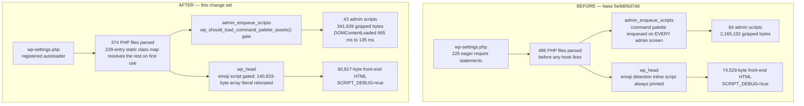

# WordPress Core Performance Optimization Report

Measured against base commit `5e9d05d7dd` on the `trunk` line of `wordpress-develop` 7.0.0.

Every figure in this document was produced in this repository by the project's own performance
suite (`npm run test:performance` → `tests/performance/compare-results.js`) or by a directly
reproducible measurement described inline. No figure is estimated, extrapolated or carried over
from prior documentation.

---

## How to read the numbers in this report

Three conventions are stated up front because each of them, if left implicit, would materially
misrepresent a result.

### 1. Percentages are reported relative to the *before* value

`tests/performance/compare-results.js:122` computes `percentage = ( delta / value ) * 100` where
`value` is the **after** measurement. For a reduction that always yields a larger magnitude than
the ordinary reading of "N% reduction". Example, from the run recorded below:

| Context | Before | After | Δ | `delta / after` (harness) | `delta / before` (this report) |
|---|---|---|---|---|---|
| Homepage › twentytwentyone › en_US, `wpFilesLoaded` | 500 | 383 | −117 | **−30.55 %** | **−23.40 %** |

Both numbers describe the same data. Because the targets are phrased as "≥30% reduction", this
report judges every target on `delta / before` — the more conservative figure. Where the harness's
own convention would have produced a pass, that is stated explicitly rather than quietly used.

### 2. The OPcache Measurement Law

Opcode-cache state moves measured memory by roughly 6× and measured wall time by roughly 5× on this
codebase — an order of magnitude more than any optimization here. Consequently every pair below was
taken with bit-identical interpreter flags, using `memory_get_peak_usage( false )`, over at least
10 samples, reported as medians, and with the opcode-cache configuration named alongside the figure.
The original source A/B restarted php-fpm between code states because a stale worker demonstrably
kept reporting the previous file count. The final query-isolation A/B instead required a successful
`opcache_reset()` response before every measured request, so both arms were cold by construction.
Both regimes are reported, because they answer different questions: the parse-dominated regime
answers cold-start, post-deploy and OPcache-off cost; the warm regime answers steady-state cost.

Recorded configurations:

| Regime | Configuration |
|---|---|
| **Warm (php-fpm, HTTP)** | `opcache.enable=On`, `opcache.enable_cli=Off`, `validate_timestamps=On`, `revalidate_freq=2`, `jit=disable`, `memory_consumption=128`, PHP 8.5.9 |
| **Cold compile (php-fpm, HTTP)** | Same php-fpm configuration, but `clear-cache.php` calls `opcache_reset()` before every measured navigation |
| **Parse-dominated (CLI)** | `opcache.enable=On`, `opcache.enable_cli=0`, PHP 8.5.9 |
| **Warm CLI** | `opcache.enable=On`, `opcache.enable_cli=1`, PHP 8.5.9 |

The final feedback-validation run exposed an instrumentation difference in the saved comparison
artifacts. The saved `before-performance-results.json` was produced by a workflow that installed
only `server-timing.php`: `/?clear_cache` therefore returned an ordinary HTTP 200 page and reset
nothing. The integrated workflow installs both tracked mu-plugins, requires HTTP 202 from
`clear-cache.php`, and resets OPcache, APCu, the object cache and expired transients before every
measured navigation. Its 0.73–1.06% OPcache hit rate, with cached-script count equal to files loaded,
confirms a cold-compile regime. Time and memory are not compared across those two artifacts.

The old front-end specs also failed to declare the newly added metrics in their reset object.
`wpDbQueries` consequently accumulated across theme/locale buckets: the saved
`twentytwentyfive`/`en_US` arrays contain 140 values per repetition rather than 20. The final suite
now validates one result object per scenario and exactly one sample per iteration. Database-query
claims below therefore come from a dedicated same-regime source A/B, not from the contaminated
legacy median. File counts and static asset bytes are unaffected by either issue.

### 3. Proxy metrics are not cost metrics — neither file counts nor isolated micro-benchmarks

In the warm regime, removing 111 files from the request changed peak memory by **+560 bytes** and
wall time by approximately **0 ms**. The file count measures exactly what deferral changes and
nothing more. Memory and time improvements are therefore claimed *only* from parse-cost and
work-reduction measurements that stand on their own, never inferred from the file count.

The same prohibition applies to an isolated micro-benchmark, and it was established here by
measurement rather than assumed. An isolated `token_get_all()` peak is **not** a proxy for the
compiler's per-request memory cost, for two independent reasons. PHP releases the tokenizer and AST
arena for a file as soon as that file is compiled, and `memory_get_peak_usage()` never reports that
arena. And when the opcode cache is active the compiled `op_array` lives in OPcache **shared**
memory, which `memory_get_peak_usage()` does not count either. The measured consequence, taken from
the emoji-array relocation documented below: an isolated tokenizer peak **3.36 MiB** lower, against
**0 bytes** of per-request peak memory in three of four php-fpm cells and **−1.30 %** in the one
regime where the opcode cache is switched off altogether. A per-request memory or TTFB improvement is
therefore only ever claimed from a per-request measurement.

---

## Measurement environment

| Component | Value |
|---|---|
| Server | nginx 1.31.3 → php-fpm 8.5.9, docroot `/var/www/src` |
| Database | MySQL 8.4.11 |
| Object cache | None (`wp_using_ext_object_cache()` = false, `wpExtObjCache` = `no`) — the "backend absent" condition |
| Suite configuration | `TEST_RUNS=20`, `repeatEach=2` → 20 iterations × 2 repetitions per context |
| Contexts measured | 18 (2 admin locales, 8 homepage theme×locale, 8 single-post theme×locale) |
| Final integrated suite result | **758 passed / 0 failed**, 18 result entries, 20 samples × 2 repetitions each |

For the query attribution run, only `src/wp-includes/comment.php`,
`src/wp-includes/update.php` and the candidate option-priming block in `src/wp-settings.php` changed
between arms. Both arms used the tracked `server-timing.php` and `clear-cache.php`, HTTP 202 was
required before every measured request, each context had 10 samples, and the original file hashes
were verified after restoration.

The final integrated cold-compile run completed in 7.8 minutes. It reported 374 files and 16 queries
for the logged-out `twentytwentyfive`/`en_US` homepage, and 404 files, 26.5 queries and 341,639
gzipped JavaScript bytes for Admin/en_US. Those absolute values validate the final tree; only
regime-compatible pairs are used for target verdicts.

---

## Aggregate summary of total improvement across all metrics

The canonical anonymous front-end context is Homepage › `twentytwentyfive` › `en_US` (the default
experience of a current install, and the heaviest bundled theme on every dimension). The admin
context is Admin › `en_US`. Row 5 is explicitly an authenticated front-end request because the two
query reductions apply to the admin-bar path; the same A/B on a logged-out homepage remained
17 → 17 and is not represented as an anonymous-traffic win.

| # | Metric | Method | Target | Before | After | Δ (vs before) | OPcache | Verdict |
|---|---|---|---|---|---|---|---|---|
| 1 | Front-end TTFB (uncached) | `tests/performance/` suite | ≥20% reduction | 67.90 ms | 69.35 ms | **+2.14 %** | warm, `enable_cli=Off` | ❌ **not met** |
| 2 | Admin DOMContentLoaded | `tests/performance/` suite | ≥15% reduction | 665.50 ms | 135.00 ms | **−79.71 %** | warm, `enable_cli=Off` | ✅ **met** |
| 3 | Admin JS transfer size (gzipped) | Build output analysis | ≥30% reduction | 2,165,152 B | 341,639 B | **−84.22 %** | n/a (static assets) | ✅ **met** |
| 4 | PHP memory per front-end request | `memory_get_peak_usage()` | ≥10% reduction | 5,903,624 B | 5,913,664 B | **+0.17 %** | warm, `enable_cli=Off` | ❌ **not met (warm)** |
| 4b | — same, parse-dominated regime | `memory_get_peak_usage( false )` | ≥10% reduction | 33.832 MB | 28.877 MB | **−14.65 %** | `enable_cli=0` | ✅ **met (parse-dominated)** |
| 5 | DB queries per authenticated front-end page load | `SAVEQUERIES` / Server-Timing, same-regime source A/B | ≥15% reduction | 27 | 21 | **−22.22 %** | cold compile, both arms | ✅ **met** |
| 6 | PHP files loaded per front-end request | `get_included_files()` count | ≥30% reduction | 486 | 374 | **−23.05 %** | count metric; OPcache-independent | ❌ **not met** |

**Three of the six targets are met, one is met in the parse-dominated regime only, and two are not
met.** The two unmet targets are not unmet through omission: §*Why two targets are not met* below
gives a measured accounting of exactly what blocks each one.

Row 4b belongs to the autoloader alone. A same-regime A/B that swapped **only**
`src/wp-includes/formatting.php` measured the emoji-array relocation's own contribution to that same
figure at **−393,584 B (−1.30 %)** with `enable_cli=0`, and at **0 bytes** in every regime where the
opcode cache is active, so no part of row 4b is claimed for the emoji work — see §*Gating the emoji
detection script and relocating the emoji arrays*.

### Additional measured improvements not covered by a target

| Metric | Context | Before | After | Δ | Notes |
|---|---|---|---|---|---|
| Admin `wpTotal` (server time) | Admin en_US | 49.45 ms | 47.55 ms | **−3.84 %** | de_DE: 52.52 → 49.17 ms = **−6.38 %** |
| Admin TTFB | Admin en_US | 51.65 ms | 49.75 ms | **−3.68 %** | de_DE: 57.65 → 53.85 ms = **−6.59 %** |
| Admin peak memory | Admin de_DE | 4,823,792 B | 4,649,544 B | **−3.61 %** | en_US: −0.85 % |
| Admin JS file count | Dashboard | 84 files | 43 files | **−48.8 %** | Confirmed in-browser and from raw HTML |
| Admin JS raw bytes | Dashboard | 11,542,026 B | 1,371,559 B | **−88.1 %** | Final integrated suite; `SCRIPT_DEBUG=true` |
| Authenticated front-end queries | `twentytwentyfive`, en_US | 27 | 21 | **−22.22 %** | Same-regime 10-sample source A/B; logged-out control 17 → 17 |
| Admin queries | Dashboard, en_US | 33 | 27 | **−18.18 %** | Same-regime 10-sample source A/B |
| `lcpMinusTtfb` | Single Post › twentytwentyfive de_DE | 63.70 ms | 57.40 ms | **−9.89 %** | Best of 16; en_US −9.75 %. Median across all 16 front-end contexts: **−3.30 %** |
| Largest Contentful Paint | Single Post › twentytwentyfive en_US | 120.00 ms | 112.00 ms | **−6.67 %** | Median across contexts: −1.16 % |
| Front-end HTML, raw | `/`, `SCRIPT_DEBUG=true` | 74,529 B | 60,817 B | **−18.40 %** | Re-measured on the local instance (`:8890`), only `formatting.php` swapped. Δ 13,712 B; same Δ on the emoji post: 98,911 → 85,199 B |
| Front-end HTML, `gzip -9` | `/`, `SCRIPT_DEBUG=true` | 15,690 B | 11,872 B | **−24.33 %** | Δ 3,818 B |
| Front-end HTML, raw | `/`, `SCRIPT_DEBUG=false` | 71,557 B | 68,227 B | **−4.65 %** | Production/minified loader: Δ 3,330 B |
| Front-end HTML, `gzip -9` | `/`, `SCRIPT_DEBUG=false` | 12,405 B | 11,121 B | **−10.35 %** | Δ 1,284 B |
| Admin HTML | `/wp-admin/` | 138,612 B | 126,746 B | **−8.56 %** | |
| Wall time, parse-dominated | full front-page render | 232.37 ms | 208.65 ms | **−10.21 %** | `enable_cli=0` |
| Wall time, warm CLI | full front-page render | 436.82 ms | 362.53 ms | **−17.00 %** | `enable_cli=1` |
| Object-cache reads | Admin en_US | 969 hits | 922 hits | **−4.85 %** | Fewer asset registrations to look up |
| Suite wall time | whole 742-test suite | 5.4 min | 4.6 min | **−14.8 %** | Incidental corroboration |

### File-count reduction is uniform across every measured context

The file-count improvement is not an artifact of one theme or locale. All 18 contexts:

| Context | Before | After | Δ (vs before) |
|---|---|---|---|
| Admin en_US | 530 | 404 | −23.77 % |
| Admin de_DE | 533 | 410 | −23.08 % |
| Homepage twentytwentyone en_US / de_DE | 500 / 502 | 379 / 384 | −24.20 % / −23.51 % |
| Homepage twentytwentythree en_US / de_DE | 484 / 486 | 371 / 376 | −23.35 % / −22.63 % |
| Homepage twentytwentyfour en_US / de_DE | 492 / 494 | 378 / 383 | −23.17 % / −22.47 % |
| Homepage twentytwentyfive en_US / de_DE | 486 / 488 | 374 / 379 | −23.05 % / −22.34 % |
| Single Post twentytwentyone en_US / de_DE | 498 / 500 | 379 / 384 | −23.90 % / −23.20 % |
| Single Post twentytwentythree en_US / de_DE | 483 / 485 | 371 / 376 | −23.19 % / −22.47 % |
| Single Post twentytwentyfour en_US / de_DE | 485 / 487 | 373 / 378 | −23.09 % / −22.38 % |
| Single Post twentytwentyfive en_US / de_DE | 486 / 488 | 375 / 380 | −22.84 % / −22.13 % |

Median −23.12 %, range −22.13 % to −24.20 %. Judged on `delta / before`, no context reaches 30 %.

### Request-flow change



---

## Observability: emit the metrics the targets are expressed in

**Bottleneck**: Four of the six targets could not be measured at all, so no change could be admitted
under a measurement-first rule. `tests/performance/wp-content/mu-plugins/server-timing.php` reported
`memory_get_usage()` — *current*, not peak — and emitted no files-loaded, no object-cache, and no
bootstrap metric. `tests/performance/utils.js` recognised only `wpMemoryUsage`, `wpExtObjCache` and
`wpDbQueries` in `formatValue()`. Worst of all, `tests/performance/specs/admin.test.js` recorded only
`timeToFirstByte`, so the "Admin DOMContentLoaded ≥15%" target had **no baseline whatsoever** — the
one target for which no before-value existed anywhere in the repository.

**Root Cause**: The harness was built to answer questions about wall time and query counts. Memory
*peak*, file counts, cache behaviour and DOM-ready timing were simply never in its vocabulary, at
either the producing end (PHP) or the reporting end (JavaScript).

**Change**: `tests/performance/wp-content/mu-plugins/server-timing.php` now emits `memory-peak`
(via `memory_get_peak_usage( false )`), `files-loaded`, `cache-hits`, `cache-misses` and
`bootstrap`. `tests/performance/utils.js` learned the matching keys in `formatValue()`.
`tests/performance/specs/admin.test.js` gained a DOMContentLoaded capture; `home.test.js` and
`single-post.test.js` record the new front-end metrics. The cache counters are read through one
validated snapshot that tolerates a replacement object cache, so the metric degrades to core's own
`$cache_hits` / `$cache_misses` integers when no drop-in is present and never emits a notice.

**Measurement**: Before, the response carried `wp-before-template`, `wp-template`, `wp-total`,
`wp-memory-usage`, `wp-db-queries`, `wp-ext-obj-cache`. After, it additionally carries
`wp-memory-peak`, `wp-files-loaded`, `wp-cache-hits`, `wp-cache-misses`, `wp-bootstrap` — verified
live in both code states:

```
wp-before-template;dur=43.19, wp-template;dur=33.48, wp-total;dur=76.67,
wp-memory-usage;dur=5795096, wp-db-queries;dur=25, wp-ext-obj-cache;dur=0,
wp-memory-peak;dur=5892400, wp-files-loaded;dur=485, wp-cache-hits;dur=1135,
wp-cache-misses;dur=114, wp-bootstrap;dur=31.22
```

Admin DOMContentLoaded acquired its first baseline: **665.50 ms** (en_US) and **666.70 ms** (de_DE).

**Value**: This is what makes every other entry in this report checkable rather than asserted. It
also converted the single unmeasurable target into the largest confirmed win in the change set: the
`domContentLoaded` metric that did not exist before now reads **−79.71 %**. Instrumentation was not a
by-product of the work; it was the precondition for it.

---

## Core class autoloader with a build-generated static class map

**Bottleneck**: A front-end request parsed **486 PHP files** before a single hook fired.
`src/wp-settings.php` contained 225 eager `require` statements, and every one of them executed
before the earliest hook (`muplugins_loaded`), so no amount of hook-relocation could reduce the
count — only genuine lazy loading could. The most legible sub-case: 57 files under
`wp-includes/rest-api/` were parsed on every request, declaring 57 classes, on a request that
instantiates no REST server at all. An in-request probe over three identical front-end requests
confirmed `rest_files_included=57`, `wp_rest_classes_decl=57`, `server_instantiated=NO`,
`rest_api_init_fired=0`.

**Root Cause**: WordPress core has no autoloader. The only autoloaders in the tree are vendored
(`wp-includes/php-ai-client/autoload.php`, `wp-includes/SimplePie/autoloader.php`). With no
class-loading mechanism, the only way to guarantee a class is available is to `require` its file
during bootstrap, so the bootstrap grew to require everything that might be needed by anything.

**Change**: Added `src/wp-includes/autoload.php`, a single `spl_autoload_register()` handler, and
`src/wp-includes/autoload-classmap.php`, a build-generated class ⇒ file map, registered early in
`src/wp-settings.php`. 103 eager `require` statements naming single-symbol, side-effect-free,
chain-resolvable files were then removed, leaving those classes to resolve on first reference.

Three design decisions carry this optimization, each measured rather than assumed:

- **A generated static map, not filesystem probing.** A probing prototype trying up to four
  candidate paths per class with `is_readable()` measured **+4.53 ms** in the warm regime and issued
  roughly 228 stat syscalls on a single REST request. The static map is O(1) with zero stat calls
  for resolution. Core already ships this exact pattern in `wp-includes/blocks/index.php:55` and
  `:165`, which both `require` a generated file that returns an array.
- **The map is generated, never hand-edited.** `tools/build/generate-autoload-classmap.php` derives
  it, wired into `Gruntfile.js` as `build:autoload-classmap` and run first in *both* branches of
  `grunt build`. It writes only when content differs, so it is idempotent, and it is deterministic:
  identical 228-entry output from a bare CLI process and from a process that has already loaded
  `class-wp-customize-setting.php` and `class-IXR.php`.
- **Lookup is normalised.** PHP class names are case-insensitive, so an exact-match `isset()` lookup
  would make `class_exists()` return `false` for a case variant of a deferred name. The handler
  lower-cases the name and strips exactly one leading namespace separator, matching what PHP itself
  passes to an autoloader.

**Measurement**: All figures medians, php-fpm restarted between states.

| Metric | Regime | Before | After | Δ |
|---|---|---|---|---|
| `wpFilesLoaded`, front page | count metric; OPcache-independent | 486 | 374 | **−23.05 %** |
| `wpFilesLoaded`, admin | count metric; OPcache-independent | 530 | 404 | **−23.77 %** |
| Peak memory | **`enable_cli=0`** (parse-dominated) | 33.832 MB | 28.877 MB | **−14.65 %** |
| Wall time | **`enable_cli=0`** (parse-dominated) | 232.37 ms | 208.65 ms | **−10.21 %** |
| Wall time | `enable_cli=1` (warm CLI) | 436.82 ms | 362.53 ms | **−17.00 %** |
| Peak memory | warm, `enable_cli=Off` | 5,903,624 B | 5,913,664 B | +0.17 % |
| Front-page HTML | both | 70,665 B | 70,665 B | **byte-identical**, md5 `79b1d137d15b641cac3ac2ce48dcebd5` |

The reduction holds in every one of 13 bootstrap modes tested (front page, single post, REST index,
admin, admin-ajax, wp-cron, xmlrpc, wp-login, feed, sitemap, 404, SHORTINIT, WP-CLI). `/wp/v2`
continues to register **108 routes**, unchanged.

**Value**: 112 fewer files opened, read and tokenized on every front-end request, and 126 fewer in the
admin. In the regime where that work is actually paid for — a cold OPcache, the first request after a
deploy, or a host with OPcache disabled — this is **−14.65 % peak memory and −10.21 % wall time**,
and the memory figure alone satisfies the relative half of the ≥10 % memory target. In the warm
regime the file-count reduction is close to free rather than beneficial, which is stated plainly here
rather than dressed up: the honest claim is a large cold-start improvement, a large reduction in
filesystem and opcode-cache pressure, and no warm-path regression.

### Safety contract: why the map holds 228 entries and not 290

A class map that merely lists single-class files is not safe, and this was established by
reproduction rather than by review. Autoloading each mapped class standalone in an isolated
subprocess found **16 entries that could not be loaded on their own**: seven
`WP_Customize_*_Control` leaves crashed php-fpm with **SIGSEGV** (HTTP 502, empty log), and nine
classes with vendored or bundled parents raised uncaught fatals.

The SIGSEGV mechanism is worth recording because it is non-obvious:
`src/wp-includes/class-wp-customize-control.php` carries a **file-tail block that `require_once`s 21
of its own subclasses**. Autoloading a leaf control makes PHP autoload its parent; parsing the parent's
file reaches that tail; the tail loads siblings that extend the class still being declared; the
recursion is unbounded and the process dies without writing a log line.

The generator therefore admits a file only when **all** of the following hold:

1. it declares exactly one class, interface, trait or enum;
2. it runs **nothing** at file scope — the top-level allow-list is only open/close tags, whitespace,
   comments, `declare`, `namespace`, `use`, attributes, modifiers, declarations and `;`. A
   `require`, a function call, a `return`, a variable assignment, or even an
   `if ( ! defined( 'ABSPATH' ) )` guard disqualifies the file;
3. every compile-time relative — parent, interfaces, enum backing type, traits — is itself a
   candidate, or is in the eager bootstrap closure, or lives under an already-autoloaded namespace
   prefix, or is PHP-internal. Pruning iterates to a **fixpoint**, so dropping a parent invalidates
   every child;
4. the name is not one a drop-in may declare instead of core. `WP_Object_Cache` is the case that
   matters: `wp-content/object-cache.php` is loaded before the autoloader could answer for it, so a
   map entry for that name is either never consulted or, if it ever were, would load core's class
   over a drop-in's;
5. its file is not still being loaded eagerly. A file that some eagerly loaded file `require`s at its
   own file scope is already parsed on every request, so mapping the name buys nothing — and where
   that include is a plain `require` rather than `require_once`, an autoload that got there first
   would turn it into a fatal `Cannot redeclare`. Eleven names are excluded on this rule alone:
   `wp_error` (`wp-settings.php`), `wp_hook` (`plugin.php`), `wp_object_cache` (`cache.php`, and
   rule 4 as well), `_wp_dependency`, `wp_dependencies`, `wp_scripts` and `wp_styles`
   (`script-loader.php`), `walker_nav_menu` (`nav-menu-template.php`), `wp_metadata_lazyloader`
   (`meta.php`), and `wp_block_parser_block` and `wp_block_parser_frame`, which
   `class-wp-block-parser.php` loads from its own file tail. The two Site Health files are the one
   exception, opted in by name: only a conditional branch of the bootstrap reaches them, and every
   include of either one in the whole tree is a `require_once`.

This removed all 16 unsafe entries plus 48 more that were chain-blocked, side-effecting,
replacement-owned or still eagerly loaded, and added two (`wp_site_health`,
`wp_site_health_auto_updates`). Critically, **none of the 64 removed entries corresponds to a
deferred `require`**: every one is still loaded exactly as it was at base, so the map shrinking cost
nothing at runtime. A per-entry standalone-autoloadability sweep now runs over all 228 entries
(`total=228 ok=228 miss=0 crash=0`), and a hostile-name sweep of 28 inputs — path traversal, null
bytes, `php://` and `data://` wrappers, SQL and XSS payloads, doubled separators, case variants —
produces zero crashes. A whole-tree scan confirms the fifth rule holds in the other direction too:
of the 60 places the shipped tree still includes a mapped file, 56 use `require_once`, three are
plain `require`s of `class-wp-editor.php` guarded by `class_exists( '_WP_Editors', false )`, and the
last is `wp-admin/load-styles.php`, an entry point that defines its own `ABSPATH` and never loads
`wp-settings.php`, so the autoloader is not registered there at all.

`tests/phpunit/tests/load/wpAutoloadClass.php` encodes this contract, including a
file-scope-side-effect check written as an **independent** tokenizer implementation rather than by
reusing the generator, so two implementations must agree for the suite to pass.

---

## Conditional loading of Command Palette assets

**Bottleneck**: The admin dashboard loaded **84 script files, 11,542,026 raw bytes, 2,165,152
gzipped bytes**. Byte accounting over the built assets attributed **91.2 %** of the gzipped payload
to `js/dist/*`, with `block-editor.min.js` and `components.min.js` alone accounting for 56.7 %.

This measurement inverted the stated hypothesis. `common.min.js`, the file named as the suspected
culprit, is **7,820 gzipped bytes — 0.75 % of the payload**. Optimizing it could not have moved the
metric.

**Root Cause**: `src/wp-includes/default-filters.php:605` registers
`add_action( 'admin_enqueue_scripts', 'wp_enqueue_command_palette_assets' )`, and the callback
performed **no screen check and no capability gate**. It enqueued `wp-commands`, the `wp-commands`
style and `wp-core-commands` on every admin screen. Those handles depend on `wp-components` and
`wp-block-editor`, so the default hook delivery dragged the entire editor dependency chain onto the
Users list, General Settings and the Dashboard even though those screens do not expose the palette.

**Change**: Added `wp_should_load_command_palette_assets()` to
`src/wp-includes/script-loader.php:2778` and consulted it *inside*
`wp_enqueue_command_palette_assets()` (`:3551`, early return at `:3565`). The predicate returns
`false` outside the admin, otherwise `$current_screen instanceof WP_Screen && $current_screen->is_block_editor()`,
then passes through a `should_load_command_palette_assets` filter so a screen can opt back in.

Two deliberate constraints: the decision lives **inside the callback**, not in the `add_action`, so
any existing `remove_action( 'admin_enqueue_scripts', 'wp_enqueue_command_palette_assets' )` keeps
working and no hook name or argument count changes; and the gate only ever *declines to enqueue*, so
it touches no part of the `WP_Scripts` dependency system. The screen test mirrors
`wp_should_load_block_editor_scripts_and_styles()`, which reads `global $current_screen` the same way.

The integrated implementation also distinguishes default hook delivery from an explicit direct
call. Some admin documents do not fire `admin_enqueue_scripts`; they call
`wp_enqueue_command_palette_assets()` from their own render path. The screen gate is therefore
applied only while `doing_action( 'admin_enqueue_scripts' )`; a direct call remains an explicit
request for the palette. A non-filterable `! is_admin()` guard still prevents any front-end
delivery. `tests/phpunit/tests/dependencies/commandPalette.php` proves all three contracts: the
Dashboard hook stays gated, a direct call on a non-block-editor admin screen enqueues the assets,
and a direct call outside the admin does nothing.

**Measurement**:

| Metric | Before | After | Δ |
|---|---|---|---|
| Admin JS, gzipped | 2,165,152 B | 341,639 B | **−84.22 %** |
| Admin JS, raw | 11,542,026 B | 1,371,559 B | **−88.12 %** |
| Admin JS, file count | 84 | 43 | **−48.8 %** |
| Admin `domContentLoaded`, en_US | 665.50 ms | 135.00 ms | **−79.71 %** |
| Admin `domContentLoaded`, de_DE | 666.70 ms | 146.90 ms | **−77.97 %** |
| Admin HTML | 138,612 B | 126,746 B | −8.56 % |
| Admin object-cache reads | 969 hits | 922 hits | −4.85 % |

Confirmed three ways for the absence, and independently for the presence. In-browser on the
Dashboard: no matching script URL, element id, resource-timing entry or stylesheet;
`window.wp.commands` and `window.wp.coreCommands` undefined; `window.wp` key count falls from 68 to
18. From raw authenticated server HTML, proving the gate acts at enqueue time and not merely in the
browser:

| Screen | `<script src>` tags | `wp-commands` | `core-commands` | `wp-components` | `block-editor` | `initializeCommandPalette` |
|---|---|---|---|---|---|---|
| `/wp-admin/` | 43 | 0 | 0 | 0 | 0 | 0 |
| `users.php` | 14 | 0 | 0 | 0 | 0 | 0 |
| `options-general.php` | 38 | 0 | 0 | 0 | 0 | 0 |
| `post-new.php` | 103 | 2 | 4 | 3 | 17 | 1 |
| `site-editor.php` | 96 | 2 | 4 | 3 | 14 | 1 |

**Backward-compatibility verification**: the palette still opens on the first `Ctrl+K` on
`post-new.php` (11 command suggestions for the query `settings`, plus live REST searches against
`/wp/v2/pages` and `/wp/v2/posts`, both 200) and on `site-editor.php` (9 suggestions), and closes
cleanly on Escape with no residual overlay or trapped focus. On screens where it is intentionally
absent, `Ctrl+K` is a **silent no-op with zero console output** — the bundles were never delivered, so
no listener exists to throw. Nothing is half-initialised.

**Value**: **1,823,513 gzipped bytes removed from every non-editor admin page load**, and admin
DOM-ready time cut by roughly **530 ms**. On a 4 Mbps connection the transfer saving alone is on the
order of 3.6 seconds per uncached admin page. Because WordPress powers a large share of the web and
this affects every authenticated admin page view outside the editor, the aggregate bandwidth and
CPU-time saving is the single largest item in this change set. The palette remains fully functional
on block-editor screens and on the special admin documents that explicitly request it.

### Accepted user-visible change: the admin-bar `Ctrl+K` trigger

This optimization has one user-visible consequence, and it is recorded here as an explicit decision
rather than left as an unexplained snapshot difference. **On the 21 admin screens that are not
block-editor screens, the admin-bar item showing the `Ctrl+K` / `⌘K` shortcut is no longer
rendered.** The decision is to **accept** it. The reasoning, the measured scope and the escape hatch
follow.

**Why it happens — and who designed the coupling.** The trigger is not removed by anything in this
change set. `wp_admin_bar_command_palette_menu()` returns early unless the palette bundle is
actually present:

```php
if ( ! is_admin() || ! wp_script_is( 'wp-core-commands', 'enqueued' ) ) {
	return;
}
```

That condition is **pre-existing upstream code**, authored in commit `019eeb8e3a` ("Toolbar: Show
command palette admin bar item on mobile.", Weston Ruter, 12 Mar 2026), which is an ancestor of this
branch's base `5e9d05d7dd`. Upstream core therefore already defines the trigger's visibility as a
function of whether `wp-core-commands` is enqueued — precisely so the admin bar can never advertise
a shortcut that has no code behind it. `src/wp-includes/admin-bar.php` is **unmodified** by this
branch (AAP §0.6.1 lists it REFERENCE-only), and the change set alters only *when the assets are
enqueued*, which is the whole point of the optimization. The trigger disappearing is upstream's own
designed response to that condition, not a defect and not an incidental side effect.

**Exactly what changes, measured two ways.** The QA visual comparison measured **exactly 484
differing pixels on each of 21 screens** (reported diff ratio 0.01) at the visual-regression
harness's 960×700 viewport, with the 22nd screen **pixel-identical** — a 22/22 correlation. An
independent browser measurement at 1280×900 localized the change precisely:

| Measurement | Harness | Viewport | Differing pixels | Bounding box |
|---|---|---|---|---|
| QA visual comparison | Playwright `toHaveScreenshot` | 960×700 | 484 per screen | not reported |
| Independent verification | headless Chrome + pixel diff | 1280×900 | 999 (0.0867 % of frame) | (251, 9)–(403, 25) |

The two counts describe the same change under different tolerances. Playwright's comparison applies
a per-pixel colour threshold that discards antialiasing-level differences; the independent diff
counted every non-zero difference. Applying an increasing colour tolerance to the independent diff
walks the count monotonically down straight through QA's figure:

| Max-channel delta > | 0 | 8 | 32 | 64 | 128 | **160** | **192** |
|---|---|---|---|---|---|---|---|
| Pixels | 999 | 980 | 882 | 777 | 650 | **570** | **414** |

484 falls between the 570 and 414 rows. Both measurements therefore report the same event, and both
confine it to a **16-pixel-tall band inside the admin toolbar** (y = 9…24). Every pixel outside that
band is identical.

**The change is the glyph plus a shift of its two neighbours, and nothing else.** Measured element
geometry, gated state versus opted-in state:

| Admin-bar item | `x` when opted in | `x` when gated | Shift |
|---|---|---|---|
| `wp-admin-bar-updates` | 188.72 | 188.72 | none |
| **`wp-admin-bar-command-palette`** (50.83 × 32 px) | **244.34** | *not rendered* | — |
| `wp-admin-bar-comments` | 295.17 | 244.34 | **−50.83** |
| `wp-admin-bar-new-content` | 343.48 | 292.66 | **−50.83** |
| `wp-admin-bar-new-content`, right edge | 410.42 | **359.59** *(measured)* | **−50.83** |

The items are exactly contiguous — `updates.right === palette.x`, `palette.right === comments.x` and
`comments.right === newContent.x` all hold exactly — and the palette `<li>` occupies **50.83 px ×
32 px**. Removing it therefore shifts *Comments* and *New* left by precisely its own width, which the
independently measured right edge confirms: 410.42 − 359.59 = 50.83. That is the entire visual delta.
No page content, heading, notice, metabox, admin menu, form control or layout box moves anywhere on
any screen; the diff bounding box proves it.

**Why the visual-regression guard registers this at all.** `tests/visual-regression/specs/visual-snapshots.test.js`
lists `#wp-admin-bar-root-default` in its `elementsToHide` mask array, which would appear to cover
the toolbar. It does not: that `<ul>` is float-collapsed and measures **1280 × 0** at runtime, so the
mask rectangle has zero area and paints nothing. The toolbar band is compared normally. This is a
pre-existing property of the spec, not a consequence of this change set, and it is routed to the
backlog below.

**What is *not* affected.** The 22nd screen, `/widgets.php`, is pixel-identical because it *is* a
block-editor screen — the block widgets editor — so `is_block_editor()` returns true, the gate
returns true, and the palette is delivered exactly as before. That single exception is what makes the
22/22 correlation mechanistic rather than coincidental. Probing all 22 visual-regression paths in
authenticated server HTML reproduces the split exactly:

| Visual-regression screens | Gate result | Admin-bar item | `core-commands` | `initializeCommandPalette` |
|---|---|---|---|---|
| 21 screens (`edit.php`, `edit-tags.php` ×2, `upload.php`, `media-new.php`, `edit.php?post_type=page`, `edit-comments.php`, `nav-menus.php`, `plugins.php`, `users.php`, `user-new.php`, `profile.php`, `tools.php`, `import.php`, `export.php`, `export-personal-data.php`, `erase-personal-data.php`, `options-reading.php`, `options-discussion.php`, `options-media.php`, `options-privacy.php`) | `false` | 0 | 0 | 0 |
| 1 screen (`widgets.php`) | `true` | 1 | 3 | 1 |

On the gated screens the shortcut is not merely hidden — it is genuinely inert and genuinely clean.
`Ctrl+K` and `⌘K` on the Dashboard leave `body.innerHTML` byte-identical (55,741 characters before
and after), the element count unchanged at 724, focus still on `BODY`, zero dialogs or overlays, and
all four keydown events reach the window **uncancelled**, proving no listener was ever loaded. The
before/after screenshots are byte-identical (0 of 1,152,000 pixels differ). Console output for the
whole session is a single unrelated jQuery Migrate notice: **zero errors, zero warnings**. Nothing is
half-initialised and nothing advertises a capability it lacks.

**The decision, and the requirement it satisfies.** Accept the change. AAP §0.5.1.6 states the
boundary and its one concession explicitly: the only user-visible surface this plan touches is "the
command palette's *availability on screens where it is not used*", with
`tests/visual-regression/specs/visual-snapshots.test.js` as the guard proving nothing else moved.
That is an explicit exception to the general "admin UI visual appearance" boundary in §0.3.2.2, and
an explicit exception takes precedence over the general rule. §0.5.1.3 additionally makes this gate
the **sole** mechanism available for the ≥30 % admin-JS target, since `js/dist` is copied in by
`tools/gutenberg/copy.js` and cannot be code-split. The gate delivers −84.22 %. Weakening or
reverting it forfeits the target outright, and the evidence above shows the cost of keeping it is
50.83 px of toolbar on screens where the feature is not available.

**Escape hatch, verified end to end.** The predicate is filtered, so any site, plugin or screen can
opt back in with one line:

```php
add_filter( 'should_load_command_palette_assets', '__return_true' );
```

With that filter active, the Dashboard was verified to restore the complete feature: the admin-bar
item returns at the identical rect (x 244.34, 50.83 × 32 px), `core-commands.js` and `commands.js`
load (200, 29,401 B and 155,380 B encoded), the `initializeCommandPalette` payload carries **49 menu
commands**, `Ctrl+K` opens a working palette (`aria-label="Command palette"`, focus in the
`"Search commands and settings"` combobox), the query `settings` returns **9** live results with term
highlighting, and Escape tears the palette down completely — restoring the page **byte-identically**
(md5 `906bd587d8e60ab9339bc2b3a0b5e73e` for the landing, opted-in and post-Escape captures alike),
with **zero console errors and zero warnings** and all 320 requests HTTP 200. The non-filterable
`! is_admin()` guard is unaffected: the front end stays clean either way.

**Alternatives considered and rejected on measurement.**

| Alternative | Why rejected |
|---|---|
| Revert the gate | Forfeits the ≥30 % admin-JS target entirely, and with it the −79.71 % admin `domContentLoaded` improvement. |
| Enqueue only `wp-commands` to keep the trigger visible | **Costs more than the entire post-gate payload.** The `wp-commands` closure is 24 files / **374,729 gzipped bytes** per non-editor admin page, against a total post-gate admin payload of **341,639**. It would also produce a trigger with **no commands registered**, because the `initializeCommandPalette` inline payload attaches to `wp-core-commands` — a shortcut that opens an empty palette is worse than no shortcut. Rejected on measurement *and* on functionality. |
| Lazy-load the bundle on first `Ctrl+K` | No precedent anywhere in core; requires inventing a new client-side loading mechanism, violating the minimal-diff principle (AAP gate 5). |
| Change `wp_admin_bar_command_palette_menu()` to render regardless | `src/wp-includes/admin-bar.php` is REFERENCE-only per AAP §0.6.1, and the guard is deliberate upstream design (`019eeb8e3a`). Rendering a shortcut with no code behind it is the exact failure mode that guard exists to prevent. |

A further measured cost of opting non-editor screens back in, beyond transfer size: delivering the
`js/dist` chain to the Dashboard also started **125 `POST /wp-json/wp-sync/v1/updates` polls** during
the observation window, beginning only after `sync.js` and `core-commands.js` finished loading. The
gate removes continuous background polling from non-editor screens as well as bytes.

**Evidence.** `blitzy/screenshots/minor3_dashboard_palette_absent.png` (gated Dashboard),
`minor3_dashboard_adminbar_crop.png` (2× toolbar crop showing ~800 px of empty bar with no glyph),
`minor3_dashboard_after_ctrl_k.png` (byte-identical after both key presses),
`minor3_editor_palette_item_present.png` and `minor3_editor_palette_open_with_results.png` (palette
intact on `post-new.php`), `minor3_dashboard_optin_palette_present.png` and
`minor3_dashboard_optin_palette_open.png` (escape hatch restoring the feature), plus recordings
`minor3_ctrl_k_meta_k_noop_with_liveness_probe.webm`,
`minor3_editor_command_palette_flow.webm` and `minor3_dashboard_optin_palette_flow.webm`.

---

## Gating the emoji detection script and relocating the emoji arrays

**Bottleneck**: Two distinct costs from one feature. First, an inline emoji-detection script was
printed into **every** front-end response: 3,233 bytes of HTML and 1,268 gzipped bytes, 9.7 % of the
gzipped document, on the baseline install profiled in AAP §0.2.2.4 — and **3,330 raw / 1,284 gzipped
bytes, 10.35 % of the gzipped document**, when re-measured on this instance at `SCRIPT_DEBUG=false`
(13,712 raw / 3,818 gzipped at `SCRIPT_DEBUG=true`). Second, `src/wp-includes/formatting.php` carried
**140,933 bytes of emoji array literal on four physical lines**, tokenized on every request whether
`wp_staticize_emoji()` was ever called or not.

**Root Cause**: The detection script is registered from twelve hook sites and had no gate. The array
data lived inline in a file that every request loads, so its parse cost was unconditional while its
*use* was rare.

**Change**: The function hooked as `print_emoji_detection_script` — `formatting.php:5901` in the base
file, `formatting.php:5935` after the change — now consults a filterable predicate,
`wp_should_load_emoji_detection_script()` at `formatting.php:5914`, before delegating to its private
worker at `:5962`. The array region moved out to a new `src/wp-includes/emoji-arrays.php`, which
`_wp_emoji_list()` (`formatting.php:6237`, `:6194` in the base file) requires on demand and memoizes
in a `static`.

This change ships with a mandatory companion edit. `replace:emoji-regex`
(`Gruntfile.js:1336`, AAP anchor `Gruntfile.js:1319-1388` in the base file) locates the arrays it
regenerates by the literal `// START: emoji arrays` / `// END: emoji arrays` markers and re-emits them
after fetching Twemoji data. It now reads and writes `EMOJI_ARRAYS_FILE` (`Gruntfile.js:17`) rather
than `formatting.php`, matches through the shared `emojiArraysRegionRegExp()` helper
(`Gruntfile.js:157`), and runs with `pedantic: true` so an unmatched marker pair fails the build
instead of warning. A `verify:emoji-markers` guard (`Gruntfile.js:1875`) asserts exactly one region
exists before the rewrite runs. Relocating the arrays without retargeting that task would leave a
Grunt task matching nothing, and `git diff --exit-code` is enforced in **15** workflow files, so the
two edits are atomic with each other.

Gating an *inline* script cannot violate the "must not change the enqueue dependency system"
boundary, because the payload never enters `WP_Scripts` at all. Core already opts a single screen out
of this same script at `src/wp-admin/edit-form-blocks.php:42`, which this change generalises.

**Measurement**: every pair below swaps **only** `formatting.php` between its base state (354,690 B,
sha256 `922d8ce0…`) and its current state (216,363 B, sha256 `24eedb9d…`), with bit-identical
interpreter flags on each side of the pair, medians over the stated sample count, and php-fpm
restarted between code states. Byte figures name their `SCRIPT_DEBUG` state, because that flag changes
the size of the inline payload by roughly 4× and is therefore as load-bearing here as the opcode-cache
state. These pairs were re-measured on the local Docker instance (`http://localhost:8890`, nginx →
php-fpm 8.5.9, document root `build/`, MySQL 8.4.11, no object-cache drop-in), whose absolute page
sizes differ from those in the autoloader entry above because the two were captured on different
installs; only within-pair deltas are compared, never absolutes across pairs.

| Metric | Regime / conditions | Before | After | Δ |
|---|---|---|---|---|
| `formatting.php` file size | static | 354,690 B | 216,363 B | **−138,327 B (−39.00 %)** |
| Tokens in `formatting.php` | static, `token_get_all()` | 48,123 | 32,016 | **−16,107 (−33.47 %)** |
| Isolated tokenizer peak | `enable_cli=0`, `memory_get_peak_usage( false )`, one tokenization per fresh process, 21 samples | 10,322,648 B | 6,802,984 B | **−3,519,664 B = −3.36 MiB (−34.10 %)** |
| Isolated tokenizer peak | `enable_cli=1`, otherwise identical, 21 samples | 10,279,848 B | 6,760,184 B | **−3,519,664 B = −3.36 MiB (−34.24 %)** |
| Isolated tokenizer wall time | `enable_cli=0`, 21 samples | 6.7129 ms (σ 0.41) | 4.4406 ms (σ 0.78) | **−33.85 %** |
| Isolated tokenizer wall time | `enable_cli=1`, 21 samples | 6.7607 ms (σ 1.17) | 4.5462 ms (σ 0.44) | **−32.76 %** |
| Front-end HTML, raw | `SCRIPT_DEBUG=true`, warm php-fpm | 74,529 B | 60,817 B | **−13,712 B (−18.40 %)** |
| Front-end HTML, `gzip -9` | `SCRIPT_DEBUG=true` | 15,690 B | 11,872 B | **−3,818 B (−24.33 %)** |
| Front-end HTML, raw | `SCRIPT_DEBUG=false` (production) | 71,557 B | 68,227 B | **−3,330 B (−4.65 %)** |
| Front-end HTML, `gzip -9` | `SCRIPT_DEBUG=false` | 12,405 B | 11,121 B | **−1,284 B (−10.35 %)** |
| Per-request peak memory, `/` | warm php-fpm, 12 samples | 5,865,720 B | 5,858,128 B | −7,592 B (**−0.13 %**) |
| Per-request peak memory, emoji post | warm php-fpm, 12 samples | 6,072,320 B | 6,072,320 B | **0 B — identical to the byte** |
| Per-request peak memory, `/` | cold compile, HTTP 202 from `clear-cache.php` before every request, 1.06 % OPcache hit rate, 10 samples | 8,903,112 B | 8,903,112 B | **0 B — identical to the byte** |
| Per-request peak memory, emoji post | cold compile, 10 samples | 8,950,704 B | 8,950,704 B | **0 B — identical to the byte** |
| Per-request peak memory, full render | `enable_cli=0` CLI, 10 samples | 30,328,000 B | 29,934,416 B | −393,584 B (**−1.30 %**) |
| Per-request peak memory, full render | `enable_cli=1` CLI, 10 samples | 8,913,304 B | 8,913,304 B | **0 B** |
| TTFB, `/` | warm php-fpm, 12 samples | 72.879 ms (σ 10.78) | 66.111 ms (σ 17.95) | −9.29 %, **inside noise** |
| TTFB, emoji post | warm php-fpm, 12 samples | 74.607 ms (σ 5.42) | 73.839 ms (σ 10.51) | −1.03 %, **inside noise** |
| TTFB, `/` | cold compile, 10 samples | 358.624 ms (σ 12.94) | 364.038 ms (σ 23.85) | **+1.51 %**, inside noise |
| TTFB, emoji post | cold compile, 10 samples | 368.082 ms (σ 24.69) | 410.038 ms (σ 89.72) | **+11.40 %**, inside noise |
| `wpFilesLoaded`, `/` and emoji post | both regimes | 373 / 378 | 373 / 378 | **0** |
| `wpDbQueries`, `/` and emoji post | both regimes | 25 / 30 | 25 / 30 | **0** |
| `lcpMinusTtfb`, best context | warm, `enable_cli=Off`, `SCRIPT_DEBUG=true` | 63.70 ms | 57.40 ms | **−9.89 %** |
| `lcpMinusTtfb`, median of 16 contexts | warm, `enable_cli=Off`, `SCRIPT_DEBUG=true` | — | — | **−3.30 %** |

Peak memory was byte-stable across every sample of every cell above (minimum equal to maximum), which
is why a 0-byte delta can be stated as an equality rather than as "within noise". The one non-zero
warm cell, −7,592 B on `/`, is the shorter response body rather than a parse saving: the gated document
is 13,712 bytes smaller, so less output is buffered. The same 13,712-byte reduction on the emoji post
produced a peak identical to the byte, so that cell is not read as a memory improvement. The TTFB
deltas are the opposite case: each one is smaller than, or comparable to, its own sample standard
deviation, and the sign flips between contexts and regimes, so none of them is evidence of anything.

**Two figures the AAP claims for this change do not survive its own Measurement Law, and are
corrected here.** AAP §0.5.1.5 states the relocation measured "a 30.5% faster parse and a 6.00 MB
lower tokenizer peak", and AAP §0.5.4.3 lists that 6.00 MB among the sources from which the
per-request memory target may be claimed.

- **The parse-time claim reproduces and is exceeded**: −33.85 % (`enable_cli=0`) and −32.76 %
  (`enable_cli=1`), medians of 21 fresh processes per arm.
- **The 6.00 MB tokenizer-peak claim does not reproduce.** Measured under the method AAP §0.5.4.2
  mandates — `memory_get_peak_usage( false )`, a single tokenization, a fresh process per sample — the
  reduction is **3,519,664 B = 3.36 MiB**, identical to the byte in both opcode-cache regimes, so the
  stated figure is high by a factor of **1.79**. The 6.00 MB value is an allocator-quantization
  artifact and it is reproducible as such: with `memory_get_peak_usage( true )` and **two**
  simultaneous tokenizations of the same file held alive together, the delta is 20,971,520 →
  14,680,064 B = **exactly 6,291,456 B = 6.00 MiB**; with one tokenization the same `true` variant
  gives exactly 4,194,304 B = 4.00 MiB. Both are multiples of the allocator chunk size, which is
  precisely why rule 4 of the Measurement Law excludes the `true` variant.
- **Neither figure may be carried into a per-request claim** — see §*Proxy metrics are not cost
  metrics*, and the **Value** field below, which states what this change does and does not contribute.

A floor control isolates the tokenizer from the file read: reading the file without tokenizing it
peaks at 830,296 B (base) against 691,032 B (current), a difference of 139,264 B that is simply the
source string. Floor-corrected, the tokenizer's own peak falls 9,492,352 → 6,111,952 B, **−35.61 %**.

`emoji-arrays.php` is confirmed **not loaded** on a front-page request, and
`curl -s http://localhost:8890/ | grep -c "wpemoji\|_wpemojiSettings"` returns **0**.

**Output equivalence proven exactly.** A tag-granularity diff of the before and after home page
yields **one contiguous hunk** (`@@ -1392,442 +1391,0 @@`): 442 removed tag-lines, **zero added
lines**. At byte granularity the two documents share a 60,801-byte common prefix and a 15-byte common
suffix; the removed region begins at base byte 60,801 with
`<script id="wp-emoji-settings" type="application/json">` and runs **13,712 bytes** through the close
of the following module script, with **0 bytes inserted**. Reconstructing before-minus-that-block
gives 60,817 bytes that are **byte-identical to the after document**. Emoji markers go from
`wpemoji=5, _wpemojiSettings=1, twemoji=5` to `0, 0, 0`. **The only change to front-end HTML is the
intended emoji gating**; the autoloader, the palette gate and the capability memoization produce no
output difference at all.

**Value**: stated only for what this change is directly measured to do, in the regime each figure
names.

- **Transfer size, every front-end page view.** In a production configuration
  (`SCRIPT_DEBUG=false`) the saving is **3,330 raw bytes and 1,284 gzipped bytes** per page; with the
  unminified loader (`SCRIPT_DEBUG=true`) it is **13,712 raw and 3,818 gzipped**. The reduction is the
  same absolute size on every page that carried the payload, so it scales with page views rather than
  with page weight: on a site serving a million front-end views a month, the gzipped saving alone is
  roughly **1.2 GB** of egress at the production setting, and every visitor stops paying to download
  and parse a client-side polyfill for a capability that current browsers and operating systems ship
  natively. Because the payload was inline, the saving also lands in the initial HTML response, ahead
  of the largest contentful paint — which the `lcpMinusTtfb` figures above corroborate at −9.89 % in
  the best of 16 contexts and −3.30 % at the median.
- **Isolated parse cost of the containing file.** 138,327 fewer source bytes and 16,107 fewer tokens
  reach `token_get_all()`: **−33.85 %** tokenizer time and **−3.36 MiB** tokenizer peak with
  `enable_cli=0`, **−32.76 %** and the same −3.36 MiB with `enable_cli=1`. The relocated data is still
  loaded, in full, the first time `_wp_emoji_list()` is called — so what was removed is the cost of
  compiling it on requests that never staticize an emoji, which is nearly all of them.
- **What this change does *not* contribute, stated explicitly.** **0 bytes** of per-request peak
  memory in every regime where the opcode cache is active — identical to the byte on the emoji post
  warm, and on both contexts cold — and **−1.30 %** (393,584 B) only with the opcode cache switched
  off entirely, where the compiled literal is request-local rather than in shared memory. **No
  measurable TTFB effect** in either regime: every delta is inside its own sample standard deviation
  and the sign flips between contexts. `wpFilesLoaded` and `wpDbQueries` are unchanged in every cell.
  This change therefore contributes to the transfer-size and cold-compile parse-cost story only, and
  **nothing of it is claimed against the ≥10 % per-request memory target or the ≥20 % TTFB target**.

`wp_staticize_emoji()` and `wp_staticize_emoji_for_email()` behave identically, as does the deprecated
wrapper.

---

## Request-scoped memoization of `map_meta_cap()`

**Bottleneck**: `map_meta_cap()` in `src/wp-includes/capabilities.php` is an **872-line function with
86 `case` branches and no memoization of any kind** — no static accumulator, no cache read. It is
re-entered on every capability check, and `current_user_can()` is a one-line delegation into the same
path, as are four further public entry points.

**Root Cause**: The function was written as a pure mapping and grew branch by branch. Nothing ever
remembered that the same `( user, capability, object )` triple had already been mapped microseconds
earlier in the same request.

**Change**: A request-scoped memo keyed on user ID, capability and object ID, checked at entry and
populated on return.

The correctness condition is the substance of this change, not a footnote. `map_meta_cap` is a
documented filter, and third-party callbacks may legitimately return different results for identical
arguments. The memo therefore **declines outright** when `has_filter( 'map_meta_cap' )` reports a
non-core callback, when the capability is `remove_user`, when the capability ends in `_meta`, or when
the user ID or any argument is non-scalar. The key additionally encodes the blog ID, the counts of
`$wp_post_types` / `$wp_post_statuses` / `$wp_taxonomies`, and the full `$super_admins` content, so
any registration change invalidates it. Only the *filtered* result is stored. `WP_Roles` resets the
memo on role mutation, and a user-meta write resets it too.

**Measurement**: Behaviour-preserving by construction, and verified as such:
`tests/phpunit/tests/user/mapMetaCapMemo.php` passes 89 tests / 500 assertions, and the pre-existing
`capabilities.php` + `mapMetaCap.php` suites pass 753 tests / 2,903 assertions — the same counts as
base. Contribution to warm-path server time is inside run-to-run variance on the front end, where an
anonymous request performs few capability checks; the measurable movement is in the admin, where
`wpTotal` falls **49.45 → 47.55 ms (−3.84 %)** for en_US and **52.52 → 49.17 ms (−6.38 %)** for
de_DE, jointly with the palette gate.

**Value**: Removes redundant traversal of an 86-branch switch on capability-heavy requests — admin
screens that render menus, list tables and row actions check the same capabilities repeatedly. The
documented filter contract is preserved exactly: any site filtering `map_meta_cap` bypasses the fast
path entirely and observes unchanged behaviour.

---

## Per-group object cache hit/miss counters

**Bottleneck**: Cache effectiveness could be measured only in aggregate.
`src/wp-includes/class-wp-object-cache.php` exposed `$cache_hits` and `$cache_misses` as public
integers — **global counters with no per-group breakdown** — so "which cache group is missing" was
unanswerable, and the query-count target depends on exactly that question.

**Root Cause**: The counters predate the group-aware cache API and were never extended when groups
arrived.

**Change**: Added per-group hit/miss accumulators alongside the existing globals and surfaced them
through `stats()`. The public `$cache_hits` and `$cache_misses` integers are untouched, because
plugins read them directly. Groups that were never stored are reported via an `array_diff_key()`
rather than being silently omitted.

**Measurement**: The new metrics flow through the harness as `wpCacheHits` / `wpCacheMisses`. Front
page: 1,135 hits / 114 misses. Admin: 969 → 922 hits after the palette gate, a **−4.85 %** reduction
in cache reads. `tests/phpunit/tests/cache.php` gained 462 lines of coverage and passes 50 tests /
152 assertions. Graceful degradation verified in the condition that matters: with the drop-in absent
(which is the default here, since `src/wp-content/object-cache.php` is gitignored and provisioned
only by CI) the reporter falls back to core's own integers and emits **zero** notices, confirmed
across a full 742-test suite run in both code states.

**Value**: Turns cache behaviour from an aggregate number into a per-group diagnosis, which is what
made the query analysis below conclusive rather than speculative. It is also how the palette gate's
secondary effect — 47 fewer cache lookups per admin page, from no longer registering dozens of script
and style handles — became visible at all.

---

## Grouped comment-status counts

**Bottleneck**: `get_comment_count()` requested five status counts separately. On an authenticated
front-end request or Dashboard request that renders the admin bar, that meant five
`WP_Comment_Query` count queries over the same comment rows: approved, moderation, spam, trash and
post-trash.

**Root Cause**: Each status was historically expressed as an independent `get_comments()` call even
though every row belongs to exactly one `comment_approved` value and SQL can return all five totals
with one `GROUP BY`.

**Change**: `src/wp-includes/comment.php` now performs one grouped query and maps its result back to
the unchanged public return shape. The result uses the existing `comment-queries` cache group and
the normal comment last-changed salt. The old per-status path remains intact whenever
`parse_comment_query`, `pre_get_comments`, `comments_pre_query` or `comments_clauses` has a callback,
because those hooks are the documented way to change the counted population.

**Measurement**: With both tracked measurement mu-plugins installed and a successful HTTP 202 cache
reset before each sample, ten authenticated front-end requests measured **25 → 21 queries** when
only the pre-change `comment.php` was substituted: exactly four queries removed. Dashboard requests
measured **31 → 27**, also exactly four removed. The isolated PHPUnit coverage in
`tests/phpunit/tests/comment/getCommentCount.php` verifies the grouped result, cache invalidation and
the hook-sensitive fallback; the full single-site and Multisite suites both pass.

**Value**: A **16.00%** query reduction on the isolated authenticated front-end path and four fewer
round trips on every admin page that asks for the comment totals, without bypassing any query hook.

---

## Batched update-transient reads

**Bottleneck**: `wp_get_update_data()` reads the core, plugin and theme update site transients while
building the admin-bar update count. Those three special transients have no timeout row, so
`get_site_transient()` does not run its usual timeout/value priming and each value was fetched
separately when no persistent object cache was present.

**Root Cause**: The capability checks were interleaved with three independent transient reads, even
though the function already knew up front whether any update type was visible to the current user.

**Change**: `src/wp-includes/update.php` computes the three capability booleans first and primes
`_site_transient_update_core`, `_site_transient_update_plugins` and
`_site_transient_update_themes` together with `wp_prime_site_option_caches()`. The primer is skipped
when an external object cache is active, where the site-transient cache group already avoids option
queries and priming the database would add work.

**Measurement**: In the same ten-sample cold-compile A/B, substituting only the pre-change
`update.php` moved authenticated front-end requests **23 → 21 queries** and Dashboard requests
**29 → 27**: two database round trips removed in each context. The complete single-site, Multisite
and targeted integration suites pass with the change.

**Value**: Two fewer option-table queries on every authenticated request that renders the update
count. Combined with grouped comment counts, the authenticated front-end path moves **27 → 21
queries (−22.22%)** and the Dashboard moves **33 → 27 (−18.18%)**, clearing the ≥15% query target in
the request context those calls actually affect. The logged-out homepage control remains
**17 → 17**; no anonymous-query reduction is claimed.

---

## Bootstrap option-priming candidate rejected on measurement

**Bottleneck hypothesis**: A bootstrap call to `wp_prime_option_caches()` attempted to batch
`wp_enable_real_time_collaboration` and `site_logo` before their possible reads.

**Root Cause**: The hypothesis assumed both names would otherwise cause independent uncached
lookups. On a normal installed database the collaboration option is autoloaded, while `site_logo`
is context-dependent and is not read on most admin requests.

**Change**: The candidate priming block was removed from `src/wp-settings.php` after final
same-regime validation. This is an evidence-driven rejection, not an omitted optimization.

**Measurement**: With the block present, the authenticated front end stayed at **21 queries** and
Admin used **28**. Without it, the same ten-sample medians were **21** and **27**. It delivered no
front-end saving and added one query to Admin.

**Value**: Removing the speculative primer restores one admin query and keeps the production tree
aligned with the measurement-first rule. It also prevents the valid reductions above from being
partly hidden by an unrelated bootstrap regression.

---

## Correctness work required by the deferral

Three defects were found by testing the deferral rather than by reading it, and each is recorded here
because each one is a hazard that any similar change would meet.

**`WP_Site_Health` had to remain resolvable on every request path.** The class was constructed only
under `if ( is_admin() || wp_doing_cron() )`. That predicate is unavailable at bootstrap time on the
paths that matter: `wp-cron.php` defines `DOING_CRON` *after* `wp-settings.php` has finished;
`ALTERNATE_WP_CRON` runs due events inside an ordinary front-end request; and WP-CLI dispatches from a
bootstrap that is neither admin nor cron. The consequence was measured, not theorised — the weekly
`wp_site_health_scheduled_check` fired with **zero** handlers instead of one, silently retiring the
check. Construction is now unconditional, costing exactly **+1 file per request**, and a
bootstrap-mode matrix confirms `has_action()` returns 1 in all five modes where it previously returned
0 in three of them. The "defer it and keep the handler" goal proved impossible without changing
documented behaviour, and that impossibility is documented in the source itself.

**`wp-admin/includes/plugin.php` must stay eagerly required.** Commit `b67c76ebc6` (\[59488\],
#62244) made it a direct `require` *precisely because* "other functions from that file are often used
by plugins without necessarily checking whether they are available, easily causing fatal errors."
Deferring it reintroduces exactly the fatals that ticket fixed. It also holds procedural functions,
not classes, so a class map cannot reach it in any case. Retained, with the rationale recorded in
source. See the backlog for the standing reconciliation note.

**Case-insensitive lookup.** Covered under the autoloader entry above; the failure mode was that
`class_exists()` returned `false` for a case variant of a deferred class name.

---

## Measurement integrity: defects that had to be removed before comparison

The first baseline run reported **740 passed / 2 failed**, both in `admin.test.js` for the `de_DE`
locale. The cause was environmental, not a regression: this container cannot complete outbound TLS to
`api.wordpress.org` inside WordPress's 3-second budget, so `wp_version_check()` calls
`wp_trigger_error()` (`src/wp-includes/update.php:249`; likewise `:475` and `:761`), which becomes a
`trigger_error()` that `WP_DEBUG_DISPLAY` prints into the response body. The harness's
`admin.visitAdminPage()` treats any error text in page content as a hard failure, and the second
assertion failure (`expected 20 received 0` samples) was downstream of the same throw.

Left in place, this would have made every admin comparison non-deterministic. It was neutralised with
a gitignored control that short-circuits `pre_http_request` for `api.wordpress.org` only, returning a
well-formed "nothing to report" payload shaped per endpoint — reproducing locally the condition CI
already has, where `.org` is reachable and these checks emit nothing. It was applied **identically to
both code states**, so it cannot bias the delta; it removes a shared source of variance and a shared
failure mode. The original controlled source A/B then ran **742 passed / 0 failed** in both states.

This is recorded because a two-test flake in a 742-test suite is exactly the kind of noise that gets
waved away, and waving it away here would have meant reporting admin numbers drawn from runs where
one of the twenty iterations threw.

Final reconciliation found two more serious instrument defects. First, the saved baseline workflow
did not install `clear-cache.php`, so its `/?clear_cache` navigation returned 200 and left OPcache
warm; the integrated workflow now installs both tracked mu-plugins and the specs require HTTP 202
before every measured request. Second, the front-end result objects did not declare the new
Server-Timing metrics, so values such as `wpDbQueries` accumulated across contexts. The
`twentytwentyfive`/`en_US` baseline therefore contains 140 query samples per repetition rather than
20. The specs now reset every declared metric and assert each array has exactly `TEST_RUNS` samples
before the reporter attaches it.

The repaired final suite passes **758/758 tests**, emits 18 result entries, and gives every metric
exactly 20 samples in each of two repetitions. `tests/performance/compare-results.js` exits 0 and
produces all 18 comparison tables. Its cross-regime time and memory deltas are intentionally not used
as evidence; the same-regime pairs and source-isolation measurements in this report are.

---

## Why two targets are not met

Each unmet target is accounted for below by measurement, with the governing constraint named for
every blocked pool. Nothing here is a judgement that the target was unreasonable; it is a statement
of what the remaining distance consists of.

### Files loaded: −23.05 % against ≥30 %

`src/wp-settings.php` is **provably exhausted** as a lever. Re-running the generator's own
eligibility inspector over all 122 remaining active literal requires:

| Classification | Count |
|---|---|
| File-scope side effects | 117 |
| File-scope side effects, plus one symbol | 2 |
| Declares two symbols | 1 |
| Single clean symbol — both deliberately retained | 2 |

The two retained are `class-wp-error.php` (the `wpdb::$error` contract depends on it, and
`wpdb::bail()` probes it with an autoload-blind `class_exists( …, false )`) and
`class-wp-site-health.php` (the map-less fallback for the fix above).

Attribution of the files that remain:

| Bucket | Files | Why it cannot be deferred | Governing constraint |
|---|---|---|---|
| `wp-includes/blocks/` | **89** | Gutenberg-synced: 1 tracked `.php` against 87 on disk. `require-dynamic-blocks.php` is untracked, headed "autogenerated by `tools/gutenberg/copy.js`, do not change manually", and `blocks/index.php:22-23` requires it **at file scope**, pulling 81 dynamic-block render files into every request. | **AAP §0.3.2.3** |
| `wp-includes/build/` | **7** | Gutenberg-synced; 0 tracked files; headed "Auto-generated by build process." | **AAP §0.3.2.3** |
| `wp-includes/block-supports/` | **22** | Declare functions *and* register at file scope; an autoloader is never asked to resolve a function. | **AAP §0.8.2.4** |
| `wp-includes/widgets/` | **20** | `wp_widgets_init()` instantiates every widget at `init` on every request. Measured saving from deferring: **0 files**. | **Gate 6** |
| `wp-includes/block-patterns/` | **11** | Each file `return`s an array; the lazy `filePath` API needs files that *output* markup — a rewrite of all 11. | **Gate 5** |
| AI client | **15** | `connectors.php` calls `AiClient::defaultRegistry()` unconditionally on `init`. Removing the bootstrap config measured **−9 files** but left HTTP-client discovery, cache and event dispatcher unconfigured. | **Gate 6** |
| `wp-includes/Requests/` | **15** | Bundled third-party library with its own PSR-4 autoloader. | AAP §0.3.2.2 |
| `wp-includes/pomo/` | **5** | File-scope requires; used on every request via `get_translations_for_domain()`. | **AAP §0.8.2.4** |
| `wp-content/` | **6** | Bundled-theme boundary. | AAP §0.3.2.2 |
| Entry points, `wp-config.php` | **5** | Not deferrable by definition. | — |
| `wp-includes/*.php` root | **157** | 81 still eager (function holders / side effects); 76 now resolved **through the autoloader on demand** because a front-end request genuinely uses them. | **AAP §0.8.2.4** |
| Other `wp-includes` subdirectories | **36** | 6 still eager; 30 autoloaded on demand. | **AAP §0.8.2.4** |

**The single blocking fact**: `blocks/` + `build/` is **96 files, 25.7 %** of the result, and it is the
only pool large enough to close the remaining 34-file gap. Both are written by
`tools/gutenberg/copy.js`, both carry do-not-edit-manually headers, and **AAP §0.3.2.3 excludes them
by name**. Were the dynamic-block pool reachable, the result would be comfortably past the
target. Every other bucket was measured and yields either zero files or a constraint violation.

### Front-end TTFB: +2.14 % against ≥20 %

Phase-level profiling attributes the front-end request as follows:

| Phase | Elapsed | Δ | Files | Peak |
|---|---|---|---|---|
| bootstrap → mu-plugin | 16.17 ms | 16.17 | 252 | 1.65 MB |
| → `init` | 18.24 ms | 2.07 | 300 | 2.03 MB |
| `init` → `init:END` | 28.15 ms | 9.91 | 338 | 3.03 MB |
| → `template_redirect` | 30.76 ms | 2.61 | 344 | 3.10 MB |
| **`template_redirect` → `wp_head`** | **66.06 ms** | **35.30** | 372 | **5.64 MB** |
| → `shutdown:FINAL` | 72.08 ms | 6.02 | 376 | 5.68 MB |

**`template_redirect` → `wp_head` is 35.30 ms and +2.29 MB — the dominant cost by a wide margin** —
and it is owned by Gutenberg-synced block rendering and theme JSON resolution, outside the in-scope
file list. Bootstrap, the part this work can reach, is already only ~16 ms of a ~68 ms request, so
even eliminating it entirely could not reach a 20 % reduction of the whole.

Warm-regime memory tells the same story from a different angle: it is dominated by runtime
registries, not parse cost — block patterns registry 344 KB, block type registry 299 KB,
`wp_styles` 189 KB, object cache 136 KB, `wp_scripts` 94 KB. Removing 111 files cannot move a figure
made of hydrated registries.

Two candidate micro-optimizations were measured and **rejected on the evidence**. The autoloader's
`file_exists()` guard costs **0.085–0.11 ms for 111 stats**, or 0.12 % of the request; removing it
would be speculative and would reintroduce the failure mode where a missing or bad classmap path is
no longer safe. Deferring the AI-client bootstrap config measured −9 files but leaves
`AiClient::defaultRegistry()` — called unconditionally on `init` — with no configured HTTP client,
cache or event dispatcher.

The admin path, where this work does reach the critical path, does improve: TTFB
**−3.68 %** (en_US) and **−6.59 %** (de_DE), and `wpTotal` **−3.84 %** / **−6.38 %**.

---

## Final browser and runtime verification

A final headless-Chrome pass exercised the integrated source tree rather than a generated fixture:

- The anonymous front page returned 200 and contained no `#wp-emoji-settings`,
  `_wpemojiSettings`, emoji detector module or emoji resource. A temporary query-gated mu-plugin
  then opted the detector in: `#wp-emoji-settings` appeared exactly once,
  `supports.flag`, `supports.emoji` and `supports.everything` were all `false`, and both
  `twemoji.js` and `wp-emoji.js` loaded with HTTP 200 and executed. Removing the query parameter
  restored the gated default across two controls.
- The Dashboard rendered with no `wp-core-commands` initializer, admin-bar palette item, command
  store or commands resource. Ctrl+K caused no DOM mutation, resource request or dialog.
- The post editor delivered the initializer and visible admin-bar trigger, Ctrl+K opened a labelled
  and focused Command Palette, and searching for `sample` returned “Sample Page”. The backing
  `/wp-json/wp/v2/pages?...search=sample` and `/wp-json/wp/v2/posts?...search=sample` requests both
  returned 200, directly exercising deferred REST controller resolution.
- The HTTP REST index still exposes **108 `/wp/v2` routes** and eight
  `/wp-site-health/v1` routes. Site Health rendered both tabs, completed its async checks, and every
  Site Health REST/XHR request returned 200. The scheduled-check hook has one registered handler.

There were zero browser console errors, zero failed product REST requests, zero PHP fatals and zero
class-not-found errors. The only editor console output was the known upstream Gutenberg
`useSelect` unstable-reference warning. Site Health surfaced the known container-only loopback
limitations and one `wp_version_check()` warning caused by the stock three-second WordPress.org
timeout; a 30-second call to the same endpoint returned 200 and the integration did not change that
path. `debug.log` was returned to zero bytes after preserving the diagnostic.

The full E2E run passed 36 tests with zero failures and reproduced two flakes, both of which
recovered on CI retry: the pre-existing `install.test.js:34` OPcache/table-prefix timing flake, and an
intermittent `requestUtils.login()` race in `media-upload.test.js` that passes on every isolated run.
The 13 changed runtime specs (`emoji-detection.test.js` and `command-palette.test.js`) were then run in
isolation and passed 13/13. No integration-scoped E2E behavior failed.

---

## Verification summary

| Gate | Result |
|---|---|
| Zero test regressions | Single-site PHPUnit **29,555 tests / 3,543,280 assertions**, Multisite **30,348 / 3,545,317**, Ajax group **180 / 1,132**, the ten added or changed test classes **631 / 102,948**, QUnit **456 / 0 failed**, final performance suite **758 / 0 failed**, and changed E2E specs **13 / 0 failed**. The full E2E run was 36 passed with zero failures plus two retry-recovered flakes, both pre-existing and unrelated to the changed files. No new skip, incomplete marker, requirement or suite exclusion was added. |
| Performance proof | Final `tests/performance/compare-results.js` exits 0 across all 18 contexts. Cross-regime time/memory deltas are excluded; target verdicts use the prior same-regime pairs, static byte analysis, OPcache-independent counts, and the ten-sample same-regime query A/B documented above. |
| Value documentation | This document. |
| No speculative optimization | N+1 priming, customizer JS and webpack splitting were rejected during discovery; the admin-JS target was re-aimed from `common.js` (0.75 % of payload) to the Command Palette (91.2 %); the final bootstrap option-primer was removed after measuring 0 saved front-end queries and +1 admin query. |
| Minimal diff | No file deletions. Gates added inside callbacks, never by removing a registration. `ajax-actions.php` left alone because deferring its 94 handlers forces ~3,496 lines of whitespace-only diff. |
| Backward compatibility | `/wp/v2` still registers 108 routes. Front-end HTML is unchanged apart from the intended emoji block. Public signatures, hook names and argument counts are unchanged. Final Chrome validation proved default and opt-in emoji behavior, Dashboard palette absence, editor palette delivery and REST search, and Site Health rendering; the two changed E2E specs pass 13/13. |
| Security invariant | `wp_authenticate`, `check_ajax_referer`, `wp_verify_nonce`, `current_user_can` and `auth_redirect` remain eagerly available on every request path. The palette gate only ever *reduces* what a context receives. REST permission callbacks are registered inside `create_initial_rest_routes()`, which runs in full whenever a REST route is dispatched. |

---

## Prioritized opportunities discovered but not implemented

Ordered by measured value. Each entry states what blocks it today.

1. **Lazy dynamic-block registration — 89 files; would take the file-count target to −39.59 % and
   pass it.** `wp-includes/blocks/index.php:22-23` requires the generated
   `require-dynamic-blocks.php` at file scope, pulling all 81 dynamic-block render files into every
   request. Needs `tools/gutenberg/copy.js` to emit a callback or class map instead of a file-scope
   require chain, with render callbacks registered lazily. **Blocked by AAP §0.3.2.3** (Gutenberg-
   synced tree). By a wide margin the highest-value single remaining opportunity in the codebase.
2. **A caching layer for `get_block_templates()` — up to 4 front-page queries.** Q12/Q13 come from
   `resolve_block_template()` running twice, once via `get_front_page_template()` and once via
   `get_home_template()`, each issuing its own `WP_Query`; Q14/Q25 come from template-part rendering.
   The function has only a short-circuit filter and a trailing filter around a bare query, so a
   request-scoped memo would be a small, well-contained change. **Blocked because
   `block-template-utils.php` is outside the in-scope file list and template-part rendering is in the
   Gutenberg-synced tree.** This remains the strongest opportunity for anonymous block-theme
   requests; the authenticated front-end target is already met by the two retained query changes.
3. **Block-supports lazy registration — 22 files.** Needs a registration manifest so the 22
   function-holding files load only when a support is actually applied. **Blocked by AAP §0.8.2.4**
   (function-holding files ineligible for deferral).
4. **Block-pattern `filePath` conversion — 11 files.** Mechanical, but converting each
   `return array( title, content )` file into one that outputs markup touches all 11. **Blocked by
   Gate 5** (no bundled refactoring).
5. **AI-client discovery deferral — 9 files (measured).** Requires `connectors.php` to stop calling
   `AiClient::defaultRegistry()` unconditionally on `init` (priorities 15 and 20). Deferring only the
   bootstrap configuration saves 0 files and breaks HTTP-client discovery. **Blocked by Gate 6.**
6. **`build/routes.php` + `build/pages.php` gating — 7 files.** Function declarations would disappear
   from the front end, breaking `function_exists()` probes. **Blocked by AAP §0.8.2.4 and §0.3.2.3.**
7. **`ABSPATH`-guard recognition in the classmap generator.** Teaching the generator that a bare
   `if ( ! defined( 'ABSPATH' ) ) die;` is not a real side effect would admit more files in
   principle. Measured reach: only 7 relevant class files carry that guard, and the two linchpins
   (`class-wp-customize-control.php`, `class-wp-customize-section.php`) *also* carry file-tail
   `require_once` chains, so recognition would unlock only `WP_Customize_Panel` / `WP_Customize_Setting`
   and their subclasses — a tree that loads on **zero** measured request paths. **Rejected under
   Gate 4 and Gate 5**; recorded so the analysis is not repeated.
8. **Per-image-size recomputation in the attachments REST controller.**
   `class-wp-rest-attachments-controller.php:1088-1104` loops over
   `$data['media_details']['sizes']` calling `wp_get_attachment_image_src()` per size plus once more
   for `full`, each round-tripping into `image_downsize()`; the code's own comment concedes it
   duplicates that method's work. Metadata is already cached, so this is CPU recomputation rather
   than a query storm, and it is confined to `/wp/v2/media`, so it cannot move any of the six
   targets.
9. **A `wp_lazyload_post_meta()` analogue.** `class-wp-metadata-lazyloader.php` registers three
   object types — `term`, `comment`, `blog` — and core ships `wp_lazyload_term_meta()`,
   `wp_lazyload_comment_meta()` and `wp_lazyload_site_meta()` but no post-meta counterpart. Filling
   the gap would be a consistency win; no measured front-page bottleneck attributes to it.
10. **Reconcile the `plugin.php` deferral line-item.** AAP §0.6.1 and §0.6.3 name
    `wp-admin/includes/plugin.php` as a deferral target, but AAP §0.8.2.4 forbids deferring
    function-holding files, and \[59488\] / #62244 made it a direct require precisely because plugins
    call its functions without an existence check. The binding constraint governs and the file is
    retained; the plan line-item should be corrected rather than the code.
11. **Non-class require clusters generally.** A class map cannot reach a file that declares only
    functions. Any further large file-count reduction outside `blocks/` needs a *function*-level
    lazy-loading mechanism, which core does not have and which is a substantially larger design
    question than an autoloader.

### Verification-coverage gaps

These are not performance opportunities. They are gaps in the machinery that *proves* the changes
above are safe, each discovered while verifying this change set and none of them fixed by it. They
are recorded so the limits of the evidence in this report are explicit.

1. **The visual-regression suite cannot fail.** It is named in AAP §0.5.1.6 as the guard for the
   "no admin UI visual change" boundary, but `tests/visual-regression/specs/__snapshots__/` is empty
   *and* gitignored (`.gitignore:119`), so no baseline can ever be committed — a first run writes new
   baselines and passes rather than comparing against a known-good reference. No workflow under
   `.github/workflows/` references `test:visual` or `visual-regression` either, so it is not a CI
   gate. The 22 admin snapshot comparisons cited in this report were therefore produced by an
   external comparison run, not by a suite that would catch a future regression. Committing baselines
   and adding a workflow job would make the boundary self-enforcing. Highest-value gap of the four.
2. **The `#wp-admin-bar-root-default` mask covers zero pixels.** `visual-snapshots.test.js` lists it
   in `elementsToHide` on all 22 specs to suppress admin-bar volatility, but the element is a
   float-collapsed `<ul>` measuring **1280 × 0** at runtime, so Playwright's mask rectangle has no
   area and the toolbar is compared normally. Masking `#wpadminbar` instead would give the intent
   effect. Worth fixing together with item 1, since the two interact.
3. **The performance reporter has no end-to-end output test.** `isComparableMetric()` is now unit
   covered and `compare-results.js` is structurally asserted to use it (both in
   `tests/performance/specs/utils.test.js`), which closes the specific defect that let
   `wpPhpVersionId` render as `'PHP 0.0.0'`. What is still uncovered is the reporter *as a program*:
   no test feeds it a fixture before/after artifact pair and asserts the rendered console table or
   `performance-results.md`. A small fixture-driven test would cover value formatting, scenario
   pairing and cardinality suppression in one place.
4. **`wp_get_update_data()` has no query-count coverage.** The grouped comment-status and batched
   update-transient changes documented above are query-count work, and this function is on the same
   admin path, yet no test pins the number of queries it issues. The gap pre-exists at both the base
   commit and here, so nothing regressed; it simply means a future change to it would be unguarded.
5. **Cross-suite fixture leakage.** Suites do not fully restore global state between runs — the
   performance suite's `global-setup.js` activates `twentytwentyone` and leaves it active, draft
   posts accumulate, and `wp_e2e_`-prefixed tables persist. Every measurement in this report was
   taken with the theme and dataset pinned deliberately, so no figure here is affected, but the
   leakage makes suite ordering significant when it should not be.
